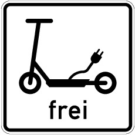

# Verordnung über die Teilnahme von Elektrokleinstfahrzeugen am Straßenverkehr (eKFV)

Ausfertigungsdatum
:   2019-06-06

Fundstelle
:   BGBl I: 2019, 756

Zuletzt geändert durch
:   Art. 3 V v. 10.6.2024 I Nr. 191

Änderung durch
:   Art. 1 V v. 30.1.2026 I Nr. 32 textlich nachgewiesen, dokumentarisch noch nicht abschließend bearbeitet

Änderung durch
:   Art. 2 V v. 30.1.2026 I Nr. 32 textlich nachgewiesen, dokumentarisch noch nicht abschließend bearbeitet

[^F807515_01_BJNR075610019]:     Notifiziert gemäß Richtlinie (EU) 2015/1535 des Europäischen
    Parlaments und des Rates vom 9. September 2015 über ein
    Informationsverfahren auf dem Gebiet der technischen Vorschriften und
    der Vorschriften für die Dienste der Informationsgesellschaft (ABl. L
    241 vom 17.9.2015, S. 1).

## § 3 Berechtigung zum Führen
[Direktlink](https://www.gesetze-im-internet.de/ekfv/BJNR075610019.html#BJNR075610019BJNE000300000)

Zum Führen eines Elektrokleinstfahrzeugs sind Personen berechtigt, die
das 14. Lebensjahr vollendet haben.

## § 8 Personenbeförderung und Anhängerbetrieb
[Direktlink](https://www.gesetze-im-internet.de/ekfv/BJNR075610019.html#BJNR075610019BJNE000800000)

Die Personenbeförderung sowie der Anhängerbetrieb sind für
Elektrokleinstfahrzeuge nicht gestattet.

## § 9 Anwendung der Straßenverkehrs-Ordnung
[Direktlink](https://www.gesetze-im-internet.de/ekfv/BJNR075610019.html#BJNR075610019BJNE000900000)

Wer ein Elektrokleinstfahrzeug im Straßenverkehr führt, unterliegt den
Vorschriften der Straßenverkehrs-Ordnung nach Maßgabe der
nachfolgenden §§ 10 bis 13.

## § 10 Zulässige Verkehrsflächen
[Direktlink](https://www.gesetze-im-internet.de/ekfv/BJNR075610019.html#BJNR075610019BJNE001000000)

(1) Innerhalb geschlossener Ortschaften dürfen Elektrokleinstfahrzeuge
nur baulich angelegte Radwege, darunter auch gemeinsame Geh- und
Radwege (Zeichen 240 der Anlage 2 zur Straßenverkehrs-Ordnung) und die
dem Radverkehr zugeteilte Verkehrsfläche getrennter Rad- und Gehwege
(Zeichen 241 der Anlage 2 zur Straßenverkehrs-Ordnung), sowie
Radfahrstreifen (Zeichen 237 in Verbindung mit Zeichen 295 der Anlage
2 zur Straßenverkehrs-Ordnung) und Fahrradstraßen (Zeichen 244.1 der
Anlage 2 zur Straßenverkehrs-Ordnung) befahren. Wenn solche nicht
vorhanden sind, darf auf Fahrbahnen oder in verkehrsberuhigten
Bereichen (Zeichen 325.1 der Anlage 3 zur Straßenverkehrs-Ordnung)
gefahren werden. Anlage 3 laufende Nummer 22 Nummer 2 der
Straßenverkehrs-Ordnung findet keine Anwendung.

(2) Außerhalb geschlossener Ortschaften dürfen Elektrokleinstfahrzeuge
nur baulich angelegte Radwege, darunter auch gemeinsame Geh- und
Radwege (Zeichen 240 der Anlage 2 zur Straßenverkehrs-Ordnung) und die
dem Radverkehr zugeteilte Verkehrsfläche getrennter Rad- und Gehwege
(Zeichen 241 der Anlage 2 zur Straßenverkehrs-Ordnung), sowie
Radfahrstreifen (Zeichen 237 in Verbindung mit Zeichen 295 der Anlage
2 zur Straßenverkehrs-Ordnung), Fahrradstraßen (Zeichen 244.1 der
Anlage 2 zur Straßenverkehrs-Ordnung) und Seitenstreifen befahren.
Wenn solche nicht vorhanden sind, darf auf Fahrbahnen gefahren werden.

(3) Für das Befahren von anderen Verkehrsflächen können die
Straßenverkehrsbehörden abweichend von Absatz 1 und 2 Ausnahmen für
bestimmte Einzelfälle oder allgemein für bestimmte Antragsteller
zulassen. Eine allgemeine Zulassung von Elektrokleinstfahrzeugen auf
solchen Verkehrsflächen kann durch Anordnung des Zusatzzeichens

*    *        

*    *   „Elektrokleinstfahrzeuge frei“

bekannt gegeben werden.

## § 11 Allgemeine Verhaltensregeln
[Direktlink](https://www.gesetze-im-internet.de/ekfv/BJNR075610019.html#BJNR075610019BJNE001100000)

(1) Wer ein Elektrokleinstfahrzeug führt, muss einzeln hintereinander
fahren, darf sich nicht an fahrende Fahrzeuge anhängen und nicht
freihändig fahren.

(2) Mit Elektrokleinstfahrzeugen darf von dem Gebot, auf Fahrbahnen
mit mehreren Fahrstreifen möglichst weit rechts zu fahren, nicht
abgewichen werden.

(3) Sind an einem Elektrokleinstfahrzeug keine Fahrtrichtungsanzeiger
vorhanden, so muss wer ein Elektrokleinstfahrzeug führt, die
Richtungsänderung so rechtzeitig und deutlich durch Handzeichen
ankündigen, dass andere Verkehrsteilnehmer ihr Verhalten daran
ausrichten können.

(4) Wer ein Elektrokleinstfahrzeug auf Radverkehrsflächen führt, muss
auf den Radverkehr Rücksicht nehmen und erforderlichenfalls die
Geschwindigkeit an den Radverkehr anpassen. Wer ein
Elektrokleinstfahrzeug führt, muss schnellerem Radverkehr das
Überholen ohne Behinderung ermöglichen. Auf gemeinsamen Geh- und
Radwegen (Zeichen 240 der Anlage 2 zur Straßenverkehrs-Ordnung) haben
Fußgänger Vorrang und dürfen weder behindert noch gefährdet werden.
Erforderlichenfalls muss die Geschwindigkeit an den Fußgängerverkehr
angepasst werden.

(5) Für das Abstellen von Elektrokleinstfahrzeugen gelten die für
Fahrräder geltenden Parkvorschriften entsprechend.

## § 12 Besonderheiten bei angeordneten Verkehrsverboten nach der Straßenverkehrs-Ordnung
[Direktlink](https://www.gesetze-im-internet.de/ekfv/BJNR075610019.html#BJNR075610019BJNE001200000)

(1) Ist ein Verbot für Fahrzeuge aller Art (Zeichen 250 der Anlage 2
zur Straßenverkehrs-Ordnung) angeordnet, so dürfen
Elektrokleinstfahrzeuge dort geschoben werden.

(2) Ist ein Verbot für Kraftwagen (Zeichen 251 der Anlage 2 zur
Straßenverkehrs-Ordnung), ein Verbot für Krafträder (Zeichen 255 der
Anlage 2 zur Straßenverkehrs-Ordnung), ein Verbot für Kraftfahrzeuge
(Zeichen 260 der Anlage 2 zur Straßenverkehrs-Ordnung) oder ein Verbot
der Einfahrt (Zeichen 267 der Anlage 2 zur Straßenverkehrs-Ordnung)
angeordnet, so dürfen Elektrokleinstfahrzeuge dort nur fahren oder
einfahren, wenn dies durch das Zusatzzeichen „Elektrokleinstfahrzeuge
frei“ erlaubt ist.

(3) Ist ein Verbot für den Radverkehr (Zeichen 254 der Anlage 2 zur
Straßenverkehrs-Ordnung) angeordnet, so gilt dies auch für
Elektrokleinstfahrzeuge.

## § 13 Lichtzeichen
[Direktlink](https://www.gesetze-im-internet.de/ekfv/BJNR075610019.html#BJNR075610019BJNE001300000)

Elektrokleinstfahrzeuge unterfallen der Lichtzeichenregelung des § 37
Absatz 2 Nummer 5 und 6 der Straßenverkehrs-Ordnung. Dabei kommt das
Sinnbild „Radverkehr“ zur Anwendung.

