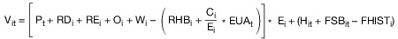

# Gesetz über die Elektrizitäts- und Gasversorgung (EnWG 2005)

Ausfertigungsdatum
:   2005-07-07

Fundstelle
:   BGBl I: 2005, 1970 (3621)

Zuletzt geändert durch
:   Art. 5 G v. 29.3.2026 I Nr. 84

Stand: Das G ist gem. Art. 5 Abs. 1 G v. 7.7.2005 I 1970 am 13.7.2005 in Kraft getreten
Dieses Gesetz dient der Umsetzung der Richtlinie 2003/54/EG des
Europäischen Parlaments und des Rates vom 26. Juni 2003 über
gemeinsame Vorschriften für den Elektrizitätsbinnenmarkt und zur
Aufhebung der Richtlinie 96/92/EG (ABl. EU Nr. L 176 S. 37), der
Richtlinie 2003/55/EG des Europäischen Parlaments und des Rates vom
26\. Juni 2003 über gemeinsame Vorschriften für den Erdgasbinnenmarkt
und zur Aufhebung der Richtlinie 98/30/EG (ABl. EU Nr. L 176 S. 57),
der Richtlinie 2004/67/EG des Rates vom 26. April 2004 über Maßnahmen
zur Gewährleistung der sicheren Erdgasversorgung (ABl. EU Nr. L 127 S.
92) und der Richtlinie 2006/32/EG des Europäischen Parlaments und des
Rates vom 5. April 2006 über Endenergieeffizienz und
Energiedienstleistungen und zur Aufhebung der Richtlinie 93/76/EWG des
Rates (ABl. EU Nr. L 114 S. 64).

## Teil 1 - Allgemeine Vorschriften
[Direktlink](https://www.gesetze-im-internet.de/enwg_2005/BJNR197010005.html#BJNR197010005BJNG000100000)

### § 1 Zweck und Ziele des Gesetzes
[Direktlink](https://www.gesetze-im-internet.de/enwg_2005/BJNR197010005.html#BJNR197010005BJNE000205377)

(1) Zweck des Gesetzes ist eine möglichst sichere, preisgünstige,
verbraucherfreundliche, effiziente, umweltverträgliche und
treibhausgasneutrale leitungsgebundene Versorgung der Allgemeinheit
mit Elektrizität, Gas und Wasserstoff, die zunehmend auf erneuerbaren
Energien beruht.

(2) Die Regulierung der Elektrizitäts- und Gasversorgungsnetze dient
den Zielen der Sicherstellung eines wirksamen und unverfälschten
Wettbewerbs bei der Versorgung mit Elektrizität und Gas, der Sicherung
eines langfristig angelegten leistungsfähigen und zuverlässigen
Betriebs von Energieversorgungsnetzen sowie der gesamtwirtschaftlich
optimierten Energieversorgung. Zur Verfolgung der Ziele in Absatz 1
berücksichtigt die Regulierung insbesondere

1.  den vorausschauenden Ausbau, die optimierte Nutzung und die
    Digitalisierung der Energieversorgungsnetze,

2.  die Erzeugung und Nutzung von Strom aus erneuerbaren Energien und
    Wasserstoff,

3.  die Flexibilisierung im Elektrizitätssystem, einschließlich der
    Nutzung von Energiespeichern sowie

4.  eine angemessene Verteilung der Netzkosten im Zusammenhang mit dem
    Ausbau der Stromerzeugung aus erneuerbaren Energien.

(3) Zweck dieses Gesetzes ist ferner die Umsetzung und Durchführung
des Europäischen Gemeinschaftsrechts auf dem Gebiet der
leitungsgebundenen Energieversorgung.

(4) Um den Zweck des Absatzes 1 auf dem Gebiet der leitungsgebundenen
Versorgung der Allgemeinheit mit Elektrizität zu erreichen, verfolgt
dieses Gesetz insbesondere die Ziele,

1.  die freie Preisbildung für Elektrizität durch wettbewerbliche
    Marktmechanismen zu stärken,

2.  den Ausgleich von Angebot und Nachfrage nach Elektrizität an den
    Strommärkten jederzeit zu ermöglichen,

3.  dass Erzeugungsanlagen, Anlagen zur Speicherung elektrischer Energie
    und Lasten insbesondere möglichst umweltverträglich, netzverträglich,
    effizient und flexibel in dem Umfang eingesetzt werden, der
    erforderlich ist, um die Sicherheit und Zuverlässigkeit des
    Elektrizitätsversorgungssystems zu gewährleisten, und

4.  den Elektrizitätsbinnenmarkt zu stärken sowie die Zusammenarbeit
    insbesondere mit den an das Gebiet der Bundesrepublik Deutschland
    angrenzenden Staaten sowie mit dem Königreich Norwegen und dem
    Königreich Schweden zu intensivieren.

### § 1a Grundsätze des Strommarktes
[Direktlink](https://www.gesetze-im-internet.de/enwg_2005/BJNR197010005.html#BJNR197010005BJNE022001118)

(1) Der Preis für Elektrizität bildet sich nach wettbewerblichen
Grundsätzen frei am Markt. Die Höhe der Preise für Elektrizität am
Großhandelsmarkt wird regulatorisch nicht beschränkt.

(2) Das Bilanzkreis- und Ausgleichsenergiesystem hat eine zentrale
Bedeutung für die Gewährleistung der
Elektrizitätsversorgungssicherheit. Daher sollen die Bilanzkreistreue
der Bilanzkreisverantwortlichen und eine ordnungsgemäße
Bewirtschaftung der Bilanzkreise sichergestellt werden.

(3) Es soll insbesondere auf eine Flexibilisierung von Angebot und
Nachfrage hingewirkt werden. Ein Wettbewerb zwischen effizienten und
flexiblen Erzeugungsanlagen, Anlagen zur Speicherung elektrischer
Energie und Lasten, eine effiziente Kopplung des Wärme- und des
Verkehrssektors mit dem Elektrizitätssektor sowie die Integration der
Ladeinfrastruktur für Elektromobile in das
Elektrizitätsversorgungssystem sollen die Kosten der Energieversorgung
verringern, die Transformation zu einem umweltverträglichen,
zuverlässigen und bezahlbaren Energieversorgungssystem ermöglichen und
die Versorgungssicherheit gewährleisten.

(4) Elektrizitätsversorgungsnetze sollen bedarfsgerecht unter
Berücksichtigung des Ausbaus der Stromerzeugung aus erneuerbaren
Energien nach § 4 des Erneuerbare-Energien-Gesetzes, der
Versorgungssicherheit sowie volkswirtschaftlicher Effizienz ausgebaut
werden.

(5) Die Transparenz am Strommarkt soll erhöht werden.

(6) Als Beitrag zur Verwirklichung des Elektrizitätsbinnenmarktes
sollen eine stärkere Einbindung des Strommarktes in die europäischen
Strommärkte und eine stärkere Angleichung der Rahmenbedingungen in den
europäischen Strommärkten, insbesondere mit den an das Gebiet der
Bundesrepublik Deutschland angrenzenden Staaten sowie dem Königreich
Norwegen und dem Königreich Schweden, angestrebt werden. Es sollen die
notwendigen Verbindungsleitungen ausgebaut, die Marktkopplung und der
grenzüberschreitende Stromhandel gestärkt sowie die Regelenergiemärkte
und die vortägigen und untertägigen Spotmärkte stärker integriert
werden.

### § 2 Aufgaben der Energieversorgungsunternehmen
[Direktlink](https://www.gesetze-im-internet.de/enwg_2005/BJNR197010005.html#BJNR197010005BJNE000301377)

(1) Energieversorgungsunternehmen sind im Rahmen der Vorschriften
dieses Gesetzes zu einer Versorgung im Sinne des § 1 verpflichtet.

(2) Die Verpflichtungen nach dem Erneuerbare-Energien-Gesetz und nach
dem Kraft-Wärme-Kopplungsgesetz bleiben vorbehaltlich des § 13, auch
in Verbindung mit § 14, unberührt.

### § 3a Verhältnis zum Eisenbahnrecht
[Direktlink](https://www.gesetze-im-internet.de/enwg_2005/BJNR197010005.html#BJNR197010005BJNE000500000)

Dieses Gesetz gilt auch für die Versorgung von Eisenbahnen mit
leitungsgebundener Energie, insbesondere Fahrstrom, soweit im
Eisenbahnrecht nichts anderes geregelt ist.

### § 4 Genehmigung des Netzbetriebs
[Direktlink](https://www.gesetze-im-internet.de/enwg_2005/BJNR197010005.html#BJNR197010005BJNE000602140)

(1) Die Aufnahme des Betriebs eines Energieversorgungsnetzes bedarf
der Genehmigung durch die nach Landesrecht zuständige Behörde. Über
die Erteilung der Genehmigung entscheidet die nach Landesrecht
zuständige Behörde innerhalb von sechs Monaten nach Vorliegen
vollständiger Antragsunterlagen.

(2) Die Genehmigung nach Absatz 1 darf nur versagt werden, wenn der
Antragsteller nicht die personelle, technische und wirtschaftliche
Leistungsfähigkeit und Zuverlässigkeit besitzt, um den Netzbetrieb
entsprechend den Vorschriften dieses Gesetzes auf Dauer zu
gewährleisten. Unter den gleichen Voraussetzungen kann auch der
Betrieb einer in Absatz 1 genannten Anlage untersagt werden, für
dessen Aufnahme keine Genehmigung erforderlich war.

(3) Im Falle der Gesamtrechtsnachfolge oder der Rechtsnachfolge nach
dem Umwandlungsgesetz oder in sonstigen Fällen der rechtlichen
Entflechtung des Netzbetriebs nach § 7 oder den §§ 8 bis 10 geht die
Genehmigung auf den Rechtsnachfolger über.

(4) Die nach Landesrecht zuständige Behörde kann bei einem Verstoß
gegen Absatz 1 den Netzbetrieb untersagen oder den Netzbetreiber durch
andere geeignete Maßnahmen vorläufig verpflichten, ein Verhalten
abzustellen, das einen Versagungsgrund im Sinne des Absatzes 2
darstellen würde.

(5) Das Verfahren nach Absatz 1 kann über eine einheitliche Stelle
abgewickelt werden.

### § 4c Pflichten der Transportnetzbetreiber
[Direktlink](https://www.gesetze-im-internet.de/enwg_2005/BJNR197010005.html#BJNR197010005BJNE014502118)

Die Transportnetzbetreiber haben die Regulierungsbehörde unverzüglich
über alle geplanten Transaktionen und Maßnahmen sowie sonstige
Umstände zu unterrichten, die eine Neubewertung der
Zertifizierungsvoraussetzungen nach den §§ 4a und 4b erforderlich
machen können. Sie haben die Regulierungsbehörde insbesondere über
Umstände zu unterrichten, in deren Folge eine oder mehrere Personen
aus einem oder mehreren Drittstaaten allein oder gemeinsam die
Kontrolle über den Transportnetzbetreiber erhalten. Die
Regulierungsbehörde hat das Bundesministerium für Wirtschaft und
Energie und die Europäische Kommission unverzüglich über Umstände nach
Satz 2 zu informieren. Das Bundesministerium für Wirtschaft und
Energie kann bei Vorliegen von Umständen nach Satz 2 seine Bewertung
nach § 4b Absatz 1 widerrufen.

### § 4d Widerruf der Zertifizierung nach § 4a, nachträgliche Versehung mit Auflagen
[Direktlink](https://www.gesetze-im-internet.de/enwg_2005/BJNR197010005.html#BJNR197010005BJNE014600310)

Die Regulierungsbehörde kann eine Zertifizierung nach § 4a oder § 4b
widerrufen oder erweitern oder eine Zertifizierung nachträglich mit
Auflagen versehen sowie Auflagen ändern oder ergänzen, soweit auf
Grund geänderter tatsächlicher Umstände eine Neubewertung der
Zertifizierungsvoraussetzungen erforderlich wird. Die
Regulierungsbehörde kann eine Zertifizierung auch nachträglich mit
Auflagen versehen sowie Auflagen ändern oder ergänzen. Insbesondere
kann sie dem Transportnetzbetreiber Maßnahmen aufgeben, die
erforderlich sind, um zu gewährleisten, dass der
Transportnetzbetreiber die Anforderungen der §§ 8 bis 10e erfüllt. §
65 bleibt unberührt.

## Teil 2 - Entflechtung
[Direktlink](https://www.gesetze-im-internet.de/enwg_2005/BJNR197010005.html#BJNR197010005BJNG000201310)

### Abschnitt 1 - Gemeinsame Vorschriften für Verteilernetzbetreiber und Transportnetzbetreiber
[Direktlink](https://www.gesetze-im-internet.de/enwg_2005/BJNR197010005.html#BJNR197010005BJNG002400310)

#### § 6a Verwendung von Informationen
[Direktlink](https://www.gesetze-im-internet.de/enwg_2005/BJNR197010005.html#BJNR197010005BJNE014802126)

(1) Unbeschadet gesetzlicher Verpflichtungen zur Offenbarung von
Informationen haben vertikal integrierte Unternehmen,
Transportnetzeigentümer, Netzbetreiber, Gasspeicheranlagenbetreiber
sowie Betreiber von LNG-Anlagen sicherzustellen, dass die
Vertraulichkeit wirtschaftlich sensibler Informationen, von denen sie
in Ausübung ihrer Geschäftstätigkeit als Transportnetzeigentümer,
Netzbetreiber, Gasspeicheranlagenbetreiber sowie Betreiber von LNG-
Anlagen Kenntnis erlangen, gewahrt wird.

(2) Legen das vertikal integrierte Unternehmen,
Transportnetzeigentümer, Netzbetreiber, ein
Gasspeicheranlagenbetreiber oder ein Betreiber von LNG-Anlagen über
die eigenen Tätigkeiten Informationen offen, die wirtschaftliche
Vorteile bringen können, so stellen sie sicher, dass dies in nicht
diskriminierender Weise erfolgt. Sie stellen insbesondere sicher, dass
wirtschaftlich sensible Informationen gegenüber anderen Teilen des
Unternehmens vertraulich behandelt werden.

#### § 6c Ordnungsgeldvorschriften
[Direktlink](https://www.gesetze-im-internet.de/enwg_2005/BJNR197010005.html#BJNR197010005BJNE015004377)

(1) Die Ordnungsgeldvorschriften der §§ 335 bis 335b des
Handelsgesetzbuchs sind auf die Verletzung der Pflichten zur
Offenlegung des Jahresabschlusses und Lageberichts nach § 6b Absatz 1
Satz 1 oder des Tätigkeitsabschlusses nach § 6b Absatz 4 entsprechend
anzuwenden. Das Ordnungsgeldverfahren kann durchgeführt werden

1.  bei einer juristischen Person gegen die juristische Person oder die
    Mitglieder des vertretungsberechtigten Organs;

2.  bei einer Personenhandelsgesellschaft im Sinne des § 264a Absatz 1 des
    Handelsgesetzbuchs gegen die Personenhandelsgesellschaft oder gegen
    die in § 335b Satz 2 des Handelsgesetzbuchs genannten Personen;

3.  bei einer Personenhandelsgesellschaft, die nicht in Nummer 2 genannt
    ist, gegen die Personenhandelsgesellschaft oder den oder die
    vertretungsbefugten Gesellschafter;

4.  bei einem Unternehmen, das in der Rechtsform des Einzelkaufmanns
    betrieben wird, gegen den Inhaber oder dessen gesetzlichen Vertreter.

§ 329 des Handelsgesetzbuchs ist entsprechend anzuwenden.

(2) Die nach § 54 Absatz 1 zuständige Regulierungsbehörde übermittelt
der das Unternehmensregister führenden Stelle einmal pro Kalenderjahr
Name und Anschrift der ihr bekannt werdenden Unternehmen nach § 6b
Absatz 1 Satz 1.

#### § 6d Betrieb eines Kombinationsnetzbetreibers
[Direktlink](https://www.gesetze-im-internet.de/enwg_2005/BJNR197010005.html#BJNR197010005BJNE015100310)

Der gemeinsame Betrieb eines Transport- sowie eines Verteilernetzes
durch denselben Netzbetreiber ist zulässig, soweit dieser
Netzbetreiber die Bestimmungen der §§ 8 oder 9 oder §§ 10 bis 10e
einhält.

### Abschnitt 2 - Entflechtung von Verteilernetzbetreibern und Betreibern von Gasspeicheranlagen
[Direktlink](https://www.gesetze-im-internet.de/enwg_2005/BJNR197010005.html#BJNR197010005BJNG002501377)

#### § 7b Entflechtung von Gasspeicheranlagenbetreibern und Transportnetzeigentümern
[Direktlink](https://www.gesetze-im-internet.de/enwg_2005/BJNR197010005.html#BJNR197010005BJNE015302126)

Auf Transportnetzeigentümer, soweit ein Unabhängiger Systembetreiber
im Sinne des § 9 benannt wurde, und auf Betreiber von
Gasspeicheranlagen, die Teil eines vertikal integrierten Unternehmens
sind und zu denen der Zugang technisch und wirtschaftlich erforderlich
ist für einen effizienten Netzzugang im Hinblick auf die Belieferung
von Kunden, sind § 7 Absatz 1 und § 7a Absatz 1 bis 5 entsprechend
anwendbar.

### Abschnitt 3 - Besondere Entflechtungsvorgaben für Transportnetzbetreiber
[Direktlink](https://www.gesetze-im-internet.de/enwg_2005/BJNR197010005.html#BJNR197010005BJNG002600310)

#### § 8 Eigentumsrechtliche Entflechtung
[Direktlink](https://www.gesetze-im-internet.de/enwg_2005/BJNR197010005.html#BJNR197010005BJNE001004126)

(1) Vertikal integrierte Unternehmen haben sich nach Maßgabe der
folgenden Absätze zu entflechten, soweit sie nicht von einer der in §
9 oder den §§ 10 bis 10e enthaltenen Möglichkeiten Gebrauch machen.

(2) Der Transportnetzbetreiber hat unmittelbar oder vermittelt durch
Beteiligungen Eigentümer des Transportnetzes zu sein. Personen, die
unmittelbar oder mittelbar die Kontrolle über ein Unternehmen ausüben,
das eine der Funktionen Gewinnung, Erzeugung oder Vertrieb von Energie
an Kunden wahrnimmt, sind nicht berechtigt, unmittelbar oder mittelbar
Kontrolle über einen Betreiber eines Transportnetzes oder ein
Transportnetz oder Rechte an einem Betreiber eines Transportnetzes
oder einem Transportnetz auszuüben. Personen, die unmittelbar oder
mittelbar die Kontrolle über einen Transportnetzbetreiber oder ein
Transportnetz ausüben, sind nicht berechtigt, unmittelbar oder
mittelbar Kontrolle über ein Unternehmen, das eine der Funktionen
Gewinnung, Erzeugung oder Vertrieb von Energie an Kunden wahrnimmt,
oder Rechte an einem solchen Unternehmen auszuüben. Insbesondere sind
Übertragungsnetzbetreiber nicht berechtigt, Eigentümer einer
Energiespeicheranlage zu sein oder eine solche zu errichten, zu
verwalten oder zu betreiben. Personen, die unmittelbar oder mittelbar
die Kontrolle über ein Unternehmen ausüben, das eine der Funktionen
Gewinnung, Erzeugung oder Vertrieb von Energie an Kunden wahrnimmt,
oder Rechte an einem solchen Unternehmen ausüben, sind nicht
berechtigt, Mitglieder des Aufsichtsrates oder der zur gesetzlichen
Vertretung berufenen Organe eines Betreibers von Transportnetzen zu
bestellen. Personen, die Mitglied des Aufsichtsrates oder der zur
gesetzlichen Vertretung berufenen Organe eines Unternehmens sind, das
eine Funktion der Gewinnung, Erzeugung oder Vertrieb von Energie an
Kunden wahrnimmt, sind nicht berechtigt, Mitglied des Aufsichtsrates
oder der zur gesetzlichen Vertretung berufenen Organe des
Transportnetzbetreibers zu sein. Rechte im Sinne von Satz 2, 3 und 5
sind insbesondere:

1.  die Befugnis zur Ausübung von Stimmrechten, soweit dadurch wesentliche
    Minderheitsrechte vermittelt werden, insbesondere in den in § 179
    Absatz 2 des Aktiengesetzes, § 182 Absatz 1 des Aktiengesetzes sowie §
    193 Absatz 1 des Aktiengesetzes geregelten oder vergleichbaren
    Bereichen,

2.  die Befugnis, Mitglieder des Aufsichtsrates oder der zur gesetzlichen
    Vertretung berufenen Organe zu bestellen,

3.  das Halten einer Mehrheitsbeteiligung.

Die Verpflichtung nach Satz 1 gilt als erfüllt, wenn zwei oder mehr
Unternehmen, die Eigentümer von Transportnetzen sind, ein
Gemeinschaftsunternehmen gründen, das in zwei oder mehr
Mitgliedstaaten als Betreiber für die betreffenden Transportnetze
tätig ist. Ein anderes Unternehmen darf nur dann Teil des
Gemeinschaftsunternehmens sein, wenn es nach den Vorschriften dieses
Abschnitts entflochten und zertifiziert wurde. Transportnetzbetreiber
haben zu gewährleisten, dass sie über die finanziellen, materiellen,
technischen und personellen Mittel verfügen, die erforderlich sind, um
die Aufgaben nach Teil 3 Abschnitt 1 bis 3 wahrzunehmen.

(3) Im unmittelbaren Zusammenhang mit einem Entflechtungsvorgang nach
Absatz 1 dürfen weder wirtschaftlich sensible Informationen nach § 6a,
über die ein Transportnetzbetreiber verfügt, der Teil eines vertikal
integrierten Unternehmens war, an Unternehmen übermittelt werden, die
eine der Funktionen Gewinnung, Erzeugung oder Vertrieb von Energie an
Kunden wahrnehmen, noch ein Personalübergang vom
Transportnetzbetreiber zu diesen Unternehmen stattfinden.

#### § 10a Vermögenswerte, Anlagen, Personalausstattung, Unternehmensidentität des Unabhängigen Transportnetzbetreibers
[Direktlink](https://www.gesetze-im-internet.de/enwg_2005/BJNR197010005.html#BJNR197010005BJNE015401126)

(1) Unabhängige Transportnetzbetreiber müssen über die finanziellen,
technischen, materiellen und personellen Mittel verfügen, die zur
Erfüllung der Pflichten aus diesem Gesetz und für den
Transportnetzbetrieb erforderlich sind. Unabhängige
Transportnetzbetreiber haben, unmittelbar oder vermittelt durch
Beteiligungen, Eigentümer an allen für den Transportnetzbetrieb
erforderlichen Vermögenswerten, einschließlich des Transportnetzes, zu
sein.

(2) Personal, das für den Betrieb des Transportnetzes erforderlich
ist, darf nicht in anderen Gesellschaften des vertikal integrierten
Unternehmens angestellt sein. Arbeitnehmerüberlassungen des
Unabhängigen Transportnetzbetreibers an das vertikal integrierte
Unternehmen sowie Arbeitnehmerüberlassungen des vertikal integrierten
Unternehmens an den Unabhängigen Transportnetzbetreiber sind
unzulässig.

(3) Andere Teile des vertikal integrierten Unternehmens haben die
Erbringung von Dienstleistungen durch eigene oder in ihrem Auftrag
handelnde Personen für den Unabhängigen Transportnetzbetreiber zu
unterlassen. Die Erbringung von Dienstleistungen für das vertikal
integrierte Unternehmen durch den Unabhängigen Transportnetzbetreiber
ist nur zulässig, soweit

1.  die Dienstleistungen grundsätzlich für alle Nutzer des Transportnetzes
    diskriminierungsfrei zugänglich sind und der Wettbewerb in den
    Bereichen Erzeugung, Gewinnung und Lieferung nicht eingeschränkt,
    verzerrt oder unterbunden wird;

2.  die vertraglichen Bedingungen für die Erbringung der Dienstleistung
    durch den Unabhängigen Transportnetzbetreiber für das vertikal
    integrierte Unternehmen der Regulierungsbehörde vorgelegt und von
    dieser geprüft wurden und

3.  die Dienstleistungen weder die Abrechnung erbrachter Dienstleistungen
    gegenüber dem Kunden für das vertikal integrierte Unternehmen im
    Bereich der Funktionen Erzeugung, Gewinnung, Verteilung, Lieferung von
    Elektrizität oder Erdgas oder Speicherung von Erdgas noch andere
    Dienstleistungen umfassen, deren Wahrnehmung durch den Unabhängigen
    Transportnetzbetreiber geeignet ist, Wettbewerber des vertikal
    integrierten Unternehmens zu diskriminieren.

Die Befugnisse der Regulierungsbehörde nach § 65 bleiben unberührt.

(4) Der Unabhängige Transportnetzbetreiber hat sicherzustellen, dass
hinsichtlich seiner Firma, seiner Kommunikation mit Dritten sowie
seiner Markenpolitik und Geschäftsräume eine Verwechslung mit dem
vertikal integrierten Unternehmen oder irgendeinem Teil davon
ausgeschlossen ist.

(5) Unabhängige Transportnetzbetreiber müssen die gemeinsame Nutzung
von Anwendungssystemen der Informationstechnologie mit jeglichem
Unternehmensteil des vertikal integrierten Unternehmens unterlassen,
soweit diese Anwendungen der Informationstechnologie auf die
unternehmerischen Besonderheiten des Unabhängigen
Transportnetzbetreibers oder des vertikal integrierten Unternehmens
angepasst wurden. Unabhängige Transportnetzbetreiber haben die
gemeinsame Nutzung von Infrastruktur der Informationstechnologie mit
jeglichem Unternehmensteil des vertikal integrierten Unternehmens zu
unterlassen, es sei denn, die Infrastruktur

1.  befindet sich außerhalb der Geschäftsräume des Unabhängigen
    Transportnetzbetreibers und des vertikal integrierten Unternehmens und

2.  wird von Dritten zur Verfügung gestellt und betrieben.

Unabhängige Transportnetzbetreiber und vertikal integrierte
Unternehmen haben sicherzustellen, dass sie in Bezug auf
Anwendungssysteme der Informationstechnologie und Infrastruktur der
Informationstechnologie, die sich in Geschäfts- oder Büroräumen des
Unabhängigen Transportnetzbetreibers oder des vertikal integrierten
Unternehmens befindet, nicht mit denselben Beratern oder externen
Auftragnehmern zusammenarbeiten.

(6) Unabhängiger Transportnetzbetreiber und jegliche Unternehmensteile
des vertikal integrierten Unternehmens haben die gemeinsame Nutzung
von Büro- und Geschäftsräumen, einschließlich der gemeinsamen Nutzung
von Zugangskontrollsystemen, zu unterlassen.

(7) Der Unabhängige Transportnetzbetreiber hat die Rechnungslegung von
anderen Abschlussprüfern als denen prüfen zu lassen, die die
Rechnungsprüfung beim vertikal integrierten Unternehmen oder bei
dessen Unternehmensteilen durchführen. Der Abschlussprüfer des
vertikal integrierten Unternehmens kann Einsicht in Teile der Bücher
des Unabhängigen Transportnetzbetreibers nehmen, soweit dies zur
Erteilung des Konzernbestätigungsvermerkes im Rahmen der
Vollkonsolidierung des vertikal integrierten Unternehmens erforderlich
ist. Der Abschlussprüfer ist verpflichtet, aus der Einsicht in die
Bücher des Unabhängigen Transportnetzbetreibers gewonnene Erkenntnisse
und wirtschaftlich sensible Informationen vertraulich zu behandeln und
sie insbesondere nicht dem vertikal integrierten Unternehmen
mitzuteilen.

#### § 10b Rechte und Pflichten im vertikal integrierten Unternehmen
[Direktlink](https://www.gesetze-im-internet.de/enwg_2005/BJNR197010005.html#BJNR197010005BJNE015503377)

(1) Vertikal integrierte Unternehmen müssen gewährleisten, dass
Unabhängige Transportnetzbetreiber wirksame Entscheidungsbefugnisse in
Bezug auf die für den Betrieb, die Wartung und den Ausbau des Netzes
erforderlichen Vermögenswerte des vertikal integrierten Unternehmens
besitzen und diese im Rahmen der Bestimmungen dieses Gesetzes
unabhängig von der Leitung und den anderen betrieblichen Einrichtungen
des vertikal integrierten Unternehmens ausüben können. Unabhängige
Transportnetzbetreiber müssen insbesondere die Befugnis haben, sich
zusätzliche Finanzmittel auf dem Kapitalmarkt durch Aufnahme von
Darlehen oder durch eine Kapitalerhöhung zu beschaffen. Satz 1 und 2
gelten unbeschadet der Entscheidungen des Aufsichtsrates nach § 10d.

(2) Struktur und Satzung des Unabhängigen Transportnetzbetreibers
haben die Unabhängigkeit des Transportnetzbetreibers vom vertikal
integrierten Unternehmen im Sinne der §§ 10 bis 10e sicherzustellen.
Vertikal integrierte Unternehmen haben jegliche unmittelbare oder
mittelbare Einflussnahme auf das laufende Geschäft des Unabhängigen
Transportnetzbetreibers oder den Netzbetrieb zu unterlassen; sie
unterlassen ebenfalls jede unmittelbare oder mittelbare Einflussnahme
auf notwendige Tätigkeiten zur Erstellung des zehnjährigen
Netzentwicklungsplans nach den §§ 12a bis 12f oder nach den §§ 15a bis
15e durch den Unabhängigen Transportnetzbetreiber.

(3) Tochterunternehmen des vertikal integrierten Unternehmens, die die
Funktionen Erzeugung, Gewinnung oder Vertrieb von Energie an Kunden
wahrnehmen, dürfen weder direkt noch indirekt Anteile am
Transportnetzbetreiber halten. Der Transportnetzbetreiber darf weder
direkt oder indirekt Anteile an Tochterunternehmen des vertikal
integrierten Unternehmens, die die Funktionen Erzeugung, Gewinnung
oder Vertrieb von Energie an Kunden wahrnehmen, halten noch Dividenden
oder andere finanzielle Zuwendungen von diesen Tochterunternehmen
erhalten. Insbesondere sind Übertragungsnetzbetreiber nicht
berechtigt, Eigentümer einer Energiespeicheranlage zu sein oder eine
solche zu errichten, zu verwalten oder zu betreiben.

(4) Der Unabhängige Transportnetzbetreiber hat zu gewährleisten, dass
er jederzeit über die notwendigen Mittel für die Errichtung, den
Betrieb und den Erhalt eines sicheren, leistungsfähigen und
effizienten Transportnetzes verfügt.

(5) Das vertikal integrierte Unternehmen und der Unabhängige
Transportnetzbetreiber haben bei zwischen ihnen bestehenden
kommerziellen und finanziellen Beziehungen, einschließlich der
Gewährung von Krediten an das vertikal integrierte Unternehmen durch
den Unabhängigen Transportnetzbetreiber, marktübliche Bedingungen
einzuhalten. Der Transportnetzbetreiber hat alle kommerziellen oder
finanziellen Vereinbarungen mit dem vertikal integrierten Unternehmen
der Regulierungsbehörde in der Zertifizierung zur Genehmigung
vorzulegen. Die Befugnisse der Behörde zur Überprüfung der Pflichten
aus Teil 3 Abschnitt 3 bleiben unberührt. Der Unabhängige
Transportnetzbetreiber hat diese kommerziellen und finanziellen
Beziehungen mit dem vertikal integrierten Unternehmen umfassend zu
dokumentieren und die Dokumentation der Regulierungsbehörde auf
Verlangen zur Verfügung zu stellen.

(6) Die organschaftliche Haftung der Mitglieder von Organen des
vertikal integrierten Unternehmens für Vorgänge in Bereichen, auf die
diese Mitglieder nach diesem Gesetz keinen Einfluss ausüben durften
und tatsächlich keinen Einfluss ausgeübt haben, ist ausgeschlossen.

#### § 10c Unabhängigkeit des Personals und der Unternehmensleitung des Unabhängigen Transportnetzbetreibers
[Direktlink](https://www.gesetze-im-internet.de/enwg_2005/BJNR197010005.html#BJNR197010005BJNE015603126)

(1) Der Unabhängige Transportnetzbetreiber hat der Regulierungsbehörde
die Namen der Personen, die vom Aufsichtsrat als oberste
Unternehmensleitung des Transportnetzbetreibers ernannt oder bestätigt
werden, sowie die Regelungen hinsichtlich der Funktion, für die diese
Personen vorgesehen sind, die Laufzeit der Verträge mit diesen
Personen, die jeweiligen Vertragsbedingungen sowie eine eventuelle
Beendigung der Verträge mit diesen Personen unverzüglich mitzuteilen.
Im Falle einer Vertragsbeendigung hat der Unabhängige
Transportnetzbetreiber der Regulierungsbehörde die Gründe, aus denen
die Vertragsbeendigung vorgesehen ist, vor der Entscheidung
mitzuteilen. Entscheidungen und Regelungen nach Satz 1 werden erst
verbindlich, wenn die Regulierungsbehörde innerhalb von drei Wochen
nach Zugang der Mitteilung des Unabhängigen Transportnetzbetreibers
keine Einwände gegen die Entscheidung erhebt. Die Regulierungsbehörde
kann ihre Einwände gegen die Entscheidung nur darauf stützen, dass
Zweifel bestehen an:

1.  der beruflichen Unabhängigkeit einer ernannten Person der obersten
    Unternehmensleitung oder

2.  der Berechtigung einer vorzeitigen Vertragsbeendigung.

(2) Die Mehrheit der Angehörigen der Unternehmensleitung des
Unabhängigen Transportnetzbetreibers darf in den letzten drei Jahren
vor einer Ernennung nicht bei einem Unternehmen des vertikal
integrierten Unternehmens oder einem Mehrheitsanteilseigner dieser
Unternehmen angestellt gewesen sein oder Interessen- oder
Geschäftsbeziehungen zu einem dieser Unternehmen unterhalten haben.
Die verbleibenden Angehörigen der Unternehmensleitung des Unabhängigen
Transportnetzbetreibers dürfen in den letzten sechs Monaten vor einer
Ernennung keine Aufgaben der Unternehmensleitung und keine mit der
Aufgabe beim Unabhängigen Transportnetzbetreiber vergleichbaren
Aufgaben bei einem Unternehmen des vertikal integrierten Unternehmens
oder einem Mehrheitsanteilseigner dieser Unternehmen wahrgenommen
haben.

(3) Der Unabhängige Transportnetzbetreiber hat sicherzustellen, dass
seine Unternehmensleitung und seine Beschäftigten weder bei anderen
Unternehmensteilen des vertikal integrierten Unternehmens oder bei
deren Mehrheitsanteilseignern angestellt sind noch Interessen- oder
Geschäftsbeziehungen zu ihnen unterhalten. Satz 1 umfasst nicht die zu
marktüblichen Bedingungen erfolgende Belieferung von Energie für den
privaten Verbrauch oder die zu marktüblichen Bedingungen für den
privaten Verbrauch erfolgende Belieferung im Rahmen sonstiger Kauf-
oder Dienstleistungsverträge.

(4) Der Unabhängige Transportnetzbetreiber und das vertikal
integrierte Unternehmen haben zu gewährleisten, dass Personen der
Unternehmensleitung und die übrigen Beschäftigten des Unabhängigen
Transportnetzbetreibers weder direkt noch indirekt Beteiligungen an
Unternehmensteilen des vertikal integrierten Unternehmens halten noch
finanzielle Zuwendungen von diesen erhalten, es sei denn, es handelt
sich um Beteiligungen am Unabhängigen Transportnetzbetreiber oder
Zuwendungen vom Unabhängigen Transportnetzbetreiber. Der Unabhängige
Transportnetzbetreiber hat zu gewährleisten, dass die Vergütung von
Personen der Unternehmensleitung und der übrigen Beschäftigten des
Unabhängigen Transportnetzbetreibers nicht vom wirtschaftlichen
Erfolg, insbesondere vom Betriebsergebnis, des vertikal integrierten
Unternehmens, mit Ausnahme des Unabhängigen Transportnetzbetreibers,
abhängig ist.

(5) Nach Beendigung des Vertragsverhältnisses zum Unabhängigen
Transportnetzbetreiber dürfen Personen der Unternehmensleitung für
vier Jahre bei anderen Unternehmensteilen des vertikal integrierten
Unternehmens als dem Unabhängigen Transportnetzbetreiber oder bei
deren Mehrheitsanteilseignern keine beruflichen Positionen bekleiden
oder berufliche Aufgaben wahrnehmen oder Interessen- oder
Geschäftsbeziehungen zu ihnen unterhalten.

(6) Absatz 2 Satz 1 sowie Absatz 3 und 5 gelten für Personen, die der
obersten Unternehmensleitung unmittelbar unterstellt und für Betrieb,
Wartung oder Entwicklung des Netzes verantwortlich sind, entsprechend.

#### § 10d Aufsichtsrat des Unabhängigen Transportnetzbetreibers
[Direktlink](https://www.gesetze-im-internet.de/enwg_2005/BJNR197010005.html#BJNR197010005BJNE015701377)

(1) Der Unabhängige Transportnetzbetreiber hat über einen Aufsichtsrat
nach Abschnitt 2 des Teils 4 des Aktiengesetzes zu verfügen.

(2) Entscheidungen, die Ernennungen, Bestätigungen,
Beschäftigungsbedingungen für Personen der Unternehmensleitung des
Unabhängigen Transportnetzbetreibers, einschließlich Vergütung und
Vertragsbeendigung, betreffen, werden vom Aufsichtsrat getroffen. Der
Aufsichtsrat entscheidet, abweichend von § 119 des Aktiengesetzes,
auch über die Genehmigung der jährlichen und langfristigen Finanzpläne
des Unabhängigen Transportnetzbetreibers, über die Höhe der
Verschuldung des Unabhängigen Transportnetzbetreibers sowie die Höhe
der an die Anteilseigner des Unabhängigen Transportnetzbetreibers
auszuzahlenden Dividenden. Entscheidungen, die die laufenden Geschäfte
des Transportnetzbetreibers, insbesondere den Netzbetrieb sowie die
Aufstellung des zehnjährigen Netzentwicklungsplans nach den §§ 12a bis
12f oder nach den §§ 15a bis 15e betreffen, sind ausschließlich von
der Unternehmensleitung des Unabhängigen Transportnetzbetreibers zu
treffen.

(3) § 10c Absatz 1 bis 5 gilt für die Hälfte der Mitglieder des
Aufsichtrats des Unabhängigen Transportnetzbetreibers abzüglich einem
Mitglied entsprechend. § 10c Absatz 1 Satz 1 und 2 sowie Satz 4 Nummer
2 gilt für die übrigen Mitglieder des Aufsichtsrates des Unabhängigen
Transportnetzbetreibers entsprechend.

## Teil 3 - Regulierung des Netzbetriebs
[Direktlink](https://www.gesetze-im-internet.de/enwg_2005/BJNR197010005.html#BJNR197010005BJNG000300000)

### Abschnitt 1 - Aufgaben der Netzbetreiber
[Direktlink](https://www.gesetze-im-internet.de/enwg_2005/BJNR197010005.html#BJNR197010005BJNG000400000)

#### § 11a Ausschreibung von Energiespeicheranlagen, Festlegungskompetenz
[Direktlink](https://www.gesetze-im-internet.de/enwg_2005/BJNR197010005.html#BJNR197010005BJNE025100377)

(1) Der Betreiber eines Elektrizitätsversorgungsnetzes kann die
Errichtung, die Verwaltung und den Betrieb einer im Eigentum eines
Dritten stehenden Energiespeicheranlage, die elektrische Energie
erzeugt, in einem offenen, transparenten und diskriminierungsfreien
Verfahren ausschreiben, wenn diese Energiespeicheranlage notwendig
ist, damit der Betreiber eines Elektrizitätsversorgungsnetzes seinen
Verpflichtungen nach § 11 Absatz 1 Satz 1 in effizienter Weise
nachkommen kann. Der Betreiber eines Elektrizitätsversorgungsnetzes
darf einen Zuschlag in einem nach Satz 1 durchgeführten
Ausschreibungsverfahren nicht an einen Dritten erteilen, wenn dieser
die mit der Energiespeicheranlage im Sinne von Satz 1 angebotene
Dienstleistung unter Berücksichtigung der Anforderungen an die
Gewährleistung der Sicherheit und Zuverlässigkeit des
Elektrizitätsversorgungssystems nicht zu angemessenen Kosten oder
nicht rechtzeitig erbringen kann. Angemessen sind die Kosten, wenn sie
die Kosten für die Errichtung, die Verwaltung und den Betrieb einer
vergleichbaren Energiespeicheranlage im Eigentum eines Netzbetreibers
nicht übersteigen.

(2) Der Dritte kann die Anlage nach Absatz 1 Satz 1 so planen und
errichten, dass deren Leistungsfähigkeit die durch den Netzbetreiber
gesetzten Anforderungen übertrifft. Wird die Anlage zeitweise oder
dauerhaft nicht für die Erfüllung der Vereinbarung nach Absatz 1
benötigt, dürfen Leistung und Arbeit in diesem Umfang durch den
Dritten auf den Strommärkten veräußert werden.

(3) Die Bundesnetzagentur wird ermächtigt, durch Festlegung nach § 29
Absatz 1 dem Betreiber eines Elektrizitätsversorgungsnetzes Vorgaben
zur näheren Ausgestaltung des Ausschreibungsverfahrens nach Absatz 1
zu machen.

#### § 11b Ausnahme für Energiespeicheranlagen, Festlegungskompetenz
[Direktlink](https://www.gesetze-im-internet.de/enwg_2005/BJNR197010005.html#BJNR197010005BJNE025202377)

(1) Der Betreiber eines Elektrizitätsversorgungsnetzes darf abweichend
von Teil 2 Abschnitt 2 und 3 Eigentümer sein von
Energiespeicheranlagen, die elektrische Energie erzeugen, oder solche
errichten, verwalten oder betreiben, sofern

1.  die Regulierungsbehörde dies nach Absatz 2 auf Antrag des
    Netzbetreibers genehmigt hat oder

2.  die Regulierungsbehörde dies für Energiespeicheranlagen, die
    vollständig integrierte Netzkomponenten darstellen, durch Festlegung
    gegenüber allen oder einer Gruppe von Netzbetreibern nach § 29 Absatz
    1 gestattet hat; sofern eine vollständig integrierte Netzkomponente
    nicht bereits von einer solchen Festlegung erfasst wird, bleibt der
    Regulierungsbehörde eine Genehmigung auf Antrag des Netzbetreibers im
    Einzelfall unbenommen.

(2) Die Regulierungsbehörde erteilt ihre Genehmigung nach Absatz 1
Nummer 1, wenn

1.  der Betreiber eines Elektrizitätsversorgungsnetzes nachgewiesen hat,
    dass die Energiespeicheranlage im Sinne von Absatz 1

    a)  notwendig ist, damit er seinen Verpflichtungen gemäß § 11 Absatz 1
        Satz 1 in effizienter Weise nachkommen kann,

    b)  neben der bestimmungsgemäßen Nutzung nach Buchstabe a nicht verwendet
        wird, um Leistung oder Arbeit ganz oder teilweise auf den Strommärkten
        zu kaufen oder zu verkaufen, und

2.  der Betreiber eines Elektrizitätsversorgungsnetzes ein offenes,
    transparentes und diskriminierungsfreies Ausschreibungsverfahren nach
    § 11a durchgeführt hat, dessen Bedingungen die Regulierungsbehörde im
    Hinblick auf das technische Einsatzkonzept der Energiespeicheranlage
    im Sinne von Absatz 1 geprüft hat, und

    a)  der Betreiber eines Elektrizitätsversorgungsnetzes den Zuschlag nach
        § 11a Absatz 1 zur Errichtung, zur Verwaltung oder zum Betrieb der
        Energiespeicheranlage im Sinne von Absatz 1 nicht an einen Dritten
        erteilen konnte, oder

    b)  sich nach Erteilung des Zuschlags an einen Dritten herausstellt, dass
        dieser die mit der Energiespeicheranlage im Sinne von Absatz 1
        angebotene Dienstleistung nicht oder nicht rechtzeitig erbringen kann.

Die Regulierungsbehörde hat eine Genehmigung nach Satz 1 der
Europäischen Kommission und der Agentur der Europäischen Union für die
Zusammenarbeit der Energieregulierungsbehörden zusammen mit den
entsprechenden Informationen über den Antrag und mit den Gründen für
die Gewährung der Ausnahme unverzüglich und unter Wahrung des Schutzes
von Betriebs- und Geschäftsgeheimnissen sowie ohne personenbezogene
Daten mitzuteilen.

(3) Soweit eine Genehmigung unter den Voraussetzungen des Absatzes 2
erteilt wurde, führt die Regulierungsbehörde fünf Jahre nach der
Inbetriebnahme der Energiespeicheranlage im Sinne von Absatz 1 und
danach in regelmäßigen Abständen von höchstens fünf Jahren eine
öffentliche Konsultation durch. Dabei ermittelt die
Regulierungsbehörde, ob Dritte zu angemessenen Kosten unter
Berücksichtigung der Anforderungen an die Gewährleistung der
Sicherheit und Zuverlässigkeit des Elektrizitätsversorgungssystems in
der Lage sind, Eigentümer dieser Energiespeicheranlage im Sinne von
Absatz 1 zu sein, diese zu verwalten und zu betreiben. Kann die
Regulierungsbehörde dies mit hinreichender Wahrscheinlichkeit
feststellen, verpflichtet sie den Betreiber eines
Elektrizitätsversorgungsnetzes, den Betrieb und die Verwaltung der
Energiespeicheranlage im Sinne von Absatz 1 gemäß § 11a in Verbindung
mit Absatz 2 Nummer 2 auszuschreiben und nach Erteilung eines
Zuschlags an einen Dritten innerhalb von 12 Monaten einzustellen,
sofern Belange der Versorgungssicherheit nicht entgegenstehen. Mit dem
Betrieb der Energiespeicheranlage im Sinne von Absatz 1 ist auch das
Eigentum gegen Zahlung des Restbuchwertes zu übertragen. Mit
Übertragung des Eigentums erlischt auch die Genehmigung nach Absatz 2.
Die Verpflichtung nach den Sätzen 3 und 4 kann mit Nebenbestimmungen
versehen werden. Nach erfolgter Eigentumsübertragung darf die Leistung
oder Arbeit der Energiespeicheranlage im Sinne von Absatz 1 weder ganz
noch teilweise auf den Strommärkten veräußert werden, solange über die
Energiespeicheranlage im Sinne von Absatz 1 ein Dienstleistungsvertrag
mit dem Betreiber eines Elektrizitätsversorgungsnetzes besteht,
mindestens aber für die Dauer von fünf Jahren, nachdem erstmalig eine
Ausschreibung nach Satz 3 für die Energiespeicheranlage im Sinne von
Absatz 1 durchgeführt wurde.

(4) Während des üblichen kalkulatorischen Abschreibungszeitraums für
Batteriespeicheranlagen ist Absatz 3 nicht anzuwenden, sofern es sich
um Batteriespeicheranlagen im Eigentum

1.  eines Übertragungsnetzbetreibers handelt, für die eine
    Investitionsentscheidung bis zum 31. Dezember 2024 erfolgt, oder eines
    Verteilernetzbetreibers handelt, für die eine Investitionsentscheidung
    bis zum 4. Juli 2019 erfolgte, und

2.  die spätestens zwei Jahre nach der Investitionsentscheidung an das
    Elektrizitätsversorgungsnetz angeschlossen wurden oder werden und die
    ausschließlich der reaktiven unmittelbaren Wiederherstellung des
    sicheren und zuverlässigen Netzbetriebs durch netzbezogene Maßnahmen
    nach § 13 Absatz 1 Satz 1 Nummer 1 dienen.

Die Wiederherstellungsmaßnahme gemäß Satz 1 Nummer 2 beginnt
unmittelbar nach Eintritt der Störung und endet, sobald das Problem
durch Maßnahmen gemäß § 13 Absatz 1 Satz 1 Nummer 2 und 3 behoben
werden kann.

(5) Die Bundesnetzagentur wird ermächtigt, durch Festlegung nach § 29
Absatz 1 Vorgaben zur näheren Ausgestaltung der Genehmigungsverfahren
nach Absatz 1 Nummer 1 in Verbindung mit den Absätzen 2 und 3 sowie
nach Absatz 1 Nummer 2 zweiter Halbsatz zu treffen.

#### § 12a Szenariorahmen für die Netzentwicklungsplanung
[Direktlink](https://www.gesetze-im-internet.de/enwg_2005/BJNR197010005.html#BJNR197010005BJNE015907377)

(1) Die Betreiber von Übertragungsnetzen mit Regelzonenverantwortung
erarbeiten alle zwei Jahre einen gemeinsamen Szenariorahmen, der
Grundlage für die Erarbeitung des Netzentwicklungsplans nach § 12b
ist. Der Szenariorahmen umfasst mindestens drei Entwicklungspfade
(Szenarien), die für die mindestens nächsten zehn und höchstens 15
Jahre die Bandbreite wahrscheinlicher Entwicklungen im Rahmen der
klima- und energiepolitischen Ziele der Bundesregierung abdecken. Drei
weitere Szenarien müssen das Jahr 2045 betrachten und eine Bandbreite
von wahrscheinlichen Entwicklungen darstellen, welche sich an den
gesetzlich festgelegten sowie weiteren klima- und energiepolitischen
Zielen der Bundesregierung ausrichten. Für den Szenariorahmen legen
die Betreiber von Übertragungsnetzen mit Regelzonenverantwortung
angemessene Annahmen für die jeweiligen Szenarien zu Erzeugung,
Versorgung, Verbrauch von Strom sowie dessen Austausch mit anderen
Ländern sowie zur Spitzenkappung nach § 11 Absatz 2 zu Grunde und
berücksichtigen geplante Investitionsvorhaben der europäischen
Netzinfrastruktur. Die Verteilernetzbetreiber werden bei der
Erstellung des Szenariorahmens angemessen eingebunden. Der
Szenariorahmen hat die Festlegungen der Systementwicklungsstrategie
angemessen zu berücksichtigen. Die Bundesregierung legt dem Deutschen
Bundestag alle vier Jahre, beginnend mit dem Jahr 2027, bis zum Ablauf
des 30. September eine Systementwicklungsstrategie vor. Die
Systementwicklungsstrategie umfasst eine Bewertung des Energiesystems
im Rahmen des Zieldreiecks des Energiewirtschaftsgesetzes, eine
Systemkostenplanung einschließlich Szenarien und eine strategische
Planung zur optimalen Nutzung aller sinnvoll verfügbaren
Energieträger; sie formuliert Ziele zur Weiterentwicklung der
Energieversorgung und der Netze für einen Zeitraum von mindestens vier
Jahren.

(2) Die Betreiber von Übertragungsnetzen mit Regelzonenverantwortung
legen der Regulierungsbehörde den Entwurf des Szenariorahmens
spätestens bis zum Ablauf des 30. Juni eines jeden geraden
Kalenderjahres, beginnend mit dem Jahr 2024, vor. Die
Regulierungsbehörde macht den Entwurf des Szenariorahmens auf ihrer
Internetseite öffentlich bekannt und gibt der Öffentlichkeit,
einschließlich tatsächlicher und potenzieller Netznutzer, den
nachgelagerten Netzbetreibern, sowie den Trägern öffentlicher Belange
Gelegenheit zur Äußerung.

(3) Die Regulierungsbehörde genehmigt den Szenariorahmen unter
Berücksichtigung der Ergebnisse der Öffentlichkeitsbeteiligung. Die
Regulierungsbehörde kann nähere Bestimmungen zu Inhalt und Verfahren
der Erstellung des Szenariorahmens, insbesondere zum
Betrachtungszeitraum nach Absatz 1 Satz 2 und 3, treffen. Die
Genehmigung ist nicht selbstständig durch Dritte anfechtbar.

#### § 12b Erstellung des Netzentwicklungsplans durch die Betreiber von Übertragungsnetzen
[Direktlink](https://www.gesetze-im-internet.de/enwg_2005/BJNR197010005.html#BJNR197010005BJNE016008311)

(1) Die Betreiber von Übertragungsnetzen mit Regelzonenverantwortung
legen der Regulierungsbehörde auf der Grundlage des Szenariorahmens
einen gemeinsamen nationalen Netzentwicklungsplan zur Bestätigung vor.
Der gemeinsame nationale Netzentwicklungsplan muss alle wirksamen
Maßnahmen zur bedarfsgerechten Optimierung, Verstärkung und zum Ausbau
des Netzes enthalten, die spätestens zum Ende der jeweiligen
Betrachtungszeiträume im Sinne des § 12a Absatz 1 für einen sicheren
und zuverlässigen Netzbetrieb erforderlich sind. Die Betreiber von
Übertragungsnetzen mit Regelzonenverantwortung müssen im Rahmen der
Erstellung des Netzentwicklungsplans die Regelungen zur Spitzenkappung
nach § 11 Absatz 2 bei der Netzplanung anwenden. Der
Netzentwicklungsplan enthält darüber hinaus folgende Angaben:

1.  alle Netzausbaumaßnahmen, die in den nächsten drei Jahren ab
    Feststellung des Netzentwicklungsplans durch die Regulierungsbehörde
    für einen sicheren und zuverlässigen Netzbetrieb erforderlich sind,

2.  einen Zeitplan für alle Netzausbaumaßnahmen sowie

3.
    a)  Netzausbaumaßnahmen als Pilotprojekte für eine verlustarme Übertragung
        hoher Leistungen über große Entfernungen,

    b)  den Einsatz von Hochtemperaturleiterseilen als Pilotprojekt mit einer
        Bewertung ihrer technischen Durchführbarkeit und Wirtschaftlichkeit
        sowie

    c)  das Ergebnis der Prüfung des Einsatzes von neuen Technologien als
        Pilotprojekte einschließlich einer Bewertung der technischen
        Durchführbarkeit und Wirtschaftlichkeit,

4.  Angaben zur zu verwendenden Übertragungstechnologie,

5.  Darlegung der in Betracht kommenden anderweitigen
    Planungsmöglichkeiten von Netzausbaumaßnahmen,

6.  beginnend mit der Vorlage des ersten Entwurfs des
    Netzentwicklungsplans im Jahr 2018 alle wirksamen Maßnahmen zur
    bedarfsgerechten Optimierung, Verstärkung und zum Ausbau der Offshore-
    Anbindungsleitungen in der ausschließlichen Wirtschaftszone und im
    Küstenmeer einschließlich der Netzanknüpfungspunkte an Land, die bis
    zum Ende der jeweiligen Betrachtungszeiträume nach § 12a Absatz 1 für
    einen schrittweisen, bedarfsgerechten und wirtschaftlichen Ausbau
    sowie einen sicheren und zuverlässigen Betrieb der Offshore-
    Anbindungsleitungen sowie zum Weitertransport des auf See erzeugten
    Stroms oder für eine Anbindung von Testfeldern im Sinne des § 3 Nummer
    9 des Windenergie-auf-See-Gesetzes (Testfeld-Anbindungsleitungen)
    erforderlich sind; für die Maßnahmen nach dieser Nummer werden Angaben
    zum geplanten Zeitpunkt der Fertigstellung vorgesehen; hierbei müssen
    die Festlegungen des zuletzt bekannt gemachten
    Flächenentwicklungsplans nach den §§ 4 bis 8 des Windenergie-auf-See-
    Gesetzes zu Grunde gelegt werden.

Die Betreiber von Übertragungsnetzen mit Regelzonenverantwortung
nutzen bei der Erarbeitung des Netzentwicklungsplans eine geeignete
und für einen sachkundigen Dritten nachvollziehbare Modellierung des
Elektrizitätsversorgungsnetzes. Der Netzentwicklungsplan
berücksichtigt den gemeinschaftsweiten Netzentwicklungsplan nach
Artikel 8 Absatz 3b der Verordnung (EG) Nr. 714/2009 und vorhandene
Offshore-Netzpläne.

(2) Der Netzentwicklungsplan umfasst alle Maßnahmen, die nach den
Szenarien des Szenariorahmens erforderlich sind, um die Anforderungen
nach Absatz 1 Satz 2 zu erfüllen. Dabei ist dem Erfordernis eines
sicheren und zuverlässigen Netzbetriebs in besonderer Weise Rechnung
zu tragen.

(3) Die Betreiber von Übertragungsnetzen mit Regelzonenverantwortung
veröffentlichen den Entwurf des Netzentwicklungsplans vor Vorlage bei
der Regulierungsbehörde auf ihren Internetseiten und geben der
Öffentlichkeit, einschließlich tatsächlicher oder potenzieller
Netznutzer, den nachgelagerten Netzbetreibern sowie den Trägern
öffentlicher Belange und den Energieaufsichtsbehörden der Länder
Gelegenheit zur Äußerung. Dafür stellen sie den Entwurf des
Netzentwicklungsplans und alle weiteren erforderlichen Informationen
im Internet zur Verfügung. Die Betreiber von Übertragungsnetzen mit
Regelzonenverantwortung sollen den Entwurf des Netzentwicklungsplans
spätestens bis zum Ablauf des 31. Mai eines jeden ungeraden
Kalenderjahres, beginnend mit dem Jahr 2025, veröffentlichen. Die
Betreiber von Elektrizitätsversorgungsnetzen sowie die Betreiber von
Fernleitungsnetzen und von Wasserstofftransportnetzen sind
verpflichtet, mit den Betreibern von Übertragungsnetzen mit
Regelzonenverantwortung in dem Umfang zusammenzuarbeiten, der
erforderlich ist, um eine sachgerechte Erstellung des
Netzentwicklungsplans zu gewährleisten; sie sind insbesondere
verpflichtet, den Betreibern von Übertragungsnetzen mit
Regelzonenverantwortung für die Erstellung des Netzentwicklungsplans
notwendige Informationen auf Anforderung unverzüglich zur Verfügung zu
stellen.

(3a) Zum Zeitpunkt der Veröffentlichung nach Absatz 3 Satz 1
übermitteln die Betreiber von Übertragungsnetzen der
Regulierungsbehörde Angaben dazu, welche Netzausbaumaßnahmen zur
Höchstspannungs-Gleichstrom-Übertragung oder welcher
länderübergreifende landseitige Teil von Offshore-Anbindungsleitungen
ganz oder weit überwiegend in einem Trassenkorridor, der bereits gemäß
§ 17 des Netzausbaubeschleunigungsgesetzes Übertragungsnetz in den
Bundesnetzplan aufgenommen ist, oder in einem durch Landesplanungen
oder nach Landesrecht bestimmten Leitungsverlauf für Erdkabel zur
Höchstspannungs-Gleichstrom-Übertragung eines weiteren Vorhabens
realisiert werden sollen.

(4) Dem Netzentwicklungsplan ist eine zusammenfassende Erklärung
beizufügen über die Art und Weise, wie die Ergebnisse der
Beteiligungen nach § 12a Absatz 2 Satz 2 und § 12b Absatz 3 Satz 1 in
dem Netzentwicklungsplan berücksichtigt wurden und aus welchen Gründen
der Netzentwicklungsplan nach Abwägung mit den geprüften, in Betracht
kommenden anderweitigen Planungsmöglichkeiten gewählt wurde.

(5) Die Betreiber von Übertragungsnetzen mit Regelzonenverantwortung
legen den konsultierten und überarbeiteten Entwurf des
Netzentwicklungsplans der Regulierungsbehörde unverzüglich nach
Fertigstellung, jedoch spätestens zehn Monate nach Genehmigung des
Szenariorahmens gemäß § 12a Absatz 3 Satz 1, vor.

#### § 12c Prüfung und Bestätigung des Netzentwicklungsplans durch die Regulierungsbehörde
[Direktlink](https://www.gesetze-im-internet.de/enwg_2005/BJNR197010005.html#BJNR197010005BJNE016110377)

(1) Die Regulierungsbehörde prüft die Übereinstimmung des
Netzentwicklungsplans mit den Anforderungen gemäß § 12b Absatz 1, 2
und 4. Sie kann Änderungen des Entwurfs des Netzentwicklungsplans
durch die Betreiber von Übertragungsnetzen mit Regelzonenverantwortung
verlangen. Die Betreiber von Übertragungsnetzen mit
Regelzonenverantwortung stellen der Regulierungsbehörde auf Verlangen
die für ihre Prüfungen erforderlichen Informationen zur Verfügung.
Bestehen Zweifel, ob der Netzentwicklungsplan mit dem
gemeinschaftsweit geltenden Netzentwicklungsplan in Einklang steht,
konsultiert die Regulierungsbehörde die Agentur für die Zusammenarbeit
der Energieregulierungsbehörden.

(2) Zur Vorbereitung eines Bedarfsplans nach § 12e erstellt die
Regulierungsbehörde frühzeitig während des Verfahrens zur Erstellung
des Netzentwicklungsplans nach § 12b einen Umweltbericht, der den
Anforderungen des § 40 des Gesetzes über die
Umweltverträglichkeitsprüfung entsprechen muss. Der Umweltbericht nach
Satz 1 bezieht den Umweltbericht zum Flächenentwicklungsplan nach § 6
Absatz 4 des Windenergie-auf-See-Gesetzes ein und kann auf zusätzliche
oder andere als im Umweltbericht zum Flächenentwicklungsplan nach § 6
Absatz 4 des Windenergie-auf-See-Gesetzes enthaltene erhebliche
Umweltauswirkungen beschränkt werden. Der Umweltbericht nach Satz 1
kann sich auf den Bereich des Festlands und des Küstenmeeres
beschränken. Die Betreiber von Übertragungsnetzen mit
Regelzonenverantwortung stellen der Regulierungsbehörde die hierzu
erforderlichen Informationen zur Verfügung.

(2a) Enthält der nach § 12b Absatz 5 vorgelegte Netzentwicklungsplan
eine Neubaumaßnahme zur Höchstspannungs-Gleichstrom-Übertragung, die
noch nicht im Netzentwicklungsplan bestätigt wurde und für die keine
Bündelungsoption nach § 12b Absatz 3a besteht, hat die
Regulierungsbehörde anhand von vorhandenen Daten zur großräumigen
Raum- und Umweltsituation für diese Maßnahme einen Präferenzraum im
Sinne des § 3 Nummer 10 des Netzausbaubeschleunigungsgesetzes
Übertragungsnetz zu ermitteln und dem Umweltbericht zugrunde zu legen.
Liegen die Voraussetzungen des Satzes 1 im Fall einer Neubaumaßnahme
für den länderübergreifenden landseitigen Teil einer Offshore-
Anbindungsleitung vor, kann die Regulierungsbehörde Satz 1
entsprechend anwenden. Die Ermittlung von Präferenzräumen nach Satz 1
hat keine unmittelbare Außenwirkung und ersetzt nicht die Entscheidung
über die Zulässigkeit der Netzausbaumaßnahme. Die Ermittlung von
Präferenzräumen kann nur im Rahmen des Rechtsbehelfsverfahrens gegen
die Zulassungsentscheidung für die jeweilige Netzausbaumaßnahme
überprüft werden. Sofern Geodaten über die verbindlichen Festlegungen
der Landes- und Regionalplanung benötigt werden, legt die
Bundesnetzagentur die Daten des Raumordnungsplan-Monitors des
Bundesinstituts für Bau-, Stadt- und Raumforschung zugrunde, die ihr
für diesen Zweck zur Verfügung zu stellen sind. Für diese und andere
Geodaten gilt § 31 Absatz 4 des Netzausbaubeschleunigungsgesetzes
Übertragungsnetz entsprechend. Für Maßnahmen, für die ein
Bundesfachplanungsverfahren notwendig ist und bei denen noch kein
Antrag auf Bundesfachplanung gestellt wurde, ist ein Präferenzraum zu
ermitteln, wenn dies der Vorhabenträger bis zum 11. Juni 2023
beantragt. Bei der Präferenzraumermittlung hat die Regulierungsbehörde
zu berücksichtigen, ob eine spätere gemeinsame Verlegung mehrerer
Neubaumaßnahmen im Sinne von Satz 1 im räumlichen und zeitlichen
Zusammenhang ganz oder weit überwiegend sinnvoll erscheint. Um eine
Bündelung zu ermöglichen, darf die Regulierungsbehörde Kopplungsräume
setzen. Sofern die Betreiber von Übertragungsnetzen bei einer
Neubaumaßnahme, die in dem nach § 12b Absatz 5 vorgelegten
Netzentwicklungsplan enthalten ist, angeben, dass diese Maßnahme die
Nutzung der nach § 2 Absatz 8 des Bundesbedarfsplangesetzes
vorgesehenen Leerrohrmöglichkeit eines im Bundesbedarfsplan mit „H“
gekennzeichneten Vorhabens zum Ziel hat, ist von einer
Präferenzraumermittlung abzusehen. Die Ermittlung von Präferenzräumen
stellt keine raumbedeutsame Planung und Maßnahme im Sinne des § 3
Absatz 1 Nummer 6 des Raumordnungsgesetzes vom 22. Dezember 2008
(BGBl. I S. 2986), das zuletzt durch Artikel 3 des Gesetzes vom 20.
Juli 2022 (BGBl. I S. 1353) geändert worden ist, dar.

(3) Nach Abschluss der Prüfung nach Absatz 1 beteiligt die
Regulierungsbehörde unverzüglich die Behörden, deren Aufgabenbereich
berührt wird, und die Öffentlichkeit. Maßgeblich sind die Bestimmungen
des Gesetzes über die Umweltverträglichkeitsprüfung, soweit sich aus
den nachfolgenden Vorschriften nicht etwas anderes ergibt. Gegenstand
der Beteiligung ist der Entwurf des Netzentwicklungsplans und in den
Fällen des § 12e der Umweltbericht. Die Unterlagen für die
Strategische Umweltprüfung sowie der Entwurf des Netzentwicklungsplans
sind für eine Frist von sechs Wochen am Sitz der Regulierungsbehörde
auszulegen und darüber hinaus auf ihrer Internetseite öffentlich
bekannt zu machen. Die betroffene Öffentlichkeit kann sich zum Entwurf
des Netzentwicklungsplans und zum Umweltbericht bis einen Monat nach
Ende der Auslegung äußern.

(4) Die Regulierungsbehörde soll den Netzentwicklungsplan unter
Berücksichtigung des Ergebnisses der Behörden- und
Öffentlichkeitsbeteiligung mit Wirkung für die Betreiber von
Übertragungsnetzen spätestens bis zum Ablauf des 30. Juni eines jeden
geraden Kalenderjahres, beginnend mit dem Jahr 2026, bestätigen. Die
Bestätigung ist nicht selbstständig durch Dritte anfechtbar.

(5) Die Betreiber von Übertragungsnetzen mit Regelzonenverantwortung
sind verpflichtet, den entsprechend Absatz 1 Satz 2 geänderten
Netzentwicklungsplan der Regulierungsbehörde unverzüglich vorzulegen.

(6) Bei Fortschreibung des Netzentwicklungsplans kann sich die
Beteiligung der Öffentlichkeit, einschließlich tatsächlicher und
potenzieller Netznutzer, der nachgelagerten Netzbetreiber sowie der
Träger öffentlicher Belange nach § 12a Absatz 2, § 12b Absatz 3 und §
12c Absatz 3 auf Änderungen gegenüber dem zuletzt genehmigten
Szenariorahmen oder dem zuletzt bestätigten Netzentwicklungsplan
beschränken. Ein vollständiges Verfahren nach den §§ 12a bis 12c
Absatz 1 bis 5 muss mindestens alle vier Jahre sowie in den Fällen des
§ 12e Absatz 1 Satz 3 durchgeführt werden.

(7) Die Regulierungsbehörde kann nähere Bestimmungen zu Inhalt und
Verfahren der Erstellung des Netzentwicklungsplans sowie zur
Ausgestaltung des nach Absatz 3, § 12a Absatz 2 und § 12b Absatz 3
durchzuführenden Verfahrens zur Beteiligung der Öffentlichkeit
treffen.

(8) Die Regulierungsbehörde kann bei Bestätigung des
Netzentwicklungsplans oder durch gesonderte Entscheidung bestimmen,
wer für die Durchführung einer im Netzentwicklungsplan bestätigten
Maßnahme als Vorhabenträger ganz oder teilweise verantwortlich ist.
Hierbei berücksichtigt die Regulierungsbehörde ausschließlich Belange,
die im öffentlichen Interesse eine möglichst zügige, effiziente und
umweltschonende Durchführung der Maßnahmen erwarten lassen. Dazu
gehören Vorschläge im Netzentwicklungsplan und etwaige Vereinbarungen
von Übertragungsnetzbetreibern zur Bestimmung eines oder mehrerer
Vorhabenträger; in diesem Fall ist durch die Übertragungsnetzbetreiber
darzulegen, dass durch eine solche anteilige Zuweisung eine möglichst
zügige und effiziente Durchführung der Maßnahme erreicht werden kann.
Darüber hinaus kann sie insbesondere berücksichtigen

1.  ob ein Vorhabenträger bereits für ein Vorhaben nach dem
    Energieleitungsausbaugesetz oder dem Bundesbedarfsplangesetz
    verantwortlich ist und die bestätigte Maßnahme mit diesem Vorhaben
    gemeinsam realisiert werden soll,

2.  ob durch die Durchführung einer Maßnahme durch einen Vorhabenträger
    oder durch eine gemeinsame Durchführung der Maßnahme durch mehrere
    Vorhabenträger die Ziele nach Satz 2 besser erreicht werden können,

3.  die personelle, technische und wirtschaftliche Leistungsfähigkeit und
    Zuverlässigkeit eines Vorhabenträgers,

4.  die bisherigen Fortschritte eines Vorhabenträgers bei der Realisierung
    von Vorhaben nach dem Energieleitungsausbaugesetz und dem
    Bundesbedarfsplangesetz,

5.  in welchem Umfang der Vorhabenträger neben der Durchführung der
    Maßnahme im Übrigen für Netzausbauvorhaben verantwortlich ist oder
    sein wird.

Vorhabenträger für im Netzentwicklungsplan bestätigte Leitungen zur
Höchstspannungs-Gleichstrom-Übertragung, für welche noch kein Antrag
auf Bundesfachplanung nach § 6 Absatz 1
Netzausbaubeschleunigungsgesetz oder in den Fällen des § 5a des
Netzausbaubeschleunigungsgesetzes kein Antrag auf
Planfeststellungsbeschluss für das Gesamtvorhaben oder Teile davon
gestellt wurde, ist im Geltungsbereich des
Netzausbaubeschleunigungsgesetzes der Übertragungsnetzbetreiber, in
dessen Regelzone der südliche Netzverknüpfungspunkt der Leitung
gelegen ist. Vorhabenträger für im Netzentwicklungsplan bestätigte
Offshore-Anbindungsleitungen ist entsprechend § 17d Absatz 1 der
Übertragungsnetzbetreiber, in dessen Regelzone der landseitige
Netzverknüpfungspunkt gelegen ist. Die Bundesnetzagentur kann bei der
Bestätigung des Netzentwicklungsplans oder durch gesonderte
Entscheidung abweichend von den Sätzen 5 und 6 den Vorhabenträger nach
den Sätzen 1 bis 4 bestimmen, um eine möglichst zügige, effiziente und
umweltschonende Durchführung der Maßnahmen sicherzustellen.

#### § 12e Bundesbedarfsplan
[Direktlink](https://www.gesetze-im-internet.de/enwg_2005/BJNR197010005.html#BJNR197010005BJNE016308377)

(1) Die Regulierungsbehörde übermittelt den Netzentwicklungsplan
mindestens alle vier Jahre der Bundesregierung als Entwurf für einen
Bundesbedarfsplan. Die Bundesregierung legt den Entwurf des
Bundesbedarfsplans mindestens alle vier Jahre dem Bundesgesetzgeber
vor. Die Regulierungsbehörde hat auch bei wesentlichen Änderungen des
Netzentwicklungsplans gemäß Satz 1 zu verfahren.

(2) Die Regulierungsbehörde kennzeichnet in ihrem Entwurf für einen
Bundesbedarfsplan die länderübergreifenden und grenzüberschreitenden
Höchstspannungsleitungen sowie die Offshore-Anbindungsleitungen. Dem
Entwurf ist eine Begründung beizufügen. Die Vorhaben des
Bundesbedarfsplans entsprechen den Zielsetzungen des § 1 dieses
Gesetzes.

(3) (weggefallen)

(4) Mit Erlass des Bundesbedarfsplans durch den Bundesgesetzgeber wird
für die darin enthaltenen Vorhaben die energiewirtschaftliche
Notwendigkeit und der vordringliche Bedarf festgestellt. Die
Feststellungen sind für die Betreiber von Übertragungsnetzen sowie für
die Planfeststellung und die Plangenehmigung nach den §§ 43 bis 43d
und §§ 18 bis 24 des Netzausbaubeschleunigungsgesetzes
Übertragungsnetz verbindlich.

(5) Für die Änderung von Bundesbedarfsplänen gilt § 37 Satz 1 des
Gesetzes über die Umweltverträglichkeitsprüfung. Soweit danach keine
Pflicht zur Durchführung einer Strategischen Umweltprüfung besteht,
findet § 12c Absatz 2 keine Anwendung.

#### § 13 Systemverantwortung der Betreiber von Übertragungsnetzen
[Direktlink](https://www.gesetze-im-internet.de/enwg_2005/BJNR197010005.html#BJNR197010005BJNE001519377)

(1) Sofern die Sicherheit oder Zuverlässigkeit des
Elektrizitätsversorgungssystems in der jeweiligen Regelzone gefährdet
oder gestört ist, sind die Betreiber der Übertragungsnetze berechtigt
und verpflichtet, die Gefährdung oder Störung zu beseitigen durch

1.  netzbezogene Maßnahmen, insbesondere durch Netzschaltungen,

2.  marktbezogene Maßnahmen, insbesondere durch den Einsatz von
    Regelenergie, Maßnahmen nach § 13a Absatz 1, vertraglich vereinbarte
    abschaltbare und zuschaltbare Lasten, Information über Engpässe und
    das Management von Engpässen sowie

3.  zusätzliche Reserven, insbesondere die Netzreserve nach § 13d und die
    Kapazitätsreserve nach § 13e.

Bei strom- und spannungsbedingten Anpassungen der
Wirkleistungserzeugung oder des Wirkleistungsbezugs sind abweichend
von Satz 1 von mehreren geeigneten Maßnahmen nach Satz 1 Nummer 2 und
3 die Maßnahmen auszuwählen, die voraussichtlich insgesamt die
geringsten Kosten verursachen. Maßnahmen gegenüber Anlagen zur
Erzeugung oder Speicherung von elektrischer Energie mit einer
Nennleistung unter 100 Kilowatt, die durch einen Netzbetreiber
jederzeit fernsteuerbar sind, dürfen die Betreiber von
Übertragungsnetzen unabhängig von den Kosten nachrangig ergreifen.

(1a) Im Rahmen der Auswahlentscheidung nach Absatz 1 Satz 2 sind die
Verpflichtungen nach § 11 Absatz 1 und 3 des Erneuerbare-Energien-
Gesetzes einzuhalten, indem für Maßnahmen zur Reduzierung der
Wirkleistungserzeugung von Anlagen nach § 3 Nummer 1 des Erneuerbare-
Energien-Gesetzes kalkulatorische Kosten anzusetzen sind, die anhand
eines für alle Anlagen nach § 3 Nummer 1 des Erneuerbare-Energien-
Gesetzes einheitlichen kalkulatorischen Preises zu bestimmen sind. Der
einheitliche kalkulatorische Preis ist so zu bestimmen, dass die
Reduzierung der Wirkleistungserzeugung der Anlagen nach § 3 Nummer 1
des Erneuerbare-Energien-Gesetzes nur erfolgt, wenn dadurch in der
Regel ein Vielfaches an Reduzierung von nicht vorrangberechtigter
Erzeugung ersetzt werden kann (Mindestfaktor). Der Mindestfaktor nach
Satz 2 beträgt mindestens fünf und höchstens fünfzehn; Näheres
bestimmt die Bundesnetzagentur nach § 13j Absatz 5 Nummer 2.

(1b) (weggefallen)

(1c) Im Rahmen der Auswahlentscheidung nach Absatz 1 Satz 2 sind bei
Maßnahmen zur Erhöhung der Erzeugungsleistung von Anlagen der
Netzreserve nach § 13d kalkulatorische Kosten anzusetzen, die anhand
eines für alle Anlagen einheitlichen kalkulatorischen Preises zu
bestimmen sind. Übersteigen die tatsächlichen Kosten die
kalkulatorischen Kosten, sind die tatsächlichen Kosten anzusetzen. Der
einheitliche kalkulatorische Preis ist so zu bestimmen, dass ein
Einsatz der Anlagen der Netzreserve in der Regel nachrangig zu dem
Einsatz von Anlagen mit nicht vorrangberechtigter Einspeisung erfolgt
und in der Regel nicht zu einer höheren Reduzierung der
Wirkleistungserzeugung der Anlagen nach § 3 Nummer 1 des Erneuerbare-
Energien-Gesetzes führt als bei einer Auswahlentscheidung nach den
tatsächlichen Kosten. Der einheitliche kalkulatorische Preis
entspricht mindestens dem höchsten tatsächlichen Preis, der für die
Erhöhung der Erzeugungsleistung von Anlagen mit nicht
vorrangberechtigter Einspeisung, die nicht zur Netzreserve zählen,
regelmäßig aufgewendet wird.

(2) Lässt sich eine Gefährdung oder Störung der Sicherheit oder
Zuverlässigkeit des Elektrizitätsversorgungssystems durch Maßnahmen
nach Absatz 1 nicht oder nicht rechtzeitig beseitigen, so sind die
Betreiber der Übertragungsnetze im Rahmen der Zusammenarbeit nach § 12
Absatz 1 berechtigt und verpflichtet, sämtliche Stromerzeugung,
Stromtransite und Strombezüge in ihren Regelzonen den Erfordernissen
eines sicheren und zuverlässigen Betriebs des Übertragungsnetzes
anzupassen oder diese Anpassung zu verlangen. Soweit die Vorbereitung
und Durchführung von Anpassungsmaßnahmen nach Satz 1 die Mitwirkung
der Betroffenen erfordert, sind diese verpflichtet, die notwendigen
Handlungen vorzunehmen. Bei einer erforderlichen Anpassung von
Stromerzeugung und Strombezügen sind insbesondere die betroffenen
Betreiber von Elektrizitätsverteilernetzen und Stromhändler – soweit
möglich – vorab zu informieren.

(3) Soweit die Einhaltung der in den Absätzen 1 und 2 genannten
Verpflichtungen die Beseitigung einer Gefährdung oder Störung
verhindern würde, kann ausnahmsweise von ihnen abgewichen werden. Ein
solcher Ausnahmefall liegt insbesondere vor, soweit die Betreiber von
Übertragungsnetzen zur Gewährleistung der Sicherheit und
Zuverlässigkeit des Elektrizitätsversorgungssystems auf die
Mindesteinspeisung aus bestimmten Anlagen angewiesen sind und keine
technisch gleich wirksame andere Maßnahme verfügbar ist (netztechnisch
erforderliches Minimum). Bei Maßnahmen nach den Absätzen 1 und 2 sind
die Auswirkungen auf die Sicherheit und Zuverlässigkeit des
Gasversorgungssystems auf Grundlage der von den Betreibern der
Gasversorgungsnetze nach § 12 Absatz 4 Satz 1 bereitzustellenden
Informationen angemessen zu berücksichtigen.

(4) Eine Gefährdung der Sicherheit oder Zuverlässigkeit des
Elektrizitätsversorgungssystems in der jeweiligen Regelzone liegt vor,
wenn örtliche Ausfälle des Übertragungsnetzes oder kurzfristige
Netzengpässe zu besorgen sind oder zu besorgen ist, dass die Haltung
von Frequenz, Spannung oder Stabilität durch die Betreiber von
Übertragungsnetzen nicht im erforderlichen Maße gewährleistet werden
kann.

(5) Im Falle einer Anpassung nach Absatz 2 Satz 1 ruhen bis zur
Beseitigung der Gefährdung oder Störung alle hiervon jeweils
betroffenen Leistungspflichten. Satz 1 führt grundsätzlich nicht zu
einer Aussetzung der Abrechnung der Bilanzkreise durch den Betreiber
eines Übertragungsnetzes. Soweit bei Vorliegen der Voraussetzungen
nach Absatz 2 Maßnahmen getroffen werden, ist insoweit die Haftung für
Vermögensschäden ausgeschlossen. Im Übrigen bleibt § 11 Absatz 3
unberührt. Die Sätze 3 und 4 sind für Entscheidungen des Betreibers
von Übertragungsnetzen im Rahmen von § 13b Absatz 5, § 13f Absatz 1
und § 16 Absatz 2a entsprechend anzuwenden.

(6) Die Beschaffung von Ab- oder Zuschaltleistung über vertraglich
vereinbarte ab- oder zuschaltbare Lasten nach Absatz 1 Satz 1 Nummer 2
erfolgt durch die Betreiber von Übertragungsnetzen in einem
diskriminierungsfreien und transparenten Ausschreibungsverfahren, bei
dem die Anforderungen, die die Anbieter von Ab- oder Zuschaltleistung
für die Teilnahme erfüllen müssen, soweit dies technisch möglich ist,
zu vereinheitlichen sind. Die Betreiber von Übertragungsnetzen haben
für die Ausschreibung von Ab- oder Zuschaltleistung aus ab- oder
zuschaltbaren Lasten eine gemeinsame Internetplattform einzurichten.
Die Einrichtung der Plattform nach Satz 2 ist der Regulierungsbehörde
anzuzeigen. Die Betreiber von Übertragungsnetzen sind unter Beachtung
ihrer jeweiligen Systemverantwortung verpflichtet, zur Senkung des
Aufwandes für Ab- und Zuschaltleistung unter Berücksichtigung der
Netzbedingungen zusammenzuarbeiten.

(6a) Die Betreiber von Übertragungsnetzen können mit Betreibern von
KWK-Anlagen vertragliche Vereinbarungen zur Reduzierung der
Wirkleistungseinspeisung aus der KWK-Anlage und gleichzeitigen
bilanziellen Lieferung von elektrischer Energie für die
Aufrechterhaltung der Wärmeversorgung nach Absatz 1 Satz 1 Nummer 2
schließen, wenn die KWK-Anlage

1.  technisch unter Berücksichtigung ihrer Größe und Lage im Netz geeignet
    ist, zur Beseitigung von Gefährdungen oder Störungen der Sicherheit
    oder Zuverlässigkeit des Elektrizitätsversorgungssystems aufgrund von
    Netzengpässen im Höchstspannungsnetz effizient beizutragen,

2.  sich im Zeitpunkt des Vertragsabschlusses innerhalb der Bundesrepublik
    Deutschland, aber außerhalb der Südregion nach der Anlage 1 des
    Kohleverstromungsbeendigungsgesetzes vom 8. August 2020 (BGBl. I S.
    1818), das zuletzt durch Artikel 26 Absatz 2 des Gesetzes vom 3. Juni
    2021 (BGBl. I S. 1534) geändert worden ist, befindet,

3.  vor dem 14. August 2020 in Betrieb genommen worden ist und

4.  eine installierte elektrische Leistung von mehr als 500 Kilowatt hat.

In der vertraglichen Vereinbarung nach Satz 1 ist zu regeln, dass

1.  die Reduzierung der Wirkleistungseinspeisung und die bilanzielle
    Lieferung von elektrischer Energie zum Zweck der Aufrechterhaltung der
    Wärmeversorgung abweichend von § 3 Absatz 1 und 2 des Kraft-Wärme-
    Kopplungsgesetzes und als Maßnahme nach Absatz 1 Satz 1 Nummer 2
    durchzuführen ist,

2.  für die Maßnahme nach Nummer 1 zwischen dem Betreiber des
    Übertragungsnetzes und dem Betreiber der KWK-Anlage unter Anrechnung
    der bilanziellen Lieferung elektrischer Energie ein angemessener
    finanzieller Ausgleich zu leisten ist, der den Betreiber der KWK-
    Anlage wirtschaftlich weder besser noch schlechter stellt, als er ohne
    die Maßnahme stünde, dabei ist § 13a Absatz 2 bis 4 entsprechend
    anzuwenden, und

3.  die erforderlichen Kosten für die Investition für die elektrische
    Wärmeerzeugung, sofern sie nach dem Vertragsschluss entstanden sind,
    vom Betreiber des Übertragungsnetzes einmalig erstattet werden.

Die Betreiber der Übertragungsnetze müssen sich bei der Auswahl der
KWK-Anlagen, mit denen vertragliche Vereinbarungen nach den Sätzen 1
und 2 geschlossen werden, auf die KWK-Anlagen beschränken, die
kostengünstig und effizient zur Beseitigung von Netzengpässen
beitragen können. Die vertragliche Vereinbarung muss mindestens für
fünf Jahre abgeschlossen werden und kann höchstens eine Geltungsdauer
bis zum 31. Dezember 2033 haben; sie ist mindestens vier Wochen vor
dem Abschluss der Bundesnetzagentur und spätestens vier Wochen nach
dem Abschluss den anderen Betreibern von Übertragungsnetzen zu
übermitteln. Sie dürfen nur von Übertragungsnetzbetreibern aufgrund
von Engpässen im Übertragungsnetz abgeschlossen werden, § 14 Absatz 1
Satz 1 findet insoweit keine Anwendung. Die installierte elektrische
Leistung von Wärmeerzeugern, die aufgrund einer vertraglichen
Vereinbarung mit den KWK-Anlagen nach den Sätzen 1 und 2 installiert
wird, darf 2 Gigawatt nicht überschreiten.

(6b) (weggefallen)

(7) Über die Gründe von durchgeführten Anpassungen und Maßnahmen sind
die hiervon unmittelbar Betroffenen und die Regulierungsbehörde
unverzüglich zu informieren. Auf Verlangen sind die vorgetragenen
Gründe zu belegen.

(8) Reichen die Maßnahmen nach Absatz 2 nach Feststellung eines
Betreibers von Übertragungsnetzen nicht aus, um eine
Versorgungsstörung für lebenswichtigen Bedarf im Sinne des § 1 des
Energiesicherungsgesetzes abzuwenden, muss der Betreiber von
Übertragungsnetzen unverzüglich die Regulierungsbehörde unterrichten.

(9) Zur Vermeidung schwerwiegender Versorgungsstörungen müssen die
Betreiber von Übertragungsnetzen alle zwei Jahre eine
Schwachstellenanalyse erarbeiten und auf dieser Grundlage notwendige
Maßnahmen treffen. Das Personal in den Steuerstellen ist entsprechend
zu unterweisen. Über das Ergebnis der Schwachstellenanalyse und die
notwendigen Maßnahmen hat der Betreiber eines Übertragungsnetzes alle
zwei Jahre jeweils zum 31. August der Regulierungsbehörde zu
berichten.

(10) Die Betreiber von Übertragungsnetzen erstellen jährlich gemeinsam
für die nächsten fünf Jahre eine Prognose des Umfangs von Maßnahmen
nach den Absätzen 1 und 2, die aufgrund von Netzengpässen notwendig
sind, und übermitteln diese jedes Jahr spätestens zum 1. Juli an die
Bundesnetzagentur. Die zugrunde liegenden Annahmen, Parameter und
Szenarien für die Prognose nach Satz 1 sind der im jeweiligen Jahr
erstellten Systemanalyse und den in dem jeweiligen Jahr oder einem
Vorjahr erstellten ergänzenden Analysen nach § 3 Absatz 2 der
Netzreserveverordnung zu entnehmen. Die Prognose nach Satz 1 enthält
eine Schätzung der Kosten. Die Bundesnetzagentur veröffentlicht die
Prognose nach Satz 1.

#### § 13b Stilllegungen von Anlagen
[Direktlink](https://www.gesetze-im-internet.de/enwg_2005/BJNR197010005.html#BJNR197010005BJNE019605377)

(1) Betreiber von Anlagen zur Erzeugung oder Speicherung elektrischer
Energie mit einer Nennleistung ab 10 Megawatt sind verpflichtet,
vorläufige oder endgültige Stilllegungen ihrer Anlage oder von
Teilkapazitäten ihrer Anlage dem systemverantwortlichen Betreiber des
Übertragungsnetzes und der Bundesnetzagentur möglichst frühzeitig,
mindestens aber zwölf Monate vorher anzuzeigen; dabei ist anzugeben,
ob und inwieweit die Stilllegung aus rechtlichen, technischen oder
betriebswirtschaftlichen Gründen erfolgen soll. Vorläufige und
endgültige Stilllegungen ohne vorherige Anzeige und vor Ablauf der
Frist nach Satz 1 sind verboten, wenn ein Weiterbetrieb technisch und
rechtlich möglich ist. Eine Stilllegung von Anlagen vor Ablauf der
Frist nach den Sätzen 1 und 2 ist zulässig, wenn der Betreiber eines
Übertragungsnetzes hierdurch keine Gefährdung oder Störung der
Sicherheit oder Zuverlässigkeit des Elektrizitätsversorgungssystems
erwartet und er dem Anlagenbetreiber dies nach Absatz 2 Satz 1
mitgeteilt hat.

(2) Der systemverantwortliche Betreiber des Übertragungsnetzes prüft
nach Eingang der Anzeige einer Stilllegung nach Absatz 1 Satz 1
unverzüglich, ob die Anlage systemrelevant ist, und teilt dem
Betreiber der Anlage und der Bundesnetzagentur das Ergebnis seiner
Prüfung unverzüglich schriftlich oder elektronisch mit. Eine Anlage
ist systemrelevant, wenn ihre Stilllegung mit hinreichender
Wahrscheinlichkeit zu einer nicht unerheblichen Gefährdung oder
Störung der Sicherheit oder Zuverlässigkeit des
Elektrizitätsversorgungssystems führen würde und diese Gefährdung oder
Störung nicht durch andere angemessene Maßnahmen beseitigt werden
kann. Die Begründung der Notwendigkeit der Ausweisung einer
systemrelevanten Anlage im Fall einer geplanten vorläufigen oder
endgültigen Stilllegung soll sich aus der Systemanalyse oder der
Langfristanalyse der Betreiber von Übertragungsnetzen oder dem Bericht
der Bundesnetzagentur nach § 3 der Netzreserveverordnung ergeben. Die
Begründung kann sich auf die Liste systemrelevanter Gaskraftwerke nach
§ 13f Absatz 1 stützen.

(3) Mit Ausnahme von Revisionen und technisch bedingten Störungen sind
vorläufige Stilllegungen Maßnahmen, die bewirken, dass die Anlage
nicht mehr anfahrbereit gehalten wird, aber innerhalb eines Jahres
nach Anforderung durch den Betreiber eines Übertragungsnetzes nach
Absatz 4 Satz 3 wieder betriebsbereit gemacht werden kann, um eine
geforderte Anpassung ihrer Einspeisung nach § 13a Absatz 1 umzusetzen.
Endgültige Stilllegungen sind Maßnahmen, die den Betrieb der Anlage
endgültig ausschließen oder bewirken, dass eine Anpassung der
Einspeisung nicht mehr innerhalb eines Jahres nach einer Anforderung
nach Absatz 4 erfolgen kann, da die Anlage nicht mehr innerhalb dieses
Zeitraums betriebsbereit gemacht werden kann.

(4) Vorläufige Stilllegungen von Anlagen, die nach Absatz 1 Satz 1 zur
vorläufigen Stilllegung angezeigt wurden, sind auch nach Ablauf der in
der Anzeige genannten Frist nach Absatz 1 Satz 1 verboten, solange und
soweit der systemverantwortliche Betreiber des Übertragungsnetzes die
Anlage nach Absatz 2 Satz 2 als systemrelevant ausweist. Die
Ausweisung erfolgt für eine Dauer von 24 Monaten; zeigt der Betreiber
einer Anlage für den Zeitraum nach Ablauf der 24 Monate die geplante
vorläufige Stilllegung nach § 13b Absatz 1 Satz 1 erneut an und wird
das Fortbestehen der Systemrelevanz der Anlage durch eine Prüfung des
regelzonenverantwortlichen Betreibers eines Übertragungsnetzes
festgestellt, erfolgt jede erneute Ausweisung der Anlage als
systemrelevant jeweils für einen Zeitraum von bis zu 24 Monaten. Der
Betreiber einer Anlage, deren vorläufige Stilllegung nach Satz 1
verboten ist, muss die Betriebsbereitschaft der Anlage für Anpassungen
der Einspeisung nach § 13a Absatz 1 weiter vorhalten oder
wiederherstellen. Der Betreiber einer vorläufig stillgelegten Anlage,
die nach Absatz 2 Satz 2 systemrelevant ist, muss für die Durchführung
von Maßnahmen nach § 13 Absatz 1 Nummer 2 und 3 und § 13a Absatz 1 auf
Anforderung durch den Betreiber des Übertragungsnetzes und
erforderlichenfalls in Abstimmung mit dem Betreiber desjenigen Netzes,
in das die Anlage eingebunden ist, die Anlage betriebsbereit machen.

(5) Endgültige Stilllegungen von Anlagen zur Erzeugung oder
Speicherung elektrischer Energie mit einer Nennleistung ab 50 Megawatt
sind auch nach Ablauf der in der Anzeige genannten Frist nach Absatz 1
Satz 1 verboten, solange und soweit

1.  der systemverantwortliche Betreiber des Übertragungsnetzes die Anlage
    als systemrelevant ausweist,

2.  die Ausweisung durch die Bundesnetzagentur genehmigt worden ist und

3.  ein Weiterbetrieb technisch und rechtlich möglich ist.

Der Betreiber des Übertragungsnetzes hat den Antrag auf Genehmigung
der Ausweisung nach Prüfung der Anzeige einer Stilllegung unverzüglich
bei der Bundesnetzagentur zu stellen und zu begründen. Er hat dem
Anlagenbetreiber unverzüglich eine Kopie von Antrag und Begründung zu
übermitteln. Die Bundesnetzagentur hat den Antrag zu genehmigen, wenn
die Anlage systemrelevant nach Absatz 2 Satz 2 ist. Die Genehmigung
kann unter Bedingungen erteilt und mit Auflagen verbunden werden. Hat
die Bundesnetzagentur über den Antrag nicht innerhalb einer Frist von
drei Monaten nach Vorliegen der vollständigen Unterlagen entschieden,
gilt die Genehmigung als erteilt, es sei denn,

1.  der Antragsteller hat einer Verlängerung der Frist zugestimmt oder

2.  die Bundesnetzagentur kann wegen unrichtiger Angaben oder wegen einer
    nicht rechtzeitig erteilten Auskunft keine Entscheidung treffen und
    sie hat dies den Betroffenen vor Ablauf der Frist unter Angabe der
    Gründe mitgeteilt.

Die Vorschriften des Verwaltungsverfahrensgesetzes über die
Genehmigungsfiktion sind entsprechend anzuwenden. Die Ausweisung
erfolgt in dem Umfang und für den Zeitraum, der erforderlich ist, um
die Gefährdung oder Störung abzuwenden. Sie soll eine Dauer von 24
Monaten nicht überschreiten, es sei denn, die Systemrelevanz der
Anlage wird durch eine Systemanalyse oder eine Langfristanalyse des
regelzonenverantwortlichen Betreibers eines Übertragungsnetzes für
einen längeren Zeitraum oder für einen Zeitpunkt, der nach dem
Zeitraum von 24 Monaten liegt, nachgewiesen und von der
Bundesnetzagentur bestätigt. Der Betreiber des Übertragungsnetzes hat
dem Betreiber der Anlage die Ausweisung mit der Begründung
unverzüglich nach Genehmigung durch die Bundesnetzagentur mitzuteilen.
Der Betreiber einer Anlage, deren endgültige Stilllegung nach Satz 1
verboten ist, muss die Anlage zumindest in einem Zustand erhalten, der
eine Anforderung zur weiteren Vorhaltung oder Wiederherstellung der
Betriebsbereitschaft nach Absatz 4 ermöglicht, sowie auf Anforderung
des Betreibers eines Übertragungsnetzes die Betriebsbereitschaft der
Anlage für Anpassungen der Einspeisung weiter vorhalten oder
wiederherstellen, soweit dies nicht technisch oder rechtlich
ausgeschlossen ist.

(6) Die Absätze 1 bis 5 gelten nicht für die stillzulegenden Anlagen
nach § 13g. § 42 des Kohleverstromungsbeendigungsgesetzes bleibt
unberührt.

#### § 13c Vergütung bei geplanten Stilllegungen von Anlagen
[Direktlink](https://www.gesetze-im-internet.de/enwg_2005/BJNR197010005.html#BJNR197010005BJNE019703377)

(1) Fordert der Betreiber eines Übertragungsnetzes den Betreiber einer
Anlage, die andernfalls auf Grund einer vorläufigen Stilllegung im
erforderlichen Zeitraum nicht anfahrbereit wäre, nach § 13b Absatz 4
dazu auf, die Betriebsbereitschaft der Anlage für Anpassungen der
Einspeisung weiter vorzuhalten oder wiederherzustellen, kann der
Betreiber als angemessene Vergütung geltend machen:

1.  die für die Vorhaltung und die Herstellung der Betriebsbereitschaft
    notwendigen Auslagen (Betriebsbereitschaftsauslagen); im Rahmen der
    Betriebsbereitschaftsauslagen

    a)  werden die einmaligen Kosten für die Herstellung der
        Betriebsbereitschaft der Anlage berücksichtigt; Kosten in diesem Sinn
        sind auch die Kosten erforderlicher immissionsschutzrechtlicher
        Prüfungen sowie die Kosten der Reparatur außergewöhnlicher Schäden,
        und

    b)  wird ein Leistungspreis für die Bereithaltung der betreffenden Anlage
        gewährt; hierbei werden die Kosten berücksichtigt, die dem Betreiber
        zusätzlich und fortlaufend auf Grund der Vorhaltung der Anlage für die
        Netzreserve nach § 13d entstehen; der Leistungspreis kann als
        pauschalierter Betrag (Euro je Megawatt) zu Vertragsbeginn auf
        Grundlage von jeweils ermittelten Erfahrungswerten der Anlage
        festgelegt werden; die Bundesnetzagentur kann die der Anlage
        zurechenbaren Gemeinkosten eines Betreibers bis zu einer Höhe von 5
        Prozent der übrigen Kosten dieser Nummer pauschal anerkennen; der
        Nachweis höherer Gemeinkosten durch den Betreiber ist möglich;

2.  die Erzeugungsauslagen und

3.  den anteiligen Werteverbrauch.

Betriebsbereitschaftsauslagen nach Satz 1 Nummer 1 sind zu erstatten,
wenn und soweit diese ab dem Zeitpunkt der Ausweisung der
Systemrelevanz der Anlage durch den Betreiber eines Übertragungsnetzes
anfallen und der Vorhaltung und dem Einsatz als Netzreserve im Sinne
von § 13d Absatz 1 Satz 1 zu dienen bestimmt sind. Grundlage für die
Bestimmung des anteiligen Werteverbrauchs nach Satz 1 Nummer 3 sind
die handelsrechtlichen Restwerte und handelsrechtlichen
Restnutzungsdauern in Jahren; für die Bestimmung des anteiligen
Werteverbrauchs für die Anlage oder Anlagenteile ist als Schlüssel das
Verhältnis aus den anrechenbaren Betriebsstunden im Rahmen von
Maßnahmen nach § 13a Absatz 1 Satz 2 und den für die Anlage bei der
Investitionsentscheidung betriebswirtschaftlich geplanten
Betriebsstunden zugrunde zu legen. Im Rahmen der Erzeugungsauslagen
wird ein Arbeitspreis in Form der notwendigen Auslagen für eine
Einspeisung der Anlage gewährt.

(2) Nimmt der Betreiber der Anlage im Sinn von § 13b Absatz 4 Satz 1
den Betreiber des Übertragungsnetzes auf Zahlung der
Betriebsbereitschaftsauslagen nach Absatz 1 Satz 1 Nummer 1 in
Anspruch, darf ab diesem Zeitpunkt die Anlage für die Dauer der
Ausweisung der Anlage als systemrelevant durch den Betreiber eines
Übertragungsnetzes ausschließlich nach Maßgabe der von den Betreibern
von Übertragungsnetzen angeforderten Systemsicherheitsmaßnahmen
betrieben werden. Wird die Anlage nach Ablauf der Dauer der Ausweisung
als systemrelevant wieder eigenständig an den Strommärkten eingesetzt,
ist der Restwert der investiven Vorteile, die der Betreiber der Anlage
erhalten hat, zu erstatten. Maßgeblich ist der Restwert zu dem
Zeitpunkt, ab dem die Anlage wieder eigenständig an den Strommärkten
eingesetzt wird.

(3) Der Betreiber einer Anlage, deren endgültige Stilllegung nach §
13b Absatz 5 Satz 1 verboten ist, kann als angemessene Vergütung für
die Verpflichtung nach § 13b Absatz 5 Satz 11 von dem jeweiligen
Betreiber eines Übertragungsnetzes geltend machen:

1.  die Kosten für erforderliche Erhaltungsmaßnahmen nach § 13b Absatz 5
    Satz 11 (Erhaltungsauslagen),

2.  die Betriebsbereitschaftsauslagen im Sinn von Absatz 1 Satz 1 Nummer 1
    und Satz 2,

3.  Erzeugungsauslagen im Sinne von Absatz 1 Satz 1 Nummer 2 und Satz 4
    und

4.  Opportunitätskosten in Form einer angemessenen Verzinsung für
    bestehende Anlagen, wenn und soweit eine verlängerte Kapitalbindung in
    Form von Grundstücken und weiterverwertbaren technischen Anlagen oder
    Anlagenteilen auf Grund der Verpflichtung für die Netzreserve besteht.

Erhaltungs- und Betriebsbereitschaftsauslagen nach Satz 1 Nummer 1 und
2 sind zu erstatten, wenn und soweit diese ab dem Zeitpunkt der
Ausweisung der Systemrelevanz durch den Betreiber eines
Übertragungsnetzes nach § 13b Absatz 5 anfallen und der Vorhaltung und
dem Einsatz als Netzreserve zu dienen bestimmt sind. Der
Werteverbrauch der weiterverwertbaren technischen Anlagen oder der
Anlagenteile ist nur erstattungsfähig, wenn und soweit die technischen
Anlagen in der Netzreserve tatsächlich eingesetzt werden; für die
Bestimmung des anteiligen Werteverbrauchs ist Absatz 1 Satz 3
anzuwenden. Weitergehende Kosten, insbesondere Kosten, die auch im
Fall einer endgültigen Stilllegung angefallen wären, sind nicht
erstattungsfähig.

(4) Nimmt der Betreiber der Anlage, deren endgültige Stilllegung nach
§ 13b Absatz 5 Satz 1 verboten ist, den Betreiber des
Übertragungsnetzes auf Zahlung der Erhaltungsauslagen oder der
Betriebsbereitschaftsauslagen nach Absatz 3 Satz 1 Nummer 1 und 2
sowie Satz 2 in Anspruch, darf die Anlage bis zu ihrer endgültigen
Stilllegung ausschließlich nach Maßgabe der von den Betreibern von
Übertragungsnetzen angeforderten Systemsicherheitsmaßnahmen betrieben
werden. Wird die Anlage endgültig stillgelegt, so ist der Restwert der
investiven Vorteile bei wiederverwertbaren Anlagenteilen, die der
Betreiber der Anlage im Rahmen der Erhaltungsauslagen nach Absatz 3
Satz 1 Nummer 1 und der Betriebsbereitschaftsauslagen im Sinne von
Absatz 1 Satz 1 Nummer 1 erhalten hat, zu erstatten. Maßgeblich ist
der Restwert zu dem Zeitpunkt, ab dem die Anlage nicht mehr als
Netzreserve vorgehalten wird. Der Umfang der Vergütung nach Absatz 3
wird in den jeweiligen Verträgen zwischen den Betreibern der Anlagen
und den Betreibern der Übertragungsnetze auf Grundlage der
Kostenstruktur der jeweiligen Anlage nach Abstimmung mit der
Bundesnetzagentur festgelegt.

(5) Die durch die Absätze 1 bis 4 entstehenden Kosten der Betreiber
von Übertragungsnetzen werden durch Festlegung der Bundesnetzagentur
zu einer freiwilligen Selbstverpflichtung der Betreiber von
Übertragungsnetzen nach § 11 Absatz 2 Satz 4 und § 32 Absatz 1 Nummer
4 der Anreizregulierungsverordnung in der jeweils geltenden Fassung
als verfahrensregulierte Kosten nach Maßgabe der hierfür geltenden
Vorgaben anerkannt. Die Bundesnetzagentur kann zur geeigneten und
angemessenen Berücksichtigung der bei den Betreibern von
Übertragungsnetzen anfallenden Kosten in den Netzentgelten
Festlegungen nach § 21a treffen. Dabei kann sie auch von Regelungen in
Rechtsverordnungen, die auf Grund des § 21a oder des § 24 dieses
Gesetzes in der bis zum Ablauf des 28. Dezember 2023 geltenden Fassung
erlassen wurden, abweichen oder ergänzende Regelungen treffen.

(6) Die Absätze 1 bis 5 gelten nicht für die stillzulegenden Anlagen
nach § 13g.

#### § 13d Netzreserve
[Direktlink](https://www.gesetze-im-internet.de/enwg_2005/BJNR197010005.html#BJNR197010005BJNE022100311)

(1) Die Betreiber von Übertragungsnetzen halten nach § 13b Absatz 4
und 5 sowie nach Maßgabe der Netzreserveverordnung Anlagen zum Zweck
der Gewährleistung der Sicherheit und Zuverlässigkeit des
Elektrizitätsversorgungssystems insbesondere für die Bewirtschaftung
von Netzengpässen und für die Spannungshaltung und zur Sicherstellung
eines möglichen Versorgungswiederaufbaus vor (Netzreserve). Die
Netzreserve wird gebildet aus

1.  Anlagen, die derzeit nicht betriebsbereit sind und auf Grund ihrer
    Systemrelevanz auf Anforderung der Betreiber von Übertragungsnetzen
    wieder betriebsbereit gemacht werden müssen,

2.  systemrelevanten Anlagen, für die die Betreiber eine vorläufige oder
    endgültige Stilllegung nach § 13b Absatz 1 Satz 1 angezeigt haben, und

3.  geeigneten Anlagen im europäischen Ausland.

(2) Betreiber von bestehenden Anlagen, die als Netzreserve zur
Gewährleistung der Sicherheit und Zuverlässigkeit des
Elektrizitätsversorgungssystems verpflichtet worden sind, können unter
den Voraussetzungen des § 13e und den Regelungen der Rechtsverordnung
nach § 13h auch an dem Verfahren der Beschaffung der Kapazitätsreserve
teilnehmen. Sind bestehende Anlagen der Netzreserve im Rahmen des
Beschaffungsverfahrens erfolgreich, erhalten sie ihre Vergütung
ausschließlich nach den Bestimmungen zur Kapazitätsreserve. Sie müssen
weiterhin auf Anweisung der Betreiber von Übertragungsnetzen ihre
Einspeisung nach § 13a Absatz 1 sowie § 7 der Netzreserveverordnung
anpassen.

(3) Unbeschadet der gesetzlichen Verpflichtungen erfolgen die Bildung
der Netzreserve und der Einsatz der Anlagen der Netzreserve auf
Grundlage des Abschlusses von Verträgen zwischen Betreibern von
Übertragungsnetzen und Anlagenbetreibern in Abstimmung mit der
Bundesnetzagentur nach Maßgabe der Bestimmungen der
Netzreserveverordnung. Erzeugungsanlagen im Ausland können nach den
Vorgaben der Rechtsverordnung nach § 13i Absatz 3 vertraglich gebunden
werden.

#### § 13e Kapazitätsreserve
[Direktlink](https://www.gesetze-im-internet.de/enwg_2005/BJNR197010005.html#BJNR197010005BJNE022203377)

(1) Die Betreiber von Übertragungsnetzen halten Reserveleistung vor,
um im Fall einer Gefährdung oder Störung der Sicherheit oder
Zuverlässigkeit des Elektrizitätsversorgungssystems
Leistungsbilanzdefizite infolge des nicht vollständigen Ausgleichs von
Angebot und Nachfrage an den Strommärkten im deutschen
Netzregelverbund auszugleichen (Kapazitätsreserve). Die
Kapazitätsreserve wird ab dem Winterhalbjahr 2020/2021 außerhalb der
Strommärkte gebildet. Die Anlagen der Kapazitätsreserve speisen
ausschließlich auf Anforderung der Betreiber von Übertragungsnetzen
ein. Für die Kapazitätsreserve steht die Reduktion des
Wirkleistungsbezugs der Einspeisung von Wirkleistung gleich.

(2) Die Bildung der Kapazitätsreserve erfolgt im Rahmen eines
wettbewerblichen Ausschreibungsverfahrens oder eines diesem
hinsichtlich Transparenz und Nichtdiskriminierung gleichwertigen
wettbewerblichen Verfahrens (Beschaffungsverfahren). Die Betreiber der
Übertragungsnetze führen das Beschaffungsverfahren ab dem Jahr 2019 in
regelmäßigen Abständen durch. In der Kapazitätsreserve werden Anlagen
mit folgender Reserveleistung gebunden:

1.  für die Leistungserbringung ab dem Winterhalbjahr 2020/2021 eine
    Reserveleistung von 2 Gigawatt,

2.  für die Leistungserbringung ab dem Winterhalbjahr 2022/2023 eine
    Reserveleistung in Höhe von 2 Gigawatt vorbehaltlich einer Anpassung
    nach Absatz 5.

Anlagen können wiederholt an dem Beschaffungsverfahren teilnehmen und
in der Kapazitätsreserve gebunden werden.

(3) Die Betreiber der Anlagen der Kapazitätsreserve erhalten eine
jährliche Vergütung, deren Höhe im Rahmen des Beschaffungsverfahrens
nach Absatz 2 ermittelt wird. Die Vergütung umfasst alle Kosten,
soweit sie nicht aufgrund einer Verordnung nach § 13h gesondert
erstattet werden, einschließlich der Kosten für

1.  die Vorhaltung der Anlage, die auch die Kosten für den Stromverbrauch
    der Anlage selbst, für auf Grund anderer gesetzlicher Vorschriften
    notwendige Anfahrvorgänge sowie für die Instandhaltung der Anlage und
    Nachbesserungen umfassen, sowie

2.  den Werteverbrauch durch den Einsatz der Anlage.

Die Betreiber von Übertragungsnetzen dürfen die ihnen auf Grund der
Durchführung der Rechtsverordnung nach § 13h entstehenden Kosten nach
Abzug der entstehenden Erlöse über die Netzentgelte geltend machen.
Die Kosten nach Satz 3 gelten als dauerhaft nicht beeinflussbare
Kostenanteile nach § 11 Absatz 2 Satz 1 der
Anreizregulierungsverordnung, sofern die Bundesnetzagentur im Wege
einer Festlegung nach § 21a keine anderen Regelungen getroffen hat.

(4) Die Betreiber von Anlagen, die in der Kapazitätsreserve gebunden
sind,

1.  dürfen die Leistung oder Arbeit dieser Anlagen weder ganz noch
    teilweise auf den Strommärkten veräußern (Vermarktungsverbot) und

2.  müssen diese Anlagen endgültig stilllegen, sobald die Anlagen nicht
    mehr in der Kapazitätsreserve gebunden sind (Rückkehrverbot), wobei
    Absatz 2 Satz 4 sowie die Regelungen zur Stilllegung von
    Erzeugungsanlagen nach den §§ 13b und 13c sowie zur Netzreserve nach §
    13d unberührt bleiben.

Das Vermarktungsverbot und das Rückkehrverbot gelten auch für
Rechtsnachfolger des Betreibers sowie im Fall einer Veräußerung der
Anlage für deren Erwerber sowie für die Betreiber von
Übertragungsnetzen.

(5) Das Bundesministerium für Wirtschaft und Energie überprüft den
Umfang der Kapazitätsreserve bis zum 31. Oktober 2018 und dann
mindestens alle zwei Jahre auf Basis des Berichts zum Monitoring der
Versorgungssicherheit nach § 63 Absatz 2 Satz 1 Nummer 2 und
entscheidet, ob eine Anpassung des Umfangs erforderlich ist. Die
Entscheidung ist zu begründen und zu veröffentlichen. Eine eventuell
erforderliche Anpassung des Umfangs der Kapazitätsreserve erfolgt
durch oder auf Grund der Rechtsverordnung nach § 13h oder durch
Festlegung der Bundesnetzagentur nach § 13j Absatz 4. Eine
Entscheidung, durch die die gebundene Reserveleistung 5 Prozent der
durchschnittlichen Jahreshöchstlast im Gebiet der Bundesrepublik
Deutschland übersteigen würde, darf nur durch Rechtsverordnung nach §
13h ergehen; diese Rechtsverordnung bedarf der Zustimmung des
Bundestages. Der zugrunde zu legende Wert der durchschnittlichen
Jahreshöchstlast errechnet sich als Durchschnittswert aus der für das
Gebiet der Bundesrepublik Deutschland für das Jahr, in dem die
Erhöhung erstmals stattfinden soll, sowie das Folgejahr
prognostizierten Jahreshöchstlast. Die Prognosen sind aus dem
jährlichen Bericht der Bundesnetzagentur nach § 3 Absatz 1 der
Netzreserveverordnung zu entnehmen. Der Jahreshöchstlastwert umfasst
auch Netzverluste.

(6) Schließen die Betreiber von Übertragungsnetzen innerhalb von drei
aufeinanderfolgenden Jahren keine neuen wirksamen Verträge für den
Einsatz von Anlagen in der Kapazitätsreserve, dürfen sie keine
Beschaffungsverfahren nach Absatz 2 durchführen.

#### § 13f Systemrelevante Gaskraftwerke
[Direktlink](https://www.gesetze-im-internet.de/enwg_2005/BJNR197010005.html#BJNR197010005BJNE022301377)

(1) Betreiber von Übertragungsnetzen können eine Anlage zur Erzeugung
von elektrischer Energie aus Gas mit einer Nennleistung ab 50 Megawatt
ganz oder teilweise als systemrelevantes Gaskraftwerk ausweisen,
soweit eine Einschränkung der Gasversorgung dieser Anlage mit
hinreichender Wahrscheinlichkeit zu einer nicht unerheblichen
Gefährdung oder Störung der Sicherheit oder Zuverlässigkeit des
Elektrizitätsversorgungssystems führt. Die Ausweisung erfolgt in dem
Umfang und für den Zeitraum, der erforderlich ist, um die Gefährdung
oder Störung abzuwenden. Sie soll eine Dauer von 24 Monaten nicht
überschreiten, es sei denn, die Systemrelevanz der Anlage wird durch
eine Systemanalyse des regelzonenverantwortlichen Betreibers eines
Übertragungsnetzes für einen längeren Zeitraum nachgewiesen und von
der Bundesnetzagentur bestätigt. Die Ausweisung bedarf der Genehmigung
der Bundesnetzagentur. Der Betreiber des Übertragungsnetzes hat den
Antrag auf Genehmigung unverzüglich nach der Ausweisung bei der
Bundesnetzagentur zu stellen und zu begründen. Er hat dem
Anlagenbetreiber unverzüglich eine Kopie von Antrag und Begründung zu
übermitteln. Die Bundesnetzagentur hat den Antrag zu genehmigen, wenn
die Anlage systemrelevant im Sinne der Sätze 1 und 2 ist. § 13b Absatz
5 Satz 5 bis 7 ist entsprechend anzuwenden. Der Betreiber des
Übertragungsnetzes hat die Ausweisung eines systemrelevanten
Gaskraftwerks nach Genehmigung durch die Bundesnetzagentur
unverzüglich dem Betreiber der Anlage, den betroffenen Betreibern von
Gasversorgungsnetzen sowie dem Betreiber des
Elektrizitätsversorgungsnetzes, an das die Anlage angeschlossen ist,
mitzuteilen und zu begründen. Die Betreiber von Übertragungsnetzen
haben eine Liste mit den systemrelevanten Kraftwerken aufzustellen,
diese Liste, falls erforderlich, zu aktualisieren und der
Bundesnetzagentur unverzüglich vorzulegen.

(2) Soweit die Ausweisung einer Anlage genehmigt worden ist, sind
Betreiber der Erzeugungsanlagen verpflichtet, soweit technisch und
rechtlich möglich sowie wirtschaftlich zumutbar, eine Absicherung der
Leistung im erforderlichen Umfang durch Inanspruchnahme der
vorhandenen Möglichkeiten für einen Brennstoffwechsel vorzunehmen.
Fallen bei dem Betreiber der Erzeugungsanlage in diesem Zusammenhang
Mehrkosten für einen Brennstoffwechsel an, sind diese durch den
jeweiligen Betreiber eines Übertragungsnetzes zu erstatten. Soweit ein
Brennstoffwechsel nicht möglich ist, ist dies gegenüber der
Bundesnetzagentur zu begründen und kurzfristig dazulegen, mit welchen
anderen Optimierungs- oder Ausbaumaßnahmen der Kapazitätsbedarf
befriedigt werden kann. Die durch den Brennstoffwechsel oder andere
Optimierungs- oder Ausbaumaßnahmen entstehenden Kosten des Betreibers
von Übertragungsnetzen werden durch Festlegung der Bundesnetzagentur
zu einer freiwilligen Selbstverpflichtung der Betreiber von
Übertragungsnetzen nach § 11 Absatz 2 Satz 4 und § 32 Absatz 1 Nummer
4 der Anreizregulierungsverordnung in ihrer jeweils geltenden Fassung
als verfahrensregulierte Kosten nach Maßgabe der hierfür geltenden
Vorgaben anerkannt, sofern die Bundesnetzagentur im Wege einer
Festlegung nach § 21a keine anderen Regelungen getroffen hat. Die
Bundesnetzagentur kann zur geeigneten und angemessenen
Berücksichtigung der bei den Betreibern von Übertragungsnetzen
anfallenden Kosten in den Netzentgelten Festlegungen nach § 21a
treffen. Dabei kann sie auch von Regelungen in Rechtsverordnungen, die
auf Grund des § 21a oder des § 24 dieses Gesetzes in der bis zum
Ablauf des 28. Dezember 2023 geltenden Fassung erlassen wurden,
abweichen oder ergänzende Regelungen treffen.

#### § 13g Stilllegung von Braunkohlekraftwerken
[Direktlink](https://www.gesetze-im-internet.de/enwg_2005/BJNR197010005.html#BJNR197010005BJNE022406377)

(1) Als Beitrag zur Erreichung der nationalen und europäischen
Klimaschutzziele müssen die folgenden Erzeugungsanlagen bis zu dem
genannten Kalendertag vorläufig stillgelegt werden (stillzulegende
Anlagen), um die Kohlendioxidemissionen im Bereich der
Elektrizitätsversorgung zu verringern:

1.  bis zum 1. Oktober 2016: Kraftwerk Buschhaus,

2.  bis zum 1. Oktober 2017:

    a)  Block P des Kraftwerks Frimmersdorf und

    b)  Block Q des Kraftwerks Frimmersdorf,

3.  bis zum 1. Oktober 2018:

    a)  Block E des Kraftwerks Niederaußem,

    b)  Block F des Kraftwerks Niederaußem und

    c)  Block F des Kraftwerks Jänschwalde,

4.  bis zum 1. Oktober 2019:

    a)  Block C des Kraftwerks Neurath und

    b)  Block E des Kraftwerks Jänschwalde.

Die stillzulegenden Anlagen dürfen jeweils ab dem in Satz 1 genannten
Kalendertag für vier Jahre nicht endgültig stillgelegt werden. Nach
Ablauf der vier Jahre müssen sie endgültig stillgelegt werden.

(2) Die stillzulegenden Anlagen stehen jeweils ab dem in Absatz 1 Satz
1 genannten Kalendertag bis zu ihrer endgültigen Stilllegung
ausschließlich für Anforderungen der Betreiber von Übertragungsnetzen
nach Maßgabe des § 1 Absatz 6 der Elektrizitätssicherungsverordnung
zur Verfügung (Sicherheitsbereitschaft). Dabei dürfen die Betreiber
von Übertragungsnetzen die stillzulegenden Anlagen nur entsprechend
den zeitlichen Vorgaben nach Absatz 3 Satz 1 anfordern.

(3) Während der Sicherheitsbereitschaft müssen die Betreiber der
stillzulegenden Anlagen jederzeit sicherstellen, dass die
stillzulegenden Anlagen die folgenden Voraussetzungen erfüllen:

1.  die stillzulegenden Anlagen müssen bei einer Vorwarnung durch den
    zuständigen Betreiber eines Übertragungsnetzes innerhalb von 240
    Stunden betriebsbereit sein und

2.  die stillzulegenden Anlagen müssen nach Herstellung ihrer
    Betriebsbereitschaft ab Anforderung durch den zuständigen Betreiber
    eines Übertragungsnetzes innerhalb von 11 Stunden auf
    Mindestteilleistung und innerhalb von weiteren 13 Stunden auf
    Nettonennleistung angefahren werden können.

Die Betreiber der stillzulegenden Anlagen müssen dem zuständigen
Betreiber eines Übertragungsnetzes vor Beginn der
Sicherheitsbereitschaft nachweisen, dass ihre stillzulegenden Anlagen
die Voraussetzungen nach Satz 1 Nummer 2 erfüllen.

(4) Während der Sicherheitsbereitschaft darf in den stillzulegenden
Anlagen Strom nur im Fall eines Einsatzes nach Absatz 2 Satz 1 oder im
Fall eines mit dem zuständigen Betreiber eines Übertragungsnetzes
abgestimmten Probestarts erzeugt werden. Die Betreiber von
Übertragungsnetzen müssen die aus den stillzulegenden Anlagen
eingespeisten Strommengen in ihren Bilanzkreisen führen, dürfen die
Strommengen aber nicht auf den Strommärkten veräußern. Die Betreiber
von Übertragungsnetzen informieren die Marktteilnehmer unverzüglich
und auf geeignete Art und Weise über die Vorwarnung und die
Anforderung zur Einspeisung einer stillzulegenden Anlage.

(5) Die Betreiber der stillzulegenden Anlagen erhalten für die
Sicherheitsbereitschaft und die Stilllegung einer Anlage eine
Vergütung nach Maßgabe des Absatzes 7 Satz 1 bis 4 in Höhe der Erlöse,
die sie mit der stillzulegenden Anlage in den Strommärkten während der
Sicherheitsbereitschaft erzielt hätten, abzüglich der kurzfristig
variablen Erzeugungskosten. Die Höhe der Vergütung für jede
stillzulegende Anlage ergibt sich aus der Formel in der Anlage zu
diesem Gesetz. Wenn eine stillzulegende Anlage bei einer Vorwarnung
durch den Betreiber eines Übertragungsnetzes nicht innerhalb von 288
Stunden ab der Vorwarnung nach Absatz 3 Satz 1 Nummer 1 betriebsbereit
ist oder nicht innerhalb der Anfahrzeiten nach Absatz 3 Satz 1 Nummer
2 die angeforderte Leistung im Bereich der üblichen Schwankungen
einspeist, verringert sich die Vergütung für die stillzulegende Anlage

1.  auf null ab dem 13. Tag, wenn und solange die Voraussetzungen aus
    arbeitsschutz- oder immissionsschutzrechtlichen Gründen nicht erfüllt
    werden, oder

2.  um jeweils 10 Prozent in einem Jahr der Sicherheitsbereitschaft, wenn
    die Voraussetzungen aus anderen Gründen nicht erfüllt werden.

Wenn eine stillzulegende Anlage die Voraussetzungen der
Sicherheitsbereitschaft vorübergehend nicht erfüllen kann, verringert
sich die Vergütung ebenfalls ab dem 13. Tag solange auf null, bis die
Voraussetzungen wieder erfüllt werden können. Dies gilt nicht für mit
dem Betreiber eines Übertragungsnetzes abgestimmte Wartungs- und
Instandsetzungsarbeiten. Unbeschadet der Sätze 1 bis 5 werden den
Betreibern der stillzulegenden Anlagen nach Maßgabe des Absatzes 7
Satz 5 die im Fall einer Vorwarnung oder der Anforderung zur
Einspeisung durch den Betreiber eines Übertragungsnetzes oder im Fall
eines Probestarts entstehenden Erzeugungsauslagen erstattet.

(6) Eine stillzulegende Anlage kann abweichend von Absatz 1 Satz 2 mit
Ablauf des ersten Jahres der Sicherheitsbereitschaft endgültig
stillgelegt werden, wenn der Betreiber das dem zuständigen Betreiber
eines Übertragungsnetzes spätestens ein halbes Jahr vorher anzeigt.
Der Betreiber der vorzeitig endgültig stillgelegten Anlage erhält nach
der vorzeitigen endgültigen Stilllegung nur noch eine einmalige
Abschlussvergütung nach Maßgabe des Absatzes 7 Satz 1, 2 und 6. Diese
Abschlussvergütung wird pauschal festgesetzt und entspricht der
Vergütung, die dem Betreiber für die stillzulegende Anlage im ersten
Jahr der Sicherheitsbereitschaft erstattet wurde. Unbeschadet des
Satzes 1 kann eine stillzulegende Anlage auf Antrag des Betreibers und
nach Genehmigung durch die Bundesnetzagentur jederzeit endgültig
stillgelegt werden, wenn sie die Voraussetzungen der
Sicherheitsbereitschaft dauerhaft nicht oder nur unter
unverhältnismäßigem Aufwand erfüllen kann; in diesem Fall entfällt mit
Wirkung ab der endgültigen Stilllegung der Vergütungsanspruch nach
Absatz 5 für diese stillzulegende Anlage; die Sätze 2 und 3 finden in
diesem Fall keine Anwendung.

(7) Die Höhe der Vergütung nach Absatz 5 oder 6 wird durch die
Bundesnetzagentur festgesetzt. Der Betreiber einer stillzulegenden
Anlage hat gegen den zuständigen Betreiber eines Übertragungsnetzes
einen Vergütungsanspruch in der von der Bundesnetzagentur
festgesetzten Höhe. Die Vergütung nach Absatz 5 Satz 1 und 2 wird
jährlich im Voraus gezahlt, zahlbar monatlich in zwölf gleichen
Abschlägen. Die endgültige Abrechnung eines Bereitschaftsjahres
erfolgt – soweit erforderlich – spätestens zum 1. Januar des folgenden
Kalenderjahres. Die Erzeugungsauslagen nach Absatz 5 Satz 6 werden von
den Betreibern der Übertragungsnetze nach Ablauf eines
Bereitschaftsjahres spätestens zum 1. Januar des folgenden
Kalenderjahres gesondert erstattet. Die Vergütung nach Absatz 6 wird
nach Ablauf des ersten Bereitschaftsjahres spätestens zum 1. Januar
des folgenden Kalenderjahres abgerechnet. Die Betreiber von
Übertragungsnetzen rechnen Bilanzkreisunterspeisungen und
Bilanzkreisüberspeisungen für die Fahrplanviertelstunden, in denen
eine Anforderung zur Einspeisung erfolgt ist, im Rahmen der
Ausgleichsenergieabrechnung nach § 8 Absatz 2 der
Stromnetzzugangsverordnung in der bis zum 29. Dezember 2023 geltenden
Fassung oder nach den Vorgaben einer Festlegung nach § 20 Absatz 3 ab.
Die Betreiber von Übertragungsnetzen dürfen die ihnen nach den
Absätzen 5 und 6 entstehenden Kosten nach Abzug der entstehenden
Erlöse über die Netzentgelte geltend machen. Die Kosten mit Ausnahme
der Erzeugungsauslagen nach Absatz 5 Satz 6 gelten als dauerhaft nicht
beeinflussbare Kostenanteile nach § 11 Absatz 2 Satz 1 der
Anreizregulierungsverordnung, sofern die Bundesnetzagentur im Wege
einer Festlegung nach § 21a keine anderen Regelungen getroffen hat.

(8) Das Bundesministerium für Wirtschaft und Energie überprüft im
Einvernehmen mit dem Bundesministerium für Umwelt, Naturschutz und
nukleare Sicherheit bis zum 30. Juni 2018, in welchem Umfang
Kohlendioxidemissionen durch die Stilllegung der stillzulegenden
Anlagen zusätzlich eingespart werden. Sofern bei der Überprüfung zum
30\. Juni 2018 absehbar ist, dass durch die Stilllegung der
stillzulegenden Anlagen nicht 12,5 Millionen Tonnen
Kohlendioxidemissionen ab dem Jahr 2020 zusätzlich eingespart werden,
legt jeder Betreiber von stillzulegenden Anlagen bis zum 31. Dezember
2018 in Abstimmung mit dem Bundesministerium für Wirtschaft und
Energie einen Vorschlag vor, mit welchen geeigneten zusätzlichen
Maßnahmen er beginnend ab dem Jahr 2019 jährlich zusätzliche
Kohlendioxidemissionen einsparen wird. Die zusätzlichen Maßnahmen
aller Betreiber von stillzulegenden Anlagen müssen insgesamt dazu
führen, dass dadurch zusammen mit der Stilllegung der stillzulegenden
Anlagen 12,5 Millionen Tonnen Kohlendioxid im Jahr 2020 zusätzlich
eingespart werden, wobei die Betreiber gemeinsam zusätzlich zu den
Einsparungen durch die Stilllegung der stillzulegenden Anlagen nicht
mehr als insgesamt 1,5 Millionen Tonnen Kohlendioxid einsparen müssen.
Sofern keine Einigung zu den zusätzlichen Maßnahmen erreicht wird,
kann die Bundesregierung nach Anhörung der Betreiber durch
Rechtsverordnung nach § 13i Absatz 5 weitere Maßnahmen zur
Kohlendioxideinsparung in der Braunkohlewirtschaft erlassen.

(9) (weggefallen)

#### § 13h Verordnungsermächtigung zur Kapazitätsreserve
[Direktlink](https://www.gesetze-im-internet.de/enwg_2005/BJNR197010005.html#BJNR197010005BJNE022503377)

(1) Zur näheren Bestimmung der Kapazitätsreserve nach § 13e wird das
Bundesministerium für Wirtschaft und Energie ermächtigt, durch
Rechtsverordnung, die nicht der Zustimmung des Bundesrates bedarf,
insbesondere Regelungen vorzusehen

1.  zur Konkretisierung der Anlagen, aus denen Reserveleistung für die
    Kapazitätsreserve gebunden werden kann,

2.  zu der Menge an Reserveleistung, die in der Kapazitätsreserve gebunden
    wird, und zu den Zeitpunkten der Leistungserbringung, abweichend von §
    13e Absatz 2 Satz 3 und bis zur Grenze nach § 13e Absatz 5 Satz 4,

3.  zur Anpassung des Umfangs der Kapazitätsreserve in Ergänzung zu den
    Anforderungen in § 13e Absatz 5,

4.  zum Verhältnis der Kapazitätsreserve zu netz- und marktbezogenen
    Maßnahmen nach § 13 sowie zu den Anlagen der Netzreserve im Sinne des
    § 13d Absatz 1,

5.  zu der Aktivierung und dem Abruf (Einsatz) der Anlagen, insbesondere
    um zu gewährleisten, dass die Anlagen der Kapazitätsreserve
    elektrische Energie ausschließlich auf Anforderung der Betreiber von
    Übertragungsnetzen einspeisen und die Betreiber der Anlagen die
    Reserveleistung nicht an den Strommärkten veräußern,

6.  zu Art, Zeitpunkt, Zeitraum sowie Häufigkeit, Form und Inhalt des
    Beschaffungsverfahrens, insbesondere

    a)  zu der jeweils zu beschaffenden Reserveleistung,

    b)  zur zeitlichen Staffelung der zu beschaffenden Reserveleistung in
        Teilmengen,

    c)  zu den Vorlaufzeiten und zu den Zeitpunkten der tatsächlichen
        Bereitstellung der Reserveleistung, die nach bestehenden oder neu zu
        errichtenden Kapazitätsreserveanlagen differenziert werden können,

    d)  zur Preisbildung für die Bereitstellung und die Verfügbarkeit der
        Reserveleistung, einschließlich der Festlegung von Mindest- und
        Höchstpreisen,

    e)  zum Ablauf des Beschaffungsverfahrens,

    f)  zur Nachbeschaffung von Reserveleistung, insbesondere wenn die
        insgesamt zu beschaffende Reserveleistung voraussichtlich nicht
        erreicht wird, ein Vertrag während der Verpflichtung zur Vorhaltung
        der Reserveleistung beendet wird oder die Funktionsprüfung trotz
        Nachbesserungsmöglichkeit nicht erfolgreich ist,

7.  zu den Anforderungen für die Teilnahme an dem Beschaffungsverfahren
    und für die Anlagen, insbesondere

    a)  Mindestanforderungen an die Eignung der Teilnehmer,

    b)  Anforderungen an die Lage, Größe und die Eignung der Anlagen oder
        Teilkapazitäten der Anlage, um die Sicherheit und Zuverlässigkeit des
        Elektrizitätsversorgungssystems im Fall von Leistungsbilanzdefiziten
        zu gewährleisten,

    c)  Anforderungen zur Netz- oder Systemintegration der Anlagen der
        Kapazitätsreserve,

    d)  Anforderungen an das Vorliegen von Genehmigungen bei Anlagen,

    e)  Anforderungen an die Anlagen zur Einhaltung des Rückkehrverbotes sowie
        zu Art, Form, Inhalt und Höhe von Sicherheiten, die von allen
        Teilnehmern des Beschaffungsverfahrens oder im Fall der
        Zuschlagserteilung zu leisten sind, um eine Inbetriebnahme sowie die
        Vorhaltung und den Einsatz der Anlage der Kapazitätsreserve
        sicherzustellen und zu gewährleisten, dass die Anlagen der
        Kapazitätsreserve bis zu ihrer endgültigen Stilllegung auch im Fall
        einer Veräußerung der Anlage nur außerhalb der Strommärkte eingesetzt
        werden, sowie Anforderungen an die entsprechenden Regelungen zur
        teilweisen oder vollständigen Rückgewährung dieser Sicherheiten,

    f)  festzulegen, wie Teilnehmer an dem Beschaffungsverfahren die
        Einhaltung der Anforderungen nach den Buchstaben a bis e nachweisen
        müssen,

8.  zu Form, Inhalt und Zeitpunkt der Zuschlagserteilung bei einem
    Beschaffungsverfahren und zu den Kriterien für die Zuschlagserteilung,

9.  zur Berücksichtigung der durch die Kapazitätsreserve entstehenden
    Kosten der Betreiber von Übertragungsnetzen und zu den Anforderungen
    an einen Kostenausgleichsmechanismus zwischen den Betreibern der
    Übertragungsnetze,

10. zu der durch einen Zuschlag vergebenen Vergütung einschließlich der
    Vergütungsbestandteile, insbesondere zu regeln, dass die Vergütung für
    die Vorhaltung der Reserveleistung als Leistungspreis in Euro pro
    Megawatt zu zahlen ist,

11. zu den Kosten, die den Betreibern von Anlagen der Kapazitätsreserve
    gesondert zu erstatten sind, zur Abgrenzung zwischen
    erstattungsfähigen Kostenpositionen, nicht erstattungsfähigen
    Kostenpositionen und Vergütungsbestandteilen sowie zur Abgeltung der
    Kosten durch einen pauschalen Vergütungssatz,

12. zum Verfahren der Abrechnung der Kosten für die Vorhaltung und den
    Einsatz der Anlagen der Kapazitätsreserve durch die Betreiber der
    Übertragungsnetze,

13. zum Verfahren der Anpassung bestehender Verträge bei der Erteilung
    eines Zuschlags für Anlagen, die nach § 13a Absatz 1, § 13b oder § 13d
    sowie der Netzreserveverordnung als Netzreserve verpflichtet und an
    das Netz angeschlossen sind,

14. zur Dauer der vertraglichen Verpflichtung bei bestehenden und neu zu
    errichtenden Anlagen der Kapazitätsreserve,

15. zu der Art, den Kriterien, den Bedingungen, dem Umfang und der
    Reihenfolge des Einsatzes der Anlagen der Kapazitätsreserve,
    einschließlich des Einsatzes geeigneter Anlagen der Kapazitätsreserve
    für die Netzreserve, durch die Betreiber der Übertragungsnetze,

16. zur Sicherstellung, dass die Anlagen der Kapazitätsreserve den
    Betreibern der Übertragungsnetze im Bedarfsfall für den Einsatz zur
    Verfügung stehen, sowie zur Vermeidung von Wettbewerbsverzerrungen auf
    den Strommärkten, einschließlich der Untersagung des Betriebs der
    Anlage,

17. zu den Anforderungen, die bei Anlagen der Kapazitätsreserve
    sicherstellen sollen, dass die Anlagen von den Betreibern der
    Übertragungsnetze im Bedarfsfall eingesetzt werden können,
    insbesondere für den Fall, dass eine Anlage nicht oder verspätet
    aktiviert worden ist oder nicht in einem ausreichenden Umfang
    einspeist, und zu den Anforderungen, die bei neu zu errichtenden
    Anlagen die Inbetriebnahme sicherstellen sollen, insbesondere für den
    Fall, dass eine Anlage nicht oder verspätet in Betrieb genommen worden
    ist,

    a)  zu einem Verfahren für Probeabrufe, für einen Funktionstest der
        Anlagen und für Nachbesserungen in angemessener Frist, um die
        Betriebsbereitschaft und rechtzeitige Aktivierbarkeit der Anlagen zu
        gewährleisten, insbesondere

        aa) die Möglichkeit vorzusehen, einen Vertrag mit einem Betreiber einer
            Anlage bei Vorliegen wichtiger Gründe zu beenden,

        bb) Regelungen zur nachträglichen Beschaffung von Anlagen der
            Kapazitätsreserve vorzusehen und

        cc) eine Pflicht zu einer Geldzahlung oder zur Reduzierung der Vergütung
            vorzusehen und deren Höhe und die Voraussetzungen für die
            Zahlungspflicht zu regeln,

    b)  zum Vorgehen bei erfolglosen Probeabrufen, Funktionstests oder
        Einsätzen, insbesondere

        aa) bei der unterlassenen oder verspäteten Aktivierung einer Anlage oder
            bei der unterlassenen Inbetriebnahme einer neu errichteten Anlage eine
            Pflicht zu einer Geldzahlung vorzusehen und deren Höhe und die
            Voraussetzungen für die Zahlungspflicht zu regeln,

        bb) Kriterien für einen Ausschluss von Bietern bei künftigen Beschaffungen
            der Kapazitätsreserve zu regeln und

        cc) die Möglichkeit vorzusehen, die im Rahmen des Beschaffungsverfahrens
            zu zahlende Vergütung nach Ablauf einer angemessenen Frist nicht mehr
            zu zahlen oder zu verringern und danach die Reserveleistung erneut zu
            vergeben, oder die Dauer oder Höhe der Vergütung nach Ablauf einer
            angemessenen Frist zu verringern,

18. zu der Art, der Form und dem Inhalt der Veröffentlichungen der
    Bekanntmachung von Beschaffungsverfahren, der abgegebenen Gebote und
    den Ergebnissen der Beschaffungsverfahren,

19. zu den Informationen, die zur Durchführung der Nummern 1 bis 14 zu
    übermitteln sind, und zum Schutz der in diesem Zusammenhang
    übermittelten Betriebs- und Geschäftsgeheimnisse,

20. zur Bestimmung, wie der nach § 13e Absatz 5 Satz 5 bis 7 zugrunde zu
    legende Wert der durchschnittlichen Jahreshöchstlast berechnet wird
    und worauf er sich bezieht,

21. welche Daten übermittelt werden müssen und wer als Verantwortlicher
    zur Übermittlung verpflichtet ist,

22. zur Gewährleistung von Datensicherheit und Datenschutz; dies umfasst
    insbesondere Regelungen zum Schutz personenbezogener Daten im
    Zusammenhang mit den nach Nummer 18 zu übermittelnden Daten
    einschließlich Aufklärungs-, Auskunfts- und Löschungspflichten,

23. zu Art und Form der Veröffentlichung und Zustellung von Entscheidungen
    der Bundesnetzagentur im Anwendungsbereich der Rechtsverordnung nach
    diesem Absatz, insbesondere eine öffentliche Bekanntmachung
    vorzusehen.

(2) Das Bundesministerium für Wirtschaft und Energie wird ermächtigt,
durch Rechtsverordnung, die nicht der Zustimmung des Bundesrates
bedarf, die Bundesnetzagentur zu ermächtigen, im Anwendungsbereich der
Kapazitätsreserve zur näheren Bestimmung der Regelungen nach Absatz 1
Nummer 1 bis 20 Festlegungen nach § 29 Absatz 1 zu treffen.

#### § 13i Weitere Verordnungsermächtigungen
[Direktlink](https://www.gesetze-im-internet.de/enwg_2005/BJNR197010005.html#BJNR197010005BJNE022607377)

(1) (weggefallen)

(2) (weggefallen)

(3) Die Bundesregierung wird ermächtigt, durch Rechtsverordnungen, die
nicht der Zustimmung des Bundesrates bedürfen,

1.  Bestimmungen zu treffen

    a)  zur näheren Bestimmung des Adressatenkreises nach § 13a Absatz 1 und §
        13b Absatz 4 und 5,

    b)  zur näheren Bestimmung der Kriterien einer systemrelevanten Anlage
        nach § 13b Absatz 2 Satz 2,

    c)  zu den Kriterien vorläufiger und endgültiger Stilllegungen und zu dem
        Umgang mit geplanten Stilllegungen von Erzeugungsanlagen nach den §§
        13b und 13c,

    d)  zu den Verpflichtungen der Betreiber von Anlagen zur Erzeugung oder
        Speicherung elektrischer Energie im Sinne von § 13a Absatz 1 und § 13b
        Absatz 4 und 5,

    e)  zu der Vergütung bei geplanten Stilllegungen von Anlagen, abweichend
        von § 13c, und den Kriterien einer angemessenen Vergütung bei
        geplanten Stilllegungen von Erzeugungsanlagen nach § 13c,

    f)  zum Einsatz von Anlagen in dem Vierjahreszeitraum nach § 13c Absatz 2
        sowie

    g)  zur Berechnung des finanziellen Ausgleichs nach § 13a Absatz 2 Satz 3
        Nummer 5,

2.  Regelungen vorzusehen für ein transparentes Verfahren zur Bildung und
    zur Beschaffung einer Netzreserve aus Anlagen nach § 13d Absatz 1 zum
    Zwecke der Gewährleistung der Sicherheit und Zuverlässigkeit des
    Elektrizitätsversorgungssystems, zu den Kriterien einer angemessenen
    Vergütung, zu den Anforderungen an diese Anlagen sowie zu dem Einsatz
    der Anlagen in der Netzreserve; hierbei können für die Einbeziehung
    neu zu errichtender Anlagen auch regionale Kernanteile und
    Ausschreibungsverfahren vorgesehen werden,

3.  Regelungen zu vertraglichen Vereinbarungen nach § 13 Absatz 6a
    vorzusehen, insbesondere Regelungen für die Auswahl der geeigneten
    KWK-Anlagen festzulegen.

(4) In Rechtsverordnungen nach Absatz 3 können der Bundesnetzagentur
Kompetenzen übertragen werden im Zusammenhang mit der Festlegung des
erforderlichen Bedarfs an Netzreserve sowie zum Verfahren und zu
möglichen Präqualifikationsbedingungen für den in Absatz 3 Nummer 2
genannten Beschaffungsprozess.

(5) Die Bundesregierung wird ermächtigt, durch Rechtsverordnung, die
nicht der Zustimmung des Bundesrates bedarf, Regelungen zur weiteren
Einsparung von bis zu 1,5 Millionen Tonnen Kohlendioxid zusätzlich im
Jahr 2020 in der Braunkohlewirtschaft nach Maßgabe des § 13g Absatz 8
vorzusehen, wenn und soweit das zur Erreichung der angestrebten
Kohlendioxideinsparung in der Braunkohlewirtschaft von 12,5 Millionen
Tonnen zusätzlich im Jahr 2020 erforderlich ist. Durch die Regelungen
der Verordnung muss sichergestellt werden, dass die zusätzliche
Einsparung von 12,5 Millionen Tonnen Kohlendioxid im Jahr 2020 so weit
wie möglich erreicht wird, die Betreiber gemeinsam aber insgesamt
nicht mehr als 1,5 Millionen Tonnen Kohlendioxid zusätzlich im Jahr
2020 einsparen müssen.

#### § 13l Umrüstung einer Erzeugungsanlage zu einem Betriebsmittel zur Bereitstellung von Blind- und Kurzschlussleistung sowie von Trägheit der lokalen Netzstabilität; Betrieb des Betriebsmittels
[Direktlink](https://www.gesetze-im-internet.de/enwg_2005/BJNR197010005.html#BJNR197010005BJNE034000311)

(1) Der Betreiber eines Übertragungsnetzes mit Regelzonenverantwortung
kann vom Betreiber einer in seiner Regelzone angeschlossenen
Erzeugungsanlage mit einer Nennleistung ab 50 Megawatt die Umrüstung
dieser Erzeugungsanlage zu einem Betriebsmittel zur Bereitstellung von
Blind- und Kurzschlussleistung verlangen (Umrüstungsverlangen), wenn

1.  die Erzeugungsanlage

    a)  eine Steinkohleanlage nach § 3 Nummer 25 des
        Kohleverstromungsbeendigungsgesetzes, eine Steinkohle-Kleinanlage nach
        § 3 Nummer 26 des Kohleverstromungsbeendigungsgesetzes oder eine
        Braunkohle-Kleinanlage nach § 3 Nummer 10 des
        Kohleverstromungsbeendigungsgesetzes ist und für diese
        Erzeugungsanlage nach § 51 Absatz 1 Satz 1 des
        Kohleverstromungsbeendigungsgesetzes ein Verbot der Kohleverfeuerung
        wirksam wird und die Erzeugungsanlage nach § 26 Absatz 2 des
        Kohleverstromungsbeendigungsgesetzes oder § 37 Absatz 2 des
        Kohleverstromungsbeendigungsgesetzes, jeweils in Verbindung mit § 13b
        Absatz 1 Satz 1 und Absatz 3 Satz 2 dieses Gesetzes, endgültig
        stillgelegt werden soll oder

    b)  durch ihren Betreiber zur endgültigen Stilllegung nach § 13b Absatz 1
        Satz 1 in Verbindung mit § 13b Absatz 3 Satz 2 angezeigt wurde,

2.  die Stilllegung dieser Erzeugungsanlage wegen des im
    Elektrizitätsversorgungssystem bestehenden Bedarfs zur Bereitstellung
    von Blind- und Kurzschlussleistung mit hinreichender
    Wahrscheinlichkeit zu einer nicht unerheblichen Gefährdung oder
    Störung der Sicherheit oder Zuverlässigkeit des
    Elektrizitätsversorgungssystems führen würde,

3.  die Gefährdung oder Störung nach Nummer 2 nicht durch andere
    angemessene Maßnahmen beseitigt werden kann,

4.  die Umrüstung der Erzeugungsanlage und der Betrieb nach Absatz 4 des
    durch die Umrüstung entstandenen Betriebsmittels den Zwecken des § 1
    Absatz 1 und 2 entsprechen und

5.  die Bundesnetzagentur das Umrüstungsverlangen zuvor nach Absatz 3
    genehmigt hat.

(2) Der Betreiber eines Übertragungsnetzes mit Regelzonenverantwortung
kann vom Betreiber einer in seiner Regelzone angeschlossenen
Erzeugungsanlage mit einer Nennleistung ab 50 Megawatt bei Gelegenheit
der Umrüstung nach Absatz 1 auch verlangen, dass diese
Erzeugungsanlage so umgerüstet wird, dass sie neben den in Absatz 1
genannten Systemsicherheitsmaßnahmen zusätzlich auch in der Lage ist,
Trägheit der lokalen Netzstabilität bereitzustellen (erweitertes
Umrüstungsverlangen), wenn

1.  die in Absatz 1 Nummer 1 bis 4 aufgeführten Voraussetzungen vorliegen,

2.  zusätzlich an dem Standort der Erzeugungsanlage ein entsprechender
    Bedarf für die Bereitstellung von Trägheit der lokalen Netzstabilität
    besteht, die Stilllegung dieser Erzeugungsanlage wegen dieses Bedarfs
    mit hinreichender Wahrscheinlichkeit zu einer nicht unerheblichen
    Gefährdung oder Störung der Sicherheit oder Zuverlässigkeit des
    Elektrizitätsversorgungssystems führen würde und die Gefährdung oder
    Störung nicht durch andere angemessene Maßnahmen beseitigt werden kann
    und

3.  die Bundesnetzagentur das erweiterte Umrüstungsverlangen zuvor nach
    Absatz 3 genehmigt hat.

Die Umrüstung nach diesem Absatz umfasst auch die Installation der für
die Bereitstellung von Trägheit der lokalen Netzstabilität
erforderlichen Komponenten, wie insbesondere Schwungmassen, in
angemessenem Umfang.

(3) Der Betreiber eines Übertragungsnetzes mit Regelzonenverantwortung
stellt bei der Bundesnetzagentur spätestens sechs Monate vor dem
angezeigten Stilllegungszeitpunkt einer in Absatz 1 genannten
Erzeugungsanlage schriftlich oder elektronisch einen mit einer
Begründung versehenen Antrag auf die nach Absatz 1 Nummer 5 oder
Absatz 2 Satz 1 Nummer 3 erforderliche Genehmigung des
Umrüstungsverlangens oder des erweiterten Umrüstungsverlangens und
übermittelt dem Betreiber der Erzeugungsanlage unverzüglich
schriftlich oder elektronisch eine Kopie des Antrags. In dem Antrag
ist nachzuwiesen, dass die Voraussetzungen für das Umrüstungsverlangen
nach Absatz 1 Nummer 1 bis 4 beziehungsweise nach Absatz 2 Satz 1
Nummer 1 und 2 erfüllt sind. Zur Begründung der Notwendigkeit des
Umrüstungsverlangens oder des erweiterten Umrüstungsverlangens soll
der Antragsteller insbesondere die Systemanalyse oder die
Langfristanalyse der Betreiber von Übertragungsnetzen mit
Regelzonenverantwortung nach § 3 Absatz 2 der Netzreserveverordnung,
den Bericht der Bundesnetzagentur nach § 3 Absatz 1 der
Netzreserveverordnung oder den Systemstabilitätsbericht der Betreiber
von Übertragungsnetzen mit Regelzonenverantwortung nach § 12i dieses
Gesetzes heranziehen. Die Bundesnetzagentur hat den Antrag zu
genehmigen, wenn die in Absatz 1 beziehungsweise bei einem erweiterten
Umrüstungsverlangen zusätzlich auch die in Absatz 2 genannten
Voraussetzungen vorliegen. Die Genehmigung kann unter Bedingungen
erteilt und mit Auflagen verbunden werden. Der Betreiber des
Übertragungsnetzes mit Regelzonenverantwortung übermittelt dem
Betreiber der Erzeugungsanlage unverzüglich nach Zugang der
Genehmigung schriftlich oder elektronisch eine Kopie der Genehmigung.

(4) Die Umrüstung der Erzeugungsanlage nach den Absätzen 1 und 2 sowie
der Betrieb des durch die Umrüstung entstandenen Betriebsmittels
erfolgen in dem Umfang und für den Zeitraum, die erforderlich sind, um
die Gefährdung oder Störung der Sicherheit oder Zuverlässigkeit des
Elektrizitätsversorgungssystems abzuwenden. Die Dauer des
angeforderten Betriebs darf einen Zeitraum von insgesamt acht Jahren
ab der Inbetriebnahme des Betriebsmittels nicht überschreiten. Das
durch die Umrüstung nach den Absätzen 1 oder 2 entstandene
Betriebsmittel darf ausschließlich nach Maßgabe der von den Betreibern
von Übertragungsnetzen mit Regelzonenverantwortung angeforderten
Systemsicherheitsmaßnahmen betrieben und in dem für diese Zwecke
erforderlichen Umfang nicht stillgelegt werden. Ab dem Zeitpunkt der
Genehmigung nach Absatz 1 Nummer 5 oder Absatz 2 Satz 1 Nummer 3 ist §
13b für den Zeitraum der Verpflichtung nach diesem Absatz nicht
anzuwenden.

(5) Der Betreiber der nach den Absätzen 1 oder 2 umgerüsteten
Erzeugungsanlage hat gegen den Betreiber des Übertragungsnetzes mit
Regelzonenverantwortung, in dessen Regelzone die Anlage angeschlossen
ist, Anspruch auf

1.  Erstattung der nachgewiesenen Kosten für die Umrüstung seiner
    Erzeugungsanlage und

2.  eine angemessene Vergütung entsprechend § 13c Absatz 3.

Zu den Kosten der Umrüstung nach Satz 1 Nummer 1 zählen auch die
Kosten für Komponenten wie insbesondere Schwungmassen nach Absatz 2
Satz 2. Nach der Beendigung der Verpflichtung nach Absatz 4 ist § 13c
Absatz 4 Satz 2 und 3 entsprechend anzuwenden. Unbeschadet der
gesetzlichen Verpflichtungen erfolgen auf Grundlage der
anlagenspezifischen Kostenstruktur die Kostenerstattung sowie die
Vergütung für die Verpflichtungen nach den Absätzen 1 bis 4 auf
Grundlage des Abschlusses von Verträgen zwischen den Betreibern von
Übertragungsnetzen und Anlagenbetreibern in Abstimmung mit der
Bundesnetzagentur. § 13c Absatz 5 ist entsprechend anzuwenden.

(6) Die Absätze 1 bis 5 sind nicht anzuwenden auf die in Anlage 2 zum
Kohleverstromungsbeendigungsgesetz genannten Braunkohleanlagen.

#### § 14b Steuerung von vertraglichen Abschaltvereinbarungen, Verordnungsermächtigung
[Direktlink](https://www.gesetze-im-internet.de/enwg_2005/BJNR197010005.html#BJNR197010005BJNE019801377)

Soweit und solange es der Vermeidung von Engpässen im vorgelagerten
Netz dient, können Betreiber von Gasverteilernetzen an
Ausspeisepunkten von Letztverbrauchern, mit denen eine vertragliche
Abschaltvereinbarung zum Zweck der Netzentlastung vereinbart ist, ein
reduziertes Netzentgelt berechnen. Das reduzierte Netzentgelt muss die
Wahrscheinlichkeit der Abschaltung angemessen widerspiegeln. Die
Betreiber von Gasverteilernetzen haben sicherzustellen, dass die
Möglichkeit von Abschaltvereinbarungen zwischen Netzbetreiber und
Letztverbraucher allen Letztverbrauchern diskriminierungsfrei
angeboten wird. Die grundsätzliche Pflicht der Betreiber von
Gasverteilernetzen, vorrangig nicht unterbrechbare Verträge anzubieten
und hierfür feste Bestellleistungen nachzufragen, bleibt hiervon
unberührt. Die Bundesregierung wird ermächtigt, durch
Rechtsverordnung, die nicht der Zustimmung des Bundesrates bedarf, zur
näheren Konkretisierung der Verpflichtung für Betreiber von
Gasverteilernetzen und zur Regelung näherer Vorgaben für die
vertragliche Gestaltung der Abschaltvereinbarung Bestimmungen zu
treffen

1.  über Kriterien, für Kapazitätsengpässe in Netzen, die eine Anpassung
    der Gasausspeisungen zur sicheren und zuverlässigen Gasversorgung
    durch Anwendung der Abschaltvereinbarung erforderlich macht und

2.  über Kriterien für eine Unterversorgung der Netze, die eine Anpassung
    der Gasausspeisungen zur sicheren und zuverlässigen Gasversorgung
    durch Anwendung der Abschaltvereinbarung erforderlich macht.

#### § 14c Marktgestützte Beschaffung von Flexibilitätsdienstleistungen im Elektrizitätsverteilernetz; Festlegungskompetenz
[Direktlink](https://www.gesetze-im-internet.de/enwg_2005/BJNR197010005.html#BJNR197010005BJNE025301126)

(1) Betreiber von Elektrizitätsverteilernetzen, die
Flexibilitätsdienstleistungen für ihr Netz beschaffen, um die
Effizienz bei Betrieb und Ausbau ihres Verteilernetzes zu verbessern,
haben dies in einem transparenten, diskriminierungsfreien und
marktgestützten Verfahren durchzuführen. Die §§ 13, 13a, 14 Absatz 1
und 1c sowie § 14a bleiben unberührt. Dienstleistungen nach § 12h sind
keine Flexibilitätsdienstleistungen im Sinne des Satzes 1.

(2) Spezifikationen für die Beschaffung von
Flexibilitätsdienstleistungen müssen gewährleisten, dass sich alle
Marktteilnehmer wirksam und diskriminierungsfrei beteiligen können.
Die Betreiber von Elektrizitätsverteilernetzen haben in einem
transparenten Verfahren Spezifikationen für die Beschaffung von
Flexibilitätsdienstleistungen und für geeignete standardisierte
Marktprodukte zu erarbeiten, die von der Bundesnetzagentur zu
genehmigen sind.

(3) Abweichend von Absatz 2 kann die Bundesnetzagentur durch
Festlegung nach § 29 Absatz 1 Spezifikationen für die Beschaffung von
Flexibilitätsdienstleistungen und geeignete standardisierte
Marktprodukte vorgeben.

(4) Die Bundesnetzagentur kann für bestimmte
Flexibilitätsdienstleistungen eine Ausnahme von der Verpflichtung zur
marktgestützten Beschaffung festlegen, sofern eine solche Beschaffung
nicht wirtschaftlich effizient ist oder zu schwerwiegenden
Marktverzerrungen oder zu stärkeren Engpässen führen würde.

#### § 14e Gemeinsame Internetplattform; Festlegungskompetenz
[Direktlink](https://www.gesetze-im-internet.de/enwg_2005/BJNR197010005.html#BJNR197010005BJNE025502377)

(1) Betreiber von Elektrizitätsverteilernetzen sind verpflichtet, ab
dem 1. Januar 2023 zu den in den folgenden Absätzen genannten Zwecken
eine gemeinsame Internetplattform einzurichten und zu betreiben.

(2) Betreiber von Elektrizitätsverteilernetzen haben spätestens ab dem
1\. Januar 2024 sicherzustellen, dass Anschlussbegehrende von Anlagen
gemäß § 8 Absatz 1 Satz 2 des Erneuerbare-Energien-Gesetzes sowie
Letztverbraucher, einschließlich Anlagen nach § 3 Nummer 15d und 25,
über die gemeinsame Internetplattform auf die Internetseite des
zuständigen Netzbetreibers gelangen können, um dort Informationen für
ein Netzanschlussbegehren nach § 8 des Erneuerbare-Energien-Gesetzes
oder die im Rahmen eines Netzanschlusses nach § 18 erforderlichen
Informationen zu übermitteln.

(2a) Betreiber von Elektrizitätsverteilernetzen haben spätestens ab
dem 1. Januar 2025 sicherzustellen, dass jedermann auf der gemeinsamen
Internetplattform kostenlosen Zugang zu den technischen
Anschlussbedingungen nach § 19 Absatz 1 sowie zu den Begründungen der
Ergänzungen im Sinne des § 19 Absatz 1a Satz 4 erhält.

(3) Die Beteiligung nach § 14d Absatz 6 hat über die gemeinsame
Internetplattform zu erfolgen.

(4) Betreiber von Elektrizitätsverteilernetzen veröffentlichen auf der
gemeinsamen Internetplattform mindestens Folgendes:

1.  das jeweilige Regionalszenario nach § 14d Absatz 3, spätestens vier
    Wochen nach Fertigstellung,

2.  den jeweiligen Netzausbauplan nach § 14d Absatz 1, spätestens vier
    Wochen nach Fertigstellung und

3.  die Stellungnahmen nach § 14d Absatz 6.

(5) Die Betreiber von Elektrizitätsverteilernetzen haben die
Regulierungsbehörde auf die Veröffentlichungen nach Absatz 4 in
Textform hinzuweisen.

(6) Die Regulierungsbehörde kann die Übermittlung einer
Zusammenfassung der Stellungnahmen nach § 14d Absatz 6 in Textform
verlangen.

(7) Die Regulierungsbehörde kann durch Festlegung nach § 29 Absatz 1
nähere Bestimmungen zu den Absätzen 1 bis 5 treffen.

#### § 15 Aufgaben der Betreiber von Fernleitungsnetzen
[Direktlink](https://www.gesetze-im-internet.de/enwg_2005/BJNR197010005.html#BJNR197010005BJNE001701140)

(1) Betreiber von Fernleitungsnetzen haben den Gastransport durch ihr
Netz unter Berücksichtigung der Verbindungen mit anderen Netzen zu
regeln und mit der Bereitstellung und dem Betrieb ihrer
Fernleitungsnetze im nationalen und internationalen Verbund zu einem
sicheren und zuverlässigen Gasversorgungssystem in ihrem Netz und
damit zu einer sicheren Energieversorgung beizutragen.

(2) Um zu gewährleisten, dass der Transport und die Speicherung von
Erdgas in einer mit dem sicheren und effizienten Betrieb des
Verbundnetzes zu vereinbarenden Weise erfolgen kann, haben Betreiber
von Fernleitungsnetzen, Speicher- oder LNG-Anlagen jedem anderen
Betreiber eines Gasversorgungsnetzes, mit dem die eigenen
Fernleitungsnetze oder Anlagen technisch verbunden sind, die
notwendigen Informationen bereitzustellen. Betreiber von
Übertragungsnetzen sind verpflichtet, Betreibern von
Fernleitungsnetzen unverzüglich die Informationen einschließlich
etwaiger Betriebs- und Geschäftsgeheimnisse bereitzustellen, die
notwendig sind, damit die Fernleitungsnetze sicher und zuverlässig
betrieben, gewartet und ausgebaut werden können. Die Betreiber von
Fernleitungsnetzen haben sicherzustellen, ihnen nach Satz 2 zur
Kenntnis gelangte Betriebs- und Geschäftsgeheimnisse ausschließlich so
zu den dort genannten Zwecken zu nutzen, dass deren unbefugte
Offenbarung ausgeschlossen ist.

(3) Betreiber von Fernleitungsnetzen haben dauerhaft die Fähigkeit
ihrer Netze sicherzustellen, die Nachfrage nach
Transportdienstleistungen für Gas zu befriedigen und insbesondere
durch entsprechende Transportkapazität und Zuverlässigkeit der Netze
zur Versorgungssicherheit beizutragen.

#### § 15b Szenariorahmen des Netzentwicklungsplans Gas und Wasserstoff; Festlegungskompetenz
[Direktlink](https://www.gesetze-im-internet.de/enwg_2005/BJNR197010005.html#BJNR197010005BJNE021501377)

(1) Die Betreiber von Fernleitungsnetzen und die regulierten Betreiber
von Wasserstofftransportnetzen sind verpflichtet, gemeinsam alle zwei
Jahre, erstmals im Jahr 2024, einen Szenariorahmen für den
Netzentwicklungsplan Gas und Wasserstoff zu erstellen und an die
Koordinierungsstelle zu übermitteln. Sie sind verpflichtet, alle
betroffenen Netzbetreiber bei der Erstellung des Szenariorahmens
angemessen einzubinden. Betroffene Netzbetreiber im Sinne von Satz 2
sind insbesondere Betreiber von Gasverteilernetzen, von
Wasserstoffnetzen, die kein Transportnetz darstellen, von sonstigen
Leitungsinfrastrukturen, die auf Wasserstoffleitungen umgestellt
werden können, und von Elektrizitätsversorgungsnetzen.

(2) Der nach Absatz 1 zu erstellende Szenariorahmen umfasst mindestens
drei Szenarien, die mindestens für die nächsten zehn und höchstens 15
Jahre die Bandbreite wahrscheinlicher Entwicklungen im Rahmen der
klima- und energiepolitischen Ziele der Bundesregierung abdecken. Drei
weitere Szenarien müssen das Jahr 2045 betrachten und eine Bandbreite
von wahrscheinlichen Entwicklungen darstellen, welche sich an den
gesetzlich festgelegten sowie weiteren klima- und energiepolitischen
Zielen der Bundesregierung ausrichten.

(3) Für die Szenarien nach Absatz 2 sind angemessene Annahmen zugrunde
zu legen über die Entwicklung der Gewinnung oder Erzeugung, der
Versorgung und des Verbrauchs von Gas und Wasserstoff und deren
Austausch mit anderen Ländern sowie der Dekarbonisierung. Zudem sind
geplante Investitionsvorhaben in die regionale und gemeinschaftsweite
Netzinfrastruktur sowie in Bezug auf Gas- und
Wasserstoffspeicheranlagen und LNG-Wiederverdampfungsanlagen und die
Auswirkungen denkbarer Störungen der Versorgung zu berücksichtigen.
Der Szenariorahmen hat die Festlegungen der
Systementwicklungsstrategie sowie Wärmepläne angemessen zu
berücksichtigen; dabei können auch geeignete Transformationspläne der
Verteilernetzbetreiber berücksichtigt werden.

(4) Die Koordinierungsstelle legt den Entwurf des Szenariorahmens der
Regulierungsbehörde spätestens bis zum Ablauf des 30. Juni eines jeden
geraden Kalenderjahres, erstmals zum Ablauf des 30. Juni 2024, zur
Genehmigung vor. Die Regulierungsbehörde hat den Entwurf des
Szenariorahmens auf ihrer Internetseite öffentlich bekannt zu machen
und gibt der Öffentlichkeit einschließlich tatsächlicher oder
potenzieller Netznutzer sowie betroffener Netzbetreiber im Sinne von
Absatz 1 Satz 2 und 3 Gelegenheit zur Äußerung.

(5) Die Regulierungsbehörde soll den Szenariorahmen unter
Berücksichtigung der Ergebnisse der Öffentlichkeitsbeteiligung
innerhalb von sechs Monaten nach Zugang des von der
Koordinierungsstelle nach Absatz 4 vorgelegten Entwurfs genehmigen.
Die Regulierungsbehörde kann nähere Bestimmungen zu Inhalt und
Verfahren der Erstellung des Szenariorahmens, insbesondere zu den
Betrachtungszeiträumen nach Absatz 2, treffen. Die Genehmigung ist
nicht selbstständig durch Dritte anfechtbar.

#### § 15d Prüfung und Bestätigung des Netzentwicklungsplans Gas und Wasserstoff durch die Regulierungsbehörde
[Direktlink](https://www.gesetze-im-internet.de/enwg_2005/BJNR197010005.html#BJNR197010005BJNE033500377)

(1) Die Regulierungsbehörde prüft die Übereinstimmung des vorgelegten
Netzentwicklungsplans Gas und Wasserstoff mit den Anforderungen nach §
15c Absatz 1 bis 3. Sie kann von den Betreibern von Fernleitungsnetzen
und den regulierten Betreibern von Wasserstofftransportnetzen
Änderungen des Entwurfs des Netzentwicklungsplans Gas und Wasserstoff
verlangen. Die Betreiber von Fernleitungsnetzen und die regulierten
Betreiber von Wasserstofftransportnetzen sind verpflichtet, den
Netzentwicklungsplan Gas und Wasserstoff unverzüglich entsprechend dem
Änderungsverlangen nach Satz 2 anzupassen. Die Koordinierungsstelle
ist verpflichtet, den nach Satz 3 geänderten Netzentwicklungsplan Gas
und Wasserstoff unverzüglich der Regulierungsbehörde vorzulegen. Die
Koordinierungsstelle stellt der Regulierungsbehörde auf Verlangen die
für ihre Prüfungen erforderlichen Informationen und Daten zur
Verfügung. Die Regulierungsbehörde kann von den Betreibern von
Fernleitungsnetzen, den regulierten Betreibern von
Wasserstofftransportnetzen und von der Koordinierungsstelle die
Vorlage weiterer Angaben oder Unterlagen verlangen, soweit dies für
ihre Prüfung erforderlich ist. Die Regulierungsbehörde kann Vorgaben
zur Art der Bereitstellung der Angaben oder Unterlagen machen.
Bestehen Zweifel, ob der Netzentwicklungsplan Gas und Wasserstoff mit
dem gemeinschaftsweiten Netzentwicklungsplan für Gas und für
Wasserstoff in Einklang steht, konsultiert die Regulierungsbehörde die
Agentur für die Zusammenarbeit der Energieregulierungsbehörden. Die
Regulierungsbehörde holt bei der Prüfung des
Wasserstofftransportnetzes der in den Jahren 2026 und 2028 zu
bestätigenden Netzentwicklungspläne Gas und Wasserstoff nach Satz 1
jeweils die gutachterliche Äußerung eines unabhängigen
Sachverständigen ein und berücksichtigt diese bei ihrer Entscheidung
nach Absatz 3.

(2) Die Regulierungsbehörde veröffentlicht den nach § 15c Absatz 5
oder im Fall eines Änderungsverlangens nach Absatz 1 Satz 2 den nach
Absatz 1 Satz 4 vorgelegten Entwurf des Netzentwicklungsplans Gas und
Wasserstoff und gibt der Öffentlichkeit einschließlich tatsächlicher
und potenzieller Netznutzer und betroffener und potenzieller
Netzbetreiber im Sinne von § 15c Absatz 4 Satz 1 und 3 Gelegenheit zur
Äußerung.

(3) Die Regulierungsbehörde soll den Netzentwicklungsplan Gas und
Wasserstoff unter Berücksichtigung der Öffentlichkeitsbeteiligung mit
Wirkung für die Fernleitungsnetzbetreiber und die regulierten
Betreiber von Wasserstofftransportnetzen spätestens bis zum Ablauf des
30\. Juni eines jeden geraden Kalenderjahres, erstmals bis zum Ablauf
des 30. Juni 2026, bestätigen. Die Bestätigung ist nicht selbstständig
durch Dritte anfechtbar.

(4) Die Regulierungsbehörde kann nähere Bestimmungen zum Inhalt und
zum Verfahren der Erstellung des Netzentwicklungsplans Gas und
Wasserstoff sowie zur Ausgestaltung des nach Absatz 2, § 15b Absatz 4
Satz 2 und § 15c Absatz 4 Satz 1 durchzuführenden Verfahrens zur
Beteiligung der Öffentlichkeit treffen.

(5) Nach der erstmaligen Durchführung des Verfahrens nach den §§ 15b
und 15c kann die Regulierungsbehörde die Öffentlichkeitsbeteiligung
auf Änderungen gegenüber dem zuletzt bestätigten Szenariorahmen oder
dem zuletzt veröffentlichten Netzentwicklungsplan Gas und Wasserstoff
beschränken. Abweichend von Satz 1 muss mindestens alle vier Jahre
eine umfassende Öffentlichkeitsbeteiligung durchgeführt werden.

(6) Für Projekte, die Teil des nach § 28q Absatz 8 Satz 1 genehmigten
Wasserstoff-Kernnetzes sind, sind die Rechtsfolgen des § 28q Absatz 8
Satz 4 nur anzuwenden, solange sie Teil eines nach Absatz 3
bestätigten Netzentwicklungsplans Gas und Wasserstoff sind, dabei
bleibt § 28q Absatz 8 Satz 5 unberührt.

#### § 15e Herausgabe von Daten
[Direktlink](https://www.gesetze-im-internet.de/enwg_2005/BJNR197010005.html#BJNR197010005BJNE033600377)

(1) Die Regulierungsbehörde stellt den Bundesministerien sowie dem
Umweltbundesamt Daten für digitale Netzberechnungen zur Verfügung,
soweit sie darlegen, dass die Daten zur Erfüllung ihrer jeweiligen
Aufgaben erforderlich sind. Dazu gehören insbesondere die Netzmodelle
und Daten zur Netztopologie, einschließlich unternehmensbezogener
Daten, sofern diese keine personenbezogenen Daten sind, und Betriebs-
und Geschäftsgeheimnisse.

(2) Die Regulierungsbehörde gibt auf Antrag Dritter die Netzmodelle
und Daten zur Netztopologie an solche antragstellenden Dritten heraus,
die

1.  die Fachkunde zur Überprüfung der Netzentwicklungsplanung nachweisen
    und darlegen, dass die Daten zur Erfüllung ihrer jeweiligen Aufgaben
    erforderlich sind, sowie

2.  die vertrauliche Behandlung der Informationen zusichern oder, sofern
    die Informationen als Verschlusssachen eingestuft wurden, die
    Berechtigung zum Umgang mit Verschlusssachen mit einem
    Geheimhaltungsgrad nach § 4 Absatz 2 des
    Sicherheitsüberprüfungsgesetzes haben, der dem Geheimhaltungsgrad der
    eingestuften Verschlusssache entspricht, die herausgegeben werden
    soll; im Übrigen bleiben die geheimschutzrechtlichen Regelungen
    insbesondere nach § 4 des Sicherheitsüberprüfungsgesetzes unberührt.

Die Regulierungsbehörde stellt die Daten in einem standardisierten,
elektronisch verarbeitbaren Format zur Verfügung, sofern dies unter
Beachtung geheimschutzrechtlicher Regelungen möglich ist. Daten, die
Betriebs- oder Geschäftsgeheimnisse darstellen oder die
sicherheitsrelevant sind, sowie personenbezogene Daten dürfen von der
Regulierungsbehörde nicht nach Satz 1 herausgegeben werden. In diesem
Fall hat die Regulierungsbehörde typisierte Datensätze an den
Antragsteller herauszugeben. Die Herausgabe geospezifischer Daten zur
Netztopologie an Dritte setzt die vorherige Zustimmung des Bundesamtes
für Sicherheit in der Informationstechnik voraus.

#### § 16 Systemverantwortung der Betreiber von Fernleitungsnetzen
[Direktlink](https://www.gesetze-im-internet.de/enwg_2005/BJNR197010005.html#BJNR197010005BJNE001808126)

(1) Sofern die Sicherheit oder Zuverlässigkeit des
Gasversorgungssystems in dem jeweiligen Netz gefährdet oder gestört
ist, sind Betreiber von Fernleitungsnetzen berechtigt und
verpflichtet, die Gefährdung oder Störung durch

1.  netzbezogene Maßnahmen und

2.  marktbezogene Maßnahmen, wie insbesondere den Einsatz von
    Ausgleichsleistungen, vertragliche Regelungen über eine Abschaltung
    und den Einsatz von Speichern,

zu beseitigen.

(2) Lässt sich eine Gefährdung oder Störung durch Maßnahmen nach
Absatz 1 nicht oder nicht rechtzeitig beseitigen, so sind Betreiber
von Fernleitungsnetzen im Rahmen der Zusammenarbeit nach § 15 Abs. 1
berechtigt und verpflichtet, sämtliche Gaseinspeisungen, Gastransporte
und Gasausspeisungen in ihren Netzen den Erfordernissen eines sicheren
und zuverlässigen Betriebs der Netze anzupassen oder diese Anpassung
zu verlangen. Soweit die Vorbereitung und Durchführung von
Anpassungsmaßnahmen nach Satz 1 die Mitwirkung der Betroffenen
erfordert, sind diese verpflichtet, die notwendigen Handlungen
vorzunehmen. Bei einer erforderlichen Anpassung von Gaseinspeisungen
und Gasausspeisungen sind die betroffenen Betreiber von anderen
Fernleitungs- und Gasverteilernetzen und Gashändler soweit möglich
vorab zu informieren.

(2a) Bei Maßnahmen nach den Absätzen 1 und 2 sind Auswirkungen auf die
Sicherheit und Zuverlässigkeit des Elektrizitätsversorgungssystems auf
Grundlage der von den Betreibern von Übertragungsnetzen nach § 15
Absatz 2 bereitzustellenden Informationen angemessen zu
berücksichtigen. Der Gasbezug einer Anlage, die als systemrelevantes
Gaskraftwerk nach § 13f ausgewiesen ist, darf durch eine Maßnahme nach
Absatz 1 nicht eingeschränkt werden, soweit der Betreiber des
betroffenen Übertragungsnetzes die weitere Gasversorgung der Anlage
gegenüber dem Betreiber des Fernleitungsnetzes anweist. Der Gasbezug
einer solchen Anlage darf durch eine Maßnahme nach Absatz 2 nur
nachrangig eingeschränkt werden, soweit der Betreiber des betroffenen
Übertragungsnetzes die weitere Gasversorgung der Anlage gegenüber dem
Betreiber des Fernleitungsnetzes anweist. Eine Anweisung der
nachrangigen Einschränkbarkeit systemrelevanter Gaskraftwerke nach
Satz 3 ist nur zulässig, wenn der Betreiber des betroffenen
Übertragungsnetzes zuvor alle verfügbaren netz- und marktbezogenen
Maßnahmen nach § 13 Absatz 1 ausgeschöpft hat und eine Abwägung der
Folgen weiterer Anpassungen von Stromeinspeisungen und Stromabnahmen
im Rahmen von Maßnahmen nach § 13 Absatz 2 mit den Folgen weiterer
Anpassungen von Gaseinspeisungen und Gasausspeisungen im Rahmen von
Maßnahmen nach Absatz 2 eine entsprechende Anweisung angemessen
erscheinen lassen.

(3) Im Falle einer Anpassung nach Absatz 2 ruhen bis zur Beseitigung
der Gefährdung oder Störung alle hiervon jeweils betroffenen
Leistungspflichten. Satz 1 führt nicht zu einer Aussetzung der
Abrechnung der Bilanzkreise durch den Marktgebietsverantwortlichen.
Soweit bei Vorliegen der Voraussetzungen nach den Absätzen 2 und 2a
Maßnahmen getroffen werden, ist insoweit die Haftung für
Vermögensschäden ausgeschlossen. Im Übrigen bleibt § 11 Absatz 3
unberührt.

(4) Über die Gründe von durchgeführten Anpassungen und Maßnahmen sind
die hiervon unmittelbar Betroffenen und die Regulierungsbehörde
unverzüglich zu informieren. Auf Verlangen sind die vorgetragenen
Gründe zu belegen.

(4a) Reichen die Maßnahmen nach Absatz 2 nach Feststellung eines
Betreibers von Fernleitungsnetzen nicht aus, um eine
Versorgungsstörung für lebenswichtigen Bedarf im Sinne des § 1 des
Energiesicherungsgesetzes abzuwenden, muss der Betreiber von
Fernleitungsnetzen unverzüglich die Regulierungsbehörde unterrichten.

(5) (weggefallen)

#### § 16a Aufgaben der Betreiber von Gasverteilernetzen
[Direktlink](https://www.gesetze-im-internet.de/enwg_2005/BJNR197010005.html#BJNR197010005BJNE001901377)

Die §§ 15 und 16 Absatz 1 bis 4a gelten für Betreiber von
Gasverteilernetzen im Rahmen ihrer Verteilungsaufgaben entsprechend,
soweit sie für die Sicherheit und Zuverlässigkeit der Gasversorgung in
ihrem Netz verantwortlich sind.

### Abschnitt 2 - Netzanschluss
[Direktlink](https://www.gesetze-im-internet.de/enwg_2005/BJNR197010005.html#BJNR197010005BJNG000500000)

#### § 17a (weggefallen)
[Direktlink](https://www.gesetze-im-internet.de/enwg_2005/BJNR197010005.html#BJNR197010005BJNE031700377)

#### § 17b (weggefallen)
[Direktlink](https://www.gesetze-im-internet.de/enwg_2005/BJNR197010005.html#BJNR197010005BJNE020004377)

#### § 17c (weggefallen)
[Direktlink](https://www.gesetze-im-internet.de/enwg_2005/BJNR197010005.html#BJNR197010005BJNE020104377)

#### § 17e Entschädigung bei Störungen oder Verzögerung der Anbindung von Offshore-Anlagen
[Direktlink](https://www.gesetze-im-internet.de/enwg_2005/BJNR197010005.html#BJNR197010005BJNE020309377)

(1) Ist die Einspeisung aus einer betriebsbereiten Windenergieanlage
auf See länger als zehn aufeinander folgende Tage wegen einer Störung
der Netzanbindung nicht möglich, so kann der Betreiber der
Windenergieanlage auf See von dem nach § 17d Absatz 1 und 6
anbindungsverpflichteten Übertragungsnetzbetreiber ab dem elften Tag
der Störung unabhängig davon, ob der anbindungsverpflichtete
Übertragungsnetzbetreiber die Störung zu vertreten hat, für
entstandene Vermögensschäden eine Entschädigung in Höhe von 90 Prozent
des nach § 19 des Erneuerbare-Energien-Gesetzes im Fall der
Direktvermarktung bestehenden Zahlungsanspruchs abzüglich 0,4 Cent pro
Kilowattstunde verlangen. Bei der Ermittlung der Höhe der
Entschädigung nach Satz 1 ist für jeden Tag der Störung, für den der
Betreiber der Windenergieanlage auf See eine Entschädigung erhält, die
durchschnittliche Einspeisung einer vergleichbaren Anlage in dem
entsprechenden Zeitraum der Störung zugrunde zu legen. Soweit
Störungen der Netzanbindung an mehr als 18 Tagen im Kalenderjahr
auftreten, besteht der Anspruch abweichend von Satz 1 unmittelbar ab
dem 19. Tag im Kalenderjahr, an dem die Einspeisung auf Grund der
Störung der Netzanbindung nicht möglich ist. Soweit der
anbindungsverpflichtete Übertragungsnetzbetreiber eine Störung der
Netzanbindung vorsätzlich herbeigeführt hat, kann der Betreiber der
Windenergieanlage auf See von dem anbindungsverpflichteten
Übertragungsnetzbetreiber abweichend von Satz 1 ab dem ersten Tag der
Störung die Erfüllung des vollständigen, nach § 19 des Erneuerbare-
Energien-Gesetzes im Fall der Direktvermarktung bestehenden
Zahlungsanspruchs abzüglich 0,4 Cent pro Kilowattstunde verlangen.
Darüber hinaus ist eine Inanspruchnahme des anbindungsverpflichteten
Übertragungsnetzbetreibers für Vermögensschäden auf Grund einer
gestörten Netzanbindung ausgeschlossen. Der Anspruch nach Satz 1
entfällt, soweit der Betreiber der Windenergieanlage auf See die
Störung zu vertreten hat.

(2) Ist die Einspeisung aus einer betriebsbereiten Windenergieanlage
auf See nicht möglich, weil die Netzanbindung nicht zu dem
verbindlichen Fertigstellungstermin nach § 17d Absatz 2 Satz 8 und
Absatz 7 Satz 4 fertiggestellt ist, so kann der Betreiber der
Windenergieanlage auf See ab dem Zeitpunkt der Herstellung der
Betriebsbereitschaft der Windenergieanlage auf See, frühestens jedoch
ab dem 91. Tag nach dem verbindlichen Fertigstellungstermin, eine
Entschädigung entsprechend Absatz 1 Satz 1 und 2 verlangen. Soweit der
anbindungsverpflichtete Übertragungsnetzbetreiber die nicht
rechtzeitige Fertigstellung der Netzanbindung vorsätzlich
herbeigeführt hat, kann der Betreiber der Windenergieanlage auf See
von dem anbindungsverpflichteten Übertragungsnetzbetreiber abweichend
von Satz 1 ab dem ersten Tag nach dem verbindlichen
Fertigstellungstermin die Erfüllung des vollständigen, nach § 19 des
Erneuerbare-Energien-Gesetzes im Fall der Direktvermarktung
bestehenden Zahlungsanspruchs abzüglich 0,4 Cent pro Kilowattstunde
verlangen. Darüber hinaus ist eine Inanspruchnahme des
anbindungsverpflichteten Übertragungsnetzbetreibers für
Vermögensschäden auf Grund einer nicht rechtzeitig fertiggestellten
Netzanbindung ausgeschlossen. Für den Anspruch auf Entschädigung nach
diesem Absatz ist von einer Betriebsbereitschaft der Windenergieanlage
auf See im Sinne von Satz 1 auch auszugehen, wenn das Fundament der
Windenergieanlage auf See und die für die Windenergieanlage auf See
vorgesehene Umspannanlage zur Umwandlung der durch eine
Windenergieanlage auf See erzeugten Elektrizität auf eine höhere
Spannungsebene errichtet sind und von der Herstellung der
tatsächlichen Betriebsbereitschaft zur Schadensminderung abgesehen
wurde. Der Betreiber der Windenergieanlage auf See hat sämtliche
Zahlungen nach Satz 1 zuzüglich Zinsen zurückzugewähren, soweit die
Windenergieanlage auf See nicht innerhalb einer angemessenen, von der
Regulierungsbehörde festzusetzenden Frist nach Fertigstellung der
Netzanbindung die technische Betriebsbereitschaft tatsächlich
hergestellt hat; die §§ 286, 288 und 289 Satz 1 des Bürgerlichen
Gesetzbuchs sind entsprechend anwendbar. Dem verbindlichen
Fertigstellungstermin nach § 17d Absatz 2 Satz 8 steht der
Fertigstellungstermin aus der unbedingten Netzanbindungszusage gleich,
wenn die unbedingte Netzanbindungszusage dem Betreiber der
Windenergieanlage auf See bis zum 29. August 2012 erteilt wurde oder
dem Betreiber der Windenergieanlage auf See zunächst eine bedingte
Netzanbindungszusage erteilt wurde und er bis zum 1. September 2012
die Kriterien für eine unbedingte Netzanbindungszusage nachgewiesen
hat. Erhält der Betreiber einer Windenergieanlage auf See erst ab
einem Zeitpunkt nach dem verbindlichen Fertigstellungstermin einen
Zuschlag nach § 23 oder § 34 des Windenergie-auf-See-Gesetzes, so ist
dieser Absatz mit der Maßgabe anzuwenden, dass der Zeitpunkt, ab dem
nach § 24 Absatz 1 Nummer 2 oder § 37 Absatz 1 Nummer 1 des
Windenergie-auf-See-Gesetzes der Anspruch auf die Marktprämie nach §
19 des Erneuerbare-Energien-Gesetzes frühestens beginnt, dem
verbindlichen Fertigstellungstermin gleichsteht. Auf Zuschläge nach §
34 des Windenergie-auf-See-Gesetzes ist Satz 1 in der am 9. Dezember
2020 geltenden Fassung anzuwenden.

(3) Ist die Einspeisung aus einer betriebsbereiten Windenergieanlage
auf See an mehr als zehn Tagen im Kalenderjahr wegen betriebsbedingten
Wartungsarbeiten an der Netzanbindung nicht möglich, so kann der
Betreiber der Windenergieanlage auf See ab dem elften Tag im
Kalenderjahr, an dem die Netzanbindung auf Grund der betriebsbedingten
Wartungsarbeiten nicht verfügbar ist, eine Entschädigung entsprechend
Absatz 1 Satz 1 in Anspruch nehmen. Bei der Berechnung der Tage nach
Satz 1 werden die vollen Stunden, in denen die Wartungsarbeiten
vorgenommen werden, zusammengerechnet.

(3a) Die Absätze 1 bis 3 sind für Windenergieanlagen auf See, die in
einer Ausschreibung nach Teil 3 des Windenergie-auf-See-Gesetzes
bezuschlagt wurden, mit der Maßgabe anzuwenden, dass die Entschädigung
90 Prozent des nach dem Windenergie-auf-See-Gesetz jeweils
einschlägigen anzulegenden Werts, mindestens aber 90 Prozent des
Monatsmarktwerts im Sinne der Anlage 1 Nummer 2.2.3 des Erneuerbare-
Energien-Gesetzes beträgt.

(4) Die Entschädigungszahlungen nach den Absätzen 1 bis 3a
einschließlich der Kosten für eine Zwischenfinanzierung sind bei der
Ermittlung der Kosten des Netzbetriebs zur Netzentgeltbestimmung nicht
zu berücksichtigen.

(5) Auf Vermögensschäden auf Grund einer nicht rechtzeitig
fertiggestellten oder gestörten Netzanbindung im Sinne des Absatzes 1
oder des Absatzes 2 ist § 32 Absatz 3 und 4 nicht anzuwenden.

(6) Der Betreiber der Windenergieanlage auf See hat dem
anbindungsverpflichteten Übertragungsnetzbetreiber mit dem Tag, zu dem
die Entschädigungspflicht des anbindungsverpflichteten
Übertragungsnetzbetreibers nach Absatz 1 oder Absatz 2 dem Grunde nach
beginnt, mitzuteilen, ob er die Entschädigung nach den Absätzen 1 bis
2 begehrt oder ob die Berücksichtigung der im Sinne des Absatzes 1
oder des Absatzes 2 verzögerten oder gestörten Einspeisung nach § 50
Absatz 4 Satz 1 des Erneuerbare-Energien-Gesetzes erfolgen soll.

#### § 17g Haftung für Sachschäden an Windenergieanlagen auf See
[Direktlink](https://www.gesetze-im-internet.de/enwg_2005/BJNR197010005.html#BJNR197010005BJNE020501116)

Die Haftung des anbindungsverpflichteten Übertragungsnetzbetreibers
gegenüber Betreibern von Windenergieanlagen auf See für nicht
vorsätzlich verursachte Sachschäden ist je Schadensereignis insgesamt
begrenzt auf 100 Millionen Euro. Übersteigt die Summe der
Einzelschäden bei einem Schadensereignis die Höchstgrenze nach Satz 1,
so wird der Schadensersatz in dem Verhältnis gekürzt, in dem die Summe
aller Schadensersatzansprüche zur Höchstgrenze steht.

#### § 17h Abschluss von Versicherungen
[Direktlink](https://www.gesetze-im-internet.de/enwg_2005/BJNR197010005.html#BJNR197010005BJNE020600140)

Anbindungsverpflichtete Übertragungsnetzbetreiber sollen
Versicherungen zur Deckung von Vermögens- und Sachschäden, die beim
Betreiber von Offshore-Anlagen auf Grund einer nicht rechtzeitig
fertiggestellten oder gestörten Anbindung der Offshore-Anlage an das
Übertragungsnetz des anbindungsverpflichteten
Übertragungsnetzbetreibers entstehen, abschließen. Der Abschluss einer
Versicherung nach Satz 1 ist der Regulierungsbehörde nachzuweisen.

#### § 17i Ermittlung der umlagefähigen Netzkosten von Offshore-Anbindungsleitungen
[Direktlink](https://www.gesetze-im-internet.de/enwg_2005/BJNR197010005.html#BJNR197010005BJNE020703311)

(1) Die Ermittlung der nach § 17f Absatz 1 Satz 1 Nummer 3 bis 6
umlagefähigen Netzkosten für die Errichtung und den Betrieb von
Offshore-Anbindungsleitungen erfolgt nach den von der
Regulierungsbehörde gemäß den §§ 21 und 21a festgelegten Regelungen
zur Netzkostenermittlung mit den Maßgaben des Absatzes 2, solange und
sofern die Regulierungsbehörde nicht eine Festlegung nach § 21 Absatz
3 Nummer 1 Buchstabe g erlassen hat. Die Ermittlung der Kosten nach
Satz 1 hat getrennt von den sonstigen Netzkosten zu erfolgen, die
nicht die Errichtung und den Betrieb von Offshore-Anbindungsleitungen
betreffen, solange und sofern die Regulierungsbehörde nicht eine
Festlegung nach § 21 Absatz 3 Satz 4 Nummer 1 Buchstabe g erlassen
hat.

(2) Netzkosten für die Errichtung und den Betrieb von Offshore-
Anbindungsleitungen, die nicht oder nicht vollständig in einer
separaten Gewinn- und Verlustrechnung für die Elektrizitätsübertragung
oder Elektrizitätsverteilung des letzten abgeschlossenen
Geschäftsjahres nach § 6b Absatz 3 erfasst sind, hat der Netzbetreiber
in vergleichbarer Weise darzulegen und auf Verlangen der
Bundesnetzagentur nachzuweisen. Bei der Ermittlung der Netzkosten nach
Absatz 1 ist im jeweiligen Kalenderjahr der Eigenkapitalzinssatz
zugrunde zu legen, der von der Regulierungsbehörde gemäß den §§ 21 und
21a für die jeweilige Regulierungsperiode für alle Netzbetreiber
festgelegt worden ist.

(3) Die für ein folgendes Kalenderjahr zu erwartenden Kosten sind
durch die Übertragungsnetzbetreiber unter Anwendung der Grundsätze des
Absatzes 1 und des § 17f Absatz 1 Satz 1 Nummer 1 und 2
nachvollziehbar zu prognostizieren.

(4) Die Ausgaben folgen aus den nach Absatz 1 und § 17f Absatz 1 Satz
1 Nummer 1 und 2 ermittelten Kosten des jeweils vorangegangenen
Kalenderjahres.

(5) In die Einnahmen fließen insbesondere tatsächliche Erlöse ein

1.  auf Grund der finanziellen Verrechnung zwischen den
    Übertragungsnetzbetreibern nach § 17f Absatz 1 Satz 1 Nummer 1 bis 5
    sowie aus den vereinnahmten Aufschlägen auf die Netzentgelte für die
    Netzkosten nach § 17d Absatz 1 und den §§ 17a und 17b in der bis zum
    Ablauf des 28. Dezember 2023 geltenden Fassung sowie

2.  für Kosten nach § 12b Absatz 1 Satz 4 Nummer 6 und des
    Flächenentwicklungsplans nach § 5 des Windenergie-auf-See-Gesetzes
    nach § 17f Absatz 1 Satz 1 Nummer 6.

(6) Der Übertragungsnetzbetreiber ermittelt jährlich den Saldo
zwischen den zulässigen Einnahmen nach Absatz 5 und den tatsächlichen
Ausgaben nach Absatz 4. Sofern bilanzielle oder kalkulatorische
Netzkosten für die Ermittlung der tatsächlichen Ausgaben nach Absatz 4
im Folgejahr noch nicht vorliegen, sind diese Netzkosten in dem Jahr
abzugleichen, in dem die für die Ermittlung der tatsächlichen
Netzkosten vorliegenden Daten zur Verfügung stehen. Der Saldo
einschließlich der Kosten für eine Zwischenfinanzierung wird gemäß §
17f im Folgejahr oder im Falle des Satzes 2 in einem der Folgejahre
über den Belastungsausgleich ausgeglichen.

#### § 18 Allgemeine Anschlusspflicht
[Direktlink](https://www.gesetze-im-internet.de/enwg_2005/BJNR197010005.html#BJNR197010005BJNE002102118)

(1) Abweichend von § 17 haben Betreiber von Energieversorgungsnetzen
für Gemeindegebiete, in denen sie Energieversorgungsnetze der
allgemeinen Versorgung von Letztverbrauchern betreiben, allgemeine
Bedingungen für den Netzanschluss von Letztverbrauchern in
Niederspannung oder Niederdruck und für die Anschlussnutzung durch
Letztverbraucher zu veröffentlichen sowie zu diesen Bedingungen
jedermann an ihr Energieversorgungsnetz anzuschließen und die Nutzung
des Anschlusses zur Entnahme von Energie zu gestatten. Diese Pflichten
bestehen nicht, wenn

1.  der Anschluss oder die Anschlussnutzung für den Betreiber des
    Energieversorgungsnetzes aus wirtschaftlichen Gründen nicht zumutbar
    ist oder

2.  ab dem 21. Dezember 2018 der Anschluss an ein L-Gasversorgungsnetz
    beantragt wird und der Betreiber des L-Gasversorgungsnetzes nachweist,
    dass der beantragenden Partei auch der Anschluss an ein
    H-Gasversorgungsnetz technisch möglich und wirtschaftlich zumutbar
    ist.

In der Regel sind die Kosten für die Herstellung eines Anschlusses an
ein H-Gasversorgungsnetz wirtschaftlich zumutbar im Sinne von Satz 2
Nummer 2, wenn sie die Kosten für die Herstellung eines Anschlusses an
ein L-Gasversorgungsnetz nicht wesentlich übersteigen. Satz 2 Nummer 2
und Satz 3 sind nicht anzuwenden, wenn der technische
Umstellungstermin gemäß § 19a Absatz 1 Satz 5 im Gebiet des
beantragten Anschlusses bereits zu veröffentlichen ist und der
Gesamtbedarf an L-Gas in dem betreffenden L-Gasversorgungsnetz durch
den Anschluss nur unwesentlich erhöht wird.

(2) Wer zur Deckung des Eigenbedarfs eine Anlage zur Erzeugung von
Elektrizität auch in Verbindung mit einer Anlage zur Speicherung
elektrischer Energie betreibt oder sich von einem Dritten an das
Energieversorgungsnetz anschließen lässt, kann sich nicht auf die
allgemeine Anschlusspflicht nach Absatz 1 Satz 1 berufen. Er kann aber
einen Netzanschluss unter den Voraussetzungen des § 17 verlangen. Satz
1 gilt nicht für die Deckung des Eigenbedarfs von Letztverbrauchern
aus Anlagen der Kraft-Wärme-Kopplung bis 150 Kilowatt elektrischer
Leistung und aus erneuerbaren Energien.

(3) Die Bundesregierung kann durch Rechtsverordnung mit Zustimmung des
Bundesrates die Allgemeinen Bedingungen für den Netzanschluss und
dessen Nutzung bei den an das Niederspannungs- oder Niederdrucknetz
angeschlossenen Letztverbrauchern angemessen festsetzen und hierbei
unter Berücksichtigung der Interessen der Betreiber von
Energieversorgungsnetzen und der Anschlussnehmer

1.  die Bestimmungen über die Herstellung und Vorhaltung des
    Netzanschlusses sowie die Voraussetzungen der Anschlussnutzung
    einheitlich festsetzen,

2.  Regelungen über den Vertragsabschluss und die Begründung des
    Rechtsverhältnisses der Anschlussnutzung, den Übergang des
    Netzanschlussvertrages im Falle des Überganges des Eigentums an der
    angeschlossenen Kundenanlage, den Gegenstand und die Beendigung der
    Verträge oder der Rechtsverhältnisse der Anschlussnutzung treffen und

3.  die Rechte und Pflichten der Beteiligten einheitlich festlegen.

Das Interesse des Anschlussnehmers an kostengünstigen Lösungen ist
dabei besonders zu berücksichtigen. Die Sätze 1 und 2 gelten
entsprechend für Bedingungen öffentlich-rechtlich gestalteter
Versorgungsverhältnisse mit Ausnahme der Regelung des
Verwaltungsverfahrens.

### Abschnitt 3 - Netzzugang
[Direktlink](https://www.gesetze-im-internet.de/enwg_2005/BJNR197010005.html#BJNR197010005BJNG000600000)

#### § 21a Regulierungsvorgaben für Anreize für eine effiziente Leistungserbringung; Festlegungskompetenz
[Direktlink](https://www.gesetze-im-internet.de/enwg_2005/BJNR197010005.html#BJNR197010005BJNE002510377)

(1) Nach Maßgabe von Festlegungen oder Genehmigungen der
Regulierungsbehörde nach § 29 Absatz 1 können Entgelte für den
Netzzugang der Betreiber von Energieversorgungsnetzen ergänzend zu
einer Entgeltbildung nach § 21 auch durch eine Methode bestimmt
werden, die Anreize für eine effiziente Leistungserbringung setzt
(Anreizregulierung). Die Anreizregulierung kann insbesondere Vorgaben
von Obergrenzen, die in der Regel für die Höhe der Entgelte für den
Netzzugang oder die Gesamterlöse aus Entgelten für den Netzzugang
gebildet werden, für eine Regulierungsperiode unter Berücksichtigung
von Effizienzvorgaben beinhalten. Die Obergrenzen und
Effizienzvorgaben sind auf einzelne Netzbetreiber bezogen, sofern die
Regulierungsbehörde in einer Festlegung nach Absatz 3 Satz 1 nichts
anderes bestimmt. Bei der Ermittlung von Obergrenzen sollen die durch
den jeweiligen Netzbetreiber beeinflussbaren Kostenanteile und die von
ihm nicht beeinflussbaren Kostenanteile unterschieden werden. Die
Effizienzvorgaben sollen so gestaltet und über die Regulierungsperiode
verteilt sein, dass der betroffene Netzbetreiber die Vorgaben unter
Nutzung der ihm möglichen und zumutbaren Maßnahmen erreichen und
übertreffen kann. Sie sollen objektive strukturelle Unterschiede
berücksichtigen und sich nur auf den beeinflussbaren Kostenanteil
beziehen. Die Methode zur Ermittlung von Effizienzvorgaben muss so
gestaltet sein, dass eine geringfügige Änderung einzelner Parameter
der zugrunde gelegten Methode nicht zu einer, insbesondere im
Vergleich zur Bedeutung, überproportionalen Änderung der Vorgaben
führt.

(2) Im Einklang mit dem Zweck des Gesetzes nach § 1 Absatz 1 kann die
Regulierungsbehörde insbesondere Entscheidungen durch Festlegungen
oder Genehmigungen nach § 29 Absatz 1 treffen zur Entwicklung und
Ausgestaltung eines Anreizregulierungsmodells unter Anwendung
ökonomischer, ökonometrischer und regulatorischer Methoden, die dem
Stand der Wissenschaft entsprechen müssen.

(3) Die Bundesnetzagentur kann zur näheren Ausgestaltung des
Anreizregulierungsmodells Festlegungen treffen und Maßnahmen des
Netzbetreibers auf Antrag genehmigen. Dabei soll auch ein
vorausschauender Netzausbau zur Verfolgung des Zwecks und der Ziele
des § 1 berücksichtigt werden. Im Rahmen ihrer Befugnisse kann die
Regulierungsbehörde insbesondere Regelungen treffen

1.  zur zeitlichen Dauer und Abfolge von Regulierungsperioden, wobei deren
    Dauer fünf Jahre nicht überschreiten sollte, und zum hierfür
    relevanten Bezugsjahr,

2.  zur Bestimmung eines Ausgangsniveaus oder einer Kostenbasis,

3.  zur Unterscheidung von beeinflussbaren Kostenanteilen und solchen
    Kostenanteilen, bei denen keine Effizienzvorgaben umsetzbar oder die
    einer gesonderten nationalen oder europäischen Verfahrensregulierung
    unterworfen sind, einschließlich ihrer Anpassbarkeit im Verlauf einer
    Regulierungsperiode; sie kann dabei insbesondere Kostenanteile als
    nicht beeinflussbar ansehen, die sich aus tatsächlich entstehenden
    Betriebssteuern und Abgaben sowie aus gesetzlichen Abnahme- und
    Vergütungspflichten ergeben können, sowie Kosten, die sich aus anderen
    gesetzlichen Übernahmeverpflichtungen des Netzbetreibers im
    Zusammenhang mit dem Netzbetrieb einschließlich
    Digitalisierungsmaßnahmen ergeben können,

4.  zu Effizienzvorgaben durch Bestimmung von Effizienzzielen, die die
    objektiven strukturellen Unterschiede der einzelnen Netzbetreiber
    angemessen berücksichtigen, auf Grundlage eines oder mehrerer
    Verfahren zur Effizienzmessung,

5.  zur Ermittlung und näheren Ausgestaltung von Qualitätsvorgaben, die
    etwa auf der Grundlage einer Bewertung von
    Netzzuverlässigkeitskenngrößen oder Netzleistungsfähigkeitskenngrößen
    ermittelt werden, unter Berücksichtigung von objektiven strukturellen
    Unterschieden der einzelnen Netzbetreiber,

6.  zu einem Ausgleichsmechanismus, der insbesondere die Auswirkungen
    jährlich schwankender Mengen sowie Abweichungen zwischen tatsächlich
    entstandenen Kosten und zulässigen Erlösen abzubilden hat
    (Regulierungskonto),

7.  zum Verfahren bei der Berücksichtigung der Inflationsrate unter
    Einbeziehung der Besonderheiten der Einstandspreisentwicklung und des
    Produktivitätsfortschritts in der Netzwirtschaft,

8.  zur Ausgestaltung von Anreizen für die Verringerung von Kosten für
    Engpassmanagement,

9.  zu Verfahren zur Berücksichtigung von Netzübergängen,

10. zu vereinfachten Verfahren für kleinere Netzbetreiber,

11. zur Erhebung der für die Durchführung einer Anreizregulierung
    erforderlichen Daten durch die Regulierungsbehörde einschließlich
    Umfang, Zeitpunkt und Form, insbesondere zu den zulässigen
    Datenträgern und Übertragungswegen, sowie

12. zu einem Aufschlag auf die Erlösobergrenze für solche Kapitalkosten,
    die im Laufe einer Regulierungsperiode auf Grund getätigter
    Investitionen in den Bestand betriebsnotwendiger Anlagegüter
    entstehen.

Die Regulierungsbehörde kann dabei von einer Rechtsverordnung nach §
21a Absatz 6 in der bis zum Ablauf des 28. Dezember 2023 geltenden
Fassung abweichen oder ergänzende Regelungen treffen.

#### § 21b Sondervorschriften für regulatorische Ansprüche und Verpflichtungen der Transportnetzbetreiber; Festlegungskompetenz
[Direktlink](https://www.gesetze-im-internet.de/enwg_2005/BJNR197010005.html#BJNR197010005BJNE002604126)

(1) Bei Betreibern von Transportnetzen gilt im Rahmen des
Anreizregulierungssystems der regulatorische Anspruch, der sich aus
einer negativen Differenz auf dem Regulierungskonto zwischen den
tatsächlich erzielbaren Erlösen und den geplanten Kosten eines
Kalenderjahres einerseits sowie den zulässigen Erlösen und den
tatsächlich entstandenen Kosten eines Kalenderjahres andererseits
ergibt, als Vermögensgegenstand im Sinne von § 246 Absatz 1 Satz 1 des
Handelsgesetzbuchs. Der Betrag eines regulatorischen Anspruchs nach
Satz 1 ist bei Transportnetzbetreibern, die nicht die Einstufung als
klein im Sinne von § 267 des Handelsgesetzbuchs erfüllen, in der
Bilanz unter dem Posten „sonstige Vermögensgegenstände“ gesondert
auszuweisen und im Anhang des Jahresabschlusses zu erläutern. Bei
Transportnetzbetreibern, die einen Konzernabschluss nach den
Vorschriften des Dritten Buchs Zweiter Abschnitt Zweiter
Unterabschnitt Zweiter bis Achter Titel des Handelsgesetzbuchs
aufstellen, ist Satz 2 auf die Konzernbilanz und den Konzernanhang
entsprechend anzuwenden.

(2) Betreiber von Transportnetzen haben im Fall der dauerhaften
Einstellung ihres Geschäftsbetriebs die regulatorischen Ansprüche und
Verpflichtungen im Rahmen des Anreizregulierungssystems, die sich aus
Differenzen zwischen den tatsächlich erzielbaren Erlösen und den
geplanten Kosten eines Kalenderjahres einerseits sowie den zulässigen
Erlösen und den tatsächlich entstandenen Kosten eines Kalenderjahres
andererseits ergeben, über die Erlösobergrenze des Jahres der
dauerhaften Einstellung des Geschäftsbetriebs an die Kunden dieses
Jahres abzurechnen. Die Bundesnetzagentur trifft durch Festlegung nach
§ 29 Absatz 1 nähere Bestimmungen zur Abrechnung nach Satz 1.

#### § 21c (weggefallen)
[Direktlink](https://www.gesetze-im-internet.de/enwg_2005/BJNR197010005.html#BJNR197010005BJNE017004118)

#### § 21d (weggefallen)
[Direktlink](https://www.gesetze-im-internet.de/enwg_2005/BJNR197010005.html#BJNR197010005BJNE017101118)

#### § 21e (weggefallen)
[Direktlink](https://www.gesetze-im-internet.de/enwg_2005/BJNR197010005.html#BJNR197010005BJNE017203118)

#### § 21f (weggefallen)
[Direktlink](https://www.gesetze-im-internet.de/enwg_2005/BJNR197010005.html#BJNR197010005BJNE017303118)

#### § 21g (weggefallen)
[Direktlink](https://www.gesetze-im-internet.de/enwg_2005/BJNR197010005.html#BJNR197010005BJNE017401118)

#### § 21h (weggefallen)
[Direktlink](https://www.gesetze-im-internet.de/enwg_2005/BJNR197010005.html#BJNR197010005BJNE017501118)

#### § 21i (weggefallen)
[Direktlink](https://www.gesetze-im-internet.de/enwg_2005/BJNR197010005.html#BJNR197010005BJNE017603118)

#### § 22 Beschaffung der Energie zur Erbringung von Ausgleichsleistungen
[Direktlink](https://www.gesetze-im-internet.de/enwg_2005/BJNR197010005.html#BJNR197010005BJNE002703377)

(1) Betreiber von Energieversorgungsnetzen haben die Energie, die sie
zur Deckung von Verlusten und für den Ausgleich von Differenzen
zwischen Ein- und Ausspeisung benötigen, nach transparenten, auch in
Bezug auf verbundene oder assoziierte Unternehmen
nichtdiskriminierenden und marktorientierten Verfahren zu beschaffen.
Dem Ziel einer möglichst preisgünstigen Energieversorgung ist bei der
Ausgestaltung der Verfahren, zum Beispiel durch die Nutzung
untertäglicher Beschaffung, besonderes Gewicht beizumessen, sofern
hierdurch nicht die Verpflichtungen nach den §§ 13, 16 und 16a
gefährdet werden.

(2) Die Betreiber von Übertragungsnetzen mit Regelzonenverantwortung
haben Regelenergie nach den geltenden unionsrechtlichen Vorgaben sowie
nach den auf deren Basis ergangenen Entscheidungen der jeweils
zuständigen Regulierungsbehörde oder der jeweils zuständigen
Regulierungsbehörden zu beschaffen. Die Anforderungen, die Anbieter
von Regelenergie für die Teilnahme erfüllen müssen, haben die
Betreiber von Übertragungsnetzen so weit wie möglich zu
vereinheitlichen. Die Beschaffung hat regelzonenübergreifend auf einer
gemeinsamen Internetplattform zu erfolgen. Die Betreiber von
Übertragungsnetzen sind unter Beachtung ihrer jeweiligen
Systemverantwortung verpflichtet, zur Senkung des Aufwands für
Regelenergie unter Berücksichtigung der Netzbedingungen
zusammenzuarbeiten.

(3) Die Betreiber von Übertragungsnetzen sind zum Zweck der Erfüllung
ihrer Verpflichtungen nach § 12 Absatz 1 und 3 sowie § 13 Absatz 1
berechtigt, einen technisch notwendigen Anteil an Regelenergie aus
Kraftwerken in ihrer Regelzone auszuschreiben, soweit dies zur
Gewährleistung der Versorgungssicherheit in ihrer jeweiligen
Regelzone, insbesondere zur Aufrechterhaltung der Versorgung im
Inselbetrieb nach Störungen, erforderlich ist.

(4) Betreiber von Übertragungsnetzen sind berechtigt, Mindestangebote
festzulegen. Die Anbieter sind berechtigt, zeitlich und mengenmäßig
Teilleistungen anzubieten. Dabei dürfen die Teilleistungen nicht das
jeweilige Mindestangebot unterschreiten. Die Bildung einer
Anbietergemeinschaft ist auch zur Erreichung der Mindestangebote
zulässig.

#### § 23 Erbringung von Ausgleichsleistungen
[Direktlink](https://www.gesetze-im-internet.de/enwg_2005/BJNR197010005.html#BJNR197010005BJNE002801377)

(1) Sofern den Betreibern von Energieversorgungsnetzen der Ausgleich
des Energieversorgungsnetzes obliegt, müssen die von ihnen zu diesem
Zweck festgelegten Regelungen einschließlich der von den Netznutzern
für Energieungleichgewichte zu zahlenden Entgelte sachlich
gerechtfertigt, transparent, nichtdiskriminierend und dürfen nicht
ungünstiger sein, als sie von den Betreibern der
Energieversorgungsnetze in vergleichbaren Fällen für Leistungen
innerhalb ihres Unternehmens oder gegenüber verbundenen oder
assoziierten Unternehmen angewendet und tatsächlich oder
kalkulatorisch in Rechnung gestellt werden. Die Entgelte sind auf der
Grundlage einer Betriebsführung nach § 21 Abs. 2 kostenorientiert
festzulegen und zusammen mit den übrigen Regelungen im Internet zu
veröffentlichen.

(2) Die Betreiber von Übertragungsnetzen mit Regelzonenverantwortung
haben die bei ihnen zum Einsatz kommenden Regelenergieprodukte nach
den geltenden unionsrechtlichen Vorgaben sowie nach der auf deren
Basis ergangenen Entscheidungen der jeweils zuständigen
Regulierungsbehörde oder der jeweils zuständigen Regulierungsbehörden
einzusetzen.

(3) Betreiber von Übertragungsnetzen müssen die Kosten für
Primärregelleistung und -arbeit, für die Vorhaltung von
Sekundärregelleistung und Minutenreserveleistung sowie die Kosten für
weitere beschaffte und eingesetzte Regelenergieprodukte als
eigenständige Systemdienstleistungen den Nutzern der Übertragungsnetze
in Rechnung stellen, soweit nicht durch Entscheidung der zuständigen
Regulierungsbehörde etwas anderes bestimmt ist. Für jedes
Regelleistungs- und Regelarbeitsangebot, das zum Zuge kommt, bemisst
sich die zu zahlende Vergütung nach dem im jeweiligen Angebot
geforderten Preis, soweit nicht durch Entscheidung der zuständigen
Regulierungsbehörde oder der zuständigen Regulierungsbehörden etwas
anderes bestimmt ist.

(4) Die Betreiber von Übertragungsnetzen mit Regelzonenverantwortung
haben mit den Bilanzkreisverantwortlichen die in jedem
Abrechnungszeitintervall angefallenen Bilanzkreisabweichungen mit
einem Ausgleichsenergiepreis abzurechnen. Der Ausgleichsenergiepreis
ist nach den geltenden europäischen Vorgaben sowie nach den auf deren
Basis ergangenen Entscheidungen der jeweils zuständigen
Regulierungsbehörde oder der jeweils zuständigen Regulierungsbehörden
zu bestimmen.

#### § 23a Genehmigung der Entgelte für den Netzzugang
[Direktlink](https://www.gesetze-im-internet.de/enwg_2005/BJNR197010005.html#BJNR197010005BJNE002904377)

(1) Soweit eine kostenorientierte Entgeltbildung im Sinne des § 21
Abs. 2 Satz 1 erfolgt, bedürfen Entgelte für den Netzzugang nach § 21
einer Genehmigung, es sei denn, dass die Bestimmung der Entgelte für
den Netzzugang im Wege einer Anreizregulierung in einer
Rechtsverordnung nach § 21a Absatz 6 in der bis zum Ablauf des 28.
Dezember 2023 geltenden Fassung oder in einer Festlegung der
Regulierungsbehörde nach § 21a Absatz 3 angeordnet worden ist.

(2) Die Genehmigung ist zu erteilen, soweit die Entgelte den
Anforderungen dieses Gesetzes und den auf Grund des § 24 in der bis
zum Ablauf des 28. Dezember 2023 geltenden Fassung oder einer
Festlegung der Bundesnetzagentur nach § 21 erlassenen
Rechtsverordnungen entsprechen. Die genehmigten Entgelte sind
Höchstpreise und dürfen nur überschritten werden, soweit die
Überschreitung ausschließlich auf Grund der Weitergabe nach Erteilung
der Genehmigung erhöhter Kostenwälzungssätze einer vorgelagerten Netz-
oder Umspannstufe erfolgt; eine Überschreitung ist der
Regulierungsbehörde unverzüglich anzuzeigen.

(3) Die Genehmigung ist mindestens sechs Monate vor dem Zeitpunkt
schriftlich oder elektronisch zu beantragen, an dem die Entgelte
wirksam werden sollen. Dem Antrag sind die für eine Prüfung
erforderlichen Unterlagen beizufügen; auf Verlangen der
Regulierungsbehörde haben die Antragsteller Unterlagen auch
elektronisch zu übermitteln. Die Regulierungsbehörde kann ein Muster
und ein einheitliches Format für die elektronische Übermittlung
vorgeben. Sie kann auch vorgeben, welche Mindestangaben im Antrag
enthalten sein müssen. Die Regulierungsbehörde hat dem Antragsteller
den Eingang des Antrags schriftlich oder elektronisch zu bestätigen;
dies ist auch anzuwenden, wenn und soweit die Regulierungsbehörde
Angaben oder Unterlagen nachfordert, die zur Prüfung des Antrags
erforderlich sind. Die Regulierungsbehörde ist befugt, in einem
Verfahren nach § 29 Absatz 1 das Verfahren und die Anforderungen an
die vorzulegenden Unterlagen näher auszugestalten. Abweichend von Satz
1 kann die Regulierungsbehörde über einen Antrag zur Genehmigung von
Entgelten auch dann entscheiden, wenn dieser weniger als sechs Monate
vor dem geplanten Wirksamwerden der Entgelte gestellt wurde und das
Genehmigungsverfahren nach pflichtgemäßer Einschätzung der
Regulierungsbehörde in diesem Zeitraum abgeschlossen werden kann. Die
Regulierungsbehörde ist verpflichtet, dem Antragsteller mitzuteilen,
dass sie beabsichtigt, den Zeitraum zwischen Antragstellung und
voraussichtlichem Wirksamwerden der Entgelte zu verkürzen. Die
Regulierungsbehörde muss den Antragsteller in diesem Fall zudem
unverzüglich informieren, sobald seine Antragsunterlagen vollständig
sind.

(4) Die Genehmigung ist zu befristen und mit einem Vorbehalt des
Widerrufs zu versehen; sie kann unter Bedingungen erteilt und mit
Auflagen verbunden werden. Trifft die Regulierungsbehörde innerhalb
von sechs Monaten nach Vorliegen der vollständigen Unterlagen nach
Absatz 3 keine Entscheidung, so gilt das beantragte Entgelt als unter
dem Vorbehalt des Widerrufs für einen Zeitraum von einem Jahr
genehmigt. Satz 2 gilt nicht, wenn

1.  das beantragende Unternehmen einer Verlängerung der Frist nach Satz 2
    zugestimmt hat oder

2.  die Regulierungsbehörde wegen unrichtiger Angaben oder wegen einer
    nicht rechtzeitig erteilten Auskunft nicht entscheiden kann und dies
    dem Antragsteller vor Ablauf der Frist unter Angabe der Gründe
    mitgeteilt hat.

(5) Ist vor Ablauf der Befristung oder vor dem Wirksamwerden eines
Widerrufs nach Absatz 4 Satz 1 oder 2 eine neue Genehmigung beantragt
worden, so können bis zur Entscheidung über den Antrag die bis dahin
genehmigten Entgelte beibehalten werden. Ist eine neue Entscheidung
nicht rechtzeitig beantragt, kann die Regulierungsbehörde unter
Berücksichtigung der §§ 21 und 30 sowie der auf Grund des § 24 in der
bis zum Ablauf des 28. Dezember 2023 geltenden Fassung erlassenen
Rechtsverordnungen oder einer Festlegung nach den §§ 20 oder 21 ein
Entgelt als Höchstpreis vorläufig festsetzen.

#### § 23d Verordnungsermächtigung zur Transparenz der Kosten und Entgelte für den Zugang zu Energieversorgungsnetzen
[Direktlink](https://www.gesetze-im-internet.de/enwg_2005/BJNR197010005.html#BJNR197010005BJNE025800377)

Das Bundesministerium für Wirtschaft und Energie wird ermächtigt,
durch Rechtsverordnung, die der Zustimmung des Bundesrates bedarf,
Regelungen zur Veröffentlichung weiterer Daten zu den Kosten und
Entgelten für den Zugang zu Gas- und Elektrizitätsversorgungsnetzen,
einschließlich etwaiger Betriebs- und Geschäftsgeheimnisse, durch die
Regulierungsbehörde, Unternehmen oder Vereinigungen von Unternehmen zu
treffen, soweit die Veröffentlichung die Interessen der Betroffenen am
Schutz ihrer Betriebs- und Geschäftsgeheimnisse nicht unangemessen
beeinträchtigt und erforderlich ist für die Nachvollziehbarkeit der
Regulierung, insbesondere des Effizienzvergleichs sowie der Kosten der
Energiewende.

#### § 24 Bundeseinheitliche Übertragungsnetzentgelte
[Direktlink](https://www.gesetze-im-internet.de/enwg_2005/BJNR197010005.html#BJNR197010005BJNE003008377)

(1) Die Betreiber von Übertragungsnetzen mit Regelzonenverantwortung
haben bundeseinheitliche Netzentgelte zu bilden sowie das gemeinsame
bundeseinheitliche Preisblatt und die diesem Preisblatt zugrunde
liegende gemeinsame Jahreshöchstlast auf ihrer gemeinsamen
Internetseite nach § 77 Absatz 2 des Erneuerbare-Energien-Gesetzes zu
veröffentlichen. Nicht vereinheitlicht werden die Entgelte für den
Messstellenbetrieb und, soweit vorhanden, für von einem Netznutzer
genutzte Betriebsmittel in einer Netz- oder Umspannebene oberhalb der
Umspannung von Mittel- zu Niederspannung, die sämtlich von einem
Netznutzer ausschließlich selbst genutzt werden. Die Betreiber von
Übertragungsnetzen mit Regelzonenverantwortung haben jeweils ein
bundeseinheitliches Netzentgelt für die Netzebene Höchstspannungsnetz
und die Umspannebene von Höchst- zu Hochspannung zu bestimmen.

(2) Grundlage der Ermittlung der bundeseinheitlichen
Übertragungsnetzentgelte sind jeweils die unter Beachtung der
Entscheidungen der Regulierungsbehörde nach § 21a durch die
Regulierungsbehörde für eine Regulierungsperiode vorgegebenen
kalenderjährlichen Erlösobergrenzen oder, sofern abweichend, die zur
Entgeltbildung vom Netzbetreiber herangezogene angepasste
kalenderjährliche Erlösobergrenze, die kostenorientiert für jeden
Betreiber von Übertragungsnetzen mit Regelzonenverantwortung getrennt
ermittelt wird. Von diesen Erlösobergrenzen werden die Anteile in
Abzug gebracht, die für die Entgelte für den Messstellenbetrieb und,
soweit vorhanden, für Betriebsmittel in einer Netz- oder Umspannebene
oberhalb der Umspannung von Mittel- zu Niederspannung, die sämtlich
von einem Netznutzer ausschließlich selbst genutzt werden, anfallen.

(3) Die Betreiber von Übertragungsnetzen mit Regelzonenverantwortung
bilden für die Zwecke der Ermittlung der bundeseinheitlichen
Netzentgelte jeweils einen gemeinsamen Kostenträger nach den Vorgaben
einer Festlegung nach § 21 Absatz 3 Satz 4 Nummer 3 Buchstabe b für
die Höchstspannungsebene und für die Umspannebenen von Höchst- zu
Hochspannung. Ausgangspunkt der Zuordnung auf diese gemeinsamen
bundeseinheitlichen Kostenträger ist die Kostenstellenrechnung jedes
Betreibers von Übertragungsnetzen mit Regelzonenverantwortung. Bei der
Zuordnung bleiben die Anteile nach Absatz 2 Satz 2 unberücksichtigt.

(4) Auf Grundlage der Kosten, die auf dem gemeinsamen Kostenträger
nach Absatz 3 addiert worden sind, und einer nach § 21 festzulegenden
bundeseinheitlichen Gleichzeitigkeitsfunktion werden die
bundeseinheitlichen Übertragungsnetzentgelte für die betroffene Netz-
und Umspannebene ermittelt.

(5) Die Betreiber von Übertragungsnetzen mit Regelzonenverantwortung
haben Mehr- oder Mindereinnahmen, die sich auf Grund des
bundeseinheitlichen Übertragungsnetzentgelts gegenüber ihren der
Vereinheitlichung zugrunde liegenden Erlösobergrenzen nach Absatz 2
ergeben, untereinander auszugleichen. Der Ausgleich erfolgt auf
Grundlage der prognostizierten Erlöse, die sich aus den für das
Folgejahr ermittelten bundeseinheitlichen Übertragungsnetzentgelten
ergeben. Die Betreiber von Übertragungsnetzen mit
Regelzonenverantwortung, die Mehreinnahmen erzielen, haben diese
Mehreinnahmen durch Zahlungen in zwölf gleichen Raten bis spätestens
zum 15. des jeweiligen Folgemonats anteilig an die Betreiber von
Übertragungsnetzen mit Regelzonenverantwortung, die Mindereinnahmen
erzielen, auszugleichen.

(6) Durch die Ausgleichszahlungen nach Absatz 5 Satz 3 erlöschen
jeweils insoweit die Ansprüche nach Absatz 5 Satz 1. Ein Abgleich auf
Grundlage der tatsächlich erzielbaren Erlöse erfolgt nicht.
Abweichungen zwischen den auf der Grundlage des § 21a getroffenen
Entscheidungen der Regulierungsbehörde über zulässige Erlöse und den
erzielbaren Erlösen werden unter Einbeziehung der erhaltenen oder
geleisteten Ausgleichszahlungen unternehmensindividuell über das
jeweilige Regulierungskonto des Betreibers von Übertragungsnetzen mit
Regelzonenverantwortung ausgeglichen, bei dem sich eine Abweichung
ergibt.

(7) Betreiber von Übertragungsnetzen mit Regelzonenverantwortung haben
zur Ermittlung der bundeseinheitlichen Übertragungsnetzentgelte
rechtzeitig für das jeweilige Folgejahr alle hierfür notwendigen Daten
in anonymisierter Form untereinander elektronisch auszutauschen. Die
Daten müssen einheitlich ermittelt werden.

#### § 24b Zuschuss zur anteiligen Finanzierung der Übertragungsnetzkosten; Zahlungsmodalitäten
[Direktlink](https://www.gesetze-im-internet.de/enwg_2005/BJNR197010005.html#BJNR197010005BJNE031300377)

(1) Die Netzkosten des Kalenderjahres 2023 der
Übertragungsnetzbetreiber mit Regelzonenverantwortung werden anteilig
durch einen Zuschuss in Höhe von insgesamt 12,84 Milliarden Euro
gedeckt. Der Zuschuss wird aus dem Bankkonto nach § 26 Absatz 1 Satz 1
des Strompreisbremsegesetzes finanziert. Zu diesem Zweck sind die
Übertragungsnetzbetreiber mit Regelzonenverantwortung berechtigt, den
nach Absatz 2 für sie berechneten Anteil an dem Zuschuss von dem
Bankkonto nach § 26 Absatz 1 Satz 1 des Strompreisbremsegesetzes
abzubuchen. Macht ein Übertragungsnetzbetreiber mit
Regelzonenverantwortung von seiner Berechtigung zur Abbuchung nach
Satz 3 Gebrauch, hat diese in Höhe seines Anteils nach Absatz 2 an dem
Betrag von 1,07 Milliarden Euro zum 15. eines Kalendermonats zu
erfolgen, wobei sich die Berechtigung auf den Zeitraum beginnend mit
dem 15. Februar 2023 und endend mit dem 15. Januar 2024 beschränkt.

(2) Die Aufteilung der monatlichen Zuschussbeträge auf die
Übertragungsnetzbetreiber mit Regelzonenverantwortung erfolgt
entsprechend dem jeweiligen Anteil des Anstiegs ihrer Erlösobergrenze
des Kalenderjahres 2023 gegenüber ihrer Erlösobergrenze des
Kalenderjahres 2022 an der Summe des Anstiegs der Erlösobergrenzen
aller Übertragungsnetzbetreiber mit Regelzonenverantwortung. Die
Abbuchung der monatlichen Zuschussbeträge zu den
Übertragungsnetzkosten von dem Bankkonto nach § 26 Absatz 1 Satz 1 des
Strompreisbremsegesetzes an die Übertragungsnetzbetreiber mit
Regelzonenverantwortung erfolgt entsprechend diesem Verhältnis.

(3) Die Übertragungsnetzbetreiber mit Regelzonenverantwortung haben
den Zuschuss nach Absatz 1 Satz 1 bei der Ermittlung der
bundeseinheitlichen Übertragungsnetzentgelte, die auf Grundlage der
Rechtsverordnung nach § 24 Satz 2 Nummer 4 Buchstabe b erfolgt, für
das Kalenderjahr 2023 rechnerisch von dem Gesamtbetrag der in die
Ermittlung der bundeseinheitlichen Übertragungsnetzentgelte
einfließenden Erlösobergrenzen abzuziehen und entsprechend die
Netzentgelte mindernd einzusetzen. Die Bundesnetzagentur ist
berechtigt, durch Festlegung nach § 29 Absatz 1 nähere Vorgaben zur
Berücksichtigung des Zuschusses bei der Ermittlung der
bundeseinheitlichen Übertragungsnetzentgelte zu machen.

(4) Soweit das Bankkonto nach § 26 Absatz 1 Satz 1 des
Strompreisbremsegesetzes bis zum zehnten Tag eines Kalendermonats kein
ausreichendes Guthaben aufweist, damit eine Auszahlung nach Absatz 1
Satz 3 getätigt werden kann, ist eine Buchung in entsprechender Höhe
von dem separaten Bankkonto für die Aufgaben nach dem Erneuerbare-
Energien-Gesetz nach § 47 Absatz 1 Satz 1 des
Energiefinanzierungsgesetzes auf das Bankkonto nach § 26 Absatz 1 Satz
1 des Strompreisbremsegesetzes zulässig und vorzunehmen, soweit die
Gesamtsumme dieser Buchungen den Betrag, den die Bundesrepublik
Deutschland auf Grund des Bescheides vom 9. Oktober 2020 als Zuschuss
zur Absenkung der EEG-Umlage geleistet hat, nicht übersteigt.

(5) Wenn das Bankkonto nach § 26 Absatz 1 Satz 1 des
Strompreisbremsegesetzes auch nach den Buchungen nach Absatz 4 zur
Gewährung der monatlichen Rate nach Absatz 1 Satz 3 nicht ausreichend
gedeckt ist oder eine Abbuchung nach Absatz 1 Satz 2 aus rechtlichen
Gründen nicht möglich ist, sind die Übertragungsnetzbetreiber mit
Regelzonenverantwortung abweichend von § 20 Absatz 1 berechtigt, ihre
Netzentgelte im Kalenderjahr 2023 einmalig unterjährig zum ersten Tag
eines Monats anzupassen. Die Entscheidung zur Neukalkulation der
Übertragungsnetzentgelte nach Satz 1 ist von allen
Übertragungsnetzbetreibern mit Regelzonenverantwortung gemeinsam zu
treffen. Die beabsichtigte Anpassung ist sechs Wochen vor ihrem
Wirksamwerden der Bundesnetzagentur mitzuteilen und auf der
gemeinsamen Internetseite der Übertragungsnetzbetreiber mit
Regelzonenverantwortung zu veröffentlichen. Sofern die
Übertragungsnetzbetreiber mit Regelzonenverantwortung das Recht nach
Satz 1 zur einmaligen unterjährigen Anpassung ihrer Netzentgelte
nutzen, sind auch die Betreiber von Elektrizitätsverteilernetzen
abweichend von § 20 Absatz 1 berechtigt, auf dieser Grundlage ihre
Netzentgelte zu demselben Datum anzupassen.

#### § 26 Zugang zu LNG-Anlagen, vorgelagerten Rohrleitungsnetzen und Gasspeicheranlagen im Bereich der leitungsgebundenen Versorgung mit Erdgas
[Direktlink](https://www.gesetze-im-internet.de/enwg_2005/BJNR197010005.html#BJNR197010005BJNE003202377)

(1) Soweit es zur Berücksichtigung von Besonderheiten von LNG-Anlagen
erforderlich ist, kann die Bundesnetzagentur durch Festlegung oder
Genehmigung nach § 29 Absatz 1 Regelungen für den Zugang zu LNG-
Anlagen treffen. Diese Regelungen können zum Gegenstand haben:

1.  die Rechte und Pflichten eines Betreibers von LNG-Anlagen,

2.  die Bedingungen, unter denen der Betreiber der LNG-Anlage Zugang zur
    LNG-Anlage gewähren muss,

3.  die nähere Ausgestaltung der Ermittlung der Kosten und Entgelte des
    Anlagenbetriebs sowie

4.  die Anwendbarkeit der Anreizregulierung nach § 21a.

Die Regelungen und Entscheidungen können von Rechtsverordnungen nach §
24 abweichen oder diese ergänzen.

(2) Der Zugang zu den vorgelagerten Rohrleitungsnetzen und zu
Gasspeicheranlagen erfolgt abweichend von den §§ 20 bis 24 auf
vertraglicher Grundlage nach Maßgabe der §§ 27 und 28.

#### § 28 Zugang zu Gasspeicheranlagen; Verordnungsermächtigung
[Direktlink](https://www.gesetze-im-internet.de/enwg_2005/BJNR197010005.html#BJNR197010005BJNE003405377)

(1) Betreiber von Gasspeicheranlagen haben anderen Unternehmen den
Zugang zu ihren Gasspeicheranlagen und Hilfsdiensten zu angemessenen
und diskriminierungsfreien technischen und wirtschaftlichen
Bedingungen zu gewähren, sofern der Zugang für einen effizienten
Netzzugang im Hinblick auf die Belieferung der Kunden technisch oder
wirtschaftlich erforderlich ist. Der Zugang zu einer Gasspeicheranlage
gilt als technisch oder wirtschaftlich erforderlich für einen
effizienten Netzzugang im Hinblick auf die Belieferung von Kunden,
wenn es sich bei der Gasspeicheranlage um einen Untergrundspeicher,
mit Ausnahme von unterirdischen Röhrenspeichern, handelt. Der Zugang
ist im Wege des verhandelten Zugangs zu gewähren.

(2) Betreiber von Gasspeicheranlagen können den Zugang nach Absatz 1
verweigern, soweit sie nachweisen, dass ihnen der Zugang aus
betriebsbedingten oder sonstigen Gründen unter Berücksichtigung des
Zwecks des § 1 nicht möglich oder nicht zumutbar ist. Die Ablehnung
ist in Textform zu begründen.

(3) Betreiber von Gasspeicheranlagen sind verpflichtet, den Standort
der Gasspeicheranlage, Informationen über verfügbare Kapazitäten,
darüber, zu welchen Gasspeicheranlagen verhandelter Zugang zu gewähren
ist, sowie ihre wesentlichen Geschäftsbedingungen für den
Speicherzugang im Internet zu veröffentlichen. Dies betrifft
insbesondere die verfahrensmäßige Behandlung von
Speicherzugangsanfragen, die Beschaffenheit des zu speichernden Gases,
die nominale Arbeitsgaskapazität, die Ein- und Ausspeicherungsperiode,
soweit für ein Angebot der Betreiber von Gasspeicheranlagen
erforderlich, sowie die technisch minimal erforderlichen Volumen für
die Ein- und Ausspeicherung. Die Betreiber von Gasspeicheranlagen
konsultieren bei der Ausarbeitung der wesentlichen
Geschäftsbedingungen die Speichernutzer.

(4) Das Bundesministerium für Wirtschaft und Energie wird ermächtigt,
durch Rechtsverordnung mit Zustimmung des Bundesrates die technischen
und wirtschaftlichen Bedingungen sowie die inhaltliche Gestaltung der
Verträge über den Zugang zu den Gasspeicheranlagen zu regeln.

#### § 28a Neue Infrastrukturen
[Direktlink](https://www.gesetze-im-internet.de/enwg_2005/BJNR197010005.html#BJNR197010005BJNE003503377)

(1) Verbindungsleitungen zwischen Deutschland und anderen Staaten oder
LNG- und Gasspeicheranlagen können von der Anwendung der §§ 8 bis 10e
sowie §§ 20 bis 28 befristet ausgenommen werden, wenn

1.  durch die Investition der Wettbewerb bei der Gasversorgung und die
    Versorgungssicherheit verbessert werden,

2.  es sich um größere neue Infrastrukturanlagen im Sinne des Artikel 36
    Absatz 1 der Richtlinie 2009/73/EG handelt, bei denen insbesondere das
    mit der Investition verbundene Risiko so hoch ist, dass die
    Investition ohne eine Ausnahmegenehmigung nicht getätigt würde,

3.  die Infrastruktur Eigentum einer natürlichen oder juristischen Person
    ist, die entsprechend der §§ 8 bis 10e von den Netzbetreibern getrennt
    ist, in deren Netzen die Infrastruktur geschaffen wird,

4.  von den Nutzern dieser Infrastruktur Entgelte erhoben werden und

5.  die Ausnahme sich nicht nachteilig auf den Wettbewerb auf den
    jeweiligen Märkten, die wahrscheinlich von der Investition betroffen
    sein werden, auf das effiziente Funktionieren des Erdgasbinnenmarktes,
    auf das effiziente Funktionieren der betroffenen regulierten Netze
    oder auf die Erdgasversorgungssicherheit der Europäischen Union
    auswirkt.

(2) Absatz 1 gilt auch für Kapazitätsaufstockungen bei vorhandenen
Infrastrukturen, die insbesondere hinsichtlich ihres
Investitionsvolumens und des zusätzlichen Kapazitätsvolumens bei
objektiver Betrachtung wesentlich sind, und für Änderungen dieser
Infrastrukturen, die die Erschließung neuer Gasversorgungsquellen
ermöglichen.

(3) Auf Antrag des betroffenen Gasversorgungsunternehmens entscheidet
die Regulierungsbehörde, ob die vom Antragsteller nachzuweisenden
Voraussetzungen nach Absatz 1 oder 2 vorliegen. Die Prüfung und das
Verfahren richten sich nach Artikel 36 Absatz 3 bis 9 der Richtlinie
2009/73/EG. Die Regulierungsbehörde hat eine Entscheidung über einen
Antrag nach Satz 1 nach Maßgabe einer endgültigen Entscheidung der
Kommission nach Artikel 36 Absatz 9 der Richtlinie 2009/73/EG zu
ändern oder aufzuheben; die §§ 48 und 49 des
Verwaltungsverfahrensgesetzes bleiben unberührt.

(4) Die Entscheidungen werden von der Regulierungsbehörde auf ihrer
Internetseite veröffentlicht.

#### § 28b Bestandsleitungen zwischen Deutschland und einem Drittstaat
[Direktlink](https://www.gesetze-im-internet.de/enwg_2005/BJNR197010005.html#BJNR197010005BJNE024500377)

(1) Gasverbindungsleitungen mit einem Drittstaat im Sinne des Artikels
49a der Richtlinie 2009/73/EG, die vor dem 23. Mai 2019 fertiggestellt
wurden, werden von der Regulierungsbehörde auf Antrag des Betreibers
dieser Gasverbindungsleitung in Bezug auf die im Hoheitsgebiet
Deutschlands befindlichen Leitungsabschnitte von der Anwendung der §§
8 bis 10e sowie der §§ 20 bis 28 befristet freigestellt, wenn

1.  der erste Kopplungspunkt der Leitung mit dem Netz eines
    Mitgliedstaates in Deutschland liegt,

2.  objektive Gründe für eine Freistellung vorliegen, insbesondere

    a)  die Ermöglichung der Amortisierung der getätigten Investitionen oder

    b)  Gründe der Versorgungssicherheit, und

3.  die Freistellung sich nicht nachteilig auf den Wettbewerb auf dem
    Erdgasbinnenmarkt in der Europäischen Union und dessen effektives
    Funktionieren auswirkt und die Versorgungssicherheit in der
    Europäischen Union nicht beeinträchtigt wird.

Satz 1 ist nicht anzuwenden auf Fernleitungen mit Drittstaaten, die im
Rahmen einer mit der Europäischen Union geschlossenen Vereinbarung zur
Umsetzung der Richtlinie 2009/73/EG verpflichtet sind und diese
Richtlinie wirksam umgesetzt haben.

(2) Der Antragsteller hat dem Antrag alle zur Prüfung des Antrags
erforderlichen Unterlagen beizufügen. Mit dem Antrag sind zum Nachweis
der Voraussetzungen nach Absatz 1 Satz 1 Nummer 2 und 3 Gutachten
einzureichen, die durch fachkundige und unabhängige Sachverständige
erstellt worden sein müssen. Die Gutachten sollen insbesondere zu der
Frage Stellung nehmen, ob Nebenbestimmungen nach Absatz 7 zur
Einhaltung der Voraussetzungen nach Absatz 1 Satz 1 Nummer 2 und 3
beitragen können. Die Fachkunde und Unabhängigkeit der
Sachverständigen sind im Rahmen der Antragstellung gesondert
nachzuweisen. Der Antrag und die für die Entscheidung erforderlichen
Nachweise müssen spätestens 30 Tage nach dem 12. Dezember 2019 bei der
Regulierungsbehörde eingehen. Verspätet eingereichte oder
unvollständige Antragsunterlagen können zur Ablehnung des Antrags
führen. Die Antragsunterlagen sind der Regulierungsbehörde auf
Anforderung auch elektronisch zur Verfügung zu stellen.

(3) Die Entscheidung über den Antrag auf Freistellung nach Absatz 1
Satz 1 ist bis zum 24. Mai 2020 zu treffen.

(4) Die Dauer der Freistellung nach Absatz 1 Satz 1 bemisst sich nach
den objektiven Gründen nach Absatz 1 Satz 1 Nummer 3. Sie darf 20
Jahre nicht überschreiten.

(5) Die Freistellung nach Absatz 1 Satz 1 kann auf Antrag über die
Dauer nach Absatz 4 hinaus verlängert werden, wenn dies nach Absatz 1
Satz 1 Nummer 2 und 3 gerechtfertigt ist. Absatz 2 Satz 1 bis 4, 6 und
7 ist entsprechend anzuwenden. Der Antrag auf Verlängerung und die für
die Entscheidung erforderlichen Nachweise müssen spätestens ein Jahr
vor Ablauf der Freistellungsregelung bei der Regulierungsbehörde
eingegangen sein.

(6) Das Verfahren richtet sich im Übrigen nach Artikel 49a Absatz 2
der Richtlinie 2009/73/EG.

(7) Entscheidungen über Anträge auf Freistellung nach Absatz 1 Satz 1
oder auf Verlängerung der Freistellung nach Absatz 5 Satz 1 können mit
Nebenbestimmungen versehen werden, die zur Einhaltung der
Voraussetzungen nach Absatz 1 Satz 1 Nummer 2 und 3 erforderlich sind.
Die §§ 48 und 49 des Verwaltungsverfahrensgesetzes bleiben unberührt.

(8) Entscheidungen über Anträge auf Freistellung nach Absatz 1 Satz 1
oder auf Verlängerung der Freistellung nach Absatz 5 Satz 1 sind von
der Regulierungsbehörde an die Kommission zu übermitteln und auf der
Internetseite der Regulierungsbehörde zu veröffentlichen.

#### § 28c Technische Vereinbarungen über den Betrieb von Gasverbindungsleitungen mit Drittstaaten
[Direktlink](https://www.gesetze-im-internet.de/enwg_2005/BJNR197010005.html#BJNR197010005BJNE024600377)

Betreiber von Fernleitungsnetzen können technische Vereinbarungen über
den Betrieb von Fernleitungen mit Fernleitungsnetzbetreibern in
Drittstaaten abschließen, sofern diese deutschem oder europäischem
Recht nicht widersprechen. Bestehende und neu abgeschlossene
Vereinbarungen sind der Regulierungsbehörde anzuzeigen.

### Abschnitt 3a - Sondervorschriften für selbstständige Betreiber von grenzüberschreitenden Elektrizitätsverbindungsleitungen
[Direktlink](https://www.gesetze-im-internet.de/enwg_2005/BJNR197010005.html#BJNR197010005BJNG002800377)

#### § 28d Anwendungsbereich
[Direktlink](https://www.gesetze-im-internet.de/enwg_2005/BJNR197010005.html#BJNR197010005BJNE025901377)

(1) Die Vorschriften dieses Abschnitts sind für grenzüberschreitende
Elektrizitätsverbindungsleitungen eines selbstständigen Betreibers
anzuwenden, die Bestandteil eines durch die Bundesnetzagentur nach
§ 12c Absatz 4 Satz 1, Absatz 1 Satz 1 in Verbindung mit § 12b Absatz
1, 2 und 4 bestätigten Netzentwicklungsplans sind.

(2) Zusätzlich zu den von Absatz 1 erfassten Fällen sind die
Vorschriften dieses Abschnitts auch anzuwenden auf eine
grenzüberschreitende Elektrizitätsverbindungsleitung eines
selbständigen Betreibers, die vor dem 4. August 2011 in Betrieb
genommen wurde, wenn der selbständige Betreiber dies nach Satz 2 bei
der Bundesnetzagentur beantragt und wenn die Bundesnetzagentur den
Antrag nach Satz 3 genehmigt hat. Der selbständige Betreiber kann
gegenüber der Bundesnetzagentur schriftlich oder durch Übermittlung in
elektronischer Form die Genehmigung beantragen, dass eine
grenzüberschreitende Elektrizitätsverbindungsleitung den Vorschriften
dieses Abschnitts unwiderruflich mit Wirkung für die Zukunft
unterfallen soll. Die Bundesnetzagentur kann die Genehmigung erteilen,
wenn keine rechtlichen Gründe entgegenstehen. Die Bundesnetzagentur
hat eine nach Satz 3 erteilte Genehmigung auf ihrer Internetseite zu
veröffentlichen.

#### § 28e Grundsätze der Netzkostenermittlung
[Direktlink](https://www.gesetze-im-internet.de/enwg_2005/BJNR197010005.html#BJNR197010005BJNE026000377)

Für die Ermittlung der Netzkosten für die Errichtung und den Betrieb
von grenzüberschreitenden Elektrizitätsverbindungsleitungen sind die
Grundsätze des § 21 Absatz 2 anzuwenden.

#### § 28f Feststellung der Netzkosten durch die Bundesnetzagentur
[Direktlink](https://www.gesetze-im-internet.de/enwg_2005/BJNR197010005.html#BJNR197010005BJNE026101377)

(1) Die Bundesnetzagentur stellt auf Antrag die Höhe der Netzkosten
des selbstständigen Betreibers von grenzüberschreitenden
Elektrizitätsverbindungsleitungen für ein abgelaufenes Kalenderjahr
fest. Die Feststellung erfolgt nach Maßgabe des § 28e oder einer
Festlegung nach § 21 Absatz 3 Satz 4 Nummer 1 Buchstabe g. Bei der
Feststellung kann die Bundesnetzagentur nachweislich vorliegende
wirtschaftliche, technische oder betriebliche Besonderheiten bei der
Errichtung oder dem Betrieb von grenzüberschreitenden
Elektrizitätsverbindungsleitungen berücksichtigen.

(2) Der selbstständige Betreiber von grenzüberschreitenden
Elektrizitätsverbindungsleitungen hat die Feststellung für ein
abgelaufenes Kalenderjahr spätestens sechs Monate nach dem Ablauf des
entsprechenden Kalenderjahres schriftlich oder elektronisch zu
beantragen. Der Antrag muss alle für eine Prüfung erforderlichen
Unterlagen einschließlich einer nachvollziehbaren Darlegung über die
Höhe der Netzkosten enthalten. Zur Darlegung der Höhe der Netzkosten
ist insbesondere für jede grenzüberschreitende
Elektrizitätsverbindungsleitung ein separater Tätigkeitsabschluss
vorzulegen. § 6b Absatz 1 bis 3 und Absatz 5 bis 7 ist entsprechend
anzuwenden. Auf Verlangen der Regulierungsbehörde hat der
Antragsteller die Unterlagen elektronisch zu übermitteln. Die
Regulierungsbehörde kann die Vorlage weiterer Angaben oder Unterlagen
verlangen, soweit sie diese für ihre Prüfung benötigt.

(3) Bei der Feststellung geht die Bundesnetzagentur von einer
gleichmäßigen Tragung der Kosten für die Errichtung und den Betrieb
grenzüberschreitender Elektrizitätsverbindungsleitungen zwischen den
Ländern aus, die mittels einer grenzüberschreitenden
Elektrizitätsverbindungsleitung verbunden sind, soweit nicht eine
abweichende Vereinbarung zwischen diesen Ländern getroffen wurde. Eine
von der Kostentragung zu gleichen Teilen abweichende Aufteilung der
Kosten bedarf einer Vereinbarung zwischen der Bundesnetzagentur und
den zuständigen Regulierungsbehörden der betroffenen Mitgliedstaaten
oder Drittstaaten.

#### § 28g Zahlungsanspruch zur Deckung der Netzkosten
[Direktlink](https://www.gesetze-im-internet.de/enwg_2005/BJNR197010005.html#BJNR197010005BJNE026201377)

(1) Dem selbstständigen Betreiber von grenzüberschreitenden
Elektrizitätsverbindungsleitungen steht jährlich ein Zahlungsanspruch
gegen den Betreiber von Übertragungsnetzen mit Regelzonenverantwortung
zu, an dessen Netz die grenzüberschreitenden
Elektrizitätsverbindungsleitungen angeschlossen sind. Die Höhe des
Zahlungsanspruchs richtet sich nach den zu erwartenden
anerkennungsfähigen Netzkosten der grenzüberschreitenden
Elektrizitätsverbindungsleitung für das folgende Kalenderjahr und dem
Saldo nach Absatz 3. Mindestens sechs Monate vor Beginn des jeweiligen
Kalenderjahres übermittelt der selbstständige Betreiber von
grenzüberschreitenden Elektrizitätsverbindungsleitungen dem
betroffenen Betreiber von Übertragungsnetzen mit
Regelzonenverantwortung eine nachvollziehbare Prognose über die Höhe
der Kosten nach Satz 2 sowie einen Nachweis über die festgestellten
Kosten nach Absatz 3. Die Regelung des § 28f Absatz 3 ist auf die zu
erwartenden Kosten nach Satz 2 entsprechend anzuwenden.

(2) Der Zahlungsanspruch entsteht mit Beginn des Kalenderjahres. Er
ist in zwölf monatlichen Raten zu erfüllen, die jeweils am 15. des
Folgemonats fällig werden.

(3) Der in Höhe des durchschnittlich gebundenen Kapitals verzinste
Saldo der nach § 28f Absatz 1 festgestellten Netzkosten eines
Kalenderjahres und der für dieses Kalenderjahr an den selbstständigen
Betreiber einer grenzüberschreitenden Elektrizitätsverbindungsleitung
nach Absatz 1 ausgezahlten Summe ist im auf die Feststellung folgenden
oder im nächstmöglichen Kalenderjahr unter Verzinsung durch
gleichmäßige Auf- oder Abschläge auf die Raten nach Absatz 2 Satz 2 zu
verrechnen. Der durchschnittlich gebundene Betrag ergibt sich aus dem
Mittelwert von Jahresanfangs- und Jahresendbestand. Die Verzinsung
nach Satz 1 richtet sich nach dem auf die letzten zehn abgeschlossenen
Kalenderjahre bezogenen Durchschnitt der von der Deutschen Bundesbank
veröffentlichten Umlaufrendite festverzinslicher Wertpapiere
inländischer Emittenten.

(4) Ist eine grenzüberschreitende Elektrizitätsverbindungsleitung
eines selbstständigen Betreibers an die Netze mehrerer Betreiber von
Übertragungsnetzen mit Regelzonenverantwortung angeschlossen, hat
jeder einzelne von ihnen nur den Anteil der nach § 28f festgestellten
Netzkosten auszuzahlen, der auf seine Regelzone entfällt.

(5) Der Betreiber von Übertragungsnetzen mit Regelzonenverantwortung
bringt die Kosten, die ihm durch die Erfüllung des Zahlungsanspruchs
nach Absatz 1 entstehen, nach Maßgabe einer Festlegung nach § 21
Absatz 3 Satz 4 Nummer 1 Buchstabe g, als Teil seiner Erlösobergrenze
in die Netzentgeltbildung ein.

#### § 28h Anspruch auf Herausgabe von Engpasserlösen
[Direktlink](https://www.gesetze-im-internet.de/enwg_2005/BJNR197010005.html#BJNR197010005BJNE026300377)

(1) Der selbstständige Betreiber von grenzüberschreitenden
Elektrizitätsverbindungsleitungen ist verpflichtet, die in einem
Kalenderjahr eingenommenen Erlöse aus der Bewirtschaftung von
Engpässen in Höhe der Quote nach § 28f Absatz 3 zur Verwendung im
Sinne von Artikel 19 Absatz 2 und 3 der Verordnung (EU) 2019/943 an
den nach § 28g Absatz 1 zahlungspflichtigen Betreiber von
Übertragungsnetzen mit Regelzonenverantwortung herauszugeben. Durch
den Erhalt oder die Verwendung der nach Satz 1 herausgegebenen
Engpasserlöse darf den Betreibern von Übertragungsnetzen mit
Regelzonenverantwortung weder ein wirtschaftlicher Vorteil noch ein
wirtschaftlicher Nachteil erwachsen; insbesondere sind sie bei der
Berechnung des zu verzinsenden eingesetzten Kapitals nach § 21 Absatz
2 so zu stellen, als hätten sie die Engpasserlöse nicht erhalten.

(2) Der sich aus der Pflicht nach Absatz 1 ergebende Anspruch des
regelzonenverantwortlichen Übertragungsnetzbetreibers wird mit Beginn
des Jahres fällig, welches auf das Jahr folgt, in dem der
selbstständige Betreiber von grenzüberschreitenden
Elektrizitätsverbindungsleitungen die Engpasserlöse erzielt hat.

(3) Der selbstständige Betreiber von grenzüberschreitenden
Elektrizitätsverbindungsleitungen teilt der Bundesnetzagentur und dem
Betreiber von Übertragungsnetzen mit Regelzonenverantwortung jährlich
spätestens bis zum 30. September eines Jahres die voraussichtliche
Höhe der im laufenden Kalenderjahr vereinnahmten Erlöse aus Engpässen
mit.

(4) Sind mehrere Betreiber von Übertragungsnetzen mit
Regelzonenverantwortung gegenüber dem selbstständigen Betreiber von
grenzüberschreitenden Elektrizitätsverbindungsleitungen nach § 28g
Absatz 4 zahlungspflichtig, hat jeder einzelne von ihnen nur Anspruch
auf die Herausgabe des auf seine Regelzone entfallenden Anteils der
Engpasserlöse.

#### § 28i (weggefallen)
[Direktlink](https://www.gesetze-im-internet.de/enwg_2005/BJNR197010005.html#BJNR197010005BJNE026401377)

### Abschnitt 3b - Regulierung von Wasserstoffnetzen
[Direktlink](https://www.gesetze-im-internet.de/enwg_2005/BJNR197010005.html#BJNR197010005BJNG002900377)

#### § 28j Anwendungsbereich der Regulierung von Wasserstoffnetzen
[Direktlink](https://www.gesetze-im-internet.de/enwg_2005/BJNR197010005.html#BJNR197010005BJNE026502377)

(1) Auf Errichtung, Betrieb und Änderung von Wasserstoffnetzen sind
die Teile 5, 7 und 8, die §§ 113a bis 113c sowie, sofern der Betreiber
einen Teil des Wasserstoff-Kernnetzes nach § 28q betreibt, eine
Wasserstoffinfrastruktur betreibt, die gemäß § 15d Absatz 3 Satz 1
bestätigt wurde oder eine wirksame Erklärung nach Absatz 3 gegenüber
der Bundesnetzagentur abgegeben hat, die §§ 28k bis 28o anzuwenden. Im
Übrigen ist dieses Gesetz nur anzuwenden, sofern dies ausdrücklich
bestimmt ist.

(2) § 28n Absatz 6 ist für die Betreiber von
Wasserstoffspeicheranlagen anzuwenden, sofern der Betreiber eine
Erklärung entsprechend Absatz 3 Satz 1 gegenüber der Bundesnetzagentur
abgegeben hat. § 28j Absatz 3 Satz 3 und 4 ist entsprechend
anzuwenden.

(3) Betreiber von Wasserstoffnetzen, die weder einen Teil des
Wasserstoff-Kernnetzes nach § 28q noch eine Infrastruktur, die nach §
15d Absatz 3 Satz 1 bestätigt wurde, betreiben, können gegenüber der
Bundesnetzagentur schriftlich oder in elektronischer Form erklären,
dass ihre Wasserstoffnetze der Regulierung nach diesem Teil
unterfallen sollen. Die Erklärung wird wirksam, wenn nach § 28p
entweder erstmals eine positive Prüfung der Bedarfsgerechtigkeit
vorliegt oder die Bedarfsgerechtigkeit als gegeben anzusehen ist. Die
Erklärung ist unwiderruflich und gilt ab dem Zeitpunkt der Wirksamkeit
unbefristet für alle Wasserstoffnetze des erklärenden Betreibers. Die
Bundesnetzagentur veröffentlicht die Liste der regulierten Betreiber
von Wasserstoffnetzen auf ihrer Internetseite.

(4) Betreiber von Wasserstoffnetzen sind verpflichtet, untereinander
in dem Ausmaß zusammenzuarbeiten, das erforderlich ist, um eine
betreiberübergreifende Leitungs- und Speicherinfrastruktur für
Wasserstoff sowie deren Nutzung durch Dritte zu realisieren.

#### § 28k Rechnungslegung und Buchführung
[Direktlink](https://www.gesetze-im-internet.de/enwg_2005/BJNR197010005.html#BJNR197010005BJNE026600377)

(1) Betreiber von Wasserstoffnetzen haben, auch wenn sie nicht in der
Rechtsform einer Kapitalgesellschaft oder Personenhandelsgesellschaft
im Sinne des § 264a Absatz 1 des Handelsgesetzbuchs betrieben werden,
einen Jahresabschluss und Lagebericht nach den für
Kapitalgesellschaften geltenden Vorschriften des Ersten, Dritten und
Vierten Unterabschnitts des Zweiten Abschnitts des Dritten Buchs des
Handelsgesetzbuchs aufzustellen, prüfen zu lassen und offenzulegen.
§ 264 Absatz 3 und § 264b des Handelsgesetzbuchs sind insoweit nicht
anzuwenden. § 6b Absatz 1 Satz 2, Absatz 2, 6 und 7 ist entsprechend
anzuwenden.

(2) Betreiber von Wasserstoffnetzen, die neben dem Betrieb von
Wasserstoffnetzen weitere Tätigkeiten ausüben, haben zur Vermeidung
von Diskriminierung und Quersubventionierung in ihrer internen
Rechnungslegung ein eigenes Konto für die Tätigkeit des Betriebs von
Wasserstoffnetzen so zu führen, wie dies erforderlich wäre, wenn diese
Tätigkeit von rechtlich selbständigen Unternehmen ausgeführt würde.
Tätigkeit im Sinne dieser Bestimmung ist auch die wirtschaftliche
Nutzung eines Eigentumsrechts. Mit der Aufstellung des
Jahresabschlusses ist für den Betrieb von Wasserstoffnetzen ein den in
Absatz 1 Satz 1 genannten Vorschriften entsprechender
Tätigkeitsabschluss aufzustellen und dem Abschlussprüfer des
Jahresabschlusses zur Prüfung vorzulegen. § 6b Absatz 3 bis 7 ist
entsprechend anzuwenden.

#### § 28l Ordnungsgeldvorschriften
[Direktlink](https://www.gesetze-im-internet.de/enwg_2005/BJNR197010005.html#BJNR197010005BJNE026701377)

(1) Die Ordnungsgeldvorschriften der §§ 335 bis 335b des
Handelsgesetzbuchs sind auf die Verletzung der Pflichten zur
Offenlegung des Jahresabschlusses und Lageberichts nach § 28k Absatz 1
Satz 1 oder des Tätigkeitsabschlusses nach § 28k Absatz 2 Satz 4 in
Verbindung mit § 6b Absatz 4 entsprechend anzuwenden. § 6c Absatz 1
Satz 2 und 3 ist entsprechend anzuwenden.

(2) Die Bundesnetzagentur übermittelt der das Unternehmensregister
führenden Stelle einmal pro Kalenderjahr Name und Anschrift der ihr
bekanntwerdenden Unternehmen, die

1.  nach § 28k Absatz 1 Satz 1 zur Offenlegung eines Jahresabschlusses und
    Lageberichts verpflichtet sind;

2.  nach § 28k Absatz 2 Satz 4 in Verbindung mit § 6b Absatz 4 zur
    Offenlegung eines Tätigkeitsabschlusses verpflichtet sind.

#### § 28m Entflechtung
[Direktlink](https://www.gesetze-im-internet.de/enwg_2005/BJNR197010005.html#BJNR197010005BJNE026800377)

(1) Betreiber von Wasserstoffnetzen sind zur Gewährleistung von
Transparenz sowie diskriminierungsfreier Ausgestaltung und Abwicklung
des Netzbetriebs verpflichtet. Um dieses Ziel zu erreichen, haben sie
die Unabhängigkeit des Netzbetriebs von der Wasserstofferzeugung, der
Wasserstoffspeicherung sowie vom Wasserstoffvertrieb sicherzustellen.
Betreibern von Wasserstoffnetzen ist es nicht gestattet, Eigentum an
Anlagen zur Wasserstofferzeugung, zur Wasserstoffspeicherung oder zum
Wasserstoffvertrieb zu halten oder diese zu errichten oder zu
betreiben.

(2) Unbeschadet gesetzlicher Verpflichtungen zur Offenbarung von
Informationen haben Betreiber von Wasserstoffnetzen sicherzustellen,
dass die Vertraulichkeit wirtschaftlich sensibler Informationen
gewahrt wird, von denen sie in Ausübung ihrer Geschäftstätigkeit
Kenntnis erlangen. Legen Betreiber von Wasserstoffnetzen Informationen
über die eigenen Tätigkeiten offen, haben sie zu gewährleisten, dass
dies diskriminierungsfrei erfolgt. Sie haben insbesondere
sicherzustellen, dass wirtschaftlich sensible Informationen gegenüber
verbundenen Unternehmen vertraulich behandelt werden.

#### § 28n Anschluss und Zugang zu den Wasserstoffnetzen; Verordnungsermächtigung; Festlegungskompetenz
[Direktlink](https://www.gesetze-im-internet.de/enwg_2005/BJNR197010005.html#BJNR197010005BJNE026901377)

(1) Betreiber von Wasserstoffnetzen haben Dritten den Anschluss und
den Zugang zu ihren Wasserstoffnetzen zu angemessenen und
diskriminierungsfreien Bedingungen zu gewähren, sofern der Anschluss
oder der Zugang für Dritte erforderlich sind. Betreiber von
Wasserstoffnetzen haben gemeinsame Vertragsstandards für den
Netzzugang zu entwickeln. Zur Ausgestaltung des Zugangs zu den
Wasserstoffnetzen müssen Betreiber von Wasserstoffnetzen unter
Berücksichtigung der Entwicklung des Wasserstoffmarktes Einspeise- und
Ausspeisekapazitäten anbieten, die den Netzzugang grundsätzlich ohne
Festlegung eines transaktionsabhängigen Transportpfades ermöglichen
und unabhängig voneinander nutzbar und handelbar sind. Sie sind
verpflichtet, die Rechte an gebuchten Kapazitäten grundsätzlich so
auszugestalten, dass sie den Transportkunden berechtigen, Wasserstoff
an jedem Einspeisepunkt für die Ausspeisung an jedem Ausspeisepunkt
ihres Netzes oder, bei dauerhaften Engpässen eines Teilnetzes,
bereitzustellen (Entry-Exit-System Wasserstoff). Alle Betreiber von
Wasserstoffnetzen sind verpflichtet, insbesondere im Rahmen einer
Kooperationsvereinbarung, untereinander in dem Umfang verbindlich
zusammenzuarbeiten, der erforderlich ist, damit der Transportkunde zur
Abwicklung eines Transports auch über mehrere, durch
Netzkopplungspunkte miteinander verbundene Netze nur einen Einspeise-
und einen Ausspeisevertrag abschließen muss. Dies gilt nicht, wenn
diese Zusammenarbeit technisch nicht möglich oder wirtschaftlich nicht
zumutbar ist.

(1a) Sofern die Sicherheit oder Zuverlässigkeit der
Wasserstoffversorgung in dem jeweiligen Netz gefährdet oder gestört
ist, sind Betreiber von Wasserstoffnetzen berechtigt und verpflichtet,
die Gefährdung oder Störung zu beseitigen durch

1.  netzbezogene Maßnahmen und

2.  marktbezogene Maßnahmen wie insbesondere den Einsatz von
    Ausgleichsleistungen, vertragliche Regelungen über eine Abschaltung
    und den Einsatz von Speichern.

Lässt sich eine Gefährdung oder Störung durch Maßnahmen nach Satz 1
nicht oder nicht rechtzeitig beseitigen, so sind Betreiber von
Wasserstoffnetzen im Rahmen der Zusammenarbeit nach § 28j Absatz 4
berechtigt und verpflichtet, sämtliche Wasserstoffeinspeisungen,
Wasserstofftransporte und Wasserstoffausspeisungen in ihren Netzen den
Erfordernissen eines sicheren und zuverlässigen Betriebs der Netze
anzupassen oder diese Anpassung zu verlangen. Soweit die Vorbereitung
und Durchführung von Anpassungsmaßnahmen nach Satz 2 die Mitwirkung
der Betroffenen erfordert, sind diese verpflichtet, die notwendigen
Handlungen vorzunehmen. Bei einer erforderlichen Anpassung von
Wasserstoffeinspeisungen und Wasserstoffausspeisungen sind die
betroffenen Betreiber von anderen Wasserstoffnetzen und
Wasserstoffhändler soweit möglich vorab zu informieren. Die
Bundesregierung wird ermächtigt, durch Rechtsverordnung ohne
Zustimmung des Bundesrates Regelungen zur Haftung der Betreiber von
Wasserstoffnetzen aus Vertrag und unerlaubter Handlung für Sach- und
Vermögensschäden, die ein Kunde durch Unterbrechung der
Wasserstoffversorgung oder durch Unregelmäßigkeiten in der
Wasserstoffversorgung erleidet, zu treffen. In diesen Regelungen kann
die Haftung auf vorsätzliche oder grob fahrlässige Verursachung
beschränkt und der Höhe nach begrenzt werden. Soweit es zur Vermeidung
unzumutbarer wirtschaftlicher Risiken des Netzbetriebs im Zusammenhang
mit Verpflichtungen nach Satz 2 erforderlich ist, kann die Haftung
darüber hinaus vollständig ausgeschlossen werden.

(2) Betreiber von Wasserstoffnetzen können den Anschluss oder den
Zugang verweigern, soweit sie nachweisen, dass ihnen der Anschluss
oder der Zugang aus betriebsbedingten oder sonstigen wirtschaftlichen
oder technischen Gründen nicht möglich oder nicht zumutbar ist. Die
Ablehnung ist in Textform zu begründen.

(3) Die Betreiber von Wasserstoffnetzen sind verpflichtet, ihre
geltenden Geschäftsbedingungen für den Netzzugang auf der
Internetseite des jeweiligen Betreibers zu veröffentlichen. Dies
umfasst insbesondere

1.  die Entgelte für den Netzzugang,

2.  die verfahrensmäßige Behandlung von Netzzugangsanfragen.

Auf Anfrage haben die Betreiber von Wasserstoffnetzen Angaben über die
für die Dauer des begehrten Netzzugangs nutzbaren Kapazitäten und
absehbaren Engpässe zu machen sowie ausreichende Informationen an den
Zugangsbegehrenden zu übermitteln, damit der Transport, die Entnahme
oder die Einspeisung von Wasserstoff unter Gewährleistung eines
sicheren und leistungsfähigen Betriebs des Wasserstoffnetzes
durchgeführt werden kann.

(4) Die Bundesregierung wird ermächtigt, durch Rechtsverordnung mit
Zustimmung des Bundesrates

1.  Vorschriften über die technischen und wirtschaftlichen Bedingungen für
    den Anschluss und Zugang zu den Wasserstoffnetzen einschließlich der
    Regelungen zum Ausgleich des Wasserstoffnetzes zu erlassen und

2.  zu regeln, in welchen Fällen und unter welchen Voraussetzungen die
    Regulierungsbehörde diese Bedingungen festlegen oder auf Antrag des
    Netzbetreibers genehmigen kann.

(5) Die Regulierungsbehörde kann

1.  durch Festlegung nach § 29 Absatz 1 Vorgaben über die Bedingungen für
    den Zugang zu den Wasserstoffnetzen, einschließlich der Regelungen zum
    Ausgleich des Wasserstoffnetzes, treffen,

2.  die Betreiber von Wasserstoffnetzen im Rahmen von Festlegungsverfahren
    auffordern, ihr innerhalb einer bestimmten, angemessenen Frist
    gemeinsame Standardangebote für Geschäftsbedingungen für die für den
    Netzzugang zu Wasserstoffnetzen erforderlichen Verträge vorzulegen,
    insbesondere in Bezug auf Vertragslaufzeiten, die Ausgestaltung von
    Kapazitätsprodukten, Kapazitätsvergabeverfahren und
    Bilanzierungsregeln, sowie

3.  die Betreiber von Wasserstoffnetzen im Rahmen von Festlegungsverfahren
    zur Anpassung bereits vorgelegter Standardangebote nach Nummer 2
    auffordern, um bei der Ausgestaltung des Entry-Exit-Systems
    Wasserstoff nach den Vorgaben des Absatzes 1 den zwischenzeitlich
    erfolgten Entwicklungen des Wasserstoffmarktes frühzeitig und
    angemessen Rechnung zu tragen.

Im Fall von Satz 1 Nummer 2 und 3 kann die Regulierungsbehörde in der
Aufforderung Vorgaben für die Ausgestaltung einzelner Bedingungen
machen, insbesondere zur Gewährleistung der Angemessenheit und
Diskriminierungsfreiheit. Sie gibt den Verbänden der Netzbetreiber und
den Verbänden der Transportkunden in geeigneter Form Gelegenheit zur
Stellungnahme und kann unter Berücksichtigung der Stellungnahmen durch
Festlegung Änderungen der Standardangebote vornehmen, insbesondere
soweit einzelne Vorgaben im Sinne des Absatzes 1 nicht umgesetzt
worden sind.

(6) Betreiber von Wasserstoffspeicheranlagen haben Dritten den Zugang
zu ihren Anlagen zu angemessenen und diskriminierungsfreien
Bedingungen im Wege des verhandelten Zugangs zu gewähren. Die Absätze
2 und 3 sind entsprechend anzuwenden.

#### § 28o Bedingungen und Entgelte für den Netzzugang; Verordnungsermächtigung
[Direktlink](https://www.gesetze-im-internet.de/enwg_2005/BJNR197010005.html#BJNR197010005BJNE027002377)

(1) Für die Bedingungen und Entgelte für den Netzzugang zu
Wasserstoffnetzen ist § 21 nach Maßgabe der Sätze 2 bis 5 entsprechend
anzuwenden. Die Anreizregulierung nach § 21a sowie die Genehmigung von
Entgelten nach § 23a ist auf Betreiber von Wasserstoffnetzen nicht
anzuwenden. Ihre Kosten werden jährlich anhand der zu erwartenden
Kosten für das folgende Kalenderjahr sowie der Differenz zwischen den
erzielten Erlösen und den tatsächlichen Kosten aus Vorjahren ermittelt
und über Entgelte erlöst. Kosten dürfen nur insoweit geltend gemacht
werden, als eine positive Bedarfsprüfung nach § 28p oder eine
Genehmigung nach § 28q Absatz 8 oder ein Entwurf eines Wasserstoff-
Kernnetzes durch die Bundesnetzagentur nach § 28q Absatz 3 oder eine
Bestätigung nach § 15d Absatz 3 vorliegt. Die Kosten nach Satz 3
werden durch die Bundesnetzagentur nach § 29 Absatz 1 festgelegt oder
genehmigt.

(2) Die Bundesregierung wird ermächtigt, durch Rechtsverordnung mit
Zustimmung des Bundesrates

1.  die Bedingungen und Methoden zur Ermittlung der Kosten und Entgelte
    nach Absatz 1 näher auszugestalten,

2.  Regelungen darüber zu treffen, welche netzbezogenen und sonst für die
    Kalkulation der Kosten erforderlichen Daten die Betreiber von
    Wasserstoffnetzen erheben und für welchen Zeitraum sie diese
    aufbewahren müssen,

3.  abweichend von Absatz 1 Satz 3 Regelungen darüber zu treffen, dass
    Entgelte, die zur Abdeckung aller notwendigen jährlichen Kosten des
    Netzbetriebs erforderlich sind, während des Markthochlaufs noch nicht
    in voller Höhe von den Netzbetreibern vereinnahmt werden und der nicht
    vereinnahmte Teil erst zu einem späteren Zeitpunkt in der
    Entgeltbildung berücksichtigt wird,

4.  Regelungen zu treffen, die die Betreiber von Wasserstoffnetzen zur
    Bildung einheitlicher Netzentgelte verpflichten, sowie

5.  Regelungen über wirtschaftliche Ausgleichsmechanismen zwischen
    Betreibern von Wasserstoffnetzen zu treffen.

(3) Die Bundesnetzagentur kann durch Festlegung oder Genehmigung nach
§ 29 Absatz 1 Regelungen zu allen in Absatz 2 genannten Bereichen
treffen. Diese Regelungen und Entscheidungen können von
Rechtsverordnungen nach Absatz 2 abweichen oder diese ergänzen.

#### § 28p Ad-hoc Prüfung der Bedarfsgerechtigkeit von Wasserstoffnetzinfrastrukturen
[Direktlink](https://www.gesetze-im-internet.de/enwg_2005/BJNR197010005.html#BJNR197010005BJNE027102377)

(1) Sofern einzelne Wasserstoffnetzinfrastrukturen weder Teil des
Wasserstoff-Kernnetzes nach § 28q sind noch gemäß § 15d Absatz 3 Satz
1 bestätigt wurden, haben die Betreiber von Wasserstoffnetzen der
Bundesnetzagentur auf Anforderung schriftlich oder in elektronischer
Form die Unterlagen vorzulegen, die für die Prüfung der
Bedarfsgerechtigkeit erforderlich sind. Die Bundesnetzagentur kann die
Vorlage ergänzender Unterlagen anfordern.

(2) Grundlage der Prüfung und Festlegung der Bedarfsgerechtigkeit der
Wasserstoffnetzinfrastrukturen durch die Bundesnetzagentur ist
insbesondere ein zwischen Netznutzer und Netzbetreiber abgestimmter
Realisierungsfahrplan bezüglich der Wasserstoffinfrastruktur. Aus der
Feststellung der Bedarfsgerechtigkeit nach Satz 1 folgt die
energiewirtschaftliche Notwendigkeit der Wasserstoffinfrastruktur.

(3) Bei Wasserstoffnetzinfrastruktur, für die ein positiver
Förderbescheid nach den Förderkriterien der nationalen
Wasserstoffstrategie der Bundesregierung ergangen ist, liegt in der
Regel eine Bedarfsgerechtigkeit vor. Gleiches ist anzuwenden bezüglich
einer möglichen Wasserstoffnetzinfrastruktur, die im Zusammenhang mit
der Festlegung von sonstigen Energiegewinnungsbereichen im Sinne des
§ 3 Nummer 8 des Windenergie-auf-See-Gesetzes entsteht. Eine
Bedarfsgerechtigkeit liegt in der Regel auch bei
Wasserstoffnetzinfrastrukturen vor,

1.  die dem Zweck der Belieferung von großen industriellen Nachfragern und
    Industrieclustern, Wasserstoffkraftwerken oder für den Betrieb mit
    Wasserstoff vorbereiteten Kraftwerken im Sinne des § 28q Absatz 4
    Nummer 4c mit Wasserstoff dienen,

2.  die nicht Teil des nach § 28q Absatz 8 Satz 1 genehmigten Wasserstoff-
    Kernnetzes sind, sondern sich an dieses unmittelbar anschließen, und

3.  deren planerische Inbetriebnahme bis zum 31. Dezember 2032 vorgesehen
    ist.

Die Betreiber von Fernleitungsnetzen, die Betreiber von
Wasserstoffnetzen und die Betreiber von sonstigen
Rohrleitungsinfrastrukturen, die für den Transport von Wasserstoff
umgestellt werden können, sind verpflichtet, in dem Umfang mit den
Betreibern von Wasserstoffinfrastrukturen nach Satz 3
zusammenzuarbeiten, der erforderlich ist, um einen Netzzugang nach §
28n Absatz 1 der Wasserstoffinfrastruktur nach Satz 3 an das Kernnetz
zu gewährleisten; dabei sind sie insbesondere verpflichtet, alle
hierzu erforderlichen Informationen und Daten unverzüglich nach
Aufforderung den Betreibern von Wasserstoffinfrastrukturen nach Satz 3
zur Verfügung zu stellen.

(4) Im Fall der Umstellung einer Erdgasinfrastruktur im
Fernleitungsnetz muss bezüglich der umzustellenden
Wasserstoffnetzinfrastruktur nachgewiesen worden sein, dass die
Erdgasinfrastruktur aus dem Fernleitungsnetz herausgenommen werden
kann.

(5) Die Bundesnetzagentur hat über die Bedarfsgerechtigkeit der
Wasserstoffnetzinfrastruktur innerhalb von vier Monaten nach Eingang
der in Absatz 1 genannten Unterlagen zu entscheiden. Ist nach Ablauf
der Frist nach Satz 1 keine Entscheidung der Bundesnetzagentur
erfolgt, ist die Bedarfsgerechtigkeit als gegeben anzusehen.

### Abschnitt 3c - Regelungen zum Wasserstoff-Kernnetz
[Direktlink](https://www.gesetze-im-internet.de/enwg_2005/BJNR197010005.html#BJNR197010005BJNG003101377)

### Abschnitt 4 - Befugnisse der Regulierungsbehörde, Sanktionen
[Direktlink](https://www.gesetze-im-internet.de/enwg_2005/BJNR197010005.html#BJNR197010005BJNG000700000)

#### § 31 Besondere Missbrauchsverfahren der Regulierungsbehörde
[Direktlink](https://www.gesetze-im-internet.de/enwg_2005/BJNR197010005.html#BJNR197010005BJNE003803377)

(1) Personen und Personenvereinigungen, deren Interessen durch das
Verhalten eines Betreibers von Energieversorgungsnetzen erheblich
berührt werden, können bei der Regulierungsbehörde einen Antrag auf
Überprüfung dieses Verhaltens stellen. Diese hat zu prüfen, inwieweit
das Verhalten des Betreibers von Energieversorgungsnetzen mit den
Vorgaben in den Bestimmungen der Abschnitte 2 und 3 oder der auf
dieser Grundlage erlassenen Rechtsverordnungen sowie den nach § 29
Abs. 1 festgelegten oder genehmigten Bedingungen und Methoden
übereinstimmt. Soweit das Verhalten des Betreibers von
Energieversorgungsnetzen nach § 23a genehmigt ist, hat die
Regulierungsbehörde darüber hinaus zu prüfen, ob die Voraussetzungen
für eine Aufhebung der Genehmigung vorliegen. Interessen der
Verbraucherzentralen und anderer Verbraucherverbände, die mit
öffentlichen Mitteln gefördert werden, werden im Sinne des Satzes 1
auch dann erheblich berührt, wenn sich die Entscheidung auf eine
Vielzahl von Verbrauchern auswirkt und dadurch die Interessen der
Verbraucher insgesamt erheblich berührt werden.

(2) Ein Antrag nach Absatz 1 bedarf neben dem Namen, der Anschrift und
der Unterschrift des Antragstellers folgender Angaben:

1.  Firma und Sitz des betroffenen Netzbetreibers,

2.  das Verhalten des betroffenen Netzbetreibers, das überprüft werden
    soll,

3.  die im Einzelnen anzuführenden Gründe, weshalb ernsthafte Zweifel an
    der Rechtmäßigkeit des Verhaltens des Netzbetreibers bestehen und

4.  die im Einzelnen anzuführenden Gründe, weshalb der Antragsteller durch
    das Verhalten des Netzbetreibers betroffen ist.

Sofern ein Antrag nicht die Voraussetzungen des Satzes 1 erfüllt,
weist die Regulierungsbehörde den Antrag als unzulässig ab.

(3) Die Regulierungsbehörde entscheidet innerhalb einer Frist von zwei
Monaten nach Eingang des vollständigen Antrags. Diese Frist kann um
zwei Monate verlängert werden, wenn die Regulierungsbehörde
zusätzliche Informationen anfordert. Mit Zustimmung des Antragstellers
ist eine weitere Verlängerung dieser Frist möglich. Betrifft ein
Antrag nach Satz 1 die Entgelte für den Anschluss größerer neuer
Erzeugungsanlagen oder Anlagen zur Speicherung elektrischer Energie
sowie Gasspeicheranlagen, so kann die Regulierungsbehörde die Fristen
nach den Sätzen 1 und 2 verlängern.

(4) Soweit ein Verfahren nicht mit einer den Beteiligten zugestellten
Entscheidung nach § 73 Abs. 1 abgeschlossen wird, ist seine Beendigung
den Beteiligten schriftlich oder elektronisch mitzuteilen. Die
Regulierungsbehörde kann die Kosten einer Beweiserhebung den
Beteiligten nach billigem Ermessen auferlegen.

#### § 32 Unterlassungsanspruch, Schadensersatzpflicht
[Direktlink](https://www.gesetze-im-internet.de/enwg_2005/BJNR197010005.html#BJNR197010005BJNE003900000)

(1) Wer gegen eine Vorschrift der Abschnitte 2 und 3, eine auf Grund
der Vorschriften dieser Abschnitte erlassene Rechtsverordnung oder
eine auf Grundlage dieser Vorschriften ergangene Entscheidung der
Regulierungsbehörde verstößt, ist dem Betroffenen zur Beseitigung
einer Beeinträchtigung und bei Wiederholungsgefahr zur Unterlassung
verpflichtet. Der Anspruch besteht bereits dann, wenn eine
Zuwiderhandlung droht. Die Vorschriften der Abschnitte 2 und 3 dienen
auch dann dem Schutz anderer Marktbeteiligter, wenn sich der Verstoß
nicht gezielt gegen diese richtet. Ein Anspruch ist nicht deswegen
ausgeschlossen, weil der andere Marktbeteiligte an dem Verstoß
mitgewirkt hat.

(2) Die Ansprüche aus Absatz 1 können auch von rechtsfähigen Verbänden
zur Förderung gewerblicher oder selbständiger beruflicher Interessen
geltend gemacht werden, soweit ihnen eine erhebliche Zahl von
Unternehmen angehört, die Waren oder Dienstleistungen gleicher oder
verwandter Art auf demselben Markt vertreiben, soweit sie insbesondere
nach ihrer personellen, sachlichen und finanziellen Ausstattung
imstande sind, ihre satzungsmäßigen Aufgaben der Verfolgung
gewerblicher oder selbständiger beruflicher Interessen tatsächlich
wahrzunehmen und soweit die Zuwiderhandlung die Interessen ihrer
Mitglieder berührt.

(3) Wer einen Verstoß nach Absatz 1 vorsätzlich oder fahrlässig
begeht, ist zum Ersatz des daraus entstehenden Schadens verpflichtet.
Geldschulden nach Satz 1 hat das Unternehmen ab Eintritt des Schadens
zu verzinsen. Die §§ 288 und 289 Satz 1 des Bürgerlichen Gesetzbuchs
finden entsprechende Anwendung.

(4) Wird wegen eines Verstoßes gegen eine Vorschrift der Abschnitte 2
und 3 Schadensersatz begehrt, ist das Gericht insoweit an die
Feststellung des Verstoßes gebunden, wie sie in einer
bestandskräftigen Entscheidung der Regulierungsbehörde getroffen
wurde. Das Gleiche gilt für entsprechende Feststellungen in
rechtskräftigen Gerichtsentscheidungen, die infolge der Anfechtung von
Entscheidungen nach Satz 1 ergangen sind.

(5) Die Verjährung eines Schadensersatzanspruchs nach Absatz 3 wird
gehemmt, wenn die Regulierungsbehörde wegen eines Verstoßes im Sinne
des Absatzes 1 ein Verfahren einleitet. § 204 Abs. 2 des Bürgerlichen
Gesetzbuchs gilt entsprechend.

#### § 34 (aufgehoben)
[Direktlink](https://www.gesetze-im-internet.de/enwg_2005/BJNR197010005.html#BJNR197010005BJNE004100000)

-

## Teil 3a - Füllstandsvorgaben für Gasspeicheranlagen und Gewährleistung der Versorgungssicherheit
[Direktlink](https://www.gesetze-im-internet.de/enwg_2005/BJNR197010005.html#BJNR197010005BJNG003000377)

### § 35g Übergangsregelung für die Umstellung des Umlageverfahrens; Einmalzahlung der Bundesrepublik Deutschland; Pflicht zur Weitergabe der Entlastung
[Direktlink](https://www.gesetze-im-internet.de/enwg_2005/BJNR197010005.html#BJNR197010005BJNE029402123)

(1) Zum Zweck der Umstellung des Umlageverfahrens nach § 35e auf das
Erstattungsverfahren nach § 35f hat die Bundesrepublik Deutschland den
auf dem Gasspeicherumlagekonto des Marktgebietsverantwortlichen zum
31\. Dezember 2025 ausgewiesenen negativen Differenzbetrag nach Maßgabe
der Absätze 2 bis 6 durch Zahlung an den Marktgebietsverantwortlichen
zu erstatten. Der Anspruch nach Satz 1 besteht unabhängig von der
Zahlung nach Absatz 4 bereits zum 31. Dezember 2025.

(2) Der Marktgebietsverantwortliche legt der Bundesnetzagentur und dem
Bundesministerium für Wirtschaft und Energie bis spätestens zum 30.
November eine Prognose zur Höhe des zum 31. Dezember 2025 auf dem
Gasspeicherumlagekonto zu erwartenden negativen Differenzbetrags vor,
die

1.  vom Marktgebietsverantwortlichen auf der Grundlage der zuletzt nach §
    35e Satz 7 erteilten Genehmigung erstellt wurde und

2.  von einem vom Marktgebietsverantwortlichen beauftragten Prüfer im
    Sinne des § 2 Nummer 12 des Energiefinanzierungsgesetzes geprüft
    wurde.

Die Bundesnetzagentur prüft die Prognose unverzüglich auf
Plausibilität und teilt das Ergebnis dem Bundesministerium für
Wirtschaft und Energie mit. Sofern die Prognose von dem Prüfer gemäß
§ 2 Nummer 12 des Energiefinanzierungsgesetzes bestätigt wurde, gilt
sie widerleglich als plausibel.

(3) Der zum 31. Dezember 2025 nach Absatz 2 prognostizierte und von
der Bundesnetzagentur für plausibel erachtete negative Differenzbetrag
ist dem Marktgebietsverantwortlichen von der Bundesrepublik
Deutschland zu erstatten. Die Zahlung ist am 31. Dezember 2025 fällig.

(4) Spätestens bis zum Ablauf des 31. Mai 2026 legt der
Marktgebietsverantwortliche dem Bundesministerium für Wirtschaft und
Energie eine Schlussrechnung des Gasspeicherumlagekontos zum 31.
Dezember 2025 vor, die die nach Absatz 3 erfolgte Zahlung
berücksichtigt. Für die Schlussrechnung ist Absatz 2 Satz 1 Nummer 2
und Satz 2 entsprechend anzuwenden. Wenn die Schlussrechnung einen
negativen Differenzbetrag aufweist und dieser von der
Bundesnetzagentur für plausibel erachtet wurde, hat der
Marktgebietsverantwortliche gegen die Bundesrepublik Deutschland einen
Anspruch auf Erstattung dieses negativen Differenzbetrages. Wenn die
Schlussrechnung einen positiven Differenzbetrag aufweist und dieser
von der Bundesnetzagentur für plausibel erachtet wurde, hat die
Bundesrepublik Deutschland gegen den Marktgebietsverantwortlichen
einen Anspruch auf Erstattung dieses positiven Differenzbetrages. Die
Ansprüche nach den Sätzen 3 und 4 sind am 31. Juli 2026, frühestens
jedoch zwei Wochen nach der Plausibilitätserklärung der
Bundesnetzagentur, fällig.

(5) Nähere Bestimmungen zu den nach den Absätzen 3 und 4 von der
Bundesrepublik Deutschland sowie von dem Marktgebietsverantwortlichen
vorzunehmenden Zahlungen können der Marktgebietsverantwortliche und
die Bundesrepublik Deutschland, vertreten durch das Bundesministerium
für Wirtschaft und Energie im Einvernehmen mit dem Bundesministerium
der Finanzen, in einem öffentlich-rechtlichen Vertrag regeln. § 35f
Absatz 5 ist entsprechend anzuwenden.

(6) Die Bundesrepublik Deutschland, die durch das Bundesministerium
für Wirtschaft und Energie vertreten wird, die Bundesnetzagentur und
der Marktgebietsverantwortliche stellen ein ordnungsgemäßes,
objektives und transparentes Verfahren zur technischen Umsetzung der
in den Absätzen 1 bis 4 getroffenen Regelungen sicher. Das
Bundesministerium für Wirtschaft und Energie hat dabei jeweils das
Einvernehmen mit dem Bundesministerium der Finanzen herzustellen.

(7) Jeder bis zum Ablauf des 31. Dezember 2025 gesetzlich oder
vertraglich von der Gasspeicherumlage belastete
Bilanzkreisverantwortliche oder Gaslieferant ist verpflichtet,
gegenüber seinen Kunden den Gaspreis mit Wirkung zum 1. Januar 2026 um
den Betrag zu verringern, den dieser durch den Wegfall der
Verpflichtung nach § 35e Satz 1 in der zuletzt für das zweite Halbjahr
2025 festgelegten Umlagehöhe oder durch den Wegfall der in dieser Höhe
entsprechend vertraglich geschuldeten Leistung einspart, soweit der
Bilanzkreisverantwortliche oder der Gaslieferant die Umlage nach § 35e
Satz 1 oder die auf Grund eines Vertrages umgelegten Kosten auf seine
Kunden umgelegt hat. Es wird vermutet, dass die Umlage nach § 35e Satz
1 in die Kalkulation des Gaspreises eingeflossen ist, es sei denn, der
Bilanzkreisverantwortliche oder der Gaslieferant weist nach, dass dies
nicht oder nicht vollständig erfolgt ist. In der Gasrechnung ist unter
Verweis auf die gesetzliche Abschaffung der Gasspeicherumlage
transparent auszuweisen, ob und um welchen Betrag sich die Gasrechnung
für den Abrechnungszeitraum, in dem die Entlastung durch den Wegfall
der Umlage erfolgt, nach Satz 1 mindert. Darüber hinaus ist in der
Gasrechnung anzugeben, wie viel Prozent der Entlastung weitergegeben
werden. Dieser Absatz ist nicht anzuwenden auf Verträge, die am
virtuellen Handelspunkt vollzogen werden.

### § 35i Anwendungsbestimmung
[Direktlink](https://www.gesetze-im-internet.de/enwg_2005/BJNR197010005.html#BJNR197010005BJNE034200123)

Die §§ 35a bis 35e sowie die §§ 35g und 35h sind bis zum Ablauf des
31\. März 2027 anzuwenden. § 35f ist bis zum Ablauf des 31. Dezember
2027 anzuwenden.

## Teil 4 - Energielieferung an Letztverbraucher
[Direktlink](https://www.gesetze-im-internet.de/enwg_2005/BJNR197010005.html#BJNR197010005BJNG000800000)

### § 36 Grundversorgungspflicht
[Direktlink](https://www.gesetze-im-internet.de/enwg_2005/BJNR197010005.html#BJNR197010005BJNE004304126)

(1) Energieversorgungsunternehmen haben für Netzgebiete, in denen sie
die Grundversorgung von Haushaltskunden durchführen, Allgemeine
Bedingungen und Allgemeine Preise für die Versorgung in Niederspannung
oder Niederdruck öffentlich bekannt zu geben und im Internet zu
veröffentlichen und zu diesen Bedingungen und Preisen jeden
Haushaltskunden zu versorgen. Energieversorgungsunternehmen dürfen bei
den Allgemeinen Bedingungen und Allgemeinen Preisen nicht nach dem
Zeitpunkt des Zustandekommens des Grundversorgungsvertrages
unterscheiden. Die Veröffentlichungen im Internet müssen einfach
auffindbar sein und unmissverständlich verdeutlichen, dass es sich um
die Preise und Bedingungen der Belieferung in der Grundversorgung
handelt. Die Pflicht zur Grundversorgung besteht nicht, wenn die
Versorgung für das Energieversorgungsunternehmen aus wirtschaftlichen
Gründen nicht zumutbar ist. Die Pflicht zur Grundversorgung besteht
zudem nicht für die Dauer von drei Monaten seit dem Beginn einer
Ersatzversorgung nach § 38 Absatz 1, sofern der Haushaltskunde bereits
zuvor an der betroffenen Entnahmestelle beliefert wurde und die
Entnahmestelle dem bisherigen Lieferanten aufgrund einer Kündigung des
Netznutzungs- oder Bilanzkreisvertrages nicht mehr zugeordnet werden
konnte. Ein konkludenter Vertragsschluss durch Entnahme von Energie
ist für die betroffene Entnahmestelle für diesen Zeitraum
ausgeschlossen.

(2) Grundversorger nach Absatz 1 ist jeweils das
Energieversorgungsunternehmen, das die meisten Haushaltskunden in
einem Netzgebiet der allgemeinen Versorgung beliefert. Betreiber von
Energieversorgungsnetzen der allgemeinen Versorgung nach § 18 Abs. 1
sind verpflichtet, alle drei Jahre jeweils zum 1. Juli, erstmals zum
1\. Juli 2006, nach Maßgabe des Satzes 1 den Grundversorger für die
nächsten drei Kalenderjahre festzustellen sowie dies bis zum 30.
September des Jahres im Internet zu veröffentlichen und der nach
Landesrecht zuständigen Behörde schriftlich mitzuteilen. Die nach
Landesrecht zuständige Behörde kann die zur Sicherstellung einer
ordnungsgemäßen Durchführung des Verfahrens nach den Sätzen 1 und 2
erforderlichen Maßnahmen treffen. Über Einwände gegen das Ergebnis der
Feststellungen nach Satz 2, die bis zum 31. Oktober des jeweiligen
Jahres bei der nach Landesrecht zuständigen Behörde einzulegen sind,
entscheidet diese nach Maßgabe der Sätze 1 und 2. Stellt der
Grundversorger nach Satz 1 seine Geschäftstätigkeit ein, so gelten die
Sätze 2 und 3 entsprechend.

(3) Im Falle eines Wechsels des Grundversorgers infolge einer
Feststellung nach Absatz 2 gelten die von Haushaltskunden mit dem
bisherigen Grundversorger auf der Grundlage des Absatzes 1
geschlossenen Energielieferverträge zu den im Zeitpunkt des Wechsels
geltenden Bedingungen und Preisen fort.

(4) Die Absätze 1 bis 3 gelten nicht für geschlossene Verteilernetze.

### § 38 Ersatzversorgung mit Energie
[Direktlink](https://www.gesetze-im-internet.de/enwg_2005/BJNR197010005.html#BJNR197010005BJNE004501126)

(1) Sofern Letztverbraucher über das Energieversorgungsnetz der
allgemeinen Versorgung in Niederspannung oder Niederdruck Energie
beziehen, ohne dass dieser Bezug einer Lieferung oder einem bestimmten
Liefervertrag zugeordnet werden kann, gilt die Energie als von dem
Unternehmen geliefert, das nach § 36 Abs. 1 berechtigt und
verpflichtet ist. Die Bestimmungen dieses Teils gelten für dieses
Rechtsverhältnis mit der Maßgabe, dass der Grundversorger berechtigt
ist, für diese Energielieferung gesonderte Allgemeine Preise zu
veröffentlichen und für die Energielieferung in Rechnung zu stellen.
In den Fällen des § 36 Absatz 1 Satz 5 besteht ein Anspruch des
Haushaltskunden auf Ersatzversorgung.

(2) Sofern ein Grundversorger für Haushaltskunden höhere Allgemeine
Preise der Ersatzversorgung ausweist, hat er bei deren Bemessung die
Sätze 2 und 3 zu beachten. Wird von der Möglichkeit nach Satz 1
Gebrauch gemacht, hat der Grundversorger die bei der Ermittlung der
Allgemeinen Preise der Ersatzversorgung für Haushaltskunden
berücksichtigten Beschaffungskosten gesondert auszuweisen. Die
Beschaffungskosten der Ersatzversorgung dürfen kalkulatorisch nicht
höher angesetzt werden als sie sich für den Grundversorger im Falle
einer kurzfristigen Beschaffung der für die durch ihn durchgeführten
Ersatzversorgung erforderlichen Energiemengen über Börsenprodukte
ergeben würden.

(3) Der Grundversorger ist unter Beachtung der gesetzlichen
Bestimmungen berechtigt, die Allgemeinen Preise der Ersatzversorgung
jeweils zum ersten und zum 15. Tag eines Kalendermonats neu zu
ermitteln und ohne Einhaltung einer Frist anzupassen. Die Änderung
wird nach Veröffentlichung auf der Internetseite des Grundversorgers
wirksam. Der Grundversorger ist verpflichtet, auf seiner Internetseite
die Allgemeinen Preise der Ersatzversorgung der mindestens letzten
sechs Monate vorzuhalten.

(4) Das Rechtsverhältnis nach Absatz 1 endet, wenn die
Energielieferung auf der Grundlage eines Energieliefervertrages des
Kunden erfolgt, spätestens aber drei Monate nach Beginn der
Ersatzenergieversorgung. Das Energieversorgungsunternehmen kann den
Energieverbrauch, der auf die nach Absatz 1 bezogenen Energiemengen
entfällt, auf Grund einer rechnerischen Abgrenzung schätzen und den
ermittelten anteiligen Verbrauch in Rechnung stellen.

### § 40b Rechnungs- und Informationszeiträume
[Direktlink](https://www.gesetze-im-internet.de/enwg_2005/BJNR197010005.html#BJNR197010005BJNE027400377)

(1) Energielieferanten sind verpflichtet, den Energieverbrauch nach
ihrer Wahl in Zeitabschnitten abzurechnen, die ein Jahr nicht
überschreiten dürfen, ohne hierfür ein Entgelt in Rechnung zu stellen.
Sie sind verpflichtet, allen Letztverbrauchern anzubieten

1.  eine monatliche, vierteljährliche oder halbjährliche Abrechnung,

2.  die unentgeltliche elektronische Übermittlung der Abrechnungen und
    Abrechnungsinformationen sowie

3.  mindestens einmal jährlich die unentgeltliche Übermittlung der
    Abrechnungen und Abrechnungsinformationen in Papierform.

Sofern der Letztverbraucher keinen Abrechnungszeitraum bestimmt,
bleibt es bei der Wahl des Zeitraums durch den Energielieferanten. Im
Falle einer Beendigung des Lieferverhältnisses sind Energielieferanten
zur unentgeltlichen Erstellung einer Abschlussrechnung verpflichtet.
Auf Wunsch des Letztverbrauchers sind Abrechnungen oder
Abrechnungsinformationen elektronisch zu übermitteln.

(2) Energielieferanten haben Letztverbrauchern, bei denen keine
Fernübermittlung der Verbrauchsdaten erfolgt und die sich für eine
elektronische Übermittlung nach Absatz 1 Satz 2 Nummer 2 entschieden
haben, Abrechnungsinformationen mindestens alle sechs Monate oder auf
Verlangen einmal alle drei Monate unentgeltlich zur Verfügung zu
stellen.

(3) Energielieferanten haben Letztverbrauchern, bei denen eine
Fernübermittlung der Verbrauchsdaten erfolgt, eine monatliche
Abrechnungsinformation unentgeltlich zur Verfügung zu stellen, dabei
kann dies über das Internet oder andere geeignete elektronische Medien
erfolgen.

(4) Abrechnungsinformationen erfolgen auf Grundlage des nach § 40a
ermittelten Verbrauchs.

(5) Energielieferanten sind auf Verlangen eines von ihnen belieferten
Letztverbrauchers verpflichtet, ergänzende Informationen zu dessen
Verbrauchshistorie, soweit verfügbar, dem Letztverbraucher selbst und
zusätzlich auch einem vom Letztverbraucher benannten Dritten zur
Verfügung zu stellen. Die ergänzenden Informationen müssen kumulierte
Daten mindestens für die vorangegangenen drei Jahre umfassen,
längstens für den Zeitraum seit Beginn des Energieliefervertrages, und
den Intervallen der Abrechnungsinformationen entsprechen.

### § 41d Erbringung von Dienstleistungen außerhalb bestehender Liefer- oder Bezugsverträge; Festlegungskompetenz
[Direktlink](https://www.gesetze-im-internet.de/enwg_2005/BJNR197010005.html#BJNR197010005BJNE027900377)

(1) Großhändler und Lieferanten von Elektrizität sowie betroffene
Bilanzkreisverantwortliche haben es Betreibern einer Erzeugungsanlage
und Letztverbrauchern, sofern deren Stromeinspeisung und Stromentnahme
jeweils durch eine Zählerstandsgangmessung im Sinne des § 2 Satz 2
Nummer 27 des Messstellenbetriebsgesetzes oder durch eine
viertelstündige registrierende Leistungsmessung gemessen wird, auf
Verlangen gegen angemessenes Entgelt zu ermöglichen, Dienstleistungen
hinsichtlich von Mehr- oder Mindererzeugung sowie von Mehr- oder
Minderverbrauch elektrischer Arbeit unabhängig von einem bestehenden
Liefer- oder Bezugsvertrag gegenüber Dritten und über einen anderen
Bilanzkreis zu erbringen. Ein Entgelt ist angemessen, wenn es den
Großhändler und Lieferanten von Elektrizität und den
Bilanzkreisverantwortlichen, dessen Bilanzkreis die Einspeise- oder
Entnahmestelle des Betreibers einer Erzeugungsanlage oder des
Letztverbrauchers zugeordnet ist, wirtschaftlich so stellt, wie sie
ohne die Erbringung der Dienstleistungen durch Betreiber einer
Erzeugungsanlage oder den Letztverbraucher stünden.

(2) Ein vertraglicher Ausschluss der Rechte nach Absatz 1 Satz 1 ist
unwirksam. Wird von den Rechten nach Absatz 1 Satz 1 im Rahmen eines
Vertragsverhältnisses erstmalig Gebrauch gemacht, ist ein Großhändler
oder Lieferant von Elektrizität berechtigt, den Liefer- oder
Bezugsvertrag außerordentlich mit einer Frist von drei Kalendermonaten
zum Monatsende zu kündigen. Das außerordentliche Kündigungsrecht nach
Satz 2 ist ausgeschlossen, sofern eine Belieferung von Haushaltskunden
erfolgt.

(3) Die Bundesnetzagentur ist berechtigt, durch Festlegung nach § 29
Absatz 1 die in den Absätzen 1 und 2 geregelten Rechte und Pflichten,
auch in Bezug auf die Einbeziehung eines Aggregators, näher zu
konkretisieren, insbesondere

1.  zum Austausch erforderlicher Informationen,

2.  zur Bilanzierung der Energiemengen, wobei sie insbesondere festlegen
    kann, dass durch Dienstleistungen im Sinne von Absatz 1 Satz 1
    verursachte Bilanzkreisabweichungen bilanziell auszugleichen sind,

3.  zu technischen und administrativen Anforderungen oder Verfahren und

4.  zum angemessenen Entgelt nach Absatz 1 Satz 2, wobei sie insbesondere
    festlegen kann, dass ein Entgelt angemessen ist, wenn es auch einen
    administrativen Aufwand umfasst.

### § 41e Verträge zwischen Aggregatoren und Betreibern einer Erzeugungsanlage oder Letztverbrauchern
[Direktlink](https://www.gesetze-im-internet.de/enwg_2005/BJNR197010005.html#BJNR197010005BJNE028600377)

(1) Verträge zwischen Aggregatoren und Betreibern einer
Erzeugungsanlage oder Letztverbrauchern über Dienstleistungen
hinsichtlich von Mehr- oder Mindererzeugung sowie von Mehr- oder
Minderverbrauch elektrischer Arbeit nach § 41d Absatz 1 Satz 1
bedürfen der Textform. Der Aggregator hat den Betreiber der
Erzeugungsanlage oder Letztverbraucher vor Vertragsschluss umfassend
über die Bedingungen zu informieren, die sich aus einem
Vertragsschluss nach § 41d Absatz 1 ergeben.

(2) Letztverbraucher haben das Recht, von dem Aggregator auf Verlangen
mindestens einmal in jedem Abrechnungszeitrum unentgeltlich alle sie
betreffenden Laststeuerungsdaten oder Daten über die gelieferte und
verkaufte Energie zu erhalten.

### § 42a Mieterstromverträge
[Direktlink](https://www.gesetze-im-internet.de/enwg_2005/BJNR197010005.html#BJNR197010005BJNE024002377)

(1) Für die Belieferung von Letztverbrauchern mit Mieterstrom im Sinn
von § 21 Absatz 3 des Erneuerbare-Energien-Gesetzes sind vorbehaltlich
der Absätze 2 bis 4 die Vorschriften dieses Gesetzes anzuwenden.

(2) Ein Vertrag über die Belieferung von Letztverbrauchern mit
Mieterstrom (Mieterstromvertrag) darf nicht Bestandteil eines Vertrags
über die Miete von Wohnräumen sein. Bei einem Verstoß gegen dieses
Verbot ist der Mieterstromvertrag nichtig. Die §§ 814 und 817 Satz 2
des Bürgerlichen Gesetzbuchs sind nicht anzuwenden. Sofern der Mieter
dem Vermieter Wertersatz für den gelieferten Strom zu leisten hat,
beträgt der Wert höchstens 75 Prozent des in dem jeweiligen Netzgebiet
geltenden Grundversorgungstarifs, auf Basis des Grund- und
Arbeitspreises, und nicht mehr als der im Mieterstromvertrag
vereinbarte Preis. Satz 1 gilt nicht

1.  für Mietverhältnisse nach § 549 Absatz 2 Nummer 1 und 2 des
    Bürgerlichen Gesetzbuchs in der am 1. Juni 2015 gültigen Fassung,

2.  für Mietverhältnisse, auf die die Ausnahmen des § 11 Absatz 1 Nummer 2
    der Heizkostenverordnung in der Fassung der Bekanntmachung vom 5.
    Oktober 2009 (BGBl. I S. 3250) Anwendung finden.

Der Mieterstromvertrag muss die umfassende Versorgung des
Letztverbrauchers mit Strom auch für die Zeiten vorsehen, in denen
kein Mieterstrom geliefert werden kann.

(3) Bei einem Mieterstromvertrag, bei dem der Letztverbraucher ein
Verbraucher im Sinne von § 13 des Bürgerlichen Gesetzbuches ist, ist
eine länger als zwei Jahre bindende Laufzeit des Vertrages unwirksam.
Die stillschweigende Verlängerung des Vertragsverhältnisses für eine
bestimmte Zeit oder die Vereinbarung einer längeren Kündigungsfrist
als ein Monat vor Ablauf der zunächst vorgesehenen Vertragsdauer oder
nach stillschweigender Verlängerung des Vertragsverhältnisses sind in
den Fällen des Satzes 1 unwirksam. Eine Bestimmung, durch die das
Kündigungsrecht während der Dauer des Mietverhältnisses ausgeschlossen
oder beschränkt wird, ist in den Fällen des Satzes 1 unwirksam. Bei
einer Beendigung des Mietverhältnisses endet der Mieterstromvertrag,
ohne dass es einer ausdrücklichen Kündigung bedarf, mit der Rückgabe
der Räume.

(4) Für Mieter von Wohnräumen darf der für den Mieterstrom und den
zusätzlichen Strombezug nach Absatz 2 Satz 6 zu zahlende Preis 90
Prozent des in dem jeweiligen Netzgebiet geltenden
Grundversorgungstarifs, auf Basis des Grund- und Arbeitspreises, nicht
übersteigen. Wird der Höchstpreis nach Satz 1 überschritten, erfolgt
eine Herabsetzung auf den Preis, der diesem Höchstpreis entspricht.

(5) Im Fall der Belieferung von Letztverbrauchern mit Mieterstrom nach
§ 21 Absatz 3 des Erneuerbare-Energien-Gesetzes ist § 42 Absatz 3a nur
für den Teil des gelieferten Stroms anzuwenden, der nicht über den
Mieterstromzuschlag nach § 21 Absatz 3 des Erneuerbare-Energien-
Gesetzes gefördert wird. Der in einem Kalenderjahr gelieferte und mit
dem Mieterstromzuschlag nach § 21 Absatz 3 des Erneuerbare-Energien-
Gesetzes geförderte Strom ist zu Zwecken der Stromkennzeichnung auf
die jeweiligen Letztverbraucher nach dem Verhältnis ihrer
Jahresstromverbräuche zu verteilen und den Letztverbrauchern
entsprechend auszuweisen. Der Strom nach Satz 2 ist als Mieterstrom,
gefördert nach dem EEG, zu kennzeichnen.

### § 42b Gemeinschaftliche Gebäudeversorgung
[Direktlink](https://www.gesetze-im-internet.de/enwg_2005/BJNR197010005.html#BJNR197010005BJNE033200377)

(1) Ein Letztverbraucher kann elektrische Energie, die durch den
Einsatz einer Gebäudestromanlage erzeugt wurde, nach Maßgabe der
Absätze 3 bis 6 nutzen, wenn

1.  die Nutzung ohne Durchleitung durch ein Netz und in demselben Gebäude
    oder einer Nebenanlage dieses Gebäudes erfolgt, in, an oder auf dem
    oder in, an oder auf dessen Nebenanlagen die Gebäudestromanlage
    installiert ist,

2.  die Nutzung unmittelbar aus der Gebäudestromanlage oder nach
    Zwischenspeicherung in einer Energiespeicheranlage erfolgt, die in, an
    oder auf demselben Gebäude oder in, an oder auf einer Nebenanlage
    desselben Gebäudes wie die Gebäudestromanlage installiert ist,

3.  die Strombezugsmengen des Letztverbrauchers viertelstündlich gemessen
    werden und

4.  der Letztverbraucher einen Gebäudestromnutzungsvertrag nach Absatz 2
    mit dem Betreiber der Gebäudestromanlage geschlossen hat
    (teilnehmender Letztverbraucher).

§ 21 Absatz 3 des Erneuerbare-Energien-Gesetzes ist auf eine
Gebäudestromanlage nicht anzuwenden.

(2) Im Gebäudestromnutzungsvertrag treffen der Betreiber der
Gebäudestromanlage und der teilnehmende Letztverbraucher eine
Vereinbarung

1.  über das Recht des teilnehmenden Letztverbrauchers zur Nutzung der
    elektrischen Energie, die durch die Gebäudestromanlage erzeugt wurde,
    im Umfang des aufgrund eines Aufteilungsschlüssels ermittelten Anteils
    und legen einen entsprechenden Aufteilungsschlüssel fest,

2.  darüber, ob eine entgeltliche Gegenleistung für die Nutzung der
    elektrischen Energie durch den teilnehmenden Letztverbraucher an den
    Betreiber zu leisten ist und bestimmen deren etwaige Höhe in Cent pro
    Kilowattstunde, und

3.  über den Betrieb, die Erhaltung und die Wartung der
    Gebäudestromanlage.

(3) Der Betreiber der Gebäudestromanlage ist nicht verpflichtet, die
umfassende Versorgung der teilnehmenden Letztverbraucher mit Strom
sicherzustellen. Der Betreiber informiert den teilnehmenden
Letztverbraucher bei Vertragsbeginn darüber, dass die
Gebäudestromanlage den Strombedarf der teilnehmenden Letztverbraucher
nicht vollständig und nicht jederzeit decken kann, sodass ein
ergänzender Strombezug durch den teilnehmenden Letztverbraucher
notwendig ist. Das Recht des Letztverbrauchers, für den ergänzenden
Strombezug einen Vertrag seiner Wahl mit einem Lieferanten seiner Wahl
abzuschließen, darf in dem Gebäudestromnutzungsvertrag nicht
eingeschränkt werden. Der Betreiber informiert den teilnehmenden
Letztverbraucher rechtzeitig, wenn die Gebäudestromanlage aus anderen
als witterungs- oder tageszeitbedingten Gründen über einen erheblichen
Zeitraum keine elektrische Energie erzeugt, und setzt den
teilnehmenden Letztverbraucher in Kenntnis, wenn die
Gebäudestromanlage ihren Betrieb wieder aufnimmt.

(4) Auf einen Gebäudestromnutzungsvertrag

1.  sind die §§ 40, 41 Absatz 1 bis 4, 6 und 7 sowie § 42 Absatz 1 nicht
    anzuwenden,

2.  sind die §§ 40a und 40b Absatz 1 bis 4 mit der Maßgabe entsprechend
    anzuwenden, dass dem teilnehmenden Letztverbraucher abweichend von §
    40b Absatz 1 Satz 2 Nummer 1 keine monatliche, vierteljährliche oder
    halbjährliche Abrechnung angeboten werden muss, und

3.  ist § 42a Absatz 2 und 3 mit Ausnahme von § 42a Absatz 2 Satz 4 und 6
    entsprechend anzuwenden.

(5) Die durch die Gebäudestromanlage erzeugte elektrische Energie wird
rechnerisch auf alle teilnehmenden Letztverbraucher aufgeteilt, wobei
die rechnerisch aufteilbare Strommenge begrenzt ist auf die
Strommenge, die innerhalb eines 15-Minuten-Zeitintervalls in der
Solaranlage erzeugt oder von allen teilnehmenden Letztverbrauchern
verbraucht wird, je nachdem welche dieser Strommengen geringer ist.
Die rechnerische Aufteilung dieser Strommenge zwischen den
teilnehmenden Letztverbrauchern erfolgt anhand des zwischen dem
teilnehmenden Letztverbraucher und dem Betreiber nach Absatz 2 Nummer
1 vereinbarten Aufteilungsschlüssels. Im Zweifel ist die durch die
Gebäudestromanlage erzeugte elektrische Energie zu gleichen Teilen auf
die teilnehmenden Letztverbraucher zu verteilen. Die einem einzelnen
teilnehmenden Letztverbraucher im Wege der rechnerischen Aufteilung
innerhalb eines 15-Minuten-Zeitintervalls zuteilbare Strommenge ist
begrenzt auf die durch ihn in diesem Zeitintervall verbrauchte
Strommenge. Der Betreiber der Gebäudestromanlage teilt der im Rahmen
der elektronischen Marktkommunikation zuständigen Stelle den
Aufteilungsschlüssel mit.

(6) Abweichend von den vorstehenden Absätzen kann der Abschluss eines
Gebäudestromnutzungsvertrages bei einer Gebäudestromanlage, die in, an
oder auf einem Gebäude, in dem Wohnungs- oder Teileigentum besteht,
installiert und von einer Gemeinschaft der Wohnungseigentümer
betrieben werden soll, durch eine Beschlussfassung nach dem
Wohnungseigentumsgesetz ersetzt werden. Die Absätze 1 bis 5 und die
übrigen Vorgaben dieses Gesetzes sind insbesondere im Verhältnis zu
dem jeweiligen Letztverbraucher entsprechend anzuwenden.

## Teil 5 - Planfeststellung, Wegenutzung
[Direktlink](https://www.gesetze-im-internet.de/enwg_2005/BJNR197010005.html#BJNR197010005BJNG000900000)

### § 43c Rechtswirkungen der Planfeststellung und Plangenehmigung
[Direktlink](https://www.gesetze-im-internet.de/enwg_2005/BJNR197010005.html#BJNR197010005BJNE013303377)

Für die Rechtswirkungen der Planfeststellung und Plangenehmigung gilt
§ 75 des Verwaltungsverfahrensgesetzes mit folgenden Maßgaben:

1.  Wird mit der Durchführung des Plans nicht innerhalb von zehn Jahren
    nach Eintritt der Unanfechtbarkeit begonnen, so tritt er außer Kraft,
    es sei denn, er wird vorher auf Antrag des Trägers des Vorhabens von
    der Planfeststellungsbehörde um höchstens fünf Jahre verlängert.

2.  Vor der Entscheidung nach Nummer 1 ist eine auf den Antrag begrenzte
    Anhörung nach den für die Planfeststellung oder für die
    Plangenehmigung vorgeschriebenen Verfahren durchzuführen.

3.  Für die Zustellung und Auslegung sowie die Anfechtung der Entscheidung
    über die Verlängerung sind die Bestimmungen über den
    Planfeststellungsbeschluss entsprechend anzuwenden.

4.  Wird eine Planergänzung oder ein ergänzendes Verfahren nach § 75
    Absatz 1a Satz 2 des Verwaltungsverfahrensgesetzes erforderlich und
    wird diese Planergänzung oder dieses ergänzende Verfahren unverzüglich
    betrieben, so bleibt die Durchführung des Vorhabens zulässig, soweit
    es von der Planergänzung oder dem Ergebnis des ergänzenden Verfahrens
    offensichtlich nicht berührt ist.

### § 43d Planänderung vor Fertigstellung des Vorhabens
[Direktlink](https://www.gesetze-im-internet.de/enwg_2005/BJNR197010005.html#BJNR197010005BJNE013403377)

Für die Planergänzung und das ergänzende Verfahren im Sinne des § 75
Abs. 1a Satz 2 des Verwaltungsverfahrensgesetzes und für die
Planänderung vor Fertigstellung des Vorhabens gilt § 76 des
Verwaltungsverfahrensgesetzes mit der Maßgabe, dass im Falle des § 76
Abs. 1 des Verwaltungsverfahrensgesetzes von einer Erörterung im Sinne
des § 73 Abs. 6 des Verwaltungsverfahrensgesetzes und des § 18 Absatz
1 Satz 4 des Gesetzes über die Umweltverträglichkeitsprüfung abgesehen
werden soll. Im Übrigen gelten für das neue Verfahren die Vorschriften
dieses Gesetzes.

### § 43g Projektmanager
[Direktlink](https://www.gesetze-im-internet.de/enwg_2005/BJNR197010005.html#BJNR197010005BJNE018502126)

(1) Die nach Landesrecht zuständige Behörde kann einen Dritten, der
als Verwaltungshelfer beschäftigt werden kann, auf Vorschlag oder mit
Zustimmung des Trägers des Vorhabens und auf dessen Kosten mit der
Vorbereitung und Durchführung von Verfahrensschritten beauftragen wie

1.  der Erstellung von Verfahrensleitplänen unter Bestimmung von
    Verfahrensabschnitten und Zwischenterminen,

2.  der Fristenkontrolle,

3.  der Koordinierung von erforderlichen Sachverständigengutachten,

4.  dem Qualitätsmanagement der Anträge und Unterlagen der Vorhabenträger,

5.  der Koordinierung der Enteignungs- und Entschädigungsverfahren nach
    den §§ 45 und 45a,

6.  dem Entwurf eines Anhörungsberichtes,

7.  der ersten Auswertung der eingereichten Stellungnahmen,

8.  der organisatorischen Vorbereitung eines Erörterungstermins,

9.  der Leitung des Erörterungstermins und

10. dem Entwurf von Entscheidungen.

(2) Die nach Landesrecht zuständige Behörde soll im Falle einer
Beauftragung des Projektmanagers mit diesem vereinbaren, dass die
Zahlungspflicht unmittelbar zwischen Vorhabenträger und Projektmanager
entsteht und eine Abrechnung zwischen diesen erfolgt; Voraussetzung
ist, dass der Vorhabenträger einer solchen zugestimmt hat. Der
Projektmanager ist verpflichtet, die Abrechnungsunterlagen ebenfalls
der zuständigen Behörde zu übermitteln. Die zuständige Behörde prüft,
ob die vom Projektmanager abgerechneten Leistungen dem jeweiligen
Auftrag entsprechen, und teilt dem Vorhabenträger das Ergebnis dieser
Prüfung unverzüglich mit.

(3) Die Entscheidung über den Planfeststellungsantrag liegt allein bei
der zuständigen Behörde.

### § 43i Überwachung
[Direktlink](https://www.gesetze-im-internet.de/enwg_2005/BJNR197010005.html#BJNR197010005BJNE023801118)

(1) Die für die Zulassung des Vorhabens zuständige Behörde hat durch
geeignete Überwachungsmaßnahmen sicherzustellen, dass das Vorhaben im
Einklang mit den umweltbezogenen Bestimmungen des
Planfeststellungsbeschlusses oder der Plangenehmigung durchgeführt
wird; dies gilt insbesondere für Bestimmungen zu umweltbezogenen
Merkmalen des Vorhabens, dem Standort des Vorhabens, für Maßnahmen,
mit denen erhebliche nachteilige Umweltauswirkungen ausgeschlossen,
vermindert oder ausgeglichen werden sollen, für bodenschonende
Maßnahmen sowie für Ersatzmaßnahmen bei Eingriffen in Natur und
Landschaft. Die Überwachung nach diesem Absatz kann dem Vorhabenträger
aufgegeben werden. Bereits bestehende Überwachungsmechanismen, Daten
und Informationsquellen können für die Überwachungsmaßnahmen genutzt
werden.

(2) Die für die Zulassung des Vorhabens zuständige Behörde kann die
erforderlichen Maßnahmen treffen, um sicherzustellen, dass das
Vorhaben im Einklang mit den umweltbezogenen Bestimmungen des
Planfeststellungsbeschlusses oder der Plangenehmigung durchgeführt
wird.

(3) § 28 des Gesetzes über die Umweltverträglichkeitsprüfung ist nicht
anzuwenden.

### § 43j Leerrohre für Hochspannungsleitungen
[Direktlink](https://www.gesetze-im-internet.de/enwg_2005/BJNR197010005.html#BJNR197010005BJNE024200118)

Bei Vorhaben im Sinne von § 43 Absatz 1 Satz 1 Nummer 2 bis 4 oder
Absatz 2 Satz 1 Nummer 2 bis 4 können Leerrohre nach § 43 Absatz 2
Satz 1 Nummer 6 in ein Planfeststellungsverfahren einbezogen werden,
wenn

1.  die Leerrohre im räumlichen und zeitlichen Zusammenhang mit der
    Baumaßnahme eines Erdkabels verlegt werden und

2.  die zuständige Behörde anhand der Umstände des Einzelfalls davon
    ausgehen kann, dass die Leerrohre innerhalb von 15 Jahren nach der
    Planfeststellung zur Durchführung einer Stromleitung im Sinne von § 43
    Absatz 1 Satz 1 Nummer 2 bis 4 oder Absatz 2 Satz 1 Nummer 2 bis 4
    genutzt werden.

Gegenstand des Planfeststellungsverfahrens und des
Planfeststellungsbeschlusses sind die Verlegung der Leerrohre, die
spätere Durchführung der Stromleitung und deren anschließender
Betrieb. Für die Nutzung der Leerrohre zur Durchführung einer
Stromleitung und zu deren anschließendem Betrieb bedarf es keines
weiteren Genehmigungsverfahrens, wenn mit der Durchführung der
Stromleitung innerhalb der Frist des § 43c Nummer 1 begonnen wird und
sich die im Planfeststellungsverfahren zugrunde gelegten Merkmale des
Vorhabens nicht geändert haben. Die Einbeziehung von Leerrohren nach
Satz 1 kann auf einzelne Abschnitte des betroffenen Vorhabens
beschränkt werden.

### § 43k Zurverfügungstellung von Geodaten
[Direktlink](https://www.gesetze-im-internet.de/enwg_2005/BJNR197010005.html#BJNR197010005BJNE024300118)

Soweit für die Planfeststellung, die Plangenehmigung oder das
Anzeigeverfahren Geodaten, die bei einer Behörde oder einem Dritten
zur Erfüllung öffentlicher Aufgaben vorhanden sind, benötigt werden,
sind diese Daten auf Verlangen dem Vorhabenträger, den von ihm
Beauftragten oder den zuständigen Planfeststellungsbehörden der Länder
für die Zwecke der Planfeststellung, der Plangenehmigung oder des
Anzeigeverfahrens zur Verfügung zu stellen. Der Betreiber von
Einheiten Kritischer Infrastrukturen im Sinne von § 2 Absatz 5 der
Verordnung zur Bestimmung Kritischer Infrastrukturen nach dem BSI-
Gesetz kann die Herausgabe von Geodaten verweigern, wenn diese Daten
besonders schutzbedürftig sind. Der Betreiber kann in diesem Fall die
Geodaten über ein geeignetes Verfahren zur Verfügung stellen, wenn ihm
die Datenhoheit über seine Geodaten garantiert wird. Die §§ 8 und 9
des Umweltinformationsgesetzes und entsprechende Regelungen des
Landesrechts bleiben unberührt.

### § 44 Vorarbeiten
[Direktlink](https://www.gesetze-im-internet.de/enwg_2005/BJNR197010005.html#BJNR197010005BJNE005103126)

(1) Eigentümer und sonstige Nutzungsberechtigte haben zur Vorbereitung
der Planung und der Baudurchführung eines Vorhabens oder von
Unterhaltungsmaßnahmen notwendige Vermessungen, Boden- und
Grundwasseruntersuchungen einschließlich der vorübergehenden
Anbringung von Markierungszeichen, bauvorbereitende Maßnahmen zur
bodenschonenden Bauausführung, Kampfmitteluntersuchungen und
archäologische Voruntersuchungen einschließlich erforderlicher
Bergungsmaßnahmen sowie sonstige Vorarbeiten durch den Träger des
Vorhabens oder von ihm Beauftragte zu dulden.

(2) Die Absicht, solche Arbeiten auszuführen, ist dem Eigentümer oder
sonstigen Nutzungsberechtigten mindestens zwei Wochen vor dem
vorgesehenen Zeitpunkt unmittelbar oder durch ortsübliche
Bekanntmachung in den Gemeinden, in denen die Vorarbeiten
durchzuführen sind, durch den Träger des Vorhabens bekannt zu geben.
Auf Antrag des Trägers des Vorhabens soll die Planfeststellungsbehörde
die Duldung der Vorarbeiten anordnen. Eine durch Allgemeinverfügung
erlassene Duldungsanordnung ist öffentlich bekannt zu geben.

(3) Entstehen durch eine Maßnahme nach Absatz 1 einem Eigentümer oder
sonstigen Nutzungsberechtigten unmittelbare Vermögensnachteile, so hat
der Träger des Vorhabens eine angemessene Entschädigung in Geld zu
leisten. Kommt eine Einigung über die Geldentschädigung nicht
zustande, so setzt die nach Landesrecht zuständige Behörde auf Antrag
des Trägers des Vorhabens oder des Berechtigten die Entschädigung
fest. Vor der Entscheidung sind die Beteiligten zu hören.

(4) Ein Rechtsbehelf gegen eine Duldungsanordnung nach Absatz 2 Satz 2
einschließlich damit verbundener Vollstreckungsmaßnahmen nach dem
Verwaltungsvollstreckungsgesetz hat keine aufschiebende Wirkung. Der
Antrag auf Anordnung der aufschiebenden Wirkung des Rechtsbehelfs nach
§ 80 Absatz 5 Satz 1 der Verwaltungsgerichtsordnung gegen eine
Duldungsanordnung kann nur innerhalb eines Monats nach der Zustellung
oder Bekanntgabe der Duldungsanordnung gestellt und begründet werden.
Darauf ist in der Rechtsbehelfsbelehrung hinzuweisen. § 58 der
Verwaltungsgerichtsordnung ist entsprechend anzuwenden.

### § 45a Entschädigungsverfahren
[Direktlink](https://www.gesetze-im-internet.de/enwg_2005/BJNR197010005.html#BJNR197010005BJNE013800377)

Soweit der Vorhabenträger auf Grund eines Planfeststellungsbeschlusses
oder einer Plangenehmigung verpflichtet ist, eine Entschädigung in
Geld zu leisten, und über die Höhe der Entschädigung keine Einigung
zwischen dem Betroffenen und dem Träger des Vorhabens zustande kommt,
entscheidet auf Antrag eines der Beteiligten die nach Landesrecht
zuständige Behörde; für das Verfahren und den Rechtsweg gelten die
Enteignungsgesetze der Länder entsprechend.

### § 45b Parallelführung von Planfeststellungs- und Enteignungsverfahren
[Direktlink](https://www.gesetze-im-internet.de/enwg_2005/BJNR197010005.html#BJNR197010005BJNE018700310)

Der Träger des Vorhabens kann verlangen, dass nach Abschluss der
Anhörung ein vorzeitiges Enteignungsverfahren durchgeführt wird. Dabei
ist der nach dem Verfahrensstand zu erwartende
Planfeststellungsbeschluss dem Enteignungsverfahren zugrunde zu legen.
Der Enteignungsbeschluss ist mit der aufschiebenden Bedingung zu
erlassen, dass sein Ergebnis durch den Planfeststellungsbeschluss
bestätigt wird. Anderenfalls ist das Enteignungsverfahren auf der
Grundlage des ergangenen Planfeststellungsbeschlusses zu ergänzen.

### § 46 Wegenutzungsverträge
[Direktlink](https://www.gesetze-im-internet.de/enwg_2005/BJNR197010005.html#BJNR197010005BJNE005304124)

(1) Gemeinden haben ihre öffentlichen Verkehrswege für die Verlegung
und den Betrieb von Leitungen, einschließlich Fernwirkleitungen zur
Netzsteuerung und Zubehör, zur unmittelbaren Versorgung von
Letztverbrauchern im Gemeindegebiet diskriminierungsfrei durch Vertrag
zur Verfügung zu stellen. Unbeschadet ihrer Verpflichtungen nach Satz
1 können die Gemeinden den Abschluss von Verträgen ablehnen, solange
das Energieversorgungsunternehmen die Zahlung von Konzessionsabgaben
in Höhe der Höchstsätze nach § 48 Absatz 2 verweigert und eine
Einigung über die Höhe der Konzessionsabgaben noch nicht erzielt ist.

(2) Verträge von Energieversorgungsunternehmen mit Gemeinden über die
Nutzung öffentlicher Verkehrswege für die Verlegung und den Betrieb
von Leitungen, die zu einem Energieversorgungsnetz der allgemeinen
Versorgung im Gemeindegebiet gehören, dürfen höchstens für eine
Laufzeit von 20 Jahren abgeschlossen werden. Werden solche Verträge
nach ihrem Ablauf nicht verlängert, so ist der bisher
Nutzungsberechtigte verpflichtet, seine für den Betrieb der Netze der
allgemeinen Versorgung im Gemeindegebiet notwendigen
Verteilungsanlagen dem neuen Energieversorgungsunternehmen gegen
Zahlung einer wirtschaftlich angemessenen Vergütung zu übereignen. Das
neue Energieversorgungsunternehmen kann statt der Übereignung
verlangen, dass ihm der Besitz hieran eingeräumt wird. Für die
wirtschaftlich angemessene Vergütung ist der sich nach den zu
erzielenden Erlösen bemessende objektivierte Ertragswert des
Energieversorgungsnetzes maßgeblich. Die Möglichkeit zur Einigung auf
eine anderweitig basierte Vergütung bleibt unberührt.

(3) Die Gemeinden machen spätestens zwei Jahre vor Ablauf von
Verträgen nach Absatz 2 das Vertragsende und einen ausdrücklichen
Hinweis auf die nach § 46a von der Gemeinde in geeigneter Form zu
veröffentlichenden Daten sowie den Ort der Veröffentlichung durch
Veröffentlichung im Bundesanzeiger bekannt. Wenn im Gemeindegebiet
mehr als 100 000 Kunden unmittelbar oder mittelbar an das
Versorgungsnetz angeschlossen sind, hat die Bekanntmachung zusätzlich
im Amtsblatt der Europäischen Union zu erfolgen. Beabsichtigen
Gemeinden eine Verlängerung von Verträgen nach Absatz 2 vor Ablauf der
Vertragslaufzeit, so sind die bestehenden Verträge zu beenden und die
vorzeitige Beendigung sowie das Vertragsende nach Maßgabe der Sätze 1
und 2 öffentlich bekannt zu geben.

(4) Die Gemeinde ist bei der Auswahl des Unternehmens den Zielen des §
1 Absatz 1 verpflichtet. Unter Wahrung netzwirtschaftlicher
Anforderungen, insbesondere der Versorgungssicherheit und der
Kosteneffizienz, können auch Angelegenheiten der örtlichen
Gemeinschaft berücksichtigt werden. Bei der Gewichtung der einzelnen
Auswahlkriterien ist die Gemeinde berechtigt, den Anforderungen des
jeweiligen Netzgebietes Rechnung zu tragen. Die Gemeinde hat jedem
Unternehmen, das innerhalb einer von der Gemeinde in der
Bekanntmachung nach Absatz 3 Satz 1 oder 3 gesetzten Frist von
mindestens drei Kalendermonaten ein Interesse an der Nutzung der
öffentlichen Verkehrswege bekundet, die Auswahlkriterien und deren
Gewichtung in Textform mitzuteilen.

(5) Die Gemeinde hat die Unternehmen, deren Angebote nicht angenommen
werden sollen, über die Gründe der vorgesehenen Ablehnung ihres
Angebots und über den frühesten Zeitpunkt des beabsichtigten
Vertragsschlusses in Textform zu informieren. Die Gemeinde macht bei
Neuabschluss oder Verlängerung von Verträgen nach Absatz 2 ihre
Entscheidung unter Angabe der maßgeblichen Gründe öffentlich bekannt.

(6) Die Absätze 2 bis 5 finden für Eigenbetriebe der Gemeinden
entsprechende Anwendung.

(7) Die Aufgaben und Zuständigkeiten der Kartellbehörden nach dem
Gesetz gegen Wettbewerbsbeschränkungen bleiben unberührt.

### § 46a Auskunftsanspruch der Gemeinde
[Direktlink](https://www.gesetze-im-internet.de/enwg_2005/BJNR197010005.html#BJNR197010005BJNE023500124)

Der bisherige Nutzungsberechtigte ist verpflichtet, der Gemeinde
spätestens ein Jahr vor Bekanntmachung der Gemeinde nach § 46 Absatz 3
diejenigen Informationen über die technische und wirtschaftliche
Situation des Netzes zur Verfügung zu stellen, die für eine Bewertung
des Netzes im Rahmen einer Bewerbung um den Abschluss eines Vertrages
nach § 46 Absatz 2 Satz 1 erforderlich sind. Zu den Informationen über
die wirtschaftliche Situation des Netzes gehören insbesondere

1.  die im Zeitpunkt der Errichtung der Verteilungsanlagen jeweils
    erstmalig aktivierten Anschaffungs- und Herstellungskosten gemäß § 255
    des Handelsgesetzbuchs,

2.  das Jahr der Aktivierung der Verteilungsanlagen,

3.  die jeweils in Anwendung gebrachten betriebsgewöhnlichen
    Nutzungsdauern und

4.  die jeweiligen kalkulatorischen Restwerte und Nutzungsdauern laut den
    betreffenden Bescheiden der jeweiligen Regulierungsbehörde.

Die Bundesnetzagentur kann im Einvernehmen mit dem Bundeskartellamt
Entscheidungen über den Umfang und das Format der zur Verfügung zu
stellenden Daten durch Festlegung gegenüber den
Energieversorgungsunternehmen treffen.

### § 47 Rügeobliegenheit, Präklusion
[Direktlink](https://www.gesetze-im-internet.de/enwg_2005/BJNR197010005.html#BJNR197010005BJNE005401124)

(1) Jedes beteiligte Unternehmen kann eine Rechtsverletzung durch
Nichtbeachtung der Grundsätze eines transparenten und
diskriminierungsfreien Verfahrens nach § 46 Absatz 1 bis 4 nur geltend
machen, soweit es diese nach Maßgabe von Absatz 2 gerügt hat. Die Rüge
ist in Textform gegenüber der Gemeinde zu erklären und zu begründen.

(2) Rechtsverletzungen, die aufgrund einer Bekanntmachung nach § 46
Absatz 3 erkennbar sind, sind innerhalb der Frist aus § 46 Absatz 4
Satz 4 zu rügen. Rechtsverletzungen, die aus der Mitteilung nach § 46
Absatz 4 Satz 4 erkennbar sind, sind innerhalb von 15 Kalendertagen ab
deren Zugang zu rügen. Rechtsverletzungen im Rahmen der
Auswahlentscheidung, die aus der Information nach § 46 Absatz 5 Satz 1
erkennbar sind, sind innerhalb von 30 Kalendertagen ab deren Zugang zu
rügen. Erfolgt eine Akteneinsicht nach Absatz 3, beginnt die Frist
nach Satz 3 für den Antragsteller erneut ab dem ersten Tag, an dem die
Gemeinde die Akten zur Einsichtnahme bereitgestellt hat.

(3) Zur Vorbereitung einer Rüge nach Absatz 2 Satz 3 hat die Gemeinde
jedem beteiligten Unternehmen auf Antrag Einsicht in die Akten zu
gewähren und auf dessen Kosten Ausfertigungen, Auszüge oder
Abschriften zu erteilen. Der Antrag auf Akteneinsicht ist in Textform
innerhalb einer Woche ab Zugang der Information nach § 46 Absatz 5
Satz 1 zu stellen. Die Gemeinde hat die Einsicht in die Unterlagen zu
versagen, soweit dies zur Wahrung von Betriebs- oder
Geschäftsgeheimnissen geboten ist.

(4) Hilft die Gemeinde der Rüge nicht ab, so hat sie das rügende
Unternehmen hierüber in Textform zu informieren und ihre Entscheidung
zu begründen.

(5) Beteiligte Unternehmen können gerügte Rechtsverletzungen, denen
die Gemeinde nicht abhilft, nur innerhalb von 15 Kalendertagen ab
Zugang der Information nach Absatz 4 vor den ordentlichen Gerichten
geltend machen. Es gelten die Vorschriften der Zivilprozessordnung
über das Verfahren auf Erlass einer einstweiligen Verfügung. Ein
Verfügungsgrund braucht nicht glaubhaft gemacht zu werden.

(6) Ein Vertrag nach § 46 Absatz 2 darf erst nach Ablauf der Fristen
aus Absatz 2 Satz 3 und Absatz 5 Satz 1 geschlossen werden.

### § 48 Konzessionsabgaben
[Direktlink](https://www.gesetze-im-internet.de/enwg_2005/BJNR197010005.html#BJNR197010005BJNE005503124)

(1) Konzessionsabgaben sind Entgelte, die
Energieversorgungsunternehmen für die Einräumung des Rechts zur
Benutzung öffentlicher Verkehrswege für die Verlegung und den Betrieb
von Leitungen, die der unmittelbaren Versorgung von Letztverbrauchern
im Gemeindegebiet mit Energie dienen, entrichten. Eine Versorgung von
Letztverbrauchern im Sinne dieser Vorschrift liegt auch vor, wenn ein
Weiterverteiler über öffentliche Verkehrswege mit Elektrizität oder
Gas beliefert wird, der diese Energien ohne Benutzung solcher
Verkehrswege an Letztverbraucher weiterleitet.

(2) Die Bundesregierung kann durch Rechtsverordnung mit Zustimmung des
Bundesrates die Zulässigkeit und Bemessung der Konzessionsabgaben
regeln. Es kann dabei jeweils für Elektrizität oder Gas, für
verschiedene Kundengruppen und Verwendungszwecke und gestaffelt nach
der Einwohnerzahl der Gemeinden unterschiedliche Höchstsätze in Cent
je gelieferter Kilowattstunde festsetzen.

(3) Konzessionsabgaben sind in der vertraglich vereinbarten Höhe von
dem Energieversorgungsunternehmen zu zahlen, dem das Wegerecht nach §
46 Abs. 1 eingeräumt wurde.

(4) Die Pflicht zur Zahlung der vertraglich vereinbarten
Konzessionsabgaben besteht auch nach Ablauf des Wegenutzungsvertrages
bis zur Übertragung der Verteilungsanlagen auf einen neuen
Vertragspartner nach § 46 Absatz 2 fort. Satz 1 gilt nicht, wenn die
Gemeinde es unterlassen hat, ein Verfahren nach § 46 Absatz 3 bis 5
durchzuführen.

### § 48a Duldungspflicht bei Transporten
[Direktlink](https://www.gesetze-im-internet.de/enwg_2005/BJNR197010005.html#BJNR197010005BJNE032400377)

Eigentümer und sonstige Nutzungsberechtigte eines Grundstücks haben
die Überfahrt und Überschwenkung des Grundstücks durch den Träger des
Vorhabens oder von ihm Beauftragte zum Transport von
Großtransformatoren, Kabelrollen oder sonstigen Bestandteilen von
Stromnetzen oder Hilfsmitteln zur Errichtung, Instandhaltung oder zum
Betrieb von Stromnetzen zu dulden. Der Träger des Vorhabens oder von
ihm Beauftragte dürfen nur die Grundstücke nutzen, die für den
Transport benötigt werden. Die Duldungspflicht besteht nicht, soweit
dadurch die Nutzung des Grundstücks unzumutbar beeinträchtigt wird
oder Belange der Landes- oder Bündnisverteidigung dem entgegenstehen.
Die Duldungspflicht erstreckt sich auch auf die Ertüchtigung des
Grundstücks für die Überfahrt und Überschwenkung. Der Träger des
Vorhabens hat nach dem letzten Transport einen dem ursprünglichen
Zustand im Wesentlichen gleichartigen Zustand herzustellen. § 44
Absatz 2 bis 4 ist entsprechend anzuwenden. An die Stelle der
Planfeststellungsbehörde nach § 44 Absatz 2 tritt, soweit nichts
anderes bestimmt ist, die Enteignungsbehörde. Die Enteignungsbehörde
soll die Duldung auf Antrag des Trägers des Vorhabens innerhalb von
einem Monat anordnen. Eine etwaige Verpflichtung zur Einholung
öffentlich-rechtlicher Genehmigungen, Gestattungen oder Erlaubnisse,
die nach anderen Rechtsvorschriften erforderlich sind, bleibt
unberührt. Die Sätze 1 bis 8 gelten nicht für die Nutzung öffentlicher
Verkehrswege, diese richtet sich nach den hierfür geltenden
Bestimmungen.

## Teil 6 - Sicherheit und Zuverlässigkeit der Energieversorgung
[Direktlink](https://www.gesetze-im-internet.de/enwg_2005/BJNR197010005.html#BJNR197010005BJNG001000000)

### § 49b Temporäre Höherauslastung
[Direktlink](https://www.gesetze-im-internet.de/enwg_2005/BJNR197010005.html#BJNR197010005BJNE031101377)

(1) Bis zum Ablauf des 31. März 2027 dürfen Betreiber von
Übertragungsnetzen das Höchstspannungsnetz ohne vorherige Genehmigung
betrieblich höher auslasten (temporäre Höherauslastung). Die
Höherauslastung im Sinne dieser Vorschrift ist die Erhöhung der
Stromtragfähigkeit ohne Erhöhung der zulässigen Betriebsspannung.
Maßnahmen, die für eine temporäre Höherauslastung erforderlich sind
und die unter Beibehaltung der Masten lediglich die Auslastung der
Leitung anpassen und keine oder allenfalls geringfügige und punktuelle
bauliche Änderungen erfordern, sind zulässig. § 4 Absatz 1 und 2 der
Verordnung über elektromagnetische Felder in der Fassung der
Bekanntmachung vom 14. August 2013 (BGBl. I S. 3266) ist bei
Änderungen von Niederfrequenzanlagen, die durch den Beginn oder die
Beendigung der temporären Höherauslastung bedingt sind, nicht
anzuwenden.

(2) Der zuständigen Behörde ist die temporäre Höherauslastung vor
deren Beginn anzuzeigen. Der Anzeige ist ein Nachweis über die
Einhaltung der Anforderungen an die magnetische Flussdichte nach den
§§ 3 und 3a der Verordnung über elektromagnetische Felder beizufügen.
Anzeige und Nachweis ersetzen die Anzeige nach § 7 Absatz 2 der
Verordnung über elektromagnetische Felder. Die Beendigung der
temporären Höherauslastung ist der zuständigen Behörde ebenfalls
anzuzeigen.

(3) Durch eine temporäre Höherauslastung verursachte oder verstärkte
elektromagnetische Beeinflussungen technischer Infrastrukturen hat der
Betreiber technischer Infrastrukturen zu dulden. Der
Übertragungsnetzbetreiber hat die betroffenen Betreiber technischer
Infrastrukturen rechtzeitig über eine geplante temporäre
Höherauslastung und über den voraussichtlichen Beginn der temporären
Höherauslastung zu informieren und die Betreiber aufzufordern, die
wegen der temporären Höherauslastung erforderlichen Schutz- und
Sicherungsmaßnahmen im Verantwortungsbereich des Betreibers
technischer Infrastrukturen zu ergreifen. Zur Ermittlung der
potenziell von der elektromagnetischen Beeinflussung betroffenen
Betreiber technischer Infrastrukturen genügt eine Anfrage und die
Nachweisführung durch den Übertragungsnetzbetreiber unter Verwendung
von Informationssystemen zur Leitungsrecherche, die allen Betreibern
technischer Infrastrukturen für die Eintragung eigener Infrastrukturen
und für die Auskunft über fremde Infrastrukturen diskriminierungsfrei
zugänglich sind. Über den tatsächlichen Beginn der temporären
Höherauslastung hat der Übertragungsnetzbetreiber die betroffenen
Betreiber technischer Infrastrukturen mindestens zwei Wochen vor dem
voraussichtlichen Beginn der temporären Höherauslastung zu
informieren, es sei denn, dass in der Information nach Satz 2 ein
konkreter Zeitpunkt für den Beginn der temporären Höherauslastung
genannt wurde und diese Information mindestens vier Wochen und nicht
länger als zehn Wochen vor dem Beginn der temporären Höherauslastung
erfolgt ist. Der Übertragungsnetzbetreiber hat den Betreiber
technischer Infrastrukturen unverzüglich nach Beendigung der
temporären Höherauslastung zu informieren.

(4) Der Betreiber technischer Infrastrukturen hat den
Übertragungsnetzbetreiber unverzüglich nach Umsetzung der wegen der
temporären Höherauslastung erforderlichen Schutz- und
Sicherungsmaßnahmen nach Absatz 3 Satz 2 über die hinreichende
Wirksamkeit der Maßnahmen insbesondere zur Sicherstellung des
Personenschutzes zu informieren. Der Übertragungsnetzbetreiber hat dem
Betreiber technischer Infrastrukturen die notwendigen Kosten, die
diesem wegen der aufgrund der temporären Höherauslastung ergriffenen
betrieblichen, organisatorischen und technischen Schutzmaßnahmen
entstanden sind, einschließlich der notwendigen Kosten für
Unterhaltung und Betrieb zu erstatten. § 49a Absatz 2 ist entsprechend
anzuwenden.

(5) Der Übertragungsnetzbetreiber hat die Höherauslastung im
Bundesanzeiger zu veröffentlichen und die betroffenen Gemeinden über
die temporäre Höherauslastung zu informieren. Die Veröffentlichung und
die Information müssen mindestens Angaben über den voraussichtlichen
Beginn, das voraussichtliche Ende, den voraussichtlichen Umfang sowie
die voraussichtlich betroffenen Leitungen beinhalten. Betroffene
Gemeinden sind solche, auf deren Gebiet eine elektromagnetische
Beeinflussung nach Absatz 3 Satz 1 oder Schutz- und
Sicherungsmaßnahmen nach Absatz 4 Satz 1 wirksam werden können.

(6) Die Zulassung einer dauerhaften Höherauslastung nach den
gesetzlichen Vorschriften bleibt von der Zulässigkeit der temporären
Höherauslastung unberührt.

(7) Zuständige Behörde im Sinne des Absatzes 2 ist die zuständige
Immissionsschutzbehörde.

### § 50a (weggefallen)
[Direktlink](https://www.gesetze-im-internet.de/enwg_2005/BJNR197010005.html#BJNR197010005BJNE029602377)

### § 50b (weggefallen)
[Direktlink](https://www.gesetze-im-internet.de/enwg_2005/BJNR197010005.html#BJNR197010005BJNE029702377)

### § 50c (weggefallen)
[Direktlink](https://www.gesetze-im-internet.de/enwg_2005/BJNR197010005.html#BJNR197010005BJNE029802377)

### § 50e (weggefallen)
[Direktlink](https://www.gesetze-im-internet.de/enwg_2005/BJNR197010005.html#BJNR197010005BJNE030701377)

### § 50f (weggefallen)
[Direktlink](https://www.gesetze-im-internet.de/enwg_2005/BJNR197010005.html#BJNR197010005BJNE030801377)

### § 50g (weggefallen)
[Direktlink](https://www.gesetze-im-internet.de/enwg_2005/BJNR197010005.html#BJNR197010005BJNE030901377)

### § 50h (weggefallen)
[Direktlink](https://www.gesetze-im-internet.de/enwg_2005/BJNR197010005.html#BJNR197010005BJNE030302377)

### § 50i (weggefallen)
[Direktlink](https://www.gesetze-im-internet.de/enwg_2005/BJNR197010005.html#BJNR197010005BJNE030402377)

### § 50j (weggefallen)
[Direktlink](https://www.gesetze-im-internet.de/enwg_2005/BJNR197010005.html#BJNR197010005BJNE030502377)

### § 51 Monitoring der Versorgungssicherheit
[Direktlink](https://www.gesetze-im-internet.de/enwg_2005/BJNR197010005.html#BJNR197010005BJNE005806377)

(1) Die Bundesnetzagentur führt in Abstimmung mit dem
Bundesministerium für Wirtschaft und Energie fortlaufend ein
Monitoring der Versorgungssicherheit nach den Absätzen 2 bis 4 durch.
Die §§ 73, 75 bis 89 und 106 bis 108 sind entsprechend anzuwenden. Bei
der Durchführung des Monitorings nach den Absätzen 3 und 4
berücksichtigt die Bundesnetzagentur die nach § 12 Absatz 4 und 5
übermittelten Informationen.

(2) Das Monitoring nach Absatz 1 betrifft im Bereich der Versorgung
mit Erdgas insbesondere

1.  das heutige und künftige Verhältnis zwischen Angebot und Nachfrage auf
    dem deutschen Markt und auf dem internationalen Markt,

2.  bestehende sowie in der Planung und im Bau befindliche
    Produktionskapazitäten und Transportleitungen,

3.  die erwartete Nachfrageentwicklung,

4.  die Qualität und den Umfang der Netzwartung,

5.  eine Analyse von Netzstörungen und von Maßnahmen der Netzbetreiber zur
    kurz- und längerfristigen Gewährleistung der Sicherheit und
    Zuverlässigkeit des Gasversorgungssystems,

6.  Maßnahmen zur Bedienung von Nachfragespitzen und zur Bewältigung von
    Ausfällen eines oder mehrerer Versorger sowie

7.  das verfügbare Angebot auch unter Berücksichtigung der
    Bevorratungskapazität und des Anteils von Einfuhrverträgen mit einer
    Lieferzeit von mehr als zehn Jahren (langfristiger
    Erdgasliefervertrag) sowie deren Restlaufzeit.

(3) Das Monitoring nach Absatz 1 betrifft im Bereich der Versorgung
mit Elektrizität insbesondere

1.  das heutige und künftige Verhältnis zwischen Angebot und Nachfrage auf
    den europäischen Strommärkten mit Auswirkungen auf das Gebiet der
    Bundesrepublik Deutschland als Teil des Elektrizitätsbinnenmarktes,

2.  bestehende sowie in der Planung und im Bau befindliche
    Erzeugungskapazitäten unter Berücksichtigung von Erzeugungskapazitäten
    für die Netzreserve nach § 13d sowie die Kapazitätsreserve nach § 13e
    und Anlagen zur Speicherung von elektrischer Energie,

3.  bestehende Verbindungsleitungen sowie in der Planung oder im Bau
    befindliche Vorhaben einschließlich der in den Anlagen zum
    Energieleitungsausbaugesetz und zum Bundesbedarfsplangesetz genannten
    Vorhaben,

4.  die erwartete Nachfrageentwicklung,

5.  die Qualität und den Umfang der Netzwartung,

6.  eine Analyse von Netzstörungen und von Maßnahmen der Betreiber von
    Elektrizitätsversorgungsnetzen zur kurz- und längerfristigen
    Gewährleistung der Sicherheit und Zuverlässigkeit des
    Elektrizitätsversorgungssystems einschließlich des Einsatzes von
    Erzeugungskapazität im Rahmen der Netzreserve nach § 13d sowie der
    Kapazitätsreserve nach § 13e und

7.  Maßnahmen zur Bedienung von Nachfragespitzen und zur Bewältigung von
    Ausfällen eines oder mehrerer Versorger.

Bei dem Monitoring sind auch grenzüberschreitende Ausgleichseffekte
bei erneuerbaren Energien, Lasten und Kraftwerksausfällen sowie der
heutige und künftige Beitrag von Lastmanagement und von
Netzersatzanlagen zur Versorgungssicherheit sowie Anpassungsprozesse
an den Strommärkten auf Basis von Preissignalen zu analysieren und zu
berücksichtigen. Zudem sollen mögliche Hemmnisse für die Nutzung von
Lastmanagement und von Netzersatzanlagen dargestellt werden.

(4) Das Monitoring nach Absatz 3 umfasst Märkte und Netze und wird in
den Berichten nach § 63 integriert dargestellt.

(4a) Das Monitoring der Versorgungssicherheit an den Strommärkten nach
Absatz 3 erfolgt auf Basis von

1.  Indikatoren, die zur Messung der Versorgungssicherheit an den
    europäischen Strommärkten mit Auswirkungen auf das Gebiet der
    Bundesrepublik Deutschland als Teil des Elektrizitätsbinnenmarktes
    geeignet sind, sowie

2.  Schwellenwerten, bei deren Überschreiten oder Unterschreiten eine
    Prüfung und bei Bedarf eine Umsetzung angemessener Maßnahmen zur
    Gewährleistung der Versorgungssicherheit erfolgt.

Die Messung der Versorgungssicherheit an den Strommärkten nach Satz 1
erfolgt auf Grundlage wahrscheinlichkeitsbasierter Analysen. Die
Anforderungen der Verordnung (EU) 2019/943, insbesondere nach den
Artikeln 23 und 24 für Abschätzungen der Angemessenheit der
Ressourcen, sind einzuhalten. Die Analysen nach Satz 2 erfolgen nach
dem Stand der Wissenschaft. Sie erfolgen insbesondere auf Basis eines
integrierten Investitions- und Einsatzmodells, das wettbewerbliches
Marktverhalten und Preisbildung auf dem deutschen und europäischen
Strommarkt abbildet; dabei sind auch kritische historische Wetter- und
Lastjahre, ungeplante Kraftwerksausfälle sowie zeitliche und
technische Restriktionen beim Kraftwerkszubau zu berücksichtigen.

(4b) Zum Monitoring der Versorgungssicherheit nach Absatz 3 mit Bezug
auf die Netze erfolgt eine Analyse, inwieweit aktuell und zukünftig
die Sicherheit, Zuverlässigkeit und Leistungsfähigkeit der
Elektrizitätsversorgungsnetze gewährleistet ist und ob Maßnahmen zur
kurz- und längerfristigen Gewährleistung der Sicherheit und
Zuverlässigkeit des Elektrizitätsversorgungssystems im Sinne von § 12
Absatz 1 Satz 1 und Absatz 3 erforderlich sind. Bei der Analyse nach
Satz 1 ist die langfristige Netzanalyse der Betreiber der
Übertragungsnetze nach § 34 Absatz 1 des
Kohleverstromungsbeendigungsgesetzes zu berücksichtigen, soweit diese
vorliegt. In diesem Rahmen ist auch zu untersuchen, inwieweit
netztechnische Aspekte die Ergebnisse der Analysen nach Absatz 4a
beeinflussen. Die Bundesnetzagentur legt dem Bundesministerium für
Wirtschaft und Energie bis zum 31. Oktober 2020 einen Bericht über die
auf die Netze bezogene Analyse nach Satz 1 vor.

(5) Bei dem Monitoring nach den Absätzen 3 und 4 werden die Betreiber
von Übertragungsnetzen sowie das Bundesministerium für Wirtschaft und
Energie regelmäßig bei allen wesentlichen Verfahrensschritten
einbezogen. Die Regulierungsbehörde übermittelt auf Verlangen dem
Bundesministerium für Wirtschaft und Energie die bei ihr verfügbaren
und zur Beobachtung und Bewertung der Versorgungssicherheit
notwendigen Daten. Das Bundesministerium für Wirtschaft und Energie
darf diese Daten einschließlich der unternehmensbezogenen Daten an
beauftragte Dritte zu Zwecken der Aus- und Bewertung übermitteln,
sofern die vertrauliche Behandlung der Daten gewährleistet ist.

### § 51a Monitoring des Lastmanagements
[Direktlink](https://www.gesetze-im-internet.de/enwg_2005/BJNR197010005.html#BJNR197010005BJNE022900311)

(1) Die Regulierungsbehörde kann zur Durchführung des Monitorings nach
§ 51 ein Monitoring des Beitrags von Lastmanagement zur
Versorgungssicherheit durchführen. Dazu kann die Regulierungsbehörde
von Unternehmen und Vereinigungen von Unternehmen, die einen
jährlichen Stromverbrauch von mehr als 50 Gigawattstunden haben,
Informationen verlangen, die erforderlich sein können, um den heutigen
und künftigen Beitrag von Lastmanagement im Adressatenkreis für die
Versorgungssicherheit an den Strommärkten zu analysieren. Auf
Verlangen des Bundesministeriums für Wirtschaft und Energie muss die
Regulierungsbehörde die Informationen einholen und diesem in
angemessener Frist sowie in geeigneter Form zur Verfügung stellen.

(2) Die Regulierungsbehörde soll das Marktstammdatenregister nach §
111e nutzen, sobald und soweit darin Daten im Sinne des Absatzes 1
gespeichert sind.

### § 52 Meldepflichten bei Versorgungsstörungen
[Direktlink](https://www.gesetze-im-internet.de/enwg_2005/BJNR197010005.html#BJNR197010005BJNE005902311)

Betreiber von Energieversorgungsnetzen haben der Bundesnetzagentur bis
zum 30. April eines Jahres über alle in ihrem Netz im letzten
Kalenderjahr aufgetretenen Versorgungsunterbrechungen einen Bericht
vorzulegen. Dieser Bericht hat mindestens folgende Angaben für jede
Versorgungsunterbrechung zu enthalten:

1.  den Zeitpunkt und die Dauer der Versorgungsunterbrechung,

2.  das Ausmaß der Versorgungsunterbrechung und

3.  die Ursache der Versorgungsunterbrechung.

In dem Bericht hat der Netzbetreiber die auf Grund des
Störungsgeschehens ergriffenen Maßnahmen zur Vermeidung künftiger
Versorgungsstörungen darzulegen. Darüber hinaus ist in dem Bericht die
durchschnittliche Versorgungsunterbrechung in Minuten je
angeschlossenem Letztverbraucher für das letzte Kalenderjahr
anzugeben. Die Bundesnetzagentur kann Vorgaben zur formellen
Gestaltung des Berichts machen sowie Ergänzungen und Erläuterungen des
Berichts verlangen, soweit dies zur Prüfung der
Versorgungszuverlässigkeit des Netzbetreibers erforderlich ist.
Sofortige Meldepflichten für Störungen mit überregionalen Auswirkungen
richten sich nach § 13 Absatz 8.

### § 53 Ausschreibung neuer Erzeugungskapazitäten im Elektrizitätsbereich
[Direktlink](https://www.gesetze-im-internet.de/enwg_2005/BJNR197010005.html#BJNR197010005BJNE006003118)

Sofern die Versorgungssicherheit im Sinne des § 1 durch vorhandene
Erzeugungskapazitäten oder getroffene Energieeffizienz- und
Nachfragesteuerungsmaßnahmen allein nicht gewährleistet ist, kann die
Bundesregierung durch Rechtsverordnung mit Zustimmung des Bundesrates
ein Ausschreibungsverfahren oder ein diesem hinsichtlich Transparenz
und Nichtdiskriminierung gleichwertiges Verfahren auf der Grundlage
von Kriterien für neue Kapazitäten oder Energieeffizienz- und
Nachfragesteuerungsmaßnahmen vorsehen, die das Bundesministerium für
Wirtschaft und Energie im Bundesanzeiger veröffentlicht.

## Teil 7 - Behörden
[Direktlink](https://www.gesetze-im-internet.de/enwg_2005/BJNR197010005.html#BJNR197010005BJNG001100000)

### Abschnitt 1 - Allgemeine Vorschriften
[Direktlink](https://www.gesetze-im-internet.de/enwg_2005/BJNR197010005.html#BJNR197010005BJNG001200000)

#### § 54c Zuständigkeiten gemäß der Delegierten Verordnung (EU) 2024/1366; Verordnungsermächtigung
[Direktlink](https://www.gesetze-im-internet.de/enwg_2005/BJNR197010005.html#BJNR197010005BJNE034300123)

(1) Das Bundesministerium für Wirtschaft und Energie ist zuständige
Behörde für die Durchführung der in der Delegierten Verordnung (EU)
2024/1366 festgelegten Maßnahmen.

(2) Folgende in der Delegierten Verordnung (EU) 2024/1366 festgelegte
Aufgaben werden auf die Bundesnetzagentur übertragen:

1.  die Genehmigung sowie die Änderung der Modalitäten und Methoden nach
    Artikel 6 Absatz 2 Buchstabe a bis d der Delegierten Verordnung (EU)
    2024/1366 sowie die Genehmigung und die Änderung der regionalen Pläne
    nach Artikel 6 Absatz 3, jeweils auch in Verbindung mit Artikel 7
    Absatz 6 und den Artikeln 8, 9, 30 und 31 der Delegierten Verordnung
    (EU) 2024/1366; dabei erfolgt die Genehmigung nach Artikel 6 Absatz 2
    Buchstabe a bis c der Delegierten Verordnung (EU) 2024/1366 im
    Einvernehmen mit dem Bundesamt für Sicherheit in der
    Informationstechnik,

2.  die Entgegennahme der Benchmarking-Analyse nach Artikel 13 Absatz 5
    der Delegierten Verordnung (EU) 2024/1366,

3.  die Entgegennahme des Berichts über die unionsweite Bewertung des
    Cybersicherheitsrisikos nach Artikel 19 Absatz 5 der Delegierten
    Verordnung (EU) 2024/1366, die Bewertung des nationalen
    Cybersicherheitsrisikos nach Artikel 20 der Delegierten Verordnung
    (EU) 2024/1366 sowie die Entgegennahme der regionalen Pläne zur
    Minderung des Cybersicherheitsrisikos nach Artikel 22 Absatz 3 der
    Delegierten Verordnung (EU) 2024/1366,

4.  die Ermittlung von Einrichtungen mit erheblichen oder kritischen
    Auswirkungen nach Artikel 24, auch in Verbindung mit Artikel 15, der
    Delegierten Verordnung (EU) 2024/1366, die Einrichtung eines
    nationalen Überprüfungssystems nach Artikel 25 Absatz 1 der
    Delegierten Verordnung (EU) 2024/1366 und die Entgegenahme des
    Berichts nach Artikel 27 der Delegierten Verordnung (EU) 2024/1366,

5.  die Vornahme der in Artikel 32 Absatz 3 der Delegierten Verordnung
    (EU) 2024/1366 vorgesehenen Anregung, für die Sicherheit von Netz- und
    Informationssystemen relevante europäische oder internationale Normen
    und Spezifikationen anzuwenden; dabei erfolgt die Anregung gegenüber
    den nach Artikel 24 der Delegierten Verordnung (EU) 2024/1366
    ermittelten Einrichtungen mit erheblichen oder kritischen Auswirkungen
    im Benehmen mit dem Bundesamt für Sicherheit in der
    Informationstechnik,

6.  die Unterstützung von Einrichtungen mit erheblichen oder kritischen
    Auswirkungen bei der Entwicklung der erforderlichen Maßnahmen für den
    Umgang mit entdeckten Cyberangriffen nach Artikel 39 Absatz 1 der
    Delegierten Verordnung (EU) 2024/1366.

Wird das Einvernehmen mit dem Bundesamt für Sicherheit in der
Informationstechnik nach Satz 1 Nummer 1 nicht innerhalb von sechs
Monaten nach Eingang eines Vorschlags für Modalitäten oder Methoden
hergestellt, gilt es als hergestellt.

(3) Folgende in der Delegierten Verordnung (EU) 2024/1366 festgelegte
Aufgaben werden auf das Bundesamt für Sicherheit in der
Informationstechnik übertragen:

1.  die Genehmigung sowie die Änderung der Klassifizierungsmethode für
    Cyberangriffe nach Artikel 6 Absatz 2 Buchstabe e, auch in Verbindung
    mit Artikel 7 Absatz 6 und den Artikeln 8 und 9, der Delegierten
    Verordnung (EU) 2024/1366; dabei erfolgt die Genehmigung im
    Einvernehmen mit der Bundesnetzagentur,

2.  die Annahme, Klassifizierung, Anonymisierung und Weiterleitung von
    Meldungen zu Cyberangriffen nach Artikel 37, auch in Verbindung mit
    Artikel 38 Absatz 3, 5 und 9, der Delegierten Verordnung (EU)
    2024/1366,

3.  die Mitwirkung am Informationsaustausch und die Koordinierung der
    Zusammenarbeit nach Artikel 39 Absatz 2 und 3 der Delegierten
    Verordnung (EU) 2024/1366,

4.  die Untersuchung nach Artikel 40 Absatz 4 Satz 2 der Delegierten
    Verordnung (EU) 2024/1366,

5.  der Entwicklung von Cybersicherheits-Frühwarnkapazitäten nach Artikel
    42 der Delegierten Verordnung (EU) 2024/1366.

Wird das Einvernehmen mit der Bundesnetzagentur nach Satz 1 Nummer 1
nicht innerhalb von sechs Monaten nach Eingang eines Vorschlags für
Modalitäten oder Methoden hergestellt, gilt es als hergestellt.

(4) Das Bundesministerium für Wirtschaft und Energie wird ermächtigt,
durch Rechtsverordnung, die nicht der Zustimmung des Bundesrates
bedarf, zum Zweck der Durchführung der Delegierten Verordnung (EU)
2024/1366 weitere Aufgaben an die Bundesnetzagentur oder an das
Bundesamt für Sicherheit in der Informationstechnik zu übertragen. Die
Übertragung nach Satz 1 an das Bundesamt für Sicherheit in der
Informationstechnik erfolgt im Einvernehmen mit dem Bundesministerium
des Innern.

(5) Das Bundesministerium für Wirtschaft und Energie, die
Bundesnetzagentur und das Bundesamt für Sicherheit in der
Informationstechnik kooperieren untereinander und tauschen
Informationen aus, soweit dies für die Durchführung der Delegierten
Verordnung (EU) 2024/1366 erforderlich ist.

#### § 55 Bundesnetzagentur, Landesregulierungsbehörde und nach Landesrecht zuständige Behörde
[Direktlink](https://www.gesetze-im-internet.de/enwg_2005/BJNR197010005.html#BJNR197010005BJNE006302377)

(1) Für Entscheidungen der Regulierungsbehörde nach diesem Gesetz
gelten hinsichtlich des behördlichen und gerichtlichen Verfahrens die
Vorschriften des Teiles 8, soweit in diesem Gesetz nichts anderes
bestimmt ist. Leitet die Bundesnetzagentur ein Verfahren ein, führt
sie Ermittlungen durch oder schließt sie ein Verfahren ab, so
benachrichtigt sie gleichzeitig die Landesregulierungsbehörden, in
deren Gebiet die betroffenen Unternehmen ihren Sitz haben.

(2) Leitet die nach Landesrecht zuständige Behörde ein Verfahren nach
§ 4 oder § 36 Abs. 2 ein, führt sie nach diesen Bestimmungen
Ermittlungen durch oder schließt sie ein Verfahren ab, so
benachrichtigt sie unverzüglich die Bundesnetzagentur, sofern deren
Aufgabenbereich berührt ist.

(3) Die Bundesnetzagentur und die Landesregulierungsbehörden können
untereinander die zur Durchführung ihrer Aufgaben nach diesem Gesetz
notwendigen Daten austauschen und sind deshalb befugt, diese Daten zu
erheben, zu speichern und für den im ersten Halbsatz genannten Zweck
zu verwenden. Dies umfasst auch Betriebs- und Geschäftsgeheimnisse der
Netzbetreiber. Eine Verpflichtung der Landesregulierungsbehörden zur
Datenübermittlung an die Bundesnetzagentur nach den Sätzen 1 und 2
besteht nicht. Die Bundesnetzagentur hat die von ihr auf Grundlage
einer Festlegung nach § 20 Absatz 3 und 4, § 21 Absatz 3 und 4 oder §
21a erhobenen Daten auf Ersuchen der Landesregulierungsbehörden zu
übermitteln, soweit dies zur Erfüllung derer Aufgaben nach diesem
Gesetz erforderlich ist. Die Landesregulierungsbehörden sind befugt,
die in Satz 4 genannten Daten zu dem in Satz 4 genannten Zweck zu
erheben, zu speichern und zu verwenden. Die Bundesnetzagentur kann
insbesondere mit den von ihr erhobenen Daten zu Netzanschlüssen,
Netzentgelten und Erlösobergrenzen sowie mit deren
Ermittlungsgrundlagen eine bundesweite Datenbank errichten, auf die
auch die Landesregulierungsbehörden Zugriff haben, welche deshalb
befugt sind, die in der Datenbank enthaltenen Daten für den in Satz 7
genannten Zweck zu erheben, zu speichern und zu verwenden. Der Zugriff
beschränkt sich auf die Daten, die zur Aufgabenerfüllung der
Landesregulierungsbehörden nach diesem Gesetz erforderlich sind. Die
durch die Zugriffe der Landesregulierungsbehörden entstehenden
Protokolldaten sind von der Bundesnetzagentur durch geeignete
Vorkehrungen gegen zweckfremde Verwendung und gegen sonstigen
Missbrauch zu schützen und nach sechs Monaten zu löschen.

#### § 57 Zusammenarbeit mit Regulierungsbehörden anderer Mitgliedstaaten, der Agentur für die Zusammenarbeit der Energieregulierungsbehörden und der Europäischen Kommission
[Direktlink](https://www.gesetze-im-internet.de/enwg_2005/BJNR197010005.html#BJNR197010005BJNE006504377)

(1) Die Bundesnetzagentur arbeitet zum Zwecke der Anwendung
energierechtlicher Vorschriften mit den Regulierungsbehörden anderer
Mitgliedstaaten, der Agentur für die Zusammenarbeit der
Energieregulierungsbehörden und der Europäischen Kommission zusammen.
Bei Fragen der Gasinfrastruktur, die in einen Drittstaat hinein- oder
aus einem Drittstaat herausführt, kann die Regulierungsbehörde, wenn
der erste Kopplungspunkt im Hoheitsgebiet Deutschlands liegt, mit den
zuständigen Behörden des betroffenen Drittstaates nach Maßgabe des
Verfahrens nach Artikel 41 Absatz 1 der Richtlinie 2009/73/EG
zusammenarbeiten.

(2) Bei der Wahrnehmung der Aufgaben nach diesem Gesetz oder den auf
Grund dieses Gesetzes erlassenen Verordnungen kann die
Bundesnetzagentur Sachverhalte und Entscheidungen von
Regulierungsbehörden anderer Mitgliedstaaten berücksichtigen, soweit
diese Auswirkungen im Geltungsbereich dieses Gesetzes haben können.
Die Bundesnetzagentur kann auf Antrag eines Netzbetreibers und mit
Zustimmung der betroffenen Regulierungsbehörden anderer
Mitgliedstaaten von der Regulierung von Anlagen oder Teilen eines
grenzüberschreitenden Energieversorgungsnetzes absehen, soweit dieses
Energieversorgungsnetz zu einem weit überwiegenden Teil außerhalb des
Geltungsbereichs dieses Gesetzes liegt und die Anlage oder der im
Geltungsbereich dieses Gesetzes liegende Teil des
Energieversorgungsnetzes keine hinreichende Bedeutung für die
Energieversorgung im Inland hat. Satz 2 gilt nur, soweit die Anlage
oder der im Geltungsbereich dieses Gesetzes liegende Teil der
Regulierung durch eine Regulierungsbehörde eines anderen
Mitgliedstaates unterliegt und dies zu keiner wesentlichen
Schlechterstellung der Betroffenen führt. Ebenso kann die
Bundesnetzagentur auf Antrag eines Netzbetreibers und mit Zustimmung
der betroffenen Regulierungsbehörden anderer Mitgliedstaaten die
Vorschriften dieses Gesetzes auf Anlagen oder Teile eines
grenzüberschreitenden Energieversorgungsnetzes, die außerhalb des
Geltungsbereichs dieses Gesetzes liegen und eine weit überwiegende
Bedeutung für die Energieversorgung im Inland haben, anwenden, soweit
die betroffenen Regulierungsbehörden anderer Mitgliedstaaten von einer
Regulierung absehen und dies zu keiner wesentlichen Schlechterstellung
der Betroffenen führt.

(3) Um die Zusammenarbeit bei der Regulierungstätigkeit zu verstärken,
kann die Bundesnetzagentur mit Zustimmung des Bundesministeriums für
Wirtschaft und Energie allgemeine Kooperationsvereinbarungen mit
Regulierungsbehörden anderer Mitgliedstaaten schließen.

(4) Die Bundesnetzagentur kann im Rahmen der Zusammenarbeit nach
Absatz 1 den Regulierungsbehörden anderer Mitgliedstaaten, der Agentur
für die Zusammenarbeit der Energieregulierungsbehörden und der
Europäischen Kommission die für die Aufgabenerfüllung dieser Behörden
aus dem Recht der Europäischen Union erforderlichen Informationen
übermitteln, soweit dies erforderlich ist, damit diese Behörden ihre
Aufgaben aus dem Recht der Europäischen Union erfüllen können. Eine
Übermittlung nach Satz 1 kann auch an Dritte erfolgen, die von den in
Satz 1 genannten Behörden beauftragt wurden. Bei der Übermittlung nach
den Sätzen 1 und 2 kennzeichnet die Bundesnetzagentur vertrauliche
Informationen. Die empfangenden Stellen müssen sicherstellen, dass die
unbefugte Offenbarung von Betriebs- und Geschäftsgeheimnissen und
sonstigen geheimhaltungsbedürftigen Informationen, die ihnen nach Satz
1 oder Satz 2 zur Kenntnis gelangen, ausgeschlossen ist.

(5) Soweit die Bundesnetzagentur im Rahmen der Zusammenarbeit nach
Absatz 1 Informationen von den Regulierungsbehörden anderer
Mitgliedstaaten, der Agentur für die Zusammenarbeit der
Energieregulierungsbehörden oder der Europäischen Kommission erhält,
stellt sie eine vertrauliche Behandlung aller als vertraulich
gekennzeichneten Informationen sicher. Die Bundesnetzagentur ist dabei
an dasselbe Maß an Vertraulichkeit gebunden wie die übermittelnde
Behörde oder die Behörde, welche die Informationen erhoben hat. Die
Regelungen über die Rechtshilfe in Strafsachen sowie Amts- und
Rechtshilfeabkommen bleiben unberührt.

#### § 58b Beteiligung der Bundesnetzagentur und Mitteilungen in Strafsachen
[Direktlink](https://www.gesetze-im-internet.de/enwg_2005/BJNR197010005.html#BJNR197010005BJNE019100360)

(1) Die Staatsanwaltschaft informiert die Bundesnetzagentur über die
Einleitung eines Ermittlungsverfahrens, welches Straftaten nach § 95a
oder § 95b betrifft. Werden im Ermittlungsverfahren Sachverständige
benötigt, können fachkundige Mitarbeiter der Bundesnetzagentur
herangezogen werden. Erwägt die Staatsanwaltschaft, das Verfahren
einzustellen, so hat sie die Bundesnetzagentur zu hören.

(2) Das Gericht teilt der Bundesnetzagentur in einem Verfahren,
welches Straftaten nach § 95a oder § 95b betrifft, den Termin zur
Hauptverhandlung mit.

(3) Der Bundesnetzagentur ist auf Antrag Akteneinsicht zu gewähren, es
sei denn, schutzwürdige Interessen des Betroffenen stehen dem entgegen
oder der Untersuchungserfolg der Ermittlungen wird dadurch gefährdet.

(4) In Strafverfahren, die Straftaten nach § 95a oder § 95b zum
Gegenstand haben, ist der Bundesnetzagentur im Fall der Erhebung der
öffentlichen Klage Folgendes zu übermitteln:

1.  die Anklageschrift oder eine an ihre Stelle tretende Antragsschrift,

2.  der Antrag auf Erlass eines Strafbefehls und

3.  die das Verfahren abschließende Entscheidung mit Begründung; ist gegen
    die Entscheidung ein Rechtsmittel eingelegt worden, ist sie unter
    Hinweis darauf zu übermitteln.

In Verfahren wegen leichtfertig begangener Straftaten wird die
Bundesnetzagentur über die in den Nummern 1 und 2 bestimmten
Übermittlungen nur dann informiert, wenn aus der Sicht der
übermittelnden Stelle unverzüglich Entscheidungen oder andere
Maßnahmen der Bundesnetzagentur geboten sind.

### Abschnitt 2 - Bundesbehörden
[Direktlink](https://www.gesetze-im-internet.de/enwg_2005/BJNR197010005.html#BJNR197010005BJNG001300000)

#### § 60 Aufgaben des Beirates
[Direktlink](https://www.gesetze-im-internet.de/enwg_2005/BJNR197010005.html#BJNR197010005BJNE006801310)

Der Beirat nach § 5 des Gesetzes über die Bundesnetzagentur für
Elektrizität, Gas, Telekommunikation, Post und Eisenbahnen hat die
Aufgabe, die Bundesnetzagentur bei der Erstellung der Berichte nach §
63 Absatz 3 zu beraten. Er ist gegenüber der Bundesnetzagentur
berechtigt, Auskünfte und Stellungnahmen einzuholen. Die
Bundesnetzagentur ist insoweit auskunftspflichtig.

#### § 60a Aufgaben des Länderausschusses
[Direktlink](https://www.gesetze-im-internet.de/enwg_2005/BJNR197010005.html#BJNR197010005BJNE006902377)

(1) Der Länderausschuss nach § 8 des Gesetzes über die
Bundesnetzagentur für Elektrizität, Gas, Telekommunikation, Post und
Eisenbahnen (Länderausschuss) dient der Abstimmung zwischen der
Bundesnetzagentur und den Landesregulierungsbehörden mit dem Ziel der
Sicherstellung eines bundeseinheitlichen Vollzugs.

(2) Vor dem Erlass von Allgemeinverfügungen, insbesondere von
Festlegungen nach § 29 Abs. 1, und Verwaltungsvorschriften, Leitfäden
und vergleichbaren informellen Regelungen durch die Bundesnetzagentur
nach den Teilen 2 und 3 ist dem Länderausschuss Gelegenheit zur
Stellungnahme zu geben. Die dem Länderausschuss für die Abgabe einer
Stellungnahme gewährte Frist muss angemessen sein, mindestens aber
zwei Wochen ab Übersendung des Festlegungsentwurfs betragen. Weicht
die Bundesnetzagentur von der Stellungnahme des Länderausschusses ab,
so hat sie dies schriftlich zu begründen. Die Begründung ist dem
Länderausschuss zur Verfügung zu stellen. In dringlichen Fällen kann
bei Allgemeinverfügungen die Frist für eine Stellungnahme des
Länderausschusses in Abweichung von Satz 2 eine Woche betragen, dabei
sind die Sätze 3 und 4 entsprechend anzuwenden.

(3) Der Länderausschuss ist berechtigt, im Zusammenhang mit dem Erlass
von Allgemeinverfügungen im Sinne des Absatzes 2 Auskünfte und
Stellungnahmen von der Bundesnetzagentur einzuholen. Die
Bundesnetzagentur ist insoweit auskunftspflichtig.

(4) Der Bericht der Bundesnetzagentur nach § 112a Abs. 1 zur
Einführung einer Anreizregulierung ist im Benehmen mit dem
Länderausschuss zu erstellen. Der Länderausschuss ist zu diesem Zwecke
durch die Bundesnetzagentur regelmäßig über Stand und Fortgang der
Arbeiten zu unterrichten. Absatz 3 gilt entsprechend.

#### § 61 Veröffentlichung allgemeiner Weisungen des Bundesministeriums für Wirtschaft und Energie
[Direktlink](https://www.gesetze-im-internet.de/enwg_2005/BJNR197010005.html#BJNR197010005BJNE007002118)

Soweit das Bundesministerium für Wirtschaft und Energie der
Bundesnetzagentur allgemeine Weisungen für den Erlass oder die
Unterlassung von Verfügungen nach diesem Gesetz erteilt, sind diese
Weisungen mit Begründung im Bundesanzeiger zu veröffentlichen.

#### § 62 Gutachten der Monopolkommission
[Direktlink](https://www.gesetze-im-internet.de/enwg_2005/BJNR197010005.html#BJNR197010005BJNE007101310)

(1) Die Monopolkommission erstellt alle zwei Jahre ein Gutachten, in
dem sie den Stand und die absehbare Entwicklung des Wettbewerbs und
die Frage beurteilt, ob funktionsfähiger Wettbewerb auf den Märkten
der leitungsgebundenen Versorgung mit Elektrizität und Gas in der
Bundesrepublik Deutschland besteht, die Anwendung der Vorschriften
dieses Gesetzes über die Regulierung und Wettbewerbsaufsicht würdigt
und zu sonstigen aktuellen wettbewerbspolitischen Fragen der
leitungsgebundenen Versorgung mit Elektrizität und Gas Stellung nimmt.
Das Gutachten soll in dem Jahr abgeschlossen sein, in dem kein
Hauptgutachten nach § 44 des Gesetzes gegen Wettbewerbsbeschränkungen
vorgelegt wird. Die Monopolkommission kann Einsicht nehmen in die bei
der Bundesnetzagentur geführten Akten einschließlich der Betriebs- und
Geschäftsgeheimnisse, soweit dies zur ordnungsgemäßen Erfüllung ihrer
Aufgaben erforderlich ist. Für den vertraulichen Umgang mit den Akten
gilt § 46 Absatz 3 des Gesetzes gegen Wettbewerbsbeschränkungen
entsprechend.

(2) Die Monopolkommission leitet ihre Gutachten der Bundesregierung
zu. Die Bundesregierung legt Gutachten nach Absatz 1 Satz 1 den
gesetzgebenden Körperschaften unverzüglich vor und nimmt zu ihnen in
angemessener Frist Stellung. Die Gutachten werden von der
Monopolkommission veröffentlicht. Bei Gutachten nach Absatz 1 Satz 1
erfolgt dies zu dem Zeitpunkt, zu dem sie von der Bundesregierung der
gesetzgebenden Körperschaft vorgelegt werden.

#### § 64 Wissenschaftliche Beratung
[Direktlink](https://www.gesetze-im-internet.de/enwg_2005/BJNR197010005.html#BJNR197010005BJNE007300000)

(1) Die Bundesnetzagentur kann zur Vorbereitung ihrer Entscheidungen
oder zur Begutachtung von Fragen der Regulierung wissenschaftliche
Kommissionen einsetzen. Ihre Mitglieder müssen auf dem Gebiet der
leitungsgebundenen Energieversorgung über besondere
volkswirtschaftliche, betriebswirtschaftliche, verbraucherpolitische,
technische oder rechtliche Erfahrungen und über ausgewiesene
wissenschaftliche Kenntnisse verfügen.

(2) Die Bundesnetzagentur darf sich bei der Erfüllung ihrer Aufgaben
fortlaufend wissenschaftlicher Unterstützung bedienen. Diese betrifft
insbesondere

1.  die regelmäßige Begutachtung der volkswirtschaftlichen,
    betriebswirtschaftlichen, technischen und rechtlichen Entwicklung auf
    dem Gebiet der leitungsgebundenen Energieversorgung,

2.  die Aufbereitung und Weiterentwicklung der Grundlagen für die
    Gestaltung der Regulierung des Netzbetriebs, die Regeln über den
    Netzanschluss und -zugang sowie den Kunden- und Verbraucherschutz.

#### § 64a Zusammenarbeit zwischen den Regulierungsbehörden
[Direktlink](https://www.gesetze-im-internet.de/enwg_2005/BJNR197010005.html#BJNR197010005BJNE007400000)

(1) Die Bundesnetzagentur und die Landesregulierungsbehörden
unterstützen sich gegenseitig bei der Wahrnehmung der ihnen nach § 54
obliegenden Aufgaben. Dies gilt insbesondere für den Austausch der für
die Wahrnehmung der Aufgaben nach Satz 1 notwendigen Informationen.

(2) Die Landesregulierungsbehörden unterstützen die Bundesnetzagentur
bei der Wahrnehmung der dieser nach den §§ 35, 60, 63 und 64
obliegenden Aufgaben; soweit hierbei Aufgaben der
Landesregulierungsbehörden berührt sind, gibt die Bundesnetzagentur
den Landesregulierungsbehörden auf geeignete Weise Gelegenheit zur
Mitwirkung. Dies kann auch über den Länderausschuss nach § 60a
erfolgen.

## Teil 8 - Verfahren und Rechtsschutz bei überlangen Gerichtsverfahren
[Direktlink](https://www.gesetze-im-internet.de/enwg_2005/BJNR197010005.html#BJNR197010005BJNG001401360)

### Abschnitt 1 - Behördliches Verfahren
[Direktlink](https://www.gesetze-im-internet.de/enwg_2005/BJNR197010005.html#BJNR197010005BJNG001500000)

#### § 66 Einleitung des Verfahrens, Beteiligte
[Direktlink](https://www.gesetze-im-internet.de/enwg_2005/BJNR197010005.html#BJNR197010005BJNE007602360)

(1) Die Regulierungsbehörde leitet ein Verfahren von Amts wegen oder
auf Antrag ein.

(2) An dem Verfahren vor der Regulierungsbehörde sind beteiligt,

1.  wer die Einleitung eines Verfahrens beantragt hat,

2.  natürliche und juristische Personen, gegen die sich das Verfahren
    richtet,

3.  Personen und Personenvereinigungen, deren Interessen durch die
    Entscheidung erheblich berührt werden und die die Regulierungsbehörde
    auf ihren Antrag zu dem Verfahren beigeladen hat, wobei Interessen der
    Verbraucherzentralen und anderer Verbraucherverbände, die mit
    öffentlichen Mitteln gefördert werden, auch dann erheblich berührt
    werden, wenn sich die Entscheidung auf eine Vielzahl von Verbrauchern
    auswirkt und dadurch die Interessen der Verbraucher insgesamt
    erheblich berührt werden.

(3) An Verfahren vor den nach Landesrecht zuständigen Behörden ist
auch die Regulierungsbehörde beteiligt.

#### § 66a Vorabentscheidung über Zuständigkeit
[Direktlink](https://www.gesetze-im-internet.de/enwg_2005/BJNR197010005.html#BJNR197010005BJNE013900377)

(1) Macht ein Beteiligter die örtliche oder sachliche Unzuständigkeit
der Regulierungsbehörde geltend, so kann die Regulierungsbehörde über
die Zuständigkeit vorab entscheiden. Die Verfügung kann selbständig
mit der Beschwerde angefochten werden.

(2) Hat ein Beteiligter die örtliche oder sachliche Unzuständigkeit
der Regulierungsbehörde nicht geltend gemacht, so kann eine Beschwerde
nicht darauf gestützt werden, dass die Regulierungsbehörde ihre
Zuständigkeit zu Unrecht angenommen hat.

#### § 67 Anhörung, Akteneinsicht, mündliche Verhandlung
[Direktlink](https://www.gesetze-im-internet.de/enwg_2005/BJNR197010005.html#BJNR197010005BJNE007701377)

(1) Die Regulierungsbehörde hat den Beteiligten Gelegenheit zur
Stellungnahme zu geben.

(2) Vertretern der von dem Verfahren berührten Wirtschaftskreise kann
die Regulierungsbehörde in geeigneten Fällen Gelegenheit zur
Stellungnahme geben.

(3) Auf Antrag eines Beteiligten oder von Amts wegen kann die
Regulierungsbehörde eine öffentliche mündliche Verhandlung
durchführen. Für die Verhandlung oder für einen Teil davon ist die
Öffentlichkeit auszuschließen, wenn sie eine Gefährdung der
öffentlichen Ordnung, insbesondere der Sicherheit des Staates, oder
die Gefährdung eines wichtigen Betriebs- oder Geschäftsgeheimnisses
besorgen lässt.

(4) Die §§ 45 und 46 des Verwaltungsverfahrensgesetzes sind
anzuwenden.

(5) Die Bundesnetzagentur kann Dritten Auskünfte aus den ein Verfahren
betreffenden Akten erteilen oder Einsicht in diese gewähren, soweit
diese hierfür ein berechtigtes Interesse darlegen. Die
Bundesnetzagentur hat die Einsicht in die Unterlagen zu versagen,
soweit dies aus wichtigen Gründen, insbesondere zur Sicherstellung der
ordnungsgemäßen Erfüllung der Aufgaben der Behörde sowie zur Wahrung
des Geheimschutzes oder von Betriebs- oder Geschäftsgeheimnissen oder
sonstigen schutzwürdigen Interessen des Betroffenen, geboten ist. In
Entwürfe zu Entscheidungen, die Arbeiten zu ihrer Vorbereitung und die
Dokumente, die Abstimmungen betreffen, wird keine Akteneinsicht
gewährt.

#### § 70 Beschlagnahme
[Direktlink](https://www.gesetze-im-internet.de/enwg_2005/BJNR197010005.html#BJNR197010005BJNE008000000)

(1) Die Regulierungsbehörde kann Gegenstände, die als Beweismittel für
die Ermittlung von Bedeutung sein können, beschlagnahmen. Die
Beschlagnahme ist dem davon Betroffenen unverzüglich bekannt zu geben.

(2) Die Regulierungsbehörde hat binnen drei Tagen um die richterliche
Bestätigung des Amtsgerichts, in dessen Bezirk die Beschlagnahme
vorgenommen ist, nachzusuchen, wenn bei der Beschlagnahme weder der
davon Betroffene noch ein erwachsener Angehöriger anwesend war oder
wenn der Betroffene und im Falle seiner Abwesenheit ein erwachsener
Angehöriger des Betroffenen gegen die Beschlagnahme ausdrücklich
Widerspruch erhoben hat.

(3) Der Betroffene kann gegen die Beschlagnahme jederzeit um die
richterliche Entscheidung nachsuchen. Hierüber ist er zu belehren.
Über den Antrag entscheidet das nach Absatz 2 zuständige Gericht.

(4) Gegen die richterliche Entscheidung ist die Beschwerde zulässig.
Die §§ 306 bis 310 und 311a der Strafprozessordnung gelten
entsprechend.

#### § 71 Betriebs- oder Geschäftsgeheimnisse
[Direktlink](https://www.gesetze-im-internet.de/enwg_2005/BJNR197010005.html#BJNR197010005BJNE008100000)

Zur Sicherung ihrer Rechte nach § 30 des Verwaltungsverfahrensgesetzes
haben alle, die nach diesem Gesetz zur Vorlage von Informationen
verpflichtet sind, unverzüglich nach der Vorlage diejenigen Teile zu
kennzeichnen, die Betriebs- oder Geschäftsgeheimnisse enthalten. In
diesem Fall müssen sie zusätzlich eine Fassung vorlegen, die aus ihrer
Sicht ohne Preisgabe von Betriebs- oder Geschäftsgeheimnissen
eingesehen werden kann. Erfolgt dies nicht, kann die
Regulierungsbehörde von ihrer Zustimmung zur Einsicht ausgehen, es sei
denn, ihr sind besondere Umstände bekannt, die eine solche Vermutung
nicht rechtfertigen. Hält die Regulierungsbehörde die Kennzeichnung
der Unterlagen als Betriebs- oder Geschäftsgeheimnisse für
unberechtigt, so muss sie vor der Entscheidung über die Gewährung von
Einsichtnahme an Dritte die vorlegenden Personen hören.

#### § 71a Netzentgelte vorgelagerter Netzebenen
[Direktlink](https://www.gesetze-im-internet.de/enwg_2005/BJNR197010005.html#BJNR197010005BJNE008200000)

Soweit Entgelte für die Nutzung vorgelagerter Netzebenen im
Netzentgelt des Verteilernetzbetreibers enthalten sind, sind diese von
den Landesregulierungsbehörden zugrunde zu legen, soweit nicht etwas
anderes durch eine sofort vollziehbare oder bestandskräftige
Entscheidung der Bundesnetzagentur oder ein rechtskräftiges Urteil
festgestellt worden ist.

#### § 72 Vorläufige Anordnungen
[Direktlink](https://www.gesetze-im-internet.de/enwg_2005/BJNR197010005.html#BJNR197010005BJNE008300000)

Die Regulierungsbehörde kann bis zur endgültigen Entscheidung
vorläufige Anordnungen treffen.

#### § 73 Verfahrensabschluss, Begründung der Entscheidung, Zustellung
[Direktlink](https://www.gesetze-im-internet.de/enwg_2005/BJNR197010005.html#BJNR197010005BJNE008407377)

(1) Entscheidungen der Regulierungsbehörde sind zu begründen und mit
einer Belehrung über das zulässige Rechtsmittel den Beteiligten nach
den Vorschriften des Verwaltungszustellungsgesetzes zuzustellen. § 5
Abs. 4 des Verwaltungszustellungsgesetzes und § 178 Abs. 1 Nr. 2 der
Zivilprozessordnung sind entsprechend anzuwenden auf Unternehmen und
Vereinigungen von Unternehmen. Entscheidungen, die gegenüber einem
Unternehmen mit Sitz im Ausland ergehen, stellt die
Regulierungsbehörde der Person zu, die das Unternehmen der
Regulierungsbehörde als im Inland zustellungsbevollmächtigt benannt
hat. Hat das Unternehmen keine zustellungsbevollmächtigte Person im
Inland benannt, so stellt die Regulierungsbehörde die Entscheidungen
durch Bekanntmachung im Bundesanzeiger zu.

(1a) Werden Entscheidungen der Regulierungsbehörde durch Festlegung
nach § 29 Absatz 1 oder durch Änderungsbeschluss nach § 29 Absatz 2
gegenüber allen oder einer Gruppe von Netzbetreibern oder von
sonstigen Verpflichteten einer Vorschrift getroffen, kann die
Zustellung nach Absatz 1 Satz 1 durch öffentliche Bekanntmachung
ersetzt werden. Die öffentliche Bekanntmachung wird dadurch bewirkt,
dass der verfügende Teil der Festlegung oder des Änderungsbeschlusses,
die Rechtsbehelfsbelehrung und ein Hinweis auf die Veröffentlichung
der vollständigen Entscheidung auf der Internetseite der
Regulierungsbehörde im Amtsblatt der Regulierungsbehörde bekannt
gemacht werden. Die Festlegung oder der Änderungsbeschluss gilt mit
dem Tag als zugestellt, an dem seit dem Tag der Bekanntmachung im
Amtsblatt der Regulierungsbehörde zwei Wochen verstrichen sind;
hierauf ist in der Bekanntmachung hinzuweisen. § 41 Absatz 4 Satz 4
des Verwaltungsverfahrensgesetzes gilt entsprechend. Für
Entscheidungen der Regulierungsbehörde in Auskunftsverlangen gegenüber
einer Gruppe von Unternehmen gelten die Sätze 1 bis 5 entsprechend,
soweit den Entscheidungen ein einheitlicher Auskunftszweck zugrunde
liegt.

(1b) Die Bundesnetzagentur hat eine Festlegung nach § 29 Absatz 1 und
2 umfassend zu begründen, so dass die sie tragenden Teile der
Begründung von einem sachkundigen Dritten ohne weitere Informationen
und ohne sachverständige Hilfe aus sich heraus nachvollzogen werden
können. Liegen der Festlegung der Bundesnetzagentur nach § 29 Absatz 1
und 2 ökonomische Analysen zugrunde, müssen diese dem Stand der
Wissenschaft entsprechen.

(2) Soweit ein Verfahren nicht mit einer Entscheidung abgeschlossen
wird, die den Beteiligten nach Absatz 1 zugestellt wird, ist seine
Beendigung den Beteiligten mitzuteilen.

(3) Die Regulierungsbehörde kann die Kosten einer Beweiserhebung den
Beteiligten nach billigem Ermessen auferlegen.

#### § 74 Veröffentlichung von Verfahrenseinleitungen und Entscheidungen
[Direktlink](https://www.gesetze-im-internet.de/enwg_2005/BJNR197010005.html#BJNR197010005BJNE008501377)

Die Einleitung von Verfahren nach § 29 Absatz 1 und 2 sowie
Entscheidungen der Regulierungsbehörde auf der Grundlage des Teils 3
sind auf der Internetseite der Regulierungsbehörde zu veröffentlichen.
Entscheidungen der Bundesnetzagentur auf der Grundlage des Teils 3 und
des § 65 sind einschließlich der Begründungen auf der Internetseite
der Bundesnetzagentur zu veröffentlichen. Im Übrigen können
Verfahrenseinleitungen und Entscheidungen sowie deren Begründung von
der Regulierungsbehörde veröffentlicht werden. Die Veröffentlichungen
nach den Sätzen 1 bis 3 schließen auch die Veröffentlichung der Firmen
betroffener Unternehmen mit ein. Satz 2 ist nicht anzuwenden auf
Verfahren nach § 65 auf Grund einer Verordnung nach § 111f.

### Abschnitt 2 - Beschwerde
[Direktlink](https://www.gesetze-im-internet.de/enwg_2005/BJNR197010005.html#BJNR197010005BJNG001600000)

#### § 76 Aufschiebende Wirkung
[Direktlink](https://www.gesetze-im-internet.de/enwg_2005/BJNR197010005.html#BJNR197010005BJNE008701140)

(1) Die Beschwerde hat keine aufschiebende Wirkung, soweit durch die
angefochtene Entscheidung nicht eine Entscheidung zur Durchsetzung der
Verpflichtungen nach den §§ 7 bis 7b und 8 bis 10d getroffen wird.

(2) Wird eine Entscheidung, durch die eine vorläufige Anordnung nach §
72 getroffen wurde, angefochten, so kann das Beschwerdegericht
anordnen, dass die angefochtene Entscheidung ganz oder teilweise erst
nach Abschluss des Beschwerdeverfahrens oder nach Leistung einer
Sicherheit in Kraft tritt. Die Anordnung kann jederzeit aufgehoben
oder geändert werden.

(3) § 72 gilt entsprechend für das Verfahren vor dem
Beschwerdegericht. Dies gilt nicht für die Fälle des § 77.

#### § 77 Anordnung der sofortigen Vollziehung und der aufschiebenden Wirkung
[Direktlink](https://www.gesetze-im-internet.de/enwg_2005/BJNR197010005.html#BJNR197010005BJNE008800000)

(1) Die Regulierungsbehörde kann in den Fällen des § 76 Abs. 1 die
sofortige Vollziehung der Entscheidung anordnen, wenn dies im
öffentlichen Interesse oder im überwiegenden Interesse eines
Beteiligten geboten ist.

(2) Die Anordnung nach Absatz 1 kann bereits vor der Einreichung der
Beschwerde getroffen werden.

(3) Auf Antrag kann das Beschwerdegericht die aufschiebende Wirkung
ganz oder teilweise wiederherstellen, wenn

1.  die Voraussetzungen für die Anordnung nach Absatz 1 nicht vorgelegen
    haben oder nicht mehr vorliegen oder

2.  ernstliche Zweifel an der Rechtmäßigkeit der angefochtenen Verfügung
    bestehen oder

3.  die Vollziehung für den Betroffenen eine unbillige, nicht durch
    überwiegende öffentliche Interessen gebotene Härte zur Folge hätte.

In den Fällen, in denen die Beschwerde keine aufschiebende Wirkung
hat, kann die Regulierungsbehörde die Vollziehung aussetzen. Die
Aussetzung soll erfolgen, wenn die Voraussetzungen des Satzes 1 Nr. 3
vorliegen. Das Beschwerdegericht kann auf Antrag die aufschiebende
Wirkung ganz oder teilweise anordnen, wenn die Voraussetzungen des
Satzes 1 Nr. 2 oder 3 vorliegen.

(4) Der Antrag nach Absatz 3 Satz 1 oder 4 ist schon vor Einreichung
der Beschwerde zulässig. Die Tatsachen, auf die der Antrag gestützt
wird, sind vom Antragsteller glaubhaft zu machen. Ist die Entscheidung
der Regulierungsbehörde schon vollzogen, kann das Gericht auch die
Aufhebung der Vollziehung anordnen. Die Wiederherstellung und die
Anordnung der aufschiebenden Wirkung können von der Leistung einer
Sicherheit oder von anderen Auflagen abhängig gemacht werden. Sie
können auch befristet werden.

(5) Entscheidungen nach Absatz 3 Satz 1 und Beschlüsse über Anträge
nach Absatz 3 Satz 4 können jederzeit geändert oder aufgehoben werden.

#### § 78 Frist und Form
[Direktlink](https://www.gesetze-im-internet.de/enwg_2005/BJNR197010005.html#BJNR197010005BJNE008902377)

(1) Die Beschwerde ist binnen einer Frist von einem Monat bei dem
Beschwerdegericht schriftlich einzureichen. Die Frist beginnt mit der
Zustellung der Entscheidung der Regulierungsbehörde.

(2) Ergeht auf einen Antrag keine Entscheidung, so ist die Beschwerde
an keine Frist gebunden.

(3) Die Beschwerde ist zu begründen. Die Frist für die
Beschwerdebegründung beträgt einen Monat; sie beginnt mit der
Einlegung der Beschwerde und kann auf Antrag von dem oder der
Vorsitzenden des Beschwerdegerichts verlängert werden.

(4) Die Beschwerdebegründung muss enthalten

1.  die Erklärung, inwieweit die Entscheidung angefochten und ihre
    Abänderung oder Aufhebung beantragt wird,

2.  die Angabe der Tatsachen und Beweismittel, auf die sich die Beschwerde
    stützt.

§ 87b Absatz 3 der Verwaltungsgerichtsordnung ist entsprechend
anzuwenden.

(5) Die Beschwerdeschrift und die Beschwerdebegründung müssen durch
einen Rechtsanwalt unterzeichnet sein; dies gilt nicht für Beschwerden
der Regulierungsbehörde.

#### § 78a Musterverfahren
[Direktlink](https://www.gesetze-im-internet.de/enwg_2005/BJNR197010005.html#BJNR197010005BJNE032600377)

(1) Ist die Rechtmäßigkeit einer behördlichen Maßnahme Gegenstand von
fünf oder mehr Verfahren, kann das Gericht eines oder mehrere
geeignete Verfahren vorab durchführen (Musterverfahren) und die
übrigen Verfahren aussetzen. Die Beteiligten sind vorher zu hören. Der
Beschluss ist unanfechtbar.

(2) Ist über die durchgeführten Musterverfahren rechtskräftig
entschieden worden, kann das Gericht nach Anhörung der Beteiligten
über die ausgesetzten Verfahren ohne mündliche Verhandlung
entscheiden, wenn es einstimmig der Auffassung ist, dass die
ausgesetzten Verfahren gegenüber den rechtskräftig entschiedenen
Musterverfahren keine wesentlichen Besonderheiten tatsächlicher oder
rechtlicher Art aufweisen und die Sachverhalte geklärt sind. Das
Gericht kann in einem Musterverfahren erhobene Beweise in ausgesetzte
Verfahren einführen; es kann nach seinem Ermessen die wiederholte
Vernehmung eines Zeugen oder eine neue Begutachtung durch denselben
Sachverständigen oder andere Sachverständige anordnen. Beweisanträge
zu Tatsachen, über die bereits im Musterverfahren Beweis erhoben
wurde, kann das Gericht ablehnen, wenn ihre Zulassung nach seiner
freien Überzeugung nicht zum Nachweis neuer entscheidungserheblicher
Tatsachen beitragen würde und die Erledigung des Rechtsstreits
verzögern würde. Die Ablehnung kann in einer Entscheidung nach Satz 1
erfolgen.

(3) Das Gericht kann die Absätze 1 und 2 auch dann anwenden, wenn alle
Beteiligten sich auf die Durchführung von Musterverfahren geeinigt
haben und dies dem Gericht mitteilen. Die Einigung zur Durchführung
des Musterverfahrens wird vom Gericht im Beschluss nach Absatz 1
bestätigt.

#### § 79 Beteiligte am Beschwerdeverfahren
[Direktlink](https://www.gesetze-im-internet.de/enwg_2005/BJNR197010005.html#BJNR197010005BJNE009001377)

(1) An dem Verfahren vor dem Beschwerdegericht sind beteiligt

1.  der Beschwerdeführer,

2.  die Regulierungsbehörde,

3.  Personen und Personenvereinigungen, deren Interessen durch die
    Entscheidung erheblich berührt werden und die die Regulierungsbehörde
    auf ihren Antrag zu dem Verfahren beigeladen hat.

(2) Richtet sich die Beschwerde gegen eine Entscheidung einer
Landesregulierungsbehörde, ist auch die Bundesnetzagentur an dem
Verfahren beteiligt.

(3) Richtet sich die Beschwerde gegen eine Entscheidung der
Bundesnetzagentur, zu der der Länderausschuss bei der
Bundesnetzagentur mehrheitlich eine ablehnende Stellungnahme abgegeben
hat, so ist auch der Länderausschuss, vertreten durch den Vorsitz, am
Beschwerdeverfahren beteiligt. Der Vorsitz des Länderausschusses kann
sich durch ein anderes Mitglied des Länderausschusses vertreten
lassen.

#### § 80 Anwaltszwang
[Direktlink](https://www.gesetze-im-internet.de/enwg_2005/BJNR197010005.html#BJNR197010005BJNE009102377)

Vor dem Beschwerdegericht müssen die Beteiligten sich durch einen
Rechtsanwalt als Bevollmächtigten vertreten lassen. Die
Regulierungsbehörde kann sich durch ein Mitglied der Behörde vertreten
lassen. Der Vorsitz des Länderausschusses oder ein ihn vertretendes
Mitglied des Länderausschusses müssen sich nicht anwaltlich vertreten
lassen.

#### § 81 Mündliche Verhandlung
[Direktlink](https://www.gesetze-im-internet.de/enwg_2005/BJNR197010005.html#BJNR197010005BJNE009200000)

(1) Das Beschwerdegericht entscheidet über die Beschwerde auf Grund
mündlicher Verhandlung; mit Einverständnis der Beteiligten kann ohne
mündliche Verhandlung entschieden werden.

(2) Sind die Beteiligten in dem Verhandlungstermin trotz rechtzeitiger
Benachrichtigung nicht erschienen oder gehörig vertreten, so kann
gleichwohl in der Sache verhandelt und entschieden werden.

#### § 82 Untersuchungsgrundsatz
[Direktlink](https://www.gesetze-im-internet.de/enwg_2005/BJNR197010005.html#BJNR197010005BJNE009300000)

(1) Das Beschwerdegericht erforscht den Sachverhalt von Amts wegen.

(2) Der oder die Vorsitzende hat darauf hinzuwirken, dass Formfehler
beseitigt, unklare Anträge erläutert, sachdienliche Anträge gestellt,
ungenügende tatsächliche Angaben ergänzt, ferner alle für die
Feststellung und Beurteilung des Sachverhalts wesentlichen Erklärungen
abgegeben werden.

(3) Das Beschwerdegericht kann den Beteiligten aufgeben, sich
innerhalb einer zu bestimmenden Frist über aufklärungsbedürftige
Punkte zu äußern, Beweismittel zu bezeichnen und in ihren Händen
befindliche Urkunden sowie andere Beweismittel vorzulegen. Bei
Versäumung der Frist kann nach Lage der Sache ohne Berücksichtigung
der nicht beigebrachten Unterlagen entschieden werden.

(4) Wird die Anforderung nach § 69 Abs. 7 oder die Anordnung nach § 69
Abs. 8 mit der Beschwerde angefochten, hat die Regulierungsbehörde die
tatsächlichen Anhaltspunkte glaubhaft zu machen. § 294 Abs. 1 der
Zivilprozessordnung findet Anwendung.

#### § 83 Beschwerdeentscheidung
[Direktlink](https://www.gesetze-im-internet.de/enwg_2005/BJNR197010005.html#BJNR197010005BJNE009401310)

(1) Das Beschwerdegericht entscheidet durch Beschluss nach seiner
freien, aus dem Gesamtergebnis des Verfahrens gewonnenen Überzeugung.
Der Beschluss darf nur auf Tatsachen und Beweismittel gestützt werden,
zu denen die Beteiligten sich äußern konnten. Das Beschwerdegericht
kann hiervon abweichen, soweit Beigeladenen aus wichtigen Gründen,
insbesondere zur Wahrung von Betriebs- oder Geschäftsgeheimnissen,
Akteneinsicht nicht gewährt und der Akteninhalt aus diesen Gründen
auch nicht vorgetragen worden ist. Dies gilt nicht für solche
Beigeladene, die an dem streitigen Rechtsverhältnis derart beteiligt
sind, dass die Entscheidung auch ihnen gegenüber nur einheitlich
ergehen kann.

(2) Hält das Beschwerdegericht die Entscheidung der
Regulierungsbehörde für unzulässig oder unbegründet, so hebt es sie
auf. Hat sich die Entscheidung vorher durch Zurücknahme oder auf
andere Weise erledigt, so spricht das Beschwerdegericht auf Antrag
aus, dass die Entscheidung der Regulierungsbehörde unzulässig oder
unbegründet gewesen ist, wenn der Beschwerdeführer ein berechtigtes
Interesse an dieser Feststellung hat.

(3) Hat sich eine Entscheidung nach den §§ 29 bis 31 wegen
nachträglicher Änderung der tatsächlichen Verhältnisse oder auf andere
Weise erledigt, so spricht das Beschwerdegericht auf Antrag aus, ob,
in welchem Umfang und bis zu welchem Zeitpunkt die Entscheidung
begründet gewesen ist.

(4) Hält das Beschwerdegericht die Ablehnung oder Unterlassung der
Entscheidung für unzulässig oder unbegründet, so spricht es die
Verpflichtung der Regulierungsbehörde aus, die beantragte Entscheidung
vorzunehmen.

(5) Die Entscheidung ist auch dann unzulässig oder unbegründet, wenn
die Regulierungsbehörde von ihrem Ermessen fehlsamen Gebrauch gemacht
hat, insbesondere wenn sie die gesetzlichen Grenzen des Ermessens
überschritten oder durch die Ermessensentscheidung Sinn und Zweck
dieses Gesetzes verletzt hat.

(6) Der Beschluss ist zu begründen und mit einer Rechtsmittelbelehrung
den Beteiligten zuzustellen.

#### § 83a Abhilfe bei Verletzung des Anspruchs auf rechtliches Gehör
[Direktlink](https://www.gesetze-im-internet.de/enwg_2005/BJNR197010005.html#BJNR197010005BJNE014101377)

(1) Auf die Rüge eines durch eine gerichtliche Entscheidung
beschwerten Beteiligten ist das Verfahren fortzuführen, wenn

1.  ein Rechtsmittel oder ein anderer Rechtsbehelf gegen die Entscheidung
    nicht gegeben ist und

2.  das Gericht den Anspruch dieses Beteiligten auf rechtliches Gehör in
    entscheidungserheblicher Weise verletzt hat.

Gegen eine der Entscheidung vorausgehende Entscheidung findet die Rüge
nicht statt.

(2) Die Rüge ist innerhalb von zwei Wochen nach Kenntnis von der
Verletzung des rechtlichen Gehörs zu erheben; der Zeitpunkt der
Kenntniserlangung ist glaubhaft zu machen. Nach Ablauf eines Jahres
seit Bekanntgabe der angegriffenen Entscheidung kann die Rüge nicht
mehr erhoben werden. Formlos mitgeteilte Entscheidungen gelten mit dem
vierten Tage nach Aufgabe zur Post als bekannt gegeben. Die Rüge ist
schriftlich oder zur Niederschrift des Urkundsbeamten der
Geschäftsstelle bei dem Gericht zu erheben, dessen Entscheidung
angegriffen wird. Die Rüge muss die angegriffene Entscheidung
bezeichnen und das Vorliegen der in Absatz 1 Satz 1 Nr. 2 genannten
Voraussetzungen darlegen.

(3) Den übrigen Beteiligten ist, soweit erforderlich, Gelegenheit zur
Stellungnahme zu geben.

(4) Ist die Rüge nicht statthaft oder nicht in der gesetzlichen Form
oder Frist erhoben, so ist sie als unzulässig zu verwerfen. Ist die
Rüge unbegründet, weist das Gericht sie zurück. Die Entscheidung
ergeht durch unanfechtbaren Beschluss. Der Beschluss soll kurz
begründet werden.

(5) Ist die Rüge begründet, so hilft ihr das Gericht ab, indem es das
Verfahren fortführt, soweit dies aufgrund der Rüge geboten ist. Das
Verfahren wird in die Lage zurückversetzt, in der es sich vor dem
Schluss der mündlichen Verhandlung befand. Im schriftlichen Verfahren
tritt an die Stelle des Schlusses der mündlichen Verhandlung der
Zeitpunkt, bis zu dem Schriftsätze eingereicht werden können. Für den
Ausspruch des Gerichts ist § 343 der Zivilprozessordnung anzuwenden.

(6) § 149 Abs. 1 Satz 2 der Verwaltungsgerichtsordnung ist
entsprechend anzuwenden.

#### § 84 Akteneinsicht
[Direktlink](https://www.gesetze-im-internet.de/enwg_2005/BJNR197010005.html#BJNR197010005BJNE009501377)

(1) Die in § 79 Absatz 1 Nummer 1 und 2 sowie Absatz 2 und 3
bezeichneten Beteiligten können die Akten des Gerichts einsehen und
sich durch die Geschäftsstelle auf ihre Kosten Ausfertigungen, Auszüge
und Abschriften erteilen lassen. § 299 Abs. 3 der Zivilprozessordnung
gilt entsprechend.

(2) Einsicht in Vorakten, Beiakten, Gutachten und Auskünfte sind nur
mit Zustimmung der Stellen zulässig, denen die Akten gehören oder die
die Äußerung eingeholt haben. Die Regulierungsbehörde hat die
Zustimmung zur Einsicht in ihre Unterlagen zu versagen, soweit dies
aus wichtigen Gründen, insbesondere zur Wahrung von Betriebs- oder
Geschäftsgeheimnissen, geboten ist. Wird die Einsicht abgelehnt oder
ist sie unzulässig, dürfen diese Unterlagen der Entscheidung nur
insoweit zugrunde gelegt werden, als ihr Inhalt vorgetragen worden
ist. Das Beschwerdegericht kann die Offenlegung von Tatsachen oder
Beweismitteln, deren Geheimhaltung aus wichtigen Gründen, insbesondere
zur Wahrung von Betriebs- oder Geschäftsgeheimnissen, verlangt wird,
nach Anhörung des von der Offenlegung Betroffenen durch Beschluss
anordnen, soweit es für die Entscheidung auf diese Tatsachen oder
Beweismittel ankommt, andere Möglichkeiten der Sachaufklärung nicht
bestehen und nach Abwägung aller Umstände des Einzelfalles die
Bedeutung der Sache das Interesse des Betroffenen an der Geheimhaltung
überwiegt. Der Beschluss ist zu begründen. In dem Verfahren nach Satz
4 muss sich der Betroffene nicht anwaltlich vertreten lassen.

(3) Den in § 79 Absatz 1 Nummer 3 und Absatz 4 bezeichneten
Beteiligten kann das Beschwerdegericht nach Anhörung des
Verfügungsberechtigten Akteneinsicht in gleichem Umfang gewähren.

#### § 85 Geltung von Vorschriften des Gerichtsverfassungsgesetzes und der Zivilprozessordnung
[Direktlink](https://www.gesetze-im-internet.de/enwg_2005/BJNR197010005.html#BJNR197010005BJNE009602118)

Für Verfahren vor dem Beschwerdegericht gelten, soweit nicht anderes
bestimmt ist, entsprechend

1.  die Vorschriften der §§ 169 bis 201 des Gerichtsverfassungsgesetzes
    über Öffentlichkeit, Sitzungspolizei, Gerichtssprache, Beratung und
    Abstimmung sowie über den Rechtsschutz bei überlangen
    Gerichtsverfahren;

2.  die Vorschriften der Zivilprozessordnung über Ausschließung und
    Ablehnung eines Richters, über Prozessbevollmächtigte und Beistände,
    über die Zustellung von Amts wegen, über Ladungen, Termine und
    Fristen, über die Anordnung des persönlichen Erscheinens der Parteien,
    über die Verbindung mehrerer Prozesse, über die Erledigung des Zeugen-
    und Sachverständigenbeweises sowie über die sonstigen Arten des
    Beweisverfahrens, über die Wiedereinsetzung in den vorigen Stand gegen
    die Versäumung einer Frist sowie über den elektronischen
    Rechtsverkehr.

#### § 85a Entsprechende Anwendung auf fachlich qualifizierte Stellen
[Direktlink](https://www.gesetze-im-internet.de/enwg_2005/BJNR197010005.html#BJNR197010005BJNE032700377)

Gegen Entscheidungen einer fachlich qualifizierten Stelle im Sinne
einer Rechtsverordnung nach § 49 Absatz 4 Satz 1 Nummer 9, die auf
Grund einer Rechtsverordnung nach § 49 Absatz 4 Satz 1 ergehen, ist
die Beschwerde zulässig. Über die Beschwerde entscheidet
ausschließlich das für den Sitz der Bundesnetzagentur zuständige
Oberlandesgericht. Auf die Beschwerde sind die §§ 75 bis 85, 89, 90,
106 und 108 entsprechend anzuwenden. Eine Rechtsbeschwerde findet
nicht statt.

### Abschnitt 3 - Rechtsbeschwerde
[Direktlink](https://www.gesetze-im-internet.de/enwg_2005/BJNR197010005.html#BJNR197010005BJNG001700000)

#### § 86 Rechtsbeschwerdegründe
[Direktlink](https://www.gesetze-im-internet.de/enwg_2005/BJNR197010005.html#BJNR197010005BJNE009700000)

(1) Gegen die in der Hauptsache erlassenen Beschlüsse der
Oberlandesgerichte findet die Rechtsbeschwerde an den
Bundesgerichtshof statt, wenn das Oberlandesgericht die
Rechtsbeschwerde zugelassen hat.

(2) Die Rechtsbeschwerde ist zuzulassen, wenn

1.  eine Rechtsfrage von grundsätzlicher Bedeutung zu entscheiden ist oder

2.  die Fortbildung des Rechts oder die Sicherung einer einheitlichen
    Rechtsprechung eine Entscheidung des Bundesgerichtshofs erfordert.

(3) Über die Zulassung oder Nichtzulassung der Rechtsbeschwerde ist in
der Entscheidung des Oberlandesgerichts zu befinden. Die
Nichtzulassung ist zu begründen.

(4) Einer Zulassung zur Einlegung der Rechtsbeschwerde gegen
Entscheidungen des Beschwerdegerichts bedarf es nicht, wenn einer der
folgenden Mängel des Verfahrens vorliegt und gerügt wird:

1.  wenn das beschließende Gericht nicht vorschriftsmäßig besetzt war,

2.  wenn bei der Entscheidung ein Richter mitgewirkt hat, der von der
    Ausübung des Richteramtes kraft Gesetzes ausgeschlossen oder wegen
    Besorgnis der Befangenheit mit Erfolg abgelehnt war,

3.  wenn einem Beteiligten das rechtliche Gehör versagt war,

4.  wenn ein Beteiligter im Verfahren nicht nach Vorschrift des Gesetzes
    vertreten war, sofern er nicht der Führung des Verfahrens ausdrücklich
    oder stillschweigend zugestimmt hat,

5.  wenn die Entscheidung auf Grund einer mündlichen Verhandlung ergangen
    ist, bei der die Vorschriften über die Öffentlichkeit des Verfahrens
    verletzt worden sind, oder

6.  wenn die Entscheidung nicht mit Gründen versehen ist.

#### § 87 Nichtzulassungsbeschwerde
[Direktlink](https://www.gesetze-im-internet.de/enwg_2005/BJNR197010005.html#BJNR197010005BJNE009801360)

(1) Die Nichtzulassung der Rechtsbeschwerde kann selbständig durch
Nichtzulassungsbeschwerde angefochten werden.

(2) Über die Nichtzulassungsbeschwerde entscheidet der
Bundesgerichtshof durch Beschluss, der zu begründen ist. Der Beschluss
kann ohne mündliche Verhandlung ergehen.

(3) Die Nichtzulassungsbeschwerde ist binnen einer Frist von einem
Monat schriftlich bei dem Oberlandesgericht einzulegen. Die Frist
beginnt mit der Zustellung der angefochtenen Entscheidung.

(4) Für die Nichtzulassungsbeschwerde gelten die §§ 77, 78 Abs. 3, 4
Nr. 1 und Abs. 5, §§ 79, 80, 84 und 85 Nr. 2 dieses Gesetzes sowie die
§§ 192 bis 201 des Gerichtsverfassungsgesetzes über die Beratung und
Abstimmung sowie über den Rechtsschutz bei überlangen
Gerichtsverfahren entsprechend. Für den Erlass einstweiliger
Anordnungen ist das Beschwerdegericht zuständig.

(5) Wird die Rechtsbeschwerde nicht zugelassen, so wird die
Entscheidung des Oberlandesgerichts mit der Zustellung des Beschlusses
des Bundesgerichtshofs rechtskräftig. Wird die Rechtsbeschwerde
zugelassen, so beginnt mit der Zustellung des Beschlusses des
Bundesgerichtshofs der Lauf der Beschwerdefrist.

#### § 88 Beschwerdeberechtigte, Form und Frist
[Direktlink](https://www.gesetze-im-internet.de/enwg_2005/BJNR197010005.html#BJNR197010005BJNE009900000)

(1) Die Rechtsbeschwerde steht der Regulierungsbehörde sowie den am
Beschwerdeverfahren Beteiligten zu.

(2) Die Rechtsbeschwerde kann nur darauf gestützt werden, dass die
Entscheidung auf einer Verletzung des Rechts beruht; die §§ 546, 547
der Zivilprozessordnung gelten entsprechend.

(3) Die Rechtsbeschwerde ist binnen einer Frist von einem Monat
schriftlich bei dem Oberlandesgericht einzulegen. Die Frist beginnt
mit der Zustellung der angefochtenen Entscheidung.

(4) Der Bundesgerichtshof ist an die in der angefochtenen Entscheidung
getroffenen tatsächlichen Feststellungen gebunden, außer wenn in Bezug
auf diese Feststellungen zulässige und begründete
Rechtsbeschwerdegründe vorgebracht sind.

(5) Für die Rechtsbeschwerde gelten im Übrigen die §§ 76, 78 Abs. 3, 4
Nr. 1 und Abs. 5, §§ 79 bis 81 sowie §§ 83 bis 85 entsprechend. Für
den Erlass einstweiliger Anordnungen ist das Beschwerdegericht
zuständig.

### Abschnitt 4 - Gemeinsame Bestimmungen
[Direktlink](https://www.gesetze-im-internet.de/enwg_2005/BJNR197010005.html#BJNR197010005BJNG001800000)

#### § 89 Beteiligtenfähigkeit
[Direktlink](https://www.gesetze-im-internet.de/enwg_2005/BJNR197010005.html#BJNR197010005BJNE010001377)

Fähig, am Verfahren vor der Regulierungsbehörde, am
Beschwerdeverfahren und am Rechtsbeschwerdeverfahren beteiligt zu
sein, sind außer natürlichen und juristischen Personen auch sonstige
Personenvereinigungen.

#### § 90 Kostentragung und -festsetzung
[Direktlink](https://www.gesetze-im-internet.de/enwg_2005/BJNR197010005.html#BJNR197010005BJNE010101377)

Im Beschwerdeverfahren und im Rechtsbeschwerdeverfahren kann das
Gericht anordnen, dass die Kosten, die zur zweckentsprechenden
Erledigung der Angelegenheit notwendig waren, von einem Beteiligten
ganz oder teilweise zu erstatten sind, wenn dies der Billigkeit
entspricht. Hat ein Beteiligter Kosten durch ein unbegründetes
Rechtsmittel oder durch grobes Verschulden veranlasst, so sind ihm die
Kosten aufzuerlegen. Juristische Personen des öffentlichen Rechts und
Behörden können an Stelle ihrer tatsächlichen notwendigen Aufwendungen
für Post- und Telekommunikationsdienstleistungen den in Nummer 7002
der Anlage 1 des Rechtsanwaltsvergütungsgesetzes vom 5. Mai 2004
(BGBl. I S. 718, 788), das zuletzt durch Artikel 24 Absatz 8 des
Gesetzes vom 25. Juni 2021 (BGBl. I S. 2154) geändert worden ist,
bestimmten Höchstsatz der Pauschale fordern. Im Übrigen gelten die
Vorschriften der Zivilprozessordnung über das
Kostenfestsetzungsverfahren und die Zwangsvollstreckung aus
Kostenfestsetzungsbeschlüssen entsprechend.

#### § 90a (weggefallen)
[Direktlink](https://www.gesetze-im-internet.de/enwg_2005/BJNR197010005.html#BJNR197010005BJNE014001118)

#### § 92 (weggefallen)
[Direktlink](https://www.gesetze-im-internet.de/enwg_2005/BJNR197010005.html#BJNR197010005BJNE010302310)

#### § 93 Mitteilung der Bundesnetzagentur
[Direktlink](https://www.gesetze-im-internet.de/enwg_2005/BJNR197010005.html#BJNR197010005BJNE010400000)

Die Bundesnetzagentur veröffentlicht einen jährlichen Überblick über
ihre Verwaltungskosten und die insgesamt eingenommenen Abgaben. Soweit
erforderlich, werden Gebühren- und Beitragssätze in den Verordnungen
nach § 91 Abs. 8 und § 92 Abs. 3 für die Zukunft angepasst.

### Abschnitt 5 - Sanktionen, Bußgeldverfahren
[Direktlink](https://www.gesetze-im-internet.de/enwg_2005/BJNR197010005.html#BJNR197010005BJNG001900000)

#### § 94 Zwangsgeld
[Direktlink](https://www.gesetze-im-internet.de/enwg_2005/BJNR197010005.html#BJNR197010005BJNE010503377)

Die Regulierungsbehörde kann ihre Anordnungen und auf Grundlage der in
§ 56 Absatz 1 genannten Rechtsakte getroffenen Entscheidungen der
Agentur der Europäischen Union für die Zusammenarbeit der
Energieregulierungsbehörden nach den für die Vollstreckung von
Verwaltungsmaßnahmen geltenden Vorschriften durchsetzen. Sie kann auch
Zwangsmittel gegen juristische Personen des öffentlichen Rechts
anwenden. Die Höhe des Zwangsgeldes beträgt mindestens 1 000 Euro und
höchstens zehn Millionen Euro. Im Falle der Vollstreckung von
Verwaltungsmaßnahmen aufgrund einer Rechtsverordnung nach § 111f
beträgt die Mindesthöhe des Zwangsgeldes 250 Euro.

#### § 96 Zuständigkeit für Verfahren wegen der Festsetzung einer Geldbuße gegen eine juristische Person oder Personenvereinigung
[Direktlink](https://www.gesetze-im-internet.de/enwg_2005/BJNR197010005.html#BJNR197010005BJNE010700000)

Die Regulierungsbehörde ist für Verfahren wegen der Festsetzung einer
Geldbuße gegen eine juristische Person oder Personenvereinigung (§ 30
des Gesetzes über Ordnungswidrigkeiten) in Fällen ausschließlich
zuständig, denen

1.  eine Straftat, die auch den Tatbestand des § 95 Abs. 1 Nr. 4
    verwirklicht, oder

2.  eine vorsätzliche oder fahrlässige Ordnungswidrigkeit nach § 130 des
    Gesetzes über Ordnungswidrigkeiten, bei der eine mit Strafe bedrohte
    Pflichtverletzung auch den Tatbestand des § 95 Abs. 1 Nr. 4
    verwirklicht,

zugrunde liegt. Dies gilt nicht, wenn die Behörde das § 30 des
Gesetzes über Ordnungswidrigkeiten betreffende Verfahren an die
Staatsanwaltschaft abgibt.

#### § 97 Zuständigkeiten im gerichtlichen Bußgeldverfahren
[Direktlink](https://www.gesetze-im-internet.de/enwg_2005/BJNR197010005.html#BJNR197010005BJNE010801118)

Sofern die Regulierungsbehörde als Verwaltungsbehörde des
Vorverfahrens tätig war, erfolgt die Vollstreckung der Geldbuße und
des Geldbetrages, dessen Einziehung nach § 29a des Gesetzes über
Ordnungswidrigkeiten angeordnet wurde, durch die Regulierungsbehörde
als Vollstreckungsbehörde auf Grund einer von dem Urkundsbeamten der
Geschäftsstelle des Gerichts zu erteilenden, mit der Bescheinigung der
Vollstreckbarkeit versehenen beglaubigten Abschrift der Urteilsformel
entsprechend den Vorschriften über die Vollstreckung von
Bußgeldbescheiden. Die Geldbußen und die Geldbeträge, deren Einziehung
nach § 29a des Gesetzes über Ordnungswidrigkeiten angeordnet wurde,
fließen der Bundeskasse zu, die auch die der Staatskasse auferlegten
Kosten trägt.

#### § 98 Zuständigkeit des Oberlandesgerichts im gerichtlichen Verfahren
[Direktlink](https://www.gesetze-im-internet.de/enwg_2005/BJNR197010005.html#BJNR197010005BJNE010900000)

(1) Im gerichtlichen Verfahren wegen einer Ordnungswidrigkeit nach §
95 entscheidet das Oberlandesgericht, in dessen Bezirk die zuständige
Regulierungsbehörde ihren Sitz hat; es entscheidet auch über einen
Antrag auf gerichtliche Entscheidung (§ 62 des Gesetzes über
Ordnungswidrigkeiten) in den Fällen des § 52 Abs. 2 Satz 3 und des §
69 Abs. 1 Satz 2 des Gesetzes über Ordnungswidrigkeiten. § 140 Abs. 1
Nr. 1 der Strafprozessordnung in Verbindung mit § 46 Abs. 1 des
Gesetzes über Ordnungswidrigkeiten findet keine Anwendung.

(2) Das Oberlandesgericht entscheidet in der Besetzung von drei
Mitgliedern mit Einschluss des vorsitzenden Mitglieds.

#### § 99 Rechtsbeschwerde zum Bundesgerichtshof
[Direktlink](https://www.gesetze-im-internet.de/enwg_2005/BJNR197010005.html#BJNR197010005BJNE011000000)

Über die Rechtsbeschwerde (§ 79 des Gesetzes über
Ordnungswidrigkeiten) entscheidet der Bundesgerichtshof. Hebt er die
angefochtene Entscheidung auf, ohne in der Sache selbst zu
entscheiden, so verweist er die Sache an das Oberlandesgericht, dessen
Entscheidung aufgehoben wird, zurück.

#### § 100 Wiederaufnahmeverfahren gegen Bußgeldbescheid
[Direktlink](https://www.gesetze-im-internet.de/enwg_2005/BJNR197010005.html#BJNR197010005BJNE011100000)

Im Wiederaufnahmeverfahren gegen den Bußgeldbescheid der
Regulierungsbehörde (§ 85 Abs. 4 des Gesetzes über
Ordnungswidrigkeiten) entscheidet das nach § 98 zuständige Gericht.

#### § 101 Gerichtliche Entscheidungen bei der Vollstreckung
[Direktlink](https://www.gesetze-im-internet.de/enwg_2005/BJNR197010005.html#BJNR197010005BJNE011200000)

Die bei der Vollstreckung notwendig werdenden gerichtlichen
Entscheidungen (§ 104 des Gesetzes über Ordnungswidrigkeiten) werden
von dem nach § 98 zuständigen Gericht erlassen.

### Abschnitt 6 - Bürgerliche Rechtsstreitigkeiten
[Direktlink](https://www.gesetze-im-internet.de/enwg_2005/BJNR197010005.html#BJNR197010005BJNG002000000)

#### § 102 Ausschließliche Zuständigkeit der Landgerichte
[Direktlink](https://www.gesetze-im-internet.de/enwg_2005/BJNR197010005.html#BJNR197010005BJNE011300000)

(1) Für bürgerliche Rechtsstreitigkeiten, die sich aus diesem Gesetz
ergeben, sind ohne Rücksicht auf den Wert des Streitgegenstandes die
Landgerichte ausschließlich zuständig. Satz 1 gilt auch, wenn die
Entscheidung eines Rechtsstreits ganz oder teilweise von einer
Entscheidung abhängt, die nach diesem Gesetz zu treffen ist.

(2) Die Rechtsstreitigkeiten sind Handelssachen im Sinne der §§ 93 bis
114 des Gerichtsverfassungsgesetzes.

#### § 103 Zuständigkeit eines Landgerichts für mehrere Gerichtsbezirke
[Direktlink](https://www.gesetze-im-internet.de/enwg_2005/BJNR197010005.html#BJNR197010005BJNE011400000)

(1) Die Landesregierungen werden ermächtigt, durch Rechtsverordnung
bürgerliche Rechtsstreitigkeiten, für die nach § 102 ausschließlich
die Landgerichte zuständig sind, einem Landgericht für die Bezirke
mehrerer Landgerichte zuzuweisen, wenn eine solche Zusammenfassung der
Rechtspflege, insbesondere der Sicherung einer einheitlichen
Rechtsprechung, dienlich ist. Die Landesregierungen können die
Ermächtigung auf die Landesjustizverwaltungen übertragen.

(2) Durch Staatsverträge zwischen Ländern kann die Zuständigkeit eines
Landgerichts für einzelne Bezirke oder das gesamte Gebiet mehrerer
Länder begründet werden.

(3) Die Parteien können sich vor den nach den Absätzen 1 und 2
bestimmten Gerichten auch anwaltlich durch Personen vertreten lassen,
die bei dem Gericht zugelassen sind, vor das der Rechtsstreit ohne die
Regelung nach den Absätzen 1 und 2 gehören würde.

#### § 104 Benachrichtigung und Beteiligung der Regulierungsbehörde
[Direktlink](https://www.gesetze-im-internet.de/enwg_2005/BJNR197010005.html#BJNR197010005BJNE011501377)

(1) Das Gericht hat die Regulierungsbehörde über alle
Rechtsstreitigkeiten nach § 102 Abs. 1 zu unterrichten. Das Gericht
hat der Regulierungsbehörde auf Verlangen Abschriften von allen
Schriftsätzen, Protokollen, Verfügungen und Entscheidungen zu
übersenden.

(2) Der Präsident oder die Präsidentin der Regulierungsbehörde kann,
wenn er oder sie es zur Wahrung des öffentlichen Interesses als
angemessen erachtet, aus den Mitgliedern der Regulierungsbehörde eine
Vertretung bestellen, die befugt ist, dem Gericht schriftliche
Erklärungen abzugeben, auf Tatsachen und Beweismittel hinzuweisen, den
Terminen beizuwohnen, in ihnen Ausführungen zu machen und Fragen an
Parteien, Zeugen und Sachverständige zu richten. Schriftliche
Erklärungen der vertretenden Personen sind den Parteien von dem
Gericht mitzuteilen.

(3) Darüber hinaus sind Absatz 1 Satz 2 und Absatz 2 auch hinsichtlich
aller sonstigen bürgerlichen Rechtstreitigkeiten anzuwenden, sofern
die Regulierungsbehörde einen entsprechenden Antrag stellt und es für
die Wahrnehmung der gesetzlichen Aufgaben der Regulierungsbehörde
erforderlich ist.

#### § 105 Streitwertanpassung
[Direktlink](https://www.gesetze-im-internet.de/enwg_2005/BJNR197010005.html#BJNR197010005BJNE011600000)

(1) Macht in einer Rechtsstreitigkeit, in der ein Anspruch nach dem §
32 geltend gemacht wird, eine Partei glaubhaft, dass die Belastung mit
den Prozesskosten nach dem vollen Streitwert ihre wirtschaftliche Lage
erheblich gefährden würde, so kann das Gericht auf ihren Antrag
anordnen, dass die Verpflichtung dieser Partei zur Zahlung von
Gerichtskosten sich nach einem ihrer Wirtschaftslage angepassten Teil
des Streitwerts bemisst. Das Gericht kann die Anordnung davon abhängig
machen, dass die Partei glaubhaft macht, dass die von ihr zu tragenden
Kosten des Rechtsstreits weder unmittelbar noch mittelbar von einem
Dritten übernommen werden. Die Anordnung hat zur Folge, dass die
begünstigte Partei die Gebühren ihres Rechtsanwalts ebenfalls nur nach
diesem Teil des Streitwerts zu entrichten hat. Soweit ihr Kosten des
Rechtsstreits auferlegt werden oder soweit sie diese übernimmt, hat
sie die von dem Gegner entrichteten Gerichtsgebühren und die Gebühren
seines Rechtsanwalts nur nach dem Teil des Streitwerts zu erstatten.
Soweit die außergerichtlichen Kosten dem Gegner auferlegt oder von ihm
übernommen werden, kann der Rechtsanwalt der begünstigten Partei seine
Gebühren von dem Gegner nach dem für diesen geltenden Streitwert
beitreiben.

(2) Der Antrag nach Absatz 1 kann vor der Geschäftsstelle des Gerichts
zur Niederschrift erklärt werden. Er ist vor der Verhandlung zur
Hauptsache anzubringen. Danach ist er nur zulässig, wenn der
angenommene oder festgesetzte Streitwert später durch das Gericht
heraufgesetzt wird. Vor der Entscheidung über den Antrag ist der
Gegner zu hören.

### Abschnitt 7 - Gemeinsame Bestimmungen für das gerichtliche Verfahren
[Direktlink](https://www.gesetze-im-internet.de/enwg_2005/BJNR197010005.html#BJNR197010005BJNG002100000)

#### § 106 Zuständiger Senat beim Oberlandesgericht
[Direktlink](https://www.gesetze-im-internet.de/enwg_2005/BJNR197010005.html#BJNR197010005BJNE011701377)

(1) Die nach § 91 des Gesetzes gegen Wettbewerbsbeschränkungen bei den
Oberlandesgerichten gebildeten Kartellsenate entscheiden über die nach
diesem Gesetz den Oberlandesgerichten zugewiesenen Rechtssachen, in
den Fällen des § 102 über die Berufung gegen Endurteile und die
Beschwerde gegen sonstige Entscheidungen in bürgerlichen
Rechtsstreitigkeiten sowie über Verbandsklagen nach dem
Verbraucherrechtedurchsetzungsgesetz, die Ansprüche und
Rechtsverhältnisse in den in § 102 aufgeführten bürgerlichen
Rechtsstreitigkeiten betreffen.

(2) Die §§ 92 und 93 des Gesetzes gegen Wettbewerbsbeschränkungen
gelten entsprechend.

#### § 107 Zuständiger Senat beim Bundesgerichtshof
[Direktlink](https://www.gesetze-im-internet.de/enwg_2005/BJNR197010005.html#BJNR197010005BJNE011801377)

(1) Der nach § 94 des Gesetzes gegen Wettbewerbsbeschränkungen beim
Bundesgerichtshof gebildete Kartellsenat entscheidet über folgende
Rechtsmittel:

1.  in Verwaltungssachen über die Rechtsbeschwerde gegen Entscheidungen
    der Oberlandesgerichte (§§ 86 und 88) und über die
    Nichtzulassungsbeschwerde (§ 87);

2.  in Bußgeldverfahren über die Rechtsbeschwerde gegen Entscheidungen der
    Oberlandesgerichte (§ 99);

3.  in bürgerlichen Rechtsstreitigkeiten, die sich aus diesem Gesetz
    ergeben,

    a)  über die Revision einschließlich der Nichtzulassungsbeschwerde gegen
        Endurteile der Oberlandesgerichte,

    b)  über die Sprungrevision gegen Endurteile der Landgerichte,

    c)  über die Rechtsbeschwerde gegen Beschlüsse der Oberlandesgerichte in
        den Fällen des § 574 Abs. 1 der Zivilprozessordnung;

4.  in Verbandsklageverfahren nach dem
    Verbraucherrechtedurchsetzungsgesetz, die Ansprüche und
    Rechtsverhältnisse in den in § 102 aufgeführten bürgerlichen
    Rechtsstreitigkeiten betreffen,

    a)  über die Revision gegen Urteile der Oberlandesgerichte und

    b)  über die Rechtsbeschwerde gegen Beschlüsse der Oberlandesgerichte in
        den Fällen des § 574 Absatz 1 der Zivilprozessordnung.

(2) § 94 Abs. 2 des Gesetzes gegen Wettbewerbsbeschränkungen gilt
entsprechend.

#### § 108 Ausschließliche Zuständigkeit
[Direktlink](https://www.gesetze-im-internet.de/enwg_2005/BJNR197010005.html#BJNR197010005BJNE011900000)

Die Zuständigkeit der nach diesem Gesetz zur Entscheidung berufenen
Gerichte ist ausschließlich.

## Teil 9 - Sonstige Vorschriften
[Direktlink](https://www.gesetze-im-internet.de/enwg_2005/BJNR197010005.html#BJNR197010005BJNG002200000)

### § 109 Unternehmen der öffentlichen Hand, Geltungsbereich
[Direktlink](https://www.gesetze-im-internet.de/enwg_2005/BJNR197010005.html#BJNR197010005BJNE012000000)

(1) Dieses Gesetz findet auch Anwendung auf Unternehmen, die ganz oder
teilweise im Eigentum der öffentlichen Hand stehen oder die von ihr
verwaltet oder betrieben werden.

(2) Dieses Gesetz findet Anwendung auf alle Verhaltensweisen, die sich
im Geltungsbereich dieses Gesetzes auswirken, auch wenn sie außerhalb
des Geltungsbereichs dieses Gesetzes veranlasst werden.

### § 111 Verhältnis zum Gesetz gegen Wettbewerbsbeschränkungen
[Direktlink](https://www.gesetze-im-internet.de/enwg_2005/BJNR197010005.html#BJNR197010005BJNE012202377)

(1) Die §§ 19, 20 und 29 des Gesetzes gegen Wettbewerbsbeschränkungen
sind nicht anzuwenden, soweit durch dieses Gesetz oder auf Grund
dieses Gesetzes erlassener Rechtsverordnungen ausdrücklich
abschließende Regelungen getroffen werden. Die Aufgaben und
Zuständigkeiten der Kartellbehörden bleiben unberührt.

(2) Die Bestimmungen des Teiles 3 und die auf Grundlage dieser
Bestimmungen erlassenen Rechtsverordnungen sind abschließende
Regelungen im Sinne des Absatzes 1 Satz 1.

(3) In Verfahren der Kartellbehörden nach den §§ 19, 20 und 29 des
Gesetzes gegen Wettbewerbsbeschränkungen, die Preise von
Energieversorgungsunternehmen für die Belieferung von
Letztverbrauchern betreffen, deren tatsächlicher oder kalkulatorischer
Bestandteil Netzzugangsentgelte im Sinne des § 20 Abs. 1 sind, sind
die von Betreibern von Energieversorgungsnetzen nach § 20 Abs. 1
veröffentlichten Netzzugangsentgelte als rechtmäßig zugrunde zu legen,
soweit nicht ein anderes durch eine sofort vollziehbare oder
bestandskräftige Entscheidung der Regulierungsbehörde oder ein
rechtskräftiges Urteil festgestellt worden ist.

### § 111a Verbraucherbeschwerden
[Direktlink](https://www.gesetze-im-internet.de/enwg_2005/BJNR197010005.html#BJNR197010005BJNE017902118)

Energieversorgungsunternehmen, Messstellenbetreiber und
Messdienstleister (Unternehmen) sind verpflichtet, Beanstandungen von
Verbrauchern im Sinne des § 13 des Bürgerlichen Gesetzesbuchs
(Verbraucher) insbesondere zum Vertragsabschluss oder zur Qualität von
Leistungen des Unternehmens (Verbraucherbeschwerden), die den
Anschluss an das Versorgungsnetz, die Belieferung mit Energie sowie
die Messung der Energie betreffen, innerhalb einer Frist von vier
Wochen ab Zugang beim Unternehmen zu beantworten. Wird der
Verbraucherbeschwerde durch das Unternehmen nicht abgeholfen, hat das
Unternehmen die Gründe in Textform darzulegen und auf das
Schlichtungsverfahren nach § 111b unter Angabe der Anschrift und der
Webseite der Schlichtungsstelle hinzuweisen. Das Unternehmen hat
zugleich anzugeben, dass es zur Teilnahme am Schlichtungsverfahren
verpflichtet ist. Das Unternehmen hat auf seiner Webseite auf das
Schlichtungsverfahren nach § 111b, die Anschrift und die Webseite der
Schlichtungsstelle sowie seine Pflicht zur Teilnahme am
Schlichtungsverfahren hinzuweisen. Das mit der Beanstandung befasste
Unternehmen hat andere Unternehmen, die an der Belieferung des
beanstandenden Verbrauchers bezüglich des Anschlusses an das
Versorgungsnetz, der Belieferung mit Energie oder der Messung der
Energie beteiligt sind, über den Inhalt der Beschwerde zu informieren,
wenn diese Unternehmen der Verbraucherbeschwerde abhelfen können.

## Teil 9a - Transparenz
[Direktlink](https://www.gesetze-im-internet.de/enwg_2005/BJNR197010005.html#BJNR197010005BJNG002700311)

### § 111g Festlegungskompetenz, Datenerhebung und -verarbeitung; Einrichtung und Betrieb einer nationalen Transparenzplattform
[Direktlink](https://www.gesetze-im-internet.de/enwg_2005/BJNR197010005.html#BJNR197010005BJNE032800377)

(1) Die Bundesnetzagentur kann juristische Personen oder
nichtrechtsfähige Personenvereinigungen, durch Festlegung nach § 29
Absatz 1 verpflichten, der Bundesnetzagentur nicht personenbezogene,
energiewirtschaftliche Daten, insbesondere zu Erzeugung, Transport,
Handel, Vertrieb oder Verbrauch von Elektrizität, Gas oder
Wasserstoff, bereitzustellen, die erforderlich sind, um die Erreichung
der Ziele des § 1 und die Verwirklichung der Zwecke des § 1 zu
überwachen. Die Bundesnetzagentur soll im Rahmen von Satz 1
insbesondere verpflichten:

1.  Energieversorgungsunternehmen,

2.  Marktgebietsverantwortliche,

3.  Betreiber von Erzeugungs- und Verbrauchsanlagen mit einer
    installierten Leistung von über 1 Megawatt oder

4.  Betreiber von Börsen zum Handel oder zur Allokation von
    Energiemarktprodukten.

Die Bundesnetzagentur kann Vorgaben zur Art und Zeitpunkt der
Bereitstellung der Daten nach Satz 1 treffen, etwa zur Übermittlung
über eine durch die Bundesnetzagentur vorgegebene Schnittstelle zum
automatisierten Datenaustausch. Die nach Satz 1 durch die
Bundesnetzagentur Verpflichteten haben bei der Übermittlung von Daten
an die Bundesnetzagentur Betriebs- oder Geschäftsgeheimnisse zu
kennzeichnen. Erfolgt eine Kennzeichnung nicht, kann die
Bundesnetzagentur von ihrer Zustimmung zur Veröffentlichung ausgehen,
es sei denn, ihr sind besondere Umstände bekannt, die eine solche
Vermutung nicht rechtfertigen.

(2) Die Bundesnetzagentur kann die ihr vorliegenden
energiewirtschaftlichen Daten, insbesondere die nach Absatz 1
erhobenen Daten, insbesondere auf der Transparenzplattform nach Absatz
3 veröffentlichen. Personenbezogene Daten sind hiervon nicht umfasst.
Betriebs- und Geschäftsgeheimnisse werden in der Regel nicht
veröffentlicht. Die Bundesnetzagentur kann Betriebs- und
Geschäftsgeheimnisse veröffentlichen, sofern ein überwiegendes
öffentliches Interesse an der Veröffentlichung besteht und soweit
nicht an anderer Stelle die Veröffentlichung von Betriebs- und
Geschäftsgeheimnissen besonders geregelt wird. Ein überwiegendes
öffentliches Interesse ist insbesondere dann anzunehmen, wenn,

1.  die Veröffentlichung unerlässlich ist, um Versorgungslücken
    vorzubeugen,

2.  andernfalls der Informationsgehalt der Daten insgesamt verzerrt werden
    würde,

3.  dies zur Marktdisziplinierung unerlässlich ist.

Eine Veröffentlichung von Betriebs- und Geschäftsgeheimnissen darf
nicht zu einem Nachteil führen, der zu dem erstrebten Erfolg außer
Verhältnis steht. Die Bundesnetzagentur hat Maßnahmen zu ergreifen, um
die Wahrung von Betriebs- und Geschäftsgeheimnissen möglichst
weitgehend durch insbesondere die Aggregierung, die Anonymisierung
sowie eine zeitlich verzögerte Veröffentlichung, sicherzustellen. Von
mehreren möglichen und geeigneten Maßnahmen hat die Bundesnetzagentur
diejenige zu treffen, die den Einzelnen voraussichtlich am wenigsten
beeinträchtigt. Die Bundesnetzagentur darf Daten, die geeignet sind,
die Sicherheit oder Zuverlässigkeit des
Elektrizitätsversorgungssystems oder die Sicherheit und Ordnung zu
gefährden, oder die europäische kritische Anlagen betreffen, nur im
Einvernehmen mit den Betreibern der Übertragungsnetze veröffentlichen;
Absatz 1 Satz 1 bleibt hiervon unberührt.

(3) Um die Transparenz in den Energiemärkten zu erhöhen, die
Versorgungssicherheit zu erhöhen und die Verbraucher zu informieren,
errichtet und betreibt die Bundesnetzagentur spätestens ab dem 29.
Dezember 2026 eine elektronische Plattform, die der Öffentlichkeit
jederzeit aktuelle energiewirtschaftliche Daten, insbesondere zu
Erzeugung, Transport, Handel, Vertrieb oder Verbrauch von
Elektrizität, Gas oder Wasserstoff, zur Verfügung stellt (nationale
Transparenzplattform). Die Bundesnetzagentur veröffentlicht auf der
nationalen Transparenzplattform auch die nach § 111d Absatz 1
veröffentlichten Daten. Zu dem Zweck nach Satz 1 veröffentlicht sie
auf der nationalen Transparenzplattform energiewirtschaftliche Daten
nach Satz 1 in einer für die Öffentlichkeit verständlichen Darstellung
und in leicht zugänglichen Formaten. Personenbezogene Daten sind
hiervon nicht umfasst. Die Daten sollen frei zugänglich sein und von
den Nutzern gespeichert werden können.

(4) Die Bundesnetzagentur übermittelt anderen Behörden des Bundes oder
der Länder auf Anfrage die nach Absatz 1 erhobenen
energiewirtschaftlichen Daten, einschließlich Betriebs- und
Geschäftsgeheimnissen, soweit dies zur Wahrnehmung ihrer jeweiligen
gesetzlichen Aufgaben erforderlich ist. Personenbezogene Daten sind
hiervon nicht umfasst.

## Teil 10 - Evaluierung, Schlussvorschriften
[Direktlink](https://www.gesetze-im-internet.de/enwg_2005/BJNR197010005.html#BJNR197010005BJNG002300000)

### § 112 (weggefallen)
[Direktlink](https://www.gesetze-im-internet.de/enwg_2005/BJNR197010005.html#BJNR197010005BJNE012301377)

### § 112a (weggefallen)
[Direktlink](https://www.gesetze-im-internet.de/enwg_2005/BJNR197010005.html#BJNR197010005BJNE012401377)

### § 113 Laufende Wegenutzungsverträge
[Direktlink](https://www.gesetze-im-internet.de/enwg_2005/BJNR197010005.html#BJNR197010005BJNE012500000)

Laufende Wegenutzungsverträge, einschließlich der vereinbarten
Konzessionsabgaben, bleiben unbeschadet ihrer Änderung durch die §§
36, 46 und 48 im Übrigen unberührt.

### § 113a Überleitung von Wegenutzungsrechten auf Wasserstoffleitungen
[Direktlink](https://www.gesetze-im-internet.de/enwg_2005/BJNR197010005.html#BJNR197010005BJNE028300377)

(1) Ist nach bestehenden Gestattungsverträgen, beschränkt persönlichen
Dienstbarkeiten oder sonstigen Vereinbarungen, die keine Eintragung
einer beschränkt persönlichen Dienstbarkeit vorsehen, für Grundstücke,
die Errichtung und der Betrieb von Gasversorgungsleitungen gestattet,
so sind diese im Zweifel so auszulegen, dass von ihnen auch die
Errichtung und der Betrieb der Leitungen zum Transport von Wasserstoff
umfasst ist. Dies umfasst auch die Begriffe „Gasleitung“,
„Ferngasleitung“ oder „Erdgasleitung“.

(2) Solange zugunsten der Betreiber von Energieversorgungsnetzen
Wegenutzungsverträge im Sinne des § 46 für Gasleitungen einschließlich
Fernwirkleitungen zur Netzsteuerung und Zubehör bestehen, gelten diese
auch für Transport und Verteilung von Wasserstoff bis zum Ende ihrer
vereinbarten Laufzeit fort.

(3) Werden die Voraussetzungen nach Absatz 2 Satz 1 nicht mehr
erfüllt, haben die Gemeinden dem Betreiber des Wasserstoffnetzes ihre
öffentlichen Verkehrswege auf Basis von Wegenutzungsverträgen nach
§ 46 zur Verfügung zu stellen, die für einzelne oder alle Gase im
Sinne dieses Gesetzes gelten, einschließlich der Gestattungen nach
§ 46 Absatz 1 Satz 1 für Wasserstoffleitungen, und deren Bedingungen
nicht schlechter sein dürfen als die der Verträge nach Absatz 2 Satz
1\.

### § 113b Umstellung von Erdgasleitungen im Netzentwicklungsplan Gas und Wasserstoff
[Direktlink](https://www.gesetze-im-internet.de/enwg_2005/BJNR197010005.html#BJNR197010005BJNE028401377)

Fernleitungsnetzbetreiber können im Rahmen des Netzentwicklungsplans
Gas und Wasserstoff gemäß den §§ 15a bis 15e Gasversorgungsleitungen
kenntlich machen, die perspektivisch auf eine Wasserstoffnutzung
umgestellt werden könnten. Es ist darzulegen, dass im Zeitpunkt einer
Umstellung solcher Leitungen auf Wasserstoff sichergestellt ist, dass
das verbleibende Fernleitungsnetz die dem Szenariorahmen zugrunde
gelegten Kapazitätsbedarfe erfüllen kann; hierfür kann der
Netzentwicklungsplan Gas zusätzliche Ausbaumaßnahmen des Erdgasnetzes
in einem geringfügigen Umfang ausweisen. Die Entscheidung nach § 15d
Absatz 1 Satz 2 bis 4 kann mit Nebenbestimmungen verbunden werden,
soweit dies erforderlich ist, um zu gewährleisten, dass die Vorgaben
des Satzes 2 erfüllt werden.

### § 113c Übergangsregelungen zu Sicherheitsanforderungen; Anzeigepflicht und Verfahren zur Prüfung von Umstellungsvorhaben
[Direktlink](https://www.gesetze-im-internet.de/enwg_2005/BJNR197010005.html#BJNR197010005BJNE028500377)

(1) Für Wasserstoffleitungen, die für einen maximal zulässigen
Betriebsdruck von mehr als 16 Bar ausgelegt sind, ist die
Gashochdruckleitungsverordnung vom 18. Mai 2011 (BGBl. I S. 928), die
zuletzt durch Artikel 24 des Gesetzes vom 13. Mai 2019 (BGBl. I S.
706) geändert worden ist, entsprechend anzuwenden.

(2) Bis zum Erlass von technischen Regeln für Wasserstoffanlagen ist
§ 49 Absatz 2 entsprechend anzuwenden, wobei die technischen Regeln
des Deutschen Vereins des Gas- und Wasserfaches e. V. auf
Wasserstoffanlagen unter Beachtung der spezifischen Eigenschaften des
Wasserstoffes sinngemäß anzuwenden sind. Die zuständige Behörde kann
die Einhaltung der technischen Anforderungen nach § 49 Absatz 1
regelmäßig überprüfen. § 49 Absatz 5 bis 7 bleibt unberührt.

(3) Die Umstellung einer Leitung für den Transport von Erdgas auf den
Transport von Wasserstoff ist der zuständigen Behörde mindestens acht
Wochen vor dem geplanten Beginn der Umstellung unter Beifügung aller
für die Beurteilung der Sicherheit erforderlichen Unterlagen
schriftlich oder durch Übermittlung in elektronischer Form anzuzeigen
und zu beschreiben. Der Anzeige ist die gutachterliche Äußerung eines
Sachverständigen beizufügen, aus der hervorgeht, dass die angegebene
Beschaffenheit der genutzten Leitung den Anforderungen des § 49 Absatz
1 entspricht. Die zuständige Behörde kann die geplante Umstellung
innerhalb einer Frist von acht Wochen beanstanden, wenn die angegebene
Beschaffenheit der zu nutzenden Leitung nicht den Anforderungen des
§ 49 Absatz 1 entspricht. Die Frist beginnt, sobald die vollständigen
Unterlagen und die gutachterliche Äußerung der zuständigen Behörde
vorliegen.

### § 117 Konzessionsabgaben für die Wasserversorgung
[Direktlink](https://www.gesetze-im-internet.de/enwg_2005/BJNR197010005.html#BJNR197010005BJNE012900000)

Für die Belieferung von Letztverbrauchern im Rahmen der öffentlichen
Wasserversorgung gilt § 48 entsprechend.

### § 117b Verwaltungsvorschriften
[Direktlink](https://www.gesetze-im-internet.de/enwg_2005/BJNR197010005.html#BJNR197010005BJNE018800310)

Die Bundesregierung erlässt mit Zustimmung des Bundesrates allgemeine
Verwaltungsvorschriften über die Durchführung der Verfahren nach den
§§ 43 bis 43d sowie 43f und 43g, insbesondere über

1.  die Vorbereitung des Verfahrens,

2.  den behördlichen Dialog mit dem Vorhabenträger und der Öffentlichkeit,

3.  die Festlegung des Prüfungsrahmens,

4.  den Inhalt und die Form der Planunterlagen,

5.  die Einfachheit, Zweckmäßigkeit und Zügigkeit der Verfahrensabläufe
    und der vorzunehmenden Prüfungen,

6.  die Durchführung des Anhörungsverfahrens,

7.  die Einbeziehung der Umweltverträglichkeitsprüfung in das Verfahren,

8.  die Beteiligung anderer Behörden und

9.  die Bekanntgabe der Entscheidung.

### § 117c Umgang mit geheimhaltungsbedürftigen Informationen
[Direktlink](https://www.gesetze-im-internet.de/enwg_2005/BJNR197010005.html#BJNR197010005BJNE032900377)

In Bezug auf die Erhebung, Weitergabe und Veröffentlichung
geheimhaltungsbedürftiger Informationen, die die Bundeswehr, den
Militärischen Abschirmdienst, verbündete Streitkräfte oder von diesen
Stellen beauftragte Dritte betreffen, stimmt sich die
Regulierungsbehörde mit dem Bundesministerium der Verteidigung oder,
für die Gaststreitkräfte, mit dem Bundesministerium für Wohnen,
Stadtentwicklung und Bauwesen ab. Von der Erhebung, Weitergabe und
Veröffentlichung nach diesem Gesetz sind solche Informationen
ausgenommen, bei deren Verarbeitung eine Gefährdung der öffentlichen
und nationalen Sicherheit nicht auszuschließen ist und bei denen das
Interesse am Schutz dieser Informationen das allgemeine Interesse an
deren Bekanntgabe überwiegt.

### § 119 Verordnungsermächtigung für das Forschungs- und Entwicklungsprogramm „Schaufenster intelligente Energie – Digitale Agenda für die Energiewende“
[Direktlink](https://www.gesetze-im-internet.de/enwg_2005/BJNR197010005.html#BJNR197010005BJNE023402126)

(1) Die Bundesregierung wird ermächtigt, durch Rechtsverordnung ohne
Zustimmung des Bundesrates für Teilnehmer an dem von der
Bundesregierung geförderten Forschungs- und Entwicklungsprogramm
„Schaufenster intelligente Energie – Digitale Agenda für die
Energiewende“ Regelungen zu treffen, die von den in Absatz 2 Nummer 1
bis 3 genannten Vorschriften abweichen oder Zahlungen im Rahmen dieser
Vorschriften erstatten. Die Regelungen dürfen in folgenden Fällen
getroffen werden:

1.  im Fall von Maßnahmen zur Gewährleistung der Sicherheit oder
    Zuverlässigkeit des Elektrizitätsversorgungssystems nach § 13 Absatz 1
    bis 2 und § 14 Absatz 1,

2.  im Fall von Maßnahmen, die netzbezogene oder marktbezogene Maßnahmen
    des Netzbetreibers nach § 13 Absatz 1 bis 2 und § 14 Absatz 1
    vermeiden, oder

3.  in Bezug auf Zeiträume, in denen der Wert der Stundenkontrakte für die
    Preiszone Deutschland am Spotmarkt der Strombörse im Sinn des § 3
    Nummer 43a des Erneuerbare-Energien-Gesetzes in der Auktion des
    Vortages oder des laufenden Tages null oder negativ ist.

(1a) Die Bundesregierung wird ermächtigt, durch Rechtsverordnung ohne
Zustimmung des Bundesrates in den in Absatz 1 genannten Fällen und
unter den in den Absätzen 3 bis 5 genannten Voraussetzungen zu regeln,
dass

1.  bei Netzengpässen im Rahmen von § 13 Absatz 1 die Einspeiseleistung
    nicht durch die Reduzierung der Erzeugungsleistung der Anlage, sondern
    durch die Nutzung von Strom in einer zuschaltbaren Last reduziert
    werden kann, sofern die eingesetzte Last den Strombezug nicht nur
    zeitlich verschiebt und die entsprechende entlastende physikalische
    Wirkung für das Stromnetz gewahrt ist, oder

2.  von der Berechnung der Entschädigung nach § 13a Absatz 2 Satz 3 Nummer
    5 abgewichen werden kann.

(2) In der Rechtsverordnung können von den in den Nummern 1 bis 3
genannten Vorschriften abweichende Regelungen oder Regelungen zur
Erstattung von Zahlungen im Rahmen dieser Verordnung getroffen werden

1.  zur Erstattung von Netznutzungsentgelten oder einer abweichenden
    Ermittlung der Netznutzungsentgelte durch den Netzbetreiber bei einem
    Letztverbraucher, soweit es um die Anwendung von § 17 Absatz 2 sowie
    von § 19 Absatz 2 Satz 1 und 2 der Stromnetzentgeltverordnung geht,

2.  für Anlagen zur Stromspeicherung oder zur Umwandlung elektrischer
    Energie in einen anderen Energieträger eine Befreiung von der Pflicht
    zur Zahlung oder eine Erstattung

    a)  der Netzentgelte nach § 17 Absatz 1 und § 19 Absatz 2 Satz 15 und
        Absatz 4 der Stromnetzentgeltverordnung,

    b)  eines Aufschlags auf Netzentgelte nach § 17f Absatz 5 Satz 1 und

    c)  der Umlage nach § 18 Absatz 1 Satz 2 der Verordnung zu abschaltbaren
        Lasten

    vorzusehen,

3.  zur Beschaffung von ab- und zuschaltbaren Lasten auch ohne Einrichtung
    einer gemeinsamen Internetplattform aller Verteilernetzbetreiber nach
    § 14 Absatz 1 Satz 1 in Verbindung mit § 13 Absatz 6.

(3) Regelungen nach Absatz 2 dürfen nur getroffen werden, wenn

1.  sie zur Sammlung von Erfahrungen und Lerneffekten im Sinn der Ziele
    des Förderprogramms nach Absatz 4 beitragen,

2.  sichergestellt wird, dass bei Anwendung dieser abweichenden Regelungen

    a)  resultierende finanzielle Veränderungen auf den Ausgleich von
        wirtschaftlichen Nachteilen der Teilnehmer nach Absatz 1 beschränkt
        werden, die bei der Anwendung des Rechts ohne diese abweichende
        Regelung entstanden wären,

    b)  beim Ausgleich von wirtschaftlichen Vor- und Nachteilen gegebenenfalls
        entstandene wirtschaftliche Vorteile und daraus folgende Gewinne an
        den Netzbetreiber zur Minderung seines Netzentgelts abgeführt werden,
        an dessen Netz die jeweilige Anlage angeschlossen ist, und

3.  diese Regelungen auf die Teilnehmer an dem Förderprogramm beschränkt
    sind und spätestens am 30. Juni 2022 auslaufen.

(4) Die Ziele des Förderprogramms im Sinn des Absatzes 3 Nummer 1 sind

1.  ein effizienter und sicherer Netzbetrieb bei hohen Anteilen
    erneuerbarer Energien,

2.  die Hebung von Effizienz- und Flexibilitätspotenzialen markt- und
    netzseitig,

3.  ein effizientes und sicheres Zusammenspiel aller Akteure im
    intelligenten Energienetz,

4.  die effizientere Nutzung der vorhandenen Netzstruktur sowie

5.  die Verringerung von Netzausbaubedarf auf der Verteilernetzebene.

(5) In der Rechtsverordnung darf die Bundesregierung die Anzeige,
Überwachung und Kontrolle der Befreiungen oder Erstattungen aufgrund
von abweichenden Regelungen im Rahmen des Forschungs- und
Entwicklungsprogramms „Schaufenster intelligente Energie – Digitale
Agenda für die Energiewende“ sowie die mit Absatz 3 Nummer 2
verbundenen Aufgaben der Bundesnetzagentur oder Netzbetreibern
übertragen.

### § 120 Schrittweiser Abbau der Entgelte für dezentrale Einspeisung; Übergangsregelung
[Direktlink](https://www.gesetze-im-internet.de/enwg_2005/BJNR197010005.html#BJNR197010005BJNE023701377)

(1) Bei Einspeisungen von Elektrizität aus dezentralen
Erzeugungsanlagen darf in einer Rechtsverordnung nach § 24 Satz 5
keine Erstattung eingesparter Entgelte für den Netzzugang vorgesehen
werden

1.  für Erzeugungsanlagen, die ab dem 1. Januar 2023 in Betrieb genommen
    worden sind,

2.  für Anlagen mit volatiler Erzeugung, die ab dem 1. Januar 2018 in
    Betrieb genommen worden sind.

(2) Wird eine Erzeugungsanlage nach dem für sie maßgeblichen in Absatz
1 genannten Zeitpunkt an eine Netz- oder Umspannebene angeschlossen,
die ihrer bisherigen Anschlussebene nachgelagert ist, erhält sie keine
Entgelte für dezentrale Einspeisung mehr. Eine Erzeugungsanlage, die
am 31. Dezember 2016 allein an die Höchstspannungsebene angeschlossen
war, erhält ab dem 22. Juli 2017 auch dann keine Entgelte für
dezentrale Einspeisung, wenn sie nach dem 31. Dezember 2016 an eine
nachgelagerte Netz- oder Umspannebene angeschlossen worden ist oder
wird.

(3) Für Anlagen mit volatiler Erzeugung dürfen ab dem 1. Januar 2020
keine Entgelte für dezentrale Erzeugung mehr gezahlt werden. Die
Rechtsverordnung nach § 24 kann vorsehen, dass die Höhe der Entgelte
für dezentrale Einspeisungen aus solchen Anlagen bis dahin stufenweise
abgesenkt wird und dies näher ausgestalten. Die Absenkung kann,
ausgehend von dem sich unter Beachtung der Absätze 4 und 5 ergebenden
Wert, in prozentualen Schritten oder anteilig erfolgen.

(4) Bei der Ermittlung der Entgelte für dezentrale Einspeisungen, die
für den Zeitraum ab dem 1. Januar 2018 gezahlt werden, sind als
Obergrenze diejenigen Netzentgelte der vorgelagerten Netz- oder
Umspannebene zugrunde zu legen, die für diese Netz- oder Umspannebene
am 31. Dezember 2016 anzuwenden waren. Satz 1 ist auch für
Erzeugungsanlagen anzuwenden, die nach dem 31. Dezember 2016 in
Betrieb genommen worden sind oder werden.

(5) Bei der Ermittlung der Obergrenzen nach Absatz 4 sind ab dem 1.
Januar 2018 von den Erlösobergrenzen der jeweiligen
Übertragungsnetzbetreiber, so wie sie den jeweiligen Netzentgelten für
das Kalenderjahr 2016 zugrunde lagen, die Kostenbestandteile nach §
17d Absatz 7 dieses Gesetzes und § 2 Absatz 5 des
Energieleitungsausbaugesetzes in der bis zum Ablauf des 28. Dezember
2023 geltenden Fassung in Abzug zu bringen, die in die Netzentgelte
eingeflossen sind. Für die Zwecke der Berechnungsgrundlage zur
Ermittlung der Entgelte für dezentrale Einspeisungen sind die
Netzentgelte für das Kalenderjahr 2016 auf dieser Grundlage neu zu
berechnen. Die Übertragungsnetzbetreiber sind verpflichtet, diese
fiktiven Netzentgelte gemeinsam mit der Veröffentlichung ihrer
Netzentgelte nach § 20 Absatz 1 Satz 1 und 2 auf ihrer Internetseite
zu veröffentlichen und als Berechnungsgrundlage für die Ermittlung der
Entgelte für dezentrale Einspeisung zu kennzeichnen.

(6) Für die Höhe der Obergrenze, die bei der Ermittlung der Entgelte
für dezentrale Einspeisung nach Absatz 4 zugrunde zu legen ist, sind
die Netzentgelte des Netzbetreibers maßgebend, an dessen Netz der
Anlagenbetreiber am 31. Dezember 2016 angeschlossen war.

(7) Die für den jeweiligen Verteilernetzbetreiber nach Absatz 4
geltenden Obergrenzen sind je Netz- und Umspannebene den nach Absatz 5
ermittelten Obergrenzen der Übertragungsnetzbetreiber entsprechend
anzupassen und unter Berücksichtigung dieser Absenkungen ebenfalls neu
zu ermitteln. Nachgelagerte Verteilernetzbetreiber berücksichtigen
dabei ebenfalls die Obergrenzen nach Satz 1 eines vorgelagerten
Verteilernetzbetreibers. Die Netzbetreiber sind verpflichtet, ihre
jeweiligen nach Satz 1 ermittelten Netzentgelte je Netz- und
Umspannebene gemeinsam mit ihren Netzentgelten nach § 20 Absatz 1 Satz
1 und 2 auf ihrer Internetseite zu veröffentlichen und als
Berechnungsgrundlage für die Ermittlung der Entgelte für dezentrale
Einspeisungen zu kennzeichnen und für die Kalkulation der vermiedenen
gewälzten Kosten heranzuziehen.

(8) In einer Rechtsverordnung nach § 24 Satz 5 kann die Ermittlung der
Entgelte für dezentrale Einspeisung nach den Absätzen 1 bis 7 und 9
näher geregelt werden. Insbesondere können in der Rechtsverordnung die
Ergebnisse der fiktiven Ermittlung nach Absatz 5 für
Übertragungsnetzbetreiber festgelegt werden. Dabei können kaufmännisch
gerundete Prozentangaben festgelegt werden.

### Anlage (zu § 13g) Berechnung der Vergütung
[Direktlink](https://www.gesetze-im-internet.de/enwg_2005/BJNR197010005.html#BJNR197010005BJNE023300311)

(Fundstelle: BGBl. I 2016, 1809 - 1810)

1.  Die Entschädigung der Betreiber von stillzulegenden Anlagen nach § 13g
    wird nach folgender Formel festgesetzt:

    

2.  Ergibt sich bei der Berechnung der Summe aus H
    it + FSB
    it − FHIST
    i ein Wert kleiner null, wird der Wert der Summe mit null festgesetzt.

3.  Im Sinne dieser Anlage ist oder sind:

        V
    it  die Vergütung, die ein Betreiber für eine stillzulegende Anlage i in
        einem Jahr t der Sicherheitsbereitschaft erhält, in Euro,

        P
    t   der rechnerisch ermittelte jahresdurchschnittliche Preis aller
        verfügbaren Handelstage im Zeitraum vom 1. Oktober 2014 bis zum 30.
        September 2015 für die beiden für das jeweilige Jahr der
        Sicherheitsbereitschaft t relevanten Phelix-Base-Futures am
        Terminmarkt der Energiebörse European Energy Exchange AG in Leipzig
        für die jeweilige Preiszone in Euro je Megawattstunde; der Preis für
        die Lieferung im ersten für das jeweilige Sicherheitsbereitschaftsjahr
        relevanten Kalenderjahr geht dabei zu einem Viertel und der Preis für
        die Lieferung im darauffolgenden Kalenderjahr zu drei Vierteln in die
        Berechnung ein; soweit an der Energiebörse noch kein Preis des Futures
        für ein relevantes Lieferjahr ermittelt wurde, wird der Preis für das
        letzte verfügbare relevante Lieferjahr in Ansatz gebracht,

        RD
    i   die für eine stillzulegende Anlage i von dem Betreiber nachgewiesenen
        Erlöse für Anpassungen der Einspeisung nach § 13a als jährlicher
        Durchschnitt der Jahre 2012 bis 2014 in Euro je Megawattstunde,

        RE
    i   die für eine stillzulegende Anlage i von dem Betreiber nachgewiesenen
        Regelenergieerlöse als jährlicher Durchschnitt der Jahre 2012 bis 2014
        in Euro je Megawattstunde,

        O
    i   die für eine stillzulegende Anlage i von dem Betreiber nachgewiesenen
        Optimierungsmehrerlöse in den Jahren 2012 bis 2014 gegenüber dem
        jahresdurchschnittlichen Spotmarktpreis als jährlicher Durchschnitt
        der Jahre 2012 bis 2014 in Euro je Megawattstunde,

        W
    i   die für eine stillzulegende Anlage i von dem Betreiber nachgewiesenen
        Wärmelieferungserlöse als jährlicher Durchschnitt der Jahre 2012 bis
        2014 in Euro je Megawattstunde,

        RHB
    i   die für eine stillzulegende Anlage i von dem Betreiber nachgewiesenen
        kurzfristig variablen Betriebskosten für Brennstoffe, Logistik sowie
        sonstige Roh-, Hilfs- und Betriebsstoffe zur Erzeugung einer
        Megawattstunde Strom als jährlicher Durchschnitt der Jahre 2012 bis
        2014 in Euro je Megawattstunde; bei konzernintern bezogenen
        Lieferungen und Leistungen bleiben etwaige Margen außer Betracht
        (Zwischenergebniseliminierung); wenn Kraftwerksbetrieb und
        Tagebaubetrieb bei verschiedenen Gesellschaften liegen, sind für
        Brennstoffe und Logistik die variablen Förder- und Logistikkosten der
        Tagebaugesellschaften zu berücksichtigen; im Falle eines
        Eigentümerwechsels in den Jahren 2012 oder 2013 kann der Betreiber auf
        die Daten aus dem Jahr 2014 abstellen, wobei konzerninterne
        Eigentümerwechsel nicht berücksichtigt werden; bei den variablen
        Logistikkosten kann ausnahmsweise auf die Belieferung mit Braunkohle
        aus dem nächstgelegenen Tagebau abgestellt werden, sofern die
        Belieferung in dem maßgeblichen Zeitraum zu mehr als 60 Prozent aus
        diesem Tagebau erfolgte; bei den variablen Brennstoffkosten kann bei
        einer Mischbelieferung aus verschiedenen Tagebauen ein Tagebau
        unberücksichtigt bleiben, wenn dieser Tagebau im maßgeblichen Zeitraum
        zu mehr als 90 Prozent ausgekohlt war,

        C
    i   die für eine stillzulegende Anlage i von dem Betreiber nachgewiesenen
        Kohlendioxidemissionen als jährlicher Durchschnitt der Jahre 2012 bis
        2014 in Tonnen Kohlendioxid; im Falle eines Eigentümerwechsels in den
        Jahren 2012 oder 2013 kann der Betreiber auf die Daten aus dem Jahr
        2014 abstellen, wobei konzerninterne Eigentümerwechsel nicht
        berücksichtigt werden,

        E
    i   die für eine stillzulegende Anlage i von dem Betreiber nachgewiesene
        an das Netz der allgemeinen Versorgung und in Eigenversorgungsnetze
        abgegebene Strommenge der stillzulegenden Anlage (Netto-
        Stromerzeugung) als jährlicher Durchschnitt der Jahre 2012 bis 2014 in
        Megawattstunden; im Falle eines Eigentümerwechsels in den Jahren 2012
        oder 2013 kann der Betreiber auf die Daten aus dem Jahr 2014
        abstellen, wobei konzerninterne Eigentümerwechsel nicht berücksichtigt
        werden,

        EUA
    t   der rechnerisch ermittelte jahresdurchschnittliche Preis aller
        verfügbaren Handelstage im Zeitraum vom 1. Oktober 2014 bis zum 30.
        September 2015 für die beiden für das jeweilige Jahr der
        Sicherheitsbereitschaft t relevanten Jahresfutures für
        Emissionsberechtigungen (EUA) am Terminmarkt der Energiebörse European
        Energy Exchange AG in Leipzig für die jeweilige Preiszone in Euro je
        Tonne Kohlendioxid; der Preis für die Lieferung im ersten für das
        jeweilige Sicherheitsbereitschaftsjahr relevanten Kalenderjahr geht
        dabei zu einem Viertel und der Preis für die Lieferung im
        darauffolgenden Kalenderjahr zu drei Vierteln in die Berechnung ein;
        soweit an der Energiebörse noch kein Preis des Jahresfutures für ein
        relevantes Lieferjahr ermittelt wurde, wird der Preis für das letzte
        verfügbare relevante Lieferjahr in Ansatz gebracht,

        H
    it  die für eine stillzulegende Anlage i in einem Jahr t der
        Sicherheitsbereitschaft von dem Betreiber nachgewiesenen Kosten zur
        Herstellung der Sicherheitsbereitschaft mit Blick auf die Stilllegung
        in Euro; in der Sicherheitsbereitschaft werden auch nachgewiesene
        Kosten zur Herstellung der Sicherheitsbereitschaft berücksichtigt, die
        vor Beginn der Sicherheitsbereitschaft entstanden sind,

        FSB
    it  die für eine stillzulegende Anlage i in einem Jahr t der
        Sicherheitsbereitschaft von dem Betreiber nachgewiesenen fixen
        Betriebskosten während der Sicherheitsbereitschaft in Euro; in der
        Sicherheitsbereitschaft werden auch nachgewiesene fixe Betriebskosten
        der Sicherheitsbereitschaft berücksichtigt, die vor Beginn der
        Sicherheitsbereitschaft entstanden sind,

        FHIST
    i   die für eine stillzulegende Anlage i von dem Betreiber nachgewiesenen
        fixen Betriebskosten ohne Tagebau und Logistik als jährlicher
        Durchschnitt der Jahre 2012 bis 2014 in Euro; im Falle eines
        Eigentümerwechsels in den Jahren 2012 oder 2013 kann der Betreiber auf
        die Daten aus dem Jahr 2014 abstellen, wobei konzerninterne
        Eigentümerwechsel nicht berücksichtigt werden,

    i   die jeweilige stillzulegende Anlage und

    t   das jeweilige Jahr der Sicherheitsbereitschaft, das sich jeweils auf
        den Zeitraum vom 1. Oktober bis 30. September erstreckt.

