# Verordnung über die Zulassung von Fahrzeugen zum Straßenverkehr (FZV 2023)

Ausfertigungsdatum
:   2023-07-20

Fundstelle
:   BGBl I: 2023, Nr. 199, 2

Zuletzt geändert durch
:   Art. 1 V v. 19.12.2025 I Nr. 382

Änderung durch
:   Art. 2 V v. 5.3.2026 I Nr. 63 textlich nachgewiesen, dokumentarisch noch nicht abschließend bearbeitet

Stand: Ersetzt V 9232-14 v. 3.2.2011 I 139 (FZV 2011)

## Abschnitt 1 - Allgemeine Regelungen
[Direktlink](https://www.gesetze-im-internet.de/fzv_2023/BJNR0C70B0023.html#BJNR0C70B0023BJNG000100000)

### § 1 Anwendungsbereich
[Direktlink](https://www.gesetze-im-internet.de/fzv_2023/BJNR0C70B0023.html#BJNR0C70B0023BJNE000200000)

Diese Verordnung ist anzuwenden auf

1.  die Zulassung von Kraftfahrzeugen mit einer bauartbedingten
    Höchstgeschwindigkeit von mehr als 6 Kilometern pro Stunde und

2.  die Zulassung ihrer Anhänger.

### § 3 Notwendigkeit einer Zulassung
[Direktlink](https://www.gesetze-im-internet.de/fzv_2023/BJNR0C70B0023.html#BJNR0C70B0023BJNE000401123)

(1) Ein Kraftfahrzeug und seine Anhänger dürfen von der das Fahrzeug
führenden Person auf öffentlichen Straßen nur in Betrieb gesetzt
werden, wenn sie zum Verkehr zugelassen sind. Die Zulassung wird auf
Antrag erteilt, wenn

1.  das Fahrzeug einem genehmigten Typ entspricht oder für das Fahrzeug
    eine Fahrzeug-Einzelgenehmigung erteilt ist und

2.  jeweils eine Kraftfahrzeug-Haftpflichtversicherung nach § 1 des
    Pflichtversicherungsgesetzes besteht.

Die Zulassung hat durch Zuteilung eines Kennzeichens, Abstempelung der
Kennzeichenschilder und Ausfertigung einer Zulassungsbescheinigung,
soweit nachfolgend nicht etwas anderes bestimmt ist, zu erfolgen.

(2) Die Zulassung eines Fahrzeugs mit autonomer Fahrfunktion oder
eines Fahrzeugs zur Erprobung von automatisierten oder autonomen
Fahrfunktionen richtet sich ergänzend nach den Vorschriften der
Autonome-Fahrzeuge-Genehmigungs-und-Betriebs-Verordnung.

(3) Einer Zulassung bedürfen nicht

1.  folgende Arten von Kraftfahrzeugen:

    a)  selbstfahrende Arbeitsmaschinen und Stapler,

    b)  einachsige Zugmaschinen, wenn sie nur für land- oder
        forstwirtschaftliche Zwecke verwendet werden,

    c)  Leichtkrafträder,

    d)  zwei- oder dreirädrige Kleinkrafträder,

    e)  motorisierte Krankenfahrstühle,

    f)  leichte vierrädrige Kraftfahrzeuge einschließlich vierrädriger
        Leichtkraftfahrzeuge der Klasse L6e, die nach Artikel 1 Absatz 3
        Buchstabe a der Richtlinie 2002/24/EG des Europäischen Parlaments und
        des Rates vom 18. März 2002 über die Typgenehmigung für zweirädrige
        oder dreirädrige Kraftfahrzeuge und zur Aufhebung der Richtlinie
        92/61/EWG des Rates (ABl. L 124 vom 9.5.2002, S. 1) typgenehmigt
        wurden,

    g)  Elektrokleinstfahrzeuge im Sinne des § 1 Absatz 1 der
        Elektrokleinstfahrzeuge-Verordnung,

2.  folgende Arten von Anhängern:

    a)  Anhänger in land- oder forstwirtschaftlichen Betrieben, wenn die
        Anhänger nur für land- oder forstwirtschaftliche Zwecke verwendet und
        mit einer Geschwindigkeit von nicht mehr als 25 Kilometern pro Stunde
        hinter Zugmaschinen oder selbstfahrenden Arbeitsmaschinen mitgeführt
        werden,

    b)  Wohnwagen und Packwagen im Schaustellergewerbe, die von Zugmaschinen
        mit einer Geschwindigkeit von nicht mehr als 25 Kilometern pro Stunde
        mitgeführt werden,

    c)  fahrbare Baubuden und Toilettenwagen, die von Kraftfahrzeugen mit
        einer Geschwindigkeit von nicht mehr als 25 Kilometern pro Stunde
        mitgeführt werden,

    d)  Arbeitsmaschinen,

    e)  Spezialanhänger zur Beförderung von Sportgeräten, von Tieren für
        Sportzwecke oder von Rettungsbooten der Feuerwehr, des
        Rettungsdienstes und des Zivil- und Katastrophenschutzes, wenn die
        Anhänger ausschließlich für solche Beförderungen verwendet werden,

    f)  einachsige Anhänger hinter Krafträdern, Kleinkrafträdern und
        motorisierten Krankenfahrstühlen,

    g)  Anhänger für den Einsatzzweck der Feuerwehren und des Zivil- und
        Katastrophenschutzes,

    h)  land- oder forstwirtschaftliche Arbeitsgeräte,

    i)  hinter land- oder forstwirtschaftlichen einachsigen Zug- oder
        Arbeitsmaschinen mitgeführte Sitzkarren.

Anhänger im Sinne des Satzes 1 Nummer 2 Buchstabe a bis c sind nur
dann zulassungsfrei, wenn sie für eine Höchstgeschwindigkeit von nicht
mehr als 25 Kilometern pro Stunde in der durch § 58 der
Straßenverkehrs-Zulassungs-Ordnung vorgeschriebenen Weise
gekennzeichnet sind.

(4) Auf Antrag können die nach Absatz 3 Satz 1 Nummer 1 Buchstabe a
bis f und Nummer 2 zulassungsfreien Fahrzeuge zugelassen werden.

(5) Der Halter darf die Inbetriebsetzung eines nach Absatz 1 Satz 1
zulassungspflichtigen Fahrzeuges nur anordnen oder zulassen, wenn das
Fahrzeug zugelassen ist.

### § 5 Beschränkung und Untersagung des Betriebs von Fahrzeugen
[Direktlink](https://www.gesetze-im-internet.de/fzv_2023/BJNR0C70B0023.html#BJNR0C70B0023BJNE000600000)

(1) Erweist sich ein Fahrzeug als nicht vorschriftsmäßig nach dieser
Verordnung, der Straßenverkehrs-Zulassungs-Ordnung oder der
Elektrokleinstfahrzeuge-Verordnung, so kann die nach Landesrecht für
die Ausführung dieser Verordnung zuständige Behörde
(Zulassungsbehörde) dem Halter oder Eigentümer eine angemessene Frist
zur Beseitigung der Mängel setzen oder den Betrieb des Fahrzeuges auf
öffentlichen Straßen beschränken oder untersagen.

(2) Ist der Betrieb eines Fahrzeuges, für das ein Kennzeichen
zugeteilt ist, beschränkt oder untersagt, hat der Halter oder
Eigentümer das Fahrzeug unverzüglich nach Maßgabe des § 16 Absatz 1
Satz 1 außer Betrieb setzen zu lassen oder der Zulassungsbehörde
nachzuweisen, dass die Gründe für die Beschränkung oder Untersagung
des Betriebs nicht oder nicht mehr vorliegen. Der Halter darf die
Inbetriebsetzung eines Fahrzeuges nur anordnen oder zulassen, wenn der
Betrieb des Fahrzeuges nicht nach Absatz 1 untersagt ist oder eine
angeordnete Beschränkung eingehalten werden kann.

(3) Besteht Anlass zu der Annahme, dass ein Fahrzeug nicht den
Vorschriften dieser Verordnung, der Straßenverkehrs-Zulassungs-Ordnung
oder der Elektrokleinstfahrzeuge-Verordnung entspricht, so kann die
Zulassungsbehörde anordnen, dass

1.  ein von ihr bestimmter Nachweis über die Vorschriftsmäßigkeit oder ein
    Gutachten eines amtlich anerkannten Sachverständigen, eines
    Unterschriftsberechtigten eines Technischen Dienstes, der zur Prüfung
    von Gesamtfahrzeugen der jeweiligen Fahrzeugklasse zur Erlangung einer
    EU-Typgenehmigung benannt ist, eines Prüfers für den
    Kraftfahrzeugverkehr oder eines Prüfingenieurs einer amtlich
    anerkannten Überwachungsorganisation nach Anlage VIIIb der
    Straßenverkehrs-Zulassungs-Ordnung vorgelegt wird oder

2.  das Fahrzeug vorgeführt wird.

Soweit es im Einzelfall erforderlich ist, kann die Zulassungsbehörde
mehrere Anordnungen nach Satz 1 treffen.

## Abschnitt 2 - Zulassungsverfahren
[Direktlink](https://www.gesetze-im-internet.de/fzv_2023/BJNR0C70B0023.html#BJNR0C70B0023BJNG000200000)

### § 7 Tageszulassung
[Direktlink](https://www.gesetze-im-internet.de/fzv_2023/BJNR0C70B0023.html#BJNR0C70B0023BJNE000800000)

(1) Auf Antrag kann die Erstzulassung eines zulassungspflichtigen
Fahrzeuges auch für die Dauer ausschließlich des Tages erfolgen, an
dem die Erstzulassung wirksam wird (Tageszulassung). Bei einer
Tageszulassung bedarf es keiner Abstempelung der Kennzeichenschilder.

(2) Mit dem Ablauf des Tages der Erstzulassung gilt das Fahrzeug als
außer Betrieb gesetzt, ohne dass es eines gesonderten Antrages nach §
16 Absatz 1 bedarf.

(3) Die Zulassungsbehörde hat

1.  das Datum der Erstzulassung und das Datum der Außerbetriebsetzung in
    der Zulassungsbescheinigung Teil I zu vermerken,

2.  den Sicherheitscode nach § 13 Absatz 1 Satz 2 freizulegen und

3.  einen vorläufigen Zulassungsnachweis auszustellen, der folgende
    Angaben enthalten muss:

    a)  Name der Zulassungsbehörde,

    b)  die Antragsnummer,

    c)  das Kennzeichen des zugelassenen Fahrzeuges,

    d)  das Datum der Zulassungsentscheidung und

    e)  das Datum der Außerbetriebsetzung.

(4) Ein Fahrzeug mit einer Tageszulassung darf mit den
vorgeschriebenen Kennzeichenschildern ohne Stempelplaketten oder
Plakettenträger auf öffentlichen Straßen für die Dauer der Zulassung
in Betrieb gesetzt werden. Bei der Inbetriebsetzung des Fahrzeuges auf
öffentlichen Straßen hat die das Fahrzeug führende Person den
vorläufigen Zulassungsnachweis bis zum Ablauf des Tages der
Erstzulassung von außen gut lesbar im Fahrzeug auszulegen.

### § 11 Kennzeichnung elektrisch betriebener Fahrzeuge
[Direktlink](https://www.gesetze-im-internet.de/fzv_2023/BJNR0C70B0023.html#BJNR0C70B0023BJNE001200000)

(1) Auf Antrag ist für ein Fahrzeug im Sinne des § 2 Nummer 1 des
Elektromobilitätsgesetzes ein Kennzeichen für elektrisch betriebene
Fahrzeuge zuzuteilen. Für ein Fahrzeug im Sinne des § 2 Nummer 3 des
Elektromobilitätsgesetzes gilt Satz 1 jedoch nur, wenn das Fahrzeug
die Anforderungen des § 3 Absatz 3 in Verbindung mit § 5 Absatz 2 des
Elektromobilitätsgesetzes erfüllt.

(2) Das Kennzeichen nach Absatz 1 Satz 1 ist das nach § 9 Absatz 1,
auch in Verbindung mit § 10 Absatz 2 und 3, zugeteilte Kennzeichen. Es
hat den Kennbuchstaben „E“ als amtlichen Zusatz hinter der
Erkennungsnummer zu führen, der von der Zulassungsbehörde auch in der
Zulassungsbescheinigung Teil I und Teil II zu vermerken ist. Wird ein
Wechselkennzeichen nach § 9 Absatz 2 zugeteilt, ist der Kennbuchstabe
„E“ auf dem fahrzeugbezogenen Teil anzubringen.

(3) Mit dem Antrag nach Absatz 1 Satz 1 ist nachzuweisen, dass es sich
um ein dort bezeichnetes Fahrzeug handelt.

(4) Bei einem Fahrzeug im Sinne von Absatz 1 Satz 1, das nach den
Vorschriften seines Herkunftsstaates, der nicht die Bundesrepublik
Deutschland ist, zur Teilnahme am Straßenverkehr berechtigt ist, hat
die Kennzeichnung durch eine Plakette nach Anlage 3, die an der
Rückseite des Fahrzeugs gut sichtbar anzubringen ist, zu erfolgen. Die
Plakette erhält der Antragssteller auf Antrag in einer Ausgabestelle.
Ausgabestellen für die Plaketten sind die Zulassungsbehörden oder die
nach Landesrecht sonst zuständigen Stellen sowie die nach Anlage 8
Nummer 4 der Straßenverkehrs-Zulassungs-Ordnung für die Durchführung
von Abgasuntersuchungen anerkannten Stellen. Mit dem Antrag ist einer
der folgenden Nachweise vorzulegen:

1.  die Zulassungsbescheinigung Teil I oder

2.  die Übereinstimmungsbescheinigung oder

3.  ein sonstiges zum Nachweis geeignetes Dokument.

In die Plakette ist von der Ausgabestelle im dafür vorgesehenen
Sichtfeld mit lichtechter Schrift das Kennzeichen des jeweiligen
Fahrzeuges einzutragen.

(5) Im Ausland erteilte Kennzeichen für elektrisch betriebene
Fahrzeuge oder für elektrisch betriebene Fahrzeuge erteilte Plaketten
stehen in der Bundesrepublik Deutschland erteilten Kennzeichen oder
Plaketten für elektrisch betriebene Fahrzeuge gleich.

    Absatz 4 in Verbindung mit Anlage 3 notifiziert gemäß Richtlinie (EU)
    2015/1535 des Europäischen Parlaments und des Rates vom 9. September
    2015 über ein Informationsverfahren auf dem Gebiet der technischen
    Vorschriften und der Vorschriften für die Dienste der
    Informationsgesellschaft (ABl. L 241 vom 17.9.2015, S. 1).
[^F825991_02_BJNR0C70B0023BJNE001200000]: 

### § 13 Zulassungsbescheinigung Teil I
[Direktlink](https://www.gesetze-im-internet.de/fzv_2023/BJNR0C70B0023.html#BJNR0C70B0023BJNE001400000)

(1) Die Zulassungsbescheinigung Teil I ist nach den Vorgaben der
Anlage 6 auszufertigen. Die Zulassungsbescheinigung Teil I muss einen
Sicherheitscode und folgende Markierungen aufweisen:

1.  eine sichtbare Markierung mit der Aufschrift „Nur für internetbasierte
    Zulassungsverfahren freilegen. Dokument nur unbeschädigt gültig. “ und

2.  eine unterhalb der sichtbaren Markierung nach Nummer 1 liegende
    Markierung mit der Aufschrift „Dokument nicht mehr gültig.“.

Die sichtbare Markierung nach Satz 2 Nummer 1

1.  hat eine Druckstücknummer zu tragen, die für jede
    Zulassungsbescheinigung Teil I nur einmal vergeben sein darf und

2.  muss die Markierung nach Satz 2 Nummer 2 mit der Aufschrift „Dokument
    nicht mehr gültig“ und einen den Sicherheitscode so verdecken, so dass
    die Markierung nach Satz 2 Nummer 2 und der Sicherheitscode nur durch
    Freilegung unumkehrbar sichtbar gemacht werden können.

(2) Sind für denselben Halter mehrere Anhänger zugelassen, kann
zusätzlich neben der Zulassungsbescheinigung Teil I von der
Zulassungsbehörde auf Antrag ein Verzeichnis der für den Halter
zugelassenen Anhänger ausgestellt werden. Das Verzeichnis muss Name,
Vorname und Anschrift des Halters sowie Marke, Fahrzeugklasse und Art
des Aufbaus, Leermasse, zulässige Gesamtmasse und bei Sattelanhängern
auch die Stützlast, die Fahrzeug-Identifizierungsnummer, das Datum der
ersten Zulassung und das Kennzeichen der Anhänger enthalten.

(3) Damit die Zulassungsbehörde die Zulassungsbescheinigung Teil I
maschinell ausfertigen kann, hat das Kraftfahrt-Bundesamt der
Zulassungsbehörde folgende Daten zur Verfügung zu stellen:

1.  die Daten der Übereinstimmungsbescheinigung im automatisierten
    Abrufverfahren aus einer in § 6 Absatz 4 Satz 2 genannten Datenbank
    oder

2.  Typdaten des Fahrzeuges, soweit keine Daten nach Nummer 1 vorliegen.

Das Kraftfahrt-Bundesamt hat die Typdaten des Fahrzeuges nach Satz 1
Nummer 2 zu erstellen, soweit es über die erforderlichen Angaben
verfügt und der Aufwand für die Erstellung angemessen ist.

(4) Für Fahrzeuge der Bundeswehr können von der Zentralen
Militärkraftfahrtstelle Zulassungsbescheinigungen Teil I nach dem
Muster in Anlage 7 ausgefertigt werden.

(5) In der Zulassungsbescheinigung Teil I ist zu vermerken

1.  die Anerkennung als schadstoffarmes Fahrzeug nach § 47 Absatz 3 der
    Straßenverkehrs-Zulassungs-Ordnung und

2.  die Einstufung des Fahrzeuges in eine der Emissionsklassen nach § 48
    der Straßenverkehrs-Zulassungs-Ordnung,

sofern der zuständigen Zulassungsbehörde die entsprechenden
Voraussetzungen nachgewiesen werden. Das Datum der Anerkennung nach
Nummer 1 oder der Einstufung nach Nummer 2 ist ebenfalls in der
Zulassungsbescheinigung Teil I zu vermerken. Die zuständige
Zulassungsbehörde kann in Zweifelsfällen die Vorlage eines Gutachtens
eines amtlich anerkannten Sachverständigen für den
Kraftfahrzeugverkehr oder eines Unterschriftsberechtigten eines zur
Prüfung von Gesamtfahrzeugen der jeweiligen Fahrzeugklasse benannten
Technischen Dienstes darüber fordern, in welche Emissionsklasse das
Fahrzeug einzustufen ist.

(6) Die Zulassungsbescheinigung Teil I ist von der das Fahrzeug
führenden Person mitzuführen und zuständigen Personen auf Verlangen
zur Prüfung auszuhändigen. Es genügt auch, wenn im Fall des Absatzes 2
das Anhängerverzeichnis nach Absatz 2, sofern beantragt, vorgelegt
wird.

(7) Wird nach Verlust einer Zulassungsbescheinigung Teil I eine neue
Zulassungsbescheinigung Teil I ausgefertigt und wird die verlorene
Zulassungsbescheinigung Teil I wieder aufgefunden, so hat der Halter
oder Eigentümer diese unverzüglich bei der zuständigen
Zulassungsbehörde abzugeben.

    Absatz 1 in Verbindung mit Anlage 6 und Absatz 4 in Verbindung mit
    Anlage 7 notifiziert gemäß Richtlinie (EU) 2015/1535 des Europäischen
    Parlaments und des Rates vom 9. September 2015 über ein
    Informationsverfahren auf dem Gebiet der technischen Vorschriften und
    der Vorschriften für die Dienste der Informationsgesellschaft (ABl. L
    241 vom 17.9.2015, S. 1).
[^F825991_04_BJNR0C70B0023BJNE001400000]: 

### § 14 Zulassungsbescheinigung Teil II
[Direktlink](https://www.gesetze-im-internet.de/fzv_2023/BJNR0C70B0023.html#BJNR0C70B0023BJNE001500000)

(1) Mit dem Antrag auf Ausfertigung einer Zulassungsbescheinigung Teil
II ist der zuständigen Zulassungsbehörde die Verfügungsberechtigung
über das Fahrzeug nachzuweisen. In begründeten Einzelfällen kann die
zuständige Zulassungsbehörde beim Kraftfahrt-Bundesamt anfragen, ob
das Fahrzeug im Zentralen Fahrzeugregister eingetragen ist, ein
Suchvermerk vorhanden ist oder ob bereits eine Zulassungsbescheinigung
Teil II ausgegeben worden ist. Die Sätze 1 und 2 sind auch anzuwenden,
wenn die Ausfüllung eines Vordrucks der Zulassungsbescheinigung Teil
II beantragt wird, ohne dass das Fahrzeug zugelassen werden soll. Für
ein Fahrzeug, das im Ausland zugelassen ist oder war, ist das
Ausfüllen eines Vordrucks einer Zulassungsbescheinigung Teil II nur im
Zusammenhang mit der Zulassung des Fahrzeuges zulässig.

(2) Die Zulassungsbescheinigung Teil II wird nach den Vorgaben der
Anlage 8 ausgefertigt. Die Zulassungsbescheinigung Teil II muss einen
Sicherheitscode und folgende Markierungen aufweisen:

1.  eine sichtbare Markierung neben der sich der Hinweis „Nur zur Nutzung
    des Sicherheitscodes im internetbasierten Zulassungsverfahren
    freilegen. Dokument nur unbeschädigt gültig.“ befindet und

2.  eine unterhalb der sichtbaren Markierung nach Nummer 1 liegende
    Markierung mit der Aufschrift „Dokument nicht mehr gültig“.

Mit der sichtbaren Markierung nach Satz 2 Nummer 1 werden die
darunterliegende Markierung nach Satz 2 Nummer 2 und der
Sicherheitscode der Zulassungsbescheinigung Teil II verdeckt.

(3) Das Ausfüllen einer Zulassungsbescheinigung Teil II oder deren
erstmalige Ausfertigung durch die Zulassungsbehörde ist nur zulässig
bei Vorlage

1.  der Übereinstimmungsbescheinigung,

2.  der Datenbestätigung oder

3.  der Bescheinigung über die Fahrzeug-Einzelgenehmigung.

Der Vorlage der Übereinstimmungsbescheinigung steht es gleich, wenn
die Daten der Übereinstimmungsbescheinigung von der zuständigen
Zulassungsbehörde unter Angabe der Fahrzeug-Identifizierungsnummer aus
einer in § 6 Absatz 4 Satz 2 genannten Datenbank abgerufen worden
sind. Wurden die Angaben über die Beschaffenheit des Fahrzeuges und
über dessen Übereinstimmung mit dem genehmigten Typ noch nicht durch
den Hersteller in die Zulassungsbescheinigung Teil II eingetragen, hat
die zuständige Zulassungsbehörde diese Eintragungen vorzunehmen. Für
das maschinelle Ausfüllen gilt § 13 Absatz 3 entsprechend. Die
zuständige Zulassungsbehörde hat die Ausfertigung der
Zulassungsbescheinigung Teil II unter Angabe der Nummer der
Zulassungsbescheinigung Teil II auf der Übereinstimmungsbescheinigung
zu vermerken, sofern diese vorgelegt wurde, andernfalls auf der
Datenbestätigung.

(4) Die Vordrucke der Zulassungsbescheinigung Teil II sind auf Antrag
vom Kraftfahrt-Bundesamt auszugeben

1.  an die Zulassungsbehörden oder

2.  zum Zweck der Ausfüllung an

    a)  die Inhaber einer EU-Typgenehmigung für Fahrzeuge,

    b)  die Inhaber einer nationalen Typgenehmigung für Fahrzeuge oder

    c)  die von den Personen nach den Buchstaben a oder b bevollmächtigten
        Vertreter.

(5) Der Verlust eines Vordrucks der Zulassungsbescheinigung Teil II
ist vom jeweiligen Empfänger dem Kraftfahrt-Bundesamt unverzüglich
nach Kenntnis des Verlustes anzuzeigen. Der Verlust einer
ausgefertigten Zulassungsbescheinigung Teil II ist der zuständigen
Zulassungsbehörde unverzüglich nach Kenntnis des Verlustes anzuzeigen,
die das Kraftfahrt-Bundesamt hiervon unverzüglich zu unterrichten hat.
Das Kraftfahrt-Bundesamt hat auf Antrag die verlorene
Zulassungsbescheinigung Teil II im Verkehrsblatt mit einer Frist zur
Vorlage bei der zuständigen Zulassungsbehörde aufzubieten. Eine neue
Zulassungsbescheinigung Teil II darf erst nach Ablauf dieser Frist
ausgefertigt werden. Wird die verlorene Zulassungsbescheinigung Teil
II wiedergefunden, so ist diese vom Halter oder Eigentümer
unverzüglich bei der zuständigen Zulassungsbehörde abzugeben. Absatz 7
Satz 2 ist entsprechend anzuwenden.

(6) Sind im Vordruck einer Zulassungsbescheinigung Teil II die für die
Eintragungen der Zulassung bestimmten Felder ausgefüllt oder ist die
Zulassungsbescheinigung Teil II beschädigt, so ist eine neue
Zulassungsbescheinigung Teil II auszustellen. Eine neue
Zulassungsbescheinigung Teil II ist ferner auf Antrag auszustellen,
wenn sich die Angaben des Halters geändert haben und diese Angaben
ganz oder teilweise einem gesetzlichen Offenbarungsverbot unterliegen.
Die Tatsachen, die das Offenbarungsverbot begründen, sind auf
Verlangen nachzuweisen. Die zuständige Zulassungsbehörde hat die alte
Zulassungsbescheinigung Teil II zu entwerten und sie unter Eintragung
der Nummer der neuen Zulassungsbescheinigung Teil II dem Antragsteller
zurückzugeben.

(7) Die Zulassungsbehörde entscheidet keine privatrechtlichen
Sachverhalte. Zur Vorlage der Zulassungsbescheinigung Teil II ist
neben dem Halter und dem Eigentümer bei Aufforderung durch die
zuständige Zulassungsbehörde jeder verpflichtet, in dessen Besitz sich
die Bescheinigung befindet. Die zuständige Zulassungsbehörde hat der
Person, die ihr die Zulassungsbescheinigung Teil II vorgelegt hat,
oder der von ihr bestimmten Stelle oder Person die
Zulassungsbescheinigung Teil II wieder auszuhändigen.

(8) Das Fahrzeug ist vor Erstellung der Zulassungsbescheinigung Teil
II nach Absatz 1 und vor der Zulassung von der Zulassungsbehörde zu
identifizieren.

    Absatz 2 in Verbindung mit Anlage 8 notifiziert gemäß Richtlinie (EU)
    2015/1535 des Europäischen Parlaments und des Rates vom 9. September
    2015 über ein Informationsverfahren auf dem Gebiet der technischen
    Vorschriften und der Vorschriften für die Dienste der
    Informationsgesellschaft (ABl. L 241 vom 17.9.2015, S. 1).
[^F825991_05_BJNR0C70B0023BJNE001500000]: 

### § 15 Mitteilungspflichten bei Änderungen
[Direktlink](https://www.gesetze-im-internet.de/fzv_2023/BJNR0C70B0023.html#BJNR0C70B0023BJNE001600000)

(1) Folgende Änderungen von Fahrzeugdaten oder von Halterdaten sind
der zuständigen Zulassungsbehörde vom Halter zum Zweck der Änderung
der Fahrzeugregister und der Zulassungsbescheinigung unter Vorlage der
Zulassungsbescheinigung Teil I, des Anhängerverzeichnisses und bei
Änderungen nach den Nummern 1 bis 3 auch der Zulassungsbescheinigung
Teil II unverzüglich mitzuteilen:

1.  Änderungen von Angaben zum Halter sowie Änderungen der Angaben zum
    Empfangsbevollmächtigten und zum regelmäßigen Standort des Fahrzeuges
    nach § 6 Absatz 5 Nummer 4 und 5,

2.  Änderung der Fahrzeugklasse nach Anlage XXIX der Straßenverkehrs-
    Zulassungs-Ordnung,

3.  Änderung des Hubraums, der Nennleistung, der Kraftstoffart oder der
    Energiequelle,

4.  Erhöhung der bauartbedingten Höchstgeschwindigkeit,

5.  Verringerung der bauartbedingten Höchstgeschwindigkeit, wenn diese
    fahrerlaubnisrelevant oder zulassungsrelevant ist,

6.  Änderung der zulässigen Achslasten, der Gesamtmasse, der Stützlast
    oder der Anhängelast,

7.  Erhöhung der Fahrzeugabmessungen, ausgenommen bei Personenkraftwagen
    und Krafträdern,

8.  Änderung der Sitz- oder der Stehplatzzahl bei Kraftomnibussen,

9.  Änderungen der Abgas- oder Geräuschwerte, sofern sie sich auf die
    Kraftfahrzeugsteuer oder auf Verkehrsbeschränkungen auswirken,

10. Änderungen, die eine Ausnahmegenehmigung nach § 76 erfordern, und

11. Änderungen, deren unverzügliche Eintragung in die
    Zulassungsbescheinigung auf Grund eines Vermerks im Sinne des § 19
    Absatz 4 Satz 2 der Straßenverkehrs-Zulassungs-Ordnung erforderlich
    ist.

Änderungen von anderen als in Satz 1 bezeichneten Fahrzeugdaten oder
Halterdaten sind der zuständigen Zulassungsbehörde vom Halter
mitzuteilen, sobald er mit der zuständigen Zulassungsbehörde in
Kontakt tritt. Sofern der Halter nicht zugleich der Eigentümer ist,
besteht die Verpflichtung nach den Sätzen 1 und 2 auch für den
Eigentümer nach Maßgabe des Satzes 4. Die Verpflichtung besteht, bis
der Behörde durch einen der Verpflichteten die Änderungen mitgeteilt
worden sind. Kommen die nach den Sätzen 1 bis 3 Verpflichteten ihrer
Mitteilungspflicht nicht nach, kann die zuständige Zulassungsbehörde
für die Zeit bis zur Erfüllung der Verpflichtung den Betrieb des
Fahrzeuges auf öffentlichen Straßen untersagen. Der Halter darf die
Inbetriebsetzung eines Fahrzeuges, dessen Betrieb nach Satz 5
untersagt wurde, nicht anordnen oder zulassen. Im Fall des Satzes 1
Nummer 1 ist bei alleiniger Änderung der Anschrift die
Zulassungsbescheinigung Teil II nicht vorzulegen.

(2) Der Mitteilungspflicht nach Absatz 1 Satz 1 Nummer 1 wird auch
genügt, wenn die dort genannten Änderungen über eine Meldebehörde
mitgeteilt werden, sofern bei der Meldebehörde ein solches Verfahren
eröffnet ist.

(3) Wer einen Personenkraftwagen verwendet

1.  für eine Personenbeförderung, die § 1 des Personenbeförderungsgesetzes
    unterliegt,

2.  für eine Beförderung durch oder für Kindergartenträger zwischen
    Wohnung und Kindergarten oder durch oder für Schulträger zum und vom
    Unterricht oder

3.  für eine Beförderung von Menschen mit Behinderung zu und von
    Einrichtungen, die ihrer Betreuung dienen,

hat dies vor Beginn und nach Beendigung der Verwendung der zuständigen
Zulassungsbehörde unverzüglich schriftlich oder elektronisch
anzuzeigen und die Zulassungsbescheinigung Teil I zur Eintragung der
jeweiligen Verwendung des Fahrzeuges der zuständigen Zulassungsbehörde
vorzulegen. Wer ein Fahrzeug ohne Gestellung eines Fahrers
gewerbsmäßig vermietet (Mietfahrzeug für Selbstfahrer), hat dies nach
Beginn des Gewerbebetriebs der zuständigen Zulassungsbehörde
unverzüglich schriftlich oder elektronisch anzuzeigen und die
Zulassungsbescheinigung Teil I zur Eintragung der Verwendung des
Fahrzeuges der zuständigen Zulassungsbehörde vorzulegen, wenn nicht
das Fahrzeug für den Mieter zugelassen wird oder der Mieter einen
Mietvertrag über die Dauer von mindestens einem Jahr abgeschlossen
hat. Wird der Mietvertrag nach Satz 2 nach seinem Abschluss verkürzt,
ist die Anzeige unverzüglich nachzuholen.

(4) Verlegt der Halter seinen Wohnsitz oder Sitz in einen anderen
Zulassungsbezirk, hat er unverzüglich

1.  bei der für den neuen Wohnsitz oder Sitz zuständigen Zulassungsbehörde
    die Zuteilung eines neuen Kennzeichens, einer neuen
    Zulassungsbescheinigung Teil I und die Änderung der Angaben in der
    Zulassungsbescheinigung Teil II zu beantragen oder

2.  der für den neuen Wohnsitz oder Sitz zuständigen Zulassungsbehörde
    mitzuteilen, dass das bisherige Kennzeichen weitergeführt werden soll,
    und die Zulassungsbescheinigung Teil I zur Änderung vorzulegen.

Kommt der Halter diesen Pflichten nicht nach, kann die zuständige
Zulassungsbehörde für die Zeit bis zur Erfüllung der Pflichten den
Betrieb des Fahrzeuges auf öffentlichen Straßen untersagen. Der Halter
darf die Inbetriebsetzung eines Fahrzeuges, dessen Betrieb nach Satz 2
untersagt ist, nicht anordnen oder zulassen. Im Fall des Satzes 1
Nummer 1 hat die für den neuen Wohnsitz oder Sitz zuständige
Zulassungsbehörde nach Vorlage der Zulassungsbescheinigung und der
bisherigen Kennzeichenschilder zur Entstempelung dem Fahrzeug ein
neues Kennzeichen zuzuteilen. Im Fall des Satzes 1 Nummer 2 hat die
für den neuen Wohnsitz oder Sitz zuständige Zulassungsbehörde die
Zulassungsbescheinigung Teil I zu ändern. Absatz 1 Satz 1 Nummer 1
bleibt unberührt. Kommt der Halter seinen Pflichten nach Satz 1 trotz
Anordnung nach Satz 2 nicht nach, kann die zuständige
Zulassungsbehörde die Zulassungsbescheinigung im Verkehrsblatt mit
einer Frist von vier Wochen zur Vorlage bei ihr aufbieten. Mit
erfolglosem Ablauf des Aufgebots endet die Zulassung des Fahrzeuges.

(5) Wechselt die Person des Halters, haben der bisherige Halter und
der Eigentümer dies nach Maßgabe des Satzes 3 unverzüglich der
Zulassungsbehörde zum Zweck der Änderung der Fahrzeugregister
mitzuteilen. Die Mitteilung ist entbehrlich, wenn der Erwerber seinen
Pflichten nach Satz 4 bereits nachgekommen ist. Die Mitteilung muss
enthalten:

1.  das Kennzeichen des Fahrzeuges,

2.  den Namen, den Vornamen und die vollständige Anschrift des Erwerbers
    sowie

3.  die Bestätigung des Erwerbers, dass ihm die Zulassungsbescheinigung
    übergeben wurde.

Der Erwerber hat unverzüglich nach dem Halterwechsel bei der für
seinen Wohnsitz oder Sitz zuständigen Zulassungsbehörde

1.  die neuen Halterdaten nach § 33 Absatz 1 Satz 1 Nummer 2 und Absatz 2
    des Straßenverkehrsgesetzes sowie die Fahrzeugdaten nach § 6 Absatz 5
    mitzuteilen und auf Verlangen nachzuweisen,

2.  unter Vorlage des Versicherungsnachweises nach § 49 die Ausfertigung
    einer neuen Zulassungsbescheinigung Teil I zu beantragen,

3.  die Zulassungsbescheinigung Teil II zur Änderung vorzulegen
    (Umschreibung) und

4.  sofern dem Fahrzeug bisher ein Kennzeichen einer anderen
    Zulassungsbehörde zugeteilt war, die Zuteilung eines neuen
    Kennzeichens zu beantragen oder mitzuteilen, dass das bisherige
    Kennzeichen weitergeführt werden soll.

Kommt der bisherige Halter oder Eigentümer seiner Mitteilungspflicht
nach Satz 1 nicht nach oder wird das Fahrzeug nicht unverzüglich
umgemeldet oder außer Betrieb gesetzt oder erweisen sich die
mitgeteilten Daten des neuen Halters oder Eigentümers als nicht
zutreffend, kann die Zulassungsbehörde die Zulassungsbescheinigung im
Verkehrsblatt mit einer Frist von vier Wochen zur Vorlage bei ihr
aufbieten. Mit erfolglosem Ablauf des Aufgebots endet die Zulassung
des Fahrzeuges. Die Zulassungsbehörde hat das Ende der Zulassung dem
bisherigen Halter oder Eigentümer mitzuteilen. Abweichend von Satz 5
kann die Zulassungsbehörde auch eine Anordnung nach Absatz 1 Satz 5
erlassen. Im Fall einer Anordnung nach Satz 8 gilt Absatz 1 Satz 6
entsprechend.

(6) Die Absätze 1, 4 und 5 gelten nicht für außer Betrieb gesetzte
Fahrzeuge.

(7) Wird ein zugelassenes Fahrzeug im Ausland erneut zugelassen und
erhält die Zulassungsbehörde durch das Kraftfahrt-Bundesamt hierüber
eine Mitteilung, ist das Fahrzeug durch die Zulassungsbehörde außer
Betrieb zu setzen. Die Mitteilung hat elektronisch nach den vom
Kraftfahrt-Bundesamt festgelegten und auf der Internetseite des
Kraftfahrt-Bundesamts veröffentlichten Standards zu erfolgen. Das
Kraftfahrt-Bundesamt hat auf Änderungen im Verkehrsblatt hinzuweisen.
Satz 1 gilt nicht für ein Fahrzeug, das sich zum Zeitpunkt der
Zulassung durch den anderen Staat in der Bundesrepublik Deutschland
befunden hat.

### § 16 Außerbetriebsetzung, Wiederzulassung
[Direktlink](https://www.gesetze-im-internet.de/fzv_2023/BJNR0C70B0023.html#BJNR0C70B0023BJNE001700000)

(1) Soll ein zugelassenes Fahrzeug oder ein zulassungsfreies Fahrzeug,
dem ein Kennzeichen zugeteilt ist, außer Betrieb gesetzt werden, hat
der Halter dies bei der zuständigen Zulassungsbehörde nach § 75 Absatz
2

1.  bei einem zugelassenen Fahrzeug unter Vorlage der
    Zulassungsbescheinigung Teil I und, soweit vorhanden, das
    Anhängerverzeichnis,

2.  bei einem zulassungsfreien Fahrzeug unter Vorlage des Nachweises über
    die Zuteilung des Kennzeichens oder der Zulassungsbescheinigung Teil
    I,

zu beantragen und die abgestempelten Kennzeichenschilder zur
Entstempelung vorzulegen. Legt ein Dritter alle nach Satz 1
erforderlichen Unterlagen vor, gilt er als von dem Halter
bevollmächtigt, die Außerbetriebsetzung des Fahrzeuges zu beantragen.
Bei Wechselkennzeichen ist der fahrzeugbezogene Teil, der die
Stempelplakette trägt, und, wenn mit diesem Kennzeichen kein weiteres
Fahrzeug zugelassen bleibt, auch der gemeinsame Kennzeichenteil zur
Entstempelung vorzulegen. Die Zulassungsbehörde vermerkt die
Außerbetriebsetzung des Fahrzeuges unter Angabe des Datums auf der
Zulassungsbescheinigung Teil I und, soweit vorhanden, auf den
Anhängerverzeichnissen und händigt die vorgelegten Unterlagen sowie
die entstempelten Kennzeichenschilder wieder aus. Der Halter kann sich
das Kennzeichen zum Zweck der Wiederzulassung des nach den Sätzen 1
bis 4 außer Betrieb gesetzten Fahrzeuges für eine Dauer von längstens
zwölf Monaten, gerechnet ab dem Tag der Außerbetriebsetzung,
reservieren lassen und erhält dafür eine schriftliche oder
elektronische Bestätigung. Satz 5 gilt nicht, wenn das Kennzeichen
nach § 15 Absatz 4 Satz 1 Nummer 2 oder Absatz 5 Satz 3 Nummer 4 in
einem anderen Zulassungsbezirk weitergeführt wurde und dort außer
Betrieb gesetzt wird.

(2) Soll ein nach Absatz 1 Satz 1 bis 4 außer Betrieb gesetztes
Fahrzeug auf denselben Halter oder einen neuen Halter wieder zum
Verkehr zugelassen (Wiederzulassung) oder ein zulassungsfreies
kennzeichenpflichtiges Fahrzeug wieder in Betrieb gesetzt werden, so
ist die Zulassungsbescheinigung Teil I und Teil II vorzulegen. § 6,
auch in Verbindung mit § 4 Absatz 2 Satz 2, gilt entsprechend.
Abweichend von Satz 1 ist die Vorlage der Zulassungsbescheinigung Teil
II bei einer Wiederzulassung auf denselben Halter nicht erforderlich,
sofern das bisherige Kennzeichen beibehalten wird. Das Fahrzeug muss
vor der Wiederzulassung oder der erneuten Inbetriebsetzung einer
Hauptuntersuchung nach § 29 der Straßenverkehrs-Zulassungs-Ordnung
unterzogen werden, wenn bei Anwendung der Anlage VIII Nummer 2 der
Straßenverkehrs-Zulassungs-Ordnung zwischenzeitlich eine Untersuchung
hätte stattfinden müssen. Satz 4 gilt entsprechend für eine
Sicherheitsprüfung nach § 29 der Straßenverkehrs-Zulassungs-Ordnung.
Sind die Fahrzeugdaten und die Halterdaten im Zentralen
Fahrzeugregister bereits gelöscht worden und kann die
Übereinstimmungsbescheinigung, die Datenbestätigung oder die
Bescheinigung über die Fahrzeug- Einzelgenehmigung des unveränderten
Fahrzeuges nicht anderweitig erbracht werden, ist § 21 der
Straßenverkehrs-Zulassungs-Ordnung entsprechend anzuwenden.

### § 17 Verwertungsnachweis
[Direktlink](https://www.gesetze-im-internet.de/fzv_2023/BJNR0C70B0023.html#BJNR0C70B0023BJNE001800000)

(1) Ist ein Fahrzeug der Klasse M1, N1 oder L5e einer anerkannten
Stelle nach § 4 Absatz 1 der Altfahrzeug-Verordnung zur Verwertung
überlassen worden, hat der bisherige Halter oder Eigentümer dieses
Fahrzeug unter Vorlage eines Verwertungsnachweises nach dem Muster in
Anlage 9 zur Erhebung und Speicherung in den Fahrzeugregistern
unverzüglich bei der zuständigen Zulassungsbehörde außer Betrieb
setzen zu lassen. Die Zulassungsbehörde hat im Verwertungsnachweis die
Richtigkeit und Vollständigkeit der Angaben zum Fahrzeug und zum
bisherigen Halter oder Eigentümer, sofern dieser angegeben ist, zu
überprüfen und den Verwertungsnachweis nach Überprüfung zurückzugeben.
Der bisherige Halter und der Eigentümer haben zudem die
Zulassungsbescheinigung Teil I und Teil II der Zulassungsbehörde
unverzüglich nach der Verwertung zu übergeben. Die Zulassungsbehörde
hat die Zulassungsbescheinigung Teil I und Teil II einzuziehen und zu
vernichten.

(2) Absatz 1 gilt entsprechend, wenn das Fahrzeug zur Entsorgung in
einem anderen Mitgliedstaat oder einem anderen Vertragsstaat
verbleibt. In diesem Fall tritt an die Stelle des
Verwertungsnachweises nach Absatz 1 der nach Artikel 5 Absatz 3 und 5
der Richtlinie 2000/53/EG des Europäischen Parlaments und des Rates
vom 18. September 2000 über Altfahrzeuge (ABl. L 269 vom 21.10.2000,
S. 34) in Verbindung mit der Entscheidung der Kommission vom 19.
Februar 2002 über Mindestanforderungen für den nach Artikel 5 Absatz 3
der Richtlinie 2000/53/EG des Europäischen Parlaments und des Rates
über Altfahrzeuge ausgestellten Verwertungsnachweis (ABl. L 50 vom
21\.2.2002, S. 94) ausgestellte Verwertungsnachweis.

(3) Kommt der bisherige Halter oder Eigentümer seinen Verpflichtungen
nach Absatz 1 oder 2 nicht nach, hat die Zulassungsbehörde die
Zulassungsbescheinigung im Verkehrsblatt mit einer Frist von vier
Wochen zur Vorlage bei ihr aufzubieten. Mit erfolglosem Ablauf des
Aufgebots endet die Zulassung des Fahrzeuges. Die Zulassungsbehörde
teilt das Ende der Zulassung dem bisherigen Halter oder Eigentümer
mit. Die Zulassungsbehörde hat die Zulassungsbescheinigung Teil I und
Teil II einzuziehen und zu vernichten.

(4) Verbleibt ein Fahrzeug der Klasse M1, N1 oder L5e zur Entsorgung
in einem Drittstaat, so haben der Halter und der Eigentümer des
Fahrzeuges dies unverzüglich gegenüber der Zulassungsbehörde zu
erklären und das Fahrzeug außer Betrieb setzen zu lassen. Der
bisherige Halter und der Eigentümer haben danach die
Zulassungsbescheinigung Teil I und Teil II der Zulassungsbehörde
unverzüglich zu übergeben. Die Zulassungsbehörde hat die
Zulassungsbescheinigung Teil I und Teil II einzuziehen und zu
vernichten.

(5) Bei einem Antrag auf Außerbetriebsetzung des Fahrzeuges hat der
Halter oder Eigentümer des Fahrzeuges gegenüber der Zulassungsbehörde
zu erklären, ob das Fahrzeug als Abfall zu entsorgen ist. Wird das
Fahrzeug nach der Außerbetriebsetzung innerhalb von sieben Jahren der
Verwertung im Sinne des Absatzes 1 oder 2 zugeführt, ohne dass es
zuvor im Ausland wieder zugelassen worden ist, haben der bisherige
Halter und der Eigentümer der Zulassungsbehörde den
Verwertungsnachweis zur Erhebung und Speicherung in den
Fahrzeugregistern und die Zulassungsbescheinigung Teil I und Teil II
unverzüglich nach der Verwertung zu übergeben. Die Zulassungsbehörde
hat die Zulassungsbescheinigung Teil I und Teil II einzuziehen und zu
vernichten.

(6) Die Zulassungsbehörde hat eine Zulassung, Wiederzulassung oder
Zuteilung eines Kennzeichens abzulehnen, wenn sie Kenntnis davon hat,
dass das Fahrzeug

1.  einer anerkannten Stelle nach § 4 Absatz 1 der Altfahrzeug-Verordnung
    zur Verwertung überlassen wurde oder

2.  in einem anderen Mitgliedstaat oder in einem anderen Vertragsstaat als
    Altfahrzeug nach der Richtlinie 2000/53/EG behandelt wurde.

    § 17 in Verbindung mit Anlage 9 notifiziert gemäß Richtlinie (EU)
    2015/1535 des Europäischen Parlaments und des Rates vom 9. September
    2015 über ein Informationsverfahren auf dem Gebiet der technischen
    Vorschriften und der Vorschriften für die Dienste der
    Informationsgesellschaft (ABl. L 241 vom 17.9.2015, S. 1).
[^F825991_06_BJNR0C70B0023BJNE001800000]: 

## Abschnitt 3 - Internetbasierte Zulassung
[Direktlink](https://www.gesetze-im-internet.de/fzv_2023/BJNR0C70B0023.html#BJNR0C70B0023BJNG000300000)

### § 18 Zulässigkeit internetbasierter Zulassungsverfahren
[Direktlink](https://www.gesetze-im-internet.de/fzv_2023/BJNR0C70B0023.html#BJNR0C70B0023BJNE001900000)

(1) Die Zulassung eines Fahrzeuges, einschließlich der Änderung
bestehender Zulassungen und der Kennzeichenzuteilung für ein
zulassungsfreies Fahrzeug, sowie die Außerbetriebsetzung eines
Fahrzeugs hat nach Maßgabe dieses Abschnittes zu erfolgen, sofern der
entsprechende Antrag internetbasiert gestellt wird (internetbasierte
Zulassungsverfahren).

(2) Das Kraftfahrt-Bundesamt und die Zulassungsbehörden haben bei
internetbasierten Zulassungsverfahren dem jeweiligen Stand der Technik
entsprechende und nach den Artikeln 24, 25 und 32 der Verordnung (EU)
2016/679 des Europäischen Parlaments und des Rates vom 27. April 2016
zum Schutz natürlicher Personen bei der Verarbeitung personenbezogener
Daten, zum freien Datenverkehr und zur Aufhebung der Richtlinie
95/46/EG (ABl. L 119 vom 4.5.2016, S. 1; L 314 vom 22.11.2016, S. 72;
L 127 vom 23.5.2018, S. 2; L 74 vom 4.3.2021, S. 35) in der jeweils
geltenden Fassung erforderliche technische und organisatorische
Maßnahmen zur Sicherstellung des Datenschutzes und der Datensicherheit
zu treffen, die insbesondere die Vertraulichkeit und Unversehrtheit
der Daten gewährleisten. Dies gilt insbesondere bei der Erstellung,
Speicherung und Übermittlung der Druckstücknummern und
Sicherheitscodes von Stempelplaketten und der Zulassungsbescheinigung
Teil I sowie des Sicherheitscodes der Zulassungsbescheinigung Teil II
und auch bei der Nutzung öffentlich zugänglicher Netze, insbesondere
hinsichtlich der Anwendung sicherer Verschlüsselungs- und
Authentifizierungsverfahren. Die Sätze 1 und 2 gelten hinsichtlich der
Erstellung, Speicherung und Übermittlung der Druckstücknummern und
Sicherheitscodes von Stempelplaketten und der Zulassungsbescheinigung
Teil I sowie des Sicherheitscodes der Zulassungsbescheinigung Teil II
für hiermit von den in Satz 1 genannten Behörden beauftragte
Einrichtungen entsprechend.

(3) Soweit für die internetbasierten Zulassungsverfahren auf
informationstechnische Systembestandteile zurückgegriffen wird, die
einen Zugang zu den beim Kraftfahrt-Bundesamt gespeicherten Daten oder
zur Großkundenschnittstelle des Kraftfahrt-Bundesamts ermöglichen,
sind folgende vom Kraftfahrt-Bundesamt festgelegten Standards
einzuhalten:

1.  Standards für die Datenübermittlung, und mit dieser im Zusammenhang
    stehende technisch-organisatorische Vorkehrungen,

2.  Standards für die Mindestsicherheitsanforderungen an die beteiligten
    informationstechnischen Systeme und

3.  Standards für die Kommunikation im Rahmen internetbasierter
    Zulassungsverfahren, soweit dieser Standard die betreffende
    Kommunikation enthält.

Das Kraftfahrt-Bundesamt hat die Standards auf seiner Internetseite zu
veröffentlichen und auf Änderungen der Hauptversionen im
Bundesanzeiger sowie im Verkehrsblatt hinzuweisen. Protokolldaten sind
durch geeignete Vorkehrungen gegen zweckfremde Verwendung sowie gegen
sonstigen Missbrauch zu schützen und sechs Monate nach ihrer
Erstellung automatisiert zu löschen. Ergibt sich innerhalb dieser
Frist der Bedarf für eine längere Speicherung zum Zweck der
Datenschutzkontrolle oder der Datensicherheit, so sind die
Protokolldaten unverzüglich nach Fortfall dieses Bedarfs zu löschen.

(4) Es wird vermutet, dass der Stand der Technik eingehalten ist, wenn
die im Bundesanzeiger bekannt gemachten Technischen Richtlinien des
Bundesamtes für Sicherheit in der Informationstechnik eingehalten
werden.

### Unterabschnitt 1 - Gemeinsame Regelungen für internetbasierte Zulassungsverfahren über Portale der Zulassungsbehörden
[Direktlink](https://www.gesetze-im-internet.de/fzv_2023/BJNR0C70B0023.html#BJNR0C70B0023BJNG000400000)

#### § 20 Antrag
[Direktlink](https://www.gesetze-im-internet.de/fzv_2023/BJNR0C70B0023.html#BJNR0C70B0023BJNE002102123)

(1) Ein elektronischer Antrag erfordert eine sichere Identifizierung
des Halters. Die für den Antrag erforderlichen Angaben sind, soweit
elektronisch auslesbar, aus dem zur Identifizierung verwendeten
Verfahren zu übernehmen.

(2) Bei einer natürlichen Person als Halter hat die Identifizierung zu
erfolgen anhand

1.  eines Bürgerkontos im Sinne des § 3 Absatz 1 Satz 1 des
    Onlinezugangsgesetzes,

2.  eines elektronischen Identitätsnachweises nach

    a)  § 18 des Personalausweisgesetzes,

    b)  § 12 des eID-Karte-Gesetzes,

    c)  § 78 Absatz 5 des Aufenthaltsgesetzes, oder

3.  eines anderen elektronischen Identifizierungsmittels, welches nach
    Artikel 6 der Verordnung (EU) Nr. 910/2014 des Europäischen Parlaments
    und des Rates vom 23. Juli 2014 über elektronische Identifizierung und
    Vertrauensdienste für elektronische Transaktionen im Binnenmarkt und
    zur Aufhebung der Richtlinie 1999/93/EG (ABl. L 257 vom 28.8.2014, S.
    73; L 23 vom 29.1.2015, S. 19; L 155 vom 14.6.2016, S. 44) auf dem
    Vertrauensniveau „substantiell“ im Sinne des Artikels 8 Absatz 2
    Buchstabe b der Verordnung (EU) Nr. 910/2014 oder auf dem
    Vertrauensniveau „hoch“ im Sinne des Artikels 8 Absatz 2 Buchstabe c
    der Verordnung (EU) Nr. 910/2014 notifiziert worden ist.

Die Zulassungsbehörde kann abweichend von Satz 1 zulassen, dass ein
elektronischer Antrag auch dann übermittelt werden darf, sofern dieser
mit einer qualifizierten elektronischen Signatur der antragstellenden
Person versehen worden ist und die Angaben zum Vor- und Nachnamen der
antragstellenden Person mit den entsprechenden Daten des Halters
übereinstimmen. Für die Anbringung der qualifizierten elektronischen
Signatur kann eine andere Identifizierungsmethode als die nach Satz 1
zugelassen werden, wenn diese Methode in § 11 Absatz 1 des
Vertrauensdienstegesetzes festgelegt ist.

(3) Bei einer juristischen Person, einer Behörde, einer Vereinigung,
sofern ihr ein Recht zustehen kann, oder einem beruflich
Selbstständigen als Halter, hat die Identifizierung zu erfolgen anhand

1.  eines Organisationskontos im Sinne des § 3 Absatz 2 in Verbindung mit
    Absatz 3 des Onlinezugangsgesetzes oder

2.  eines anderen elektronischen Identifizierungsmittels, welches nach
    Artikel 6 der Verordnung (EU) Nr. 910/2014 des Europäischen Parlaments
    und des Rates vom 23. Juli 2014 über elektronische Identifizierung und
    Vertrauensdienste für elektronische Transaktionen im Binnenmarkt und
    zur Aufhebung der Richtlinie 1999/93/EG (ABl. L 257 vom 28.8.2014, S.
    73; L 23 vom 29.1.2015, S. 19; L 155 vom 14.6.2016, S. 44) auf dem
    Vertrauensniveau „substantiell“ im Sinne des Artikels 8 Absatz 2
    Buchstabe b der Verordnung (EU) Nr. 910/2014 oder auf dem
    Vertrauensniveau „hoch“ im Sinne des Artikels 8 Absatz 2 Buchstabe c
    der Verordnung (EU) Nr. 910/2014 notifiziert worden ist.

Absatz 2 Satz 2 und 3 gilt entsprechend.

(4) Die vom Halter eingegebenen Daten sind durch das Portal zu
erheben, zu speichern, zu verwenden und dabei maschinell zu
verifizieren, mit den im Zentralen Fahrzeugregister gespeicherten
Daten, sofern diese vorhanden sind, abzugleichen und durch ein
automatisiertes Programm im Portal auf das Vorliegen der jeweiligen
Antragsvoraussetzungen zu prüfen. Führen die Erhebung, Speicherung und
Verwendung und die dabei erfolgende Verifizierung zu einem Ergebnis,
das einer antragsgemäßen Entscheidung entgegenstünde, ist dies im
internetbasierten Dialog anzuzeigen. Im Fall des Satzes 2 können die
Angaben bis zu dreimal berichtigt werden, worauf jeweils eine erneute
Erhebung, Speicherung, Verwendung und Verifizierung zu erfolgen hat.
Sofern auch nach der dritten Berichtigung das Ergebnis einer
antragsgemäßen Entscheidung entgegenstünde, ist der internetbasierte
Dialog zur internetbasierten Antragstellung abzubrechen.

(5) Soweit Amtshandlungen gebührenpflichtig sind, sind die Gebühren
vor der Antragstellung zu entrichten. Die Entrichtung der Gebühren ist
bei der Antragstellung nachzuweisen.

#### § 21 Sicherheitscodes
[Direktlink](https://www.gesetze-im-internet.de/fzv_2023/BJNR0C70B0023.html#BJNR0C70B0023BJNE002200000)

(1) Für die Bearbeitung der Anträge sind, soweit erforderlich,
folgende Sicherheitscodes zu erfassen und nach § 20 Absatz 4 zu
verifizieren:

1.  die Sicherheitscodes der Stempelplaketten nach § 12 Absatz 3 Satz 3,

2.  der Sicherheitscode der Zulassungsbescheinigung Teil I nach § 13
    Absatz 1 Satz 2 und

3.  der Sicherheitscode der Zulassungsbescheinigung Teil II nach § 14
    Absatz 2 Satz 2.

(2) Der Halter oder sein Beauftragter darf,

1.  um den Sicherheitscode der Stempelplaketten als Nachweis der
    Entstempelung sichtbar zu machen, die den Sicherheitscode verdeckende
    Schicht der Stempelplaketten auf den Kennzeichenschildern in
    unmittelbarem Zusammenhang mit einem internetbasierten
    Zulassungsverfahren entfernen;

2.  um den Sicherheitscode der Zulassungsbescheinigung Teil I als Nachweis
    des Besitzes der Zulassungsbescheinigung Teil I sichtbar zu machen,
    die Markierung mit der Aufschrift „Nur für internetbasierte
    Zulassungsverfahren freilegen. Dokument nur unbeschädigt gültig.“ in
    unmittelbarem Zusammenhang mit einem internetbasierten
    Zulassungsverfahren entfernen, wodurch der Schriftzug „Dokument nicht
    mehr gültig“ in der Zulassungsbescheinigung Teil I sichtbar wird;

3.  um den Sicherheitscode der Zulassungsbescheinigung Teil II als
    Nachweis des Besitzes der Zulassungsbescheinigung Teil II sichtbar zu
    machen, die Markierung „Nur zur Nutzung des Sicherheitscodes im
    internetbasierten Zulassungsverfahren freilegen. Dokument nur
    unbeschädigt gültig.“ in unmittelbarem Zusammenhang mit einem
    internetbasierten Zulassungsverfahren entfernen, wodurch der
    Schriftzug „Dokument nicht mehr gültig“ in der Zulassungsbescheinigung
    Teil II sichtbar wird.

(3) Ein Kennzeichenschild, bei dessen Stempelplakette der
Sicherheitscode sichtbar ist, gilt als ungestempeltes Kennzeichen im
Sinne des § 12 Absatz 4 Satz 1, auch in Verbindung mit § 12 Absatz 13.

#### § 22 Nachweis der Hauptuntersuchungen und der Sicherheitsprüfungen nach § 29 der Straßenverkehrs-Zulassungs-Ordnung
[Direktlink](https://www.gesetze-im-internet.de/fzv_2023/BJNR0C70B0023.html#BJNR0C70B0023BJNE002300000)

(1) Der Nachweis der Frist für die nächste Hauptuntersuchung oder die
nächste Sicherheitsprüfung nach § 29 der Straßenverkehrs-Zulassungs-
Ordnung hat für die internetbasierte Zulassung oder deren Änderung zu
erfolgen

1.  durch den Abruf des Ablaufs der Frist für die nächste
    Hauptuntersuchung oder die nächste Sicherheitsprüfung aus dem
    Zentralen Fahrzeugregister oder

2.  durch Verifizierung der Prüfziffer des Berichts über die letzte
    Hauptuntersuchung oder des Protokolls der letzten Sicherheitsprüfung.

Für die Anbringung von Prüfplaketten und Prüfmarken gilt § 29 Absatz 2
Satz 3 bis 5 der Straßenverkehrs-Zulassungs-Ordnung. Deren Zuteilung
durch die Zulassungsbehörde hat durch Versand zusammen mit
Stempelplaketten nach § 26 Absatz 4 Nummer 1 zu erfolgen.

(2) Die für die Durchführung von Hauptuntersuchungen oder
Sicherheitsprüfungen nach § 29 der Straßenverkehrs-Zulassungs-Ordnung
berechtigten Personen können für die Zwecke internetbasierter
Zulassungsverfahren Prüfziffern generieren und auf ihren
Untersuchungsberichten oder Prüfprotokollen aufbringen, wenn

1.  die jeweilige Technische Prüfstelle,

2.  die amtlich anerkannte Überwachungsorganisation,

3.  die anerkannte Kraftfahrzeugwerkstatt, soweit sie Sicherheitsprüfungen
    durchführt, oder

4.  jede andere Stelle, der die berechtigte Person angehört,

sicherstellt, dass die Aufbringung der Prüfziffer unterschiedslos
jedermann angeboten wird. Die Öffentlichkeit ist vom jeweiligen
Anbieter in geeigneter Weise darüber zu unterrichten.

(3) Die Prüfziffer ist eine nach einem Prüfziffernverfahren generierte
Zeichenfolge. Für die Generierung dieser Prüfziffer sind folgende
Daten aus der jeweiligen Hauptuntersuchung oder Sicherheitsprüfung zu
verwenden:

1.  die Fahrzeug-Identifizierungsnummer,

2.  Monat und Jahr der Erstzulassung,

3.  das Datum der letzten Hauptuntersuchung oder der letzten
    Sicherheitsprüfung,

4.  Monat und Jahr des Ablaufs der Frist für die nächste Hauptuntersuchung
    oder die nächste Sicherheitsprüfung,

5.  die Entscheidung über die Zuteilung der Prüfplakette nach einer
    Hauptuntersuchung oder der Prüfmarke nach einer Sicherheitsprüfung,

6.  die Schlüsselnummer der Technischen Prüfstelle, der amtlich
    anerkannten Überwachungsorganisation oder der mit der
    Datenübermittlung beauftragten Gemeinschaftseinrichtung der
    anerkannten Kraftfahrzeugwerkstätten.

Die Generierung der Prüfziffer sowie Maßnahmen zur Sicherung des
Verfahrens haben nach Maßgabe der vom Kraftfahrt-Bundesamt
festgelegten Standards zu erfolgen.

(4) Zur Verifizierung der Prüfziffer im Sinne des Absatzes 1 Satz 1
Nummer 2 sind von der antragstellenden Person folgende Daten in das
Portal einzugeben:

1.  die Prüfziffer,

2.  das Datum der letzten Hauptuntersuchung oder der letzten
    Sicherheitsprüfung,

3.  Monat und Jahr des Ablaufs der Frist für die nächste Hauptuntersuchung
    oder die nächste Sicherheitsprüfung,

4.  die Technische Prüfstelle, die amtlich anerkannte
    Überwachungsorganisation oder die mit der Datenübermittlung
    beauftragte Gemeinschaftseinrichtung der anerkannten
    Kraftfahrzeugwerkstätten.

Die Verifizierung hat durch das Portal nach Maßgabe der Anlage 10 zu
erfolgen und wird zum Zweck dieser Verifizierung erhoben, gespeichert
und verwendet.

(5) Nach erfolgter Zulassung hat die Zulassungsbehörde folgende Daten
zur Erhebung und Speicherung im Zentralen Fahrzeugregister an das
Kraftfahrt-Bundesamt zu übermitteln:

1.  den Nachweis der letzten Hauptuntersuchung oder der letzten
    Sicherheitsprüfung mittels Prüfziffer nach Absatz 1 Satz 1 Nummer 2,

2.  das Datum der letzten Hauptuntersuchung oder der letzten
    Sicherheitsprüfung nach Absatz 4 Satz 1 Nummer 2,

3.  Monat und Jahr des Ablaufs der Frist für die nächste Hauptuntersuchung
    oder die nächste Sicherheitsprüfung nach Absatz 4 Satz 1 Nummer 3,

4.  die Schlüsselnummer der Technischen Prüfstelle, der amtlich
    anerkannten Überwachungsorganisation oder der mit der
    Datenübermittlung beauftragten Gemeinschaftseinrichtung der
    anerkannten Kraftfahrzeugwerkstätten nach Absatz 4 Satz 1 Nummer 4.

(6) Erfolgt die nach § 29a der Straßenverkehrs-Zulassungs-Ordnung
vorgeschriebene Übermittlung für die nach Absatz 4 nachgewiesene
Hauptuntersuchung oder Sicherheitsprüfung nicht rechtzeitig, so hat
das Kraftfahrt-Bundesamt die Zulassungsbehörde darüber zu
unterrichten.

### Unterabschnitt 2 - Internetbasierte Außerbetriebsetzung
[Direktlink](https://www.gesetze-im-internet.de/fzv_2023/BJNR0C70B0023.html#BJNR0C70B0023BJNG000500000)

#### § 24 Antrag auf Außerbetriebsetzung
[Direktlink](https://www.gesetze-im-internet.de/fzv_2023/BJNR0C70B0023.html#BJNR0C70B0023BJNE002500000)

(1) Die Außerbetriebsetzung eines zugelassenen Fahrzeuges oder eines
zulassungsfreien Fahrzeuges, dem ein Kennzeichen zugeteilt ist, kann
einschließlich der Kennzeichenreservierung nach § 16 Absatz 1, auch in
Verbindung mit § 17 Absatz 1 bis 5, internetbasiert beantragt werden
(internetbasierte Außerbetriebsetzung), wenn die abgestempelten
Kennzeichenschilder die Anforderungen des § 12 Absatz 3 Satz 2 bis 5
und die Zulassungsbescheinigung Teil I die Anforderungen des § 13
Absatz 1 erfüllen.

(2) Die Vorlage der Zulassungsbescheinigung Teil I und der
Kennzeichenschilder nach § 16 Absatz 1 Satz 1 wird ersetzt durch die
Erfassung und Verifizierung

1.  des Kennzeichens,

2.  der Sicherheitscodes der Stempelplaketten nach § 21 Absatz 1 Nummer 1
    und

3.  des Sicherheitscodes der Zulassungsbescheinigung Teil I nach § 21
    Absatz 1 Nummer 2.

Bei Wechselkennzeichen nach § 9 Absatz 2 gilt Satz 1 Nummer 2 mit der
Maßgabe, dass zusätzlich der Sicherheitscode der Stempelplakette des
gemeinsamen Kennzeichenteils erfasst werden muss, wenn kein weiteres
Fahrzeug zugelassen bleibt.

(3) Die Vorlage eines Verwertungsnachweises nach § 17 Absatz 1 oder 2
wird, wenn ein solcher ausgestellt wurde, ersetzt durch die Erfassung

1.  des Datums der Ausstellung des Verwertungsnachweises und

2.  der Betriebsnummer des inländischen Demontagebetriebes oder im Fall
    des § 17 Absatz 2 des Staates, in dem die Verwertungsanlage ihren Sitz
    hat.

Die Vorlage der Zulassungsbescheinigung Teil I und Teil II zwecks
Einziehung nach § 17 Absatz 1 Satz 4 wird ersetzt durch

1.  die Erfassung und Verifizierung des Sicherheitscodes

    a)  der Zulassungsbescheinigung Teil I nach § 21 Absatz 1 Nummer 2 und

    b)  der Zulassungsbescheinigung Teil II nach § 21 Absatz 1 Nummer 3 sowie

2.  die anschließende unverzügliche Übersendung der
    Zulassungsbescheinigung Teil I und Teil II an die Zulassungsbehörde.

(4) Für die Beantragung der Außerbetriebsetzung ist auf die
Identifizierung des Antragstellers zu verzichten, sofern die
Sicherheitscodes der Stempelplaketten nach Absatz 2 Satz 1 Nummer 2,
auch in Verbindung mit Absatz 2 Satz 2, und der Sicherheitscode der
Zulassungsbescheinigung Teil I nach Absatz 2 Satz 1 Nummer 3 erfasst
werden. Die Halterdaten sind vom Portal aus dem Zentralen
Fahrzeugregister zu erheben, zu speichern und für die Antragsprüfung
zu verwenden.

### Unterabschnitt 3 - Internetbasierte Erstzulassung, Tageszulassung, Wiederzulassung und Änderung bei Halter- und Wohnsitzwechsel
[Direktlink](https://www.gesetze-im-internet.de/fzv_2023/BJNR0C70B0023.html#BJNR0C70B0023BJNG000600000)

#### § 26 Gemeinsame Regelungen für die Zulassung und für Änderungen
[Direktlink](https://www.gesetze-im-internet.de/fzv_2023/BJNR0C70B0023.html#BJNR0C70B0023BJNE002700000)

(1) Die Zulassung oder deren Änderung kann elektronisch beantragt
werden, sofern

1.  der Halter nicht nach § 2 Absatz 1 des Pflichtversicherungsgesetzes
    von der Versicherungspflicht befreit ist,

2.  das Fahrzeug nicht nach § 3 Absatz 3 zulassungsfrei ist,

3.  das Kennzeichen zugeteilt werden soll als

    a)  allgemeines Kennzeichen nach § 9 Absatz 1 Satz 1 bis 4 und Anlage 4
        Abschnitt 2,

    b)  Oldtimerkennzeichen nach § 10 Absatz 1 und Anlage 4 Abschnitt 4 ,
        sofern dieses nicht im internetbasierten Verfahren erstmalig zugeteilt
        wird,

    c)  Saisonkennzeichen nach § 10 Absatz 3 und Anlage 4 Abschnitt 5 oder

    d)  Kennzeichnung für elektrisch betriebene Fahrzeuge nach § 11 Absatz 1
        bis 3 und Anlage 4 Abschnitt 5a,

4.  der Besitz der Zulassungsbescheinigung Teil I durch Erfassung ihres
    Sicherheitscodes nach § 21 Absatz 1 Nummer 2 und den Besitz der
    Zulassungsbescheinigung Teil II durch Erfassung ihres Sicherheitscodes
    nach § 21 Absatz 1 Nummer 3 nachgewiesen werden kann,

5.  keine Änderungen der Fahrzeugdaten im Sinne des § 15 Absatz 1 im
    Vergleich zu den bisher erfassten Daten oder bei Erstzulassung im
    Vergleich zu den Daten der Übereinstimmungsbescheinigung erfolgt sind
    und

6.  keine halterbezogene Ausnahmegenehmigung in Bezug auf das Fahrzeug
    erteilt ist.

(2) Bei der Antragstellung nach Absatz 1 sind zusätzlich zu den
Angaben nach Absatz 1 die folgenden Daten in das Portal einzugeben:

1.  das bisherige Kennzeichen, die Fahrzeug-Identifizierungsnummer, der
    Sicherheitscode der Zulassungsbescheinigung Teil I nach § 21 Absatz 1
    Nummer 2 und der Sicherheitscode der Zulassungsbescheinigung Teil II
    nach § 21 Absatz 1 Nummer 3,

2.  die Nummer der elektronischen Versicherungsbestätigung,

3.  die Daten zur Erteilung des SEPA-Lastschrift-Mandats für den Einzug
    der Kraftfahrzeugsteuer, es sei denn ein Fall im Sinne von § 13 Absatz
    1 Satz 2 Nummer 2 Kraftfahrzeugsteuergesetz wird nachgewiesen oder
    glaubhaft gemacht,

4.  der Monat und das Jahr des Ablaufs der Frist für die nächste
    Hauptuntersuchung und, falls zutreffend, die Frist für die nächste
    Sicherheitsprüfung sowie, wenn der Nachweis nicht nach § 22 Absatz 1
    Satz 1 Nummer 1 elektronisch vorliegt, die weiteren Angaben nach § 22
    Absatz 4 Satz 1.

(3) Die eingegebenen Daten sind durch das Portal nach Maßgabe der
Anlage 11 maschinell zu erheben, zu speichern und zu verifizieren.
Liegen nach maschineller Prüfung durch das Portal alle Voraussetzungen
für die Zulassung oder deren Änderung vor, erfolgt die Entscheidung
nach § 19 Absatz 1 Satz 2. In der Entscheidung sind sämtliche Angaben
aus der Zulassungsbescheinigung Teil I wiederzugeben. Ist die
maschinelle Prüfung der Zulassungsvoraussetzungen nicht vollständig
durchführbar oder würde sie zu einer nicht antragsgemäßen Entscheidung
führen, ist das Verfahren nach § 19 Absatz 1 Satz 4 durchzuführen.
Nach Wirksamkeit der Zulassungsentscheidung sind die Daten nach Anlage
11 Nummer 5 von der Zulassungsbehörde an die für die Ausübung der
Verwaltung der Kraftfahrzeugsteuer zuständige Finanzbehörde in einem
einheitlichen Datensatz nach § 60 Absatz 1 und 3 zusammen mit den
Zulassungsdaten zu übermitteln.

(4) Für die internetbasierte Zulassung oder deren Änderung gelten § 3
Absatz 1 Satz 3, § 12 Absatz 3 Satz 1 und § 16 Absatz 2 Satz 1 mit den
folgenden Maßgaben:

1.  Die Vorlage der Kennzeichenschilder nach § 12 Absatz 3 Satz 1 und ihre
    Abstempelung nach § 3 Absatz 1 Satz 3 werden durch das Aufbringen der
    Stempelplaketten auf den Plakettenträgern nach § 12 Absatz 3 Satz 6
    und deren Übersendung mit Vorgaben über die zulässigen Abmessungen und
    die Schriftart der Kennzeichenschilder sowie Hinweisen über die
    Verwendung dieser Unterlagen an den Halter ersetzt.

2.  Die Zulassung des Fahrzeuges erfolgt unter Zuteilung des Kennzeichens,

    a)  durch Abruf der automatisierten Entscheidung nach § 23 Absatz 1 Satz
        1,

    b)  durch Übersendung eines Ausdrucks der automatisierten Entscheidung
        nach § 23 Absatz 1 Satz 2 oder

    c)  durch Übersendung eines schriftlichen Bescheides nach § 23 Absatz 1
        Satz 3.

3.  Die Zulassungsbescheinigung Teil I und die Zulassungsbescheinigung
    Teil II sind von der Zulassungsbehörde dem Halter oder einer von ihm
    benannten Person zu übersenden, wobei sie auch einzeln an
    unterschiedliche Adressaten versandt werden können.

4.  Im Fall des § 23 Absatz 1 Satz 1 werden die Zulassungsbescheinigung
    Teil I, die Stempelplaketten und die Plakettenträger spätestens sechs
    Kalendertage nach Abruf der Zulassungsentscheidung versendet.

5.  Abweichend von § 12 Absatz 3 Satz 1 sind Fahrten mit ungestempelten
    Kennzeichen nach Maßgabe des § 31 für längstens zehn Kalendertage nach
    Abruf der Zulassungsentscheidung gestattet.

(5) Der Halter ist verpflichtet, einen von der Zulassungsbehörde
übersandten Plakettenträger unverzüglich an der dafür vorgegebenen
Stelle auf einem vorgegebenen Kennzeichenschild fest anzubringen. Ein
Plakettenträger darf vom Halter nur auf einem Kennzeichenschild mit
dem zugehörigen zugeteilten Kennzeichen angebracht werden. Ein
internetbasiert zugelassenes Fahrzeug darf auf öffentlichen Straßen
ausgenommen von § 28 oder § 31 von der das Fahrzeug führenden Person
nur in Betrieb gesetzt werden, wenn die dafür übersandten
Plakettenträger auf den Kennzeichenschildern mit dem zugeteilten
Kennzeichen fest angebracht worden sind. Der Halter darf die
Inbetriebsetzung eines internetbasiert zugelassenen Fahrzeuges nur
anordnen oder zulassen, wenn die Voraussetzungen des Satzes 3
vorliegen. Wird ein internetbasiert zugelassenes Fahrzeug entgegen
Satz 3 oder entgegen § 12 Absatz 2 Satz 2 in Betrieb gesetzt, kann die
Zulassungsbehörde unabhängig von der Vorwerfbarkeit oder der
Verfolgung als Ordnungswidrigkeit die Kennzeichenschilder einziehen.

#### § 27 Internetbasierte Erstzulassung
[Direktlink](https://www.gesetze-im-internet.de/fzv_2023/BJNR0C70B0023.html#BJNR0C70B0023BJNE002800000)

(1) Die Erstzulassung eines Fahrzeuges kann internetbasiert nach dem
Verfahren des § 26 nach Maßgabe der folgenden Absätze beantragt
werden.

(2) Nicht erforderlich sind

1.  der Nachweis des Besitzes der Zulassungsbescheinigung Teil I
    abweichend von § 26 Absatz 1 Nummer 4 in Verbindung mit Absatz 2
    Nummer 1,

2.  die Eingabe des Kennzeichens abweichend von § 26 Absatz 2 Nummer 1 und

3.  die Eingabe des Monats und des Jahres des Ablaufs der Frist für die
    nächste Hauptuntersuchung und für die nächste Sicherheitsprüfung
    abweichend von § 26 Absatz 2 Nummer 4.

(3) Bei der Antragstellung ist zusätzlich zu den Angaben nach § 26 die
Nummer des Vordrucks der Zulassungsbescheinigung Teil II in das Portal
einzugeben.

(4) § 6 Absatz 3 Satz 1 und Absatz 4 Satz 1 und 2 gilt mit den
folgenden Maßgaben:

1.  Die Vorlage der Zulassungsbescheinigung Teil II nach § 6 Absatz 3 Satz
    1 wird durch die Erfassung und Verifizierung ihres Sicherheitscodes
    nach § 21 Absatz 1 Nummer 3 und ihrer Nummer ersetzt.

2.  Die Vorlage der Übereinstimmungsbescheinigung nach § 6 Absatz 4 Satz 1
    wird durch die Verifizierung der Angaben mittels der vom Kraftfahrt-
    Bundesamt geführten Zentralen Datenbank der
    Übereinstimmungsbescheinigungen ersetzt.

#### § 28 Internetbasierte Tageszulassung
[Direktlink](https://www.gesetze-im-internet.de/fzv_2023/BJNR0C70B0023.html#BJNR0C70B0023BJNE002900000)

Die Tageszulassung eines Fahrzeuges nach § 7 Absatz 1 kann
internetbasiert nach dem Verfahren der §§ 26 Absatz 1 bis 4 und 27
beantragt werden. Bei der Inbetriebsetzung des Fahrzeuges auf
öffentlichen Straßen hat die das Fahrzeug führende Person den
vorläufigen Zulassungsnachweis nach § 7 Absatz 3 Nummer 3 bis zum
Ablauf des Tages der Erstzulassung von außen gut lesbar im Fahrzeug
auszulegen und statt der Zulassungsbescheinigung Teil I einen gut
lesbaren Ausdruck der abgerufenen automatisierten Entscheidung über
die vorläufige Zulassung mitzuführen und zuständigen Personen auf
Verlangen zur Prüfung auszuhändigen.

#### § 29 Internetbasierte Wiederzulassung
[Direktlink](https://www.gesetze-im-internet.de/fzv_2023/BJNR0C70B0023.html#BJNR0C70B0023BJNE003000000)

(1) Die Zulassung eines Fahrzeuges, das nach § 16 Absatz 2 wieder
zugelassen werden soll, kann internetbasiert nach dem Verfahren des §
26 nach Maßgabe der folgenden Absätze beantragt werden
(internetbasierte Wiederzulassung).

(2) Das Fahrzeug darf zum Zeitpunkt des Zulassungsantrages nicht
länger als sieben Jahre außer Betrieb gesetzt gewesen sein.

(3) Für die Wiederzulassung gilt § 16 Absatz 2 Satz 1 mit den
folgenden Maßgaben:

1.  Die Vorlage der zur Außerbetriebsetzung verwendeten
    Zulassungsbescheinigung Teil I nach § 16 Absatz 2 Satz 1 wird durch
    die Erfassung und Verifizierung ihres Sicherheitscodes nach § 21
    Absatz 1 Nummer 2 ersetzt.

2.  Die Vorlage der Zulassungsbescheinigung Teil II nach § 16 Absatz 2
    Satz 1 wird, vorbehaltlich des Absatzes 4, durch die Erfassung und
    Verifizierung ihres Sicherheitscodes nach § 21 Absatz 1 Nummer 3
    ersetzt.

(4) Soll das bisherige Kennzeichen weitergeführt werden, sind bei
einer Wiederzulassung auf denselben Halter nicht erforderlich

1.  der Nachweis des Besitzes der Zulassungsbescheinigung Teil II
    abweichend von § 26 Absatz 1 Nummer 4 und

2.  die Ausstellung der Zulassungsbescheinigung Teil II abweichend von §
    26 Absatz 4 Satz 1 Nummer 3.

(5) Es ist anzugeben, dass für das Fahrzeug kein Verwertungsnachweis
ausgestellt worden ist. Die Angabe nach Satz 1 wird durch das Portal
im Verfahren nach § 26 Absatz 3 Satz 1 in Verbindung mit Anlage 11
Nummer 2 maschinell verifiziert und zum Zweck dieser Verifizierung
erhoben, gespeichert und verwendet.

### Unterabschnitt 4 - Sofortige Inbetriebsetzung bei internetbasierten Zulassungsvorgängen
[Direktlink](https://www.gesetze-im-internet.de/fzv_2023/BJNR0C70B0023.html#BJNR0C70B0023BJNG000700000)

### Unterabschnitt 5 - Großkundenschnittstelle beim Kraftfahrt-Bundesamt
[Direktlink](https://www.gesetze-im-internet.de/fzv_2023/BJNR0C70B0023.html#BJNR0C70B0023BJNG000800000)

#### § 33 Großkundenschnittstelle
[Direktlink](https://www.gesetze-im-internet.de/fzv_2023/BJNR0C70B0023.html#BJNR0C70B0023BJNE003400000)

(1) Das Kraftfahrt-Bundesamt errichtet und betreibt eine
Großkundenschnittstelle für die internetbasierte Entgegennahme und
Abwicklung von Anträgen auf Erstzulassung, Tageszulassung,
Wiederzulassung, Halter- oder Wohnsitzwechsel sowie
Außerbetriebsetzung, die durch nach § 34 registrierte juristische
Personen des Privatrechts gestellt werden.

(2) Abweichend von § 19 Absatz 1 Satz 1 darf ein Großkunde einen
elektronischen Antrag auf Erstzulassung, Tageszulassung,
Wiederzulassung, Halter- oder Wohnsitzwechsel oder Außerbetriebsetzung
über die Großkundenschnittstelle stellen.

#### § 35 Identifizierungsmerkmal
[Direktlink](https://www.gesetze-im-internet.de/fzv_2023/BJNR0C70B0023.html#BJNR0C70B0023BJNE003600000)

(1) Mit der Bekanntgabe über die Registrierung hat das Kraftfahrt-
Bundesamt dem registrierten Großkunden ein nicht personenbezogenes
Identifizierungsmerkmal, das eindeutig sein muss, elektronisch zu
übermitteln.

(2) Der Großkunde hat das Identifizierungsmerkmal nach Absatz 1 bei
jedem Antrag, den er über die Großkundenschnittstelle stellt,
anzugeben.

#### § 37 Antragstellung über die Großkundenschnittstelle
[Direktlink](https://www.gesetze-im-internet.de/fzv_2023/BJNR0C70B0023.html#BJNR0C70B0023BJNE003801123)

(1) Vor jeder Antragstellung hat sich der Großkunde unter Angabe des
nach § 35 vergebenen Identifizierungsmerkmals zu authentifizieren.

(2) Nach erfolgreicher Authentifizierung kann über die
Großkundenschnittstelle ein in § 33 Absatz 2 bezeichneter Antrag
gestellt werden. Den Antrag kann der Großkunde stellen

1.  für sich selbst oder

2.  für einen Dritten als Halter.

(3) Mit dem Antrag hat der Großkunde sein Einverständnis zu erklären,
dass ihm die Entscheidung der Zulassungsbehörde dadurch bekanntgegeben
werden kann, dass sie in einem Postfach eingeht, das

1.  beim Kraftfahrt-Bundesamt für ihn eingerichtet worden ist oder

2.  nach § 3 Absatz 2 in Verbindung mit Absatz 3 des Onlinezugangsgesetzes
    besteht.

(4) Bei einem Antrag nach Absatz 2 Satz 2 Nummer 2 ist, außer im Fall
der Außerbetriebsetzung, eine Vollmacht nach den Vorgaben der Anlage
12 an die Großkundenschnittstelle zu übermitteln.

(5) Sofern ein Großkunde beabsichtigt, binnen eines Tages eine
außergewöhnlich hohe Zahl von Anträgen über die
Großkundenschnittstelle einzureichen, hat vorher eine direkte
Abstimmung des Großkunden mit der Zulassungsbehörde zu erfolgen.
Außergewöhnlich ist eine Zahl von mehr als 100 Anträgen.

#### § 38 Übermittlung eines Antrags an die Zulassungsbehörde und automatische Ergänzung erforderlicher Daten
[Direktlink](https://www.gesetze-im-internet.de/fzv_2023/BJNR0C70B0023.html#BJNR0C70B0023BJNE003900000)

(1) Die Übermittlung der Fahrzeugdaten und Halterdaten im Umfang der
Eintragungen in den Zulassungsbescheinigungen Teil I und Teil II an
den Großkunden bedarf im Fall des § 37 Absatz 2 Satz 2 Nummer 2 der
ausdrücklichen Einwilligung des Halters nach Anlage 12.

(2) Ist im Fall des § 37 Absatz 2 Satz 2 Nummer 2 der Halter eine
natürliche Person, so ist die Vollmacht mit einer qualifizierten
elektronischen Signatur im Sinne der Verordnung (EU) Nr. 910/2014 zu
versehen.

(3) Ist im Fall des § 37 Absatz 2 Satz 2 Nummer 2 der Halter eine
juristische Person, so ist die Vollmacht mit einem qualifizierten
elektronischen Siegel im Sinne der Verordnung (EU) Nr. 910/2014 zu
versehen. Anstelle des elektronischen Siegels kann auf der Vollmacht
auch eine qualifizierte elektronische Signatur des
Vertretungsberechtigten der juristischen Person angebracht werden,
sofern die Vertretungsberechtigung durch einen qualifizierten
Vertrauensdiensteanbieter im Sinne des Artikels 24 Absatz 1 der
Verordnung (EU) Nr. 910/2014 überprüft worden ist. Im Fall des Satzes
2 ist der Antrag mit dem Zusatz zu versehen, dass ein qualifizierter
Vertrauensdienst die Vertretungsberechtigung überprüft hat.

(4) Die Angaben zum Halter sind im Fall des § 37 Absatz 2 Satz 2
Nummer 2 bei natürlichen Personen aus der das Vollmachtsformular
verarbeitenden elektronischen Nachricht und der qualifizierten
elektronischen Signatur und bei juristischen Personen aus der das
Vollmachtsformular verarbeitenden elektronischen Nachricht und dem
qualifizierten elektronischen Siegel oder dem mit qualifizierter
elektronischen Signatur signierten Vollmachtsformular zu entnehmen.

(5) Bei einem Antrag auf Erstzulassung, Tageszulassung,
Wiederzulassung, Halterwechsel oder Wohnsitzwechsel ist durch die
Großkundenschnittstelle

1.  der Antrag zum Zweck der Antragstellung automatisch im Umfang der
    Anlage 11 durch die Großkundenschnittstelle zu ergänzen,

2.  die zuständige Zulassungsbehörde zu ermitteln,

3.  eine Antragsnummer zur Übermittlung an die Zulassungsbehörde zu
    generieren,

4.  der Antrag als über die Großkundenschnittstelle eingereicht zu
    markieren und

5.  der Antrag mit allen, im Umfang der Anlage 11 ergänzten Daten, von der
    Großkundenschnittstelle an das Portal weiterzuleiten.

Verantwortlich für den Antrag und seinen Inhalt ist der Antragsteller.
Ist das Portal nicht verfügbar, hat die Großkundenschnittstelle den
Antrag an das Postfach der Zulassungsbehörde weiterzuleiten.

(6) Bei einem Antrag auf Außerbetriebsetzung hat die
Großkundenschnittstelle

1.  die zuständige Zulassungsbehörde zu ermitteln,

2.  eine Antragsnummer zur Übermittlung an die Zulassungsbehörde zu
    generieren,

3.  der Antrag als über die Großkundenschnittstelle eingereicht zu
    markieren und

4.  der Antrag von der Großkundenschnittstelle an das Portal zu
    übermitteln.

Absatz 5 Satz 2 und Satz 3 gilt entsprechend.

(7) Kann ein Antrag nach Absatz 5 oder 6 aufgrund unvollständiger
Daten nicht an das Portal weitergeleitet werden, ist der Vorgang vom
Kraftfahrt Bundesamt bei der Großkundenschnittstelle automatisch
abzubrechen, der Großkunde mittels einer Fehlermeldung zu
benachrichtigen und sind die Antragsdaten automatisiert zu löschen.

#### § 39 Bekanntgabe und Wirksamkeit der Entscheidung der Zulassungsbehörde
[Direktlink](https://www.gesetze-im-internet.de/fzv_2023/BJNR0C70B0023.html#BJNR0C70B0023BJNE004001123)

(1) Über die Großkundenschnittstelle übermittelte Anträge sind im
Portal nach den Maßgaben der § 19 Absatz 1 Satz 2 bis § 20 Absatz 4
Satz 2 zu bearbeiten. Der Antrag ist nach Prüfung im Portal zusammen
mit der automatisierten Entscheidung an die internen
informationstechnischen Verfahren der Zulassungsbehörde
weiterzuleiten. Ist das Portal nicht verfügbar, leitet die
Großkundenschnittstelle den Antrag in das Postfach der
Zulassungsbehörde weiter und es erfolgt die manuelle Bearbeitung des
Antrags nach den allgemeinen Vorschriften.

(2) Im Fall des Absatzes 1 Satz 1 ist die Entscheidung der
Zulassungsbehörde dem Großkunden nach Abschluss des automatisierten
Prüfungsvorgangs bekannt zu geben

1.  durch einen elektronischen Bescheid,

2.  in Form eines schreibgeschützten elektronischen Dokuments und

3.  in einem für ihn nach § 37 Absatz 3 eingerichteten Postfach.

(3) Im Fall einer antragsgemäßen Entscheidung hat die
Zulassungsbehörde dem Großkunden folgende Daten zu übermitteln:

1.  das Datum der Zulassung oder der Außerbetriebsetzung,

2.  die Höhe der festgesetzten Gebühr und

3.  im Umfang der Eintragungen in den Zulassungsbescheinigungen Teil I und
    Teil II die vollständigen Fahrzeugdaten und vollständigen Halterdaten
    sowie die Dokumentennummern der Zulassungsbescheinigungen Teil I und
    Teil II, sofern beantragt.

Ist ein Dritter der Halter, bedarf es für die Übermittlung der
Fahrzeug- und Halterdaten an den Großkunden der Einwilligung des
Dritten nach Anlage 12.

(4) Sofern eine Bekanntgabe nach Absatz 2 scheitert, hat die
Bekanntgabe durch Übersendung eines schriftlichen Bescheides zu
erfolgen. Die Zulassung wird in diesem Fall wirksam am dritten Tag,
der auf den Tag folgt, an dem die Zulassungsbehörde den Bescheid
abgesandt hat. In diesem Fall hat die Zulassungsbehörde den Großkunden
in anderer Weise elektronisch über die Versendung ihrer Entscheidung
zu informieren.

(5) Wenn das Portal nicht verfügbar ist, kann die Zulassungsbehörde,
sofern der Großkunde zugestimmt hat, abweichend von Absatz 4 anstelle
eines schriftlichen Bescheides einen elektronischen Bescheid erlassen.
Der Bescheid nach Satz 1 ist dadurch bekanntzugeben, dass er dem
Großkunden zugeht

1.  in Form eines schreibgeschützten elektronischen Dokuments und

2.  in einem für ihn nach § 37 Absatz 3 eingerichteten Postfach.

Der Bescheid ist dann abweichend von Absatz 4 Satz 2 mit dem Zugang im
Postfach wirksam. Gleichzeitig kann die Zulassungsbehörde den
vorläufigen Zulassungsnachweis übersenden. Für den Fall der
Außerbetriebsetzung gilt § 25 entsprechend, mit der Maßgabe, dass die
Bekanntgabe der Entscheidung nach § 25 Absatz 1 Satz 2 gegenüber dem
Großkunden zu erfolgen hat.

(6) Als Datum der Zulassung gilt bei der Erstzulassung, Tageszulassung
oder Wiederzulassung in den Fällen der Absätze 2 und 5 der Zeitpunkt
des Erlasses des Verwaltungsakts durch die Zulassungsbehörde.

(7) Erfolgt die Bearbeitung eines Antrags nach Absatz 1 Satz 1 auf
Erstzulassung, Tageszulassung oder Wiederzulassung, hat die
Zulassungsbehörde die abschließende Entscheidung zum Zweck der
sofortigen Inbetriebsetzung dem Großkunden bekanntzugeben, indem sie
ihm den Zulassungsbescheid und den vorläufigen Zulassungsnachweis in
schreibgeschützter Form in einem für ihn nach § 37 Absatz 3
eingerichteten Postfach übermittelt.

(8) Auf Antrag kann die Zulassungsbehörde abweichend von § 26 Absatz 4
Nummer 3 die Abholung der Zulassungsbescheinigung Teil I und der
Zulassungsbescheinigung Teil II in der Zulassungsbehörde durch den
Großkunden oder eine von ihm benannte dritte Person, nachdem der
elektronische Zulassungsbescheid übermittelt wurde, gewähren.

#### § 40 Sofortige Inbetriebsetzung nach Entscheidung der Zulassungsbehörde
[Direktlink](https://www.gesetze-im-internet.de/fzv_2023/BJNR0C70B0023.html#BJNR0C70B0023BJNE004100000)

Für die sofortige Inbetriebsetzung eines Fahrzeuges gelten die
Vorschriften des Unterabschnitts 4 mit der Maßgabe, dass an die Stelle
des Abrufs der Entscheidung die Bekanntgabe in elektronischer Form
tritt.

## Abschnitt 4 - Zeitweilige Teilnahme am Straßenverkehr
[Direktlink](https://www.gesetze-im-internet.de/fzv_2023/BJNR0C70B0023.html#BJNR0C70B0023BJNG000900000)

### § 42 Probefahrten und Überführungsfahrten mit Kurzzeitkennzeichen
[Direktlink](https://www.gesetze-im-internet.de/fzv_2023/BJNR0C70B0023.html#BJNR0C70B0023BJNE004300000)

(1) Ein Fahrzeug darf, wenn es nicht zugelassen ist, zu Probefahrten
oder Überführungsfahrten in Betrieb gesetzt werden, wenn

1.  das Fahrzeug einem genehmigten Typ entspricht oder dem Fahrzeug eine
    Fahrzeug-Einzelgenehmigung erteilt ist,

2.  gültige Nachweise über eine bestandene Hauptuntersuchung und
    Sicherheitsprüfung, soweit diese nach § 29 der Straßenverkehrs-
    Zulassungs-Ordnung erforderlich sind, vorliegen,

3.  eine Kraftfahrzeug-Haftpflichtversicherung nach § 1 des
    Pflichtversicherungsgesetzes besteht und

4.  das Fahrzeug ein Kurzzeitkennzeichen führt.

§ 41 Absatz 1 Satz 2 gilt entsprechend. Ein Fahrzeug, dem nach § 10
Absatz 3 ein Saisonkennzeichen zugeteilt ist, darf nach Maßgabe der
Sätze 1 und 2 außerhalb des Betriebszeitraums in Betrieb gesetzt
werden, wenn das Saisonkennzeichen nicht gleichzeitig geführt wird. §
31 Absatz 2 der Straßenverkehrs-Zulassungs-Ordnung bleibt unberührt. §
57b der Straßenverkehrs-Zulassungs-Ordnung ist nicht anzuwenden.

(2) Auf Antrag hat die Zulassungsbehörde oder die für den Standort des
Fahrzeuges zuständige Zulassungsbehörde ein Kurzzeitkennzeichen nach
den Absätzen 3 und 4 zuzuteilen und einen auf den Antragsteller
ausgestellten Fahrzeugschein für Fahrzeuge mit Kurzzeitkennzeichen
nach Absatz 5 auszufertigen. Mit dem Antrag auf Zuteilung eines
Kurzzeitkennzeichens hat der Antragsteller der nach Satz 1 gewählten
Behörde die folgenden Daten zur Erhebung und Speicherung in den
Fahrzeugregistern mitzuteilen:

1.  die Angaben über den Fahrzeughalter nach § 6 Absatz 1 Satz 2,

2.  die Daten zur Kraftfahrzeug-Haftpflichtversicherung nach § 6 Absatz 5
    Nummer 3 und das Datum, an dem der Versicherungsschutz endet,

3.  die Angaben über einen Empfangsbevollmächtigten nach § 6 Absatz 5
    Nummer 4 und die Angaben über den regelmäßigen Standort des Fahrzeuges
    nach § 6 Absatz 5 Nummer 5,

4.  die Fahrzeugdaten nach § 6 Absatz 8 Satz 1 Nummer 1 und 3,

5.  die Daten zur Typgenehmigung oder Fahrzeug-Einzelgenehmigung unter
    entsprechender Anwendung von § 6 Absatz 4 und 8 Satz 1 Nummer 2 sowie
    von § 16 Absatz 2 Satz 6 und

6.  den Ablauf der Frist für die nächste Hauptuntersuchung und
    Sicherheitsprüfung, soweit diese nach § 29 der Straßenverkehrs-
    Zulassungs-Ordnung erforderlich sind.

(3) Die das Fahrzeug führende Person darf ein Kurzzeitkennzeichen nur
verwenden

1.  für die Durchführung von Fahrten im Sinne von Absatz 1 unter Beachtung
    der Beschränkungen nach den Absätzen 6 und 7 und

2.  an dem Fahrzeug, für das es zugeteilt worden ist.

Kurzzeitkennzeichen sind nach § 12 Absatz 1, Absatz 2 Satz 1 bis 3,
Absatz 3 Satz 1 und 4, Absatz 5 bis 7, Absatz 8 Satz 2 und 3, Absatz 9
Satz 1, Absatz 10 Satz 1, Absatz 11 Satz 1 und Absatz 12 Satz 1 in
Verbindung mit Anlage 4 Abschnitt 1 und 6 auszugestalten und
anzubringen. Sie brauchen jedoch nicht fest angebracht zu sein.
Fahrzeuge mit Kurzzeitkennzeichen dürfen von der das Fahrzeug
führenden Person nur nach Maßgabe des § 12 Absatz 13 Satz 1 in Betrieb
gesetzt werden. Der Halter darf die Inbetriebsetzung eines Fahrzeuges
nur anordnen oder zulassen, wenn die Voraussetzungen nach den Sätzen
1, 2 und 4 vorliegen.

(4) Das Kurzzeitkennzeichen hat im Übrigen zu bestehen aus einem
Unterscheidungszeichen § 9 Absatz 1 und einer nur aus Ziffern
bestehenden und mit „03“ oder „04“ beginnenden Erkennungsnummer nach §
9 Absatz 1. Das Kennzeichenschild für das Kurzzeitkennzeichen hat
außerdem ein Ablaufdatum zu enthalten, das bis zum Ablauf des fünften
auf die Zuteilung folgenden Tages zu bemessen ist. Nach dem
Ablaufdatum des Kurzzeitkennzeichens darf das Fahrzeug von der das
Fahrzeug führenden Person auf öffentlichen Straßen nicht mehr in
Betrieb gesetzt werden. Der Halter darf im Fall des Satzes 3 die
Inbetriebsetzung des Fahrzeuges nicht anordnen oder zulassen.

(5) Der Fahrzeugschein für Fahrzeuge mit Kurzzeitkennzeichen ist nach
dem Muster der Anlage 14 auszufertigen. Die Beschränkungen nach den
Absätzen 6 und 7 sind im Fahrzeugschein zu vermerken. Der
Fahrzeugschein ist von der das Fahrzeug führenden Person bei jeder
Fahrt mitzuführen und zuständigen Personen auf Verlangen zur Prüfung
auszuhändigen.

(6) Liegen die Voraussetzungen nach Absatz 1 Satz 1 Nummer 1 nicht
vor, dürfen abweichend von Absatz 1 nur Fahrten, die in unmittelbarem
Zusammenhang mit der Erlangung einer neuen Betriebserlaubnis stehen,
im Bezirk der Zulassungsbehörde, die für den Standort des Fahrzeuges
zuständig ist, oder in einen angrenzenden Bezirk und zurück zum
Standort durchgeführt werden.

(7) Liegen die Voraussetzungen nach Absatz 1 Satz 1 Nummer 2 nicht vor
oder liegt der Ablauf der Frist für die nächste Hauptuntersuchung oder
die nächste Sicherheitsprüfung nach § 29 Absatz 1 Satz 1 der
Straßenverkehrs-Zulassungs-Ordnung vor dem Ablauf der Gültigkeit des
Kurzzeitkennzeichens, dürfen abweichend von Absatz 1 ohne einen
Nachweis der durchgeführten Hauptuntersuchung und Sicherheitsprüfung
nur Fahrten zu einer Untersuchungsstelle im Bezirk der
Zulassungsbehörde, die für den Standort des Fahrzeuges zuständig ist,
oder in einen angrenzenden Bezirk und zurück zum Standort durchgeführt
werden. Wird dem Fahrzeug nach Nummer 3.1.4.2, 3.1.4.3 oder 3.2.3.2
der Anlage VIII der Straßenverkehrs-Zulassungs-Ordnung bei der
Hauptuntersuchung und Sicherheitsprüfung nach § 29 der
Straßenverkehrs-Zulassungs-Ordnung keine Mängelfreiheit bescheinigt,
dürfen abweichend von Absatz 1 auch Fahrten zur unmittelbaren
Reparatur festgestellter Mängel in einer geeigneten Einrichtung im
Bezirk der Zulassungsbehörde, die für den Standort des Fahrzeuges
zuständig ist, oder einen angrenzenden Bezirk und zurück zum Standort
durchgeführt werden. Für Fahrzeuge, die nach Nummer 3.1.4.4 oder
3\.2.3.3 der Anlage VIII der Straßenverkehrs-Zulassungs-Ordnung als
verkehrsunsicher oder verkehrsgefährdend eingestuft wurden, gelten die
Sätze 1 und 2 nicht.

(8) Absatz 1 Satz 1 Nummer 1 und 2 und die Absätze 6 und 7 gelten
nicht für ein Fahrzeug, für das eine Übereinstimmungsbescheinigung für
ein unvollständiges Fahrzeug ausgestellt wurde, soweit dessen
Betriebs- und Verkehrssicherheit belegt wird durch

1.  einen von der Zulassungsbehörde bestimmten Nachweis oder

2.  ein entsprechendes Gutachten

    a)  eines amtlich anerkannten Sachverständigen,

    b)  eines Prüfers für den Kraftfahrzeugverkehr oder

    c)  eines Prüfingenieurs einer amtlich anerkannten
        Überwachungsorganisation nach Anlage VIIIb der Straßenverkehrs-
        Zulassungs-Ordnung.

### § 43 Fahrten zur Teilnahme an Veranstaltungen für Oldtimer
[Direktlink](https://www.gesetze-im-internet.de/fzv_2023/BJNR0C70B0023.html#BJNR0C70B0023BJNE004400000)

(1) Eine Person, die mit einem Oldtimer an einer Veranstaltung
teilnimmt, die der Darstellung von Oldtimer-Fahrzeugen und der Pflege
des kraftfahrzeugtechnischen Kulturgutes dient, benötigt hierfür sowie
für die Anfahrt zu und die Abfahrt von einer solchen Veranstaltung
keine Betriebserlaubnis und keine Zulassung für das betreffende
Oldtimer-Fahrzeug, wenn es ein rotes Oldtimerkennzeichen führt. Dies
gilt auch für eine Probefahrt, eine Überführungsfahrt und für eine
Fahrt zum Zweck der Reparatur oder Wartung des betreffenden Fahrzeuges
sowie für eine Fahrt zum Tanken und zur Außenreinigung anlässlich
einer Fahrt nach Satz 1. § 31 Absatz 2 der Straßenverkehrs-Zulassungs-
Ordnung bleibt unberührt.

(2) Für die Zuteilung und Verwendung eines roten Oldtimerkennzeichens
ist § 41 Absatz 2 bis 6 entsprechend mit der Maßgabe anzuwenden, dass
ein Fahrzeugscheinheft für ein Oldtimerfahrzeug mit einem roten
Kennzeichen nach dem Muster der Anlage 15 ausgegeben wird und dass das
Kennzeichen nur an dem Fahrzeug verwendet werden darf, für das es
ausgegeben wurde. Das Fahrzeugscheinheft ist von der das Fahrzeug
führenden Person bei jeder Fahrt mitzuführen und zuständigen Personen
auf Verlangen auszuhändigen. Das rote Oldtimerkennzeichen hat zu
bestehen aus einem Unterscheidungszeichen nach § 9 Absatz 1 und einer
nur aus Ziffern bestehenden und mit den Ziffern „07“ beginnenden
Erkennungsnummer nach § 9 Absatz 1. Es ist im Übrigen nach § 12 Absatz
1, Absatz 2 Satz 1 bis 3, Absatz 3, Absatz 5 bis 7, Absatz 8 Satz 2
und 3, Absatz 9 Satz 1, Absatz 10 Satz 1, Absatz 11 Satz 1 und Absatz
12 Satz 1 in Verbindung mit Anlage 4 Abschnitt 1 und 7 auszugestalten
und anzubringen. Ein Fahrzeug mit rotem Oldtimerkennzeichen darf von
der das Fahrzeug führenden Person im Übrigen nur nach Maßgabe des § 12
Absatz 13 Satz 1 in Betrieb gesetzt werden. Der Halter darf die
Inbetriebsetzung eines Fahrzeuges nur anordnen oder zulassen, wenn die
Voraussetzungen des Satzes 5 vorliegen.

(3) Unberührt bleiben Erlaubnis- und Genehmigungspflichten, soweit sie
sich aus anderen Vorschriften, insbesondere aus § 29 Absatz 2 der
Straßenverkehrs-Ordnung, ergeben.

### § 44 Fahrten im internationalen Verkehr
[Direktlink](https://www.gesetze-im-internet.de/fzv_2023/BJNR0C70B0023.html#BJNR0C70B0023BJNE004500000)

Für ein Fahrzeug, für das ein Kennzeichen zugeteilt ist, wird auf
Antrag ein Internationaler Zulassungsschein nach Artikel 4 und Anlage
B des Internationalen Abkommens vom 24. April 1926 über
Kraftfahrzeugverkehr (RGBl. 1930 II S. 1233) ausgestellt.

### § 45 Fahrten zur dauerhaften Verbringung eines Fahrzeuges in das Ausland
[Direktlink](https://www.gesetze-im-internet.de/fzv_2023/BJNR0C70B0023.html#BJNR0C70B0023BJNE004600000)

(1) Soll ein zulassungspflichtiges, nicht zugelassenes Kraftfahrzeug
oder ein zulassungsfreies und kennzeichenpflichtiges Kraftfahrzeug,
dem kein Kennzeichen zugeteilt ist, mit eigener Triebkraft oder ein
Anhänger hinter einem Kraftfahrzeug dauerhaft in einen anderen Staat
verbracht werden, sind die Vorschriften dieser Verordnung
vorbehaltlich der §§ 41 und 42, soweit es von dem ausländischen Staat
zugelassen ist, mit den Maßgaben anzuwenden, dass

1.  das Fahrzeug nur zugelassen werden darf, wenn

    a)  durch Vorlage einer Versicherungsbestätigung im Sinne der Anlage 16
        nachgewiesen ist, dass eine Haftpflichtversicherung nach dem Gesetz
        über die Haftpflichtversicherung für ausländische Kraftfahrzeuge und
        Kraftfahrzeuganhänger besteht, und

    b)  der nächste Termin zur Durchführung der Untersuchung nach § 29 der
        Straßenverkehrs-Zulassungs-Ordnung nach dem Ablaufdatum der Zulassung
        nach Nummer 2 liegt,

2.  die Zulassung auf die Dauer der nach Nummer 1 Buchstabe a
    nachgewiesenen Haftpflichtversicherung, längstens auf ein Jahr,
    befristet ist,

3.  an die Stelle des Kennzeichens das Ausfuhrkennzeichen gemäß Absatz 2
    tritt und

4.  die Zulassungsbescheinigung Teil I auf die Ausfuhr des Fahrzeuges
    beschränkt ist und mit dem Datum des Ablaufs der Gültigkeitsdauer der
    Zulassung versehen ist.

Sofern der nächste Termin zur Durchführung der Untersuchung nach § 29
der Straßenverkehrs-Zulassungs-Ordnung vor dem Ablaufdatum der
Zulassung nach Satz 1 Nummer 2 liegt, ist eine solche Untersuchung
durchzuführen. Unberührt von Satz 1 Nummer 2 bleibt die Befugnis der
zuständigen Zulassungsbehörde, durch Befristung der Zulassung und
durch Auflagen sicherzustellen, dass das Fahrzeug in angemessener Zeit
den Geltungsbereich dieser Verordnung verlässt. Zusätzlich zu Satz 1
Nummer 4 kann ein Internationaler Zulassungsschein nach Maßgabe des §
44 ausgestellt werden, auf dem das Datum des Ablaufs der
Gültigkeitsdauer der Zulassung zu vermerken ist. Nach Ablauf der
Gültigkeitsdauer der Zulassung darf das Fahrzeug von der das Fahrzeug
führenden Person auf öffentlichen Straßen nicht mehr in Betrieb
gesetzt werden. Der Halter darf in diesem Fall die Inbetriebsetzung
eines Fahrzeuges nicht anordnen oder zulassen.

(2) Das Ausfuhrkennzeichen hat zu bestehen aus dem
Unterscheidungszeichen nach § 9 Absatz 1 Satz 2 und einer
Erkennungsnummer. Die Erkennungsnummer hat zu bestehen aus einer ein-
bis vierstelligen Zahl und einem nachfolgenden Buchstaben. Das
Kennzeichenschild hat zusätzlich das Ablaufdatum der Zulassung zu
enthalten. Das Kennzeichen ist im Übrigen nach § 12 Absatz 1, Absatz 2
Satz 1 bis 3, Absatz 3 Satz 1 und 4, Absatz 5 bis 7, Absatz 8 Satz 2
und 3, Absatz 9 Satz 1, Absatz 10 Satz 1, Absatz 11 Satz 1 und Absatz
12 Satz 1 in Verbindung mit Anlage 4 Abschnitt 1 und 8 auszugestalten
und anzubringen. Ein Fahrzeug mit Ausfuhrkennzeichen darf von der das
Fahrzeug führenden Person nur nach Maßgabe des § 12 Absatz 13 Satz 1
in Betrieb gesetzt werden. Der Halter darf die Inbetriebsetzung eines
Fahrzeuges nur anordnen oder zulassen, wenn die Voraussetzungen nach
Satz 5 vorliegen. Bei der Zuteilung eines Ausfuhrkennzeichens sind der
Zulassungsbehörde die folgenden Daten zur Erhebung und Speicherung in
den Fahrzeugregistern mitzuteilen und auf Verlangen der
Zulassungsbehörde nachzuweisen:

1.  die in § 6 Absatz 1 Satz 2 bezeichneten Halterdaten,

2.  die in § 6 Absatz 5 Nummer 3 bezeichneten Daten zur Kraftfahrzeug-
    Haftpflichtversicherung,

3.  das Ende des Versicherungsverhältnisses und

4.  die zur Ausstellung der Zulassungsbescheinigung erforderlichen
    Fahrzeugdaten und bei Personenkraftwagen die vom Hersteller
    aufgebrachte Farbe des Fahrzeuges.

(3) Die ein Kraftfahrzeug nach Absatz 1 führende Person hat die
Zulassungsbescheinigung Teil I nach Absatz 1 Nummer 4 mitzuführen und
zuständigen Personen auf Verlangen zur Prüfung auszuhändigen.

(4) Soll ein zugelassenes oder ein zulassungsfreies und
kennzeichenpflichtiges Fahrzeug mit einem Ausfuhrkennzeichen in einen
anderen Staat verbracht werden, ist die Zuteilung des
Ausfuhrkennzeichens unter Vorlage der Zulassungsbescheinigung und der
nach § 9 zugeteilten Kennzeichen zur Entstempelung bei der
Zulassungsbehörde zu beantragen. Die bisherige Zulassungsbescheinigung
Teil I ist von der Zulassungsbehörde einzuziehen. Die
Zulassungsbescheinigung Teil II ist fortzuschreiben. Die Absätze 1 bis
3 und § 14 Absatz 5 sind entsprechend anzuwenden.

## Abschnitt 5 - Teilnahme ausländischer Fahrzeuge am Straßenverkehr
[Direktlink](https://www.gesetze-im-internet.de/fzv_2023/BJNR0C70B0023.html#BJNR0C70B0023BJNG001000000)

### § 47 Kennzeichen und Unterscheidungszeichen
[Direktlink](https://www.gesetze-im-internet.de/fzv_2023/BJNR0C70B0023.html#BJNR0C70B0023BJNE004800000)

(1) Die das Fahrzeug führende Person hat sicherzustellen, dass ein in
einem anderen Staat zugelassenes Kraftfahrzeug an seiner Vorderseite
und seiner Rückseite heimische Kennzeichen führt, die Artikel 36 und
Anhang 2 des Übereinkommens vom 8. November 1968 über den
Straßenverkehr, soweit dieses Abkommen anwendbar ist, sonst Artikel 3
Abschnitt II Nummer 1 des Internationalen Abkommens vom 24. April 1926
über Kraftfahrzeugverkehr, entsprechen. Ein Kraftrad benötigt nur ein
Kennzeichen an der Rückseite. Ein in einem anderen Staat zugelassener
Anhänger oder ein Anhänger im Sinne des § 46 Absatz 2 muss an der
Rückseite sein heimisches Kennzeichen nach Satz 1 oder, wenn ein
solches Kennzeichen nicht zugeteilt oder ausgegeben ist, das
Kennzeichen des ziehenden Kraftfahrzeugs führen.

(2) Die das Fahrzeug führende Person hat sicherzustellen, dass ein in
einem anderen Staat zugelassenes Fahrzeug an der Rückseite zusätzlich
ein Unterscheidungszeichen des Zulassungsstaates führt, dass Artikel 5
und Anlage C des Internationalen Abkommens vom 24. April 1926 über
Kraftfahrzeugverkehr oder Artikel 37 in Verbindung mit Anhang 3 des
Übereinkommens vom 8. November 1968 über den Straßenverkehr
entspricht. Die Anbringung des Unterscheidungszeichens nach Satz 1 ist
nicht erforderlich bei einem Fahrzeug,

1.  das in einem anderen Mitgliedstaat oder einem anderen Vertragsstaat
    zugelassen ist und

2.  entsprechend Artikel 3 in Verbindung mit dem Anhang der Verordnung
    (EG) Nr. 2411/1998 des Rates vom 3. November 1998 über die Anerkennung
    des Unterscheidungszeichens des Zulassungsmitgliedstaats von
    Kraftfahrzeugen und Kraftfahrzeuganhängern im innergemeinschaftlichen
    Verkehr (ABl. L 299 vom 10.11.1998, S. 1) am linken Rand des
    Kennzeichens das Unterscheidungszeichen des Zulassungsstaates führt.

### § 48 Beschränkung und Untersagung des Betriebs ausländischer Fahrzeuge
[Direktlink](https://www.gesetze-im-internet.de/fzv_2023/BJNR0C70B0023.html#BJNR0C70B0023BJNE004900000)

(1) Erweist sich ein ausländisches Fahrzeug als nicht
vorschriftsmäßig, ist § 5 anzuwenden.

(2) Sofern der Betrieb des Fahrzeuges untersagt ist, ist die im
Ausland ausgestellte Zulassungsbescheinigung oder der Internationale
Zulassungsschein an die ausstellende Stelle zurückzusenden. Hat der
Halter oder Eigentümer des Fahrzeuges keinen Wohn- oder Aufenthaltsort
in der Bundesrepublik Deutschland, ist für Maßnahmen nach Satz 1 jede
Verwaltungsbehörde nach § 75 Absatz 1 zuständig.

## Abschnitt 6 - Überwachung des Versicherungsschutzes der Fahrzeuge
[Direktlink](https://www.gesetze-im-internet.de/fzv_2023/BJNR0C70B0023.html#BJNR0C70B0023BJNG001100000)

### § 49 Versicherungsnachweis
[Direktlink](https://www.gesetze-im-internet.de/fzv_2023/BJNR0C70B0023.html#BJNR0C70B0023BJNE005000000)

(1) Der Nachweis nach § 3 Absatz 1 Satz 2, § 41 Absatz 1 Satz 1 Nummer
1 oder § 42 Absatz 1 Satz 1 Nummer 3, dass eine Kraftfahrzeug-
Haftpflichtversicherung nach § 1 des Pflichtversicherungsgesetzes
besteht, ist bei der Zulassungsbehörde durch eine
Versicherungsbestätigung zu erbringen. Eine Versicherungsbestätigung
ist auch zu erbringen, wenn das Fahrzeug nach Außerbetriebsetzung nach
Maßgabe des § 16 Absatz 2 wieder zum Verkehr zugelassen werden soll.

(2) Die Versicherungsbestätigung ist, ausgenommen bei
Ausfuhrkennzeichen, vom Versicherer durch eine
Gemeinschaftseinrichtung der Versicherer elektronisch an die
Zulassungsbehörde zu übermitteln oder zum Abruf im automatisierten
Verfahren durch die Zulassungsbehörde bereitzuhalten. Das zulässige
Datenformat hat das Kraftfahrt-Bundesamt festzulegen und auf der
Internetseite des Kraftfahrt-Bundesamts zu veröffentlichen. Das
Kraftfahrt-Bundesamt hat auf Änderungen im Bundesanzeiger und im
Verkehrsblatt hinzuweisen. Die Versicherungsbestätigung muss folgende
Daten zur Kraftfahrzeug-Haftpflichtversicherung enthalten:

1.  den Namen und die Anschrift oder die Schlüsselnummer des Versicherers,

2.  die Nummer des Versicherungsscheins oder der Versicherungsbestätigung
    und

3.  den Namen und die Anschrift des Versicherungsnehmers.

Darüber hinaus darf die Versicherungsbestätigung folgende Daten
enthalten, wenn deren Übermittlung an die Zulassungsbehörde zur
Überwachung des Vorliegens des Versicherungsschutzes der Fahrzeuge im
Einzelfall erforderlich ist:

1.  den Namen und die Anschrift des Halters, falls dieser nicht mit dem
    Versicherungsnehmer identisch ist, oder den Hinweis, dass das Fahrzeug
    auf einen nicht namentlich benannten Halter zugelassen werden darf,

2.  den Verwendungszweck nach § 6 Absatz 5 Nummer 1,

3.  den Beginn des Versicherungsschutzes, soweit dieser nicht ab dem Tag
    der Zulassung gewährt werden soll,

4.  die Angabe, für welche Kennzeichenarten die Versicherungsbestätigung
    gelten soll,

5.  bei einem Saisonkennzeichen dessen maximaler Gültigkeitszeitraum,

6.  bei einem Kurzzeitkennzeichen den Gültigkeitszeitraum,

7.  bei einem roten Kennzeichen das Datum des Endes des
    Versicherungsschutzes,

8.  die Fahrzeugbeschreibung,

9.  das Kennzeichen des Fahrzeuges und

10. die Angabe, ob der Versicherungsschutz auch für Fahrten mit
    ungestempelten Kennzeichen und für Rückfahrten nach Entstempelung
    gelten soll.

(3) Ein Halter, der nach § 2 Absatz 1 Nummer 5 des
Pflichtversicherungsgesetzes der Versicherungspflicht nicht
unterliegt, hat den Nachweis über diesen Umstand gegenüber der
Zulassungsbehörde durch Vorlage einer Bescheinigung nach Anlage 16 zu
erbringen. Der Nachweis kann entsprechend Absatz 2 Satz 1 auch
elektronisch erfolgen. Das zulässige Datenformat hat das Kraftfahrt-
Bundesamt festzulegen und auf der Internetseite es Kraftfahrt-
Bundesamtes zu veröffentlichen. Das Kraftfahrt-Bundesamt hat auf
Änderungen im Bundesanzeiger und im Verkehrsblatt hinzuweisen. Die
Bescheinigung muss folgende Daten enthalten:

1.  die Angabe, dass der Halter nach § 2 Absatz 1 Nummer 5 des
    Pflichtversicherungsgesetzes der Versicherungspflicht nicht
    unterliegt,

2.  den Namen und die Anschrift der Einrichtung, die für den
    Haftpflichtschadenausgleich zuständig ist, sowie den Namen der Deckung
    erhaltenden juristischen Person,

3.  die Art des Fahrzeugs,

4.  den Hersteller des Fahrgestells,

5.  die Fahrzeug-Identifizierungsnummer und

6.  das Kennzeichen des Fahrzeuges, soweit dieses der für den
    Haftpflichtschadenausgleich zuständigen Einrichtung bekannt ist.

### § 50 Mitteilungspflichten der Zulassungsbehörde
[Direktlink](https://www.gesetze-im-internet.de/fzv_2023/BJNR0C70B0023.html#BJNR0C70B0023BJNE005100000)

(1) Die Zulassungsbehörde hat den Versicherer zum Zweck der
Gewährleistung des Versicherungsschutzes im Rahmen der Kraftfahrzeug-
Haftpflichtversicherung zu unterrichten über

1.  die Zuteilung des Kennzeichens, bei einem mit einem Wechselkennzeichen
    zugelassenen Fahrzeug über die Zuteilung des Wechselkennzeichens,

2.  die Änderung der Anschrift des Halters,

3.  den Zugang einer Bestätigung über den Abschluss einer neuen
    Versicherung,

4.  den Zugang einer Anzeige über die Außerbetriebsetzung,

5.  die Änderung der Fahrzeugklasse,

6.  das Ablaufdatum der Reservierung des Kennzeichens bei
    Außerbetriebsetzung, bei Wechselkennzeichen zusätzlich über auf das
    dem Wechselkennzeichen zugehörige andere Kennzeichen und

7.  die Verwendung des Fahrzeuges nach § 6 Absatz 5 Nummer 1

und hierfür die in § 62 genannten Daten, soweit erforderlich, zu
übermitteln.

(2) Die Mitteilung ist elektronisch nach Maßgabe des § 62 Absatz 3 und
der vom Kraftfahrt-Bundesamt herausgegebenen Standards zu übermitteln.

### § 53 Ausgestaltung und Anbringung des Versicherungskennzeichens
[Direktlink](https://www.gesetze-im-internet.de/fzv_2023/BJNR0C70B0023.html#BJNR0C70B0023BJNE005400000)

(1) Die Beschriftung eines Versicherungskennzeichens hat im
Verkehrsjahr 2023 schwarz auf weißem Grund zu sein, im Verkehrsjahr
2024 blau auf weißem Grund und im Verkehrsjahr 2025 grün auf weißem
Grund. Die Farben haben sich in den folgenden Verkehrsjahren jeweils
in dieser Reihenfolge und Zusammensetzung zu wiederholen. Der Rand hat
dieselbe Farbe wie die Schriftzeichen zu haben. Ein
Versicherungskennzeichen kann erhaben sein. Ein
Versicherungskennzeichen darf nicht spiegeln und weder verdeckt noch
verschmutzt sein. Form, Größe und Ausgestaltung eines
Versicherungskennzeichens hat dem Muster und den Angaben in Anlage 17
zu entsprechen.

(2) Ein Versicherungskennzeichen muss reflektierend sein. Die
Rückstrahlwerte müssen Abschnitt 5.3.4 des Normblattes DIN 74069,
Ausgabe Oktober 2022, entsprechen.

(3) Ein Versicherungskennzeichen ist an der Rückseite des
Kraftfahrzeuges fest anzubringen, sofern möglich unter der
Schlussleuchte. Ein Versicherungskennzeichen darf bis zu einem
Vertikalwinkel von 30 Grad in Fahrtrichtung geneigt sein. Der untere
Rand eines Versicherungskennzeichens darf nicht weniger als 200
Millimeter über der Fahrbahn liegen. Ein Versicherungskennzeichen muss
hinter dem Kraftfahrzeug in einem Winkelbereich von je 45 Grad
beiderseits der Fahrzeuglängsachse auf eine Entfernung von mindestens
15 Metern lesbar sein.

(4) Wird ein Anhänger mitgeführt, so ist die Erkennungsnummer des
Versicherungskennzeichens an der Rückseite des Anhängers so zu
wiederholen, dass sie in einem Winkelbereich von je 45 Grad
beiderseits der Fahrzeuglängsachse bei Tageslicht auf eine Entfernung
von mindestens 15 Metern lesbar ist. Die Farben der Schrift und des
Grundes müssen denen des Versicherungskennzeichens des ziehenden
Kraftfahrzeuges entsprechen. Eine Einrichtung zur Beleuchtung des
Versicherungskennzeichens am ziehenden Kraftfahrzeug und der
Erkennungsnummer am Anhänger ist zulässig.

(5) Zusätzlich zu einem Versicherungskennzeichen darf nur ein
Unterscheidungszeichen des Zulassungsstaates nach Artikel 37 in
Verbindung mit Anhang 3 des Übereinkommens vom 8. November 1968 über
den Straßenverkehr am Kraftfahrzeug angebracht werden. Für die
Bundesrepublik Deutschland ist das Unterscheidungszeichen des
Zulassungsstaates nach Artikel 37 in Verbindung mit Anhang 3 des
Übereinkommens vom 8. November 1968 über den Straßenverkehr der
Großbuchstabe „D“.

(6) Zeichen und Einrichtungen aller Art, die zu Verwechslungen mit dem
Versicherungskennzeichen oder dem Unterscheidungszeichen nach Absatz 5
Satz 1 führen oder ihre Wirkung beeinträchtigen können, dürfen nicht
an einem Fahrzeug angebracht werden.

(7) Ein Kraftfahrzeug, das nach § 4 Absatz 3 Satz 1 ein
Versicherungskennzeichen führen muss, darf von der das Fahrzeug
führenden Person auf öffentlichen Straßen nur in Betrieb gesetzt
werden, wenn das Versicherungskennzeichen nach Absatz 1 Satz 1, 3, 5
und 6, Absatz 2 und 3 Satz 1, 3 und 4 ausgestaltet und angebracht ist
und keine verwechslungsfähigen oder beeinträchtigenden Zeichen und
Einrichtungen nach Absatz 6 am Fahrzeug angebracht sind.

### § 54 Rote Versicherungskennzeichen
[Direktlink](https://www.gesetze-im-internet.de/fzv_2023/BJNR0C70B0023.html#BJNR0C70B0023BJNE005500000)

(1) Eine Fahrt im Sinne des § 41 Absatz 1 darf mit einem Kraftfahrzeug
im Sinne des § 4 Absatz 3 Satz 1 vorbehaltlich des § 4 Absatz 1 auch
mit einem roten Versicherungskennzeichen nach dem Muster in Anlage 17
unternommen werden.

(2) § 52 Absatz 2 und 3 ist entsprechend mit der Maßgabe anzuwenden,
dass der Buchstabenbereich der Erkennungsnummer mit dem Buchstaben „Z“
zu beginnen hat.

(3) Ein rotes Versicherungskennzeichen ist nach § 53 in Verbindung mit
Anlage 17 auszugestalten und anzubringen. Ein Kennzeichen nach Satz 1
muss nicht fest am Kraftfahrzeug angebracht sein.

(4) Ein Kraftfahrzeug mit einem roten Versicherungskennzeichen darf
von der das Fahrzeug führenden Person im Übrigen nur nach Maßgabe des
§ 53 Absatz 7 in Betrieb gesetzt werden.

(5) Der Versicherer hat dem Kraftfahrt-Bundesamt die Halterdaten nach
§ 33 Absatz 1 Satz 1 Nummer 2 des Straßenverkehrsgesetzes und die in §
57 Absatz 6 genannten Fahrzeugdaten unverzüglich nach Zuweisung des
roten Versicherungskennzeichens zu übermitteln.

### § 55 Maßnahmen bei vorzeitiger Beendigung des Versicherungsverhältnisses
[Direktlink](https://www.gesetze-im-internet.de/fzv_2023/BJNR0C70B0023.html#BJNR0C70B0023BJNE005600000)

Endet das Versicherungsverhältnis vor dem Ablauf des Verkehrsjahres,
das auf dem Versicherungskennzeichen angegeben ist, hat der
Versicherer den Halter zur unverzüglichen Rückgabe des
Versicherungskennzeichens und der darüber ausgehändigten Bescheinigung
aufzufordern und spätestens zeitgleich mit der Aufforderung der
Zulassungsbehörde die Beendigung des Versicherungsverhältnisses
anzuzeigen. Kommt der Halter der Aufforderung nicht nach, hat der
Versicherer hiervon die nach § 75 zuständige Zulassungsbehörde in
Kenntnis zu setzen. Die Zulassungsbehörde hat das
Versicherungskennzeichen und die Bescheinigung einzuziehen.

## Abschnitt 7 - Fahrzeugregister
[Direktlink](https://www.gesetze-im-internet.de/fzv_2023/BJNR0C70B0023.html#BJNR0C70B0023BJNG001200000)

### § 58 Erhebung und Speicherung der Fahrzeugdaten im örtlichen Fahrzeugregister
[Direktlink](https://www.gesetze-im-internet.de/fzv_2023/BJNR0C70B0023.html#BJNR0C70B0023BJNE005900000)

(1) Bei einem Fahrzeug, dem ein Kennzeichen zugeteilt ist, sind im
örtlichen Fahrzeugregister folgende Fahrzeugdaten zu erheben und zu
speichern:

1.  die der Zulassungsbehörde nach § 6 Absatz 5 Nummer 1, 2, 4 und 5 und
    Absatz 8 mitzuteilenden Fahrzeugdaten,

2.  weitere Angaben, soweit deren Eintragung in der
    Zulassungsbescheinigung vorgeschrieben oder zulässig ist,

3.  das Unterscheidungszeichen und die Erkennungsnummer des zugeteilten
    Kennzeichens sowie das Datum der Zuteilung,

4.  bei Zuteilung eines Saisonkennzeichens zusätzlich zu den Angaben nach
    Nummer 3 der Betriebszeitraum,

5.  bei Zuteilung eines Wechselkennzeichens, eines Oldtimerkennzeichens
    oder eines Kennzeichens für ein elektrisch betriebenes Fahrzeug
    zusätzlich zu den Angaben nach Nummer 3 ein Hinweis darauf, dass es
    sich um ein solches Kennzeichen handelt,

6.  das Unterscheidungszeichen und die Erkennungsnummer von durch
    Ausnahmegenehmigung zugeteilten weiteren Kennzeichen sowie das Datum
    der jeweiligen Zuteilung,

7.  der Monat und das Jahr des auf die Ausfertigung der
    Zulassungsbescheinigung folgenden Ablaufs der Frist für die nächste
    Hauptuntersuchung oder Sicherheitsprüfung nach § 29 der
    Straßenverkehrs-Zulassungs-Ordnung,

8.  bei Zuteilung eines grünen Kennzeichens ein Hinweis darauf, dass es
    sich um ein solches Kennzeichen handelt, und das Datum der Zuteilung,

9.  das Datum

    a)  der Außerbetriebsetzung des Fahrzeuges und, bei einem mit einem
        Wechselkennzeichen zugelassenen Fahrzeug, zusätzlich ein Hinweis
        darauf, dass es sich um ein Wechselkennzeichen handelt,

    b)  der Entstempelung des Kennzeichens, wobei im Fall der
        internetbasierten Außerbetriebsetzung das Datum der abschließenden
        Bearbeitung des Antrags auf Außerbetriebsetzung an Stelle des Datums
        der Entstempelung zu erheben und zu speichern ist, und bei einem mit
        einem Wechselkennzeichen zugelassenen Fahrzeug zusätzlich das Datum
        der Entstempelung des fahrzeugbezogenen Teils sowie

    c)  des Ablaufs der Reservierung des Kennzeichens,

10. die Art der Typgenehmigung oder Fahrzeug-Einzelgenehmigung,

11. die Emissionsklasse, in die das Fahrzeug eingestuft ist, und die
    Grundlage dieser Einstufung,

12. die Kennziffer des Zulassungsbezirks einschließlich der
    Gemeindekennziffer,

13. bei Fahrzeugen, für die die Zulassungsbescheinigung Teil II
    ausgefertigt wurde, die Nummer der Zulassungsbescheinigung Teil II und
    ein Hinweis über den Verbleib der Zulassungsbescheinigung Teil II bei
    Außerbetriebsetzung des Fahrzeuges,

14. die Nummer der früheren Zulassungsbescheinigung Teil II und ein
    Hinweis auf deren Verbleib bei Ausfertigung einer neuen
    Zulassungsbescheinigung Teil II,

15. soweit eine Aufbietung der Zulassungsbescheinigung Teil II erfolgt
    ist, ein Hinweis auf die Aufbietung der Zulassungsbescheinigung Teil
    II,

16. die von der Zulassungsbehörde aufgebrachte Nummer, die Vordrucknummer
    und die Druckstücknummer der Markierung der Zulassungsbescheinigung
    Teil I,

17. die Druckstücknummern der Stempelplaketten,

18. das Datum der Aushändigung und Rückgabe oder Einziehung der
    Zulassungsbescheinigung Teil I, wobei im Fall der internetbasierten
    Wiederzulassung das Datum der Aushändigung entfällt,

19. Hinweise über die Ausstellung einer Zulassungsbescheinigung Teil I als
    Zweitschrift sowie eines Anhängerverzeichnisses und das Datum der
    jeweiligen Ausstellung,

20. bei Ausstellung eines Internationalen Zulassungsscheins ein Hinweis
    darauf und das Datum der Ausstellung,

21. eine Vormerkung zur Inanspruchnahme nach dem Bundesleistungsgesetz,
    dem Verkehrssicherstellungsgesetz oder dem Verkehrsleistungsgesetz,

22. folgende Daten zur Kraftfahrzeug-Haftpflichtversicherung:

    a)  die der Zulassungsbehörde nach § 6 Absatz 5 Nummer 3 mitzuteilenden
        Daten,

    b)  das Datum des Eingangs der Versicherungsbestätigung,

    c)  Hinweise auf ein Nichtbestehen oder eine Beendigung des
        Versicherungsverhältnisses, die Anzeige hierüber und das Datum des
        Eingangs der Anzeige bei der Zulassungsbehörde,

    d)  bei Maßnahmen der Zulassungsbehörde auf Grund des Nichtbestehens oder
        der Beendigung des Versicherungsverhältnisses ein Hinweis darauf und

    e)  der Name und die Anschrift oder die Schlüsselnummer der früheren
        Versicherer und jeweils die Daten zu diesen Versicherungen nach
        Maßgabe der Buchstaben a bis d,

23. fahrzeugbezogene und halterbezogene Ausnahmegenehmigungen sowie
    Auflagen oder Hinweise auf solche Genehmigungen und Auflagen,

24. Hinweise über

    a)  Fahrzeugmängel,

    b)  Maßnahmen zur Mängelbeseitigung,

    c)  erhebliche Schäden am Fahrzeug aus einem Verkehrsunfall,

    d)  die Eintragung der Außerbetriebsetzung des Fahrzeuges in die
        Zulassungsbescheinigung Teil I,

    e)  die Berechtigung zum Betrieb des Fahrzeuges trotz eines
        Verkehrsverbots,

    f)  Verstöße gegen die Vorschriften über die Kraftfahrzeugsteuer,

25. Hinweise über die Untersagung oder Beschränkung des Betriebs des
    Fahrzeuges,

26. Angaben zum Ort, an dem das sichergestellte Fahrzeug abgestellt ist,

27. das Datum des Eingangs der Anzeige bei der Zulassungsbehörde über die
    Veräußerung des Fahrzeuges und das Datum der Veräußerung,

28. bei Verlegung des Wohnsitzes des Halters in den Bezirk einer anderen
    Zulassungsbehörde und Zuteilung eines neuen Kennzeichens: das neue
    Kennzeichen dieses Zulassungsbezirks und das Datum der Zuteilung,

29. folgende Daten über frühere Angaben und Ereignisse:

    a)  bei Zuteilung eines neuen Kennzeichens das bisherige Kennzeichen,

    b)  bei Änderung der Fahrzeug-Identifizierungsnummer die bisherige
        Fahrzeug-Identifizierungsnummer,

30. folgende Daten über den Verwertungsnachweis und die Abgabe von
    Erklärungen nach § 17:

    a)  das Datum der Ausstellung des Verwertungsnachweises und

        aa) die Betriebsnummer des inländischen Demontagebetriebes oder

        bb) im Fall des § 17 Absatz 2 der Staat, in dem die Verwertungsanlage
            ihren Sitz hat,

        oder

    b)  ein Hinweis auf die Angabe, dass das Fahrzeug zum Zweck der Entsorgung
        in einem Drittstaat verbleibt, oder

    c)  ein Hinweis auf die Angabe, dass das Fahrzeug nicht als Abfall
        entsorgt wird.

(2) Bei der Zuteilung eines roten Kennzeichens sind im örtlichen
Fahrzeugregister folgende Fahrzeugdaten zu erheben und zu speichern:

1.  das Unterscheidungszeichen und die Erkennungsnummer,

2.  ein Hinweis auf die Zuteilung und das Datum der Zuteilung sowie die
    Dauer der Gültigkeit des Kennzeichens,

3.  das Datum der Rückgabe oder der Entziehung des Kennzeichens,

4.  folgende Daten zur Kraftfahrzeug-Haftpflichtversicherung:

    a)  die der Zulassungsbehörde nach § 41 Absatz 5 mitzuteilenden Daten zur
        Kraftfahrzeug-Haftpflichtversicherung,

    b)  die nach Absatz 1 Nummer 22 Buchstabe b bis e zu erhebenden und zu
        speichernden Daten.

(3) Bei der Zuteilung eines Kurzzeitkennzeichens sind im örtlichen
Fahrzeugregister folgende Fahrzeugdaten zu erheben und zu speichern:

1.  die nach § 42 Absatz 2 Satz 2 Nummer 3 bis 6 mitzuteilenden
    Fahrzeugdaten,

2.  das Unterscheidungszeichen und die Erkennungsnummer,

3.  ein Hinweis auf die Zuteilung und das Datum der Zuteilung des
    Kennzeichens sowie die Dauer der Gültigkeit des Kennzeichens,

4.  die nach § 42 Absatz 5 Satz 2 zu vermerkenden Beschränkungen,

5.  folgende Daten zur Kraftfahrzeug-Haftpflichtversicherung:

    a)  die der Zulassungsbehörde nach § 42 Absatz 2 Satz 2 Nummer 2
        mitzuteilenden Daten zur Kraftfahrzeug-Haftpflichtversicherung,

    b)  die nach Absatz 1 Nummer 22 Buchstabe b bis e zu speichernden Daten.

(4) Bei Zuteilung eines Ausfuhrkennzeichens sind im örtlichen
Fahrzeugregister folgende Fahrzeugdaten zu erheben und zu speichern:

1.  die der Zulassungsbehörde nach § 45 Absatz 2 Satz 7 mitzuteilenden
    Fahrzeugdaten,

2.  das Unterscheidungszeichen und die Erkennungsnummer sowie

    a)  das Datum der Zuteilung des Kennzeichens und

    b)  das Datum des Ablaufs der Gültigkeit der Zulassung des Fahrzeuges mit
        diesem Kennzeichen im Geltungsbereich dieser Verordnung,

3.  die Nummer der Zulassungsbescheinigung Teil II, falls eine solche
    vorhanden war, und Hinweise zum Verbleib der Zulassungsbescheinigung
    Teil II,

4.  folgende Daten zur Kraftfahrzeug-Haftpflichtversicherung:

    a)  die der Zulassungsbehörde nach § 45 Absatz 2 Satz 7 mitzuteilenden
        Daten zur Kraftfahrzeug-Haftpflichtversicherung,

    b)  die nach Absatz 1 Nummer 22 Buchstabe b bis e zu erhebenden und zu
        speichernden Daten.

(5) Im örtlichen Fahrzeugregister sind auch die durch
Ausnahmegenehmigung ohne Zuordnung zu einem bestimmten Fahrzeug
zugeteilten Kennzeichen zu erheben und zu speichern sowie jeweils das
Datum der Zuteilung und die Stelle, die über die Verwendung bestimmt.

(6) Soweit das Kraftfahrt-Bundesamt für bestimmte Daten eine
Schlüsselnummer festgelegt hat, ist auch diese im örtlichen
Fahrzeugregister zu erheben und zu speichern.

(7) Im örtlichen Fahrzeugregister ist ferner das Datum der Änderung
der in den Absätzen 1 bis 6 bezeichneten Fahrzeugdaten zu erheben und
zu speichern.

(8) Im örtlichen Fahrzeugregister sind Hinweise über Diebstahl oder
sonstiges Abhandenkommen

1.  eines Fahrzeuges,

2.  eines gestempelten Kennzeichens oder eines gestempelten roten
    Kennzeichens,

3.  eines gestempelten Ausfuhrkennzeichens oder eines gestempelten
    Kurzzeitkennzeichens, dessen jeweilige Gültigkeit noch nicht
    abgelaufen ist,

4.  eines gültigen Versicherungskennzeichens oder einer gültigen
    Versicherungsplakette und

5.  einer ausgefertigten Zulassungsbescheinigung (Teil I oder Teil II)

zu erheben und zu speichern. Jeweils zusätzlich sind das Datum des
Diebstahls oder des sonstigen Abhandenkommens sowie Hinweise darauf zu
erheben und zu speichern, dass nach dem abhandengekommenen Gegenstand
gefahndet wird und dass im Fall des Verlustes eines Kennzeichens oder
einer Versicherungsplakette im Sinne des Satzes 1 Nummer 2 bis 4 diese
nicht vor deren Wiederauffinden, sonst nicht vor Ablauf von zehn
Jahren seit Fahndungsbeginn wieder zugeteilt werden dürfen. Bei
Diebstahl oder sonstigem Abhandenkommen von nicht ausgefertigten
Zulassungsbescheinigungen Teil I und Teil II ist jeweils die
Dokumentennummer zu erheben und zu speichern. Wurde in den Vordruck
für die Zulassungsbescheinigung Teil II bereits durch den Hersteller
eine Fahrzeug-Identifizierungsnummer eingetragen, ist auch diese zu
erheben und zu speichern.

(9) Sofern die bisher nicht obligatorisch zu erhebenden und zu
speichernden Daten nach Absatz 1 Nummer 6, 7, 15, 18 bis 20, 23, 24
bis 30 und Absatz 2 bis 8 noch nicht im örtlichen Fahrzeugregister
gespeichert sind, brauchen sie auch weiterhin nicht gespeichert zu
werden.

### § 59 Erhebung und Speicherung der Halterdaten in den Fahrzeugregistern
[Direktlink](https://www.gesetze-im-internet.de/fzv_2023/BJNR0C70B0023.html#BJNR0C70B0023BJNE006000000)

(1) Die der Zulassungsbehörde nach § 6 Absatz 1 Satz 2 mitzuteilenden
Halterdaten und die nach § 15 Absatz 5 Satz 3 mitzuteilenden Daten des
Erwerbers sowie die dem Kraftfahrt-Bundesamt nach § 52 Absatz 3, auch
in Verbindung mit § 56 Absatz 2, mitzuteilenden Halterdaten sind zu
erheben und zu speichern

1.  im Zentralen Fahrzeugregister

    a)  bei einem Fahrzeug, dem ein Kennzeichen nach § 9 zugeteilt ist,

    b)  bei einem Fahrzeug, dem ein Ausfuhrkennzeichen zugeteilt ist,

    c)  bei der Zuteilung eines roten Kennzeichens,

    d)  bei einem Fahrzeug, dem ein Kurzzeitkennzeichen zugeteilt ist, und

    e)  bei einem Fahrzeug mit Versicherungskennzeichen oder
        Versicherungsplakette

    und

2.  im örtlichen Fahrzeugregister

    a)  bei einem Fahrzeug, dem ein Kennzeichen nach § 9 zugeteilt ist,

    b)  bei einem Fahrzeug, dem ein Ausfuhrkennzeichen zugeteilt ist,

    c)  bei der Zuteilung eines roten Kennzeichens und

    d)  bei einem Fahrzeug, dem ein Kurzzeitkennzeichen zugeteilt ist.

In den Fahrzeugregistern ist jeweils zusätzlich das Datum der Änderung
der Halterdaten zu erheben und zu speichern.

(2) Im Zentralen Fahrzeugregister und im örtlichen Fahrzeugregister
sind über beruflich selbständige Halter, denen ein Kennzeichen nach §
9 zugeteilt wird, die Daten über Beruf oder Gewerbe zu erheben und zu
speichern.

(3) Im Zentralen Fahrzeugregister und im örtlichen Fahrzeugregister
sind die Daten der früheren Halter und die Anzahl der früheren Halter
eines Fahrzeuges zu erheben und zu speichern.

### § 60 Übermittlung von Daten an das Kraftfahrt-Bundesamt
[Direktlink](https://www.gesetze-im-internet.de/fzv_2023/BJNR0C70B0023.html#BJNR0C70B0023BJNE006100000)

(1) Die Zulassungsbehörde hat dem Kraftfahrt-Bundesamt zur Erhebung
und Speicherung im Zentralen Fahrzeugregister die nach § 57 zu
erhebenden und zu speichernden Fahrzeugdaten sowie die nach § 59 zu
erheben und zu speichernden Halterdaten unverzüglich zu übermitteln.
Zusätzlich hat die Zulassungsbehörde dem Kraftfahrt-Bundesamt zur
Aktualisierung des Zentralen Fahrzeugregisters die Information, ob ein
Antrag nach Abschnitt 3 internetbasiert gestellt wurde, jede Änderung
oder Korrektur der Daten und das Datum der Änderung sowie die Löschung
der Daten im örtlichen Fahrzeugregister und das Datum der Löschung im
örtlichen Fahrzeugregister zu übermitteln. Das Kraftfahrt-Bundesamt
ist verpflichtet, die in den Sätzen 1 und 2 genannten Daten zu erheben
und zu speichern und ist befugt, sie für die in Abschnitt 7 genannten
Zwecke zu verwenden.

(2) Nimmt eine andere als die für das Kennzeichen zuständige
Zulassungsbehörde die Außerbetriebsetzung des Fahrzeuges vor, so hat
sie dem Kraftfahrt-Bundesamt die Außerbetriebsetzung anzuzeigen und
zusätzlich zur Aktualisierung des Zentralen Fahrzeugregisters die
folgenden Daten zu übermitteln:

1.  das Datum der Außerbetriebsetzung,

2.  das Kennzeichen und einen Hinweis über dessen Entstempelung sowie bei
    einem Wechselkennzeichen einen Hinweis darauf, dass es sich um ein
    Wechselkennzeichen handelt,

3.  die Fahrzeug-Identifizierungsnummer,

4.  die Marke des Fahrzeuges,

5.  die Nummer der Zulassungsbescheinigung Teil II und einen Hinweis über
    deren Verbleib.

(3) Die Datenübermittlung nach den Absätzen 1 und 2 hat im Wege der
Datenfernübertragung durch Direkteinstellung, mindestens jedoch
arbeitstäglich im Wege der Dateienübertragung zu erfolgen.
Ausführungsregeln zur technisch-organisatorischen Ausgestaltung der
Datenübermittlung sind vom Kraftfahrt-Bundesamt festzulegen und auf
der Internetseite des Kraftfahrt-Bundesamtes zu veröffentlichen. Das
Kraftfahrt-Bundesamt hat auf Änderungen im Bundesanzeiger und im
Verkehrsblatt hinzuweisen.

### § 61 Übermittlung, Erhebung und Speicherung der Daten über Hauptuntersuchungen und Sicherheitsprüfungen im Zentralen Fahrzeugregister
[Direktlink](https://www.gesetze-im-internet.de/fzv_2023/BJNR0C70B0023.html#BJNR0C70B0023BJNE006200000)

(1) Folgende Daten über Hauptuntersuchungen und Sicherheitsprüfungen
sind im Zentralen Fahrzeugregister zu erheben und zu speichern:

1.  die Schlüsselnummer der Technischen Prüfstelle, der anerkannten
    Überwachungsorganisation oder der mit der Datenübermittlung
    beauftragten Gemeinschaftseinrichtung der anerkannten
    Kraftfahrzeugwerkstätten,

2.  die Kontrollnummer der anerkannten Kraftfahrzeugwerkstatt bei
    Sicherheitsprüfungen, die von einer anerkannten Kraftfahrzeugwerkstatt
    durchgeführt wurden,

3.  die Fahrzeug-Identifizierungsnummer,

4.  die Hersteller-Schlüsselnummer,

5.  die Herstellerbezeichnung,

6.  der Monat und das Jahr der Erstzulassung,

7.  das Kennzeichen des Fahrzeuges,

8.  die Nummer des Untersuchungsberichts oder des Prüfprotokolls,

9.  die Angabe über die Untersuchung als Hauptuntersuchung oder
    Sicherheitsprüfung,

10. die Untersuchungsart als Erst- oder Nachuntersuchung oder Prüfungsart
    als Erst- oder Nachprüfung,

11. das Datum der Durchführung und die Uhrzeit des Endes der
    Hauptuntersuchung oder der Sicherheitsprüfung,

12. die Entscheidung über die Zuteilung der Prüfplakette nach einer
    Hauptuntersuchung oder über die Zuteilung der Prüfmarke nach einer
    Sicherheitsprüfung,

13. der Monat und das Jahr des Ablaufs der Frist für die nächste
    Hauptuntersuchung und, soweit erforderlich, für die nächste
    Sicherheitsprüfung, bei bestandener Hauptuntersuchung,

14. der Monat und das Jahr des Ablaufs der Frist für die nächste
    Sicherheitsprüfung bei bestandener Sicherheitsprüfung,

15. das Ergebnis

    a)  der Hauptuntersuchung mit der Angabe „ohne festgestellte Mängel“,
        „geringe Mängel“, „erhebliche Mängel“, „gefährliche Mängel“ oder
        „verkehrsunsicher“ oder

    b)  der Sicherheitsprüfung mit der Angabe „ohne festgestellte Mängel“,
        „Mängel“ oder „unmittelbar verkehrsgefährdende Mängel“,

16. der Stand des Wegstreckenzählers bei einem Kraftfahrzeug und, soweit
    vorhanden, bei einem Anhänger.

Die Übermittlung der Daten durch die zur Durchführung von
Hauptuntersuchungen oder Sicherheitsprüfungen nach § 29 der
Straßenverkehrs-Zulassungs-Ordnung berechtigten Personen an das
Kraftfahrt-Bundesamt hat nach Maßgabe des § 18 Absatz 3 zu erfolgen.
Sofern nach Satz 1 Nummer 15 als Ergebnis der Hauptuntersuchung die
Angabe „verkehrsunsicher“ oder das Ergebnis der Sicherheitsprüfung die
Angabe „unmittelbar verkehrsgefährdende Mängel“ übermittelt wird und
dem Fahrzeug ein Kennzeichen zugeteilt ist, hat das Kraftfahrt-
Bundesamt dies der Zulassungsbehörde mitzuteilen.

(2) Folgende weitere Daten über Hauptuntersuchungen sind im Zentralen
Fahrzeugregister zu erheben und zu speichern:

1.  das Unterscheidungszeichen des Zulassungsstaates,

2.  die Fahrzeugklasse oder die Fahrzeugart,

3.  der Fahrzeugtyp einschließlich der Schlüsselnummer,

4.  die Variante und die Version oder die Ausführung des Fahrzeugs
    einschließlich ihrer Codes oder Schlüsselnummern,

5.  die fehlende Plausibilität des Standes des Wegstreckenzählers, sofern
    festgestellt,

6.  die für das Fahrzeug in der Bundesrepublik Deutschland zulässige
    Gesamtmasse,

7.  der Monat und das Jahr der dieser Hauptuntersuchung vorangegangenen
    Hauptuntersuchung,

8.  der Ort der Hauptuntersuchung oder die Schlüsselnummer des Ortes,

9.  die Art der Untersuchungsstelle als Prüfstelle, Prüfstützpunkt oder
    Prüfplatz,

10. das Bundesland, in dem die Hauptuntersuchung durchgeführt wurde,

11. die Dokumentation der gemessenen Bremswerte mit den Angaben zu
    Referenzwerten, Druckwerten, Betätigungskräften oder, wenn diese nicht
    vorliegen, die Bremswerte der Betriebs- und Feststellbremse und die
    daraus ermittelten Abbremsungen,

12. eine Wiedervorführpflicht, soweit angeordnet,

13. die Entgelte und die Gebühren,

14. die Kennnummer des für die Hauptuntersuchung verantwortlichen amtlich
    anerkannten Sachverständigen oder Prüfers oder des mit der
    Hauptuntersuchung betrauten Prüfingenieurs,

15. für ein Kraftrad die Messdrehzahl und der Standgeräuschvergleichswert
    von Standgeräuschmessungen, soweit Messwerte erhoben wurden,

16. im Fall von Mängeln, die vor Abschluss der Untersuchung, längstens
    jedoch während eines Kalendertages beseitigt wurden: zusätzlich das
    Ergebnis vor Mängelbeseitigung mit der Angabe „geringe Mängel“,
    „erhebliche Mängel“ oder „verkehrsunsicher“ sowie die Uhrzeit der
    Feststellung der Mängelbeseitigung,

17. bei der Durchführung der Untersuchung der Umweltverträglichkeit durch
    eine anerkannte Kraftfahrzeugwerkstatt die Kontrollnummer der
    anerkannten Kraftfahrzeugwerkstatt und das Datum der Untersuchung,

18. bei der Hauptuntersuchung festgestellte Mängel und ihre Einstufung
    einschließlich der Mängelcodes aus der für die Hauptuntersuchung
    verwendeten Version des Mangelbaums,

19. die Versionsnummer des verwendeten Mangelbaums,

20. Hinweise über sich in der Zukunft durch Verschleiß, Korrosion oder
    andere Umstände abzeichnende Mängel, soweit vorhanden.

Die Übermittlung hat nach Maßgabe des § 18 Absatz 3 zu erfolgen.

(3) Folgende weitere Daten mit Bezug auf eine Hauptuntersuchung oder
Sicherheitsprüfung sind im Zentralen Fahrzeugregister zu erheben und
zu speichern:

1.  die Entscheidung über die Zuteilung der Prüfplakette nach einer
    Hauptuntersuchung oder der Prüfmarke nach einer Sicherheitsprüfung
    durch die Zulassungsbehörde,

2.  der Zeitpunkt der Beseitigung von bei der Untersuchung festgestellten
    Mängeln,

3.  das Ergebnis nach Beseitigung von bei der Untersuchung festgestellten
    Mängeln.

§ 60 Absatz 1 gilt entsprechend.

### § 62 Übermittlung von Daten an die Versicherer
[Direktlink](https://www.gesetze-im-internet.de/fzv_2023/BJNR0C70B0023.html#BJNR0C70B0023BJNE006300000)

(1) Die Zulassungsbehörde darf dem Versicherer zur Durchführung des
Versicherungsvertrags folgende Daten übermitteln:

1.  bei einem Fahrzeug, dem ein Kennzeichen zugeteilt ist:

    a)  das Kennzeichen und das Datum der Zuteilung,

    b)  bei Zuteilung eines Kennzeichens als Saisonkennzeichen zusätzlich zu
        den Angaben nach Buchstabe a der Betriebszeitraum,

    c)  bei einem Wechselkennzeichen oder einem Kennzeichen für elektrisch
        betriebene Fahrzeuge zusätzlich zu den Angaben nach Buchstabe a ein
        Hinweis auf eine solche Zuteilung,

    d)  die Fahrzeugklasse, die Art des Aufbaus sowie die Schlüsselnummer des
        Herstellers, den Typ sowie die Variante und die Version des
        Fahrzeuges,

    e)  die Fahrzeug-Identifizierungsnummer, die Nennleistung und bei einem
        Kraftrad zusätzlich den Hubraum,

    f)  bei einer natürlichen Person den Familiennamen, die Vornamen und die
        Anschrift des Halters,

    g)  bei einer juristischen Person den Namen oder die Bezeichnung und die
        Anschrift,

    h)  bei einer Vereinigung den Familiennamen, die Vornamen und die
        Anschrift des benannten Vertreters sowie erforderlichenfalls den Namen
        der Vereinigung,

    i)  einen Hinweis über das Vorliegen eines Versicherer- und
        Halterwechsels,

    j)  das Datum des Eingangs einer Anzeige über das Nichtbestehen oder die
        Beendigung des Versicherungsverhältnisses,

    k)  einen Hinweis über die Einleitung von Maßnahmen und Angaben zum
        Verbleib des Fahrzeuges oder Kennzeichens, jedoch nur nach Eingang
        einer Anzeige im Sinne des Buchstaben f,

    l)  das Datum der Außerbetriebsetzung des Fahrzeuges und das Ablaufdatum
        der Reservierung des Kennzeichens bei Außerbetriebsetzung,

    m)  den Namen und die Anschrift oder die Schlüsselnummer des Versicherers,

    n)  die Nummer des Versicherungsscheins oder der Versicherungsbestätigung,

    o)  einen Hinweis über den Eingang der Versicherungsbestätigung über eine
        neue Versicherung,

    p)  den Beginn des Versicherungsschutzes sowie

    q)  die Verwendung des Fahrzeuges nach § 6 Absatz 5 Nummer 1,

2.  bei der Zuteilung eines roten Kennzeichens oder eines
    Kurzzeitkennzeichens:

    a)  das Unterscheidungszeichen und die Erkennungsnummer des Kennzeichens
        sowie das Datum der Zuteilung,

    b)  die Gültigkeitsdauer des Kennzeichens,

    c)  den Familiennamen, die Vornamen und die Anschrift des Halters, falls
        dieser nicht mit dem Versicherungsnehmer identisch ist,

    d)  die in Nummer 1 Buchstabe i, j, k und l bezeichneten Daten,

    e)  das Ende des Versicherungsschutzes und

    f)  bei einem Kurzzeitkennzeichen auch die Fahrzeug-
        Identifizierungsnummer, die Fahrzeugklasse und die Art des Aufbaus,

3.  bei einem Fahrzeug, dem ein Ausfuhrkennzeichen zugeteilt ist:

    a)  das Unterscheidungszeichen und die Erkennungsnummer des Kennzeichens
        und das Datum der Zuteilung sowie

    b)  die in Nummer 1 Buchstabe d, e, f bis h und l bezeichneten Daten und
        das Ende des Versicherungsverhältnisses.

(2) Die Übermittlung der Daten hat zu erfolgen aus Anlass:

1.  der Zuteilung des Kennzeichens,

2.  des Vorliegens einer neuen Versicherungsbestätigung,

3.  des Versicherer- oder Halterwechsels,

4.  des Wohnsitz- oder Sitzwechsels des Halters, wenn die
    Zulassungsbehörde die Daten durch Direkteinstellung nach § 60 Absatz 3
    ändert,

5.  der Außerbetriebsetzung des Fahrzeuges sowie

6.  des Eingangs einer Anzeige wegen Nichtbestehens oder Beendigung des
    Versicherungsverhältnisses oder der hierauf beruhenden Maßnahmen.

Sofern die Zulassungsbehörde die Daten nicht durch Direkteinstellung
nach § 60 Absatz 3 ändert, ist die Übermittlung der Daten nach Satz 1
Nummer 4 nur notwendig, sofern der Wechsel in den Bereich einer
anderen Zulassungsbehörde erfolgt.

(3) Die Übermittlung der Daten nach den Absätzen 1 und 2 hat
elektronisch zu erfolgen und darf zu den dort genannten Zwecken auch
über das Kraftfahrt-Bundesamt durch eine Gemeinschaftseinrichtung der
Versicherer erfolgen. Das Kraftfahrt-Bundesamt ist berechtigt, die
Daten hierfür zu erheben und zu speichern, und trägt die Verantwortung
für die Richtigkeit und Vollständigkeit der Übermittlung an die
Gemeinschaftseinrichtung. Eine gesetzliche Verpflichtung des
Kraftfahrt-Bundesamtes zur Übermittlung der Daten wird dadurch nicht
begründet.

### § 63 Mitteilungen an die Finanzbehörden
[Direktlink](https://www.gesetze-im-internet.de/fzv_2023/BJNR0C70B0023.html#BJNR0C70B0023BJNE006400000)

(1) Die Zulassungsbehörde hat den nach § 1 der Kraftfahrzeugsteuer-
Durchführungsverordnung für die Ausübung der Verwaltung der
Kraftfahrzeugsteuer zuständigen Finanzbehörden zur Durchführung des
Kraftfahrzeugsteuerrechts mitzuteilen:

1.  bei einem zulassungspflichtigen Fahrzeug, dem ein Kennzeichen
    zugeteilt ist, die in § 6 Absatz 1 Satz 2, Absatz 5 Nummer 2 und
    Absatz 8 Satz 1 Nummer 1 bis 3, 5, 6, 7 Buchstabe a bis f, h bis j und
    l, § 57 Absatz 1 Nummer 2, 3, 4, 5, 9, 10 Buchstabe b, Nummer 11 bis
    13, 20, 25, 26 Buchstabe f, Nummer 31 Buchstabe a und b, Absatz 4
    Nummer 2 Buchstabe b und Absatz 9 bezeichneten Daten sowie die in § 5
    Absatz 2 Nummer 3 der Kraftfahrzeugsteuer-Durchführungsverordnung
    bezeichneten Daten;

2.  bei der Zuteilung eines roten Kennzeichens die nach § 57 Absatz 2
    Nummer 1 bis 3 und § 59 Absatz 1 Satz 1 Nummer 2 zu erhebenden und zu
    speichernden Daten sowie die Änderung dieser Daten und das Datum der
    Änderung.

(2) Die Zulassungsbehörde hat dem zur Durchführung des
Umsatzsteuerrechts nach § 21 der Abgabenordnung zuständigen Finanzamt
die in § 6 Absatz 6 bezeichneten Daten mitzuteilen.

(3) Die in den Absätzen 1 und 2 genannten Daten sind nach Maßgabe des
§ 5 Absatz 3 der Kraftfahrzeugsteuer-Durchführungsverordnung
elektronisch zu übermitteln. Die elektronische Übermittlung der Daten
hat über das Kraftfahrt-Bundesamt nach Maßgabe der vom Kraftfahrt-
Bundesamt im Einvernehmen mit dem Bundesministerium der Finanzen
festgelegten und auf der Internetseite des Kraftfahrt-Bundesamts
veröffentlichten technisch-organisatorischen Standards zu erfolgen.
Das Kraftfahrt-Bundesamt hat auf Änderungen im Bundesanzeiger und im
Verkehrsblatt hinzuweisen. Das Kraftfahrt-Bundesamt darf die
übermittelten Daten ausschließlich zu dem Zweck erheben und speichern,
um die Übermittlung der Daten an die für die Ausübung der Verwaltung
der Kraftfahrzeugsteuer zuständige Behörde nach Absatz 1 zu
ermöglichen. Das Kraftfahrt-Bundesamt ist verpflichtet, die Daten
unverzüglich an die genannte Behörde zu übermitteln und nach der
Übermittlung unverzüglich zu löschen. Die Verarbeitung der Daten zu
anderen Zwecken durch das Kraftfahrt-Bundesamt ist nicht zulässig.

### § 64 Übermittlung von Daten an Stellen zur Durchführung des Bundesleistungsgesetzes, des Verkehrssicherstellungsgesetzes, des Verkehrsleistungsgesetzes und von Maßnahmen des Katastrophenschutzes
[Direktlink](https://www.gesetze-im-internet.de/fzv_2023/BJNR0C70B0023.html#BJNR0C70B0023BJNE006500000)

(1) Die Zulassungsbehörde darf bei einem Fahrzeug, dem ein Kennzeichen
zugeteilt ist,

1.  für die Zwecke des Bundesleistungsgesetzes den nach § 5 des
    Bundesleistungsgesetzes bestimmten Anforderungsbehörden,

2.  für die Zwecke des Verkehrssicherstellungsgesetzes den nach § 19 des
    Verkehrssicherstellungsgesetzes bestimmten Behörden,

3.  für die Zwecke des Verkehrsleistungsgesetzes dem Bundesamt für
    Logistik und Mobilität sowie

4.  für die Zwecke des Katastrophenschutzes den Stellen, die nach den von
    den Ländern für Maßnahmen des Katastrophenschutzes erlassenen Gesetzen
    zuständig sind,

auf entsprechende Anforderung die nach § 58 Absatz 1 gespeicherten
Fahrzeugdaten sowie die nach § 59 Absatz 1 Satz 1 Nummer 2 und Satz 2
gespeicherten Halterdaten übermitteln.

(2) Das Kraftfahrt-Bundesamt darf bei einem Fahrzeug, dem ein
Kennzeichen zugeteilt ist,

1.  für die Zwecke des Bundesleistungsgesetzes den nach § 5 des
    Bundesleistungsgesetzes bestimmten Anforderungsbehörden und den diesen
    vorgesetzten Behörden,

2.  für die Zwecke des Verkehrssicherstellungsgesetzes den nach § 19 des
    Verkehrssicherstellungsgesetzes bestimmten Behörden,

3.  für die Zwecke des Verkehrsleistungsgesetzes dem Bundesamt für
    Logistik und Mobilität sowie

4.  für die Zwecke des Katastrophenschutzes den Stellen, die nach den von
    den Ländern für Maßnahmen des Katastrophenschutzes erlassenen Gesetzen
    zuständig sind, und den diesen Stellen vorgesetzten Behörden

auf entsprechende Anforderung die nach § 57 Absatz 1 gespeicherten
Fahrzeugdaten und die nach § 59 Absatz 1 Satz 1 Nummer 1 und Satz 2
gespeicherten Halterdaten übermitteln. Satz 1 gilt nicht für die
Sicherheitscodes der Zulassungsbescheinigung Teil I und Teil II sowie
der Stempelplaketten.

### § 65 Übermittlungen des Kraftfahrt-Bundesamtes an die Zulassungsbehörden
[Direktlink](https://www.gesetze-im-internet.de/fzv_2023/BJNR0C70B0023.html#BJNR0C70B0023BJNE006600000)

(1) Ist einem Fahrzeug von einer Zulassungsbehörde ein neues
Kennzeichen oder ein Ausfuhrkennzeichen zugeteilt worden und war
diesem Fahrzeug bereits von einer anderen Zulassungsbehörde ein
Kennzeichen des anderen Zulassungsbezirks zugeteilt worden oder wird
ein Fahrzeug mit dem Kennzeichen des anderen Zulassungsbezirks bei
einer anderen Zulassungsbehörde weitergeführt, hat das Kraftfahrt-
Bundesamt der für die Zuteilung des bisherigen Kennzeichens
zuständigen Zulassungsbehörde und, sofern das bisherige Kennzeichen im
Sinne des § 15 Absatz 4 Satz 1 Nummer 2 oder des § 15 Absatz 5 Satz 3
Nummer 4 von einer anderen Zulassungsbehörde weitergeführt wurde, auch
dieser anderen Zulassungsbehörde, folgende Daten zu übermitteln:

1.  die Fahrzeug-Identifizierungsnummer des Fahrzeuges,

2.  die Fahrzeugklasse des Fahrzeuges,

3.  die Marke des Fahrzeuges,

4.  die Nummer der Zulassungsbescheinigung Teil II und

5.  die Zuteilung oder Weiterführung des bisherigen Kennzeichens.

Im Fall des Satzes 1 Nummer 5 ist zusätzlich zu den Angaben nach Satz
1 Folgendes zu übermitteln:

1.  bei der Zuteilung eines neuen Kennzeichens

    a)  das bisherige Kennzeichen,

    b)  das neue Kennzeichen und

    c)  das Datum der Zuteilung des neuen Kennzeichens,

2.  bei der Weiterführung des bisherigen Kennzeichens

    a)  das Kennzeichen und

    b)  das Datum, seit wann das Kennzeichen bei der neu zuständigen
        Zulassungsbehörde weitergeführt wird.

(2) Ist ein Fahrzeug von einer Zulassungsbehörde außer Betrieb gesetzt
worden, die nicht auch für die Zuteilung des geführten Kennzeichens
zuständig ist, hat das Kraftfahrt-Bundesamt der für die Zuteilung des
Kennzeichens zuständigen Zulassungsbehörde und, sofern das Kennzeichen
im Sinne des § 15 Absatz 4 Satz 1 Nummer 2 oder des § 15 Absatz 5 Satz
3 Nummer 4 von einer anderen Zulassungsbehörde weitergeführt wurde,
auch dieser anderen Zulassungsbehörde den Vermerk über die
Außerbetriebsetzung zu übermitteln.

(3) Das Kraftfahrt-Bundesamt hat an die jeweils zuständige
Zulassungsbehörde die im Zentralen Fahrzeugregister enthaltenen
Angaben über Diebstahl oder sonstiges Abhandenkommen von Fahrzeugen,
Kennzeichen, ausgefertigten Zulassungsbescheinigungen Teil II und
gespeicherten ausländischen Zulassungsbescheinigungen sowie über das
Wiederauffinden dieser Fahrzeuge, Kennzeichen und
Zulassungsbescheinigungen zu übermitteln. Der Übermittlung nach Satz 1
bedarf es nicht, sofern dem Kraftfahrt-Bundesamt bekannt ist, dass die
Zulassungsbehörde hierüber unterrichtet ist.

(4) Wird dem Zentralen Fahrzeugregister ein Fahrzeug als zum Verkehr
zugelassen gemeldet, dessen Fahrzeug-Identifizierungsnummer, Nummer
der Zulassungsbescheinigung Teil II oder Kennzeichen im Zentralen
Fahrzeugregister bereits zu einem anderen im Verkehr befindlichen
Fahrzeug gespeichert ist, so hat das Kraftfahrt-Bundesamt diesen
Umstand der Zulassungsbehörde, die das Fahrzeug gemeldet hat, zur
Prüfung des Sachverhaltes mitzuteilen.

(5) Die Datenübermittlungen nach den Absätzen 1 und 2 sind
entbehrlich, wenn die Zulassungsbehörde, für die die Daten bestimmt
sind, die in § 60 vorgeschriebene Datenübermittlung im Wege der
Datenfernübertragung durch Direkteinstellung vornimmt.

### § 67 Automatisiertes Anfrage- und Auskunftsverfahren
[Direktlink](https://www.gesetze-im-internet.de/fzv_2023/BJNR0C70B0023.html#BJNR0C70B0023BJNE006800000)

Die technische Abwicklung des automatisierten Anfrage- und
Auskunftsverfahrens nach § 36a des Straßenverkehrsgesetzes hat nach
einem vom Kraftfahrt-Bundesamt festgelegten und auf der Internetseite
des Kraftfahrt-Bundesamtes veröffentlichten Standard zu erfolgen. Das
Kraftfahrt-Bundesamt hat auf Änderungen im Bundesanzeiger und im
Verkehrsblatt hinzuweisen. Vor der Veröffentlichung der Standards nach
Satz 1 sind die zuständigen obersten Landesbehörden anzuhören.

### § 68 Sicherung des Abrufverfahrens gegen Missbrauch
[Direktlink](https://www.gesetze-im-internet.de/fzv_2023/BJNR0C70B0023.html#BJNR0C70B0023BJNE006900000)

(1) Die übermittelnde Stelle darf einen Abruf nach § 36 des
Straßenverkehrsgesetzes nur zulassen, wenn bei der Durchführung des
Abrufs die folgenden Angaben verwendet werden:

1.  eine Kennung des zum Abruf berechtigten Nutzers und

2.  ein Passwort.

Nutzer im Sinne des Satzes 1 Nummer 1 kann eine natürliche Person oder
eine Dienststelle sein. Bei Abruf über ein sicheres, geschlossenes
Netz kann die Kennung nach Satz 1 Nummer 1 auf Antrag des
Netzbetreibers als einheitliche Kennung für die an dieses Netz
angeschlossenen Nutzer erteilt werden, sofern der Netzbetreiber selbst
abrufberechtigt ist. Die Verantwortung für die Sicherheit des
Datennetzwerks und die Zulassung ausschließlich berechtigter Nutzer
hat im Fall des Satzes 3 der Netzbetreiber zu tragen. Ein Nutzer im
Sinne des Satzes 1 Nummer 1, der keine natürliche Person ist, hat
sicherzustellen, dass zu jedem Abruf die jeweils abrufende natürliche
Person festgestellt werden kann. Der Nutzer oder die abrufende Person
hat vor dem ersten Abruf ein eigenes Passwort zu wählen und dieses
jeweils spätestens nach einem von der übermittelnden Stelle
vorgegebenen Zeitraum zu ändern.

(2) Die übermittelnde Stelle hat durch ein selbsttätiges Verfahren zu
gewährleisten, dass keine Abrufe erfolgen können, sobald die Kennung
nach Absatz 1 Satz 1 Nummer 1 oder das Passwort nach Absatz 1 Satz 1
Nummer 2 mehr als zweimal hintereinander unrichtig übermittelt wurde.
Die abrufende Stelle hat Maßnahmen zum Schutz gegen unberechtigte
Nutzungen des Abrufsystems zu treffen.

(3) Die übermittelnde Stelle hat sicherzustellen, dass die
Aufzeichnungen nach § 36 Absatz 6 des Straßenverkehrsgesetzes über die
Abrufe selbsttätig erfolgen und dass der Abruf bei nicht
ordnungsgemäßer Aufzeichnung unterbrochen wird. Der Aufzeichnung haben
auch versuchte Abrufe, die unter Verwendung von fehlerhaften Kennungen
mehr als einmal vorgenommen werden, zu unterliegen. Satz 1 gilt
entsprechend für die weiteren Aufzeichnungen nach § 36 Absatz 7 des
Straßenverkehrsgesetzes.

(4) Die Übermittlung durch ein automatisiertes Anfrage- und
Auskunftsverfahren beim Kraftfahrt-Bundesamt nach § 36a des
Straßenverkehrsgesetzes ist zulässig, wenn sie unter Verwendung einer
Kennung der zum Empfang der Daten berechtigten Behörde erfolgt. Der
Empfänger hat sicherzustellen, dass die übermittelten Daten nur bei
den zum Empfang bestimmten Endgeräten empfangen werden. Die
übermittelnde Stelle hat

1.  durch ein selbsttätiges Verfahren zu gewährleisten, dass eine
    Übermittlung nicht vorgenommen wird, wenn die Kennung nicht oder
    unrichtig angegeben wurde,

2.  versuchte Anfragen ohne Angabe der richtigen Kennung sowie die Angabe
    einer fehlerhaften Kennung zu protokollieren,

3.  im Zusammenwirken mit der anfragenden Stelle jedem Fehlversuch
    nachzugehen und die Maßnahmen zu ergreifen, die zur Sicherung des
    ordnungsgemäßen Verfahrens notwendig sind, und

4.  sicherzustellen, dass die Aufzeichnungen nach § 36a Satz 2 des
    Straßenverkehrsgesetzes selbsttätig erfolgen und die Übermittlung bei
    nicht ordnungsgemäßer Aufzeichnung unterbrochen wird.

### § 69 Aufzeichnung der Abrufe im automatisierten Verfahren
[Direktlink](https://www.gesetze-im-internet.de/fzv_2023/BJNR0C70B0023.html#BJNR0C70B0023BJNE007000000)

(1) Der Anlass des Abrufs ist von der abrufenden Stelle unter
Verwendung folgender Schlüsselzahlen zu übermitteln:

1.  Zulassung von Fahrzeugen: Schlüsselzahl 1,

2.  bei Überwachung des Straßenverkehrs: keine oder nicht
    vorschriftsmäßige Papiere oder Verdacht auf Fälschung der Papiere oder
    des Kennzeichens oder sonstige verkehrsrechtliche Beanstandungen oder
    verkehrsbezogene Anlässe: Schlüsselzahl 2,

3.  Nichtbeachten der polizeilichen Anhalteaufforderung oder
    Verkehrsunfallflucht: Schlüsselzahl 3,

4.  Feststellungen bei aufgefundenen oder verkehrsbehindernd abgestellten
    Fahrzeugen: Schlüsselzahl 4,

5.  Verdacht des Diebstahls oder der missbräuchlichen Benutzung eines
    Fahrzeuges: Schlüsselzahl 5,

6.  Grenzkontrolle: Schlüsselzahl 6,

7.  Gefahrenabwehr: Schlüsselzahl 7,

8.  Verfolgung von Straftaten oder Verkehrsordnungswidrigkeiten:
    Schlüsselzahl 8,

9.  Fahndung, Grenzfahndung, Kontrollstelle: Schlüsselzahl 9 und

10. sonstige Anlässe: Schlüsselzahl 0.

Bei Verwendung der Schlüsselzahlen 8, 9 und 0 ist zusätzlich zu der
Schlüsselzahl ein auf den bestimmten Anlass bezogenes Aktenzeichen
oder eine Tagebuchnummer zu übermitteln, sofern diese Daten beim Abruf
angegeben werden können. Können die in Satz 2 bezeichneten Daten nicht
angegeben werden, ist jeweils in Kurzform bei der Verwendung der
Schlüsselzahl 8 die Art der Straftat oder die Art der
Verkehrsordnungswidrigkeit und bei Verwendung der Schlüsselzahlen 9
und 0 die Art der Maßnahme oder des Ereignisses zu bezeichnen.

(2) Zur Feststellung der für den Abruf verantwortlichen Person sind
der übermittelnden Stelle die Dienstnummer, die Nummer des
Dienstausweises, ein Namenskurzzeichen unter Angabe der
Organisationseinheit oder andere Hinweise zu übermitteln, die unter
Hinzuziehung von Unterlagen bei der abrufenden Stelle diese
Feststellung ermöglichen. Als Hinweis im Sinne des Satzes 1 gilt
insbesondere

1.  das nach Absatz 1 Satz 2 übermittelte Aktenzeichen oder die
    Tagebuchnummer, sofern die Tatsache des Abrufs unter Bezeichnung der
    hierfür verantwortlichen Person aktenkundig gemacht wird, oder

2.  der Funkrufname, sofern dieser zur nachträglichen Feststellung der für
    den Abruf verantwortlichen Person geeignet ist.

(3) Für die nach § 36 Absatz 7 des Straßenverkehrsgesetzes
vorgeschriebenen weiteren Aufzeichnungen gilt § 36 Absatz 6 Satz 2 bis
4 des Straßenverkehrsgesetzes entsprechend.

### § 70 Abruf im automatisierten Verfahren durch ausländische Stellen
[Direktlink](https://www.gesetze-im-internet.de/fzv_2023/BJNR0C70B0023.html#BJNR0C70B0023BJNE007100000)

Zur Übermittlung durch Abruf im automatisierten Verfahren aus dem
Zentralen Fahrzeugregister nach § 37a des Straßenverkehrsgesetzes
unter Verwendung des Kennzeichens oder der Fahrzeug-
Identifizierungsnummer dürfen die folgenden Daten bereitgehalten
werden:

1.  für Verwaltungsmaßnahmen nach § 37 Absatz 1 Nummer 1 des
    Straßenverkehrsgesetzes die in § 66 Absatz 2 Satz 1 Nummer 1 Buchstabe
    a genannten Daten und

2.  für Maßnahmen wegen Zuwiderhandlungen und Straftaten, zur Abwehr von
    Gefahren für die öffentliche Sicherheit sowie zur Überwachung des
    Versicherungsschutzes nach § 37 Absatz 1 Nummer 2 bis 4 und Absatz 1a
    des Straßenverkehrsgesetzes die in § 66 Absatz 2 Satz 1 Nummer 1
    Buchstabe a und b genannten Daten.

Die §§ 68 und 69 gelten entsprechend.

### § 71 Übermittlungssperren
[Direktlink](https://www.gesetze-im-internet.de/fzv_2023/BJNR0C70B0023.html#BJNR0C70B0023BJNE007200000)

(1) Eine Übermittlungssperre gegenüber Dritten nach § 41 des
Straßenverkehrsgesetzes darf nur durch die für die Zulassungsbehörde
zuständige oberste Landesbehörde oder die von ihr bestimmten oder nach
Landesrecht zuständigen Stellen angeordnet werden. Die
Zulassungsbehörde hat die Sperre unverzüglich im örtlichen
Fahrzeugregister zu vermerken. Die Sätze 1 und 2 gelten entsprechend
für die Änderung einer Sperre. Sobald eine Sperre aufgehoben wird, ist
der Sperrvermerk von der Zulassungsbehörde zu löschen.

(2) Eine Übermittlungssperre gegenüber einem Dritten ist von der
sperrenden Behörde oder der Zulassungsbehörde dem Kraftfahrt-Bundesamt
mitzuteilen. Das Kraftfahrt-Bundesamt hat die Sperre und die sperrende
Behörde unverzüglich im Zentralen Fahrzeugregister zu vermerken. Die
Änderung oder die Aufhebung einer Sperre ist von der sperrenden
Behörde oder der zuständigen Zulassungsbehörde dem Kraftfahrt-
Bundesamt mitzuteilen. Für die Änderung der Sperre gilt Satz 2
entsprechend. Sobald dem Kraftfahrt-Bundesamt die Aufhebung der Sperre
gemeldet wird, so ist der Sperrvermerk unverzüglich zu löschen.

(3) Ein Übermittlungsersuchen, das sich auf gesperrte Daten bezieht,
ist von der Zulassungsbehörde oder vom Kraftfahrt-Bundesamt an die
sperrende Behörde weiterzuleiten.

### § 72 Löschung von Daten aus dem Zentralen Fahrzeugregister
[Direktlink](https://www.gesetze-im-internet.de/fzv_2023/BJNR0C70B0023.html#BJNR0C70B0023BJNE007300000)

(1) Bei einem Fahrzeug mit Kennzeichen nach § 9 sind die Daten im
Zentralen Fahrzeugregister vorbehaltlich des Absatzes 5 sieben Jahre,
nachdem das Fahrzeug außer Betrieb gesetzt wurde, zu löschen.

(2) Die bei der Ausgabe eines roten Kennzeichens im Zentralen
Fahrzeugregister gespeicherten Daten sind vorbehaltlich des Absatzes 5
sieben Jahre nach Rückgabe oder Entstempelung des Kennzeichens zu
löschen. Die bei der Ausgabe eines Kurzzeitkennzeichens im Zentralen
Fahrzeugregister gespeicherten Daten sind sieben Jahre nach Ablauf der
Gültigkeit des Kennzeichens zu löschen.

(3) Bei einem Fahrzeug mit Ausfuhrkennzeichen sind die Daten im
Zentralen Fahrzeugregister vorbehaltlich des Absatzes 5 sieben Jahre
nach Ablauf der Gültigkeit der Zulassung zu löschen.

(4) Bei einem Fahrzeug mit Versicherungskennzeichen oder einer
Versicherungsplakette sind die Daten im Zentralen Fahrzeugregister
vorbehaltlich des Absatzes 5 sieben Jahre nach dem Ende des
Verkehrsjahres zu löschen.

(5) Die Angaben über einen Diebstahl oder ein sonstiges Abhandenkommen
des Fahrzeuges, des Kennzeichens im Sinne der Absätze 1 bis 4, der
Versicherungsplakette oder der Zulassungsbescheinigung Teil II sind
bei deren Wiederauffinden, sonst nach Ende der Fahndungsmaßnahmen zu
löschen.

(6) Die Daten über ein Kennzeichen nach § 57 Absatz 7 sind im
Zentralen Fahrzeugregister spätestens ein Jahr nach der Rückgabe oder
der Entziehung des jeweiligen Kennzeichens zu löschen. Bei einem
Diebstahl oder einem sonstigen Abhandenkommen des Kennzeichens gilt
Absatz 5 entsprechend.

### § 73 Löschung von Daten aus dem örtlichen Fahrzeugregister
[Direktlink](https://www.gesetze-im-internet.de/fzv_2023/BJNR0C70B0023.html#BJNR0C70B0023BJNE007400000)

(1) Bei einem Fahrzeug mit einem Kennzeichen nach § 9 sind die Daten
im örtlichen Fahrzeugregister vorbehaltlich des Absatzes 4 spätestens
ein Jahr nach Eingang der vom Kraftfahrt-Bundesamt nach § 65 Absatz 1
oder Absatz 2 übersandten Mitteilung zu löschen. Die in § 33 Absatz 1
Satz 2 des Straßenverkehrsgesetzes bezeichneten Daten sind nach
Zuteilung des Kennzeichens für den neuen Halter, sonst spätestens ein
Jahr nach Eingang der vom Kraftfahrt-Bundesamt nach § 65 Absatz 1 oder
Absatz 2 übersandten Mitteilung zu löschen.

(2) Die bei der Zuteilung eines roten Kennzeichens oder eines
Kurzzeitkennzeichens im örtlichen Fahrzeugregister gespeicherten Daten
sind vorbehaltlich des Absatzes 4 spätestens ein Jahr nach der
Rückgabe, der Entziehung oder dem Ablaufdatum des Kennzeichens zu
löschen.

(3) Bei einem Fahrzeug mit Ausfuhrkennzeichen sind die Daten im
örtlichen Fahrzeugregister vorbehaltlich des Absatzes 4 spätestens ein
Jahr nach Ablauf der Gültigkeit der Zulassung zu löschen.

(4) Ferner sind aus dem örtlichen Fahrzeugregister zu löschen

1.  die Angaben über einen Diebstahl oder ein sonstiges Abhandenkommen des
    Fahrzeuges, des Kennzeichens oder der Zulassungsbescheinigung Teil II
    bei deren Wiederauffinden, sonst spätestens nach dem Ende der
    Fahndungsmaßnahmen,

2.  die Fahrzeug-Identifizierungsnummer, das Kennzeichen, frühere
    Kennzeichen sowie die in § 58 Absatz 1 Nummer 22 Buchstabe a, b und e,
    Absatz 2 Nummer 4 Buchstabe a und Absatz 4 Nummer 4 Buchstabe a
    bezeichneten Daten drei Jahre nachdem die Versicherungsbestätigung, in
    der diese Daten jeweils enthalten sind, ihre Geltung verloren hat,

3.  die Angaben über den früheren Halter nach § 59 Absatz 3 ein Jahr nach
    Zuteilung des Kennzeichens für den neuen Halter oder bei einem
    Diebstahl oder einem sonstigen Abhandenkommen von einem Fahrzeug oder
    einem Kennzeichen zum gleichen Zeitpunkt wie die Angaben nach Nummer
    1\.

(5) Die Daten über ein Kennzeichen nach § 58 Absatz 1 Nummer 6 und
Absatz 5 sind im örtlichen Fahrzeugregister spätestens ein Jahr nach
Rückgabe oder Entziehung des Kennzeichens zu löschen. Bei einem
Diebstahl oder einem sonstigen Abhandenkommen des Kennzeichens gilt
Absatz 4 Nummer 1.

(6) Sofern die Zulassungsbehörde die Datenhaltung des örtlichen
Fahrzeugregisters dem Zentralen Fahrzeugregister übertragen hat, ist §
72 anzuwenden.

### § 74 Zentrale Datenbank der Übereinstimmungsbescheinigungen
[Direktlink](https://www.gesetze-im-internet.de/fzv_2023/BJNR0C70B0023.html#BJNR0C70B0023BJNE007500000)

(1) Das Kraftfahrt-Bundesamt hat eine Zentrale Datenbank der
Übereinstimmungsbescheinigungen für solche Fahrzeuge zu führen, für
die durch den Hersteller oder auf seine Veranlassung eine
Zulassungsbescheinigung Teil II ausgefüllt worden ist oder ausgefüllt
werden soll. Diese Datenbank ist für folgende Zwecke zu führen:

1.  für den Nachweis im Zulassungsverfahren, dass das Fahrzeug einem
    genehmigten Typ entspricht, und für die maschinelle Weiterverarbeitung
    der Angaben über das Fahrzeug, insbesondere für die maschinelle
    Ausfüllung der Zulassungsbescheinigung,

2.  für die Prüfung von Fahrzeugeigenschaften, die nach dem oder auf Grund
    des Rechts der Europäischen Union einzuhalten sind,

3.  für die unionsrechtlich vorgeschriebene Überwachung und Meldung der
    fahrzeugspezifischen Kohlendioxid-Emissionen,

4.  für die Bestimmung der fahrzeugbezogenen Energieeffizienzklasse nach
    der Pkw-Energieverbrauchskennzeichnungsverordnung,

5.  für statistische Aufbereitungen nach Maßgabe des Absatzes 3 und

6.  für die Durchführung von Abgastests und anderen Maßnahmen im Rahmen
    der Marktüberwachung.

(2) Die Zentrale Datenbank der Übereinstimmungsbescheinigungen hat die
von dem Hersteller eines Fahrzeuges nach den Absätzen 4 bis 6
übermittelten Daten mit Bezug auf die Fahrzeug-Identifizierungsnummern
zu enthalten. Das Kraftfahrt-Bundesamt ist befugt, diese Daten für die
Führung der Zentralen Datenbank der Übereinstimmungsbescheinigungen
und für die Zwecke nach Absatz 1 zu erheben, zu speichern und zu
verwenden.

(3) Das Kraftfahrt-Bundesamt darf die Daten nach Absatz 2 nach
statistischen Gesichtspunkten auswerten, um Gruppierungen der
Fahrzeugtypen zu bestimmen, die für Zwecke der amtlichen Statistik
oder für wirtschaftliche Zwecke Dritter verwendet werden können. Die
Vorschriften des Bundesstatistikgesetzes finden Anwendung.

(4) Der Hersteller eines Fahrzeuges, der Inhaber einer EU-
Typgenehmigung ist, oder dessen bevollmächtigter Vertreter muss dem
Kraftfahrt-Bundesamt unter Angabe der Fahrzeug-Identifizierungsnummer
die nach Maßgabe der jeweils geltenden Vorschriften der Europäischen
Union in die Übereinstimmungsbescheinigungen einzutragenden Daten
jeder ausgestellten Übereinstimmungsbescheinigung unverzüglich
übermitteln,

1.  wenn er für dieses Fahrzeug eine Zulassungsbescheinigung Teil II
    ausfüllt oder

2.  sobald auf seine Veranlassung hin eine Zulassungsbescheinigung Teil II
    für dieses Fahrzeug ausgestellt werden soll.

(5) Der Hersteller eines Fahrzeuges, der Inhaber einer EU-
Typgenehmigung ist, oder dessen bevollmächtigter Vertreter hat für
jedes Fahrzeug, für das er eine Übereinstimmungsbescheinigung
ausstellt und dessen Daten nach Absatz 4 zu übermitteln sind, zu
prüfen, ob aufgrund von anderen als in den Schlüsselnummern
abgebildeten technischen Gegebenheiten ein rechtliches Verbot für die
erstmalige Zulassung dieses Fahrzeuges bestehen wird. Diese Prüfung
ist ab dem Zeitpunkt des Inkrafttretens einer Rechtsvorschrift
vorzunehmen, die eine technische Regelung enthält, die zu einem Verbot
der erstmaligen Zulassung führen kann. Der Verpflichtete nach Satz 1
hat dem Kraftfahrt-Bundesamt das unter ein solches Verbot fallende
Fahrzeug spätestens 30 Werktage vor dem Zeitpunkt des Wirksamwerdens
des Verbots unter Angabe der Fahrzeug-Identifizierungsnummer, des
letzten zulässigen Erstzulassungsdatums sowie des Grundes für das
Erstzulassungsverbot mitzuteilen. Stellt der Verpflichtete nach Satz 1
einen Antrag auf Genehmigung einer auslaufenden Serie, kann er die
Mitteilung nach Satz 3 auch erst gemeinsam mit diesem Antrag
vornehmen, spätestens jedoch 15 Tage vor dem Zeitpunkt des
Wirksamwerdens des Verbots. Im Fall des Satzes 4 hat sich die
Mitteilung auf jede Fahrzeug-Identifizierungsnummer jedes Fahrzeuges
zu beziehen, für das die auslaufende Serie beantragt und genehmigt
wird. Darüber hinaus hat der Verpflichtete nach Satz 1 jede ihm
bekannten Fahrzeug-Identifizierungsnummer für jedes Fahrzeug zu
melden, das ebenfalls unter das Verbot der erstmaligen Zulassung
fallen könnte. Die Mitteilungen nach den Sätzen 3 bis 6 sind mit einer
Erklärung zu versehen, dass dem Verpflichteten kein weiteres Fahrzeug
bekannt ist, welches unter das Verbot der erstmaligen Zulassung fallen
könnte.

(6) Der Hersteller eines Fahrzeuges, der Inhaber einer EU-
Typgenehmigung ist, oder dessen bevollmächtigter Vertreter kann die
nach Maßgabe der jeweils geltenden Vorschriften der Europäischen Union
in die Übereinstimmungsbescheinigung einzutragenden Daten jeder
ausgestellten Übereinstimmungsbescheinigung für ein Fahrzeug, für das
keine Verpflichtung nach Absatz 4 besteht, an das Kraftfahrt-Bundesamt
zur Erhebung und Speicherung in der Zentralen Datenbank der
Übereinstimmungsbescheinigungen übermitteln.

(7) Das Kraftfahrt-Bundesamt hat die Standards zur technisch-
organisatorischen Ausgestaltung der Datenübermittlung unter
Berücksichtigung von Vorgaben für den internationalen Datenaustausch
festzulegen und diese auf der Internetseite des Kraftfahrt-Bundesamts
zu veröffentlichen. Das Kraftfahrt-Bundesamt hat auf Änderungen im
Bundesanzeiger und im Verkehrsblatt hinzuweisen.

(8) Das Kraftfahrt-Bundesamt hat durch geeignete technische und
organisatorische Maßnahmen auszuschließen, dass die Zentrale Datenbank
der Übereinstimmungsbescheinigungen mit dem Zentralen Fahrzeugregister
verknüpft werden kann. Das Gleiche gilt für die Zulassungsbehörden in
Bezug auf ihre örtlichen Fahrzeugregister. Die Daten sind zehn Jahre
nach dem Tag ihrer Übermittlung in diese Datenbank automatisiert zu
löschen.

(9) Die Zulassungsbehörden sind befugt, unter Verwendung der Fahrzeug-
Identifizierungsnummer die Daten nach Absatz 2 zur Erfüllung ihrer
Aufgaben für die in Absatz 1 Nummer 1 und 2 genannten Zwecke
automatisiert abzurufen und sie in den Fahrzeugregistern zu erheben,
zu speichern und zu verwenden.

(10) Die von einem Hersteller übermittelten und gespeicherten Daten
dürfen diesem zur Beseitigung von Fehlern und zur Vervollständigung
der Daten vom Kraftfahrt-Bundesamt übermittelt und zu diesen Zwecken
verwendet werden. Soweit dies für die Zwecke nach Absatz 1
erforderlich ist, darf das Kraftfahrt-Bundesamt dem Hersteller eines
zugelassenen Fahrzeuges, für das er noch keine Daten im Sinne der
Absätze 4 bis 6 übermittelt hat, dessen Fahrzeug-
Identifizierungsnummer zum Zweck der Ergänzung der fehlenden Daten
übermitteln.

(11) Das Kraftfahrt-Bundesamt kann die erforderlichen Anordnungen
treffen, wenn ein Hersteller oder dessen bevollmächtigte Vertreter
seinen Verpflichtungen nach den Absätzen 4 und 5 nicht nachkommt.

## Abschnitt 8 - Durchführungs- und Schlussvorschriften
[Direktlink](https://www.gesetze-im-internet.de/fzv_2023/BJNR0C70B0023.html#BJNR0C70B0023BJNG001300000)

### § 76 Ausnahmen
[Direktlink](https://www.gesetze-im-internet.de/fzv_2023/BJNR0C70B0023.html#BJNR0C70B0023BJNE007700000)

(1) Die zuständigen obersten Landesbehörden oder die von ihnen
bestimmten oder nach Landesrecht zuständigen Stellen können
vorbehaltlich des Satzes 2 Ausnahmen von den Vorschriften der
Abschnitte 1 bis 5 dieser Verordnung genehmigen

1.  in bestimmten Einzelfällen oder

2.  allgemein für bestimmte einzelne Antragsteller.

Ausnahmen nach Satz 1 dürfen sich nicht auf § 9 Absatz 2, § 11 Absatz
1 und § 14 Absatz 1 und 3 Satz 1 sowie Abschnitt 3 Unterabschnitt 5
erstrecken. Sofern die Ausnahme erhebliche Auswirkungen auf das Gebiet
anderer Länder hat, hat die Entscheidung darüber im Einvernehmen mit
den zuständigen Behörden dieser Länder zu ergehen.

(2) In jeder Genehmigung nach Absatz 1 ist ihr örtlicher
Geltungsbereich festzulegen.

(3) Sofern eine Genehmigung einer Ausnahme nach Absatz 1 Satz 1 Nummer
1 mit Bedingungen erlassen oder mit Auflagen verbunden ist, hat die
das Fahrzeug führende Person die Genehmigung bei Fahrten mitzuführen
und zuständigen Personen auf Verlangen zur Prüfung auszuhändigen.

(4) Die Vorschriften dieser Verordnung gelten nicht für die
Bundeswehr, die Polizei, die Bundespolizei, die Feuerwehr, die
Bundesanstalt Technisches Hilfswerk, das Bundesamt für
Bevölkerungsschutz und Katastrophenhilfe und die anderen Einheiten und
Einrichtungen des Zivil- und Katastrophenschutzes sowie der
Zollverwaltung, soweit dies zur Erfüllung hoheitlicher Aufgaben unter
gebührender Berücksichtigung der öffentlichen Sicherheit und Ordnung
notwendig ist.

### § 77 Ordnungswidrigkeiten
[Direktlink](https://www.gesetze-im-internet.de/fzv_2023/BJNR0C70B0023.html#BJNR0C70B0023BJNE007801123)

Ordnungswidrig im Sinne des § 24 Absatz 1 des Straßenverkehrsgesetzes
handelt, wer vorsätzlich oder fahrlässig

1.  entgegen § 3 Absatz 1 Satz 1, § 4 Absatz 1, 2 Satz 1 oder Absatz 3
    Satz 1 oder 2, § 9 Absatz 2 Satz 6 Nummer 1, § 10 Absatz 3 Satz 6
    Nummer 1, § 12 Absatz 13 Satz 1, § 26 Absatz 5 Satz 3, § 41 Absatz 6
    Satz 3, § 42 Absatz 3 Satz 4 oder Absatz 4 Satz 3, § 43 Absatz 2 Satz
    5, § 45 Absatz 2 Satz 5, § 53 Absatz 7, § 54 Absatz 4 oder § 56 Absatz
    4 ein Fahrzeug in Betrieb setzt,

2.  entgegen § 3 Absatz 5, § 4 Absatz 6, § 5 Absatz 2 Satz 2, § 9 Absatz 2
    Satz 7 Nummer 1, § 10 Absatz 3 Satz 7 Nummer 1, § 12 Absatz 12 Satz 4
    oder Absatz 13 Satz 2, § 15 Absatz 1 Satz 6 oder Absatz 4 Satz 3, § 26
    Absatz 5 Satz 4, § 41 Absatz 6 Satz 4, § 42 Absatz 3 Satz 5 oder
    Absatz 4 Satz 4, § 43 Absatz 2 Satz 6 oder § 45 Absatz 1 Satz 6 oder
    Absatz 2 Satz 6 die Inbetriebsetzung eines Fahrzeuges anordnet oder
    zulässt,

3.  entgegen § 4 Absatz 4 ein Kraftfahrzeug oder einen Krankenfahrstuhl
    nicht, nicht richtig, nicht vollständig oder nicht in der
    vorgeschriebenen Weise kennzeichnet,

4.  entgegen § 4 Absatz 5 Satz 1, § 13 Absatz 6 Satz 1, § 31 Satz 3, § 41
    Absatz 3 Satz 2, § 42 Absatz 5 Satz 3, § 43 Absatz 2 Satz 2 oder § 46
    Absatz 6 ein dort genanntes Dokument nicht mitführt oder nicht oder
    nicht rechtzeitig aushändigt,

5.  entgegen § 4 Absatz 5 Satz 2, § 41 Absatz 3 Satz 5 oder § 56 Absatz 2
    Nummer 1 ein dort genanntes Dokument nicht aufbewahrt oder nicht oder
    nicht rechtzeitig aushändigt,

6.  einer vollziehbaren Anordnung nach § 5 Absatz 1 oder § 15 Absatz 1
    Satz 5, Absatz 4 Satz 2 oder Absatz 5 Satz 8 zuwiderhandelt,

7.  entgegen § 5 Absatz 2 Satz 1, § 17 Absatz 1 Satz 1, auch in Verbindung
    mit § 17 Absatz 2 Satz 1, oder entgegen § 51 Absatz 3 ein Fahrzeug
    nicht, nicht richtig oder nicht rechtzeitig außer Betrieb setzen
    lässt,

8.  entgegen § 7 Absatz 4 Satz 2 ein dort genanntes Dokument nicht, nicht
    richtig, nicht in der vorgeschriebenen Weise oder nicht rechtzeitig
    auslegt,

9.  entgegen § 9 Absatz 2 Satz 5 oder § 12 Absatz 12 Satz 3 ein
    Wechselkennzeichen oder ein Zeichen führt,

10. entgegen § 9 Absatz 2 Satz 6 Nummer 2 oder § 10 Absatz 3 Satz 6 Nummer
    2 ein Fahrzeug abstellt,

11. entgegen § 9 Absatz 2 Satz 7 Nummer 2 oder § 10 Absatz 3 Satz 7 Nummer
    2 das Abstellen eines Fahrzeuges anordnet oder zulässt,

12. entgegen § 14 Absatz 5 Satz 1 oder 2 oder § 15 Absatz 3 Satz 1 oder 2,
    auch in Verbindung mit § 15 Absatz 3 Satz 3, eine Anzeige nicht, nicht
    richtig, nicht vollständig, nicht in der vorgeschriebenen Weise oder
    nicht rechtzeitig erstattet,

13. entgegen § 15 Absatz 1 Satz 1 oder 2, jeweils auch in Verbindung mit
    Satz 3, oder entgegen § 15 Absatz 5 Satz 1 oder § 41 Absatz 5 Satz 2
    eine Mitteilung nicht, nicht richtig, nicht vollständig oder nicht
    rechtzeitig macht,

14. entgegen § 15 Absatz 4 Satz 1 eine Änderung der Angaben nicht, nicht
    richtig, nicht vollständig oder nicht rechtzeitig beantragt oder die
    Zulassungsbescheinigung Teil I nicht oder nicht rechtzeitig zur
    Änderung vorlegt,

15. entgegen § 15 Absatz 5 Satz 4 Nummer 1 eine Mitteilung nicht, nicht
    richtig, nicht vollständig oder nicht rechtzeitig macht oder einen
    Nachweis nicht oder nicht rechtzeitig erbringt,

16. entgegen § 15 Absatz 5 Satz 4 Nummer 2 die Ausfertigung eines dort
    genannten Dokuments nicht oder nicht rechtzeitig beantragt,

17. entgegen § 15 Absatz 5 Satz 4 Nummer 3 ein dort genanntes Dokument
    nicht oder nicht rechtzeitig zur Umschreibung vorlegt,

18. entgegen § 15 Absatz 5 Satz 4 Nummer 4 die Zuteilung eines
    Kennzeichens nicht oder nicht rechtzeitig beantragt und eine dort
    genannte Mitteilung nicht, nicht richtig oder nicht rechtzeitig macht,

19. entgegen § 17 Absatz 1 Satz 3, Absatz 4 Satz 2 oder Absatz 5 Satz 2
    ein dort genanntes Dokument nicht oder nicht rechtzeitig übergibt,

20. entgegen § 26 Absatz 5 Satz 1 einen Plakettenträger nicht, nicht
    richtig, nicht in der vorgeschriebenen Weise oder nicht rechtzeitig
    anbringt,

21. entgegen § 26 Absatz 5 Satz 2 einen Plakettenträger anbringt,

22. entgegen § 28 Satz 2 oder § 32 Absatz 2 ein dort genanntes Dokument
    nicht, nicht richtig oder nicht in der vorgeschriebenen Weise auslegt
    oder nicht mitführt oder nicht oder nicht rechtzeitig aushändigt,

23. entgegen § 41 Absatz 3 Satz 1 eine dort genannte Angabe nicht, nicht
    richtig, nicht vollständig oder nicht rechtzeitig einträgt,

24. entgegen § 41 Absatz 3 Satz 3 oder 4 eine Aufzeichnung nicht, nicht
    richtig, nicht vollständig oder nicht rechtzeitig vornimmt,

25. entgegen § 41 Absatz 3 Satz 6 ein Kennzeichenschild oder ein
    Fahrzeugscheinheft nicht oder nicht rechtzeitig vorlegt,

26. entgegen § 42 Absatz 3 Satz 1 oder § 43 Absatz 2 Satz 1 ein dort
    genanntes Kennzeichen verwendet,

27. entgegen § 47 Absatz 1 Satz 1 oder Absatz 2 Satz 1 nicht sicherstellt,
    dass ein Kraftfahrzeug ein dort genanntes Kennzeichen oder
    Unterscheidungszeichen führt oder

28. entgegen § 52 Absatz 1 Satz 6 die dort genannte Bescheinigung nicht
    mitführt, nicht oder nicht rechtzeitig aushändigt oder nicht oder
    nicht rechtzeitig vorzeigt.

### § 79 Übergangs- und Anwendungsbestimmungen
[Direktlink](https://www.gesetze-im-internet.de/fzv_2023/BJNR0C70B0023.html#BJNR0C70B0023BJNE008001123)

(1) Ein Fahrzeug, das nach § 18 Absatz 2 der Straßenverkehrs-
Zulassungs-Ordnung in der bis zum 28. Februar 2007 geltenden Fassung
der Zulassungspflicht oder dem Zulassungsverfahren nicht unterworfen
war und das vor dem 1. März 2007 erstmals in Verkehr kam, bleibt
weiterhin zulassungsfrei. Sofern für dieses Fahrzeug keine
Betriebserlaubnis erforderlich war, bedarf es keiner Genehmigung nach
§ 2 Nummer 4 bis 6.

(2) Einem Kraftrad, das vor dem 1. Januar 1959 erstmals in den Verkehr
gekommen ist und dessen Hubraum 50 Kubikzentimeter übersteigt, sind
verkleinerte zweizeilige Kennzeichen nach Anlage 4 Nummer 1 Satz 1
Buchstabe d zuzuteilen, es sei denn, der Halter beantragt etwas
anderes.

(3) Ein Kennzeichen, das vor dem 1. März 2007 nach Maßgabe der
Straßenverkehrs-Zulassungs-Ordnung zugeteilt worden ist, bleibt
gültig.

(3a) Ein Kennzeichen, das vor dem 1. September 2023 nach Maßgabe der
vor diesem Zeitpunkt geltenden Fahrzeug-Zulassungsverordnung zugeteilt
worden ist, bleibt gültig, sofern nichts Abweichendes bestimmt ist.

(4) Ein Unterscheidungszeichen nach Anlage 1 Nummer 1 in der bis zum
31\. Oktober 2012 geltenden Fassung dieser Verordnung gilt als
beantragt und festgelegt im Sinne des § 9 Absatz 3 Satz 1 und 6. Ein
Unterscheidungszeichen nach Anlage 1 Nummer 2 in der bis zum 31.
Oktober 2012 geltenden Fassung dieser Verordnung gilt als aufgehoben
im Sinne des § 9 Absatz 3 Satz 1 und 6. Abweichend von § 9 Absatz 3
Satz 4 darf ein Unterscheidungszeichen nach Anlage 1 in der bis zum
31\. Oktober 2012 geltenden Fassung ohne Rücksicht auf den
bevorstehenden Verbrauch verfügbarer Kennzeichenkombinationen
festgelegt werden.

(5) Folgende Fahrzeugdokumente gelten als Fahrzeugdokumente im Sinne
dieser Verordnung fort:

1.  ein Fahrzeugschein und ein Anhängerschein, der vor dem 1. März 2007
    ausgefertigt wurde und einem der folgenden Muster entspricht:

    a)  den Mustern 2, 2a, 2b, 3 und 3a der Straßenverkehrs-Zulassungs-Ordnung
        in der im Bundesgesetzblatt Teil III, Gliederungsnummer 9232-1,
        veröffentlichten bereinigten Fassung,

    b)  den Mustern 2a, 2b und 3 der Straßenverkehrs-Zulassungs-Ordnung in der
        Fassung der Verordnung vom 21. Juli 1969 (BGBl. I S. 845),

    c)  den Mustern 2a und 2b der Straßenverkehrs-Zulassungs-Ordnung in der
        Fassung der Bekanntmachung vom 15. November 1974 (BGBl. I S. 3193) und

    d)  den Mustern 2a und 2b der Straßenverkehrs-Zulassungs-Ordnung in der
        Fassung der Bekanntmachung vom 28. September 1988 (BGBl. I S. 1793);

2.  ein Fahrzeugbrief, der durch eine Zulassungsbehörde bis zum 30.
    September 2005 ausgefertigt worden ist, sofern nicht ein Umtausch in
    eine Zulassungsbescheinigung Teil II erforderlich ist, weil der
    Fahrzeugschein nach einem bisher gültigen Muster durch eine
    Zulassungsbescheinigung Teil I ersetzt wird;

3.  ein Fahrzeugschein, der durch die Bundeswehr bis zum 30. September
    2005 ausgefertigt worden ist;

4.  eine Zulassungsbescheinigung Teil I oder ein Fahrzeugschein, die dem
    Muster 2a der Straßenverkehrs-Zulassungs-Ordnung in der Fassung der
    Verordnung vom 24. September 2004 (BGBl. I S. 2374) entsprechen und in
    dem Zeitraum vom 1. Oktober 2005 bis zum 31. März 2008 ausgefertigt
    worden sind;

5.  eine Zulassungsbescheinigung Teil II oder ein Fahrzeugbrief, die dem
    Muster 2b der Straßenverkehrs-Zulassungs-Ordnung in der Fassung der
    Verordnung vom 24. September 2004 (BGBl. I S. 2374) entsprechen und in
    dem Zeitraum vom 1. Oktober 2005 bis zum 31. März 2008 ausgefertigt
    worden sind;

6.  eine Zulassungsbescheinigung Teil I oder ein Fahrzeugschein der
    Bundeswehr, die dem Muster 2c der Straßenverkehrs-Zulassungs-Ordnung
    in der Fassung der Verordnung vom 24. September 2004 (BGBl. I S. 2374)
    entsprechen und in dem Zeitraum vom 1. Oktober 2005 bis zum 31. März
    2008 ausgefertigt worden sind;

7.  eine Zulassungsbescheinigung Teil I, die den Mustern in den Anlagen 5
    und 6 in der bis zum 31. Oktober 2012 geltenden Fassung dieser
    Verordnung entspricht und bis zum 30. Juni 2013 ausgefertigt worden
    ist;

8.  ein Fahrzeugschein und ein Fahrzeugscheinheft für ein Fahrzeug mit
    einem roten Oldtimerkennzeichen nach § 43, die in der bis zum 31.
    Oktober 2012 geltenden Fassung dieser Verordnung ausgefertigt worden
    sind;

9.  eine Zulassungsbescheinigung Teil I, die dem Muster in Anlage 5 in der
    bis zum 1. Januar 2015 geltenden Fassung dieser Verordnung entspricht;

10. eine Zulassungsbescheinigung Teil I, die dem Muster in Anlage 5 in der
    bis zum 30. September 2017 geltenden Fassung dieser Verordnung
    entspricht und bis zum 19. Mai 2018 ausgefertigt worden ist;

11. eine Zulassungsbescheinigung Teil I, die den Mustern in den Anlagen 5
    und 6 in der bis zum 1. April 2015 geltenden Fassung dieser Verordnung
    entspricht;

12. eine Zulassungsbescheinigung Teil II, die dem Muster in Anlage 7 in
    der bis zum 1. April 2015 geltenden Fassung dieser Verordnung
    entspricht;

13. eine Zulassungsbescheinigung Teil II, die dem Muster der Anlage 7 in
    der bis zum 31. Dezember 2017 geltenden Fassung dieser Verordnung
    entspricht und bis zum 31. März 2018 ausgefertigt worden ist;

14. eine Zulassungsbescheinigung Teil I, die dem Muster in Anlage 5 in der
    bis zum 30. September 2017 geltenden Fassung dieser Verordnung
    entspricht und bis zum 19. Mai 2018 ausgefertigt worden ist;

15. ein Fahrzeugschein für ein Fahrzeug mit einem Kurzzeitkennzeichen, der
    dem Muster in Anlage 10 in der bis zum 30. September 2017 geltenden
    Fassung dieser Verordnung entspricht und bis zum 19. Mai 2018
    ausgefertigt worden ist;

16. eine Zulassungsbescheinigung Teil I, die dem Muster in Anlage 5 in der
    bis zum 30. September 2019 geltenden Fassung dieser Verordnung
    entspricht und bis zum 30. September 2020 ausgefertigt worden ist.

(6) Eine Stempelplakette, mit der Kennzeichenschilder vor dem 1.
Januar 2015 abgestempelt worden sind, bleibt gültig.

(7) Folgende Vorschriften über Erhebung und Speicherung der Daten im
Zentralen Fahrzeugregister sind ab dem 1. September 2008 anzuwenden:

1.  § 57 Absatz 1 Nummer 1 in Verbindung mit

    a)  § 6 Absatz 5 Nummer 1 und 2,

    b)  § 6 Absatz 8 Satz 1 Nummer 2 hinsichtlich der Nummer und des Datums
        der Erteilung der Genehmigung und

    c)  § 6 Absatz 8 Satz 1 Nummer 7

        aa) Buchstabe d hinsichtlich der zulässigen Anhängelast und des
            Leistungsgewichts bei Krafträdern,

        bb) Buchstabe h hinsichtlich der Nenndrehzahl und

        cc) Buchstaben i bis l,

2.  § 57 Absatz 1 Nummer 2, 7 und 9 hinsichtlich des Datums der Zuteilung,

3.  § 57 Absatz 1 Nummer 10 Buchstabe b, Nummer 20 bis 22 und 24 Buchstabe
    b und d,

4.  § 57 Absatz 1 Nummer 25 bis 29 und

5.  § 57 Absatz 3 hinsichtlich der auf das Kurzzeitkennzeichen bezogenen
    Daten.

Eine Nacherfassung der Daten nach Satz 1 für Fahrzeuge, die zu diesem
Zeitpunkt bereits in Verkehr waren, erfolgt nicht.

(8) Ein Fahrzeug, das nach der bis zum 2. Juli 2021 geltenden Fassung
dieser Verordnung als zulassungspflichtig zugelassen worden ist und
welches die Voraussetzungen nach § 2 Nummer 12 erfüllt, gilt ab dem 3.
Juli 2021 als nach § 3 Absatz 4 zugelassen. Ein Fahrzeug, das nach § 2
Nummer 12 in Verbindung mit § 3 Absatz 3 Satz 1 Nummer 1 Buchstabe f,
jeweils in der bis zum 2. Juli 2021 geltenden Fassung, von den
Vorschriften über das Zulassungsverfahren ausgenommen war, vor dem 2.
Juli 2021 erstmals rechtmäßig in den Verkehr gekommen ist und nicht
zugleich ein leichtes vierrädriges Kraftfahrzeug im Sinne von § 2 Satz
1 Nummer 12 ist, bleibt weiterhin von den Vorschriften über das
Zulassungsverfahren ausgenommen.

(9) § 11 und Anlage 3 sind mit Ablauf des 31. Dezember 2026 nicht mehr
anzuwenden.

(10) Bis zum 2. Mai 2025 kann die Großkundenschnittstelle entgegen §
38 Absatz 5 und 6 einen in der Großkundenschnittstelle eingehenden
Antrag an ein anderes von der Zulassungsbehörde bestimmtes
informationstechnisches System senden.

(11) Eine bisher verwendete Tafel, die nach einem älteren Stand der
Regelung Nr. 69 der Wirtschaftskommission der Vereinten Nationen für
Europa (UN/ECE) – Einheitliche Bedingungen für die Genehmigung von
Tafeln zur hinteren Kennzeichnung bauartbedingt langsam fahrender
Kraftfahrzeuge und ihrer Anhänger (ABl. L 200 vom 31.7.2010, S. 1)
genehmigt worden ist, kann auch weiterhin verwendet werden.

(12) Die nach § 6 Absatz 5 Nummer 5 zu erhebende und zu speichernde
Anschrift des regelmäßigen Standortes des Fahrzeugs wird bis zum 1.
Mai 2024 nur in den örtlichen Fahrzeugregistern gespeichert.

(13) Abweichend von § 18 Absatz 3 Nummer 2 muss eine Zulassungsbehörde
die Mindestsicherheitsanforderungen des Kraftfahrt-Bundesamtes ab dem
31\. Dezember 2023 erfüllen und die darin festgelegten Nachweise
erbringen. Bis zu dem in Satz 1 genannten Datum gelten für die
Übermittlung und Bearbeitung von Anträgen die Vorschriften, die diese
Verordnung für den Fall vorsieht, dass das Portal der
Zulassungsbehörde nicht verfügbar ist. Das Kraftfahrt-Bundesamt hat
die von den Zulassungsbehörden zum Nachweis der Einhaltung der
Mindestsicherheitsanforderungen vorgelegten Unterlagen innerhalb von
20 Arbeitstagen zu bearbeiten.

(zu § 9 Absatz 1 Satz 4)

### Anlage 1 Ausgestaltung, Einteilung und Zuteilung der Buchstaben- und Zahlengruppen für die Erkennungsnummern der Kennzeichen
[Direktlink](https://www.gesetze-im-internet.de/fzv_2023/BJNR0C70B0023.html#BJNR0C70B0023BJNE008100000)

(Fundstelle: BGBl. 2023 I Nr. 199, S. 67)

**1.** **Zuteilung von Buchstaben**

    Mit Ausnahme der Umlaute Ä, Ö und Ü können alle übrigen Buchstaben des
    Alphabets jeweils entweder allein oder als Kombination von zwei
    Buchstaben in der Erkennungsnummer zugeteilt werden.

**2.** **Einteilung der Erkennungsnummern; Zuteilung kurzer
    Erkennungsnummern**

    a)  A 1 – A 999 bis Z 1 – Z 999

    b)  AA 1 – AA 99 bis ZZ 1 – ZZ 99

    c)  AA 100 – AA 999 bis ZZ 100 – ZZ 999

    d)  A 1000 – A 9999 bis Z 1000 – Z 9999

    e)  AA 1000 – AA 9999 bis ZZ 1000 – ZZ 9999.

(zu § 11 Absatz 4)

### Anlage 3 Plakettenmuster für elektrisch betriebene Fahrzeuge
[Direktlink](https://www.gesetze-im-internet.de/fzv_2023/BJNR0C70B0023.html#BJNR0C70B0023BJNE008300000)

(Fundstelle: BGBl. 2023 I Nr. 199, S. 70)

*    *   Durchmesser:

    *   80 mm, schwarz umrandet (RAL 9005), Strichdicke der Umrandung 1,5 mm;

*    *   Schrift:

    *   E, Höhe 35 mm, DIN 1451, Mittelschrift 138 pt (RAL 9005), Kippfarbe
        als sichtbares Echtheitsmerkmal, Schriftfeld (60 x 20 mm, RAL 9010
        reinweiß, schwarz umrandet, Konturlinie 0,5 mm) zum Eintrag des
        Fahrzeugkennzeichens mittels lichtechter Schrift
        Individualisierungsmerkmal Durchmesser 20 mm;

*    *   Plakettenfarbe:

    *   blau RAL 5017 Verkehrsblau nach Register RAL 840-HR;

*    *   Siegelfeld:

    *   rund, 2/3 Kreis, reinweiß RAL 9010, schwarz umrandet, Konturlinie 0,5
        mm, Siegeldruck rund, Durchmesser 20 mm;

*    *   Abbildung:

    *        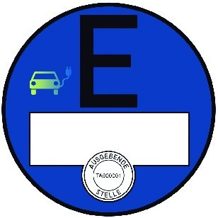

   (zu § 12 Absatz 3 Satz 2 bis 7)

### Anlage 5 Stempelplaketten und Plakettenträger
[Direktlink](https://www.gesetze-im-internet.de/fzv_2023/BJNR0C70B0023.html#BJNR0C70B0023BJNE008500000)

(Fundstelle: BGBl. 2023 I Nr. 199, S. 92 - 98)

## **Abschnitt A**

## **Vorbemerkungen**

**1.** **Objektsicherung und Fertigungskontrolle**

    Die Herstellung, die Lagerung und der Versand von
    sicherheitsrelevanten Rohmaterialien, Stempelplaketten und
    Plakettenträgern müssen so erfolgen, dass ein Verlust oder ein
    unberechtigter Zugriff ausgeschlossen sind. Zu diesem Zweck müssen
    Hersteller Systeme der Objektsicherung und Fertigungskontrolle
    unterhalten, die folgenden Anforderungen genügen müssen:

    a)  Für die Räume, in denen die Stempelplaketten und Plakettenträger
        gelagert werden, ist ein erhöhter mechanischer Einbruchschutz
        vorzusehen. Die Widerstandszeitwerte für Mauerwerk, Türen und Fenster
        sind so zu wählen, dass auch beim Einsatz üblicher maschinenbewegter
        Werkzeuge ausreichend Zeit für ein polizeiliches Einschreiten bleibt.
        Es ist eine Einbruchmeldeanlage nach dem neuesten Stand der Technik
        sowie ein Zugangskontrollsystem mit Dokumentationseinrichtung
        vorzusehen. Die Entnahme und Einlagerung sind jeweils von zwei
        Beschäftigten zu quittieren. Durch organisatorische Maßnahmen ist
        sicherzustellen, dass nicht nur die gefertigten Stempelplaketten und
        Plakettenträger, sondern außerhalb der Arbeitszeit auch alle Halb- und
        Zwischenerzeugnisse in diesem gesicherten Lager verwahrt werden.

    b)  Die Herstellung, der Druck, die Zählung und die Verpackung der
        Stempelplaketten und Plakettenträger dürfen nur in Räumlichkeiten mit
        eingeschränkter Zugangsberechtigung erfolgen. Es ist ein
        Zugangskontrollsystem mit Dokumentationseinrichtung zu installieren.

    c)  Mit der Lagerung und Verarbeitung dürfen nur Personen betraut werden,
        die eine besondere Verpflichtungserklärung im sorgfältigen und
        kontrollierten Umgang mit den Produkten abgegeben haben.

    d)  Es ist ein Registrierungssystem einzurichten, das eine lückenlose
        Verfolgung jeder einzelnen Stempelplakette anhand der angebrachten
        Druckstücknummerierung sicherstellt.

    e)  Die Bestellung und der Versand der Stempelplaketten und der
        Plakettenträger an die Zulassungsbehörden müssen so erfolgen, dass
        jederzeit ein Ermitteln des Verbleibs möglich ist und die Besteller
        und Empfänger innerhalb der Zulassungsbehörde registriert sind.

    f)  Es dürfen keine Tatsachen vorliegen, die den Gewerbetreibenden, die
        vertretungsberechtigten oder mit der Leitung des Betriebes oder einer
        Zweigniederlassung beauftragten Personen sowie die mit der Lagerung
        und Verarbeitung von Stempelplaketten und Plakettenträgern betrauten
        Personen für die Herstellung und Lieferung von Stempelplaketten und
        Plakettenträgern als unzuverlässig erscheinen lassen. Unzuverlässig im
        Sinne des Satzes 1 ist eine Person insbesondere dann, wenn sie
        wiederholt die Pflichten gröblich verletzt hat, die ihr nach dieser
        Verordnung obliegen.

    Die Unternehmen haben eine Sicherheitserklärung abzugeben, in der sie
    die Einhaltung der vorgenannten Anforderungen gegenüber dem
    Kraftfahrt-Bundesamt bestätigen. Das Kraftfahrt-Bundesamt bewertet die
    Einhaltung und erteilt dem Unternehmen die Befugnis, Stempelplaketten
    und Plakettenträger an die Zulassungsbehörden zu liefern. Ein Widerruf
    erfolgt, wenn das Unternehmen gegen einzelne Sicherheitsbestimmungen
    verstößt; die verwaltungsverfahrensrechtlichen Vorschriften über
    Rücknahme und Widerruf bleiben im Übrigen unberührt. Für die Bewertung
    und die Überwachung haben die Unternehmen den mit der Überwachung
    betrauten Mitarbeitern des Kraftfahrt-Bundesamtes während der
    Geschäfts- und Betriebszeiten Zutritt zu ihren Grundstücken,
    Geschäftsräumen und Betriebsstätten zu gewähren und dort
    Besichtigungen, Prüfungen und Einsicht in die vorgeschriebenen
    Aufzeichnungen zu ermöglichen.

**2.** **Technische Anforderungen an Stempelplaketten und Plakettenträger**

    Die Stempelplakette und der Plakettenträger müssen den Anforderungen
    der DIN 74069, Ausgabe Oktober 2022, entsprechen.

## **Abschnitt B**

## **Stempelplaketten**

**1.** **Ausgestaltung der Stempelplaketten**

    a)  Druckstücknummer der Stempelplakette

        Die Druckstücknummer ist in maschinenlesbarer und unmittelbar lesbarer
        Form darzustellen. Der maschinenlesbaren Form genügt ein DataMatrix-
        Code (5 x 5 mm). Die Druckstücknummer der Stempelplakette besteht aus
        acht Zeichen und ist als Klarschriftnummer mit der Schrift Arial-Bold
        4 Punkt – schwarz – rechts neben dem Wappen oder senkrecht links neben
        dem Wappen in der Schrift Arial-Bold 6 Punkt – schwarz – jeweils 11 mm
        mittig zentriert auf der waagerechten Durchmesserlinie vom äußeren
        Rand darzustellen. Der Abstand des DataMatrix-Codes und die Anordnung
        der Klarschriftnummer über dieser Codierung beträgt zum Randstrich 6
        mm. Verwendung finden als Zeichen Großbuchstaben des deutschen
        Alphabets von A bis Z, ohne Umlaute und Sonderzeichen, und Ziffern von
        0 bis 9. Das erste Zeichen ist ein Großbuchstabe, über den die die
        Stempelplakette herstellende Institution eineindeutig ableitbar ist.
        Die Zeichen zwei bis sieben sind fortlaufend aufsteigend zu verteilen.
        Das achte Zeichen ist eine Prüfziffer, berechnet aus den Zeichen eins
        bis sieben. Die Berechnung der Prüfziffer erfolgt nach einem
        Verfahren, welches nach dem Modulus klassifiziert, der der jeweiligen
        Berechnungsmethode zugrunde liegt. Eine weitere Unterscheidung ist
        nach den Gewichtungsfolgen und den Modifikationen möglich.

    b)  Sicherheitscode der Stempelplakette

        Der Sicherheitscode muss nach Freilegung unmittelbar und deutlich
        lesbar sein sowie zusätzlich in maschinenlesbarer Form dargestellt
        werden und darf weder aus der Druckstücknummer hervorgehen noch aus
        dieser ableitbar sein. Der maschinenlesbaren Form genügt ein
        DataMatrix-Code. Der DataMatrix-Code hat eine Mindestgröße von 6 x 6
        mm. Als Schriftart ist Arial-Bold 9 Punkt – schwarz – zu verwenden.
        Der Sicherheitscode der Stempelplakette besteht aus drei Zeichen.
        Verwendung finden als Zeichen Groß- und Kleinbuchstaben des deutschen
        Alphabets von A bis Z und a bis z – ohne die Zeichen I, i, l, O und o
        –, ohne Umlaute und Sonderzeichen, und Ziffern von 0 bis 9. Die
        Zeichen sind unter Ausschöpfung aller Kombinationen zufällig zu
        verteilen.

**2.** **Schematische Abbildungen der Stempelplakette**

    a)  Die schematische Darstellung der Stempelplakette enthält das farbige
        Wappen des Landes, die Bezeichnung des Landes, die Bezeichnung der
        Zulassungsbehörde und die Druckstücknummer:

        aa) Die Maße der Stempelplakette und des Druckes ergeben sich wie folgt:

            *                *                    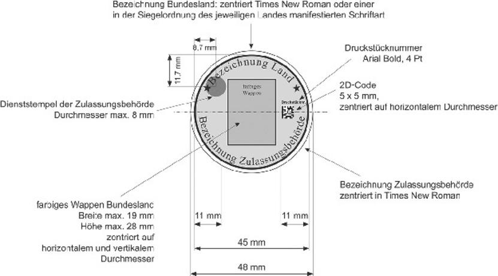

            *                *   Abbildung 1: Bemaßung der Stempelplakette

            *                *   oder wahlweise nach Maßgabe der Nummer 1 Buchstabe a dieses Abschnitts
                    wie folgt:

            *                *                    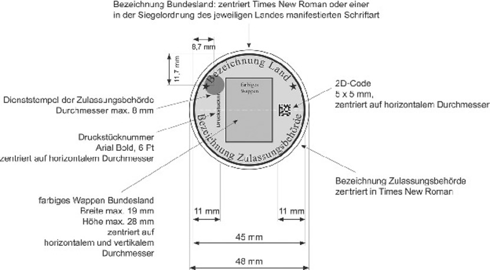

            *                *   Abbildung 2: Bemaßung der Stempelplakette

        bb) Das farbige Wappen des Landes ist bis maximal 28 x 19 mm (Höhe x
            Breite) darzustellen. Die Bezeichnung des Landes ist zentriert über
            dem Wappen in der Schrift Times New Roman oder in einer in der
            Siegelordnung des jeweiligen Landes manifestierten Schriftart
            darzustellen. Der Abstand zum umlaufenden schwarzen Randstrich beträgt
            1 mm. Die Bezeichnung der Zulassungsbehörde ist in der Schrift Times
            New Roman unter dem Wappen zentriert anzuordnen. Der Abstand zum
            umlaufenden schwarzen Randstrich beträgt 1 mm, Randstrich 0,7 mm.

        cc) Hintergrund

            Der Hintergrund ist in der Farbe silbergrau auszuführen und beinhaltet
            ein fälschungserschwerendes Muster, eine Herstellerkennzeichnung und
            einen Dienststempel der Zulassungsbehörde mit einem maximalen
            Durchmesser von 8 mm in der Bemaßung als Alleinstellungsmerkmal nach
            den landesrechtlichen Vorschriften. Das Layout ist
            herstellerindividuell. Das Farbklima ist herstellerindividuell
            insoweit, als das Muster, die Herstellerkennzeichnung und der
            Dienststempel in einem zum silbergrauen Hintergrund der Plakette
            eindeutig unterscheidbaren helleren Silbergrau oder Grau ausgeführt
            sein müssen. DIN 5340 (Bezugssehweite) ist zu berücksichtigen.

    b)  Stempelplakette mit sichtbarem Sicherheitscode

        aa) Der DataMatrix-Code hat eine Mindestgröße von 6 x 6 mm. Als Schriftart
            für den Sicherheitscode ist für die Klarschriftnummer Arial-Bold
            mindestens 9 Punkt – schwarz – zu verwenden. Die Anordnung kann über,
            unter oder neben dem DataMatrix-Code auf einer eigenen Fläche zusammen
            mit der Klarschriftnummerierung erfolgen. Die beschriebene Fläche kann
            eine produktionsabhängige Bemessung und Kantenradien aufweisen und ist
            als Schicht unter dem Wappen angeordnet.

        bb) Die Stempelplakette hat folgende Sicherheitsmerkmale zu erfüllen:

            aaa) Bei physischer Manipulation muss mindestens 1/3 der
                Druckbildinformationen auf der Stempelplakette irreversibel zerstört
                werden oder durch andere geeignete technische Maßnahmen die
                Freilegungsmerkmale entsprechend unumkehrbar sichtbar werden. Die
                Beurteilung erfolgt jeweils aus Bezugssehweite nach DIN 5340.

            bbb) Herstellerspezifische UV-Kennzeichnung mit UV-Chargennummer als zwei
                nicht sichtbare, echtheitserkennbare Merkmale.

## **Abschnitt C**

## **Plakettenträger**

**1.** **Sicherheitsmerkmale**

    a)  Der Plakettenträger ist transparent.

    b)  Als Sicherheitsmerkmale sind das „Kennzeichen“ und die letzten sechs
        Ziffern der Fahrzeug-Identifizierungsnummer in unmittelbar dauerhaft
        lesbarer Form als Klarschriftnummer mit der Schrift – schwarz – Arial
        Narrow 6 Punkt auf dem Plakettenträger darzustellen.

    c)  Ein herstellerspezifisches Sicherheitsmerkmal wird in sichtbarer Form
        auf dem Plakettenträger dargestellt und ist so zu wählen, dass die
        automatische Erfassung des Kennzeichens nicht erschwert wird.

    d)  Der Plakettenträger hat als zusätzliches Sicherheitsmerkmal ein
        irreversibles herstellerspezifisches Zerstörungsbild bei physischer
        Manipulation zu erfüllen. Der Plakettenträger muss bei physischer
        Manipulation mindestens 1/3 der Druckbildinformationen auf der
        Stempelplakette oder HU-Plakette irreversibel zerstören oder durch
        andere geeignete technische Maßnahmen die Freilegungsmerkmale
        entsprechend unumkehrbar sichtbar machen.

    e)  Eine auf dem Plakettenträger aufgebrachte Stempelplakette bzw. eine
        HU-Plakette muss beim Ausstanzen oder Ausschneiden vom Plakettenträger
        eine Kennzeichnung aufweisen, anhand derer erkennbar ist, dass diese
        bereits auf einem Plakettenträger verklebt war und daher nicht ohne
        ihn verwendet werden kann.

**2.** **Schematische Abbildung der Plakettenträger**

    a)  Plakettenträger für die Stempelplakette

        Die schematische Darstellung des Plakettenträgers enthält die
        Stempelplakette nach Abschnitt B und die auf dem Plakettenträger
        aufgebrachten Merkmale „Kennzeichen“, „verkürzte Fahrzeug-
        Identifizierungsnummer“ und das herstellerspezifische
        Sicherheitsmerkmal.

        aa) Die Maße des Plakettenträgers ergeben sich wie folgt:

            *                *                    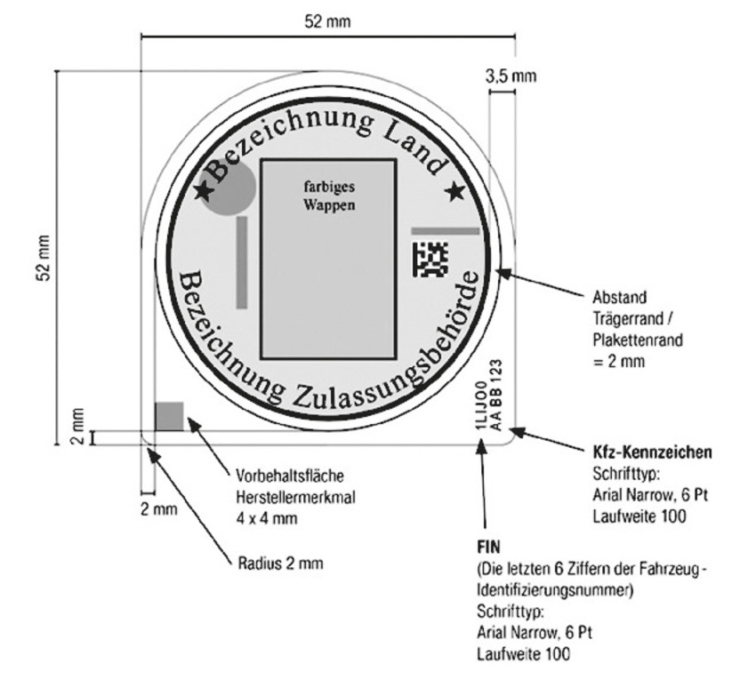

            *                *   Abbildung 3: Bemaßung des Plakettenträgers

        bb) Der Abstand zwischen dem umlaufenden schwarzen Randstrich der
            Stempelplakette und dem umlaufenden äußeren Rand des Plakettenträgers
            in der oberen Hälfte des Plakettenträgers beträgt maximal 3,5 mm.

        cc) Das Kennzeichen ist in der rechten unteren Ecke des Plakettenträgers
            senkrecht – beginnend 2 mm vom äußeren unteren Rand und 2 mm vom
            äußeren rechten Rand des Plakettenträgers – darzustellen.

        dd) Die verkürzte Fahrzeug-Identifizierungsnummer ist in der rechten
            unteren Ecke des Plakettenträgers senkrecht – beginnend 2 mm vom
            äußeren unteren Rand und links neben dem Kennzeichen – darzustellen.

        ee) Das herstellerspezifische Sicherheitsmerkmal ist in der linken unteren
            Ecke des Plakettenträgers so darzustellen, dass es in einer
            Vorbehaltsfläche von 4 x 4 mm auf den Schnittpunkten der
            Rechteckdiagonalen zu platzieren ist.

        ff) Plakettenträger mit beispielhaftem Zerstörungsbild:

            *                *                    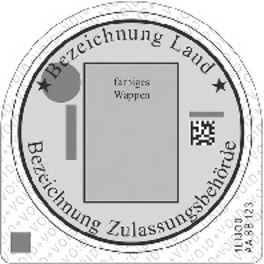

            *                *   Abbildung 4: Plakettenträger mit Zerstörungsbild

    b)  Plakettenträger für die HU-Plakette

        Die schematische Darstellung des HU-Plakettenträgers enthält die HU-
        Plakette nach Anlage IX der Straßenverkehrs-Zulassungs-Ordnung (zu §
        29 Absatz 2, 3, 5 bis 8) und die auf dem Plakettenträger aufgebrachten
        Merkmale „Kennzeichen“ und „verkürzte Fahrzeug-Identifizierungsnummer“
        und das herstellerspezifische Merkmal.

        aa) Die Maße des HU-Plakettenträgers ergeben sich wie folgt:

            *                *                    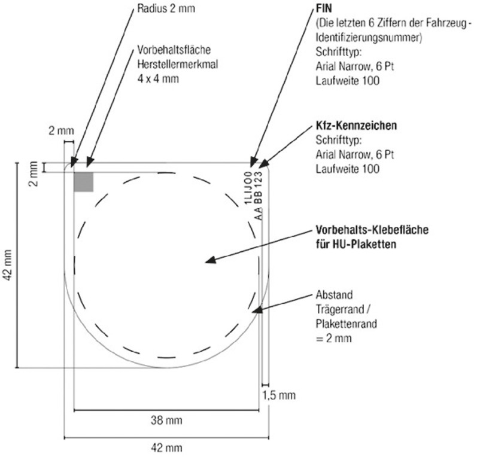

            *                *   Abbildung 5: Bemaßung des HU-Plakettenträgers

        bb) Das Kennzeichen ist in der rechten oberen Ecke des Plakettenträgers
            senkrecht – endend 2 mm vom äußeren oberen Rand und 1,5 mm vom äußeren
            rechten Rand des Plakettenträgers – darzustellen.

        cc) Die verkürzte Fahrzeug-Identifizierungsnummer ist in der rechten
            oberen Ecke des Plakettenträgers senkrecht – endend 2 mm vom äußeren
            oberen Rand und links vom eingedruckten „Kennzeichen“ nach
            Doppelbuchstabe bb vom äußeren rechten Rand des Plakettenträgers –
            darzustellen.

        dd) Das herstellerspezifische Sicherheitsmerkmal ist in der linken oberen
            Ecke des Plakettenträgers so darzustellen, dass es in einer
            Vorbehaltsfläche von 4 x 4 mm auf den Schnittpunkten der
            Rechteckdiagonalen zu platzieren ist.

        ee) Plakettenträger mit beispielhaftem Zerstörungsbild:

            *                *                    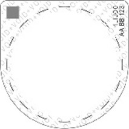

            *                *   Abbildung 6: HU-Plakettenträger mit Zerstörungsbild

(zu § 13 Absatz 1)

### Anlage 6 Zulassungsbescheinigung Teil I
[Direktlink](https://www.gesetze-im-internet.de/fzv_2023/BJNR0C70B0023.html#BJNR0C70B0023BJNE008600000)

(Fundstelle: BGBl. 2023 I Nr. 199, S. 99 - 102)

## **Vorbemerkungen**

1.  Ausgestaltung der Zulassungsbescheinigung Teil I:

    Trägermaterial: Neobond (150 g/m
    2), Farbe weiß

    Format: Breite 210 mm, Höhe 105 mm, zweimal faltbar auf DIN A7,
    zweiseitig bedruckt.

    In das Trägermaterial eingearbeitet sind die folgenden
    fälschungserschwerenden Sicherheitsmerkmale:

    –   Wasserzeichen (Motiv: „Stilisierter Adler“ – gesetzlich geschützt für
        die Bundesdruckerei),

    –   Melierfasern, teilweise fluoreszierend,

    –   Planchetten, fluoreszierend,

    –   Sicherheitsreagenzien als Schutz gegen chemische Rasurmanipulationen.

2.  Sicherheitsmerkmale:

    Der Druck auf dem Trägermaterial weist folgende fälschungserschwerende
    Sicherheitsmerkmale auf:

    –   mehrfarbiger Guillochenschutzunterdruck (zweistufig verarbeitet) mit
        Irisverlauf und integrierten Mikroschriften auf beiden Seiten,

    –   Fluoreszenzaufdruck vorderseitig (Motiv: Bundesadler mit zweigeteilter
        Linienstruktur), unsichtbar (unter UV-Licht fluoreszierend),

    –   Textfarbe dunkelgrün (unter UV-Licht grün fluoreszierend), Integration
        von Mikroschriftelementen im Formulartext,

    –   optisch-variables Element in Form eines Kinegramms (Motiv: „Sonne 40“
        – gesetzlich geschützt für die Bundesdruckerei) auf der Rückseite des
        Dokuments einschließlich eines maschinell prüfbaren Merkmals; das
        Kinegramm wird durch die Vordrucknummerierung teilweise überdruckt.
        Die Vordrucknummerierung wird dunkelblau (unter UV-Licht gelb-grün
        fluoreszierend) aufgebracht,

    –   fortlaufende Nummer auf der Vorderseite, die durch die
        Zulassungsbehörde bei der Ausstellung eingetragen wird, wobei die
        Einmaligkeit der Nummer sicherzustellen ist.

3.  Objektsicherung und Fertigungskontrolle:

    Die Herstellung, die Lagerung und der Versand von Rohmaterialien und
    Vordrucken muss so erfolgen, dass ein Verlust oder ein unberechtigter
    Zugriff ausgeschlossen ist. Zu diesem Zweck müssen Papierhersteller,
    Druckereien und Verlage Systeme der Objektsicherung und
    Fertigungskontrolle unterhalten, die folgenden Anforderungen genügen
    müssen:

    a)  Für die Räume, in denen die Vordrucke gelagert werden, ist ein
        erhöhter mechanischer Einbruchschutz vorzusehen. Die
        Widerstandszeitwerte für Mauerwerk, Türen und Fenster sind so zu
        wählen, dass auch beim Einsatz üblicher maschinenbewegter Werkzeuge
        ausreichend Zeit für ein polizeiliches Einschreiten bleibt. Es ist
        eine Einbruchmeldeanlage nach neuester Richtlinie vorzusehen sowie ein
        Zugangskontrollsystem mit Dokumentationseinrichtung. Die Entnahme und
        Einlagerung sind jeweils von zwei Beschäftigten zu quittieren. Durch
        organisatorische Maßnahmen ist sicherzustellen, dass nicht nur die von
        der Bundesdruckerei angelieferten Vordrucke, sondern außerhalb der
        Arbeitszeit auch alle Halb- und Zwischenerzeugnisse in diesem
        gesicherten Lager verwahrt werden.

    b)  Die Verarbeitung der Vordrucke in der Druckerei (Herstellung der
        Eindrucke, schneiden, zählen und verpacken) darf nur in Räumlichkeiten
        mit eingeschränkter Zugangsberechtigung erfolgen. Es ist ein
        Zugangskontrollsystem mit Dokumentationseinrichtung zu installieren.

    c)  Mit der Lagerung und Verarbeitung dürfen nur zuverlässige Personen
        betraut werden, die eine besondere Verpflichtungserklärung im
        sorgfältigen und kontrollierten Umgang mit den Vordrucken abgegeben
        haben.

    d)  Es ist ein Registrierungssystem einzurichten, das eine lückenlose
        Verfolgung und Verbleibskontrolle jedes einzelnen Vordrucks anhand der
        von der Bundesdruckerei angebrachten Nummerierung sicherstellt.

    e)  Der Versand der Vordrucke an die Zulassungsbehörden muss so erfolgen,
        dass jederzeit eine Verbleibsermittlung möglich ist und der Empfänger
        innerhalb der Zulassungsbehörde registriert wird.

    Die Unternehmen geben eine Sicherheitserklärung ab, in der sie die
    Einhaltung der vorgenannten Anforderungen gegenüber dem Kraftfahrt-
    Bundesamt bestätigen. Das Kraftfahrt-Bundesamt ermächtigt nach Prüfung
    die Bundesdruckerei, diesen Unternehmen Vordrucke der
    Zulassungsbescheinigung Teil I zu liefern. Ein Widerruf erfolgt, wenn
    die Unternehmen gegen einzelne Sicherheitsbestimmungen verstoßen.

4.  Markierung

    a)  Die Markierungen mit dem verdeckten Sicherheitscode nach § 13 Absatz 1
        Satz 2 und 3 sind im linken Drittel der Rückseite und dort in der
        unteren Hälfte rechts, oberhalb der Behördenbezeichnung und
        Unterschrift, anzubringen.

    b)  Die Druckstücknummer ist nach Nummer 5 darzustellen.

    c)  Schematische Abbildungen:

        Die Markierungen müssen gemäß nachfolgender Abbildung nach
        vorgegebenen Maßen und farblicher Darstellung gestaltet sein:

        aa) Format:

            aaa) Breite 30 mm, Höhe 20 mm, Eckradien 1 mm oder

            bbb) Breite 35 mm, Höhe 25 mm, Eckradien 1 mm.

        bb) Farbe:

            Mittiges Beschriftungsfeld silbergrau mit 4 mm umlaufendem, farbigem
            Rand (Verkehrsgrün, RAL 6024).

        cc) Zusätzlich muss ein herstellerspezifisches, unsichtbares Kennzeichen
            in der Nähe der Druckstücknummer angebracht werden. Die sichtbare
            Markierung soll als fälschungserschwerende Sicherheitsabdeckung
            gewährleisten, dass die auf ihr angebrachte Druckstücknummer und der
            2D-Code beim Freilegen oder einer Manipulation unwiderruflich zerstört
            werden. Durch das Entfernen der sichtbaren Abdeckung ist

            aaa) ein irreversibles 2-farbiges Farbmuster (Schraffur Verkehrsblau RAL
                5017/Verkehrsweiß RAL 9016, 45 Grad nach rechts geneigt, Strichstärke
                1 mm) oder

            bbb) ein irreversibles 1-farbiges Farbmuster (Verkehrsgrün, RAL 6024)

            freigelegt und die Manipulation oder gewollte Öffnung erkennbar.

            Abbildung zur sichtbaren Markierung:

            
            Abbildung zur darunterliegenden Markierung mit Sicherheitscode nach
            Sichtbarmachung:

            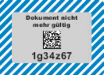

5.  Druckstücknummer der Zulassungsbescheinigung Teil I:

    Die Druckstücknummer ist in maschinenlesbarer und unmittelbar lesbarer
    Form darzustellen. Der maschinenlesbaren Form genügt ein 2D-Code in
    Form des DataMatrix-Codes. Die Zusammensetzung der Druckstücknummer
    erfolgt entsprechend der Vorgaben aus Anlage 5. Der 2D-Code hat eine
    Mindestgröße von 5 x 5 mm. Als Schriftart ist Arial-Bold mindestens 4
    Punkt – schwarz – und für die Klarschriftnummer die Schriftart Arial-
    Bold mindestens 7 Punkt – schwarz – zu verwenden.

6.  Sicherheitscode der Zulassungsbescheinigung Teil I:

    Der Sicherheitscode muss unmittelbar lesbar sein und ist zusätzlich in
    maschinenlesbarer Form darzustellen. Der maschinenlesbaren Form genügt
    ein 2D-Code in Form des DataMatrix-Codes und der Sicherheitscode darf
    weder aus der Druckstücknummer hervorgehen noch aus dieser ableitbar
    sein. Der Sicherheitscode der Zulassungsbescheinigung Teil I besteht
    aus sieben Zeichen. Im Übrigen erfolgt die Zusammensetzung des
    Sicherheitscodes entsprechend der Vorgaben aus Anlage 5 Nummer 2. Der
    2D-Code hat eine Mindestgröße von 5 x 5 mm. Für die Klarschriftnummer
    ist die Schriftart Arial-Bold mindestens 8 Punkt – schwarz – zu
    verwenden, für die Schrift „Außer Betrieb gesetzt“ Arial-Bold 5 Punkt
    – schwarz –. Der Sicherheitscode kann nicht durch Durchleuchten
    erkannt werden. Verwendung finden als Zeichen Groß- und
    Kleinbuchstaben des deutschen Alphabets von A bis Z und a bis z – ohne
    die Zeichen I, i, l, O und o –, ohne Umlaute und Sonderzeichen, und
    Ziffern von 0 bis 9. Die Zeichen sind unter Ausschöpfung aller
    Kombinationen zufällig zu verteilen.

    Vorderseite

    
    Rückseite

    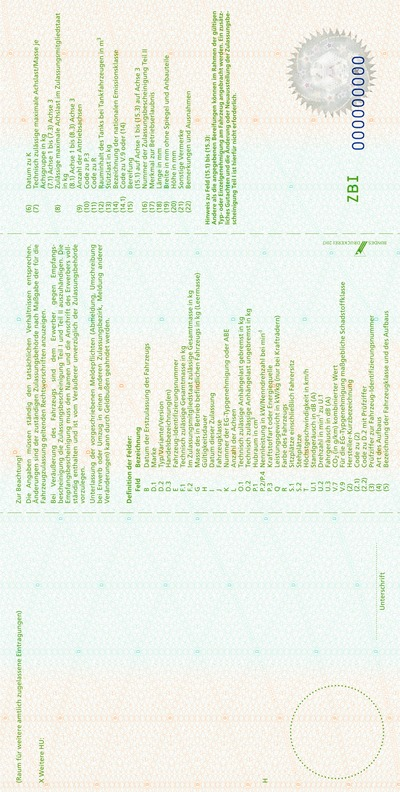

(zu § 13 Absatz 4)

### Anlage 7 Zulassungsbescheinigung Teil I für Fahrzeuge der Bundeswehr
[Direktlink](https://www.gesetze-im-internet.de/fzv_2023/BJNR0C70B0023.html#BJNR0C70B0023BJNE008700000)

(Fundstelle: BGBl. 2023 I Nr. 199, S. 103 - 104)

## Vorbemerkungen

Format: Breite 210 mm, Höhe 8 1/3 Zoll (207 mm)

Es gelten die Nummern 1 und 2 der Vorbemerkungen der Anlage 5

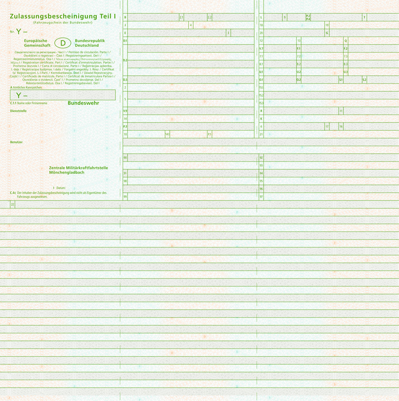
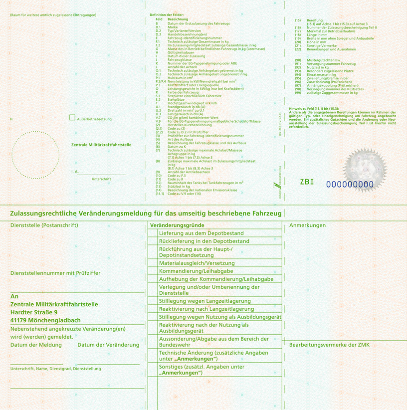
(zu § 14 Absatz 2)

### Anlage 8 Zulassungsbescheinigung Teil II
[Direktlink](https://www.gesetze-im-internet.de/fzv_2023/BJNR0C70B0023.html#BJNR0C70B0023BJNE008800000)

(Fundstelle: BGBl. 2023 I Nr. 199, S. 105 - 108)

## Vorbemerkungen

1.  Ausgestaltung der Zulassungsbescheinigung Teil II

    Trägermaterial: Neobond (150 g/m
    2), Farbe weiß

    Format: Breite 210 mm, Höhe 12 Zoll (304,8 mm), einseitig bedruckt

    In das Trägermaterial eingearbeitet sind die folgenden
    fälschungserschwerenden Sicherheitsmerkmale:

    –   Wasserzeichen (Motiv: „Stilisierter Adler“ – gesetzlich geschützt für
        die Bundesdruckerei),

    –   Melierfasern, teilweise fluoreszierend,

    –   Planchetten, fluoreszierend,

    –   Sicherheitsreagenzien als Schutz gegen chemische Rasurmanipulationen.

2.  Sicherheitsmerkmale:

    Der Druck auf dem Trägermaterial weist folgende fälschungserschwerende
    Sicherheitsmerkmale auf:

    –   mehrfarbiger Guillochenschutzunterdruck (zweifarbig verarbeitet) mit
        Irisverlauf und integrierten Mikroschriften auf der Vorderseite,

    –   Rückseite einfarbig eingefärbt,

    –   Fluoreszenzaufdruck vorderseitig (Motiv: Bundesadler mit zweigeteilter
        Linienstruktur), unsichtbar (unter UV-Licht fluoreszierend),

    –   Textfarbe dunkelgrün (unter UV-Licht grün fluoreszierend), Integration
        von Mikroschriftelementen im Formulartext,

    –   Vordrucknummerierung dunkelblau (unter UV-Licht gelb-grün
        fluoreszierend).

3.  Markierung

    a)  Die sichtbare Markierung stellt eine fälschungserschwerende
        Sicherheitsabdeckung des darunterliegenden Sicherheitscodes der
        Zulassungsbescheinigung Teil II und des Hinweises „Dokument nicht mehr
        gültig“ dar. Die Sicherheitsabdeckung wird auf die
        Zulassungsbescheinigung Teil II in dem freien Feld unter dem Feld
        „Datum (I)“ angebracht. Rechts daneben wird folgender Hinweis
        vorgedruckt: „Nur zur Nutzung des Sicherheitscodes im
        internetbasierten Zulassungsverfahren freilegen. Dokument nur
        unbeschädigt gültig. “ Für die Schrift „Dokument nicht mehr gültig“
        ist die Schriftart Arial-Bold, mindestens 7 Punkt – schwarz – zu
        verwenden.

    b)  Schematische Abbildungen:

        Die sichtbare Markierung muss gemäß nachfolgender Abbildung nach
        vorgegebenen Maßen und farblicher Darstellung gestaltet sein:

        aa) Format:

            Breite 37 mm, Höhe 28 mm, Eckradien 1 mm.

        bb) Farbe:

            Umlaufender farbiger Rand (Verkehrsgrün, RAL 6024), 3 mm (links,
            rechts) bzw. 4 mm (oben, unten).

        cc) Zusätzlich muss ein herstellerspezifisches Sicherheitsmerkmal mit
            sichtbaren und unsichtbaren Elementen angebracht werden. Die
            fälschungserschwerende Sicherheitsabdeckung muss so beschaffen sein,
            dass sie beim Freilegen oder bei einer Manipulation unwiderruflich
            zerstört wird. Bei Entfernung der sichtbaren Markierung wird

            aaa) ein irreversibles einfarbiges Farbmuster, 45 Grad Winkelung,
                Strichstärke 2 mm (Verkehrsgrün, RAL 6024) oder

            bbb) ein irreversibles zweifarbiges Farbmuster, 45 Grad Winkelung,
                Strichstärke 2 mm (Schraffur Verkehrsblau, RAL 5017/Verkehrsweiß, RAL
                9016)

            freigelegt und die Freilegung oder Manipulation erkennbar.

[^F825991_28_BJNR0C70B0023BJNE008800000]
            Abbildung der sichtbaren Markierung:

            *                *                    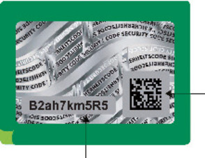
                *   2 D-Code der Druckstücknummer der Markierung

            *                *   Druckstücknummer der Markierung

            Abbildung der freigelegten Markierung mit Sicherheitscode der
            Zulassungsbescheinigung Teil II:\*

            
            Abbildung der manipulierten Markierung\*

            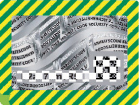

4.  Sicherheitscode der Zulassungsbescheinigung Teil II:

    Der Sicherheitscode muss unmittelbar lesbar sein und ist zusätzlich in
    maschinenlesbarer Form darzustellen. Der maschinenlesbaren Form genügt
    ein 2D-Code in Form des DataMatrix-Codes. Der Sicherheitscode der
    Zulassungsbescheinigung Teil II besteht aus zwölf alphanumerischen
    Zeichen. Verwendung finden als Zeichen Groß- und Kleinbuchstaben des
    deutschen Alphabets von A bis Z, ohne Umlaute und Sonderzeichen, sowie
    Ziffern von 0 bis 9. Das erste Zeichen ermöglicht die Unterscheidung
    der jeweiligen Funktion der Nachweisnummer. Die Zeichen zwei bis elf
    sind unter Ausschöpfung aller Kombinationen zufällig zu verteilen. Das
    zwölfte Zeichen ist eine Prüfziffer, berechnet aus den Zeichen eins
    bis elf. Die Berechnung der Prüfziffer erfolgt nach dem
    Modulus-11-Verfahren. Der 2D-Code hat eine Mindestgröße von 5 x 5 mm.
    Für die Klarschriftnummer ist die Schriftart OCR-B mindestens 8 Punkt
    – schwarz – zu verwenden. Der Sicherheitscode darf nicht bei vorder-
    oder rückseitiger Durchleuchtung erkannt werden.

    Abbildung der Zulassungsbescheinigung Teil II mit sichtbarer
    Markierung

    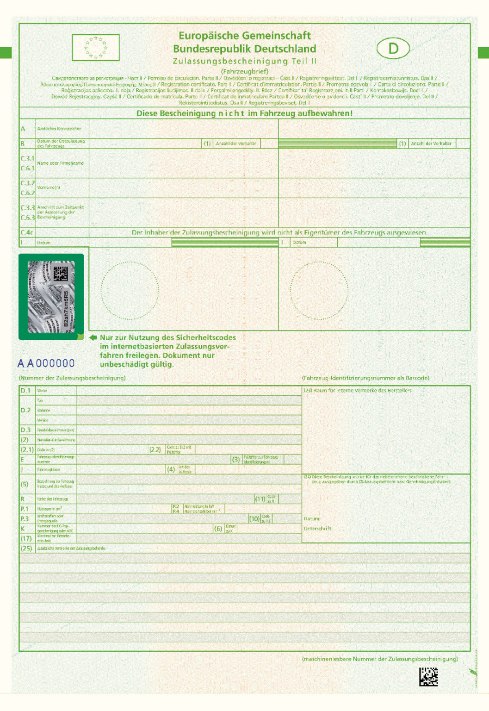
    Abbildung der Zulassungsbescheinigung Teil II mit freigelegter
    Markierung

    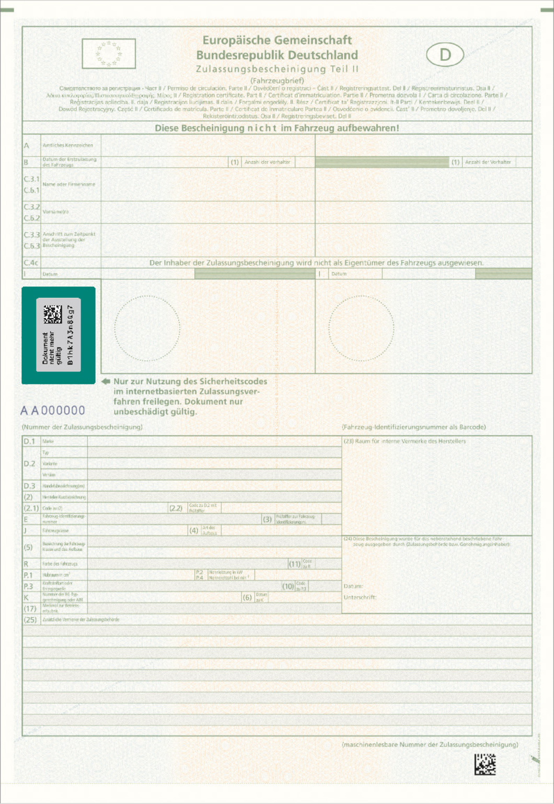

    Die Markierung wird auf der Zulassungsbescheinigung Teil II um 90 Grad
    gedreht angebracht.
[^F825991_28_BJNR0C70B0023BJNE008800000]: 
(zu § 17)

### Anlage 9 Verwertungsnachweis
[Direktlink](https://www.gesetze-im-internet.de/fzv_2023/BJNR0C70B0023.html#BJNR0C70B0023BJNE008900000)

(Fundstelle: BGBl. 2023 I Nr. 199, S. 109 - 112)

## **Abschnitt I**

## **Vorbemerkungen zur Herstellung des Vordrucks
„Verwertungsnachweis“**

1.  Allgemeines

    Der Verwertungsnachweis besteht aus einem Satz mit vier Ausfertigungen
    (Blättern).

    Jedes Blatt besteht aus zwei Seiten.

    Die erste Ausfertigung (Blatt 1) der Seiten 1 bis 2 des Vordrucks
    enthält in der Kopfzeile folgende Bezeichnung:

    „Diese Ausfertigung (rosa) ist für den Fahrzeughalter/-eigentümer
    bestimmt. “

    Blatt 2 enthält entsprechend folgende Bezeichnung:

    „Diese Ausfertigung (altgold) ist für den Demontagebetrieb bestimmt. “

    Blatt 3 enthält entsprechend folgende Bezeichnung:

    „Diese Ausfertigung (blau) ist für die Schredderanlage bestimmt. “

    Blatt 4 enthält entsprechend folgende Bezeichnung:

    „Diese Ausfertigung (weiß) ist für die Annahme-/Rücknahmestelle
    bestimmt. “

2.  Format

    Ein Muster des Vordrucks ist in Abschnitt 2 verkleinert wiedergegeben.
    Zur ordnungsgemäßen Verwendung ist der Vordruck im Verhältnis 84:100
    zu vergrößern. Das Format DIN A4 ist durch gestrichelte Linien
    kenntlich gemacht.

3.  Passergenauigkeit

    Sämtliche Blätter sind mit einem Passer für computergestützte Ausfüll-
    und Lesevorgänge zu versehen. Zwischen dem oberen Papierrand und der
    oberen Begrenzung des Passers ist ein zweifacher 1/6-Zoll-Abstand zu
    wählen. Zwischen dem linken Papierrand und der seitlichen Begrenzung
    des Passers beträgt der Abstand 8/10 Zoll.

    Der senkrechte Abstand zwischen der Passermarke und den
    Eintragungsfeldern ist in der Maßeinheit 1/6 Zoll (2/6 Zoll
    durchgängige Zeilenschaltung) auszuführen. In der Waagerechten ist der
    Abstand zwischen der Passermarke und dem Beginn der Eintragungsfelder
    in der Maßeinheit 1/10 Zoll (Bewegungsschrift) auszuführen. Die Kämme
    sind auf 2/10 Zoll auszurichten, damit auch eine handschriftliche
    Eintragung gewährleistet ist.

4.  Maschinenlesbarkeit

    Der Vordruck ist maschinenlesbar zu gestalten. Die folgenden
    Gestaltungsempfehlungen sind zu beachten, wenn Vordrucke als
    allgemeines Schriftgut zur optischen Belegerfassung vorgesehen sind.
    Sie finden mit Ausnahme der Nummer 4.2 Satz 2 und 3 keine Anwendung,
    wenn der Verwertungsnachweis mit Ausnahme von Unterschrift und Stempel
    vollständig computergestützt erstellt wird.

4.1 Farben

    Bei Vordrucken zur optischen Belegerfassung muss sich der Aufdruck
    (Text, Linien, Raster) farblich vom Ausfülltext unterscheiden.
    Ziffern, Zahlen, Nummern und der Passer sollten bei maschinenlesbaren
    Vordrucken in Blindfarbe gedruckt sein. Bis auf die Ausfertigung
    „weiß“ sind deshalb die Blätter in der unten angegebenen Blindfarbe zu
    drucken (RAL-Werte nach Euro-Skala):

    *        *   Blatt 1
            (Ausfertigung für den Halter)

        *   rosa

        *   100 % Yellow und 85 % Magenta

    *        *   Blatt 2
            (Ausfertigung für den Demontagebetrieb)

        *   altgold

        *   100 % Yellow und 45 % Magenta

    *        *   Blatt 3
            (Ausfertigung für die Schredderanlage)

        *   blau

        *   55 % Magenta und 100 % Cyan

    *        *   Blatt 4
            (Ausfertigung für die Annahme-/Rücknahmestelle)

        *   weiß

        *

4.2 Schriften

    Beim handschriftlichen Ausfüllen sollten neben den Ziffern nur
    Großbuchstaben verwendet werden. Für Schreibmaschinen- und
    Druckschrift sind mindestens Schrifthöhen mit einer Versalhöhe von ca.
    2,1 mm bis 3,2 mm, für Handblockschrift von ca. 5 mm einzuhalten. Alle
    Schriften, außer Kursiv- und Serifenschriften, sind geeignet für die
    optische Zeichenerkennung. Die Begrenzungslinien für
    Eintragungsfelder, Linien, Schriften und die Rasterflächen sind in den
    oben genannten Farben als sogenannte Blindfarbe ohne Verunreinigungen
    auszuführen. Die Rasterflächen dürfen 60 % vom Volltonwert nicht
    überschreiten. Die maschinell zu lesenden Bereiche müssen weiß sein.

5.  Leimung

    Wird eine Verleimung der Vordrucksätze vorgenommen, so hat diese am
    Kopf zu erfolgen. Trennleisten mit Mikroperforation sind zulässig.

6.  Papierqualität

    Die jeweiligen Oberblätter (Blatt 1) sind auf Papier zu drucken mit
    einem Gewicht von 80 g/m
    2\. Die jeweiligen Mittelblätter (Blätter 2 und 3) sind auf einem
    Papier mit 53 g/m
    2 zu drucken. Die jeweiligen Unterblätter (Blatt 4) sind auf Papier
    mit 80 g/m
    2 zu drucken.

## **Abschnitt 2**

## **Muster**

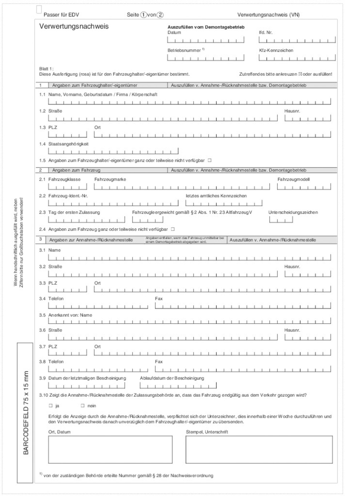
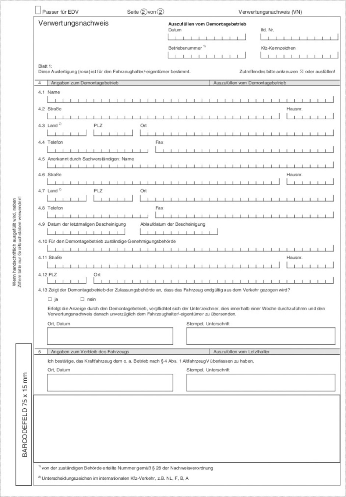
(zu § 22 Absatz 4)

### Anlage 10 Verifizierung der Prüfziffer
[Direktlink](https://www.gesetze-im-internet.de/fzv_2023/BJNR0C70B0023.html#BJNR0C70B0023BJNE009000000)

(Fundstelle: BGBl. 2023 I Nr. 190, S. 113)

Die Verifizierung der Prüfziffer des Untersuchungsberichts oder
Prüfprotokolls für den Nachweis einer Hauptuntersuchung oder
Sicherheitsprüfung nach § 29 der Straßenverkehrs-Zulassungs-Ordnung in
internetbasierten Zulassungsverfahren nach § 22 Absatz 1 Satz 1 Nummer
2 erfolgt durch das Portal in folgender Art und Weise:

1.  Im Portal ist ein Datensatz zu erzeugen, in dem die in § 22 Absatz 4
    Satz 1 Nummer 2 bis 4 genannten Daten zusammengefasst und folgende
    Daten automatisiert hinzugefügt werden:

    a)  Antragsnummer, die aus der statistischen Kennziffer der
        Zulassungsbehörde einschließlich ihrer Zusatzziffer und dem
        Antragsdatum generiert wird,

    b)  Fahrzeug-Identifizierungsnummer,

    c)  Monat und Jahr der Erstzulassung,

    d)  Zuteilung der Prüfplakette nach einer Hauptuntersuchung oder Prüfmarke
        nach einer Sicherheitsprüfung,

    e)  Schlüsselnummer der Technischen Prüfstelle, der anerkannten
        Überwachungsorganisation oder der mit der Datenübermittlung
        beauftragten Gemeinschaftseinrichtung der anerkannten
        Kraftfahrzeugwerkstätten.

2.  Aus dem nach Nummer 1 erzeugten Datensatz wird durch das Kraftfahrt-
    Bundesamt eine Prüfziffer nach dem Verfahren des § 22 Absatz 3
    errechnet.

3.  Die nach Nummer 2 errechnete Prüfziffer wird mit der nach § 22 Absatz
    4 Satz 1 Nummer 1 übermittelten Prüfziffer abgeglichen. Stimmen beide
    Prüfziffern vollständig überein, gilt der vorgeschriebene Nachweis als
    erbracht.

(zu § 26 Absatz 3)

### Anlage 11 Verifizierung und Verarbeitung der Daten für internetbasierte Zulassungsverfahren
[Direktlink](https://www.gesetze-im-internet.de/fzv_2023/BJNR0C70B0023.html#BJNR0C70B0023BJNE009100000)

(Fundstelle: BGBl. 2023 I Nr. 199, S. 114)

1.  Für den internetbasierten Antrag auf Erstzulassung und Tageszulassung
    wird die Zuständigkeit der Zulassungsbehörde verifiziert und es werden
    die Fahrzeug-Identifizierungsnummer und die Nummer sowie der
    Sicherheitscode der Zulassungsbescheinigung Teil II nach § 21 Absatz 1
    Nummer 3 mit den Daten des Datenbanksystems des Zentralen
    Fahrzeugregisters abgeglichen. Die Zulassungsfähigkeit des Fahrzeuges
    im Sinne des § 6 Absatz 4 Satz 1 wird anhand der Angaben in der
    zentralen Datenbank der Übereinstimmungsbescheinigungen geprüft und
    das Ergebnis an das Portal übermittelt. Für die maschinelle Ausfüllung
    der Zulassungsbescheinigungen Teil I und II werden die Daten der
    Übereinstimmungsbescheinigung aus der Zentralen Datenbank der
    Übereinstimmungsbescheinigungen an das Portal übermittelt. Zusätzlich
    prüft die Zulassungsbehörde das Vorliegen von Hindernissen für die
    Erstzulassung auf Grund technischer Vorschriften mittels der nach § 74
    Absatz 5 enthaltenen Daten der Zentralen Datenbank der
    Übereinstimmungsbescheinigungen.

2.  Für den internetbasierten Antrag auf Wiederzulassung oder Änderung der
    Zulassung bei Wechsel des Wohnsitzes oder des Sitzes des Halters oder
    bei Wechsel des Halters werden das bisherige Kennzeichen, die
    Fahrzeug-Identifizierungsnummer, der Sicherheitscode der
    Zulassungsbescheinigung Teil I nach § 21 Absatz 1 Nummer 2 und der
    Sicherheitscode der Zulassungsbescheinigung Teil II nach § 21 Absatz 1
    Nummer 3 mit den im Zentralen Fahrzeugregister gespeicherten Daten
    abgeglichen. Die Zuständigkeit der Zulassungsbehörde wird verifiziert,
    und die in den §§ 57 und 59 genannten Daten werden aus dem Zentralen
    Fahrzeugregister an das Portal übermittelt. Die nach § 20 Absatz 1 und
    § 26 Absatz 2 in das Portal eingegebenen Daten werden mit den nach
    Satz 2 übermittelten Daten aus dem Zentralen Fahrzeugregister
    abgeglichen. Zusätzlich prüft das Portal das Vorliegen von
    Hindernissen für die Wiederzulassung anhand der Daten des Kraftfahrt-
    Bundesamts. Ist diese Prüfung durch das Portal technisch nicht
    möglich, erfolgt die Bearbeitung nach § 19 Absatz 1 Satz 4.

3.  Die Nummer der elektronischen Versicherungsbestätigung wird mit der
    von der Gemeinschaftseinrichtung der Versicherer betriebenen Datenbank
    abgeglichen, und von dort werden die Daten nach § 49 Absatz 2 an das
    Portal übermittelt.

4.  Die Daten für die Erteilung des SEPA-Lastschrift-Mandats zum Einzug
    der Kraftfahrzeugsteuer werden in einem Verfahren der für die Ausübung
    der Verwaltung der Kraftfahrzeugsteuer zuständigen Behörde
    verifiziert.

5.  Das Portal erzeugt den für den Einzug der Kraftfahrzeugsteuer
    erforderlichen Datensatz. Dem Halter wird durch das Portal die
    Möglichkeit gegeben, eine Bestätigung über die Erteilung des SEPA-
    Lastschrift-Mandats zu erstellen und diese zu erheben und zu speichern
    oder auszudrucken.

6.  Für den Nachweis des Ablaufs der Frist für die nächste
    Hauptuntersuchung oder die nächste Sicherheitsprüfung nach § 29 der
    Straßenverkehrs-Zulassungs-Ordnung gilt § 22.

7.  Mit den Daten über den Halter nach § 20 Absatz 1 und 4 wird vom Portal
    eine automatisierte Abfrage bei der für die Ausübung der Verwaltung
    der Kraftfahrzeugsteuer zuständigen Behörde über
    Kraftfahrzeugsteuerrückstände im Sinne des § 13 Absatz 2 des
    Kraftfahrzeugsteuergesetzes durchgeführt.

8.  Mit den Daten über den Halter nach § 20 Absatz 1 und 4 kann vom Portal
    eine automatisierte Abfrage bei der Datenbank, die die nach
    Landesrecht zuständige Behörde über Rückstände aus Gebühren oder
    Auslagen aus vorangegangenen Zulassungsvorgängen führt, durchgeführt
    werden, soweit dies landesrechtlich im Einklang mit § 6a Absatz 8 des
    Straßenverkehrsgesetzes vorgesehen ist.

Die verifizierten und erstellten Daten werden den Antragsdaten im
Portal hinzugefügt.

(zu § 41 Absatz 2 Satz 1)

### Anlage 13 Fahrzeugscheinheft für Fahrzeuge mit rotem Kennzeichen
[Direktlink](https://www.gesetze-im-internet.de/fzv_2023/BJNR0C70B0023.html#BJNR0C70B0023BJNE009301123)

(Fundstelle: BGBl. 2023 I Nr. 199, S. 123 - 124)

Breite 74 mm, Höhe 105 mm, Farbe hellrot, schwarzer Druck
(Typendruck). Mehrseitig, auf Seite 3 und den folgenden Seiten
derselbe Vordruck wie auf Seite 2. Mit Ausnahme von Seite 1 darf jede
Seite Angaben über nur ein Fahrzeug enthalten. Geringfügige
Abweichungen vom vorgeschriebenen Muster sind zulässig, insbesondere
können zusätzliche Hinweise zur Verwendung aufgedruckt werden.

Abbildung Seite 1:

*    *
    *   Fahrzeugscheinheft
        für Fahrzeuge mit rotem Kennzeichen nach § 41 FZV

    *

*    *
    *   Gültig vom     bis

    *
    *
    *

*    *
    *
    *
    *
    *

*    *
    *   Das vorstehende Kennzeichen ist

    *

*    *
    *   Vorname, Name, Firma

    *

*    *
    *
    *

*    *
    *
    *

*    *
    *   Postleitzahl, Wohnort/Firmensitz, Straße und Hausnummer

    *

*    *
    *
    *

*    *
    *
    *

*    *
    *   für die nachfolgend beschrieben Fahrzeuge zu Prüfungs-, Probe-, und
        Überführungsfahrten zugeteilt worden.

    *

*    *
    *   Dieses Heft gilt nur, wenn die nachfolgende Beschreibung für das
        jeweilige Fahrzeug vom Inhaber in dauerhafter Schrift ausgefüllt und
        unterschrieben ist.

    *

*    *
    *
    *

*    *
    *
    *
    *   Ort, Datum

    *

*    *
    *
    *
    *
    *

*    *
    *
    *
    *   Name der Zulassungsbehörde

    *

*    *
    *
    *
    *   Unterschrift

    *

*    *
    *
    *

   Abbildung Seite 2:

*    *   1

    *   Fahrzeugklasse und Art des Aufbaus

    *

*    *   2

    *   Hersteller-Kurzbezeichnung (Marke)

    *

*    *   3

    *   Fahrzeug-Identifizierungsnummer

    *

*    *   4

    *   Hubraum in cm
        3

    *

*    *
    *   Nennleistung in kW

    *

*    *
    *   Leermasse in kg

    *   (nur bei Krafträdern)

    *

*    *   5

    *   Datum der Erstzulassung des Fahrzeugs

    *

*    *
    *   (soweit nicht bekannt Baujahr)

    *

*    *   6

    *   Zulässige Gesamtmasse in kg

    *

*    *   7

    *   Zulässige max. Achslast in kg

    *

*    *
    *   Achse 1

    *   Achse 4

    *
    *

*    *
    *   Achse 2

    *   Achse 5

    *
    *

*    *
    *   Achse 3

    *
    *
    *

*    *   8

    *   Höchstgeschwindigkeit in km/h

    *

*    *
    *
    *
    *

*    *
    *
    *   Ort, Datum

    *

*    *
    *
    *
    *

*    *
    *
    *   Unterschrift des Inhabers und Bestätigung der Vorschriftsmäßigkeit des
        Fahrzeugs

    *

   (zu § 42 Absatz 5 Satz 1)

### Anlage 14 Fahrzeugschein für Fahrzeuge mit Kurzzeitkennzeichen
[Direktlink](https://www.gesetze-im-internet.de/fzv_2023/BJNR0C70B0023.html#BJNR0C70B0023BJNE009400000)

(Fundstelle: BGBl. 2023 I Nr. 199, S. 125 - 126)

Für die Ausgestaltung, die Sicherheitsmerkmale, die Objektsicherung
und die Fertigungskontrolle ist Anlage 6 Nummern 1 bis 3 entsprechend
anzuwenden.

Abbildung Vorderseite:

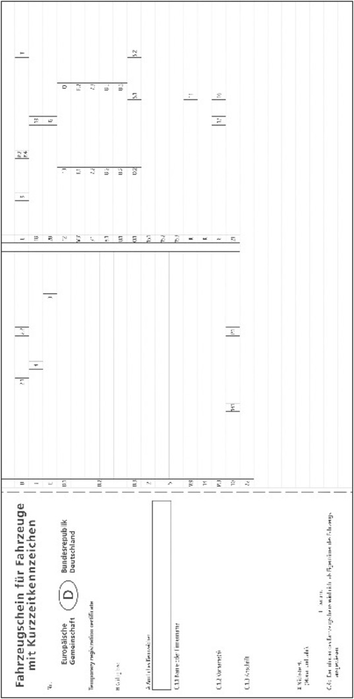
Abbildung Rückseite:

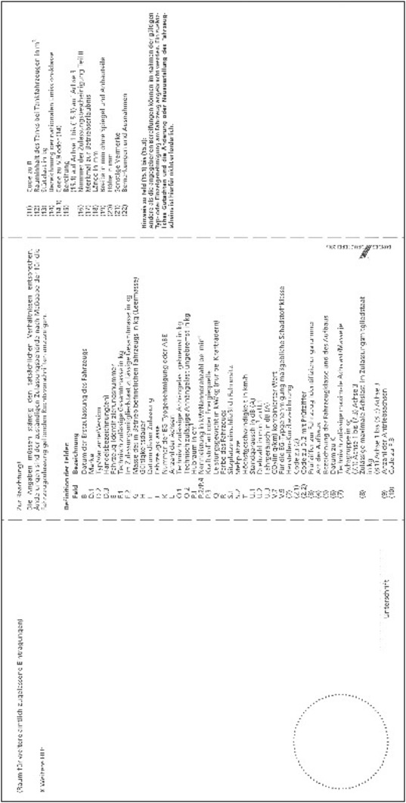
(zu § 43 Absatz 2 Satz 1)

### Anlage 15 Fahrzeugscheinheft für Oldtimerfahrzeuge mit rotem Kennzeichen
[Direktlink](https://www.gesetze-im-internet.de/fzv_2023/BJNR0C70B0023.html#BJNR0C70B0023BJNE009500000)

(Fundstelle: BGBl. 2023 I Nr. 199, S. 127)

Seite 1

*    *   Fahrzeugscheinheft
        für Oldtimerfahrzeuge mit rotem Kennzeichen nach
        § 43 FZV

*    *
    *   Das vorstehende Kennzeichen ist

    *
    *
    *

*    *
    *   Vorname, Name, Firma

    *
    *
    *

*    *
    *   Straße und Hausnummer

    *
    *
    *

*    *
    *   Postleitzahl, Wohnort/Firmensitz

    *
    *
    *

*    *
    *   für die in der Auflistung beschriebenen \_\_\_ Fahrzeuge zu den in den
        nachfolgenden Hinweisen genannten Zwecken zugeteilt worden.

    *

*    *
    *
    *
    *
    *

*    *
    *
    *
    *   Ort, Datum

    *

*    *
    *
    *
    *   Name der Zulassungsbehörde

    *

*    *
    *
    *
    *   Unterschrift

    *

   Seiten 2 ff.

*    *   lfd. Nr.

    *   Fahrzeugklasse

    *   Fahrzeughersteller

    *   FIN

    *   Hubraum

    *   Erstzulassung

    *   Zul. Gesamtmasse in kg

    *   Zul. max. Achslast in kg

    *   max.
        km/h

*    *   Vorne

    *   Mitte

    *   Hinten

*    *
    *
    *
    *
    *
    *
    *
    *
    *
    *
    *

*    *
    *
    *
    *
    *
    *
    *
    *
    *
    *
    *

   Letzte Seite

*    *
    *   Hinweise
        Rote Kennzeichen zur wiederkehrenden Verwendung für Oldtimer-Fahrzeuge

    *

*    *
    *   Zwecke
        Das rote Kennzeichen zur wiederkehrenden Verwendung wurde aufgrund der
        Vorschriften des § 43 der Fahrzeug-Zulassungsverordnung (FZV)
        zugeteilt für:

    *

*    *
    *   a)

    *   Probefahrten:

    *

*    *
    *
    *   Fahrten zur Feststellung und zum Nachweis der Gebrauchsfähigkeit des
        Fahrzeug

    *

*    *
    *   b)

    *   Überführungsfahrten:

    *

*    *
    *
    *   Fahrten, die in der Hauptsache der Überführung des Fahrzeugs an einen
        anderen Ort dienen

    *

*    *
    *   c)

    *   An- und Abfahrten sowie Teilnahme an Veranstaltungen, die der
        Darstellung von Oldtimer-Fahrzeugen und der Pflege des
        kraftfahrzeugtechnischen Kulturgutes dienen

    *

*    *
    *   d)

    *   Fahrten zum Zweck der Wartung und der Reparatur des Fahrzeugs

    *

   (zu §§ 45 Absatz 1 Satz 1 Nummer 1 Buchstabe a und 49 Absatz 3)

### Anlage 16 Bestätigung über eine dem Gesetz über die Haftpflichtversicherung für ausländische Kraftfahrzeuge und Kraftfahrzeuganhänger entsprechende Haftpflichtversicherung
[Direktlink](https://www.gesetze-im-internet.de/fzv_2023/BJNR0C70B0023.html#BJNR0C70B0023BJNE009600000)

(Fundstelle: BGBl. 2023 I Nr. 199, S. 128)

Bestätigung über eine dem Gesetz über die Haftpflichtversicherung für
ausländische Kraftfahrzeuge und Kraftfahrzeuganhänger entsprechende
Haftpflichtversicherung: Format DIN A6, Farbe: Untergrund gelb, Druck
schwarz, drei Ausfertigungen

Die Bestätigung enthält die Daten zur Kraftfahrzeug-
Haftpflichtversicherung, zum Kennzeichen, zur Fahrzeugbeschreibung und
zum Versicherungsnehmer sowie zusätzlich das Datum des Endes des
Versicherungsschutzes.

