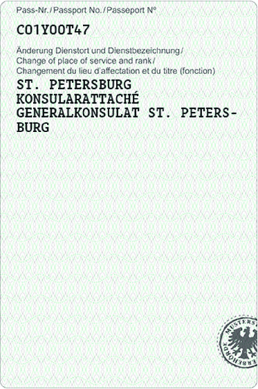
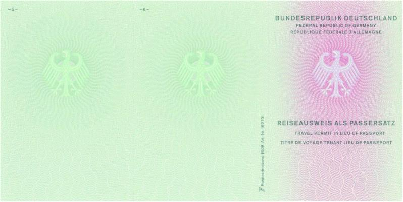
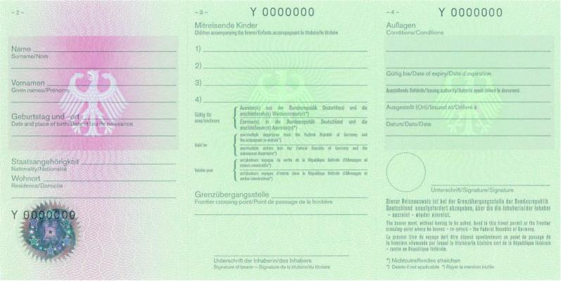
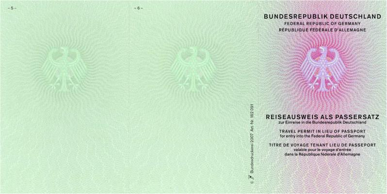
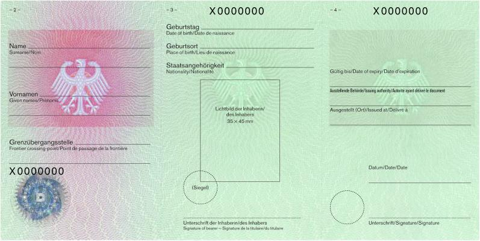

# Verordnung zur Durchführung des Passgesetzes (PassV 2007)

Ausfertigungsdatum
:   2007-10-19

Fundstelle
:   BGBl I: 2007, 2386

Stand: Zuletzt geändert Art. 2 V v. 29.10.2025 I Nr. 260
Änderung durch
:   Art. 1 V v. 30.1.2026 I Nr. 31 textlich nachgewiesen, dokumentarisch noch nicht abschließend bearbeitet

## Anlage 7a Muster des Aufklebers zur Änderung des Dienstortes oder der Dienstbezeichnung
[Direktlink](https://www.gesetze-im-internet.de/passv_2007/BJNR238610007.html#BJNR238610007BJNE003501116)

(Fundstelle: BGBl. I 2021, 3685)

*    *        

## Anlage 9
[Direktlink](https://www.gesetze-im-internet.de/passv_2007/BJNR238610007.html#BJNR238610007BJNE002900000)

   ( Fundstelle: BGBl. I 2007, 2456 - 2457 )

*    *   Reiseausweis als Passersatz

    *   Außenseiten

*    *        

*    *   Reiseausweis als Passersatz

    *   Innenseiten

*    *        

## Anlage 10
[Direktlink](https://www.gesetze-im-internet.de/passv_2007/BJNR238610007.html#BJNR238610007BJNE003000000)

   ( Fundstelle: BGBl. I 2007, 2458 - 2459 )

*    *   Reiseausweis als Passersatz
        zur Einreise in die Bundesrepublik Deutschland

    *   Außenseiten

*    *        

*    *   Reiseausweis als Passersatz
        zur Einreise in die Bundesrepublik Deutschland

    *   Innenseiten

*    *        

## Anlage 11 Formale Anforderungen an die Einträge in Pässe im Sinne des § 1 Absatz 2 des Passgesetzes
[Direktlink](https://www.gesetze-im-internet.de/passv_2007/BJNR238610007.html#BJNR238610007BJNE003606130)

   (Fundstelle: BGBl. I 2017, 221 - 225;
bzgl. der einzelnen Änderungen vgl. Fußnote)

**Vorbemerkung:**

1.  Für den Reisepass sowie für den Dienst- und Diplomatenpass gelten die
    in der nachstehenden Tabelle 1 beschriebenen Anforderungen an die
    Einträge. Die in der nachstehenden Tabelle 2 beschriebenen
    Anforderungen an die Einträge gelten für den vorläufigen Reisepass und
    für den vorläufigen Dienst- und Diplomatenpass. Für den Aufkleber zur
    Änderung des Wohnortes gelten die in der Tabelle 3 beschriebenen
    Anforderungen an Einträge, für den Aufkleber zur Eintragung amtlicher
    Vermerke die in der Tabelle 4 beschriebenen Anforderungen. Die in der
    Tabelle 5 beschriebenen Anforderungen an Einträge gelten für den
    Aufkleber zur Änderung des Dienstortes und der Dienstbezeichnung.

2.  Die Passbehörden verwenden zur Personalisierung der Aufkleber
    Personaldaten der vorläufigen Reisepässe, der vorläufigen Dienst- und
    Diplomatenpässe sowie der Aufkleber Dienstort- und
    Dienstbezeichnungsänderung, Wohnortänderung und Eintragung amtlicher
    Vermerke den Schriftfont „UnicodeDoc“. Hierfür sind
    Tintenstrahldrucker einzusetzen. Die Tinte hat die nach der ISO 1831
    geforderten Eigenschaften hinsichtlich maschineller Lesbarkeit im
    B900-Band zu erfüllen. Es ist ausschließlich solches Schreibmaterial
    zu verwenden, das nach DIN 16554 urkunden- und kopierecht ist.

3.  Als Zeichensatz ist der in der jeweils gültigen Fassung der
    Technischen Richtlinie
    des Bundesamtes für Sicherheit in der Informationstechnik, BSI:
    Technische Richtlinie TR-03123, XML-Datenaustauschformat für
    hoheitliche Dokumente (TR XhD), veröffentlichte Zeichensatz
    „String.Latin“ zu verwenden.

4.  Der maschinenlesbare Bereich in den Pässen sowie die Zugangsnummer
    (CAN) sind im Schriftfont OCR-B zu beschriften.

5.  In den Datenfeldern „Name“ (Familienname und Geburtsname) sowie
    „Vornamen“ sind alle Namensbestandteile komplett darzustellen, soweit
    dies technisch entsprechend den Vorgaben der nachstehenden Tabellen
    umsetzbar ist.

6.  Grundsätzlich sind alle Einträge in der Schriftgröße 1 gemäß den
    Vorgaben der nachstehenden Tabellen vorzunehmen:

    a)  Für den Reisepass sowie den Dienst- und Diplomatenpass gilt:

        Wird in einem Datenfeld die zur Verfügung stehende Zeichenzahl in der
        Schriftgröße 1 überschritten, sind sämtliche Zeichen des
        entsprechenden Datenfeldes in Schriftgröße 2 einzutragen. Sollte auch
        unter Ausnutzung der Schriftgröße 2 die nach Maßgabe der nachstehenden
        Tabelle 1 maximal zur Verfügung stehende Zeichenzahl nicht ausreichen,
        sind die Einträge des Datenfeldes (z. B. Vornamen) entsprechend
        gekürzt vorzunehmen.

    b)  Für den vorläufigen Reisepass sowie den vorläufigen Dienst- und
        Diplomatenpass gilt:

        Grundsätzlich sind alle Einträge in der Schriftgröße 1 im Fettsatz
        gemäß den Vorgaben der nachstehenden Tabelle 2 vorzunehmen. Einträge
        im Datenfeld „Name“ sind gemäß den Vorgaben der nachstehenden Tabelle
        2 in den Schriftgrößen 1 und 2 im Fettsatz zulässig. Einträge in den
        sonstigen Datenfeldern sind nur in der Schriftgröße 1 zulässig. Sollte
        unter Ausnutzung dieser Schriftgrößen die zur Verfügung stehende
        Zeichenzahl nicht ausreichen, sind die Einträge des Datenfeldes (zum
        Beispiel Vornamen) entsprechend gekürzt vorzunehmen.

    Unterschiedliche Schriftgrößen innerhalb eines Datenfeldes sind
    unzulässig.
    Bei der Personalisierung der Aufkleber zur Änderung der Dienstort- und
    Dienstbezeichnung sowie des Wohnortes und zur Eintragung amtlicher
    Vermerke sind die Eintragungen in der Schriftgröße 1 im Fettsatz
    vorzunehmen.

7.  Sofern neben dem Familiennamen auch ein Geburtsname vorhanden ist,
    gilt für den Reisepass sowie den Dienst- und Diplomatenpass:

    Der Geburtsname ist in das Feld „Geburtsname“ einzutragen.

    Für den vorläufigen Reisepass sowie den vorläufigen Dienst- und
    Diplomatenpass gilt:

    Der Geburtsname ist im Feld „Name“ in einer eigenen Zeile einzutragen.
    Ihm ist die Zeichenfolge „GEB.“ unter Hinzufügung eines Leerzeichens
    voranzustellen.

8.  Soweit ein oder mehrere Doktorgrade vorhanden sind, wird dieser bzw.
    werden diese im Reise-, Dienst- und Diplomatenpass in dem Datenfeld
    „Doktorgrad“, im vorläufigen Reise-, Diplomaten- und Dienstpass in dem
    Datenfeld „Name“ eingetragen. Die Anzahl der für den Namenseintrag
    vorgesehenen Zeichen verringert sich um die für die Eintragung des
    Doktorgrades bzw. der Doktorgrade benötigte Zeichenzahl, sofern diese
    Eintragung im Datenfeld „Name“ vorgenommen wird.

9.  Die alphanumerische Seriennummer des Reisepasses, Dienstpasses und
    Diplomatenpasses wird ausschließlich aus den Buchstaben C, F, G, H, J,
    K, L, M, N, P, R, T, V, W, X, Y, Z und den Ziffern 1, 2, 3, 4, 5, 6,
    7, 8, 9 gebildet.

    Beim vorläufigen Reisepass, vorläufigen Dienstpass und vorläufigen
    Diplomatenpass besteht die Seriennummer aus einem Serienbuchstaben und
    sieben Ziffern.

10. Das Lichtbild, das von der antragstellenden Person in den Abmaßen 35 x
    45 mm vorzulegen ist, ist bei der Personalisierung im vorläufigen
    Reisepass, im Dienstpass sowie im Diplomatenpass in den Abmessungen 32
    x 41 mm verkleinert darzustellen.

11. Die Schriftgröße ist am Großbuchstaben E auszurichten.

12. Die Eintragung zur Staatsangehörigkeit im Reisepass und vorläufigen
    Reisepass lautet „DEUTSCH“.

    Für Dienstpass und Diplomatenpass sowie für vorläufigen Dienstpass und
    vorläufigen Diplomatenpass gilt:

    Ist die Staatsbürgerschaft deutsch, lautet der Eintrag „DEUTSCH“. In
    allen anderen Fällen ist die Eintragung in Form des 3-Letter-Codes
    gemäß ICAO Doc 9303 (3 Zeichen) vorzunehmen.

**Tabelle 1: Reisepass, Dienst- und Diplomatenpass**

*    *   Datenfelder

    *   Anzahl der zur Verfügung stehenden Zeichen

*    *   Feld Nr.

    *   Feldbezeichnung

    *   Schriftgröße 1
        Schriftfont des Passherstellers
        Schriftgröße 2,0 mm

    *   Schriftgröße 2
        Schriftfont des Passherstellers
        Schriftgröße 1,3 mm

*    *   ohne

    *   Typ

    *   2 Zeichen pro Zeile; 1 Zeile
        (insgesamt 2 Zeichen)

    *   Nicht zulässig

*    *   ohne

    *   Kode

    *   1 Zeichen pro Zeile; 1 Zeile
        (insgesamt 1 Zeichen)

    *   Nicht zulässig

*    *   ohne

    *   Pass-Nr.

    *   9 Zeichen pro Zeile; 1 Zeile
        (insgesamt 9 Zeichen)

    *   Nicht zulässig

*    *   1

    *   [a]

    *[^F797417_01_BJNR238610007BJNE003606130]
   Name

    *   40 Zeichen pro Zeile; 2 Zeilen
        (insgesamt 80 Zeichen)

    *   62 Zeichen pro Zeile, 3 Zeilen
        (insgesamt 186 Zeichen)

*    *   [a]

    *[^F797417_02_BJNR238610007BJNE003606130]
   Name

    *   [a]

    *   40 Zeichen pro Zeile; 1 Zeile

    *   [a]

    *   62 Zeichen pro Zeile, 2 Zeilen

*    *
    *   [b]

    *   40 Zeichen pro Zeile; 1 Zeile

    *   [b]

    *   62 Zeichen pro Zeile, 1 Zeile

*    *   [b]

    *   Geburtsname

    *
    *

*    *
    *   (insgesamt 80 Zeichen)

    *   ODER

*    *
    *
    *   [a]

    *   62 Zeichen pro Zeile, 1 Zeile

*    *
    *
    *   [b]

    *   62 Zeichen pro Zeile, 2 Zeilen

*    *
    *
    *   (insgesamt 186 Zeichen)

*    *   2

    *   Vornamen

    *   40 Zeichen pro Zeile; 2 Zeilen
        (insgesamt 80 Zeichen)

    *   62 Zeichen pro Zeile, 3 Zeilen
        (insgesamt 186 Zeichen)

*    *   3

    *   Geburtstag

    *   10 Zeichen pro Zeile; 1 Zeile
        (insgesamt 10 Zeichen)

    *   Nicht zulässig

*    *   4

    *   Geschlecht

    *   1 Zeichen pro Zeile, 1 Zeile
        (insgesamt 1 Zeichen)

    *   Nicht zulässig

*    *   5

    *   Staatsangehörigkeit

    *   7 Zeichen pro Zeile, 1 Zeile
        (insgesamt 7 Zeichen)

    *   Nicht zulässig

*    *   6

    *   Geburtsort

    *   40 Zeichen pro Zeile; 1 Zeile
        (insgesamt 40 Zeichen)

    *   62 Zeichen pro Zeile, 2 Zeilen
        (insgesamt 124 Zeichen)

*    *   7

    *   Ausstellungsdatum

    *   10 Zeichen pro Zeile; 1 Zeile
        (insgesamt 10 Zeichen)

    *   Nicht zulässig

*    *   8

    *   Gültig bis

    *   10 Zeichen pro Zeile; 1 Zeile
        (insgesamt 10 Zeichen)

    *   Nicht zulässig

*    *   9

    *   Behörde

    *   28 Zeichen pro Zeile; 2 Zeilen
        (insgesamt 56 Zeichen)

    *   35 Zeichen pro Zeile; 3 Zeilen
        (insgesamt 105 Zeichen)

*    *   11

    *   Wohnort (Seite 1)

    *   35 Zeichen pro Zeile; 3 Zeilen
        (insgesamt 105 Zeichen)

    *   Nicht zulässig

*    *   12

    *   Größe (Seite 1)

    *   3 Zeichen pro Zeile; 1 Zeile
        (insgesamt 3 Zeichen)

    *   Nicht zulässig

*    *   13

    *   Augenfarbe (Seite 1)

    *   35 Zeichen pro Zeile; 1 Zeile
        (insgesamt 35 Zeichen)

    *   Nicht zulässig

*    *   14

    *   [a] Doktorgrad
        (Seite 1)

    *   [a] 31 Zeichen pro Zeile; 1 Zeile

    *   [a] Nicht zulässig

*    *   [b] Ordens- oder Künstlername
        (Seite 1)

    *   [b] 31 Zeichen pro Zeile; 1 Zeile
        (insgesamt 62 Zeichen)

    *   [b] Nicht zulässig

*    *   11

    *[^F797417_03_BJNR238610007BJNE003606130]
   Dienstort und Dienstbezeichnung
        (Seite 1)

    *   35 Zeichen pro Zeile; 9 Zeilen
        (insgesamt 315 Zeichen)

    *   Nicht zulässig

*    *   ohne

    *[^F797417_04_BJNR238610007BJNE003606130]
   Passaktennummer
        (Seite 1)

    *   35 Zeichen pro Zeile; 1 Zeile
        (insgesamt 35 Zeichen)

    *   Nicht zulässig

*    *   ohne

    *   Behörde bzw. Ausstellungsort
        (Seite 2)

    *[^F829576_01_BJNR238610007BJNE003606130]
   35 Zeichen pro Zeile; 3 Zeilen
        (insgesamt 105 Zeichen)

    *   Nicht zulässig

*    *   ohne

    *   Datum (Seite 2)

    *   18 Zeichen pro Zeile; 1 Zeile
        (insgesamt 18 Zeichen)

    *   Nicht zulässig

**Tabelle 2: Vorläufiger Reisepass, vorläufiger Dienst- und
Diplomatenpass**

*    *   Datenfelder

    *   Anzahl der zur Verfügung stehenden Zeichen

*    *   Feld Nr.

    *   Feldbezeichnung

    *   Schriftgröße 1
        UnicodeDoc, Fettdruck
        Schriftgröße 2,4 mm

    *   Schriftgröße 2
        UnicodeDoc, Fettdruck
        Schriftgröße 2,0 mm

*    *   ohne

    *   Typ

    *   2 Zeichen pro Zeile; 1 Zeile
        (insgesamt 2 Zeichen)

    *   Nicht zulässig

*    *   ohne

    *   Kode

    *   1 Zeichen pro Zeile; 1 Zeile
        (insgesamt 1 Zeichen)

    *   Nicht zulässig

*    *   ohne

    *   Pass-Nr.

    *   9 Zeichen pro Zeile, 1 Zeile

    *   Nicht zulässig

*    *   1

    *   Name

    *   36 Zeichen pro Zeile; 2 Zeilen
        (insgesamt 72 Zeichen)

    *   44 Zeichen pro Zeile; 3 Zeilen
        (insgesamt 132 Zeichen)

*    *   2

    *   Vornamen

    *   36 Zeichen pro Zeile; 1 Zeile
        (insgesamt 36 Zeichen)

    *   Nicht zulässig

*    *   3

    *   Staatsangehörigkeit

    *   7 Zeichen pro Zeile, 1 Zeile
        (insgesamt 7 Zeichen)

    *   Nicht zulässig

*    *   4

    *   Geburtstag

    *   10 Zeichen pro Zeile; 1 Zeile
        (insgesamt 10 Zeichen)

    *   Nicht zulässig

*    *   5

    *   Geschlecht

    *   1 Zeichen pro Zeile, 1 Zeile
        (insgesamt 1 Zeichen)

    *   Nicht zulässig

*    *   6

    *   Geburtsort

    *   23 Zeichen pro Zeile, 1 Zeile
        (insgesamt 23 Zeichen)

    *   Nicht zulässig

*    *   7

    *   Ausstellungsdatum

    *   10 Zeichen pro Zeile; 1 Zeile
        (insgesamt 10 Zeichen)

    *   Nicht zulässig

*    *   8

    *   Gültig bis

    *   10 Zeichen pro Zeile, 1 Zeile
        (insgesamt 10 Zeichen)

    *   Nicht zulässig

*    *   9

    *   Ausstellende Behörde

    *   23 Zeichen pro Zeile, 2 Zeilen
        (insgesamt 46 Zeichen)

    *   Nicht zulässig

*    *   11

    *   Wohnort

    *   24 Zeichen pro Zeile, 2 Zeilen
        (insgesamt 48 Zeichen)

    *   Nicht zulässig

*    *   12

    *[^F797417_05_BJNR238610007BJNE003606130]
   Größe

    *   6 Zeichen pro Zeile, 1 Zeile
        (insgesamt 6 Zeichen)

    *   Nicht zulässig

*    *   13

    *   Augenfarbe

    *   24 Zeichen pro Zeile, 1 Zeile
        (insgesamt 24 Zeichen)

    *   Nicht zulässig

*    *   14

    *   Ordens- oder Künstlername

    *   24 Zeichen pro Zeile, 1 Zeile
        (insgesamt 24 Zeichen)

    *   Nicht zulässig

*    *   ohne

    *   Ausstellende Behörde

    *   24 Zeichen pro Zeile, 2 Zeilen
        (insgesamt 48 Zeichen)

    *   Nicht zulässig

*    *   ohne

    *   Ausgestellt (Ort)

    *   25 Zeichen pro Zeile, 1 Zeile
        (insgesamt 25 Zeichen)

    *   Nicht zulässig

*    *   ohne

    *   Datum

    *   10 Zeichen pro Zeile, 1 Zeile
        (insgesamt 10 Zeichen)

    *   Nicht zulässig

**Tabelle 3: Aufkleber für Änderungen des Wohnortes**

*    *   Datenfelder des Aufklebers
        für Änderungen des Wohnortes

    *   Anzahl der zur Verfügung stehenden Zeichen

*    *   Schriftgröße 1
        UnicodeDoc, Fettdruck
        Schriftgröße 2,4 mm

*    *   Wohnort

    *   3 Zeilen à 23 Zeichen (insgesamt 69 Zeichen)

*    *   Seriennummer

    *   9 Zeichen pro Zeile;
        1 Zeile (insgesamt 9 Zeichen)

**Tabelle 4: Aufkleber für Änderungen des Wohnortes nach
elektronischer Anmeldung nach § 23a des Bundesmeldegesetzes**

*    *   Datenfelder des Aufklebers
        für Änderungen des Wohnortes
        nach elektronischer Anmeldung

    *   Anzahl der zur Verfügung stehenden Zeichen

*    *   Schriftgröße 1
        UnicodeDoc, Fettdruck
        Schriftgröße 2,4 mm

*    *   Wohnort

    *   3 Zeilen à 20 Zeichen (insgesamt 60 Zeichen)

*    *   Seriennummer

    *   9 Zeichen pro Zeile;
        1 Zeile (insgesamt 9 Zeichen)

**Tabelle 5: Aufkleber für Eintragungen amtlicher Vermerke**

*    *   Datenfelder des Aufklebers
        für Eintragungen amtlicher Vermerke

    *   Anzahl der zur Verfügung stehenden Zeichen

*    *   Schriftgröße 1
        UnicodeDoc, Fettdruck
        Schriftgröße 2,4 mm

*    *   Amtliche Vermerke

    *   18 Zeilen à 26 Zeichen und 5 Zeilen à 22 Zeichen (insgesamt 578
        Zeichen)

*    *   Seriennummer

    *   9 Zeichen pro Zeile;
        1 Zeile (insgesamt 9 Zeichen)

**Tabelle 6: Aufkleber für Änderungen des Dienstortes und der
Dienstbezeichnung bei amtlichen Pässen**

*    *   Datenfelder des Aufklebers
        für Änderungen des Dienstortes und der Dienstbezeichnung

    *   Anzahl der zur Verfügung stehenden Zeichen

*    *   Schriftgröße 1
        UnicodeDoc, Fettdruck
        Schriftgröße 2,4 mm

*    *   Dienstort/Dienstbezeichnung

    *   16 Zeilen à 26 Zeichen und 4 Zeilen à 22 Zeichen (insgesamt 504
        Zeichen)

*    *   Seriennummer

    *   9 Zeichen pro Zeile;
        1 Zeile (insgesamt 9 Zeichen)

    Fall: Es gibt keinen Geburtsnamen.
[^F797417_01_BJNR238610007BJNE003606130]:     Fall: Es gibt einen Geburtsnamen.
[^F797417_02_BJNR238610007BJNE003606130]:     Gilt nur für amtliche Pässe.
[^F797417_03_BJNR238610007BJNE003606130]:     Gilt nur für amtliche Pässe.
[^F797417_04_BJNR238610007BJNE003606130]:     Beim Diplomaten- und Dienstpass ist nur eine Zeile vorgesehen.
[^F829576_01_BJNR238610007BJNE003606130]:     Größenangabe im Format „123 CM“.
[^F797417_05_BJNR238610007BJNE003606130]: 
