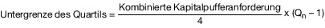
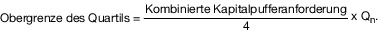
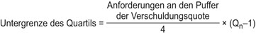
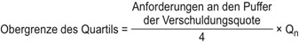

# Verordnung zur angemessenen Eigenmittelausstattung von Instituten, Institutsgruppen, Finanzholding-Gruppen und gemischten Finanzholding-Gruppen (SolvV 2014)

Ausfertigungsdatum
:   2013-12-06

Fundstelle
:   BGBl I: 2013, 4168

Zuletzt geändert durch
:   Art. 9 G v. 25.3.2026 I Nr. 81

Stand: Ersetzt V 7610-2-29 v. 14.12.2006 I 2926
[^F783290_01_BJNR416800013]:     Diese Verordnung dient der Umsetzung der Richtlinie 2013/36/EU des
    Europäischen Parlaments und des Rates vom 26. Juni 2013 über den
    Zugang zur Tätigkeit von Kreditinstituten und die Beaufsichtigung von
    Kreditinstituten und Wertpapierfirmen, zur Änderung der Richtlinie
    2002/87/EG und zur Aufhebung der Richtlinien 2006/48/EG und 2006/49/EG
    (ABl. L 176 vom 27.6.2013, S. 338) sowie der Anpassung des
    Aufsichtsrechts an die Verordnung (EU) Nr. 575/2013 des Europäischen
    Parlaments und des Rates vom 26. Juni 2013 über Aufsichtsanforderungen
    an Kreditinstitute und Wertpapierfirmen und zur Änderung der
    Verordnung (EU) Nr. 646/2012 (ABl. L 176 vom 27.6.2013, S. 1).

## Eingangsformel
[Direktlink](https://www.gesetze-im-internet.de/solvv_2014/BJNR416800013.html#BJNR416800013BJNE000100000)

Auf Grund des § 10 Absatz 1 Satz 1 und 3 des Kreditwesengesetzes, der
durch Artikel 1 Nummer 21 des Gesetzes vom 28. August 2013 (BGBl. I S.
3395) neu gefasst worden ist, sowie auf Grund des § 10a Absatz 7 Satz
1 und 3 des Kreditwesengesetzes, der durch Artikel 1 Nummer 22 des
Gesetzes vom 28. August 2013 (BGBl. I S. 3395) neu gefasst worden ist,
jeweils im Benehmen mit der Deutschen Bundesbank und nach Anhörung der
Spitzenverbände der Institute verordnet das Bundesministerium der
Finanzen:

## Teil 1 - Allgemeine Vorschriften
[Direktlink](https://www.gesetze-im-internet.de/solvv_2014/BJNR416800013.html#BJNR416800013BJNG000100000)

### § 2 Anträge und Anzeigen
[Direktlink](https://www.gesetze-im-internet.de/solvv_2014/BJNR416800013.html#BJNR416800013BJNE000400000)

(1) Anträge, über die nach der Verordnung (EU) Nr. 575/2013 die
Bundesanstalt für Finanzdienstleistungsaufsicht (Bundesanstalt) als
zuständige Behörde zu entscheiden hat, sind vorbehaltlich abweichender
Bestimmungen in schriftlicher Form bei der Bundesanstalt zu stellen.

(2) Anzeigen nach der Verordnung (EU) Nr. 575/2013, für die die
Bundesanstalt die zuständige Behörde ist, sind bei der Bundesanstalt
und in Kopie bei der Deutschen Bundesbank einzureichen.

(3) Meldungen, die aufgrund regelmäßiger Berichtspflichten nach der
Verordnung (EU) Nr. 575/2013 gegenüber der Bundesanstalt als
zuständige Behörde erfolgen müssen, sind über die Deutsche Bundesbank
einzureichen.

## Teil 2 - Nähere Bestimmungen zu den Eigenmittelanforderungen für Institute und Gruppen
[Direktlink](https://www.gesetze-im-internet.de/solvv_2014/BJNR416800013.html#BJNR416800013BJNG000200000)

### Kapitel 1 - Interne Ansätze
[Direktlink](https://www.gesetze-im-internet.de/solvv_2014/BJNR416800013.html#BJNR416800013BJNG000300000)

#### Abschnitt 1 - Allgemeine Bestimmungen
[Direktlink](https://www.gesetze-im-internet.de/solvv_2014/BJNR416800013.html#BJNR416800013BJNG000400000)

#### Abschnitt 2 - Ergänzende Regelungen zum IRB-Ansatz
[Direktlink](https://www.gesetze-im-internet.de/solvv_2014/BJNR416800013.html#BJNR416800013BJNG000500000)

##### § 16 Erheblichkeitsschwelle für den 90-Tage-Verzug
[Direktlink](https://www.gesetze-im-internet.de/solvv_2014/BJNR416800013.html#BJNR416800013BJNE001801118)

(1) Für die Zwecke der Bestimmung der Wesentlichkeit einer
überfälligen Verbindlichkeit nach Artikel 178 Absatz 1 Buchstabe b der
Verordnung (EU) Nr. 575/2013 wird die einheitliche
Erheblichkeitsschwelle für Risikopositionen aus dem Mengengeschäft im
Sinne von Artikel 1 Absatz 1 Unterabsatz 1 der Delegierten Verordnung
(EU) 2018/171 der Kommission vom 19. Oktober 2017 zur Ergänzung der
Verordnung (EU) Nr. 575/2013 des Europäischen Parlaments und des Rates
durch technische Regulierungsstandards bezüglich der
Erheblichkeitsschwelle für überfällige Verbindlichkeiten (ABl. L 32
vom 6.2.2018, S. 1) nach Maßgabe der Absätze 2 und 3 und die
einheitliche Erheblichkeitsschwelle für nicht dem Mengengeschäft
zuzuordnende Risikopositionen im Sinne von Artikel 2 Absatz 1 der
Delegierten Verordnung (EU) 2018/171 nach Maßgabe der Absätze 4 und 5
festgelegt.

(2) Die absolute Komponente der Erheblichkeitsschwelle im Sinne von
Artikel 1 Absatz 2 Unterabsatz 2 der Delegierten Verordnung (EU)
2018/171 wird nach der Maßgabe festgelegt, dass für
Kreditrisikopositionen, die der Risikopositionsklasse Risikopositionen
aus dem Mengengeschäft nach Artikel 112 Buchstabe h oder Artikel 147
Absatz 2 Buchstabe d der Verordnung (EU) Nr. 575/2013 zugeordnet
werden, der zu verwendende Höchstbetrag für die Summe aller
überfälligen Verbindlichkeiten eines Schuldners 100 Euro beträgt.
Dieser Höchstbetrag gilt auch für Risikopositionen aus dem
Mengengeschäft, wenn ein Institut gemäß Artikel 178 Absatz 1
Unterabsatz 2 der Verordnung (EU) Nr. 575/2013 die Ausfalldefinition
auf einzelne Kreditfazilitäten und nicht auf die gesamten
Verbindlichkeiten eines Kreditnehmers anwendet.

(3) Die relative Komponente der Erheblichkeitsschwelle im Sinne von
Artikel 1 Absatz 2 Unterabsatz 3 der Delegierten Verordnung (EU)
2018/171 wird nach der Maßgabe festgelegt, dass für
Kreditrisikopositionen, die der Risikopositionsklasse Risikopositionen
aus dem Mengengeschäft nach Artikel 112 Buchstabe h oder Artikel 147
Absatz 2 Buchstabe d der Verordnung (EU) Nr. 575/2013 zugeordnet
werden, der zu verwendende Prozentsatz 1 Prozent beträgt. Dieser
Prozentsatz ist auch für Risikopositionen aus dem Mengengeschäft zu
verwenden, wenn ein Institut gemäß Artikel 178 Absatz 1 Unterabsatz 2
der Verordnung (EU) Nr. 575/2013 die Ausfalldefinition auf einzelne
Kreditfazilitäten und nicht auf die gesamten Verbindlichkeiten eines
Kreditnehmers anwendet.

(4) Die absolute Komponente der Erheblichkeitsschwelle im Sinne von
Artikel 2 Absatz 2 in Verbindung mit Artikel 1 Absatz 2 Unterabsatz 2
der Delegierten Verordnung (EU) 2018/171 wird nach der Maßgabe
festgelegt, dass für Kreditrisikopositionen, die nicht unter die
Absätze 2 und 3 fallen und keine Beteiligungsrisikopositionen nach
Artikel 112 Buchstabe p oder Artikel 147 Absatz 2 Buchstabe e der
Verordnung (EU) Nr. 575/2013 sind, der zu verwendende Höchstbetrag für
die Summe aller überfälligen Verbindlichkeiten eines Schuldners 500
Euro beträgt.

(5) Die relative Komponente der Erheblichkeitsschwelle im Sinne von
Artikel 2 Absatz 2 in Verbindung mit Artikel 1 Absatz 2 Unterabsatz 3
der Delegierten Verordnung (EU) 2018/171 wird nach der Maßgabe
festgelegt, dass für Kreditrisikopositionen, die nicht unter die
Absätze 2 und 3 fallen und keine Beteiligungsrisikopositionen nach
Artikel 112 Buchstabe p oder Artikel 147 Absatz 2 Buchstabe e der
Verordnung (EU) Nr. 575/2013 sind, der zu verwendende Prozentsatz 1
Prozent beträgt.

#### Abschnitt 3 - Ergänzende Regelungen zur IMM
[Direktlink](https://www.gesetze-im-internet.de/solvv_2014/BJNR416800013.html#BJNR416800013BJNG000600000)

#### Abschnitt 4 - Ergänzende Regelungen zu internen Einstufungsverfahren
[Direktlink](https://www.gesetze-im-internet.de/solvv_2014/BJNR416800013.html#BJNR416800013BJNG000700000)

#### Abschnitt 6 - Ergänzende Regelungen zu internen Modellen für Marktrisiken
[Direktlink](https://www.gesetze-im-internet.de/solvv_2014/BJNR416800013.html#BJNR416800013BJNG000900000)

## Teil 3 - Nähere Bestimmungen zur Ermittlung der Eigenmittel
[Direktlink](https://www.gesetze-im-internet.de/solvv_2014/BJNR416800013.html#BJNR416800013BJNG001200000)

### Kapitel 1 - Nähere Bestimmungen zu den Übergangsvorschriften für die Ermittlung der Eigenmittel
[Direktlink](https://www.gesetze-im-internet.de/solvv_2014/BJNR416800013.html#BJNR416800013BJNG001300000)

#### § 27 Prozentsätze für die Anerkennung von nicht als Minderheitenbeteiligungen geltenden Instrumenten und Positionen im konsolidierten harten Kernkapital
[Direktlink](https://www.gesetze-im-internet.de/solvv_2014/BJNR416800013.html#BJNR416800013BJNE002900000)

(1) Abweichend von Teil 2 Titel III der Verordnung (EU) Nr. 575/2013
können Instrumente und Posten, die nach § 10a Absatz 6 Satz 1 und 2
und Absatz 7 Satz 1 des Kreditwesengesetzes in der bis zum 31.
Dezember 2013 geltenden Fassung zu den konsolidierten Rücklagen
gerechnet worden wären und aus einem der in Artikel 479 Absatz 1
Buchstabe a bis d der Verordnung (EU) Nr. 575/2013 aufgeführten Gründe
nicht länger als konsolidiertes hartes Kernkapital anerkennungsfähig
sind, zu den folgenden Prozentsätzen weiterhin zum konsolidierten
harten Kernkapital gerechnet werden:

1.  80 Prozent im Zeitraum vom 1. Januar 2014 bis 31. Dezember 2014;

2.  60 Prozent im Zeitraum vom 1. Januar 2015 bis 31. Dezember 2015;

3.  40 Prozent im Zeitraum vom 1. Januar 2016 bis 31. Dezember 2016;

4.  20 Prozent im Zeitraum vom 1. Januar 2017 bis 31. Dezember 2017.

(2) Abweichend von Absatz 1 dürfen Instrumente und Posten, die nach §
10a Absatz 6 Satz 10 des Kreditwesengesetzes in der bis zum 31.
Dezember 2013 geltenden Fassung zu den konsolidierten Rücklagen
gerechnet worden wären und aus einem der in Artikel 479 Absatz 1
Buchstabe a bis d der Verordnung (EU) Nr. 575/2013 aufgeführten Gründe
nicht länger als konsolidiertes hartes Kernkapital anerkennungsfähig
sind, bei der Anwendung der Regelungen von Teil 2 Titel III der
Verordnung (EU) Nr. 575/2013 im Zeitraum vom 1. Januar 2014 bis 31.
Dezember 2017 nicht mehr zum konsolidierten harten Kernkapital
gerechnet werden.

#### § 28 Faktoren für die Anerkennung von Minderheitsbeteiligungen und qualifiziertem zusätzlichem Kernkapital sowie Ergänzungskapital
[Direktlink](https://www.gesetze-im-internet.de/solvv_2014/BJNR416800013.html#BJNR416800013BJNE003000000)

Abweichend von Artikel 84 Absatz 1 Buchstabe b, Artikel 85 Absatz 1
Buchstabe b und Artikel 87 Absatz 1 Buchstabe b der Verordnung (EU)
Nr. 575/2013 sind die dort genannten Prozentsätze im Zeitraum vom 1.
Januar 2014 bis 31. Dezember 2017 mit folgenden Faktoren zu
multiplizieren:

1.  dem Faktor 0,2 im Zeitraum vom 1. Januar 2014 bis 31. Dezember 2014;

2.  dem Faktor 0,4 im Zeitraum vom 1. Januar 2015 bis 31. Dezember 2015;

3.  dem Faktor 0,6 im Zeitraum vom 1. Januar 2016 bis 31. Dezember 2016;

4.  dem Faktor 0,8 im Zeitraum vom 1. Januar 2017 bis 31. Dezember 2017.

#### § 29 Prozentsätze für Abzüge nach den Artikeln 32 bis 36, 56 und 66 der Verordnung (EU) Nr. 575/2013
[Direktlink](https://www.gesetze-im-internet.de/solvv_2014/BJNR416800013.html#BJNR416800013BJNE003100000)

(1) Abweichend von den Artikeln 32 bis 36, 56 und 66 der Verordnung
(EU) Nr. 575/2013 gelten im Zeitraum vom 1. Januar 2014 bis 31.
Dezember 2017 für die in Artikel 481 Absatz 1 der Verordnung (EU) Nr.
575/2013 von den Instituten geforderten Anpassungen für Abzüge, die
gemäß § 10 Absatz 2a Satz 2, Absatz 6 Satz 1 und 2 sowie Absatz 6a
Nummer 1, 2 und 4 des Kreditwesengesetzes in der bis zum 31. Dezember
2013 geltenden Fassung vorgeschrieben sind, folgende Prozentsätze:

1.  80 Prozent im Zeitraum vom 1. Januar 2014 bis 31. Dezember 2014;

2.  60 Prozent im Zeitraum vom 1. Januar 2015 bis 31. Dezember 2015;

3.  40 Prozent im Zeitraum vom 1. Januar 2016 bis 31. Dezember 2016 und

4.  20 Prozent im Zeitraum vom 1. Januar 2017 bis 31. Dezember 2017.

(2) Bei Anwendung der Regelungen der Artikel 32 bis 36, 56 und 66 der
Verordnung (EU) Nr. 575/2013 gilt im Zeitraum vom 1. Januar 2014 bis
31\. Dezember 2017 für die nach § 10a Absatz 6 Satz 9 des
Kreditwesengesetzes in der bis zum 31. Dezember 2013 geltenden Fassung
von den Instituten geforderte Anpassung ein Prozentsatz von 0 Prozent.

(3) Der Unterschiedsbetrag, der nach § 2 Absatz 1 der
Konzernabschlussüberleitungsverordnung in der bis zum 31. Dezember
2013 geltenden Fassung im Ergänzungskapital berücksichtigungsfähig
ist, kann im Zeitraum vom 1. Januar 2014 bis 31. Dezember 2017
multipliziert mit den folgenden Prozentsätzen weiterhin dem
Ergänzungskapital zugerechnet werden:

1.  80 Prozent im Zeitraum vom 1. Januar 2014 bis 31. Dezember 2014;

2.  60 Prozent im Zeitraum vom 1. Januar 2015 bis 31. Dezember 2015;

3.  40 Prozent im Zeitraum vom 1. Januar 2016 bis 31. Dezember 2016 und

4.  20 Prozent im Zeitraum vom 1. Januar 2017 bis 31. Dezember 2017.

#### § 30 Prozentsatz für die Anpassung nach Artikel 36 Absatz 1 Buchstabe i und Artikel 49 Absatz 1 und 3 der Verordnung (EU) Nr. 575/2013
[Direktlink](https://www.gesetze-im-internet.de/solvv_2014/BJNR416800013.html#BJNR416800013BJNE003200000)

Abweichend von Artikel 36 Absatz 1 Buchstabe i
und Artikel 49 Absatz 1 und 3 der Verordnung (EU) Nr. 575/2013 gilt
für die in Artikel 481 Absatz 2 der Verordnung (EU) Nr. 575/2013
genannte Ausnahme vom Abzug im Zeitraum vom 1. Januar 2014 bis 31.
Dezember 2014 ein Prozentsatz von 50 Prozent.

#### § 31 Prozentsätze für die Begrenzung der unter Bestandsschutz fallenden Instrumente des harten Kernkapitals, zusätzlichen Kernkapitals und Ergänzungskapitals nach Artikel 484 Absatz 3 bis 5 der Verordnung (EU) Nr. 575/2013
[Direktlink](https://www.gesetze-im-internet.de/solvv_2014/BJNR416800013.html#BJNR416800013BJNE003300000)

Für die Anwendung des Artikels 484 Absatz 3 bis 5 der Verordnung (EU)
Nr. 575/2013 gelten im Zeitraum vom 1. Januar 2014 bis 31. Dezember
2021 für die Anerkennung der unter Bestandsschutz fallenden
Instrumente und Posten des harten Kernkapitals, des zusätzlichen
Kernkapitals und des Ergänzungskapitals folgende Prozentsätze:

1.  80 Prozent im Zeitraum vom 1. Januar 2014 bis 31. Dezember 2014;

2.  70 Prozent im Zeitraum vom 1. Januar 2015 bis 31. Dezember 2015;

3.  60 Prozent im Zeitraum vom 1. Januar 2016 bis 31. Dezember 2016;

4.  50 Prozent im Zeitraum vom 1. Januar 2017 bis 31. Dezember 2017;

5.  40 Prozent im Zeitraum vom 1. Januar 2018 bis 31. Dezember 2018;

6.  30 Prozent im Zeitraum vom 1. Januar 2019 bis 31. Dezember 2019;

7.  20 Prozent im Zeitraum vom 1. Januar 2020 bis 31. Dezember 2020;

8.  10 Prozent im Zeitraum vom 1. Januar 2021 bis 31. Dezember 2021.

### Kapitel 2 - Behandlung der nach der Äquivalenzmethode bewerteten Beteiligungen bei Gruppen
[Direktlink](https://www.gesetze-im-internet.de/solvv_2014/BJNR416800013.html#BJNR416800013BJNG001400000)

## Teil 4 - Nähere Bestimmungen zu den Kapitalpuffern
[Direktlink](https://www.gesetze-im-internet.de/solvv_2014/BJNR416800013.html#BJNR416800013BJNG001501311)

### Kapitel 1 - Antizyklischer Kapitalpuffer
[Direktlink](https://www.gesetze-im-internet.de/solvv_2014/BJNR416800013.html#BJNR416800013BJNG001600000)

#### § 33 Festlegung der Quote für den inländischen antizyklischen Kapitalpuffer
[Direktlink](https://www.gesetze-im-internet.de/solvv_2014/BJNR416800013.html#BJNR416800013BJNE003500000)

(1) Zur Festlegung der Quote für den inländischen antizyklischen
Kapitalpuffer gemäß § 10d des Kreditwesengesetzes ermittelt die
Bundesanstalt quartalsweise einen Puffer-Richtwert. Dieser spiegelt in
aussagekräftiger Form den Kreditzyklus und die durch ein übermäßiges
Kreditwachstum bedingten Risiken im Inland wider und trägt den
spezifischen volkswirtschaftlichen Gegebenheiten im Geltungsbereich
des Kreditwesengesetzes Rechnung. Der Puffer-Richtwert basiert auf der
Abweichung des Verhältnisses der im Inland gewährten Kredite zum
Bruttoinlandsprodukt (Kredite-BIP-Verhältnis) vom langfristigen Trend.
Bei der Festlegung des Puffer-Richtwerts berücksichtigt die
Bundesanstalt:

1.  einen Indikator für das Kreditwachstum im Inland und insbesondere
    einen Indikator, der Veränderungen des Kredite-BIP-Verhältnisses
    widerspiegelt;

2.  etwaige Empfehlungen zur Messung und Berechnung der Abweichung des
    Kredite-BIP-Verhältnisses vom langfristigen Trend sowie zur Ermittlung
    der Puffer-Richtwerte des Europäischen Ausschusses für Systemrisiken
    nach Artikel 16 der Verordnung (EU) Nr. 1092/2010 des Europäischen
    Parlaments und des Rates vom 24. November 2010 über die Finanzaufsicht
    der Europäischen Union auf Makroebene und zur Errichtung eines
    Europäischen Ausschusses für Systemrisiken (ABl. L 331 vom 15.12.2010,
    S. 1) in der jeweils geltenden Fassung.

(2) Bei der Festlegung und Bewertung der Quote für den antizyklischen
Kapitalpuffer berücksichtigt die Bundesanstalt darüber hinaus alle
etwaigen Empfehlungen, die der Europäische Ausschuss für Systemrisiken
gemäß Artikel 135 Absatz 1 der Richtlinie 2013/36/EU des Europäischen
Parlaments und des Rates vom 26. Juni 2013 über den Zugang zur
Tätigkeit von Kreditinstituten und die Beaufsichtigung von
Kreditinstituten und Wertpapierfirmen, zur Änderung der Richtlinie
2002/87/EG und zur Aufhebung der Richtlinien 2006/48/EG und 2006/49/EG
(ABl. L 176 vom 27.6.2013, S. 338) abgibt.

#### § 35 Zusätzliche Veröffentlichungen für Quoten in Drittstaaten
[Direktlink](https://www.gesetze-im-internet.de/solvv_2014/BJNR416800013.html#BJNR416800013BJNE003700000)

Die Bundesanstalt veröffentlicht zusätzlich zu den Angaben, die nach §
10d Absatz 9 des Kreditwesengesetzes zu veröffentlichen sind, im Falle
des § 10d Absatz 6 des Kreditwesengesetzes eine Begründung für die
Anerkennung der von einem Drittstaat festgelegten Quote für den
antizyklischen Kapitalpuffer und in den Fällen des § 10d Absatz 7 und
8 des Kreditwesengesetzes eine Begründung für die Festlegung der Quote
für den antizyklischen Kapitalpuffer.

#### § 36 Maßgebliche Risikopositionen
[Direktlink](https://www.gesetze-im-internet.de/solvv_2014/BJNR416800013.html#BJNR416800013BJNE003800000)

(1) Zu den maßgeblichen Risikopositionen im Sinne von § 10d Absatz 2
des Kreditwesengesetzes zählt jede Risikoposition, die keiner der
Forderungsklassen des Artikels 112 Buchstabe a bis f der Verordnung
(EU) Nr. 575/2013 angehört und für die eine der nachfolgenden
Bedingungen erfüllt ist:

1.  sie unterliegt den Eigenmittelanforderungen für Kreditrisiken gemäß
    den Artikeln 107 bis 311 der Verordnung (EU) Nr. 575/2013,

2.  wird die Risikoposition im Handelsbuch geführt, sind die
    Eigenmittelanforderungen für spezifische Risiken gemäß den Artikeln
    326 bis 350 oder für zusätzliche Ausfall- und Migrationsrisiken gemäß
    den Artikeln 362 bis 377 der Verordnung (EU) Nr. 575/2013 anzuwenden,

3.  handelt es sich bei der Risikoposition um eine Verbriefung, so sind
    die Eigenmittelanforderungen gemäß den Artikeln 242 bis 270 der
    Verordnung (EU) Nr. 575/2013 anzuwenden.

(2) Für die Zwecke der in § 10d Absatz 2 des Kreditwesengesetzes
vorgeschriebenen Berechnung

1.  ist die geänderte Quote für den antizyklischen Kapitalpuffer für einen
    Staat des Europäischen Wirtschaftsraums im Falle ihrer Erhöhung ab dem
    Datum anzuwenden, das in den nach § 34 oder nach § 10d Absatz 9 des
    Kreditwesengesetzes veröffentlichten Informationen angegeben ist;

2.  ist eine geänderte Quote für den antizyklischen Kapitalpuffer für
    einen Drittstaat im Falle ihrer Erhöhung vorbehaltlich Nummer 3 ab dem
    Tag anzuwenden, der zwölf Monate nach dem Datum liegt, an dem die
    zuständige Behörde in dem Drittstaat eine Änderung der Quote für den
    antizyklischen Kapitalpuffer bekannt gegeben hat, unabhängig davon, ob
    diese Behörde von den Instituten mit Sitz in dem betreffenden
    Drittstaat verlangt, diese Änderung innerhalb einer kürzeren Frist
    anzuwenden;

3.  ist die jeweilige Quote für den antizyklischen Kapitalpuffer in
    Fällen, in denen die Bundesanstalt die Quote für den antizyklischen
    Kapitalpuffer für einen Drittstaat festlegt oder die für einen
    Drittstaat geltende Quote für den antizyklischen Kapitalpuffer
    anerkennt und die Festlegung oder Anerkennung zu einer Erhöhung der
    bisher jeweils geltenden Quote führt, ab dem Datum anzuwenden, das in
    den gemäß § 10d Absatz 9 des Kreditwesengesetzes veröffentlichten
    Informationen angegeben ist;

4.  gilt eine Quote für den antizyklischen Kapitalpuffer bei einer
    Herabsetzung der Quote ab der Entscheidung über die Herabsetzung der
    Quote.

Für die Zwecke des Satzes 1 Nummer 2 gilt eine Änderung der Quote für
den antizyklischen Kapitalpuffer für einen Drittstaat ab dem Datum als
bekannt gegeben, an dem sie von der zuständigen Behörde in diesem
Drittstaat nach den dort geltenden einzelstaatlichen Vorschriften
veröffentlicht wird.

(3) Die Belegenheit eines wesentlichen Kreditengagements nach § 10d
Absatz 2 des Kreditwesengesetzes bestimmt das Institut unter
Berücksichtigung etwaiger Rechtsakte, die von der Europäischen
Kommission hierzu auf der Grundlage der Verordnung (EU) Nr. 1093/2010
des Europäischen Parlaments und des Rates vom 24. November 2010 zur
Errichtung einer Europäischen Aufsichtsbehörde (Europäische
Bankenaufsichtsbehörde), zur Änderung des Beschlusses Nr. 716/2009/EG
und zur Aufhebung des Beschlusses 2009/78/EG der Kommission (ABl. L
331 vom 15.12.2010, S. 12) in der jeweils geltenden Fassung erlassen
wurden.

### Kapitel 2 - Kapitalpuffer für systemische Risiken
[Direktlink](https://www.gesetze-im-internet.de/solvv_2014/BJNR416800013.html#BJNR416800013BJNG001900311)

### Kapitel 3 - Kombinierte Kapitalpufferanforderung
[Direktlink](https://www.gesetze-im-internet.de/solvv_2014/BJNR416800013.html#BJNR416800013BJNG001701311)

#### § 37 Maximal ausschüttungsfähiger Betrag
[Direktlink](https://www.gesetze-im-internet.de/solvv_2014/BJNR416800013.html#BJNR416800013BJNE003901311)

(1) Der maximal ausschüttungsfähige Betrag im Sinne des § 10i Absatz 3
des Kreditwesengesetzes errechnet sich durch Multiplikation des nach
Absatz 2 berechneten Betrags mit dem gemäß Absatz 3 festgelegten
Faktor. Er reduziert sich durch jede nach § 10i Absatz 3 Satz 3 Nummer
1 bis 3 des Kreditwesengesetzes durchgeführte Maßnahme.

(2) Der zu multiplizierende Betrag ergibt sich aus

1.  den Zwischengewinnen, die nicht im harten Kernkapital gemäß Artikel 26
    Absatz 2 der Verordnung (EU) Nr. 575/2013 enthalten sind, abzüglich
    etwaiger Gewinnausschüttungen oder Zahlungen infolge einer Maßnahme
    gemäß § 10i Absatz 3 Satz 3 Nummer 1 bis 3 des Kreditwesengesetzes,

2.  zuzüglich der Gewinne zum Jahresende, die nicht im harten Kernkapital
    gemäß Artikel 26 Absatz 2 der Verordnung (EU) Nr. 575/2013 enthalten
    sind, abzüglich etwaiger Gewinnausschüttungen oder Zahlungen infolge
    einer Maßnahme gemäß § 10i Absatz 3 Satz 3 Nummer 1 bis 3 des
    Kreditwesengesetzes,

3.  abzüglich der Beträge, die in Form von Steuern zu zahlen wären, wenn
    die unter den Nummern 1 und 2 aufgeführten Gewinne einbehalten würden.

(3) Liegt das von dem Institut vorgehaltene und nicht zur Einhaltung
der Eigenmittelanforderungen nach Artikel 92 Absatz 1 Buchstabe a, b
und c der Verordnung (EU) Nr. 575/2013, der zusätzlichen
Eigenmittelanforderungen zur Abdeckung anderer Risiken als des Risikos
einer übermäßigen Verschuldung nach § 6c des Kreditwesengesetzes und
der erhöhten Eigenmittelanforderungen nach § 10 Absatz 3 und 4 des
Kreditwesengesetzes verwendete harte Kernkapital, ausgedrückt als
Prozentsatz des Gesamtrisikobetrags im Sinne von Artikel 92 Absatz 3
der Verordnung (EU) Nr. 575/2013, innerhalb des

1.  ersten (das heißt des untersten) Quartils der kombinierten
    Kapitalpufferanforderung, so beträgt der Faktor 0;

2.  zweiten Quartils der kombinierten Kapitalpufferanforderung, so beträgt
    der Faktor 0,2;

3.  dritten Quartils der kombinierten Kapitalpufferanforderung, so beträgt
    der Faktor 0,4;

4.  obersten Quartils der kombinierten Kapitalpufferanforderung, so
    beträgt der Faktor 0,6.

(4) Die Ober- und Untergrenzen für jedes Quartil der kombinierten
Kapitalpufferanforderung werden wie folgt berechnet:
„Q
n“ steht für die Ordinalzahl des betreffenden Quartils.

### Kapitel 4 - Puffer der Verschuldungsquote
[Direktlink](https://www.gesetze-im-internet.de/solvv_2014/BJNR416800013.html#BJNR416800013BJNG001702128)

#### § 37a Maximal ausschüttungsfähiger Betrag in Bezug auf die Verschuldungsquote
[Direktlink](https://www.gesetze-im-internet.de/solvv_2014/BJNR416800013.html#BJNR416800013BJNE003902128)

(1) Der maximal ausschüttungsfähige Betrag in Bezug auf die
Verschuldungsquote im Sinne des § 10j Absatz 3 Satz 1 des
Kreditwesengesetzes errechnet sich durch Multiplikation des nach
Absatz 2 berechneten Betrags mit dem nach Absatz 3 festgelegten
Faktor. Er reduziert sich durch jede nach § 10j Absatz 3 Satz 4 Nummer
1 bis 3 des Kreditwesengesetzes durchgeführte Maßnahme.

(2) Der zu multiplizierende Betrag ergibt sich aus

1.  den Zwischengewinnen, die nicht im harten Kernkapital nach Artikel 26
    Absatz 2 der Verordnung (EU) Nr. 575/2013 enthalten sind, abzüglich
    etwaiger Gewinnausschüttungen oder Zahlungen im Zusammenhang mit den
    Maßnahmen nach § 10j Absatz 3 Satz 4 Nummer 1 bis 3 des
    Kreditwesengesetzes,

2.  zuzüglich der Gewinne zum Jahresende, die nicht im harten Kernkapital
    nach Artikel 26 Absatz 2 der Verordnung (EU) Nr. 575/2013 enthalten
    sind, abzüglich etwaiger Gewinnausschüttungen oder Zahlungen im
    Zusammenhang mit den Maßnahmen nach § 10j Absatz 3 Satz 4 Nummer 1 bis
    3 des Kreditwesengesetzes,

3.  abzüglich der Beträge, die in Form von Steuern zu zahlen wären, wenn
    die unter den Nummern 1 und 2 aufgeführten Gewinne einbehalten würden.

(3) Liegt das von dem global systemrelevanten Institut vorgehaltene
und nicht zur Einhaltung der Eigenmittelanforderungen nach Artikel 92
Absatz 1 Buchstabe d der Verordnung (EU) Nr. 575/2013 und zur
Einhaltung der zusätzlichen Eigenmittelanforderungen zur Absicherung
gegen Risiken einer übermäßigen Verschuldung nach § 6c sowie nach § 10
Absatz 3 und 4 des Kreditwesengesetzes verwendete Kernkapital,
ausgedrückt als Prozentsatz der Gesamtrisikopositionsmessgröße im
Sinne von Artikel 429 Absatz 4 der Verordnung (EU) Nr. 575/2013,
innerhalb des

1.  ersten, das heißt des untersten, Quartils der Anforderung an den
    Puffer der Verschuldungsquote, so beträgt der Faktor 0;

2.  zweiten Quartils der Anforderung an den Puffer der Verschuldungsquote,
    so beträgt der Faktor 0,2;

3.  dritten Quartils der Anforderung an den Puffer der Verschuldungsquote,
    so beträgt der Faktor 0,4;

4.  vierten, das heißt des obersten, Quartils der Anforderung an den
    Puffer der Verschuldungsquote, so beträgt der Faktor 0,6.

(4) Die Ober- und Untergrenzen für jedes Quartil der Anforderung an
den Puffer der Verschuldungsquote sind wie folgt zu berechnen:

*    *        

*    *        

*    *

   Dabei steht Q
n für die Ordinalzahl des betreffenden Quartils.

## Teil 5 - Übergangs- und Schlussbestimmungen
[Direktlink](https://www.gesetze-im-internet.de/solvv_2014/BJNR416800013.html#BJNR416800013BJNG001800000)

### § 39 Inkrafttreten, Außerkrafttreten
[Direktlink](https://www.gesetze-im-internet.de/solvv_2014/BJNR416800013.html#BJNR416800013BJNE004101118)

Diese Verordnung tritt am 1. Januar 2014 in Kraft. Gleichzeitig tritt
die Solvabilitätsverordnung vom 14. Dezember 2006 (BGBl. I S. 2926),
die zuletzt durch Artikel 6 der Verordnung vom 20. September 2013
(BGBl. I S. 3672) geändert worden ist, außer Kraft. § 1 Absatz 2 Satz
2 ist ab dem 1. Oktober 2016 anzuwenden.

